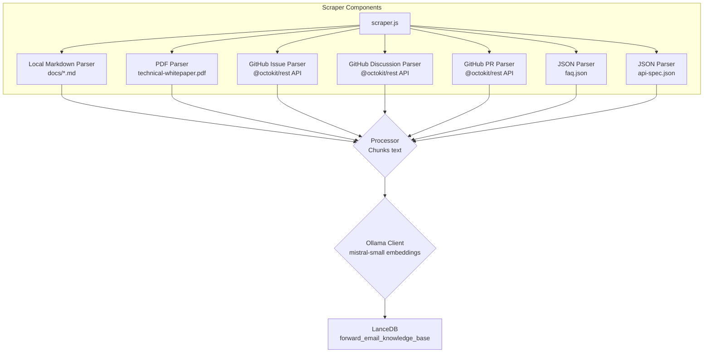

# Building a Privacy-First AI Customer Support Agent with LanceDB, Ollama, and Node.js

> [!NOTE]
> This doc covers our journey building a self-hosted AI support agent. We wrote about similar challenges in our [Email Startup Graveyard](https://forwardemail.net/blog/docs/email-startup-graveyard-why-80-percent-email-companies-fail) blog post. We honestly thought about writing a follow-up called "AI Startup Graveyard" but maybe we'll have to wait another year or so until the AI bubble potentially bursts(?). For now, this is our brain dump of what worked, what didn't, and why we did it this way.

This is how we built our own AI customer support agent. We did it the hard way: self-hosted, privacy-first, and completely under our control. Why? Because we don't trust third-party services with our customers' data. It's a GDPR and DPA requirement, and it's the right thing to do.

This wasn't a fun weekend project. It was a month-long journey navigating broken dependencies, misleading documentation, and the general chaos of the open-source AI ecosystem in 2025. This doc is a record of what we built, why we built it, and the roadblocks we hit along the way.

## A Personal Reflection: The Two-Decade Grind

Before we dive into the technical weeds, a personal note. I’ve been at this for nearly two decades. The endless hours at the keyboard, the relentless pursuit of a solution, the deep, focused grind – this is the reality of building anything meaningful. It’s a reality that’s often glossed over in the hype cycles of new technology.

The recent explosion of AI has been particularly frustrating. We’re sold a dream of automation, of AI assistants that will write our code and solve our problems. The reality? The output is often dumpster-garbage code that requires more time to fix than it would have taken to write from scratch. The promise of making our lives easier is a false one. It’s a distraction from the hard, necessary work of building.

And then there’s the catch-22 of contributing to open-source. You’re already spread thin, exhausted from the grind. You use an AI to help you write a detailed, well-structured bug report, hoping to make it easier for maintainers to understand and fix the issue. And what happens? You get scolded. Your contribution is dismissed as “off-topic” or low-effort, as we saw in a recent [Node.js GitHub issue](https://github.com/nodejs/node/issues/60719#issuecomment-3534304321). It’s a slap in the face to senior developers who are just trying to help.

This is the reality of the ecosystem we’re working in. It’s not just about broken tools; it’s about a culture that often fails to respect the time and effort of its contributors. This post is a chronicle of that reality. It’s a story about the tools, yes, but it’s also about the human cost of building in a broken ecosystem that is, for all its promise, fundamentally broken.

## Why Privacy Matters

Our [technical whitepaper](https://forwardemail.net/technical-whitepaper.pdf) covers our privacy philosophy in depth. The short version: we don't send customer data to third parties. Ever. That means no OpenAI, no Anthropic, no cloud-hosted vector databases. Everything runs locally on our infrastructure. This is non-negotiable for GDPR compliance and our DPA commitments.

## System Requirements

- **Node.js:** v18.0.0+ ([GitHub](https://github.com/nodejs/node))
- **Ollama:** Latest ([GitHub](https://github.com/ollama/ollama))
- **Model:** `mistral-small` via Ollama
- **Vector Database:** LanceDB ([GitHub](https://github.com/lancedb/lancedb))
- **GitHub Access:** `@octokit/rest` for scraping issues ([GitHub](https://github.com/octokit/rest.js))
- **SQLite:** For primary database (via `mongoose-to-sqlite`)

## The Architecture

Here's the basic flow. It looks simple. It wasn't.

### High-Level Flow

```mermaid
graph TD
    subgraph Data Ingestion (Nightly Job)
        A[Data Sources] --> B{Scraper};
        B --> C{Processor<br>Chunks text};
        C --> D{Ollama Client<br>Generates embeddings};
        D --> E[LanceDB<br>Vector Store];
    end

    subgraph Live Email Processing
        F[New Email] --> G{Email Scanner};
        G --> H{Response Generator};
        H -- Query --> E;
        E -- Context --> H;
        H -- Generates --> I[Email Response];
    end
```

### Detailed Scraper Flow

The `scraper.js` is the heart of the data ingestion. It's a collection of parsers for different data formats.



## How It Works

The process is split into two main parts: building the knowledge base and using it.

### Building the Knowledge Base

**`update-knowledge-base.js`**: This is the main job. It runs nightly, clears the old vector store, and rebuilds it from scratch. It uses `scraper.js` to fetch content from all sources, `processor.js` to chunk it, and `ollama-client.js` to generate embeddings. Finally, `vector-store.js` stores everything in LanceDB.

**Data Sources:**
- Local Markdown files (`docs/*.md`)
- Technical whitepaper PDF (`assets/technical-whitepaper.pdf`)
- FAQ JSON (`assets/faq.json`)
- API spec JSON (`assets/api-spec.json`)
- GitHub issues (via Octokit)
- GitHub discussions (via Octokit)
- GitHub pull requests (via Octokit)

### Processing Incoming Emails

**`process-inbox.js`**: This job runs on new incoming emails. It analyzes the email content, queries both the knowledge base (`forward_email_knowledge_base`) and the historical email vector store (`customer_support_history`), and then passes the combined context to `response-generator.js`. The generator uses `mistral-small` via Ollama to craft a response.

The system uses **weighted ranking** to prioritize sources:
- FAQ: 100% (highest priority)
- Technical whitepaper: 95%
- API spec: 90%
- Official docs: 85%
- GitHub issues: 70%
- Historical emails: 50%

### Vector Store Management

The `VectorStore` class in `helpers/customer-support-ai/vector-store.js` is our interface to LanceDB.

**Adding Documents:**
```javascript
// vector-store.js
async addDocument(text, metadata) {
  const embedding = await this.ollama.generateEmbedding(text);
  await this.table.add([{
    vector: embedding,
    text,
    ...metadata
  }]);
}
```

**Clearing the Store:**
```javascript
// Option 1: Use the clear() method
await vectorStore.clear();

// Option 2: Delete the local database directory
await fs.rm(process.env.LANCEDB_PATH, { recursive: true, force: true });
```

The `LANCEDB_PATH` environment variable points to the local embedded database directory. LanceDB is serverless and embedded, so there's no separate process to manage.

## The Vector Database Graveyard

This was the first major roadblock. We tried multiple vector databases before settling on LanceDB. Here's what went wrong with each one.

| Database | GitHub | What Went Wrong | Specific Issues |
|----------|--------|-----------------|-----------------|
| **ChromaDB** | [chroma-core/chroma](https://github.com/chroma-core/chroma) | `pip3 install chromadb` gives you a version from the stone age with `PydanticImportError`. The only way to get a working version is to compile from source. Not dev-friendly. | Python dependency chaos. Multiple users reporting broken pip installs. The docs say "just use Docker" which is a non-answer for local development. |
| **Qdrant** | [qdrant/qdrant](https://github.com/qdrant/qdrant) | The Homebrew tap (`qdrant/qdrant/qdrant`) referenced in their old docs is gone. Vanished. No explanation. The official docs now just say "use Docker." | Missing Homebrew tap. No native macOS binary. Docker-only is a barrier for quick local testing. |
| **Weaviate** | [weaviate/weaviate](https://github.com/weaviate/weaviate) | The Homebrew version had a critical clustering bug (`leader not found`). The documented flags to fix it (`RAFT_JOIN`, `CLUSTER_HOSTNAME`) didn't work. Fundamentally broken for single-node setups. | Clustering bugs even in single-node mode. Over-engineered for simple use cases. |
| **LanceDB** | [lancedb/lancedb](https://github.com/lancedb/lancedb) | This one worked. It's embedded and serverless. No separate process. The only annoyance is the confusing package naming (`vectordb` is deprecated, use `@lancedb/lancedb`) and scattered docs. We can live with that. | Package naming confusion, but otherwise solid. |

> [!WARNING]
> The open-source vector database ecosystem is rough. Don't trust the documentation. Assume everything is broken until proven otherwise. Test locally before committing to a stack.

## Code Examples

### Scraping and Processing

```javascript
// jobs/customer-support-ai/update-knowledge-base.js
const scraper = new Scraper();
const processor = new Processor();
const ollamaClient = new OllamaClient();
const vectorStore = new VectorStore();

// Clear old data
await vectorStore.clear();

// Scrape all sources
const documents = await scraper.scrapeAll();
console.log(`Scraped ${documents.length} documents`);

// Process into chunks
const allChunks = [];
for (const doc of documents) {
  const chunks = processor.processDocuments([doc]);
  allChunks.push(...chunks);
}
console.log(`Generated ${allChunks.length} chunks`);

// Generate embeddings and store
const texts = allChunks.map(chunk => chunk.text);
const embeddings = await ollamaClient.generateEmbeddings(texts);

for (let i = 0; i < allChunks.length; i++) {
  await vectorStore.addDocument(texts[i], {
    ...allChunks[i].metadata,
    embedding: embeddings[i]
  });
}
```

### Querying for Context

```javascript
// jobs/customer-support-ai/process-inbox.js
const vectorStore = new VectorStore();
const historyVectorStore = new VectorStore({ 
  collectionName: 'customer_support_history' 
});

// Query both stores
const knowledgeContext = await vectorStore.query(emailEmbedding, { limit: 8 });
const historyContext = await historyVectorStore.query(emailEmbedding, { limit: 3 });

// Weighted ranking and deduplication happen here
const rankedContext = rankAndDeduplicateContext(knowledgeContext, historyContext);

// Generate response
const response = await responseGenerator.generate(email, rankedContext);
```

## The Future: Spam Scanner R&D

This whole project wasn't just for customer support. It was R&D. We can now take everything we learned about local embeddings, vector stores, and context retrieval and apply it to our next big project: the LLM layer for [Spam Scanner](https://spamscanner.net). The same principles of privacy, self-hosting, and semantic understanding will be key.

## Key Takeaways

1. **Privacy first:** Self-hosting is non-negotiable for GDPR/DPA compliance.
2. **The ecosystem is broken:** Most vector databases are not dev-friendly. Test everything locally.
3. **LanceDB works:** It's embedded, serverless, and doesn't require a separate process.
4. **Ollama is solid:** Local LLM inference with `mistral-small` works well for our use case.
5. **Type mismatches will kill you:** `text` vs. `content`, ObjectID vs. string. These bugs are silent and brutal.
6. **Weighted ranking matters:** Not all context is equal. FAQ > GitHub issues.

This is a living document. We'll update it as we continue to improve the system.
