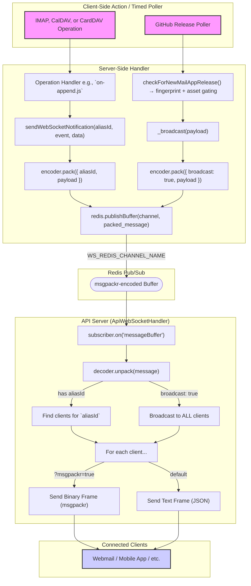

# Real-Time API Notifications via WebSocket

This document outlines the WebSocket server implementation for the API, which provides real-time push notifications for all IMAP, CalDAV, and CardDAV operations, as well as global app update events.


## Table of Contents

* [Architecture](#architecture)
  * [Notification Flow](#notification-flow)
  * [Client-Controlled Encoding](#client-controlled-encoding)
* [Enriched Payloads](#enriched-payloads)
* [Supported Events](#supported-events)
* [Security](#security)
* [Authentication](#authentication)
  * [Authentication Methods](#authentication-methods)
  * [Connection Responses](#connection-responses)
  * [Important Notes](#important-notes)
* [Client Integration](#client-integration)
  * [Browser (JSON)](#browser-json)
  * [Node.js (JSON)](#nodejs-json)
  * [Node.js (msgpackr)](#nodejs-msgpackr)
* [Troubleshooting](#troubleshooting)
  * [Issue: Receiving `broadcastOnly: true` when expecting authentication](#issue-receiving-broadcastonly-true-when-expecting-authentication)
  * [Issue: 401 Unauthorized error](#issue-401-unauthorized-error)
  * [Issue: Not receiving per-alias events](#issue-not-receiving-per-alias-events)
  * [Issue: Connection closes immediately](#issue-connection-closes-immediately)
  * [Issue: Not receiving any events](#issue-not-receiving-any-events)


## Architecture

The WebSocket server is integrated into the main API server, listening for HTTP upgrade requests on the `/v1/ws` path. Authentication is optional and, when provided, happens during the upgrade handshake before a connection is established. Unauthenticated clients are accepted and receive only global broadcast events (e.g. `newRelease`), while authenticated clients receive both per-alias events and broadcast events.

The system supports two notification types:

1. **Per-Alias Notifications**: When a state-changing operation occurs for a specific alias (e.g., a new email arrives, a calendar event is updated), the responsible handler calls `sendWebSocketNotification`. This function publishes a `msgpackr`-encoded message to a dedicated Redis pub/sub channel, scoped to a specific `aliasId`.
2. **Broadcast Notifications**: A background poller periodically checks for new releases of the [Forward Email Mail App](https://github.com/forwardemail/mail.forwardemail.net). If a new release is found (or an existing one is updated), the `ApiWebSocketHandler` broadcasts a `newRelease` event to **all** connected clients.

A subscriber on each API server instance listens to the Redis channel and forwards the notification to the appropriate WebSocket clients based on the delivery mode (per-alias or broadcast).

To detect updates to an existing release (e.g., when a GitHub Actions workflow adds compiled assets after initial publication), the poller computes and stores a **content fingerprint** of the release in Redis. This fingerprint is a SHA-256 hash of the tag name, body content, and a sorted list of asset names and sizes. Any change to these properties will result in a new fingerprint, triggering a `newRelease` broadcast even if the tag name remains the same.

**Asset Gating**: When a new release is detected but has no assets yet, the broadcast is deferred. The poller stores the tag as "pending" and waits. Once assets appear (detected by a change in the fingerprint on a subsequent poll), the pending flag is cleared and the `newRelease` event is broadcast. This ensures clients are only notified when downloadable artifacts are actually available.

### Notification Flow



### Client-Controlled Encoding

All internal communication uses `msgpackr` for efficiency. The client determines the final delivery format via a query parameter, allowing for flexibility.

| Connection URL                                   | Delivery Format        | Use Case                                   |
| ------------------------------------------------ | ---------------------- | ------------------------------------------ |
| `wss://api.forwardemail.net/v1/ws`               | JSON text frames       | Browser clients, easy debugging            |
| `wss://api.forwardemail.net/v1/ws?msgpackr=true` | msgpackr binary frames | Native apps, performance-sensitive clients |


## Enriched Payloads

To prevent clients from needing to make follow-up HTTP requests, notification payloads include the full resource object, mirroring the REST API responses.

* **IMAP message events** include the full raw email in an `eml` field.
* **CalDAV events** include the full iCalendar data in an `ical` field.
* **CardDAV events** include the full vCard data in a `content` field.
* **App release events** include a `release` object with details from the GitHub Release.

**Example `newMessage` Payload:**

```json
{
  "event": "newMessage",
  "timestamp": 1739347200000,
  "mailbox": "67abcdef1234567890abcdef",
  "message": {
    "id": "67abcdef1234567890abcdef",
    "uid": 42,
    "subject": "Hello World",
    "size": 1234,
    "eml": "From: sender@example.com\r\nTo: recipient@example.com\r\n..."
  }
}
```

**Example `newRelease` Payload:**

```json
{
  "event": "newRelease",
  "timestamp": 1739348200000,
  "release": {
    "tagName": "v1.2.3",
    "name": "Release v1.2.3",
    "body": "This release includes several bug fixes and performance improvements.",
    "htmlUrl": "https://github.com/forwardemail/mail.forwardemail.net/releases/tag/v1.2.3",
    "prerelease": false,
    "publishedAt": "2026-02-15T12:00:00Z",
    "author": {
      "login": "user",
      "avatarUrl": "https://github.com/avatars/user.png",
      "htmlUrl": "https://github.com/user"
    },
    "assets": [
      {
        "name": "mail.forwardemail.net-1.2.3.dmg",
        "size": 104857600,
        "downloadCount": 500,
        "browserDownloadUrl": "https://github.com/forwardemail/mail.forwardemail.net/releases/download/v1.2.3/mail.forwardemail.net-1.2.3.dmg"
      }
    ]
  }
}
```


## Supported Events

The implementation covers 20 distinct event types across three protocols and one global event type.

#### IMAP Events

| Event              | Trigger                    | Key Payload Fields                                                   |
| ------------------ | -------------------------- | -------------------------------------------------------------------- |
| `newMessage`       | `APPEND` / SMTP delivery   | `mailbox`, `message` (with `eml`)                                    |
| `messagesMoved`    | `MOVE`                     | `sourceMailbox`, `destinationMailbox`, `sourceUid`, `destinationUid` |
| `messagesCopied`   | `COPY`                     | `sourceMailbox`, `destinationMailbox`, `sourceUid`, `destinationUid` |
| `flagsUpdated`     | `STORE` / implicit `\Seen` | `mailbox`, `action`, `flags`, `uid`                                  |
| `messagesExpunged` | `EXPUNGE`                  | `mailbox`, `uids`                                                    |
| `mailboxCreated`   | `CREATE`                   | `path`, `mailbox`                                                    |
| `mailboxDeleted`   | `DELETE`                   | `path`, `mailbox`                                                    |
| `mailboxRenamed`   | `RENAME`                   | `oldPath`, `newPath`, `mailbox`                                      |

#### CalDAV & CardDAV Events

Notifications are sent for all `Created`, `Updated`, and `Deleted` operations on calendars, calendar events, address books, and contacts.

#### App Release Events

| Event        | Trigger                                                                                                                                                                   | Key Payload Fields |
| ------------ | ------------------------------------------------------------------------------------------------------------------------------------------------------------------------- | ------------------ |
| `newRelease` | A new version of the [Forward Email Mail App](https://github.com/forwardemail/mail.forwardemail.net) is published, or an existing release is updated (e.g. assets added). | `release`          |


## Security

Security is a primary design consideration, addressed through multiple layers:

1. **Optional Authentication**: Authentication is optional. Authenticated clients receive both per-alias events and global broadcast events. Unauthenticated clients are also accepted but only receive global broadcast events (e.g. `newRelease`). Both API Token (`?alias_id=` required) and Alias Password auth are supported for authenticated connections.
2. **Read-Only Channel**: The connection is strictly for server-to-client push. Any data messages received from a client are silently ignored.
3. **Strict Channel Isolation**: For authenticated clients, the server maps connections to a specific `alias_id`. A client will only ever receive notifications for the alias it is subscribed to. Global events like `newRelease` are broadcast to all clients (both authenticated and unauthenticated).
4. **Rate Limiting & Connection Caps**: To prevent abuse, the server enforces a per-IP connection rate limit (30/minute), a per-alias connection limit for authenticated clients (10), a per-IP limit for unauthenticated clients (3), and a global connection limit (10,000).
5. **Keep-Alive**: A 30-second ping/pong keep-alive mechanism terminates unresponsive or stale connections.


## Authentication

Authentication is **optional** for WebSocket connections. The authentication method determines what events you receive:

* **Authenticated connections**: Receive both per-alias events (IMAP, CalDAV, CardDAV) and global broadcast events (`newRelease`)
* **Unauthenticated connections**: Receive only global broadcast events (`newRelease`)

### Authentication Methods

Authentication **must** be provided via the `Authorization` header using HTTP Basic Authentication. There are two supported authentication methods:

#### Option 1: Alias Password Authentication (Recommended)

Use your alias email address and generated password for authentication.

**Browser Example:**

```javascript
const ws = new WebSocket("wss://api.forwardemail.net/v1/ws", {
  headers: {
    Authorization: `Basic ${btoa("user@domain.com:alias-password")}`
  }
});
```

**Node.js Example:**

```javascript
const WebSocket = require("ws");

const ws = new WebSocket("wss://api.forwardemail.net/v1/ws", {
  headers: {
    Authorization: `Basic ${Buffer.from("user@domain.com:alias-password").toString("base64")}`
  }
});
```

**Requirements:**

* Username: Your alias email address (e.g., `user@domain.com`)
* Password: Your generated alias password
* The domain must have `has_smtp: true` enabled
* The alias must exist and have tokens configured

#### Option 2: API Token Authentication

Use your API token for authentication. This method **requires** the `alias_id` query parameter to specify which alias to subscribe to.

**Browser Example:**

```javascript
const ws = new WebSocket("wss://api.forwardemail.net/v1/ws?alias_id=YOUR_ALIAS_ID", {
  headers: {
    Authorization: `Basic ${btoa("YOUR_API_TOKEN:")}`  // Note: password is empty
  }
});
```

**Node.js Example:**

```javascript
const WebSocket = require("ws");

const ws = new WebSocket("wss://api.forwardemail.net/v1/ws?alias_id=YOUR_ALIAS_ID", {
  headers: {
    Authorization: `Basic ${Buffer.from("YOUR_API_TOKEN:").toString("base64")}`
  }
});
```

**Requirements:**

* Username: Your API token
* Password: Empty string
* Query parameter: `?alias_id=<your-alias-id>` (required)
* The alias must belong to your user account or you must be a domain admin/member

#### Option 3: Unauthenticated (Broadcast-Only)

Connect without any authentication to receive only global broadcast events.

**Browser Example:**

```javascript
const ws = new WebSocket("wss://api.forwardemail.net/v1/ws");
```

**Node.js Example:**

```javascript
const WebSocket = require("ws");

const ws = new WebSocket("wss://api.forwardemail.net/v1/ws");
```

### Connection Responses

Upon successful connection, the server sends a `connected` event indicating the authentication status:

**Authenticated Connection:**

```json
{
  "event": "connected",
  "aliasId": "67abcdef1234567890abcdef"
}
```

This confirms you are authenticated and will receive both per-alias events for the specified alias and global broadcast events.

**Unauthenticated Connection:**

```json
{
  "event": "connected",
  "broadcastOnly": true
}
```

This confirms you are connected but will only receive global broadcast events (e.g., `newRelease`). You will **not** receive per-alias notifications.

### Important Notes

* **Query parameters for authentication are NOT supported**: Do not use `?token=`, `?username=`, or `?password=` query parameters for authentication. These will result in authentication failures.
* **Authorization header is required**: All authentication must be done via the `Authorization` header using HTTP Basic Authentication.
* **Failed authentication**: If authentication fails (invalid credentials, missing `alias_id` for token auth, etc.), you will receive a `401 Unauthorized` error or fall back to an unauthenticated connection with `broadcastOnly: true`.
* **msgpackr encoding**: Add `?msgpackr=true` to the connection URL to receive binary msgpackr-encoded frames instead of JSON text frames for reduced bandwidth.


## Client Integration

### Browser (JSON)

**Authenticated (Alias Password):**

```javascript
const ws = new WebSocket("wss://api.forwardemail.net/v1/ws", {
  headers: {
    Authorization: `Basic ${btoa("user@domain.com:alias-password")}`
  }
});

ws.onopen = () => {
  console.log("WebSocket connection established");
};

ws.onmessage = (event) => {
  const notification = JSON.parse(event.data);
  console.log("Received event:", notification.event, notification);

  // Check connection status
  if (notification.event === "connected") {
    if (notification.aliasId) {
      console.log("Authenticated! Alias ID:", notification.aliasId);
    } else if (notification.broadcastOnly) {
      console.log("Connected in broadcast-only mode (unauthenticated)");
    }
  }
};

ws.onerror = (error) => {
  console.error("WebSocket error:", error);
};

ws.onclose = (event) => {
  console.log("WebSocket closed:", event.code, event.reason);
};
```

**Unauthenticated (Broadcast-Only):**

```javascript
const ws = new WebSocket("wss://api.forwardemail.net/v1/ws");

ws.onmessage = (event) => {
  const notification = JSON.parse(event.data);
  console.log("Received event:", notification.event, notification);
};
```

### Node.js (JSON)

**Authenticated (Alias Password):**

```javascript
const WebSocket = require("ws");

const ws = new WebSocket("wss://api.forwardemail.net/v1/ws", {
  headers: {
    Authorization: `Basic ${Buffer.from("user@domain.com:alias-password").toString("base64")}`
  }
});

ws.on("open", () => {
  console.log("WebSocket connection established");
});

ws.on("message", (data) => {
  const notification = JSON.parse(data.toString());
  console.log("Received event:", notification.event, notification);

  // Check connection status
  if (notification.event === "connected") {
    if (notification.aliasId) {
      console.log("Authenticated! Alias ID:", notification.aliasId);
    } else if (notification.broadcastOnly) {
      console.log("Connected in broadcast-only mode (unauthenticated)");
    }
  }
});

ws.on("error", (error) => {
  console.error("WebSocket error:", error);
});

ws.on("close", (code, reason) => {
  console.log("WebSocket closed:", code, reason.toString());
});
```

**Authenticated (API Token):**

```javascript
const WebSocket = require("ws");

const aliasId = "YOUR_ALIAS_ID";
const apiToken = "YOUR_API_TOKEN";

const ws = new WebSocket(`wss://api.forwardemail.net/v1/ws?alias_id=${aliasId}`, {
  headers: {
    Authorization: `Basic ${Buffer.from(`${apiToken}:`).toString("base64")}`
  }
});

ws.on("message", (data) => {
  const notification = JSON.parse(data.toString());
  console.log("Received event:", notification.event, notification);
});
```

### Node.js (msgpackr)

For high-performance applications, use msgpackr encoding to reduce bandwidth:

```javascript
const WebSocket = require("ws");
const { Decoder } = require("msgpackr");
const decoder = new Decoder();

const ws = new WebSocket("wss://api.forwardemail.net/v1/ws?msgpackr=true", {
  headers: {
    Authorization: `Basic ${Buffer.from("user@domain.com:alias-password").toString("base64")}`
  }
});

ws.on("message", (data, isBinary) => {
  const notification = isBinary ? decoder.unpack(data) : JSON.parse(data);
  console.log("Received event:", notification.event, notification);
});
```


## Troubleshooting

### Issue: Receiving `broadcastOnly: true` when expecting authentication

**Possible causes:**

1. **Invalid credentials**: Your email/password or API token is incorrect
2. **Missing `alias_id` parameter**: When using API token authentication, you must include `?alias_id=<your-alias-id>`
3. **Domain not enabled**: The domain must have `has_smtp: true` enabled
4. **Alias not configured**: The alias must exist and have tokens configured
5. **Using query parameters for auth**: Query parameters like `?token=`, `?username=`, `?password=` are not supported

**Solution:**

* Verify your credentials are correct
* For API token auth, ensure you include `?alias_id=<your-alias-id>` in the URL
* Use the `Authorization` header for authentication, not query parameters
* Check that your domain and alias are properly configured

### Issue: 401 Unauthorized error

**Possible causes:**

1. **Attempting to use query parameters for authentication**: `?token=`, `?username=`, `?password=` are not supported
2. **Invalid API token**: Your API token is incorrect or expired
3. **Invalid alias credentials**: Your alias email or password is incorrect
4. **Missing `alias_id` for token auth**: API token authentication requires `?alias_id=<your-alias-id>`

**Solution:**

* Use the `Authorization` header with Basic Authentication
* Verify your credentials are correct
* For API token auth, include `?alias_id=<your-alias-id>` in the URL

### Issue: Not receiving per-alias events

**Possible causes:**

1. **Connected in broadcast-only mode**: Check if you received `broadcastOnly: true` in the `connected` event
2. **Authentication failed silently**: Your credentials may be invalid
3. **Wrong alias**: You may be authenticated to a different alias than expected

**Solution:**

* Check the `connected` event response for `aliasId` or `broadcastOnly`
* If you see `broadcastOnly: true`, your authentication failed
* Verify you're using the correct credentials and authentication method

### Issue: Connection closes immediately

**Possible causes:**

1. **Rate limiting**: You've exceeded 30 connections per minute from your IP
2. **Connection limit reached**: You've exceeded 10 concurrent connections per alias (authenticated) or 3 per IP (unauthenticated)
3. **Global limit reached**: The server has reached 10,000 concurrent connections

**Solution:**

* Wait before attempting to reconnect
* Close unused connections
* Implement exponential backoff for reconnection attempts

### Issue: Not receiving any events

**Possible causes:**

1. **No events are being generated**: The events you're expecting may not be occurring
2. **Connected to wrong alias**: You may be authenticated to a different alias
3. **Broadcast-only mode**: You're only receiving global broadcast events

**Solution:**

* Verify events are being generated (e.g., send a test email)
* Check the `connected` event to confirm your `aliasId`
* Ensure you're authenticated if you expect per-alias events
