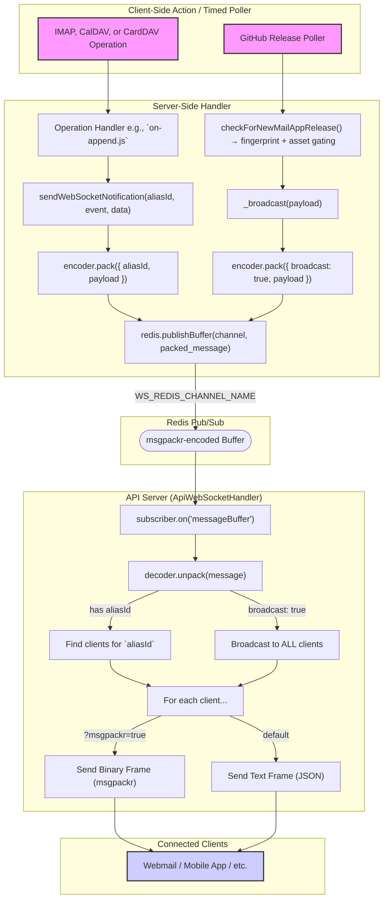

# Real-Time API Notifications via WebSocket

This document outlines the WebSocket server implementation for the API, which provides real-time push notifications for all IMAP, CalDAV, and CardDAV operations, as well as global app update events.


## Table of Contents

* [Architecture](#architecture)
  * [Notification Flow](#notification-flow)
  * [Client-Controlled Encoding](#client-controlled-encoding)
* [Enriched Payloads](#enriched-payloads)
* [Supported Events](#supported-events)
* [Security](#security)
* [Authentication](#authentication)
  * [Authentication Methods](#authentication-methods)
  * [Connection Responses](#connection-responses)
  * [Important Notes](#important-notes)
* [Client Integration](#client-integration)
  * [Browser (JSON)](#browser-json)
  * [Node.js (JSON)](#nodejs-json)
  * [Node.js (msgpackr)](#nodejs-msgpackr)
* [Troubleshooting](#troubleshooting)
  * [Issue: Receiving `broadcastOnly: true` when expecting authentication](#issue-receiving-broadcastonly-true-when-expecting-authentication)
  * [Issue: 401 Unauthorized error](#issue-401-unauthorized-error)
  * [Issue: 400 Bad Request error](#issue-400-bad-request-error)
  * [Issue: Not receiving per-alias events](#issue-not-receiving-per-alias-events)
  * [Issue: Connection closed with code 4001](#issue-connection-closed-with-code-4001)
  * [Issue: Connection closes immediately](#issue-connection-closes-immediately)
  * [Issue: Not receiving any events](#issue-not-receiving-any-events)


## Architecture

The WebSocket server is integrated into the main API server, listening for HTTP upgrade requests on the `/v1/ws` path. Authentication is optional and, when provided, happens during the upgrade handshake before a connection is established. Unauthenticated clients are accepted and receive only global broadcast events (e.g. `newRelease`), while authenticated clients receive both per-alias events and broadcast events.

The system supports two notification types:

1. **Per-Alias Notifications**: When a state-changing operation occurs for a specific alias (e.g., a new email arrives, a calendar event is updated), the responsible handler calls `sendWebSocketNotification`. This function publishes a `msgpackr`-encoded message to a dedicated Redis pub/sub channel, scoped to a specific `aliasId`.
2. **Broadcast Notifications**: A background poller periodically checks for new releases of the [Forward Email Mail App](https://github.com/forwardemail/mail.forwardemail.net). If a new release is found (or an existing one is updated), the `ApiWebSocketHandler` broadcasts a `newRelease` event to **all** connected clients.

A subscriber on each API server instance listens to the Redis channel and forwards the notification to the appropriate WebSocket clients based on the delivery mode (per-alias or broadcast).

To detect updates to an existing release (e.g., when a GitHub Actions workflow adds compiled assets after initial publication), the poller computes and stores a **content fingerprint** of the release in Redis. This fingerprint is a SHA-256 hash of the tag name, body content, and a sorted list of asset names and sizes. Any change to these properties will result in a new fingerprint, triggering a `newRelease` broadcast even if the tag name remains the same.

**Asset Gating**: When a new release is detected but has no assets yet, the broadcast is deferred. The poller stores the tag as "pending" and waits. Once assets appear (detected by a change in the fingerprint on a subsequent poll), the pending flag is cleared and the `newRelease` event is broadcast. This ensures clients are only notified when downloadable artifacts are actually available.

### Notification Flow


```mermaid
graph TD
    subgraph "Client-Side Action / Timed Poller"
        A[IMAP, CalDAV, or CardDAV Operation]
        P[GitHub Release Poller]
    end

    subgraph "Server-Side Handler"
        A --> B["Operation Handler e.g., `on-append.js`"];
        B --> C["sendWebSocketNotification(aliasId, event, data)"];
        C --> D["encoder.pack({ aliasId, payload })"];
        D --> E["redis.publishBuffer(channel, packed_message)"];

        P --> Q["checkForNewMailAppRelease() → fingerprint + asset gating"];
        Q --> R["_broadcast(payload)"];
        R --> S["encoder.pack({ broadcast: true, payload })"];
        S --> E;
    end

    subgraph "Redis Pub/Sub"
        E -- "`WS_REDIS_CHANNEL_NAME`" --> F([msgpackr-encoded Buffer]);
    end

    subgraph "API Server (ApiWebSocketHandler)"
        F --> G["subscriber.on('messageBuffer')"];
        G --> H["decoder.unpack(message)"];
        H -- "broadcast: true" --> I_ALL["Broadcast to ALL clients"];
        H -- "has aliasId" --> I_ALIAS["Find clients for `aliasId`"];
        I_ALIAS --> J["For each client..."];
        I_ALL --> J;
        J -- "`?msgpackr=true`" --> K["Send Binary Frame (msgpackr)"];
        J -- "default" --> L["Send Text Frame (JSON)"];
    end

    subgraph "Connected Clients"
        K --> M["Webmail / Mobile App / etc."];
        L --> M;
    end

    style A fill:#f9f,stroke:#333,stroke-width:2px
    style P fill:#f9f,stroke:#333,stroke-width:2px
    style M fill:#ccf,stroke:#333,stroke-width:2px
```

### Client-Controlled Encoding

All internal communication uses `msgpackr` for efficiency. The client determines the final delivery format via a query parameter, allowing for flexibility.

| Connection URL                                   | Delivery Format        | Use Case                                   |
| ------------------------------------------------ | ---------------------- | ------------------------------------------ |
| `wss://api.forwardemail.net/v1/ws`               | JSON text frames       | Browser clients, easy debugging            |
| `wss://api.forwardemail.net/v1/ws?msgpackr=true` | msgpackr binary frames | Native apps, performance-sensitive clients |


## Enriched Payloads

To prevent clients from needing to make follow-up HTTP requests, notification payloads include lightweight metadata fields that mirror the REST API responses.

* **IMAP message events** include structured metadata (`from`, `subject`, `flags`, `size`, etc.) but **not** the raw email body. Clients should fetch the full message on demand via IMAP or the REST API.
* **CalDAV events** include the full iCalendar data in an `ical` field.
* **CardDAV events** include the full vCard data in a `content` field.
* **App release events** include a `release` object with details from the GitHub Release.

**Example `newMessage` Payload:**

```json
{
  "event": "newMessage",
  "timestamp": 1739347200000,
  "mailbox": "INBOX",
  "message": {
    "id": "67abcdef1234567890abcdef",
    "uid": 42,
    "from": "sender@example.com",
    "subject": "Hello World",
    "size": 1234,
    "flags": [],
    "is_unread": true,
    "is_flagged": false,
    "has_attachment": false,
    "object": "message"
  }
}
```

**Example `newRelease` Payload:**

```json
{
  "event": "newRelease",
  "timestamp": 1739348200000,
  "release": {
    "tagName": "v1.2.3",
    "name": "Release v1.2.3",
    "body": "This release includes several bug fixes and performance improvements.",
    "htmlUrl": "https://github.com/forwardemail/mail.forwardemail.net/releases/tag/v1.2.3",
    "prerelease": false,
    "publishedAt": "2026-02-15T12:00:00Z",
    "author": {
      "login": "user",
      "avatarUrl": "https://github.com/avatars/user.png",
      "htmlUrl": "https://github.com/user"
    },
    "assets": [
      {
        "name": "mail.forwardemail.net-1.2.3.dmg",
        "size": 104857600,
        "downloadCount": 500,
        "browserDownloadUrl": "https://github.com/forwardemail/mail.forwardemail.net/releases/download/v1.2.3/mail.forwardemail.net-1.2.3.dmg"
      }
    ]
  }
}
```


## Supported Events

The implementation covers 20 distinct event types across three protocols and one global event type.

#### IMAP Events

| Event              | Trigger                    | Key Payload Fields                                                   |
| ------------------ | -------------------------- | -------------------------------------------------------------------- |
| `newMessage`       | `APPEND` / SMTP delivery   | `mailbox`, `message` (with `from`, `subject`, metadata flags)        |
| `messagesMoved`    | `MOVE`                     | `sourceMailbox`, `destinationMailbox`, `sourceUid`, `destinationUid` |
| `messagesCopied`   | `COPY`                     | `sourceMailbox`, `destinationMailbox`, `sourceUid`, `destinationUid` |
| `flagsUpdated`     | `STORE` / implicit `\Seen` | `mailbox`, `action`, `flags`, `uid`                                  |
| `messagesExpunged` | `EXPUNGE`                  | `mailbox`, `uids`                                                    |
| `mailboxCreated`   | `CREATE`                   | `path`, `mailbox`                                                    |
| `mailboxDeleted`   | `DELETE`                   | `path`, `mailbox`                                                    |
| `mailboxRenamed`   | `RENAME`                   | `oldPath`, `newPath`, `mailbox`                                      |

#### CalDAV & CardDAV Events

Notifications are sent for all `Created`, `Updated`, and `Deleted` operations on calendars, calendar events, address books, and contacts.

#### App Release Events

| Event        | Trigger                                                                                                                                                                   | Key Payload Fields |
| ------------ | ------------------------------------------------------------------------------------------------------------------------------------------------------------------------- | ------------------ |
| `newRelease` | A new version of the [Forward Email Mail App](https://github.com/forwardemail/mail.forwardemail.net) is published, or an existing release is updated (e.g. assets added). | `release`          |


## Security

Security is a primary design consideration, addressed through multiple layers:

1. **Optional Authentication**: Authentication is optional. Authenticated clients receive both per-alias events and global broadcast events. Unauthenticated clients are also accepted but only receive global broadcast events (e.g. `newRelease`). Both API Token (`?alias_id=` required) and Alias Password auth are supported for authenticated connections.
2. **No Credentials in URLs**: Credentials are only accepted in the `Authorization` header. Query parameters such as `?username=`, `?password=` and `?token=` are rejected with `400 Bad Request`, so passwords never end up in proxy or server logs. Browsers send them in the first message instead (see [Option 3](#option-3-first-message-browsers)).
3. **First-Message Authentication**: A `?auth=message` connection is sent nothing until its first message is accepted. That message must be a JSON text frame (at most 1 KB) with exactly the documented shape, arrive within 5 seconds, and is the only attempt the connection gets; anything else closes it. At most 5 such connections per IP (IPv6: per /64, and 20 per /48) can wait for their first message; when all 1,000 slots are taken, the oldest connection that has not sent anything yet is dropped. Limits of the shared login (too many failed attempts) close the connection with `4429`, not `4401`, so clients retry later instead of treating the password as wrong. After 10 failed logins from one IP (either way) further attempts are refused for 10 minutes, on top of the failed-attempt limits of the shared login. Credentials are never logged.
4. **Read-Only Channel**: The connection is strictly for server-to-client push. Any data messages received from a client are silently ignored.
5. **Strict Channel Isolation**: For authenticated clients, the server maps connections to a specific `alias_id`. A client will only ever receive notifications for the alias it is subscribed to. Global events like `newRelease` are broadcast to all clients (both authenticated and unauthenticated).
6. **Rate Limiting & Connection Caps**: To prevent abuse, the server enforces a per-IP connection rate limit (30/minute), a per-alias connection limit for authenticated clients (10), a per-IP limit for unauthenticated clients (3), and a global connection limit (10,000). IPv6 clients are counted per /64. With `WS_TRUST_PROXY`, the client address is the last `X-Forwarded-For` entry (the one the proxy in front of the API added); earlier entries come from the client and are ignored.
7. **Keep-Alive**: A 30-second ping/pong keep-alive mechanism terminates unresponsive or stale connections.
8. **Same Checks as the Rest of the API**: Alias passwords are checked by the shared login used by IMAP, POP3, SMTP and the API (failed-attempt limits, disabled aliases, banned accounts, password rotations). API tokens must be enabled, the email verified and the account not banned.
9. **Revocation**: Connections are closed with code `4001` on every API server when what they were opened with changes: the alias password (or the alias is disabled or changes hands) closes the alias's connections, a regenerated or disabled API token closes the connections opened with it, a member removed from a domain or no longer an admin loses the API token connections, and a banned or removed account loses all of them. A change made while a connection is still authenticating closes that connection too, and a cached login is not reused after such a change. No events (not even `connected`) are sent before this check passes.


## Authentication

Authentication is **optional** for WebSocket connections. The authentication method determines what events you receive:

* **Authenticated connections**: Receive both per-alias events (IMAP, CalDAV, CardDAV) and global broadcast events (`newRelease`)
* **Unauthenticated connections**: Receive only global broadcast events (`newRelease`)

### Authentication Methods

Authentication is provided via HTTP Basic Authentication in the `Authorization` header. Browser `WebSocket` cannot set custom headers, so browsers connect with `?auth=message` and send the credentials as the first message. Query parameters that carry credentials (`?username=`, `?password=`, `?token=`) are **not supported** and are rejected with `400 Bad Request`.

#### Option 1: Alias Password Authentication (Recommended)

Use your alias email address and generated password for authentication.

**Node.js Example (Authorization header):**

```javascript
const WebSocket = require("ws");

const ws = new WebSocket("wss://api.forwardemail.net/v1/ws", {
  headers: {
    Authorization: `Basic ${Buffer.from("user@domain.com:alias-password").toString("base64")}`
  }
});
```

**Requirements:**

* Username: Your alias email address (e.g., `user@domain.com`)
* Password: Your generated alias password
* The alias must be enabled and have a password (the same login as IMAP and the rest of the API)

#### Option 2: API Token Authentication

Use your API token for authentication. This method **requires** the `alias_id` query parameter to specify which alias to subscribe to.

**Node.js Example (Authorization header):**

```javascript
const WebSocket = require("ws");

const ws = new WebSocket("wss://api.forwardemail.net/v1/ws?alias_id=YOUR_ALIAS_ID", {
  headers: {
    Authorization: `Basic ${Buffer.from("YOUR_API_TOKEN:").toString("base64")}`
  }
});
```

**Requirements:**

* Username: Your API token
* Password: Empty string
* Query parameter: `?alias_id=<your-alias-id>` (required)
* The alias must belong to your user account or to a domain you administer
* The API token must be enabled, your email verified and the account not banned (`403 Forbidden` otherwise)

#### Option 3: First Message (Browsers)

Browsers connect with `?auth=message` and send the credentials as the first message, within 5 seconds. The server sends nothing until it accepts them, then sends the usual `connected` event.

```javascript
const ws = new WebSocket("wss://api.forwardemail.net/v1/ws?auth=message");
ws.onopen = () => ws.send(JSON.stringify({
  event: "auth",
  username: "user@domain.com",
  password: "alias-password"
}));
```

For an API token, send `{"event":"auth","username":"YOUR_API_TOKEN","password":"","alias_id":"YOUR_ALIAS_ID"}`.

**Requirements:**

* The first message is a JSON text frame of at most 1 KB: `event` is `"auth"`, `username` is a string (up to 320 characters, no control characters), `password` a string (up to 128 characters), and `alias_id` (API tokens) a 24-character hexadecimal ID
* Only the first message counts; later messages are ignored
* `?auth=message` cannot be combined with an `Authorization` header (`400 Bad Request`)
* At most 5 connections per IP (IPv6: per /64, and 20 per /48) can be waiting for their first message (`429 Too Many Requests`)

**Close codes** (an HTTP status cannot be sent once the connection is open):

| Code   | Meaning                                                  | Retry             |
| ------ | -------------------------------------------------------- | ----------------- |
| `4400` | Malformed first message                                  | No                |
| `4401` | Wrong credentials                                        | No                |
| `4403` | Not allowed (banned, unverified, or alias not reachable) | No                |
| `4408` | No first message within 5 seconds                        | Yes               |
| `4429` | Too many connections for the alias, or failed logins     | Yes, with backoff |
| `1013` | Temporary server problem                                 | Yes, with backoff |
| `4001` | Credentials changed after connecting                     | Yes               |

#### Option 4: Unauthenticated (Broadcast-Only)

Connect without any authentication to receive only global broadcast events.

**Browser Example:**

```javascript
const ws = new WebSocket("wss://api.forwardemail.net/v1/ws");
```

**Node.js Example:**

```javascript
const WebSocket = require("ws");

const ws = new WebSocket("wss://api.forwardemail.net/v1/ws");
```

### Connection Responses

Upon successful connection, the server sends a `connected` event indicating the authentication status:

**Authenticated Connection:**

```json
{
  "event": "connected",
  "aliasId": "67abcdef1234567890abcdef"
}
```

This confirms you are authenticated and will receive both per-alias events for the specified alias and global broadcast events.

**Unauthenticated Connection:**

```json
{
  "event": "connected",
  "broadcastOnly": true
}
```

This confirms you are connected but will only receive global broadcast events (e.g., `newRelease`). You will **not** receive per-alias notifications.

### Important Notes

* **No credentials in query parameters**: `?username=`, `?password=` and `?token=` are rejected with `400 Bad Request`. Use the `Authorization` header, or the first message of a `?auth=message` connection in browsers.
* **Failed authentication**: If credentials are provided but invalid, the server responds with a `401 Unauthorized` error (a `?auth=message` connection is closed with `4401`). It does NOT fall back to broadcast-only mode — only connections with no credentials at all are treated as unauthenticated.
* **Credential changes**: If the alias password or API token changes (or the account is banned), open connections are closed with code `4001`; reconnect with the new credentials.
* **msgpackr encoding**: Add `?msgpackr=true` to the connection URL to receive binary msgpackr-encoded frames instead of JSON text frames for reduced bandwidth.


## Client Integration

### Browser (JSON)

**Authenticated (first message):**

```javascript
// Browser WebSocket does not support custom headers,
// so the credentials are the first message:
const ws = new WebSocket("wss://api.forwardemail.net/v1/ws?auth=message");

ws.onopen = () => {
  ws.send(JSON.stringify({
    event: "auth",
    username: "user@domain.com",
    password: "alias-password"
  }));
};

ws.onmessage = (event) => {
  const notification = JSON.parse(event.data);
  console.log("Received event:", notification.event, notification);

  // Check connection status
  if (notification.event === "connected") {
    if (notification.aliasId) {
      console.log("Authenticated! Alias ID:", notification.aliasId);
    } else if (notification.broadcastOnly) {
      console.log("Connected in broadcast-only mode (unauthenticated)");
    }
  }
};

ws.onerror = (error) => {
  console.error("WebSocket error:", error);
};

ws.onclose = (event) => {
  console.log("WebSocket closed:", event.code, event.reason);
};
```

**Unauthenticated (Broadcast-Only):**

```javascript
const ws = new WebSocket("wss://api.forwardemail.net/v1/ws");

ws.onmessage = (event) => {
  const notification = JSON.parse(event.data);
  console.log("Received event:", notification.event, notification);
};
```

### Node.js (JSON)

**Authenticated (Alias Password):**

```javascript
const WebSocket = require("ws");

const ws = new WebSocket("wss://api.forwardemail.net/v1/ws", {
  headers: {
    Authorization: `Basic ${Buffer.from("user@domain.com:alias-password").toString("base64")}`
  }
});

ws.on("open", () => {
  console.log("WebSocket connection established");
});

ws.on("message", (data) => {
  const notification = JSON.parse(data.toString());
  console.log("Received event:", notification.event, notification);

  // Check connection status
  if (notification.event === "connected") {
    if (notification.aliasId) {
      console.log("Authenticated! Alias ID:", notification.aliasId);
    } else if (notification.broadcastOnly) {
      console.log("Connected in broadcast-only mode (unauthenticated)");
    }
  }
});

ws.on("error", (error) => {
  console.error("WebSocket error:", error);
});

ws.on("close", (code, reason) => {
  console.log("WebSocket closed:", code, reason.toString());
});
```

**Authenticated (API Token):**

```javascript
const WebSocket = require("ws");

const aliasId = "YOUR_ALIAS_ID";
const apiToken = "YOUR_API_TOKEN";

const ws = new WebSocket(`wss://api.forwardemail.net/v1/ws?alias_id=${aliasId}`, {
  headers: {
    Authorization: `Basic ${Buffer.from(`${apiToken}:`).toString("base64")}`
  }
});

ws.on("message", (data) => {
  const notification = JSON.parse(data.toString());
  console.log("Received event:", notification.event, notification);
});
```

### Node.js (msgpackr)

For high-performance applications, use msgpackr encoding to reduce bandwidth:

```javascript
const WebSocket = require("ws");
const { Decoder } = require("msgpackr");
const decoder = new Decoder();

const ws = new WebSocket("wss://api.forwardemail.net/v1/ws?msgpackr=true", {
  headers: {
    Authorization: `Basic ${Buffer.from("user@domain.com:alias-password").toString("base64")}`
  }
});

ws.on("message", (data, isBinary) => {
  const notification = isBinary ? decoder.unpack(data) : JSON.parse(data);
  console.log("Received event:", notification.event, notification);
});
```


## Troubleshooting

### Issue: Receiving `broadcastOnly: true` when expecting authentication

**Possible causes:**

1. **No credentials were sent**: `broadcastOnly: true` only happens when the connection carries no `Authorization` header and is not a `?auth=message` connection
2. **Browser without `?auth=message`**: Browser `WebSocket` cannot send an `Authorization` header

**Solution:**

* Send the `Authorization` header (Node.js, native apps)
* In browsers, connect with `?auth=message` and send the credentials as the first message

### Issue: 401 Unauthorized error

**Possible causes:**

1. **Invalid API token**: Your API token is incorrect or expired
2. **Invalid alias credentials**: Your alias email or password is incorrect
3. **Unsupported `Authorization` header**: Only HTTP Basic Authentication is accepted
4. **Too many failed logins**: after 10 failed logins from one IP, further attempts are refused for 10 minutes (`429`, or close code `4429`)

**Solution:**

* Verify your credentials are correct
* Browsers: a `?auth=message` connection closed with `4401` means the same as a `401`

### Issue: 400 Bad Request error

**Possible causes:**

1. **Credentials in the URL**: `?username=`, `?password=` or `?token=` are not supported
2. **`?auth=message` and an `Authorization` header together**: Use one or the other
3. **Missing `alias_id` for token auth**: API token authentication requires `?alias_id=<your-alias-id>`

**Solution:**

* Move credentials to the `Authorization` header, or to the first message in browsers
* For API token auth, include `?alias_id=<your-alias-id>` in the URL

### Issue: Not receiving per-alias events

**Possible causes:**

1. **Connected in broadcast-only mode**: Check if you received `broadcastOnly: true` in the `connected` event
2. **Wrong alias**: You may be authenticated to a different alias than expected

**Solution:**

* Check the `connected` event response for `aliasId` or `broadcastOnly`
* If you see `broadcastOnly: true`, no credentials were sent
* Verify you're using the correct credentials and authentication method

### Issue: Connection closed with code 4001

**Cause:** The credentials the connection was opened with changed (a new alias password, a regenerated or disabled API token, a banned account, or lost admin access to the domain).

**Solution:**

* Reconnect with the current credentials
* If the reconnect fails with `401` or `403` (`4401` or `4403`), the stored credentials are no longer valid

### Issue: Connection closes immediately

**Possible causes:**

1. **Rate limiting**: You've exceeded 30 connections per minute from your IP
2. **Connection limit reached**: You've exceeded 10 concurrent connections per alias (authenticated) or 3 per IP (unauthenticated)
3. **Global limit reached**: The server has reached 10,000 concurrent connections

**Solution:**

* Wait before attempting to reconnect
* Close unused connections
* Implement exponential backoff for reconnection attempts

### Issue: Not receiving any events

**Possible causes:**

1. **No events are being generated**: The events you're expecting may not be occurring
2. **Connected to wrong alias**: You may be authenticated to a different alias
3. **Broadcast-only mode**: You're only receiving global broadcast events

**Solution:**

* Verify events are being generated (e.g., send a test email)
* Check the `connected` event to confirm your `aliasId`
* Ensure you're authenticated if you expect per-alias events
