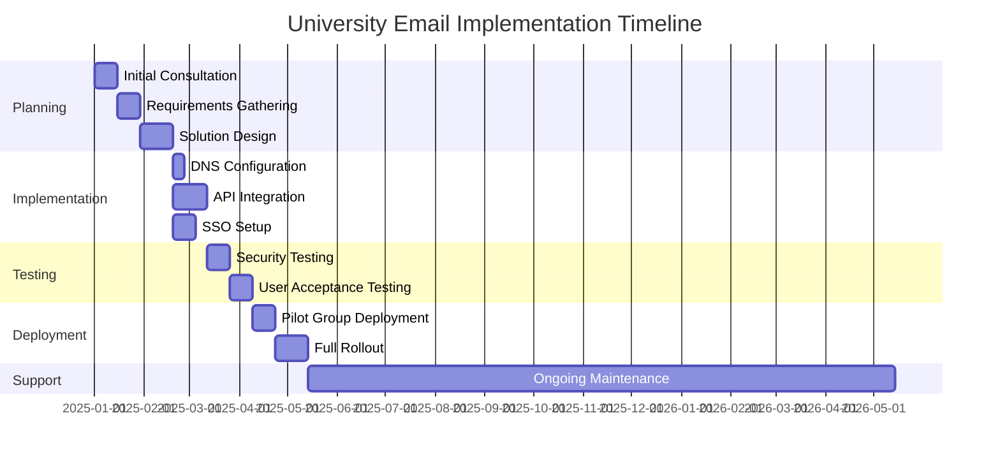
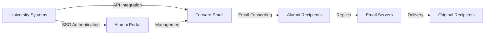

# دراسة حالة: كيف يُمكّن البريد الإلكتروني المُرسَل حلول البريد الإلكتروني للخريجين في أفضل الجامعات {#case-study-how-forward-email-powers-alumni-email-solutions-for-top-universities}


## جدول المحتويات {#table-of-contents}

* [مقدمة](#foreword)
* [توفير كبير في التكاليف مع استقرار الأسعار](#dramatic-cost-savings-with-stable-pricing)
  * [مدخرات جامعية حقيقية](#real-world-university-savings)
* [تحدي البريد الإلكتروني لخريجي الجامعة](#the-university-alumni-email-challenge)
  * [قيمة هوية البريد الإلكتروني للخريجين](#the-value-of-alumni-email-identity)
  * [الحلول التقليدية لا تكفي](#traditional-solutions-fall-short)
  * [حل البريد الإلكتروني الأمامي](#the-forward-email-solution)
* [التنفيذ الفني: كيف يعمل](#technical-implementation-how-it-works)
  * [الهندسة المعمارية الأساسية](#core-architecture)
  * [التكامل مع أنظمة الجامعة](#integration-with-university-systems)
  * [إدارة تعتمد على واجهة برمجة التطبيقات (API)](#api-driven-management)
  * [تكوين DNS والتحقق منه](#dns-configuration-and-verification)
  * [الاختبار وضمان الجودة](#testing-and-quality-assurance)
* [الجدول الزمني للتنفيذ](#implementation-timeline)
* [عملية التنفيذ: من الهجرة إلى الصيانة](#implementation-process-from-migration-to-maintenance)
  * [التقييم الأولي والتخطيط](#initial-assessment-and-planning)
  * [استراتيجية الهجرة](#migration-strategy)
  * [الإعداد والتكوين الفني](#technical-setup-and-configuration)
  * [تصميم تجربة المستخدم](#user-experience-design)
  * [التدريب والتوثيق](#training-and-documentation)
  * [الدعم والتحسين المستمر](#ongoing-support-and-optimization)
* [دراسة حالة: جامعة كامبريدج](#case-study-university-of-cambridge)
  * [تحدي](#challenge)
  * [حل](#solution)
  * [نتائج](#results)
* [فوائد للجامعات والخريجين](#benefits-for-universities-and-alumni)
  * [للجامعات](#for-universities)
  * [للخريجين](#for-alumni)
  * [معدلات التبني بين الخريجين](#adoption-rates-among-alumni)
  * [توفير التكاليف مقارنة بالحلول السابقة](#cost-savings-compared-to-previous-solutions)
* [اعتبارات الأمن والخصوصية](#security-and-privacy-considerations)
  * [تدابير حماية البيانات](#data-protection-measures)
  * [إطار الامتثال](#compliance-framework)
* [التطورات المستقبلية](#future-developments)
* [خاتمة](#conclusion)

## مقدمة {#foreword}

لقد قمنا ببناء خدمة إعادة توجيه البريد الإلكتروني الأكثر أمانًا وخصوصية ومرونة في العالم للجامعات المرموقة وخريجيها.

في ظلّ التنافس الشديد في التعليم العالي، لا يُعدّ الحفاظ على روابط متينة مع الخريجين مجرد مسألة تقليدية، بل ضرورة استراتيجية. ومن أبرز الطرق الملموسة التي تُعزز بها الجامعات هذه الروابط هي عناوين البريد الإلكتروني للخريجين، ما يمنحهم هوية رقمية تعكس إرثهم الأكاديمي.

في Forward Email، تعاونّا مع بعضٍ من أعرق المؤسسات التعليمية في العالم لإحداث نقلة نوعية في كيفية إدارة خدمات البريد الإلكتروني للخريجين. يُشغّل حلنا المُصمّم للمؤسسات لإعادة توجيه البريد الإلكتروني أنظمة البريد الإلكتروني للخريجين لـ [جامعة كامبريدج](https://en.wikipedia.org/wiki/University_of_Cambridge) و[جامعة ماريلاند](https://en.wikipedia.org/wiki/University_of_Maryland,\_College_Park) و[جامعة تافتس](https://en.wikipedia.org/wiki/Tufts_University) و[كلية سوارثمور](https://en.wikipedia.org/wiki/Swarthmore_College)، ليخدم بذلك آلاف الخريجين حول العالم.

يستكشف منشور المدونة هذا كيف أصبحت خدمة إعادة توجيه البريد الإلكتروني [مفتوح المصدر](https://en.wikipedia.org/wiki/Open-source_software)، التي تركز على الخصوصية، الحل المفضل لهذه المؤسسات، والتطبيقات الفنية التي تجعل ذلك ممكنًا، والتأثير التحويلي الذي أحدثته على كل من الكفاءة الإدارية ورضا الخريجين.

## توفير كبير في التكاليف مع تسعير مستقر {#dramatic-cost-savings-with-stable-pricing}

إن الفوائد المالية لحلنا كبيرة، خاصة عند مقارنتها بالأسعار المتزايدة باستمرار لمقدمي البريد الإلكتروني التقليديين:

| حل | التكلفة لكل خريج (سنويًا) | تكلفة 100000 خريج | ارتفاعات الأسعار الأخيرة |
| ------------------------------ | --------------------------------------------------------------------------------------------------------- | ----------------------- | ---------------------------------------------------------------------------------------------------------------------------------------------------------------------------------------- |
| Google Workspace للشركات | $72 | $7,200,000 | • 2019: G Suite Basic من 5 دولارات إلى 6 دولارات شهريًا (+20%)<br>• 2023: زادت الخطط المرنة بنسبة 20%<br>• 2025: Business Plus من 18 دولارًا إلى 26.40 دولارًا شهريًا (+47%) مع ميزات الذكاء الاصطناعي |
| Google Workspace للتعليم | مجاني (أساسيات التعليم)<br>3 دولارات أمريكية/طالب/سنة (التعليم القياسي)<br>5 دولارات أمريكية/طالب/سنة (التعليم بلس) | مجانًا - 500,000 دولار | • خصومات على الكميات: 5% لـ 100-499 ترخيصًا<br>• خصومات على الكميات: 10% لـ 500 ترخيص أو أكثر<br>• فئة مجانية تقتصر على الخدمات الأساسية |
| مايكروسوفت 365 للأعمال | $60 | $6,000,000 | • 2023: تم تقديم تحديثات الأسعار مرتين سنويًا<br>• 2025 (يناير): شخصي من 6.99 دولارًا إلى 9.99 دولارًا شهريًا (+43%) مع Copilot AI<br>• 2025 (أبريل): زيادة بنسبة 5% على الالتزامات السنوية المدفوعة شهريًا |
| مايكروسوفت 365 للتعليم | مجانًا (A1)<br>38-55 دولارًا أمريكيًا/عضو هيئة تدريس/عام (A3)<br>65-96 دولارًا أمريكيًا/عضو هيئة تدريس/عام (A5) | مجانًا - 96000 دولار | • غالبًا ما يتم تضمين تراخيص الطلاب مع مشتريات أعضاء هيئة التدريس<br>• تسعير مخصص من خلال الترخيص المجمع<br>• فئة مجانية تقتصر على إصدارات الويب |
| تبادل ذاتي الاستضافة | $45 | $4,500,000 | تستمر تكاليف الصيانة والأمن المستمرة في الارتفاع |
| **إعادة توجيه البريد الإلكتروني للمؤسسات** | **ثابت 250 دولارًا أمريكيًا شهريًا** | **3000 دولار/السنة** | **لا توجد زيادات في الأسعار منذ الإطلاق** |

### مدخرات جامعية حقيقية {#real-world-university-savings}

إليك مقدار ما توفره جامعاتنا الشريكة سنويًا من خلال اختيار خدمة Forward Email بدلاً من مقدمي الخدمة التقليديين:

| جامعة | عدد الخريجين | التكلفة السنوية مع جوجل | التكلفة السنوية مع إعادة توجيه البريد الإلكتروني | المدخرات السنوية |
| ----------------------- | ------------ | ----------------------- | ------------------------------ | -------------- |
| جامعة كامبريدج | 30,000 | $90,000 | $3,000 | $87,000 |
| كلية سوارثمور | 5,000 | $15,000 | $3,000 | $12,000 |
| جامعة تافتس | 12,000 | $36,000 | $3,000 | $33,000 |
| جامعة ماريلاند | 25,000 | $75,000 | $3,000 | $72,000 |

> \[!NOTE]
> عادةً ما تبلغ تكلفة خدمة إعادة توجيه البريد الإلكتروني للمؤسسات 250 دولارًا أمريكيًا شهريًا، دون أي تكلفة إضافية لكل مستخدم، أو قيود على أسعار واجهة برمجة التطبيقات (API) المدرجة في القائمة البيضاء، والتكلفة الإضافية الوحيدة هي مساحة التخزين إذا كنت بحاجة إلى مساحة تخزين إضافية (GB/TB) للطلاب (+3 دولارات أمريكية لكل 10 جيجابايت إضافية). نستخدم أيضًا محركات أقراص NVMe SSD لدعم سريع لبروتوكولات IMAP/POP3/SMTP/CalDAV/CardDAV.

بخلاف جوجل ومايكروسوفت، اللتين زادتا أسعارهما مرارًا وتكرارًا مع دمج ميزات الذكاء الاصطناعي التي تُحلل بياناتك، تحافظ Forward Email على أسعار ثابتة مع تركيز صارم على الخصوصية. لا نستخدم الذكاء الاصطناعي، ولا نتتبع أنماط الاستخدام، ولا نخزن السجلات أو رسائل البريد الإلكتروني على القرص (تتم جميع عمليات المعالجة في الذاكرة)، مما يضمن الخصوصية التامة لتواصلك مع الخريجين.

يُمثل هذا انخفاضًا كبيرًا في التكلفة مقارنةً بحلول استضافة البريد الإلكتروني التقليدية، حيث يُمكن للجامعات تحويل الأموال إلى المنح الدراسية أو الأبحاث أو غيرها من الأنشطة المهمة. ووفقًا لتحليل أجرته شركة Email Vendor Selection عام ٢٠٢٣، تسعى المؤسسات التعليمية بشكل متزايد إلى بدائل فعّالة من حيث التكلفة لمُزوّدي خدمات البريد الإلكتروني التقليديين، مع استمرار ارتفاع الأسعار مع دمج ميزات الذكاء الاصطناعي ([اختيار بائع البريد الإلكتروني، 2023](https://www.emailvendorselection.com/email-service-provider-list/)).

## تحدي البريد الإلكتروني لخريجي الجامعة {#the-university-alumni-email-challenge}

بالنسبة للجامعات، يُمثل توفير عناوين بريد إلكتروني دائمة للخريجين مجموعة فريدة من التحديات التي تعجز حلول البريد الإلكتروني التقليدية عن معالجتها بفعالية. وكما ذُكر في نقاش شامل على ServerFault، تتطلب الجامعات ذات قواعد المستخدمين الكبيرة حلول بريد إلكتروني متخصصة تُوازن بين الأداء والأمان والفعالية من حيث التكلفة ([خطأ الخادم، 2009](https://serverfault.com/questions/97364/what-is-the-best-mail-server-for-a-university-with-a-large-amount-of-users)).

### قيمة هوية البريد الإلكتروني للخريجين {#the-value-of-alumni-email-identity}

تخدم عناوين البريد الإلكتروني للخريجين (مثل `firstname.lastname@cl.cam.ac.uk` أو `username@terpalum.umd.edu`) وظائف مهمة متعددة:

* الحفاظ على التواصل المؤسسي والهوية المؤسسية
* تسهيل التواصل المستمر مع الجامعة
* تعزيز المصداقية المهنية للخريجين
* دعم بناء شبكات الخريجين وتكوين مجتمعاتهم
* توفير نقطة اتصال ثابتة ودائمة

تسلط الأبحاث التي أجراها Tekade (2020) الضوء على أن عناوين البريد الإلكتروني التعليمية توفر فوائد عديدة للخريجين، بما في ذلك الوصول إلى الموارد الأكاديمية والمصداقية المهنية والخصومات الحصرية على الخدمات المختلفة ([متوسط، 2020](https://medium.com/coders-capsule/top-20-benefits-of-having-an-educational-email-address-91a09795e05)).

> \[!TIP]
> تفضل بزيارة دليلنا الجديد [AlumniEmail.com](https://alumniemail.com) للاطلاع على مصدر شامل لخدمات البريد الإلكتروني لخريجي الجامعات، بما في ذلك أدلة الإعداد، وأفضل الممارسات، ودليل بحثي لنطاقات البريد الإلكتروني للخريجين. يُعدّ هذا الدليل بمثابة مركز رئيسي لجميع معلومات البريد الإلكتروني للخريجين.

### الحلول التقليدية لا تفي بالغرض {#traditional-solutions-fall-short}

تقدم أنظمة البريد الإلكتروني التقليدية العديد من القيود عند تطبيقها على احتياجات البريد الإلكتروني للخريجين:

* **تكلفة باهظة**: أصبحت نماذج الترخيص لكل مستخدم غير مستدامة ماليًا لقواعد الخريجين الكبيرة.
* **العبء الإداري**: تتطلب إدارة آلاف أو ملايين الحسابات موارد تقنية معلومات كبيرة.
* **مخاوف أمنية**: يؤدي الحفاظ على أمان الحسابات الخاملة إلى زيادة نقاط الضعف.
* **مرونة محدودة**: لا تستطيع الأنظمة الجامدة التكيف مع الاحتياجات الفريدة لإعادة توجيه رسائل البريد الإلكتروني للخريجين.
* **مشاكل الخصوصية**: يقوم العديد من مقدمي الخدمات بمسح محتوى البريد الإلكتروني لأغراض إعلانية.

يكشف نقاش على موقع Quora حول صيانة البريد الإلكتروني الجامعي أن المخاوف الأمنية هي السبب الرئيسي وراء قيام الجامعات بتقييد أو إلغاء عناوين البريد الإلكتروني للخريجين، حيث يمكن أن تكون الحسابات غير المستخدمة عرضة للاختراق وسرقة الهوية ([كورا، 2011](https://www.quora.com/Is-there-any-cost-for-a-college-or-university-to-maintain-edu-e-mail-addresses)).

### حل إعادة توجيه البريد الإلكتروني {#the-forward-email-solution}

إن نهجنا يعالج هذه التحديات من خلال نموذج مختلف جذريا:

* إعادة توجيه البريد الإلكتروني بدلاً من الاستضافة
* تسعير ثابت بدلاً من التكاليف لكل مستخدم
* بنية مفتوحة المصدر لضمان الشفافية والأمان
* تصميم يُولي الخصوصية الأولوية دون مسح المحتوى
* ميزات متخصصة لإدارة هوية الجامعة

التنفيذ الفني لـ ##: كيفية عمله {#technical-implementation-how-it-works}

يعتمد حلنا على بنية تقنية متطورة وبسيطة وأنيقة لتقديم إعادة توجيه بريد إلكتروني موثوقة وآمنة على نطاق واسع.

### الهندسة المعمارية الأساسية {#core-architecture}

يتكون نظام إعادة توجيه البريد الإلكتروني من عدة مكونات رئيسية:

* خوادم MX موزعة لتوفير توافر عالٍ
* إعادة توجيه فورية بدون تخزين الرسائل
* مصادقة شاملة للبريد الإلكتروني
* دعم النطاق المخصص والنطاق الفرعي
* إدارة الحسابات عبر واجهة برمجة التطبيقات

وفقًا لخبراء تكنولوجيا المعلومات في ServerFault، يُنصح الجامعات التي تسعى لتطبيق حلول البريد الإلكتروني الخاصة بها باستخدام Postfix كأفضل وكيل نقل بريد (MTA)، بينما يُفضل استخدام Courier أو Dovecot للوصول عبر IMAP/POP3 ([خطأ الخادم، 2009](https://serverfault.com/questions/97364/what-is-the-best-mail-server-for-a-university-with-a-large-amount-of-users)). ومع ذلك، يُغني حلنا الجامعات عن إدارة هذه الأنظمة المعقدة بنفسها.

### التكامل مع أنظمة الجامعة {#integration-with-university-systems}

لقد قمنا بتطوير مسارات تكامل سلسة مع البنية التحتية الجامعية الحالية:

* توفير آلي من خلال تكامل [واجهة برمجة التطبيقات RESTful](https://forwardemail.net/email-api)
* خيارات تخصيص العلامات التجارية لبوابات الجامعات
* إدارة مرنة للأسماء المستعارة للأقسام والمؤسسات
* عمليات دفعية لإدارة فعّالة

### إدارة تعتمد على واجهة برمجة التطبيقات {#api-driven-management}

يتيح [واجهة برمجة التطبيقات RESTful](https://forwardemail.net/email-api) للجامعات أتمتة إدارة البريد الإلكتروني:

```javascript
// Example: Creating a new alumni email address
const response = await fetch('https://forwardemail.net/api/v1/domains/example.edu/aliases', {
  method: 'POST',
  headers: {
    'Content-Type': 'application/json',
    'Authorization': `Basic ${Buffer.from(YOUR_API_TOKEN + ":").toString('base64')}`
  },
  body: JSON.stringify({
    name: 'alumni.john.smith',
    recipients: ['johnsmith@gmail.com'],
    has_recipient_verification: true
  })
});
```

### تكوين DNS والتحقق منه {#dns-configuration-and-verification}

يُعدّ تكوين DNS الصحيح أمرًا بالغ الأهمية لتسليم البريد الإلكتروني. يُساعد فريقنا في:

* تهيئة [DNS](https://en.wikipedia.org/wiki/Domain_Name_System) تتضمن سجلات MX
* تطبيق شامل لأمن البريد الإلكتروني باستخدام حزمة [مايل أوث](https://www.npmjs.com/package/mailauth) مفتوحة المصدر، وهي أداة فعّالة لمصادقة البريد الإلكتروني، وتتولى:
* [SPF](https://en.wikipedia.org/wiki/Sender_Policy_Framework) (إطار عمل سياسة المُرسِل) لمنع انتحال البريد الإلكتروني
* [DKIM](https://en.wikipedia.org/wiki/DomainKeys_Identified_Mail) (البريد المُعرَّف بمفاتيح النطاق) لمصادقة البريد الإلكتروني
* [DMARC](https://en.wikipedia.org/wiki/Email_authentication) (مصادقة الرسائل القائمة على النطاق، والإبلاغ عنها، والتوافق معها) لتطبيق السياسات
* [MTA-STS](https://en.wikipedia.org/wiki/Opportunistic_TLS) (أمان النقل الصارم لبروتوكول SMTP MTA) لتطبيق تشفير TLS
* [ARC](https://en.wikipedia.org/wiki/DomainKeys_Identified_Mail#Authenticated_Received_Chain) (سلسلة الاستلام المُصادق عليها) للحفاظ على المصادقة عند إعادة توجيه الرسائل
* [SRS](https://en.wikipedia.org/wiki/Sender_Rewriting_Scheme) (نظام إعادة كتابة المُرسِل) للحفاظ على صحة SPF أثناء إعادة التوجيه
* [BIMI](https://en.wikipedia.org/wiki/Email_authentication) (مؤشرات العلامة التجارية لتحديد الرسائل) لعرض الشعار في برامج البريد الإلكتروني الداعمة.
* التحقق من سجل DNS TXT لملكية النطاق.

حزمة `mailauth` (<http://npmjs.com/package/mailauth>) هي الحل مفتوح المصدر بالكامل، الذي يُعنى بجميع جوانب مصادقة البريد الإلكتروني في مكتبة متكاملة واحدة. بخلاف الحلول الحصرية، يضمن هذا النهج الشفافية، وتحديثات الأمان الدورية، والتحكم الكامل في عملية مصادقة البريد الإلكتروني.

### الاختبار وضمان الجودة {#testing-and-quality-assurance}

قبل النشر الكامل، نقوم بإجراء اختبارات صارمة:

* اختبار شامل لتسليم البريد الإلكتروني
* اختبار التحميل لسيناريوهات ذات حجم كبير
* اختبار اختراق الأمان
* التحقق من تكامل واجهة برمجة التطبيقات (API)
* اختبار قبول المستخدم مع ممثلي الخريجين

## الجدول الزمني للتنفيذ {#implementation-timeline}



عملية تنفيذ ##: من الترحيل إلى الصيانة {#implementation-process-from-migration-to-maintenance}

تضمن عملية التنفيذ المنظمة لدينا انتقالًا سلسًا للجامعات التي تعتمد حلنا.

### التقييم الأولي والتخطيط {#initial-assessment-and-planning}

نبدأ بتقييم شامل لنظام البريد الإلكتروني الحالي للجامعة، وقاعدة بيانات الخريجين، والمتطلبات التقنية. تشمل هذه المرحلة:

* مقابلات مع أصحاب المصلحة من قسم تكنولوجيا المعلومات، وقسم علاقات الخريجين، والإدارة.
* تدقيق فني للبنية التحتية الحالية للبريد الإلكتروني.
* تخطيط بيانات سجلات الخريجين.
* مراجعة الأمن والامتثال.
* الجدول الزمني للمشروع وتطوير مراحله.

### استراتيجية ترحيل {#migration-strategy}

بناءً على التقييم، نقوم بتطوير استراتيجية هجرة مخصصة تعمل على تقليل الاضطراب مع ضمان سلامة البيانات بالكامل:

* نهج انتقال تدريجي من قِبل مجموعات الخريجين
* تشغيل الأنظمة المتوازية أثناء عملية الانتقال
* بروتوكولات شاملة للتحقق من صحة البيانات
* إجراءات احتياطية لأي مشاكل في عملية الانتقال
* خطة تواصل واضحة لجميع أصحاب المصلحة

### الإعداد الفني والتكوين {#technical-setup-and-configuration}

يتولى فريقنا الفني كافة جوانب إعداد النظام:

* تهيئة DNS والتحقق منه
* دمج واجهة برمجة التطبيقات (API) مع أنظمة الجامعة
* تطوير بوابة إلكترونية مخصصة تحمل هوية الجامعة
* إعداد مصادقة البريد الإلكتروني (SPF، DKIM، DMARC)

### تصميم تجربة المستخدم {#user-experience-design}

نحن نعمل بشكل وثيق مع الجامعات لإنشاء واجهات سهلة الاستخدام لكل من الإداريين والخريجين:

* بوابات بريد إلكتروني مخصصة للخريجين
* إدارة مُبسّطة لإعادة توجيه البريد الإلكتروني
* تصميمات مُتجاوبة مع الأجهزة المحمولة
* توافق مع متطلبات إمكانية الوصول
* دعم متعدد اللغات عند الحاجة

### التدريب والتوثيق {#training-and-documentation}

يضمن التدريب الشامل أن يتمكن جميع أصحاب المصلحة من استخدام النظام بشكل فعال:

* دورات تدريبية للمسؤولين
* وثائق تقنية لموظفي تكنولوجيا المعلومات
* أدلة استخدام للخريجين
* فيديوهات تعليمية للمهام الشائعة
* تطوير قاعدة المعرفة

### الدعم والتحسين المستمر {#ongoing-support-and-optimization}

تستمر شراكتنا إلى ما هو أبعد من التنفيذ:

* دعم فني على مدار الساعة طوال أيام الأسبوع
* تحديثات دورية للنظام وتصحيحات أمنية
* مراقبة الأداء وتحسينه
* استشارة حول أفضل ممارسات البريد الإلكتروني
* تحليلات البيانات وإعداد التقارير

دراسة حالة ##: جامعة كامبريدج {#case-study-university-of-cambridge}

سعت جامعة كامبريدج إلى إيجاد حل لتوفير عناوين البريد الإلكتروني @cam.ac.uk لخريجيها مع تقليل النفقات العامة وتكاليف تكنولوجيا المعلومات.

### تحدي {#challenge}

واجهت كامبريدج العديد من التحديات مع نظام البريد الإلكتروني لخريجيها السابق:

* تكاليف تشغيلية مرتفعة للحفاظ على بنية تحتية منفصلة للبريد الإلكتروني.
* عبء إداري لإدارة آلاف الحسابات.
* مخاوف أمنية تتعلق بالحسابات الخاملة.
* تكامل محدود مع أنظمة قواعد بيانات الخريجين.
* زيادة متطلبات التخزين.

### الحل {#solution}

نفذت شركة Forward Email حلاً شاملاً:

* إعادة توجيه البريد الإلكتروني لجميع عناوين خريجي @cam.ac.uk
* بوابة إلكترونية مصممة خصيصًا للخدمة الذاتية للخريجين
* دمج واجهة برمجة التطبيقات مع قاعدة بيانات خريجي كامبريدج
* تطبيق شامل لأمن البريد الإلكتروني

### نتائج {#results}

وقد حقق التنفيذ فوائد كبيرة:

* انخفاض كبير في التكلفة مقارنةً بالحلول السابقة
* موثوقية تسليم البريد الإلكتروني بنسبة 99.9%
* إدارة مبسطة من خلال الأتمتة
* أمان مُحسّن مع مصادقة بريد إلكتروني حديثة
* آراء إيجابية من الخريجين حول سهولة استخدام النظام

مزايا ## للجامعات والخريجين {#benefits-for-universities-and-alumni}

يقدم حلنا فوائد ملموسة لكل من المؤسسات وخريجيها.

### للجامعات {#for-universities}

* **كفاءة التكلفة**: تسعير ثابت بغض النظر عن عدد الخريجين
* **بساطة إدارية**: إدارة آلية عبر واجهة برمجة التطبيقات (API)
* **أمان مُحسّن**: مصادقة شاملة للبريد الإلكتروني
* **اتساق العلامة التجارية**: عناوين بريد إلكتروني مؤسسية دائمة
* **مشاركة الخريجين**: تعزيز الروابط من خلال الخدمة المستمرة

وفقًا لـ BulkSignature (2023)، توفر منصات البريد الإلكتروني للمؤسسات التعليمية فوائد كبيرة بما في ذلك الفعالية من حيث التكلفة من خلال خطط مجانية أو منخفضة التكلفة، وكفاءة الوقت من خلال إمكانيات الاتصال الجماهيري، وميزات التتبع لمراقبة تسليم البريد الإلكتروني والمشاركة ([توقيع بالجملة، 2023](https://bulksignature.com/blog/5-best-email-platforms-for-educational-institutions/)).

### للخريجين {#for-alumni}

* **الهوية المهنية**: بريد إلكتروني جامعي مرموق
* **استمرارية البريد الإلكتروني**: إعادة توجيه إلى أي بريد إلكتروني شخصي
* **حماية الخصوصية**: لا حاجة لمسح المحتوى أو استخراج البيانات
* **إدارة مبسطة**: تحديثات سهلة للمستلمين
* **أمان مُحسّن**: مصادقة بريد إلكتروني حديثة

تسلط الأبحاث الصادرة عن المجلة الدولية لدراسات التعليم والمحو الأمية الضوء على أهمية التواصل السليم عبر البريد الإلكتروني في الأوساط الأكاديمية، مشيرة إلى أن معرفة البريد الإلكتروني هي مهارة حاسمة لكل من الطلاب والخريجين في السياقات المهنية ([IJELS, 2021](https://files.eric.ed.gov/fulltext/EJ1319324.pdf)).

معدلات التبني بين الخريجين {#adoption-rates-among-alumni}

وتفيد التقارير الصادرة عن الجامعات بارتفاع معدلات التبني والرضا بين مجتمعات خريجيها.

### توفير في التكاليف مقارنة بالحلول السابقة {#cost-savings-compared-to-previous-solutions}

وكان التأثير المالي كبيرا، حيث أفادت الجامعات بتحقيق وفورات كبيرة في التكاليف مقارنة بحلول البريد الإلكتروني السابقة.

## اعتبارات الأمان والخصوصية {#security-and-privacy-considerations}

بالنسبة للمؤسسات التعليمية، فإن حماية بيانات الخريجين ليست مجرد ممارسة جيدة، بل هي في كثير من الأحيان متطلب قانوني بموجب لوائح مثل اللائحة العامة لحماية البيانات في أوروبا.

### تدابير حماية البيانات {#data-protection-measures}

يتضمن حلنا طبقات متعددة من الأمان:

* تشفير شامل لجميع بيانات البريد الإلكتروني.
* لا يتم تخزين محتوى البريد الإلكتروني على خوادمنا.
* عمليات تدقيق أمنية واختبار اختراق منتظمة.
* الامتثال لمعايير حماية البيانات الدولية.
* شيفرة برمجية شفافة ومفتوحة المصدر للتحقق من الأمان.

يقوم العديد من مزودي خدمات البريد الإلكتروني بمسح محتوى البريد الإلكتروني لأغراض إعلانية أو لتدريب نماذج الذكاء الاصطناعي. تثير هذه الممارسة مخاوف جدية بشأن الخصوصية، خاصةً في الاتصالات المهنية والأكاديمية. لا تقوم خدمة Forward Email بمسح محتوى البريد الإلكتروني مطلقًا، بل تُعالج جميع رسائل البريد الإلكتروني في الذاكرة لضمان الخصوصية التامة.

### إطار عمل الامتثال {#compliance-framework}

نحن نحافظ على الامتثال الصارم للوائح ذات الصلة:

* الامتثال للوائح العامة لحماية البيانات (GDPR) للمؤسسات الأوروبية
* شهادة SOC 2 من النوع الثاني
* تقييمات أمنية سنوية
* اتفاقية معالجة البيانات (DPA) متوفرة على [forwardemail.net/dpa](https://forwardemail.net/dpa)
* تحديثات منتظمة للامتثال مع تطور اللوائح

## التطورات المستقبلية {#future-developments}

نحن نواصل تحسين حل البريد الإلكتروني لخريجينا من خلال الميزات والقدرات الجديدة:

* تحليلات مُحسّنة لمسؤولي الجامعات
* حماية مُتقدمة ضد التصيد الاحتيالي
* إمكانيات مُوسّعة لواجهة برمجة التطبيقات (API) لتكامل أعمق
* خيارات مصادقة إضافية

## الاستنتاج {#conclusion}

أحدثت خدمة "إعادة توجيه البريد الإلكتروني" ثورةً في كيفية تقديم الجامعات لخدمات البريد الإلكتروني للخريجين وإدارتها. فمن خلال استبدال استضافة البريد الإلكتروني المكلفة والمعقدة بخدمة إعادة توجيه بريد إلكتروني أنيقة وآمنة، مكّنا المؤسسات من توفير عناوين بريد إلكتروني مدى الحياة لجميع الخريجين، مع خفض التكاليف والنفقات الإدارية بشكل كبير.

تُظهر شراكاتنا مع مؤسسات مرموقة مثل كامبريدج، وميريلاند، وتافتس، وسوارثمور فعالية نهجنا في مختلف البيئات التعليمية. ومع تزايد الضغوط على الجامعات للحفاظ على تواصلها مع خريجيها مع ضبط التكاليف، يُقدّم حلنا بديلاً فعّالاً لأنظمة البريد الإلكتروني التقليدية.



بالنسبة للجامعات المهتمة باستكشاف كيفية تمكّن Forward Email من تحويل خدمات البريد الإلكتروني لخريجيها، تواصل مع فريقنا على <support@forwardemail.net> أو قم بزيارة [forwardemail.net](https://forwardemail.net) لمعرفة المزيد عن حلولنا المؤسسية.