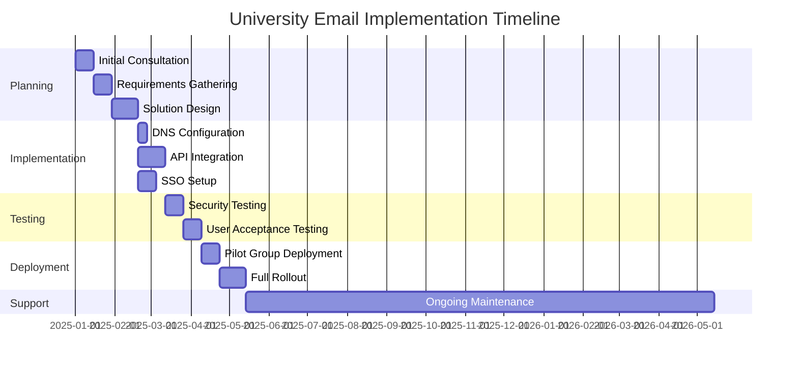
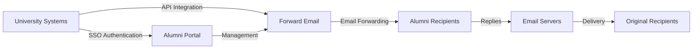

# دراسة حالة: كيف تدعم Forward Email حلول البريد الإلكتروني للخريجين في أفضل الجامعات {#case-study-how-forward-email-powers-alumni-email-solutions-for-top-universities}


## جدول المحتويات {#table-of-contents}

* [مقدمة](#foreword)
* [توفير كبير في التكاليف مع تسعير مستقر](#dramatic-cost-savings-with-stable-pricing)
  * [توفير الجامعات في العالم الحقيقي](#real-world-university-savings)
* [تحدي البريد الإلكتروني لخريجي الجامعة](#the-university-alumni-email-challenge)
  * [قيمة هوية البريد الإلكتروني للخريجين](#the-value-of-alumni-email-identity)
  * [الحلول التقليدية لا ترقى للمستوى](#traditional-solutions-fall-short)
  * [حل Forward Email](#the-forward-email-solution)
* [التنفيذ الفني: كيف يعمل](#technical-implementation-how-it-works)
  * [الهيكلية الأساسية](#core-architecture)
  * [التكامل مع أنظمة الجامعة](#integration-with-university-systems)
  * [الإدارة عبر API](#api-driven-management)
  * [تكوين DNS والتحقق](#dns-configuration-and-verification)
  * [الاختبار وضمان الجودة](#testing-and-quality-assurance)
* [الجدول الزمني للتنفيذ](#implementation-timeline)
* [عملية التنفيذ: من الترحيل إلى الصيانة](#implementation-process-from-migration-to-maintenance)
  * [التقييم والتخطيط الأولي](#initial-assessment-and-planning)
  * [استراتيجية الترحيل](#migration-strategy)
  * [الإعداد الفني والتكوين](#technical-setup-and-configuration)
  * [تصميم تجربة المستخدم](#user-experience-design)
  * [التدريب والتوثيق](#training-and-documentation)
  * [الدعم المستمر والتحسين](#ongoing-support-and-optimization)
* [دراسة حالة: جامعة كامبريدج](#case-study-university-of-cambridge)
  * [التحدي](#challenge)
  * [الحل](#solution)
  * [النتائج](#results)
* [الفوائد للجامعات والخريجين](#benefits-for-universities-and-alumni)
  * [للجامعات](#for-universities)
  * [للخريجين](#for-alumni)
  * [معدلات التبني بين الخريجين](#adoption-rates-among-alumni)
  * [توفير التكاليف مقارنة بالحلول السابقة](#cost-savings-compared-to-previous-solutions)
* [اعتبارات الأمان والخصوصية](#security-and-privacy-considerations)
  * [إجراءات حماية البيانات](#data-protection-measures)
  * [إطار الامتثال](#compliance-framework)
* [التطورات المستقبلية](#future-developments)
* [الخاتمة](#conclusion)


## مقدمة {#foreword}

لقد أنشأنا أكثر خدمة إعادة توجيه بريد إلكتروني أمانًا وخصوصية ومرونة في العالم للجامعات المرموقة وخريجيها.

في المشهد التنافسي للتعليم العالي، الحفاظ على علاقات دائمة مع الخريجين ليس مجرد مسألة تقليد—بل هو ضرورة استراتيجية. واحدة من أكثر الطرق الملموسة التي تعزز بها الجامعات هذه العلاقات هي من خلال عناوين البريد الإلكتروني للخريجين، مما يوفر للخريجين هوية رقمية تعكس تراثهم الأكاديمي.

في Forward Email، تعاونّا مع بعض من أرقى المؤسسات التعليمية في العالم لإحداث ثورة في كيفية إدارة خدمات البريد الإلكتروني للخريجين. حل إعادة توجيه البريد الإلكتروني الخاص بنا على مستوى المؤسسات يدعم الآن أنظمة البريد الإلكتروني للخريجين في [جامعة كامبريدج](https://en.wikipedia.org/wiki/University_of_Cambridge)، و[جامعة ميريلاند](https://en.wikipedia.org/wiki/University_of_Maryland,_College_Park)، و[جامعة تافتس](https://en.wikipedia.org/wiki/Tufts_University)، و[كلية سوارثمور](https://en.wikipedia.org/wiki/Swarthmore_College)، حيث يخدمون معًا آلاف الخريجين حول العالم.

تستعرض هذه التدوينة كيف أصبحت خدمتنا [المفتوحة المصدر](https://en.wikipedia.org/wiki/Open-source_software) والمركزة على الخصوصية هي الحل المفضل لهذه المؤسسات، والتنفيذات التقنية التي تجعل ذلك ممكنًا، والتأثير التحويلي الذي أحدثته على كل من الكفاءة الإدارية ورضا الخريجين.


## توفير كبير في التكاليف مع تسعير مستقر {#dramatic-cost-savings-with-stable-pricing}
الفوائد المالية لحلنا كبيرة، خاصة عند مقارنتها بالأسعار التي ترتفع باستمرار لمزودي البريد الإلكتروني التقليديين:

| الحل                           | التكلفة لكل خريج (سنويًا)                                                                                 | التكلفة لـ 100,000 خريج | الزيادات الأخيرة في الأسعار                                                                                                                                                             |
| ------------------------------ | --------------------------------------------------------------------------------------------------------- | ----------------------- | ---------------------------------------------------------------------------------------------------------------------------------------------------------------------------------------- |
| Google Workspace للأعمال       | 72 دولارًا                                                                                                | 7,200,000 دولار         | • 2019: G Suite Basic من 5 إلى 6 دولارات شهريًا (+20%)<br>• 2023: زيادة بنسبة 20% في الخطط المرنة<br>• 2025: Business Plus من 18 إلى 26.40 دولارًا شهريًا (+47%) مع ميزات الذكاء الاصطناعي |
| Google Workspace للتعليم       | مجاني (Education Fundamentals)<br>3 دولارات/طالب/سنة (Education Standard)<br>5 دولارات/طالب/سنة (Education Plus) | مجاني - 500,000 دولار   | • خصومات الحجم: 5% للرخص من 100-499<br>• خصومات الحجم: 10% لأكثر من 500 رخصة<br>• الطبقة المجانية محدودة بالخدمات الأساسية                                                           |
| Microsoft 365 للأعمال          | 60 دولارًا                                                                                                | 6,000,000 دولار         | • 2023: تقديم تحديثات أسعار نصف سنوية<br>• 2025 (يناير): Personal من 6.99 إلى 9.99 دولار شهريًا (+43%) مع Copilot AI<br>• 2025 (أبريل): زيادة 5% على الالتزامات السنوية المدفوعة شهريًا    |
| Microsoft 365 للتعليم          | مجاني (A1)<br>38-55 دولارًا/عضو هيئة تدريس/سنة (A3)<br>65-96 دولارًا/عضو هيئة تدريس/سنة (A5)             | مجاني - 96,000 دولار    | • تراخيص الطلاب غالبًا ما تكون مرفقة مع مشتريات هيئة التدريس<br>• تسعير مخصص من خلال تراخيص الحجم<br>• الطبقة المجانية محدودة بالإصدارات الويب                                            |
| Exchange المستضاف ذاتيًا      | 45 دولارًا                                                                                                | 4,500,000 دولار         | تستمر تكاليف الصيانة والأمان في الارتفاع                                                                                                                                                  |
| **Forward Email Enterprise**   | **ثابت 250 دولارًا شهريًا**                                                                               | **3,000 دولار سنويًا**  | **لا توجد زيادات في الأسعار منذ الإطلاق**                                                                                                                                                 |

### التوفير الحقيقي للجامعات {#real-world-university-savings}

إليك مقدار التوفير السنوي لشركائنا من الجامعات عند اختيار Forward Email بدلاً من المزودين التقليديين:

| الجامعة                  | عدد الخريجين | التكلفة السنوية مع Google | التكلفة السنوية مع Forward Email | التوفير السنوي |
| ----------------------- | ------------ | ------------------------- | -------------------------------- | -------------- |
| جامعة كامبريدج          | 30,000       | 90,000 دولار              | 3,000 دولار                      | 87,000 دولار   |
| كلية سوارثمور           | 5,000        | 15,000 دولار              | 3,000 دولار                      | 12,000 دولار   |
| جامعة تافتس             | 12,000       | 36,000 دولار              | 3,000 دولار                      | 33,000 دولار   |
| جامعة ميريلاند          | 25,000       | 75,000 دولار              | 3,000 دولار                      | 72,000 دولار   |

> \[!NOTE]
> عادةً ما تكلف خدمة Forward Email enterprise 250 دولارًا شهريًا فقط، دون تكلفة إضافية لكل مستخدم، مع حدود معدل API مضمونة، والتكلفة الإضافية الوحيدة هي التخزين إذا كنت بحاجة إلى جيجابايت/تيرابايت إضافية للطلاب (+3 دولارات لكل 10 جيجابايت تخزين إضافي). نستخدم أقراص NVMe SSD لدعم سريع لبروتوكولات IMAP/POP3/SMTP/CalDAV/CardDAV أيضًا.
> \[!IMPORTANT]
> على عكس جوجل ومايكروسوفت، اللذين زادا أسعارهما مرارًا مع دمج ميزات الذكاء الاصطناعي التي تحلل بياناتك، تحافظ Forward Email على أسعار مستقرة مع تركيز صارم على الخصوصية. نحن لا نستخدم الذكاء الاصطناعي، ولا نتتبع أنماط الاستخدام، ولا نخزن السجلات أو الرسائل الإلكترونية على القرص (يتم كل المعالجة في الذاكرة)، مما يضمن خصوصية كاملة لاتصالات الخريجين الخاصة بك.

يمثل هذا تخفيضًا كبيرًا في التكلفة مقارنة بحلول استضافة البريد الإلكتروني التقليدية — أموال يمكن للجامعات إعادة توجيهها للمنح الدراسية أو البحث أو أنشطة أخرى حيوية للرسالة. وفقًا لتحليل عام 2023 من Email Vendor Selection، تسعى المؤسسات التعليمية بشكل متزايد إلى بدائل فعالة من حيث التكلفة لمزودي البريد الإلكتروني التقليديين مع استمرار ارتفاع الأسعار مع دمج ميزات الذكاء الاصطناعي ([Email Vendor Selection, 2023](https://www.emailvendorselection.com/email-service-provider-list/)).


## تحدي بريد الخريجين الجامعي {#the-university-alumni-email-challenge}

بالنسبة للجامعات، توفير عناوين بريد إلكتروني مدى الحياة للخريجين يمثل مجموعة فريدة من التحديات التي تكافح حلول البريد الإلكتروني التقليدية لمعالجتها بفعالية. كما هو مذكور في نقاش شامل على ServerFault، تحتاج الجامعات ذات القواعد الكبيرة من المستخدمين إلى حلول بريد إلكتروني متخصصة توازن بين الأداء والأمان والفعالية من حيث التكلفة ([ServerFault, 2009](https://serverfault.com/questions/97364/what-is-the-best-mail-server-for-a-university-with-a-large-amount-of-users)).

### قيمة هوية بريد الخريجين {#the-value-of-alumni-email-identity}

عناوين بريد الخريجين (مثل `firstname.lastname@cl.cam.ac.uk` أو `username@terpalum.umd.edu`) تخدم وظائف مهمة متعددة:

* الحفاظ على الاتصال المؤسسي وهوية العلامة التجارية
* تسهيل التواصل المستمر مع الجامعة
* تعزيز المصداقية المهنية للخريجين
* دعم شبكات الخريجين وبناء المجتمع
* توفير نقطة اتصال مستقرة مدى الحياة

تسلط أبحاث تيكادي (2020) الضوء على أن عناوين البريد الإلكتروني التعليمية توفر فوائد عديدة للخريجين، بما في ذلك الوصول إلى الموارد الأكاديمية، والمصداقية المهنية، والخصومات الحصرية على خدمات مختلفة ([Medium, 2020](https://medium.com/coders-capsule/top-20-benefits-of-having-an-educational-email-address-91a09795e05)).

> \[!TIP]
> قم بزيارة دليلنا الجديد [AlumniEmail.com](https://alumniemail.com) للحصول على مورد شامل لخدمات بريد الخريجين الجامعي، بما في ذلك أدلة الإعداد، وأفضل الممارسات، ودليل قابل للبحث عن نطاقات بريد الخريجين. إنه بمثابة مركز مركزي لجميع معلومات بريد الخريجين.

### الحلول التقليدية غير كافية {#traditional-solutions-fall-short}

تقدم أنظمة البريد الإلكتروني التقليدية عدة قيود عند تطبيقها على احتياجات بريد الخريجين:

* **تكلفة مرتفعة**: نماذج الترخيص لكل مستخدم تصبح غير مستدامة ماليًا لعدد كبير من الخريجين
* **عبء إداري**: إدارة آلاف أو ملايين الحسابات تتطلب موارد تقنية كبيرة
* **مخاوف أمنية**: الحفاظ على أمان الحسابات الخاملة يزيد من التعرض للمخاطر
* **مرونة محدودة**: الأنظمة الصارمة لا يمكنها التكيف مع الاحتياجات الفريدة لإعادة توجيه بريد الخريجين
* **مشاكل الخصوصية**: العديد من المزودين يفحصون محتوى البريد لأغراض إعلانية

يكشف نقاش على Quora حول صيانة البريد الجامعي أن المخاوف الأمنية هي سبب رئيسي قد يدفع الجامعات إلى تقييد أو إلغاء عناوين بريد الخريجين، حيث يمكن أن تكون الحسابات غير المستخدمة عرضة للاختراق وسرقة الهوية ([Quora, 2011](https://www.quora.com/Is-there-any-cost-for-a-college-or-university-to-maintain-edu-e-mail-addresses)).

### حل Forward Email {#the-forward-email-solution}

نهجنا يعالج هذه التحديات من خلال نموذج مختلف جوهريًا:

* إعادة توجيه البريد الإلكتروني بدلاً من الاستضافة
* تسعير ثابت بدلاً من تكاليف لكل مستخدم
* بنية مفتوحة المصدر للشفافية والأمان
* تصميم يركز على الخصوصية بدون فحص المحتوى
* ميزات متخصصة لإدارة هوية الجامعة


## التنفيذ الفني: كيف يعمل {#technical-implementation-how-it-works}
حلنا يستفيد من بنية تقنية متطورة لكنها بسيطة وأنيقة لتقديم إعادة توجيه البريد الإلكتروني بشكل موثوق وآمن وعلى نطاق واسع.

### البنية الأساسية {#core-architecture}

يتكون نظام Forward Email من عدة مكونات رئيسية:

* خوادم MX موزعة لتوفير توافر عالي
* إعادة توجيه في الوقت الحقيقي بدون تخزين الرسائل
* مصادقة بريد إلكتروني شاملة
* دعم النطاقات الفرعية والنطاقات المخصصة
* إدارة الحسابات مدفوعة بواسطة API

وفقًا لمتخصصي تكنولوجيا المعلومات على ServerFault، بالنسبة للجامعات التي تسعى لتنفيذ حلول البريد الإلكتروني الخاصة بها، يُوصى باستخدام Postfix كأفضل وكيل نقل بريد (MTA)، بينما يُفضل استخدام Courier أو Dovecot للوصول عبر IMAP/POP3 ([ServerFault, 2009](https://serverfault.com/questions/97364/what-is-the-best-mail-server-for-a-university-with-a-large-amount-of-users)). ومع ذلك، فإن حلنا يلغي الحاجة للجامعات لإدارة هذه الأنظمة المعقدة بأنفسها.

### التكامل مع أنظمة الجامعة {#integration-with-university-systems}

قمنا بتطوير مسارات تكامل سلسة مع البنية التحتية الحالية للجامعة:

* التزويد الآلي من خلال تكامل [RESTful API](https://forwardemail.net/email-api)
* خيارات العلامة التجارية المخصصة لبوابات الجامعة
* إدارة مرنة للأسماء المستعارة للأقسام والمنظمات
* عمليات مجمعة للإدارة الفعالة

### الإدارة المدفوعة بواسطة API {#api-driven-management}

تمكن [RESTful API](https://forwardemail.net/email-api) الجامعات من أتمتة إدارة البريد الإلكتروني:

```javascript
// مثال: إنشاء عنوان بريد إلكتروني جديد للخريجين
const response = await fetch('https://forwardemail.net/api/v1/domains/example.edu/aliases', {
  method: 'POST',
  headers: {
    'Content-Type': 'application/json',
    'Authorization': `Basic ${Buffer.from(YOUR_API_TOKEN + ":").toString('base64')}`
  },
  body: JSON.stringify({
    name: 'alumni.john.smith',
    recipients: ['johnsmith@gmail.com'],
    has_recipient_verification: true
  })
});
```

### تكوين DNS والتحقق {#dns-configuration-and-verification}

التكوين الصحيح لـ DNS أمر حاسم لتسليم البريد الإلكتروني. يساعد فريقنا في:

* تكوين [DNS](https://en.wikipedia.org/wiki/Domain_Name_System) بما في ذلك سجلات MX
* تنفيذ أمان البريد الإلكتروني الشامل باستخدام حزمة [mailauth](https://www.npmjs.com/package/mailauth) مفتوحة المصدر، وهي أداة متعددة الاستخدامات لمصادقة البريد الإلكتروني التي تتعامل مع:
  * [SPF](https://en.wikipedia.org/wiki/Sender_Policy_Framework) (إطار سياسة المرسل) لمنع انتحال البريد الإلكتروني
  * [DKIM](https://en.wikipedia.org/wiki/DomainKeys_Identified_Mail) (مفاتيح المجال للبريد الإلكتروني المصدق) لمصادقة البريد الإلكتروني
  * [DMARC](https://en.wikipedia.org/wiki/Email_authentication) (مصادقة الرسائل والتقارير والامتثال المعتمدة على النطاق) لتطبيق السياسات
  * [MTA-STS](https://en.wikipedia.org/wiki/Opportunistic_TLS) (أمان النقل الصارم لوكيل نقل البريد SMTP) لفرض تشفير TLS
  * [ARC](https://en.wikipedia.org/wiki/DomainKeys_Identified_Mail#Authenticated_Received_Chain) (سلسلة الاستلام المصدقة) للحفاظ على المصادقة عند إعادة توجيه الرسائل
  * [SRS](https://en.wikipedia.org/wiki/Sender_Rewriting_Scheme) (مخطط إعادة كتابة المرسل) للحفاظ على تحقق SPF عبر إعادة التوجيه
  * [BIMI](https://en.wikipedia.org/wiki/Email_authentication) (مؤشرات العلامة التجارية لتحديد الرسائل) لعرض الشعار في عملاء البريد الإلكتروني الداعمين
* التحقق من سجل TXT في DNS لملكية النطاق

حزمة `mailauth` (<http://npmjs.com/package/mailauth>) هي الحل المفتوح المصدر بالكامل الذي يتعامل مع جميع جوانب مصادقة البريد الإلكتروني في مكتبة متكاملة واحدة. على عكس الحلول المملوكة، يضمن هذا النهج الشفافية، والتحديثات الأمنية المنتظمة، والتحكم الكامل في عملية مصادقة البريد الإلكتروني.

### الاختبار وضمان الجودة {#testing-and-quality-assurance}

قبل النشر الكامل، نجري اختبارات صارمة:

* اختبار تسليم البريد الإلكتروني من البداية للنهاية
* اختبار التحميل لسيناريوهات الحجم الكبير
* اختبار اختراق الأمان
* التحقق من تكامل API
* اختبار قبول المستخدم مع ممثلي الخريجين
## الجدول الزمني للتنفيذ {#implementation-timeline}


```mermaid
gantt
    title University Email Implementation Timeline
    dateFormat  YYYY-MM-DD
    section Planning
    Initial Consultation           :a1, 2025-01-01, 14d
    Requirements Gathering         :a2, after a1, 14d
    Solution Design                :a3, after a2, 21d
    section Implementation
    DNS Configuration              :b1, after a3, 7d
    API Integration                :b2, after a3, 21d
    SSO Setup                      :b3, after a3, 14d
    section Testing
    Security Testing               :c1, after b1 b2 b3, 14d
    User Acceptance Testing        :c2, after c1, 14d
    section Deployment
    Pilot Group Deployment         :d1, after c2, 14d
    Full Rollout                   :d2, after d1, 21d
    section Support
    Ongoing Maintenance            :e1, after d2, 365d
```


## عملية التنفيذ: من الترحيل إلى الصيانة {#implementation-process-from-migration-to-maintenance}

تضمن عملية التنفيذ المنظمة لدينا انتقالًا سلسًا للجامعات التي تعتمد حلنا.

### التقييم الأولي والتخطيط {#initial-assessment-and-planning}

نبدأ بتقييم شامل لنظام البريد الإلكتروني الحالي للجامعة، وقاعدة بيانات الخريجين، والمتطلبات التقنية. تشمل هذه المرحلة:

* مقابلات مع أصحاب المصلحة في تكنولوجيا المعلومات، وعلاقات الخريجين، والإدارة
* تدقيق تقني للبنية التحتية للبريد الإلكتروني الحالية
* تخطيط البيانات لسجلات الخريجين
* مراجعة الأمان والامتثال
* تطوير الجدول الزمني للمشروع والمعالم

### استراتيجية الترحيل {#migration-strategy}

استنادًا إلى التقييم، نطور استراتيجية ترحيل مخصصة تقلل من الاضطراب مع ضمان سلامة البيانات الكاملة:

* نهج الترحيل المرحلي حسب دفعات الخريجين
* تشغيل أنظمة متوازية أثناء الانتقال
* بروتوكولات تحقق شاملة للبيانات
* إجراءات استرجاع لأي مشاكل في الترحيل
* خطة تواصل واضحة لجميع أصحاب المصلحة

### الإعداد الفني والتكوين {#technical-setup-and-configuration}

يتولى فريقنا الفني جميع جوانب إعداد النظام:

* تكوين DNS والتحقق منه
* تكامل API مع أنظمة الجامعة
* تطوير بوابة مخصصة بعلامة الجامعة التجارية
* إعداد مصادقة البريد الإلكتروني (SPF, DKIM, DMARC)

### تصميم تجربة المستخدم {#user-experience-design}

نعمل عن كثب مع الجامعات لإنشاء واجهات بديهية لكل من المسؤولين والخريجين:

* بوابات بريد إلكتروني مخصصة بعلامة الخريجين التجارية
* إدارة تبسيط إعادة توجيه البريد الإلكتروني
* تصاميم متجاوبة مع الأجهزة المحمولة
* الامتثال لمعايير الوصول
* دعم متعدد اللغات عند الحاجة

### التدريب والتوثيق {#training-and-documentation}

يضمن التدريب الشامل قدرة جميع أصحاب المصلحة على استخدام النظام بفعالية:

* جلسات تدريب للمسؤولين
* توثيق تقني لفريق تكنولوجيا المعلومات
* أدلة المستخدم للخريجين
* دروس فيديو للمهام الشائعة
* تطوير قاعدة معرفة

### الدعم المستمر والتحسين {#ongoing-support-and-optimization}

تستمر شراكتنا إلى ما بعد التنفيذ:

* دعم فني على مدار الساعة طوال أيام الأسبوع
* تحديثات منتظمة للنظام وتصحيحات الأمان
* مراقبة الأداء والتحسين
* استشارات حول أفضل ممارسات البريد الإلكتروني
* تحليلات البيانات والتقارير


## دراسة حالة: جامعة كامبريدج {#case-study-university-of-cambridge}

سعت جامعة كامبريدج إلى حل لتوفير عناوين بريد إلكتروني @cam.ac.uk للخريجين مع تقليل عبء تكنولوجيا المعلومات والتكاليف.

### التحدي {#challenge}

واجهت كامبريدج عدة تحديات مع نظام البريد الإلكتروني السابق للخريجين:

* تكاليف تشغيلية عالية لصيانة بنية تحتية منفصلة للبريد الإلكتروني
* العبء الإداري لإدارة آلاف الحسابات
* مخاوف أمنية مع الحسابات الخاملة
* تكامل محدود مع أنظمة قاعدة بيانات الخريجين
* زيادة متطلبات التخزين

### الحل {#solution}

نفذت Forward Email حلاً شاملاً:

* إعادة توجيه البريد الإلكتروني لجميع عناوين خريجي @cam.ac.uk
* بوابة مخصصة بعلامة تجارية للخريجين للخدمة الذاتية
* تكامل API مع قاعدة بيانات خريجي كامبريدج
* تنفيذ شامل لأمان البريد الإلكتروني

### النتائج {#results}

حقق التنفيذ فوائد كبيرة:
* تقليل كبير في التكاليف مقارنةً بالحل السابق
* موثوقية تسليم البريد الإلكتروني بنسبة 99.9%
* تبسيط الإدارة من خلال الأتمتة
* تعزيز الأمان باستخدام مصادقة البريد الإلكتروني الحديثة
* ردود فعل إيجابية من الخريجين حول سهولة استخدام النظام


## الفوائد للجامعات والخريجين {#benefits-for-universities-and-alumni}

يقدم حلنا فوائد ملموسة لكل من المؤسسات وخريجيها.

### للجامعات {#for-universities}

* **كفاءة التكلفة**: تسعير ثابت بغض النظر عن عدد الخريجين
* **بساطة الإدارة**: إدارة مؤتمتة عبر API
* **تعزيز الأمان**: مصادقة بريد إلكتروني شاملة
* **اتساق العلامة التجارية**: عناوين بريد إلكتروني مؤسسية مدى الحياة
* **تفاعل الخريجين**: تعزيز الروابط من خلال الخدمة المستمرة

وفقًا لـ BulkSignature (2023)، توفر منصات البريد الإلكتروني للمؤسسات التعليمية فوائد كبيرة تشمل الفعالية من حيث التكلفة من خلال الخطط المجانية أو منخفضة التكلفة، وكفاءة الوقت من خلال قدرات الاتصال الجماعي، وميزات التتبع لمراقبة تسليم البريد الإلكتروني والتفاعل ([BulkSignature, 2023](https://bulksignature.com/blog/5-best-email-platforms-for-educational-institutions/)).

### للخريجين {#for-alumni}

* **الهوية المهنية**: عنوان بريد إلكتروني جامعي مرموق
* **استمرارية البريد الإلكتروني**: إعادة التوجيه إلى أي بريد إلكتروني شخصي
* **حماية الخصوصية**: عدم فحص المحتوى أو التنقيب عن البيانات
* **إدارة مبسطة**: تحديثات سهلة للمستلمين
* **تعزيز الأمان**: مصادقة بريد إلكتروني حديثة

تسلط الأبحاث من المجلة الدولية للدراسات التعليمية ومحو الأمية الضوء على أهمية التواصل عبر البريد الإلكتروني بشكل صحيح في البيئات الأكاديمية، مشيرة إلى أن معرفة استخدام البريد الإلكتروني مهارة حاسمة لكل من الطلاب والخريجين في السياقات المهنية ([IJELS, 2021](https://files.eric.ed.gov/fulltext/EJ1319324.pdf)).

### معدلات التبني بين الخريجين {#adoption-rates-among-alumni}

تبلغ الجامعات عن معدلات تبني ورضا عالية بين مجتمعات خريجيها.

### التوفير في التكاليف مقارنة بالحلول السابقة {#cost-savings-compared-to-previous-solutions}

كان الأثر المالي كبيرًا، حيث أبلغت الجامعات عن توفيرات كبيرة في التكاليف مقارنة بحلول البريد الإلكتروني السابقة.


## اعتبارات الأمان والخصوصية {#security-and-privacy-considerations}

بالنسبة للمؤسسات التعليمية، حماية بيانات الخريجين ليست مجرد ممارسة جيدة—بل غالبًا ما تكون مطلبًا قانونيًا بموجب لوائح مثل GDPR في أوروبا.

### تدابير حماية البيانات {#data-protection-measures}

يتضمن حلنا طبقات متعددة من الأمان:

* تشفير شامل للبريد الإلكتروني من الطرف إلى الطرف
* عدم تخزين محتوى البريد الإلكتروني على خوادمنا
* تدقيقات أمنية منتظمة واختبارات اختراق
* الامتثال لمعايير حماية البيانات الدولية
* شفرة مفتوحة المصدر وشفافة للتحقق من الأمان

> \[!WARNING]
> يقوم العديد من مزودي البريد الإلكتروني بفحص محتوى البريد الإلكتروني لأغراض إعلانية أو لتدريب نماذج الذكاء الاصطناعي. تثير هذه الممارسة مخاوف جدية بشأن الخصوصية، خاصةً للاتصالات المهنية والأكاديمية. لا يقوم Forward Email أبدًا بفحص محتوى البريد الإلكتروني ويعالج جميع الرسائل في الذاكرة لضمان الخصوصية الكاملة.

### إطار الامتثال {#compliance-framework}

نحافظ على الامتثال الصارم للوائح ذات الصلة:

* الامتثال لـ GDPR للمؤسسات الأوروبية
* شهادة SOC 2 النوع الثاني
* تقييمات أمنية سنوية
* اتفاقية معالجة البيانات (DPA) متاحة على [forwardemail.net/dpa](https://forwardemail.net/dpa)
* تحديثات منتظمة للامتثال مع تطور اللوائح


## التطورات المستقبلية {#future-developments}

نواصل تحسين حل البريد الإلكتروني للخريجين بميزات وقدرات جديدة:

* تحليلات محسنة لمسؤولي الجامعات
* حماية متقدمة ضد التصيد الاحتيالي
* توسيع قدرات API للتكامل الأعمق
* خيارات مصادقة إضافية


## الخاتمة {#conclusion}

لقد أحدث Forward Email ثورة في كيفية تقديم الجامعات وإدارة خدمات البريد الإلكتروني للخريجين. من خلال استبدال استضافة البريد الإلكتروني المكلفة والمعقدة بإعادة توجيه بريد إلكتروني أنيقة وآمنة، مكنّا المؤسسات من تقديم عناوين بريد إلكتروني مدى الحياة لجميع الخريجين مع تقليل كبير في التكاليف والعبء الإداري.
شراكاتنا مع مؤسسات مرموقة مثل كامبريدج، ماريلاند، تافتس، وسوارثمور تُظهر فعالية نهجنا عبر بيئات تعليمية متنوعة. مع تزايد الضغط على الجامعات للحفاظ على علاقاتها بالخريجين مع التحكم في التكاليف، يقدم حلنا بديلاً مقنعًا لأنظمة البريد الإلكتروني التقليدية.


```mermaid
flowchart LR
    A[University Systems] -->|API Integration| B[Forward Email]
    B -->|Email Forwarding| C[Alumni Recipients]
    C -->|Replies| D[Email Servers]
    D -->|Delivery| E[Original Recipients]
    F[Alumni Portal] -->|Management| B
    A -->|SSO Authentication| F
```

بالنسبة للجامعات المهتمة باستكشاف كيف يمكن لـ Forward Email تحويل خدمات البريد الإلكتروني الخاصة بالخريجين، تواصل مع فريقنا على <support@forwardemail.net> أو زر [forwardemail.net](https://forwardemail.net) لمعرفة المزيد عن حلولنا المؤسسية.
