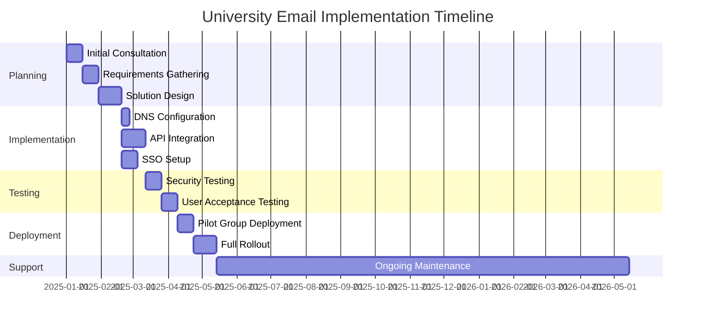
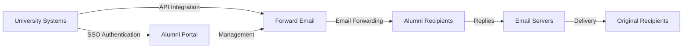

# Případová studie: Jak přeposílání e-mailů posiluje e-mailová řešení pro absolventy špičkových univerzit {#case-study-how-forward-email-powers-alumni-email-solutions-for-top-universities}


__CHRÁNĚNÁ_URL_13__ Obsah {__CHRÁNĚNÁ_URL_14__

* [Předmluva](#foreword)
* [Dramatické úspory nákladů se stabilními cenami](#dramatic-cost-savings-with-stable-pricing)
  * [Univerzitní úspory v reálném světě](#real-world-university-savings)
* [E-mailová výzva pro absolventy univerzity](#the-university-alumni-email-challenge)
  * [Hodnota e-mailové identity absolventů](#the-value-of-alumni-email-identity)
  * [Tradiční řešení selhávají](#traditional-solutions-fall-short)
  * [Řešení přesměrování e-mailu](#the-forward-email-solution)
* [Technická implementace: Jak to funguje](#technical-implementation-how-it-works)
  * [Základní architektura](#core-architecture)
  * [Integrace s univerzitními systémy](#integration-with-university-systems)
  * [Správa řízená API](#api-driven-management)
  * [Konfigurace a ověření DNS](#dns-configuration-and-verification)
  * [Testování a zajištění kvality](#testing-and-quality-assurance)
* [Časová osa implementace](#implementation-timeline)
* [Proces implementace: Od migrace po údržbu](#implementation-process-from-migration-to-maintenance)
  * [Počáteční hodnocení a plánování](#initial-assessment-and-planning)
  * [Migrační strategie](#migration-strategy)
  * [Technické nastavení a konfigurace](#technical-setup-and-configuration)
  * [Design uživatelské zkušenosti](#user-experience-design)
  * [Školení a dokumentace](#training-and-documentation)
  * [Průběžná podpora a optimalizace](#ongoing-support-and-optimization)
* [Případová studie: University of Cambridge](#case-study-university-of-cambridge)
  * [Výzva](#challenge)
  * [Řešení](#solution)
  * [Výsledky](#results)
* [Výhody pro univerzity a absolventy](#benefits-for-universities-and-alumni)
  * [Pro univerzity](#for-universities)
  * [Pro absolventy](#for-alumni)
  * [Míra přijetí mezi absolventy](#adoption-rates-among-alumni)
  * [Úspora nákladů ve srovnání s předchozími řešeními](#cost-savings-compared-to-previous-solutions)
* [Bezpečnost a ochrana osobních údajů](#security-and-privacy-considerations)
  * [Opatření na ochranu údajů](#data-protection-measures)
  * [Rámec shody](#compliance-framework)
* [Budoucí vývoj](#future-developments)
* [Závěr](#conclusion)

__CHRÁNĚNÁ_URL_15__ Předmluva {__CHRÁNĚNÁ_URL_16__

Pro prestižní univerzity a jejich absolventy jsme vybudovali celosvětově nejbezpečnější, soukromou a flexibilní službu přeposílání e-mailů.

V konkurenčním prostředí vysokoškolského vzdělávání není udržování celoživotního spojení s absolventy jen záležitostí tradice – je to strategický imperativ. Jedním z nejhmatatelnějších způsobů, jak univerzity podporují tato spojení, jsou e-mailové adresy absolventů, které absolventům poskytují digitální identitu, která odráží jejich akademické dědictví.

Ve společnosti Forward Email jsme navázali partnerství s některými z nejprestižnějších vzdělávacích institucí na světě, abychom zrevolucionalizovali způsob, jakým spravují e-mailové služby pro absolventy. Naše řešení pro přeposílání e-mailů na podnikové úrovni nyní pohání e-mailové systémy absolventů pro [University of Cambridge](https://en.wikipedia.org/wiki/University_of_Cambridge), [University of Maryland](https://en.wikipedia.org/wiki/University_of_Maryland,\_College_Park), [Tuftsova univerzita](https://en.wikipedia.org/wiki/Tufts_University) a [Swarthmore College](https://en.wikipedia.org/wiki/Swarthmore_College), které dohromady slouží tisícům absolventů po celém světě.

Tento blogový příspěvek zkoumá, jak se naše služba přeposílání e-mailů [open-source](https://en.wikipedia.org/wiki/Open-source_software) zaměřená na soukromí stala preferovaným řešením pro tyto instituce, technické implementace, které to umožňují, a transformační dopad, který měla na administrativní efektivitu i spokojenost absolventů.

## Dramatické úspory nákladů díky stabilním cenám {#dramatic-cost-savings-with-stable-pricing}

Finanční přínosy našeho řešení jsou značné, zejména ve srovnání s neustále rostoucími cenami tradičních poskytovatelů e-mailů:

| Řešení | Cena za absolventa (roční) | Náklady na 100 000 absolventů | Nedávné zvýšení cen |
| ------------------------------ | --------------------------------------------------------------------------------------------------------- | ----------------------- | ---------------------------------------------------------------------------------------------------------------------------------------------------------------------------------------- |
| Google Workspace pro firmy | $72 | $7,200,000 | • 2019: G Suite Basic z 5 na 6 dolarů měsíčně (+20 %)<br>• 2023: Flexibilní tarify se zvýšily o 20 %<br>• 2025: Business Plus z 18 na 26,40 dolarů měsíčně (+47 %) s funkcemi umělé inteligence |
| Google Workspace for Education | Zdarma (Základy vzdělávání)<br>3 $/student/rok (Standard vzdělávání)<br>5 $/student/rok (Education Plus) | Zdarma - 500 000 $ | • Množstevní slevy: 5 % pro 100–499 licencí<br>• Množstevní slevy: 10 % pro 500 a více licencí<br>• Bezplatná úroveň omezena na základní služby |
| Microsoft 365 Business | $60 | $6,000,000 | • 2023: Zavedení aktualizací cen dvakrát ročně<br>• 2025 (leden): Personal z 6,99 USD na 9,99 USD/měsíc (+43 %) s Copilot AI<br>• 2025 (duben): 5% nárůst ročních závazků placených měsíčně |
| Microsoft 365 Education | Zdarma (A1)<br>38–55 USD/akademický pracovník/rok (A3)<br>65–96 USD/akademický pracovník/rok (A5) | Zdarma - 96 000 $ | • Studentské licence jsou často součástí nákupů pro fakultu<br>• Vlastní ceny prostřednictvím hromadných licencí<br>• Bezplatná úroveň omezena na webové verze |
| Samoobslužná burza | $45 | $4,500,000 | Náklady na průběžnou údržbu a zabezpečení stále rostou |
| **Přeposílání e-mailů Enterprise** | **Fixní 250 USD/měsíc** | **3 000 USD/rok** | **Od uvedení na trh se ceny nezvýšily** |

### Úspory na univerzitní výuku v reálném světě {#real-world-university-savings}

Zde je částka, kterou naše partnerské univerzity ročně ušetří, když zvolí Forward Email před tradičními poskytovateli:

| Univerzita | Alumni hrabě | Roční náklady s Googlem | Roční náklady s přeposláním e-mailu | Roční úspory |
| ----------------------- | ------------ | ----------------------- | ------------------------------ | -------------- |
| University of Cambridge | 30,000 | $90,000 | $3,000 | $87,000 |
| Swarthmore College | 5,000 | $15,000 | $3,000 | $12,000 |
| Tuftsova univerzita | 12,000 | $36,000 | $3,000 | $33,000 |
| University of Maryland | 25,000 | $75,000 | $3,000 | $72,000 |

> \[!NOTE]
> Forward Email enterprise only costs $250/month typically, with no extra cost per user, whitelisted API rate limitations, and the only additional cost is storage if you need additional GB/TB for students (+$3 per 10 GB additional storage). We use NVMe SSD drives for fast support of IMAP/POP3/SMTP/CalDAV/CardDAV as well.

> \[!IMPORTANT]
> Unlike Google and Microsoft, who have repeatedly increased their prices while integrating AI features that analyze your data, Forward Email maintains stable pricing with a strict privacy focus. We don't use AI, don't track usage patterns, and don't store logs or emails to disk (all processing is done in-memory), ensuring complete privacy for your alumni communications.

To představuje významné snížení nákladů ve srovnání s tradičními řešeními pro hosting e-mailů – finanční prostředky, které mohou univerzity přesměrovat na stipendia, výzkum nebo jiné kriticky důležité aktivity. Podle analýzy společnosti Email Vendor Selection z roku 2023 vzdělávací instituce stále více hledají cenově efektivní alternativy k tradičním poskytovatelům e-mailů, protože ceny s integrací funkcí umělé inteligence nadále rostou ([Výběr dodavatele e-mailu, 2023](https://www.emailvendorselection.com/email-service-provider-list/)).

## E-mailová výzva pro absolventy univerzity {#the-university-alumni-email-challenge}

Pro univerzity představuje poskytování doživotních e-mailových adres absolventům jedinečnou sadu výzev, s nimiž se tradiční e-mailová řešení potýkají jen s obtížemi. Jak je uvedeno v rozsáhlé diskusi o ServerFault, univerzity s velkými uživatelskými základnami vyžadují specializovaná e-mailová řešení, která vyvažují výkon, zabezpečení a nákladovou efektivitu ([ServerFault, 2009](https://serverfault.com/questions/97364/what-is-the-best-mail-server-for-a-university-with-a-large-amount-of-users)).

### Hodnota e-mailové identity absolventů {#the-value-of-alumni-email-identity}

E-mailové adresy absolventů (například `firstname.lastname@cl.cam.ac.uk` nebo `username@terpalum.umd.edu`) plní několik důležitých funkcí:

* Udržování institucionálního propojení a identity značky
* Usnadňování průběžné komunikace s univerzitou
* Zvyšování profesní důvěryhodnosti absolventů
* Podpora navazování kontaktů s absolventy a budování komunity
* Poskytování stabilního kontaktního místa na celý život

Výzkum společnosti Tekade (2020) zdůrazňuje, že vzdělávací e-mailové adresy poskytují absolventům řadu výhod, včetně přístupu k akademickým zdrojům, profesní důvěryhodnosti a exkluzivních slev na různé služby ([Střední, 2020](https://medium.com/coders-capsule/top-20-benefits-of-having-an-educational-email-address-91a09795e05)).

> \[!TIP]
> Visit our new [AlumniEmail.com](https://alumniemail.com) directory for a comprehensive resource on university alumni email services, including setup guides, best practices, and a searchable directory of alumni email domains. It serves as a central hub for all alumni email information.

### Tradiční řešení selhávají {#traditional-solutions-fall-short}

Konvenční e-mailové systémy mají několik omezení při aplikaci na e-mailové potřeby absolventů:

* **Náklady jsou neúnosné**: Modely licencování na uživatele se stávají finančně neudržitelnými pro velké základny absolventů.
* **Administrativní zátěž**: Správa tisíců nebo milionů účtů vyžaduje značné IT zdroje.
* **Bezpečnostní obavy**: Udržování zabezpečení neaktivních účtů zvyšuje zranitelnost.
* **Omezená flexibilita**: Pevné systémy se nedokážou přizpůsobit jedinečným potřebám přeposílání e-mailů absolventů.
* **Problémy s ochranou soukromí**: Mnoho poskytovatelů skenuje obsah e-mailů pro reklamní účely.

Diskuse na Quoře o údržbě univerzitních e-mailů odhalila, že bezpečnostní obavy jsou hlavním důvodem, proč univerzity mohou omezovat nebo rušit e-mailové adresy absolventů, protože nepoužívané účty mohou být zranitelné vůči hackerským útokům a krádeži identity ([Quora, 2011](https://www.quora.com/Is-there-any-cost-for-a-college-or-university-to-maintain-edu-e-mail-addresses)).

### Řešení pro přeposílání e-mailů {#the-forward-email-solution}

Náš přístup řeší tyto výzvy prostřednictvím zásadně odlišného modelu:

* Přeposílání e-mailů namísto hostingu
* Paušální ceny namísto poplatků za uživatele
* Architektura s otevřeným zdrojovým kódem pro transparentnost a zabezpečení
* Design zaměřený na soukromí bez skenování obsahu
* Specializované funkce pro správu identit na univerzitách

## Technická implementace: Jak to funguje {#technical-implementation-how-it-works}

Naše řešení využívá sofistikovanou a přitom elegantně jednoduchou technickou architekturu k poskytování spolehlivého a bezpečného přeposílání e-mailů ve velkém měřítku.

### Základní architektura {#core-architecture}

Systém Forward Email se skládá z několika klíčových součástí:

* Distribuované MX servery pro vysokou dostupnost
* Přeposílání v reálném čase bez ukládání zpráv
* Komplexní ověřování e-mailů
* Podpora vlastních domén a subdomén
* Správa účtů řízená API

Podle IT profesionálů na ServerFault se pro univerzity, které chtějí implementovat vlastní e-mailová řešení, doporučuje Postfix jako nejlepší agent pro přenos pošty (MTA), zatímco Courier nebo Dovecot jsou preferovány pro přístup IMAP/POP3 ([ServerFault, 2009](https://serverfault.com/questions/97364/what-is-the-best-mail-server-for-a-university-with-a-large-amount-of-users)). Naše řešení však eliminuje nutnost, aby si univerzity tyto složité systémy samy spravovaly.

### Integrace s univerzitními systémy {#integration-with-university-systems}

Vyvinuli jsme bezproblémové integrační cesty se stávající univerzitní infrastrukturou:

* Automatizované zřizování prostřednictvím integrace [RESTful API](https://forwardemail.net/email-api)
* Možnosti vlastního brandingu pro univerzitní portály
* Flexibilní správa aliasů pro oddělení a organizace
* Dávkové operace pro efektivní správu

### Správa řízená API {#api-driven-management}

Náš __CHRÁNĚNÝ_LINK_132__ umožňuje univerzitám automatizovat správu e-mailů:

```javascript
// Example: Creating a new alumni email address
const response = await fetch('https://forwardemail.net/api/v1/domains/example.edu/aliases', {
  method: 'POST',
  headers: {
    'Content-Type': 'application/json',
    'Authorization': `Basic ${Buffer.from(YOUR_API_TOKEN + ":").toString('base64')}`
  },
  body: JSON.stringify({
    name: 'alumni.john.smith',
    recipients: ['johnsmith@gmail.com'],
    has_recipient_verification: true
  })
});
```

### Konfigurace a ověření DNS {#dns-configuration-and-verification}

Správná konfigurace DNS je pro doručování e-mailů zásadní. Náš tým pomáhá s:

* [DNS](https://en.wikipedia.org/wiki/Domain_Name_System) konfigurace včetně záznamů MX
* Komplexní implementace zabezpečení e-mailů s využitím našeho open-source balíčku [mailauth](https://www.npmjs.com/package/mailauth), švýcarského nožíka pro ověřování e-mailů, který zpracovává:
* [SPF](https://en.wikipedia.org/wiki/Sender_Policy_Framework) (Sender Policy Framework) pro prevenci falšování e-mailů
* [DKIM](https://en.wikipedia.org/wiki/DomainKeys_Identified_Mail) (DomainKeys Identified Mail) pro ověřování e-mailů
* [DMARC](https://en.wikipedia.org/wiki/Email_authentication) (Domain-based Message Authentication, Reporting & Conformance) pro vynucování zásad
* [MTA-STS](https://en.wikipedia.org/wiki/Opportunistic_TLS) (SMTP MTA Strict Transport Security) pro vynucování šifrování TLS
* [ARC](https://en.wikipedia.org/wiki/DomainKeys_Identified_Mail#Authenticated_Received_Chain) (Authenticated Received Chain) pro udržení ověřování při přeposílání zpráv
* [SRS](https://en.wikipedia.org/wiki/Sender_Rewriting_Scheme) (Sender Rewriting Scheme) pro zachování ověření SPF při přeposílání
* [BIMI](https://en.wikipedia.org/wiki/Email_authentication) (Brand Indicators for Message) Identifikace) pro zobrazení loga v podpůrných e-mailových klientech
* Ověření záznamu DNS TXT pro vlastnictví domény

Balíček `mailauth` (<http://npmjs.com/package/mailauth>) je plně open-source řešení, které zpracovává všechny aspekty ověřování e-mailů v jedné integrované knihovně. Na rozdíl od proprietárních řešení tento přístup zajišťuje transparentnost, pravidelné aktualizace zabezpečení a úplnou kontrolu nad procesem ověřování e-mailů.

### Testování a zajištění kvality {#testing-and-quality-assurance}

Před úplným nasazením provádíme přísné testování:

* Komplexní testování doručování e-mailů
* Zátěžové testování pro scénáře s vysokým objemem zásilek
* Penetrační testování zabezpečení
* Ověření integrace API
* Akceptační testování uživateli se zástupci absolventů

## Časový harmonogram implementace {#implementation-timeline}



## Proces implementace: Od migrace k údržbě {#implementation-process-from-migration-to-maintenance}

Náš strukturovaný proces implementace zajišťuje hladký přechod pro univerzity, které přijmou naše řešení.

### Počáteční posouzení a plánování {#initial-assessment-and-planning}

Začneme komplexním posouzením současného univerzitního e-mailového systému, databáze absolventů a technických požadavků. Tato fáze zahrnuje:

* Rozhovory se zainteresovanými stranami, IT oddělením, oddělením vztahů s absolventy a administrativou
* Technický audit stávající e-mailové infrastruktury
* Mapování dat pro záznamy o absolventech
* Kontrola bezpečnosti a souladu s předpisy
* Časový harmonogram projektu a vývoj milníků

### Migrační strategie {#migration-strategy}

Na základě posouzení vyvíjíme migrační strategii na míru, která minimalizuje narušení a zároveň zajišťuje úplnou integritu dat:

* Postupný migrační přístup absolventů
* Paralelní provoz systémů během přechodu
* Komplexní protokoly pro validaci dat
* Záložní postupy pro případné problémy s migrací
* Jasný komunikační plán pro všechny zúčastněné strany

### Technické nastavení a konfigurace {#technical-setup-and-configuration}

Náš technický tým se stará o všechny aspekty nastavení systému:

* Konfigurace a ověřování DNS
* Integrace API s univerzitními systémy
* Vývoj vlastního portálu s univerzitním brandingem
* Nastavení ověřování e-mailů (SPF, DKIM, DMARC)

### Návrh uživatelského rozhraní {#user-experience-design}

Úzce spolupracujeme s univerzitami, abychom vytvořili intuitivní rozhraní pro administrátory i absolventy:

* E-mailové portály pro absolventy s vlastním brandingem
* Zjednodušená správa přeposílání e-mailů
* Design responzivní pro mobilní zařízení
* Dodržování předpisů pro přístupnost
* Vícejazyčná podpora v případě potřeby

### Školení a dokumentace {#training-and-documentation}

Komplexní školení zajišťuje, že všechny zúčastněné strany mohou systém efektivně používat:

* Školení pro administrátory
* Technická dokumentace pro IT pracovníky
* Uživatelské příručky pro absolventy
* Video tutoriály pro běžné úkoly
* Vývoj znalostní báze

### Průběžná podpora a optimalizace {#ongoing-support-and-optimization}

Naše partnerství pokračuje i po implementaci:

* Technická podpora 24 hodin denně, 7 dní v týdnu
* Pravidelné aktualizace systému a bezpečnostní záplaty
* Monitorování a optimalizace výkonu
* Konzultace ohledně osvědčených postupů pro e-maily
* Analýza dat a reporting

## Případová studie: Univerzita v Cambridgi {#case-study-university-of-cambridge}

Univerzita v Cambridge hledala řešení, jak poskytnout absolventům e-mailové adresy @cam.ac.uk a zároveň snížit režii a náklady na IT.

__CHRÁNĚNÁ_URL_60__ Výzva {__CHRÁNĚNÁ_URL_61__

Cambridge čelila několika výzvám se svým předchozím e-mailovým systémem pro absolventy:

* Vysoké provozní náklady na údržbu samostatné e-mailové infrastruktury
* Administrativní zátěž správy tisíců účtů
* Bezpečnostní obavy spojené s nečinnými účty
* Omezená integrace s databázovými systémy absolventů
* Rostoucí požadavky na úložiště

__CHRÁNĚNÁ_URL_62__ Řešení {__CHRÁNĚNÁ_URL_63__

Forward Email implementoval komplexní řešení:

* Přeposílání e-mailů pro všechny adresy absolventů @cam.ac.uk
* Portál s vlastní značkou pro samoobsluhu absolventů
* Integrace API s databází absolventů Cambridge
* Komplexní implementace zabezpečení e-mailů

__CHRÁNĚNÁ_URL_64__ Výsledky {__CHRÁNĚNÁ_URL_65__

Implementace přinesla významné výhody:

* Výrazné snížení nákladů ve srovnání s předchozím řešením
* 99,9% spolehlivost doručování e-mailů
* Zjednodušená správa díky automatizaci
* Vylepšené zabezpečení s moderním ověřováním e-mailů
* Pozitivní zpětná vazba absolventů ohledně použitelnosti systému

## Výhody pro univerzity a absolventy {#benefits-for-universities-and-alumni}

Naše řešení přináší hmatatelné výhody jak institucím, tak jejich absolventům.

### Pro univerzity {#for-universities}

* **Nákladová efektivita**: Fixní ceny bez ohledu na počet absolventů
* **Administrativní jednoduchost**: Automatizovaná správa prostřednictvím API
* **Vylepšené zabezpečení**: Komplexní ověřování e-mailů
* **Konzistence značky**: Doživotní institucionální e-mailové adresy
* **Zapojení absolventů**: Posílené spojení prostřednictvím průběžných služeb

Podle BulkSignature (2023) nabízejí e-mailové platformy pro vzdělávací instituce významné výhody, včetně nákladové efektivity prostřednictvím bezplatných nebo nízkonákladových tarifů, časové efektivity díky možnostem masové komunikace a funkcí sledování pro monitorování doručování e-mailů a interakce ([Hromadný podpis, 2023](https://bulksignature.com/blog/5-best-email-platforms-for-educational-institutions/)).

__CHRÁNĚNÁ_URL_70__ Pro absolventy {__CHRÁNĚNÁ_URL_71__

* **Profesní identita**: Prestižní univerzitní e-mailová adresa
* **Kontinuita e-mailu**: Přeposílání na jakýkoli osobní e-mail
* **Ochrana soukromí**: Žádné skenování obsahu ani dolování dat
* **Zjednodušená správa**: Snadné aktualizace příjemců
* **Vylepšené zabezpečení**: Moderní ověřování e-mailů

Výzkum z International Journal of Education & Literacy Studies zdůrazňuje důležitost správné e-mailové komunikace v akademickém prostředí a konstatuje, že e-mailová gramotnost je klíčovou dovedností jak pro studenty, tak pro absolventy v profesním prostředí ([IJELS, 2021](https://files.eric.ed.gov/fulltext/EJ1319324.pdf)).

### Míra adopce mezi absolventy {#adoption-rates-among-alumni}

Univerzity hlásí vysokou míru přijetí a spokojenosti mezi komunitami svých absolventů.

### Úspora nákladů ve srovnání s předchozími řešeními {#cost-savings-compared-to-previous-solutions}

Finanční dopad byl značný, univerzity vykázaly značné úspory nákladů ve srovnání s jejich předchozími e-mailovými řešeními.

## Aspekty zabezpečení a ochrany soukromí {#security-and-privacy-considerations}

Pro vzdělávací instituce není ochrana dat absolventů jen dobrou praxí – je to často zákonný požadavek podle nařízení, jako je GDPR v Evropě.

### Opatření na ochranu osobních údajů {#data-protection-measures}

Naše řešení zahrnuje několik vrstev zabezpečení:

* End-to-end šifrování pro veškerý e-mailový provoz
* Žádné ukládání obsahu e-mailů na naše servery
* Pravidelné bezpečnostní audity a penetrační testy
* Dodržování mezinárodních standardů ochrany osobních údajů
* Transparentní kód s otevřeným zdrojovým kódem pro bezpečnostní ověření

> \[!WARNING]
> Many email providers scan email content for advertising purposes or to train AI models. This practice raises serious privacy concerns, especially for professional and academic communications. Forward Email never scans email content and processes all emails in-memory to ensure complete privacy.

### Rámec pro dodržování předpisů {#compliance-framework}

Dodržujeme přísné dodržování příslušných předpisů:

* Soulad s GDPR pro evropské instituce
* Certifikace SOC 2 typu II
* Roční bezpečnostní hodnocení
* Smlouva o zpracování osobních údajů (DPA) k dispozici na [forwardemail.net/dpa](https://forwardemail.net/dpa)
* Pravidelné aktualizace souladu s předpisy v závislosti na jejich vývoji

## Budoucí vývoj {#future-developments}

Pokračujeme ve vylepšování našeho e-mailového řešení pro absolventy o nové funkce a možnosti:

* Vylepšená analytika pro administrátory univerzit
* Pokročilá ochrana proti phishingu
* Rozšířené funkce API pro hlubší integraci
* Další možnosti ověřování

## Závěr {#conclusion}

Forward Email způsobil revoluci ve způsobu, jakým univerzity poskytují a spravují e-mailové služby pro absolventy. Nahrazením nákladného a komplexního e-mailového hostingu elegantním a bezpečným přeposíláním e-mailů jsme institucím umožnili nabízet doživotní e-mailové adresy všem absolventům a zároveň dramaticky snížit náklady a administrativní režii.

Naše partnerství s prestižními institucemi, jako je Cambridge, Maryland, Tufts a Swarthmore, dokazují efektivitu našeho přístupu v různých vzdělávacích prostředích. Vzhledem k tomu, že univerzity čelí rostoucímu tlaku na udržování spojení s absolventy při současné kontrole nákladů, naše řešení nabízí přesvědčivou alternativu k tradičním e-mailovým systémům.



Univerzity, které mají zájem prozkoumat, jak může Forward Email transformovat jejich e-mailové služby pro absolventy, mohou kontaktovat náš tým na adrese <support@forwardemail.net> nebo navštívit stránky [forwardemail.net](https://forwardemail.net), kde se dozvíte více o našich podnikových řešeních.