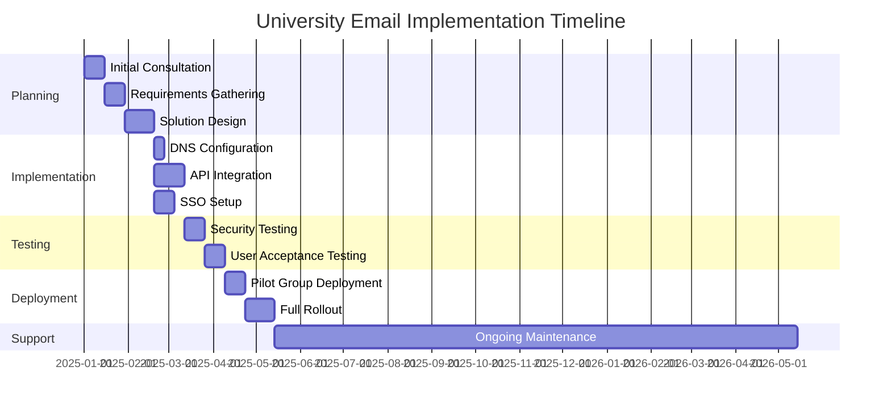
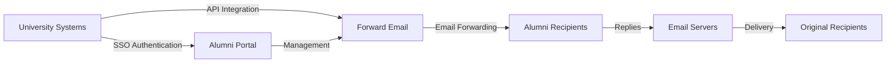

# Případová studie: Jak Forward Email podporuje e-mailová řešení pro absolventy předních univerzit {#case-study-how-forward-email-powers-alumni-email-solutions-for-top-universities}


## Obsah {#table-of-contents}

* [Předmluva](#foreword)
* [Dramatické úspory nákladů se stabilní cenou](#dramatic-cost-savings-with-stable-pricing)
  * [Reálné úspory univerzit](#real-world-university-savings)
* [Výzva e-mailů absolventů univerzit](#the-university-alumni-email-challenge)
  * [Hodnota identity e-mailu absolventa](#the-value-of-alumni-email-identity)
  * [Tradiční řešení nestačí](#traditional-solutions-fall-short)
  * [Řešení Forward Email](#the-forward-email-solution)
* [Technická implementace: Jak to funguje](#technical-implementation-how-it-works)
  * [Základní architektura](#core-architecture)
  * [Integrace s univerzitními systémy](#integration-with-university-systems)
  * [Správa řízená API](#api-driven-management)
  * [Konfigurace a ověření DNS](#dns-configuration-and-verification)
  * [Testování a zajištění kvality](#testing-and-quality-assurance)
* [Časový plán implementace](#implementation-timeline)
* [Proces implementace: Od migrace po údržbu](#implementation-process-from-migration-to-maintenance)
  * [Počáteční hodnocení a plánování](#initial-assessment-and-planning)
  * [Strategie migrace](#migration-strategy)
  * [Technické nastavení a konfigurace](#technical-setup-and-configuration)
  * [Návrh uživatelského prostředí](#user-experience-design)
  * [Školení a dokumentace](#training-and-documentation)
  * [Průběžná podpora a optimalizace](#ongoing-support-and-optimization)
* [Případová studie: University of Cambridge](#case-study-university-of-cambridge)
  * [Výzva](#challenge)
  * [Řešení](#solution)
  * [Výsledky](#results)
* [Výhody pro univerzity a absolventy](#benefits-for-universities-and-alumni)
  * [Pro univerzity](#for-universities)
  * [Pro absolventy](#for-alumni)
  * [Míra adopce mezi absolventy](#adoption-rates-among-alumni)
  * [Úspory nákladů ve srovnání s předchozími řešeními](#cost-savings-compared-to-previous-solutions)
* [Bezpečnostní a soukromí aspekty](#security-and-privacy-considerations)
  * [Opatření na ochranu dat](#data-protection-measures)
  * [Rámec souladu](#compliance-framework)
* [Budoucí vývoj](#future-developments)
* [Závěr](#conclusion)


## Předmluva {#foreword}

Vyvinuli jsme nejbezpečnější, nejprivátnější a nejflexibilnější službu přesměrování e-mailů na světě pro prestižní univerzity a jejich absolventy.

V konkurenčním prostředí vysokoškolského vzdělávání není udržování celoživotních vazeb s absolventy jen otázkou tradice – je to strategická nutnost. Jedním z nejkonkrétnějších způsobů, jak univerzity tyto vazby podporují, jsou e-mailové adresy absolventů, které poskytují absolventům digitální identitu odrážející jejich akademické dědictví.

Ve Forward Email jsme navázali partnerství s některými z nejprestižnějších vzdělávacích institucí na světě, abychom zrevolucionalizovali způsob, jakým spravují e-mailové služby pro absolventy. Naše podnikové řešení přesměrování e-mailů nyní pohání e-mailové systémy absolventů pro [University of Cambridge](https://en.wikipedia.org/wiki/University_of_Cambridge), [University of Maryland](https://en.wikipedia.org/wiki/University_of_Maryland,_College_Park), [Tufts University](https://en.wikipedia.org/wiki/Tufts_University) a [Swarthmore College](https://en.wikipedia.org/wiki/Swarthmore_College), které společně obsluhují tisíce absolventů po celém světě.

Tento blogový příspěvek zkoumá, jak se naše [open-source](https://en.wikipedia.org/wiki/Open-source_software), na soukromí zaměřená služba přesměrování e-mailů stala preferovaným řešením pro tyto instituce, technické implementace, které to umožňují, a transformační dopad, který to mělo jak na administrativní efektivitu, tak na spokojenost absolventů.


## Dramatické úspory nákladů se stabilní cenou {#dramatic-cost-savings-with-stable-pricing}
Finanční přínosy našeho řešení jsou značné, zejména ve srovnání s neustále rostoucími cenami tradičních poskytovatelů e-mailů:

| Řešení                        | Cena za absolventa (ročně)                                                                                 | Cena pro 100 000 absolventů | Nedávné zvýšení cen                                                                                                                                                                      |
| ----------------------------- | ---------------------------------------------------------------------------------------------------------- | --------------------------- | ---------------------------------------------------------------------------------------------------------------------------------------------------------------------------------------- |
| Google Workspace for Business | 72 $                                                                                                       | 7 200 000 $                 | • 2019: G Suite Basic z 5 na 6 $/měsíc (+20%)<br>• 2023: Flexibilní plány zvýšeny o 20 %<br>• 2025: Business Plus z 18 na 26,40 $/měsíc (+47 %) s funkcemi AI                        |
| Google Workspace for Education| Zdarma (Education Fundamentals)<br>3 $/student/rok (Education Standard)<br>5 $/student/rok (Education Plus) | Zdarma - 500 000 $          | • Množstevní slevy: 5 % pro 100–499 licencí<br>• Množstevní slevy: 10 % pro 500+ licencí<br>• Bezplatná úroveň omezena na základní služby                                            |
| Microsoft 365 Business        | 60 $                                                                                                       | 6 000 000 $                 | • 2023: Zavedeny pololetní aktualizace cen<br>• 2025 (leden): Personal z 6,99 na 9,99 $/měsíc (+43 %) s Copilot AI<br>• 2025 (duben): 5% zvýšení u ročních závazků placených měsíčně |
| Microsoft 365 Education       | Zdarma (A1)<br>38–55 $/fakulta/rok (A3)<br>65–96 $/fakulta/rok (A5)                                       | Zdarma - 96 000 $           | • Licence pro studenty často zahrnuty při nákupu pro fakultu<br>• Vlastní ceny přes množstevní licence<br>• Bezplatná úroveň omezena na webové verze                                  |
| Self-Hosted Exchange          | 45 $                                                                                                       | 4 500 000 $                 | Pokračující náklady na údržbu a bezpečnost nadále rostou                                                                                                                                |
| **Forward Email Enterprise**  | **Pevná cena 250 $/měsíc**                                                                                 | **3 000 $/rok**             | **Žádné zvýšení cen od spuštění**                                                                                                                                                        |

### Úspory reálných univerzit {#real-world-university-savings}

Zde je, kolik naše partnerské univerzity ročně ušetří volbou Forward Email oproti tradičním poskytovatelům:

| Univerzita               | Počet absolventů | Roční náklady s Google | Roční náklady s Forward Email | Roční úspory |
| ------------------------ | ---------------- | ---------------------- | ----------------------------- | ------------ |
| University of Cambridge  | 30 000           | 90 000 $               | 3 000 $                      | 87 000 $     |
| Swarthmore College       | 5 000            | 15 000 $               | 3 000 $                      | 12 000 $     |
| Tufts University         | 12 000           | 36 000 $               | 3 000 $                      | 33 000 $     |
| University of Maryland   | 25 000           | 75 000 $               | 3 000 $                      | 72 000 $     |

> \[!NOTE]
> Forward Email enterprise obvykle stojí pouze 250 $/měsíc, bez dalších nákladů za uživatele, s povolenými API limity a jediným dalším nákladem je úložiště, pokud potřebujete další GB/TB pro studenty (+3 $ za každých 10 GB navíc). Používáme NVMe SSD disky pro rychlou podporu IMAP/POP3/SMTP/CalDAV/CardDAV také.
> \[!IMPORTANT]
> Na rozdíl od Google a Microsoft, kteří opakovaně zvyšovali své ceny při integraci AI funkcí analyzujících vaše data, Forward Email udržuje stabilní ceny se silným zaměřením na soukromí. Nepoužíváme AI, nesledujeme vzory používání a neukládáme logy ani e-maily na disk (veškeré zpracování probíhá v paměti), což zajišťuje úplné soukromí vašich komunikací s absolventy.

To představuje významné snížení nákladů ve srovnání s tradičními řešeními hostování e-mailů – finance, které mohou univerzity přesměrovat na stipendia, výzkum nebo jiné klíčové aktivity. Podle analýzy z roku 2023 od Email Vendor Selection stále více vzdělávacích institucí hledá nákladově efektivní alternativy k tradičním poskytovatelům e-mailů, protože ceny nadále rostou s integrací AI funkcí ([Email Vendor Selection, 2023](https://www.emailvendorselection.com/email-service-provider-list/)).


## Výzva univerzitních e-mailů pro absolventy {#the-university-alumni-email-challenge}

Pro univerzity představuje poskytování celoživotních e-mailových adres absolventům jedinečnou sadu výzev, které tradiční e-mailová řešení nedokážou efektivně řešit. Jak je uvedeno v komplexní diskusi na ServerFault, univerzity s velkým počtem uživatelů potřebují specializovaná e-mailová řešení, která vyvažují výkon, bezpečnost a nákladovou efektivitu ([ServerFault, 2009](https://serverfault.com/questions/97364/what-is-the-best-mail-server-for-a-university-with-a-large-amount-of-users)).

### Hodnota e-mailové identity absolventů {#the-value-of-alumni-email-identity}

E-mailové adresy absolventů (například `firstname.lastname@cl.cam.ac.uk` nebo `username@terpalum.umd.edu`) plní několik důležitých funkcí:

* Udržování institucionálního spojení a identity značky
* Usnadnění průběžné komunikace s univerzitou
* Zvýšení profesní důvěryhodnosti absolventů
* Podpora sítí absolventů a budování komunity
* Poskytování stabilního, celoživotního kontaktního bodu

Výzkum od Tekade (2020) zdůrazňuje, že vzdělávací e-mailové adresy přinášejí absolventům řadu výhod, včetně přístupu k akademickým zdrojům, profesní důvěryhodnosti a exkluzivních slev na různé služby ([Medium, 2020](https://medium.com/coders-capsule/top-20-benefits-of-having-an-educational-email-address-91a09795e05)).

> \[!TIP]
> Navštivte náš nový adresář [AlumniEmail.com](https://alumniemail.com) pro komplexní zdroj informací o univerzitních e-mailových službách pro absolventy, včetně průvodců nastavením, osvědčených postupů a vyhledávacího adresáře domén e-mailů absolventů. Slouží jako centrální místo pro všechny informace o e-mailech absolventů.

### Tradiční řešení selhávají {#traditional-solutions-fall-short}

Konvenční e-mailové systémy mají několik omezení při použití pro potřeby e-mailů absolventů:

* **Nákladově neúnosné**: Modely licencování na uživatele jsou finančně neudržitelné pro velké množství absolventů
* **Administrativní zátěž**: Správa tisíců či milionů účtů vyžaduje značné IT zdroje
* **Bezpečnostní obavy**: Udržování bezpečnosti neaktivních účtů zvyšuje zranitelnost
* **Omezená flexibilita**: Rigidní systémy se nemohou přizpůsobit jedinečným potřebám přeposílání e-mailů absolventů
* **Problémy se soukromím**: Mnoho poskytovatelů skenuje obsah e-mailů pro reklamní účely

Diskuse na Quora o údržbě univerzitních e-mailů odhaluje, že bezpečnostní obavy jsou hlavním důvodem, proč univerzity mohou omezit nebo zrušit e-mailové adresy absolventů, protože nevyužívané účty mohou být zranitelné vůči hackingu a krádeži identity ([Quora, 2011](https://www.quora.com/Is-there-any-cost-for-a-college-or-university-to-maintain-edu-e-mail-addresses)).

### Řešení Forward Email {#the-forward-email-solution}

Náš přístup řeší tyto výzvy prostřednictvím zásadně odlišného modelu:

* Přeposílání e-mailů místo hostování
* Paušální ceny místo nákladů na uživatele
* Open-source architektura pro transparentnost a bezpečnost
* Design zaměřený na soukromí bez skenování obsahu
* Specializované funkce pro správu identity univerzity


## Technická implementace: Jak to funguje {#technical-implementation-how-it-works}
Naše řešení využívá sofistikovanou, přesto elegantně jednoduchou technickou architekturu k poskytování spolehlivého a bezpečného přeposílání e-mailů ve velkém měřítku.

### Základní architektura {#core-architecture}

Systém Forward Email se skládá z několika klíčových komponent:

* Distribuované MX servery pro vysokou dostupnost
* Přeposílání v reálném čase bez ukládání zpráv
* Komplexní autentizace e-mailů
* Podpora vlastních domén a subdomén
* Správa účtů řízená přes API

Podle IT odborníků na ServerFault je pro univerzity, které chtějí implementovat vlastní e-mailová řešení, doporučován Postfix jako nejlepší Mail Transfer Agent (MTA), zatímco Courier nebo Dovecot jsou preferovány pro přístup IMAP/POP3 ([ServerFault, 2009](https://serverfault.com/questions/97364/what-is-the-best-mail-server-for-a-university-with-a-large-amount-of-users)). Naše řešení však eliminuje potřebu, aby univerzity samy spravovaly tyto složité systémy.

### Integrace s univerzitními systémy {#integration-with-university-systems}

Vyvinuli jsme bezproblémové integrační cesty s existující univerzitní infrastrukturou:

* Automatizované zřizování přes integraci [RESTful API](https://forwardemail.net/email-api)
* Možnosti vlastního brandingu pro univerzitní portály
* Flexibilní správa aliasů pro katedry a organizace
* Hromadné operace pro efektivní administraci

### Správa řízená přes API {#api-driven-management}

Naše [RESTful API](https://forwardemail.net/email-api) umožňuje univerzitám automatizovat správu e-mailů:

```javascript
// Příklad: Vytvoření nové e-mailové adresy pro absolventy
const response = await fetch('https://forwardemail.net/api/v1/domains/example.edu/aliases', {
  method: 'POST',
  headers: {
    'Content-Type': 'application/json',
    'Authorization': `Basic ${Buffer.from(YOUR_API_TOKEN + ":").toString('base64')}`
  },
  body: JSON.stringify({
    name: 'alumni.john.smith',
    recipients: ['johnsmith@gmail.com'],
    has_recipient_verification: true
  })
});
```

### Konfigurace DNS a ověření {#dns-configuration-and-verification}

Správná konfigurace DNS je klíčová pro doručování e-mailů. Náš tým pomáhá s:

* Konfigurací [DNS](https://en.wikipedia.org/wiki/Domain_Name_System) včetně MX záznamů
* Komplexní implementací zabezpečení e-mailů pomocí našeho open-source balíčku [mailauth](https://www.npmjs.com/package/mailauth), švýcarského nože pro autentizaci e-mailů, který zajišťuje:
  * [SPF](https://en.wikipedia.org/wiki/Sender_Policy_Framework) (Sender Policy Framework) pro prevenci spoofingu e-mailů
  * [DKIM](https://en.wikipedia.org/wiki/DomainKeys_Identified_Mail) (DomainKeys Identified Mail) pro autentizaci e-mailů
  * [DMARC](https://en.wikipedia.org/wiki/Email_authentication) (Domain-based Message Authentication, Reporting & Conformance) pro vynucování politik
  * [MTA-STS](https://en.wikipedia.org/wiki/Opportunistic_TLS) (SMTP MTA Strict Transport Security) pro vynucení šifrování TLS
  * [ARC](https://en.wikipedia.org/wiki/DomainKeys_Identified_Mail#Authenticated_Received_Chain) (Authenticated Received Chain) pro zachování autentizace při přeposílání zpráv
  * [SRS](https://en.wikipedia.org/wiki/Sender_Rewriting_Scheme) (Sender Rewriting Scheme) pro zachování validace SPF při přeposílání
  * [BIMI](https://en.wikipedia.org/wiki/Email_authentication) (Brand Indicators for Message Identification) pro zobrazení loga v podporovaných e-mailových klientech
* Ověření vlastnictví domény pomocí DNS TXT záznamů

Balíček `mailauth` (<http://npmjs.com/package/mailauth>) je plně open-source řešení, které zpracovává všechny aspekty autentizace e-mailů v jedné integrované knihovně. Na rozdíl od proprietárních řešení tento přístup zajišťuje transparentnost, pravidelné bezpečnostní aktualizace a úplnou kontrolu nad procesem autentizace e-mailů.

### Testování a zajištění kvality {#testing-and-quality-assurance}

Před plným nasazením provádíme důkladné testování:

* Testování doručování e-mailů end-to-end
* Zátěžové testování pro scénáře s vysokým objemem
* Penetrační testování bezpečnosti
* Validace integrace API
* Uživatelské akceptační testování s představiteli absolventů
## Časový harmonogram implementace {#implementation-timeline}


```mermaid
gantt
    title University Email Implementation Timeline
    dateFormat  YYYY-MM-DD
    section Planning
    Initial Consultation           :a1, 2025-01-01, 14d
    Requirements Gathering         :a2, after a1, 14d
    Solution Design                :a3, after a2, 21d
    section Implementation
    DNS Configuration              :b1, after a3, 7d
    API Integration                :b2, after a3, 21d
    SSO Setup                      :b3, after a3, 14d
    section Testing
    Security Testing               :c1, after b1 b2 b3, 14d
    User Acceptance Testing        :c2, after c1, 14d
    section Deployment
    Pilot Group Deployment         :d1, after c2, 14d
    Full Rollout                   :d2, after d1, 21d
    section Support
    Ongoing Maintenance            :e1, after d2, 365d
```


## Proces implementace: Od migrace po údržbu {#implementation-process-from-migration-to-maintenance}

Náš strukturovaný proces implementace zajišťuje hladký přechod pro univerzity, které přijímají naše řešení.

### Počáteční hodnocení a plánování {#initial-assessment-and-planning}

Začínáme komplexním hodnocením současného e-mailového systému univerzity, databáze absolventů a technických požadavků. Tato fáze zahrnuje:

* Rozhovory se zainteresovanými stranami z IT, vztahů s absolventy a administrativy
* Technický audit stávající e-mailové infrastruktury
* Mapování dat pro záznamy absolventů
* Přezkum bezpečnosti a souladu s předpisy
* Vývoj časového plánu projektu a milníků

### Strategie migrace {#migration-strategy}

Na základě hodnocení vyvíjíme přizpůsobenou migrační strategii, která minimalizuje narušení a zároveň zajišťuje úplnou integritu dat:

* Fázovaný přístup k migraci podle kohort absolventů
* Paralelní provoz systémů během přechodu
* Komplexní protokoly ověřování dat
* Záložní postupy pro případ problémů s migrací
* Jasný komunikační plán pro všechny zainteresované strany

### Technické nastavení a konfigurace {#technical-setup-and-configuration}

Náš technický tým se stará o všechny aspekty nastavení systému:

* Konfigurace a ověření DNS
* Integrace API s univerzitními systémy
* Vývoj vlastního portálu s univerzitním brandingem
* Nastavení autentizace e-mailů (SPF, DKIM, DMARC)

### Návrh uživatelského prostředí {#user-experience-design}

Úzce spolupracujeme s univerzitami na vytvoření intuitivních rozhraní pro administrátory i absolventy:

* Portály pro e-mail absolventů s vlastním brandingem
* Zjednodušená správa přeposílání e-mailů
* Mobilně responzivní designy
* Soulad s přístupností
* Podpora více jazyků tam, kde je potřeba

### Školení a dokumentace {#training-and-documentation}

Komplexní školení zajišťuje, že všichni zainteresovaní mohou systém efektivně používat:

* Školení administrátorů
* Technická dokumentace pro IT personál
* Uživatelské příručky pro absolventy
* Video návody pro běžné úkony
* Vývoj znalostní báze

### Průběžná podpora a optimalizace {#ongoing-support-and-optimization}

Naše partnerství pokračuje i po implementaci:

* 24/7 technická podpora
* Pravidelné aktualizace systému a bezpečnostní záplaty
* Monitorování výkonu a optimalizace
* Konzultace ohledně nejlepších praktik e-mailu
* Analýza dat a reportování


## Případová studie: University of Cambridge {#case-study-university-of-cambridge}

University of Cambridge hledala řešení, jak poskytnout absolventům e-mailové adresy @cam.ac.uk a zároveň snížit náklady a zátěž IT.

### Výzva {#challenge}

Cambridge čelila několika výzvám se svým předchozím systémem e-mailů pro absolventy:

* Vysoké provozní náklady na udržování samostatné e-mailové infrastruktury
* Administrativní zátěž správy tisíců účtů
* Bezpečnostní obavy ohledně neaktivních účtů
* Omezená integrace s databázovými systémy absolventů
* Rostoucí požadavky na úložiště

### Řešení {#solution}

Forward Email implementoval komplexní řešení:

* Přeposílání e-mailů pro všechny absolventy s adresami @cam.ac.uk
* Portál s vlastním brandingem pro samoobsluhu absolventů
* Integrace API s databází absolventů Cambridge
* Komplexní implementace bezpečnosti e-mailů

### Výsledky {#results}

Implementace přinesla významné přínosy:
* Výrazné snížení nákladů ve srovnání s předchozím řešením
* 99,9% spolehlivost doručení e-mailů
* Zjednodušená správa díky automatizaci
* Zvýšená bezpečnost s moderní autentizací e-mailů
* Pozitivní zpětná vazba absolventů ohledně použitelnosti systému


## Výhody pro univerzity a absolventy {#benefits-for-universities-and-alumni}

Naše řešení přináší hmatatelné výhody jak pro instituce, tak pro jejich absolventy.

### Pro univerzity {#for-universities}

* **Nákladová efektivita**: Fixní cena bez ohledu na počet absolventů
* **Jednoduchost správy**: Automatizovaná správa přes API
* **Zvýšená bezpečnost**: Komplexní autentizace e-mailů
* **Konzistence značky**: Institucionální e-mailové adresy na celý život
* **Zapojení absolventů**: Posílení vazeb díky trvalé službě

Podle BulkSignature (2023) nabízejí e-mailové platformy pro vzdělávací instituce významné výhody včetně nákladové efektivity díky bezplatným nebo nízkonákladovým plánům, časové úspory díky možnostem hromadné komunikace a sledovacím funkcím pro monitorování doručení a zapojení e-mailů ([BulkSignature, 2023](https://bulksignature.com/blog/5-best-email-platforms-for-educational-institutions/)).

### Pro absolventy {#for-alumni}

* **Profesionální identita**: Prestižní univerzitní e-mailová adresa
* **Kontinuita e-mailu**: Přeposílání na jakýkoli osobní e-mail
* **Ochrana soukromí**: Žádné skenování obsahu ani těžba dat
* **Jednoduchá správa**: Snadná aktualizace příjemců
* **Zvýšená bezpečnost**: Moderní autentizace e-mailů

Výzkum z International Journal of Education & Literacy Studies zdůrazňuje důležitost správné e-mailové komunikace v akademickém prostředí a uvádí, že e-mailová gramotnost je klíčovou dovedností jak pro studenty, tak absolventy v profesionálním kontextu ([IJELS, 2021](https://files.eric.ed.gov/fulltext/EJ1319324.pdf)).

### Míra adopce mezi absolventy {#adoption-rates-among-alumni}

Univerzity hlásí vysokou míru adopce a spokojenosti mezi komunitami svých absolventů.

### Úspory nákladů ve srovnání s předchozími řešeními {#cost-savings-compared-to-previous-solutions}

Finanční dopad byl značný, univerzity hlásí výrazné úspory nákladů ve srovnání se svými předchozími e-mailovými řešeními.


## Bezpečnostní a soukromí aspekty {#security-and-privacy-considerations}

Pro vzdělávací instituce není ochrana dat absolventů jen dobrou praxí – často jde o zákonnou povinnost podle předpisů jako GDPR v Evropě.

### Opatření na ochranu dat {#data-protection-measures}

Naše řešení zahrnuje více vrstev zabezpečení:

* End-to-end šifrování veškeré e-mailové komunikace
* Žádné ukládání obsahu e-mailů na našich serverech
* Pravidelné bezpečnostní audity a penetrační testy
* Soulad s mezinárodními standardy ochrany dat
* Transparentní, open-source kód pro ověření bezpečnosti

> \[!WARNING]
> Mnoho poskytovatelů e-mailů skenuje obsah e-mailů pro reklamní účely nebo pro trénink AI modelů. Tato praxe vyvolává vážné obavy o soukromí, zejména u profesionální a akademické komunikace. Forward Email nikdy neskenuje obsah e-mailů a všechny e-maily zpracovává pouze v paměti, aby zajistil úplné soukromí.

### Rámec souladu {#compliance-framework}

Dodržujeme přísné požadavky relevantních předpisů:

* Soulad s GDPR pro evropské instituce
* Certifikace SOC 2 Type II
* Roční bezpečnostní hodnocení
* Dohoda o zpracování dat (DPA) dostupná na [forwardemail.net/dpa](https://forwardemail.net/dpa)
* Pravidelné aktualizace souladu s vývojem předpisů


## Budoucí vývoj {#future-developments}

Pokračujeme v rozšiřování našeho řešení e-mailů pro absolventy o nové funkce a možnosti:

* Vylepšená analytika pro správce univerzit
* Pokročilá ochrana proti phishingu
* Rozšířené API pro hlubší integraci
* Další možnosti autentizace


## Závěr {#conclusion}

Forward Email revolucionalizoval způsob, jakým univerzity poskytují a spravují e-mailové služby pro absolventy. Nahrazením nákladného a složitého hostingu elegantním a bezpečným přeposíláním e-mailů umožňujeme institucím nabízet celoživotní e-mailové adresy všem absolventům a zároveň dramaticky snižovat náklady a administrativní zátěž.
Naše partnerství s prestižními institucemi jako Cambridge, Maryland, Tufts a Swarthmore ukazují účinnost našeho přístupu v různorodých vzdělávacích prostředích. Jak univerzity čelí rostoucím tlakům na udržení kontaktů s absolventy při současné kontrole nákladů, naše řešení nabízí přesvědčivou alternativu k tradičním e-mailovým systémům.


```mermaid
flowchart LR
    A[University Systems] -->|API Integration| B[Forward Email]
    B -->|Email Forwarding| C[Alumni Recipients]
    C -->|Replies| D[Email Servers]
    D -->|Delivery| E[Original Recipients]
    F[Alumni Portal] -->|Management| B
    A -->|SSO Authentication| F
```

Pro univerzity, které mají zájem zjistit, jak může Forward Email transformovat jejich e-mailové služby pro absolventy, kontaktujte náš tým na <support@forwardemail.net> nebo navštivte [forwardemail.net](https://forwardemail.net), kde se dozvíte více o našich podnikových řešeních.
