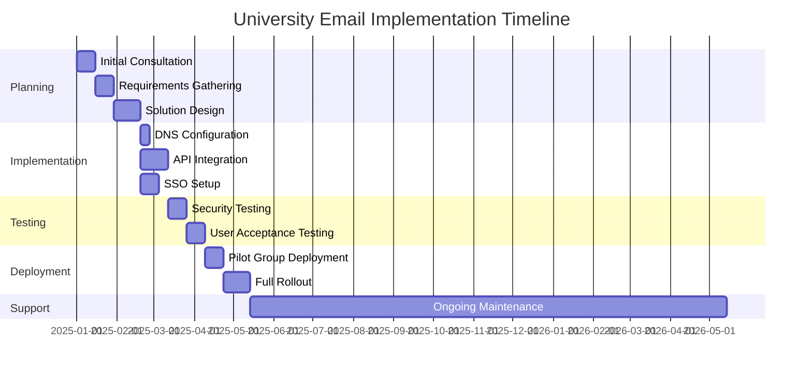
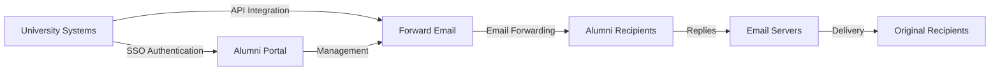

# Casestudie: Hvordan videresendt e-mail styrker alumni-e-mailløsninger til topuniversiteter {#case-study-how-forward-email-powers-alumni-email-solutions-for-top-universities}


## Indholdsfortegnelse {#table-of-contents}

* [Forord](#foreword)
* [Dramatiske omkostningsbesparelser med stabile priser](#dramatic-cost-savings-with-stable-pricing)
  * [Besparelser på universiteter i den virkelige verden](#real-world-university-savings)
* [Universitetets alumner e-mail-udfordring](#the-university-alumni-email-challenge)
  * [Værdien af alumni-e-mailidentitet](#the-value-of-alumni-email-identity)
  * [Traditionelle løsninger kommer til kort](#traditional-solutions-fall-short)
  * [Løsningen til videresendelse af e-mails](#the-forward-email-solution)
* [Teknisk implementering: Sådan fungerer det](#technical-implementation-how-it-works)
  * [Kernearkitektur](#core-architecture)
  * [Integration med universitetssystemer](#integration-with-university-systems)
  * [API-drevet administration](#api-driven-management)
  * [DNS-konfiguration og -verifikation](#dns-configuration-and-verification)
  * [Test og kvalitetssikring](#testing-and-quality-assurance)
* [Implementeringstidslinje](#implementation-timeline)
* [Implementeringsproces: Fra migrering til vedligeholdelse](#implementation-process-from-migration-to-maintenance)
  * [Indledende vurdering og planlægning](#initial-assessment-and-planning)
  * [Migrationsstrategi](#migration-strategy)
  * [Teknisk opsætning og konfiguration](#technical-setup-and-configuration)
  * [Brugeroplevelsesdesign](#user-experience-design)
  * [Træning og dokumentation](#training-and-documentation)
  * [Løbende support og optimering](#ongoing-support-and-optimization)
* [Casestudie: Cambridge Universitet](#case-study-university-of-cambridge)
  * [Udfordring](#challenge)
  * [Løsning](#solution)
  * [Resultater](#results)
* [Fordele for universiteter og alumner](#benefits-for-universities-and-alumni)
  * [For universiteter](#for-universities)
  * [For alumner](#for-alumni)
  * [Adoptionsrater blandt alumner](#adoption-rates-among-alumni)
  * [Omkostningsbesparelser sammenlignet med tidligere løsninger](#cost-savings-compared-to-previous-solutions)
* [Sikkerheds- og privatlivsovervejelser](#security-and-privacy-considerations)
  * [Databeskyttelsesforanstaltninger](#data-protection-measures)
  * [Overholdelsesramme](#compliance-framework)
* [Fremtidige udviklinger](#future-developments)
* [Konklusion](#conclusion)

## Forord {#foreword}

Vi har bygget verdens mest sikre, private og fleksible e-mail-videresendelsestjeneste til prestigefyldte universiteter og deres alumner.

I det konkurrenceprægede landskab inden for videregående uddannelser er det ikke blot et spørgsmål om tradition at opretholde livslange forbindelser med alumner – det er et strategisk imperativ. En af de mest håndgribelige måder, hvorpå universiteter fremmer disse forbindelser, er gennem alumner-e-mailadresser, der giver kandidater en digital identitet, der afspejler deres akademiske arv.

Hos Forward Email har vi indgået et partnerskab med nogle af verdens mest prestigefyldte uddannelsesinstitutioner for at revolutionere, hvordan de administrerer e-mailtjenester til alumner. Vores e-mail-videresendelsesløsning i virksomhedsklassen driver nu alumni-e-mailsystemerne for [Cambridge Universitet](https://en.wikipedia.org/wiki/University_of_Cambridge), [University of Maryland](https://en.wikipedia.org/wiki/University_of_Maryland,\_College_Park), [Tufts Universitet](https://en.wikipedia.org/wiki/Tufts_University) og [Swarthmore College](https://en.wikipedia.org/wiki/Swarthmore_College), der tilsammen betjener tusindvis af alumner verden over.

Dette blogindlæg undersøger, hvordan vores [open source](https://en.wikipedia.org/wiki/Open-source_software), privatlivsfokuserede e-mail-videresendelsestjeneste er blevet den foretrukne løsning for disse institutioner, de tekniske implementeringer, der gør det muligt, og den transformative effekt, det har haft på både administrativ effektivitet og alumnitilfredshed.

## Dramatiske omkostningsbesparelser med stabile priser {#dramatic-cost-savings-with-stable-pricing}

De økonomiske fordele ved vores løsning er betydelige, især sammenlignet med de konstant stigende priser hos traditionelle e-mailudbydere:

| Løsning | Omkostninger pr. alumne (årlige) | Pris for 100.000 alumner | Seneste prisstigninger |
| ------------------------------ | --------------------------------------------------------------------------------------------------------- | ----------------------- | ---------------------------------------------------------------------------------------------------------------------------------------------------------------------------------------- |
| Google Workspace til virksomheder | $72 | $7,200,000 | • 2019: G Suite Basic fra 5 USD til 6 USD/måned (+20%)<br>• 2023: Fleksible abonnementer steget med 20%<br>• 2025: Business Plus fra 18 USD til 26,40 USD/måned (+47%) med AI-funktioner |
| Google Workspace til uddannelse | Gratis (Education Fundamentals)<br>3 USD/studerende/år (Education Standard)<br>5 USD/studerende/år (Education Plus) | Gratis - 500.000 kr. | • Mængderabatter: 5 % for 100-499 licenser<br>• Mængderabatter: 10 % for 500+ licenser<br>• Gratisniveau begrænset til kernetjenester |
| Microsoft 365 Business | $60 | $6,000,000 | • 2023: Introducerede halvårlige prisopdateringer<br>• 2025 (januar): Personlig fra 6,99 USD til 9,99 USD/måned (+43%) med Copilot AI<br>• 2025 (april): 5% stigning på årlige forpligtelser, der betales månedligt |
| Microsoft 365 Uddannelse | Gratis (A1)<br>$38-55/fakultet/år (A3)<br>$65-96/fakultet/år (A5) | Gratis - 96.000 kr. | • Studielicenser er ofte inkluderet i køb fra fakultetet<br>• Tilpassede priser via volumenlicenser<br>• Gratisniveau begrænset til webversioner |
| Selvhostet Exchange | $45 | $4,500,000 | Løbende vedligeholdelses- og sikkerhedsomkostninger fortsætter med at stige |
| **Videresend e-mail til virksomhed** | **Fastpris 250 kr./måned** | **3.000 kr./år** | **Ingen prisstigninger siden lanceringen** |

### Besparelser på universiteter i den virkelige verden {#real-world-university-savings}

Her er hvor meget vores partneruniversiteter sparer årligt ved at vælge Videresend e-mail frem for traditionelle udbydere:

| Universitet | Antal alumner | Årlig pris med Google | Årlig pris med videresendelse af e-mail | Årlige besparelser |
| ----------------------- | ------------ | ----------------------- | ------------------------------ | -------------- |
| Cambridge Universitet | 30,000 | $90,000 | $3,000 | $87,000 |
| Swarthmore College | 5,000 | $15,000 | $3,000 | $12,000 |
| Tufts Universitet | 12,000 | $36,000 | $3,000 | $33,000 |
| University of Maryland | 25,000 | $75,000 | $3,000 | $72,000 |

> \[!NOTE]
> Videresend e-mail til virksomheder koster typisk kun $250/måned, uden ekstra omkostninger pr. bruger, begrænsninger i API-priser på hvidlistede udbydere, og den eneste ekstra omkostning er lagerplads, hvis du har brug for yderligere GB/TB til studerende (+$3 pr. 10 GB ekstra lagerplads). Vi bruger også NVMe SSD-drev til hurtig understøttelse af IMAP/POP3/SMTP/CalDAV/CardDAV.

> \[!IMPORTANT]
> I modsætning til Google og Microsoft, som gentagne gange har hævet deres priser, mens de integrerer AI-funktioner, der analyserer dine data, opretholder Forward Email stabile priser med et strengt fokus på privatliv. Vi bruger ikke AI, sporer ikke brugsmønstre og gemmer ikke logfiler eller e-mails på disken (al behandling foregår i hukommelsen), hvilket sikrer fuldstændig privatliv for din alumnikommunikation.

Dette repræsenterer en betydelig omkostningsreduktion sammenlignet med traditionelle e-mailhostingløsninger – midler som universiteterne kan omdirigere til stipendier, forskning eller andre forretningskritiske aktiviteter. Ifølge en analyse fra 2023 foretaget af Email Vendor Selection søger uddannelsesinstitutioner i stigende grad omkostningseffektive alternativer til traditionelle e-mailudbydere, da priserne fortsætter med at stige med integrationen af AI-funktioner ([Udvælgelse af e-mailleverandører, 2023](https://www.emailvendorselection.com/email-service-provider-list/)).

## Universitetets alumne-e-mail-udfordring {#the-university-alumni-email-challenge}

For universiteter præsenterer det en række unikke udfordringer at give alumner livstids-e-mailadresser, som traditionelle e-mailløsninger har svært ved at håndtere effektivt. Som nævnt i en omfattende diskussion på ServerFault kræver universiteter med store brugerbaser specialiserede e-mailløsninger, der balancerer ydeevne, sikkerhed og omkostningseffektivitet ([Serverfejl, 2009](https://serverfault.com/questions/97364/what-is-the-best-mail-server-for-a-university-with-a-large-amount-of-users)).

### Værdien af alumni-e-mail-identitet {#the-value-of-alumni-email-identity}

Alumni-e-mailadresser (som `firstname.lastname@cl.cam.ac.uk` eller `username@terpalum.umd.edu`) tjener flere vigtige funktioner:

* Opretholdelse af institutionel forbindelse og brandidentitet
* Fremme af løbende kommunikation med universitetet
* Styrkelse af professionel troværdighed for kandidater
* Støtte til alumni-netværk og opbygning af fællesskab
* Tilvejebringelse af et stabilt og livslangt kontaktpunkt

Forskning foretaget af Tekade (2020) fremhæver, at uddannelsesmæssige e-mailadresser giver alumner adskillige fordele, herunder adgang til akademiske ressourcer, professionel troværdighed og eksklusive rabatter på forskellige tjenester ([Mellem, 2020](https://medium.com/coders-capsule/top-20-benefits-of-having-an-educational-email-address-91a09795e05)).

> \[!TIP]
> Besøg vores nye [AlumniEmail.com](https://alumniemail.com)-katalog for at få en omfattende ressource om universitetets alumni-e-mailtjenester, herunder opsætningsvejledninger, bedste praksis og en søgbar oversigt over alumni-e-maildomæner. Det fungerer som et centralt knudepunkt for alle alumni-e-mailoplysninger.

### Traditionelle løsninger kommer til kort {#traditional-solutions-fall-short}

Konventionelle e-mailsystemer har adskillige begrænsninger, når de anvendes til alumners e-mailbehov:

* **Omkostningsmæssigt uoverkommelige**: Licensmodeller pr. bruger bliver økonomisk uholdbare for store alumnibaser
* **Administrativ byrde**: Administration af tusindvis eller millioner af konti kræver betydelige IT-ressourcer
* **Sikkerhedsproblemer**: Opretholdelse af sikkerhed for inaktive konti øger sårbarheden
* **Begrænset fleksibilitet**: Stive systemer kan ikke tilpasse sig de unikke behov for videresendelse af e-mails til alumner
* **Privatlivsproblemer**: Mange udbydere scanner e-mailindhold til reklameformål

En Quora-diskussion om vedligeholdelse af universiteters e-mailadresser afslører, at sikkerhedsproblemer er en væsentlig årsag til, at universiteter muligvis begrænser eller annullerer alumni-e-mailadresser, da ubrugte konti kan være sårbare over for hacking og identitetstyveri ([Quora, 2011](https://www.quora.com/Is-there-any-cost-for-a-college-or-university-to-maintain-edu-e-mail-addresses)).

### Løsningen til videresendelse af e-mails {#the-forward-email-solution}

Vores tilgang adresserer disse udfordringer gennem en fundamentalt anderledes model:

* Videresendelse af e-mails i stedet for hosting
* Fast pris i stedet for omkostninger pr. bruger
* Open source-arkitektur for gennemsigtighed og sikkerhed
* Design med fokus på privatliv uden indholdsscanning
* Specialiserede funktioner til administration af universitetsidentitet

## Teknisk implementering: Sådan fungerer det {#technical-implementation-how-it-works}

Vores løsning udnytter en sofistikeret, men elegant og enkel teknisk arkitektur til at levere pålidelig og sikker videresendelse af e-mails i stor skala.

### Kernearkitektur {#core-architecture}

Systemet til videresendelse af e-mails består af flere nøglekomponenter:

* Distribuerede MX-servere for høj tilgængelighed
* Videresendelse i realtid uden meddelelseslagring
* Omfattende e-mail-godkendelse
* Understøttelse af brugerdefinerede domæner og underdomæner
* API-drevet kontoadministration

Ifølge IT-professionelle på ServerFault anbefales Postfix som den bedste Mail Transfer Agent (MTA) for universiteter, der ønsker at implementere deres egne e-mailløsninger, mens Courier eller Dovecot foretrækkes til IMAP/POP3-adgang ([Serverfejl, 2009](https://serverfault.com/questions/97364/what-is-the-best-mail-server-for-a-university-with-a-large-amount-of-users)). Vores løsning eliminerer dog behovet for, at universiteterne selv skal administrere disse komplekse systemer.

### Integration med universitetssystemer {#integration-with-university-systems}

Vi har udviklet problemfri integration med eksisterende universitetsinfrastruktur:

* Automatiseret provisionering via [RESTful API](https://forwardemail.net/email-api)-integration
* Brugerdefinerede brandingmuligheder til universitetsportaler
* Fleksibel aliasadministration for afdelinger og organisationer
* Batchhandlinger for effektiv administration

### API-drevet administration {#api-driven-management}

Vores [RESTful API](https://forwardemail.net/email-api) gør det muligt for universiteter at automatisere e-mailhåndtering:

```javascript
// Example: Creating a new alumni email address
const response = await fetch('https://forwardemail.net/api/v1/domains/example.edu/aliases', {
  method: 'POST',
  headers: {
    'Content-Type': 'application/json',
    'Authorization': `Basic ${Buffer.from(YOUR_API_TOKEN + ":").toString('base64')}`
  },
  body: JSON.stringify({
    name: 'alumni.john.smith',
    recipients: ['johnsmith@gmail.com'],
    has_recipient_verification: true
  })
});
```

### DNS-konfiguration og -verifikation {#dns-configuration-and-verification}

Korrekt DNS-konfiguration er afgørende for levering af e-mails. Vores team hjælper med:

* [DNS](https://en.wikipedia.org/wiki/Domain_Name_System)-konfiguration inklusive MX-poster
* Omfattende implementering af e-mailsikkerhed ved hjælp af vores open source [mailauth](https://www.npmjs.com/package/mailauth)-pakke, en schweizerkniv til e-mail-godkendelse, der håndterer:
* [SPF](https://en.wikipedia.org/wiki/Sender_Policy_Framework) (Sender Policy Framework) for at forhindre e-mail-spoofing
* [DKIM](https://en.wikipedia.org/wiki/DomainKeys_Identified_Mail) (DomainKeys Identified Mail) til e-mail-godkendelse
* [DMARC](https://en.wikipedia.org/wiki/Email_authentication) (Domænebaseret meddelelsesgodkendelse, rapportering og overholdelse) til håndhævelse af politikker
* [MTA-STS](https://en.wikipedia.org/wiki/Opportunistic_TLS) (SMTP MTA Strict Transport Security) til at håndhæve TLS-kryptering
* [ARC](https://en.wikipedia.org/wiki/DomainKeys_Identified_Mail#Authenticated_Received_Chain) (Authenticated Received Chain) for at opretholde godkendelse, når meddelelser videresendes
* [SRS](https://en.wikipedia.org/wiki/Sender_Rewriting_Scheme) (Sender Rewriting Scheme) for at bevare SPF-validering gennem videresendelse
* [BIMI](https://en.wikipedia.org/wiki/Email_authentication) (Brandindikatorer for meddelelsesidentifikation) til logovisning i understøttende e-mailklienter
* DNS TXT-postverifikation for domæneejerskab

`mailauth`-pakken (<http://npmjs.com/package/mailauth>) er en fuldt open source-løsning, der håndterer alle aspekter af e-mail-godkendelse i ét integreret bibliotek. I modsætning til proprietære løsninger sikrer denne tilgang gennemsigtighed, regelmæssige sikkerhedsopdateringer og fuld kontrol over e-mail-godkendelsesprocessen.

### Test og kvalitetssikring {#testing-and-quality-assurance}

Før fuld implementering udfører vi grundige tests:

* End-to-end e-mailleveringstest
* Belastningstest for scenarier med store mængder
* Sikkerhedspenetrationstest
* Validering af API-integration
* Brugeraccepttest med alumnirepræsentanter

## Implementeringstidslinje {#implementation-timeline}



## Implementeringsproces: Fra migrering til vedligeholdelse {#implementation-process-from-migration-to-maintenance}

Vores strukturerede implementeringsproces sikrer en problemfri overgang for universiteter, der tager vores løsning i brug.

### Indledende vurdering og planlægning {#initial-assessment-and-planning}

Vi starter med en omfattende vurdering af universitetets nuværende e-mailsystem, alumnidatabase og tekniske krav. Denne fase omfatter:

* Interessentinterviews med IT, alumnerelationer og administration
* Teknisk revision af eksisterende e-mailinfrastruktur
* Datakortlægning for alumneregner
* Gennemgang af sikkerhed og compliance
* Projektets tidslinje og udvikling af milepæle

### Migreringsstrategi {#migration-strategy}

Baseret på vurderingen udvikler vi en skræddersyet migreringsstrategi, der minimerer afbrydelser og samtidig sikrer fuldstændig dataintegritet:

* Fasevis migreringstilgang for alumni-kohorter
* Parallel systemdrift under overgangen
* Omfattende datavalideringsprotokoller
* Fallback-procedurer for eventuelle migreringsproblemer
* Tydelig kommunikationsplan for alle interessenter

### Teknisk opsætning og konfiguration {#technical-setup-and-configuration}

Vores tekniske team håndterer alle aspekter af systemopsætning:

* DNS-konfiguration og -verifikation
* API-integration med universitetssystemer
* Udvikling af brugerdefineret portal med universitetsbranding
* Opsætning af e-mail-godkendelse (SPF, DKIM, DMARC)

### Brugeroplevelsesdesign {#user-experience-design}

Vi arbejder tæt sammen med universiteter for at skabe intuitive brugerflader for både administratorer og alumner:

* E-mailportaler til alumner med brugerdefinerede brands
* Forenklet administration af videresendelse af e-mails
* Mobilvenligt design
* Overholdelse af tilgængelighedsregler
* Understøttelse af flere sprog, hvor det er nødvendigt

### Træning og dokumentation {#training-and-documentation}

Omfattende træning sikrer, at alle interessenter effektivt kan bruge systemet:

* Administratortræningssessioner
* Teknisk dokumentation til IT-personale
* Brugervejledninger til alumner
* Videovejledninger til almindelige opgaver
* Udvikling af vidensbase

### Løbende support og optimering {#ongoing-support-and-optimization}

Vores partnerskab fortsætter langt ud over implementeringen:

* Teknisk support døgnet rundt
* Regelmæssige systemopdateringer og sikkerhedsrettelser
* Ydelsesovervågning og -optimering
* Konsultation om bedste praksis for e-mail
* Dataanalyse og -rapportering

## Casestudie: Cambridge Universitet {#case-study-university-of-cambridge}

University of Cambridge søgte en løsning til at give @cam.ac.uk e-mailadresser til alumner, samtidig med at IT-omkostninger reduceredes.

### Udfordring {#challenge}

Cambridge stod over for adskillige udfordringer med deres tidligere e-mailsystem for alumner:

* Høje driftsomkostninger ved vedligeholdelse af separat e-mailinfrastruktur
* Administrativ byrde ved at administrere tusindvis af konti
* Sikkerhedsproblemer med inaktive konti
* Begrænset integration med alumnidatabasesystemer
* Stigende lagerkrav

### Løsning {#solution}

Videresend e-mail implementerede en omfattende løsning:

* Videresendelse af e-mails til alle @cam.ac.uk alumni-adresser
* Brugerdefineret portal til selvbetjening af alumner
* API-integration med Cambridges alumni-database
* Omfattende implementering af e-mailsikkerhed

### Resultater {#results}

Implementeringen gav betydelige fordele:

* Væsentlig omkostningsreduktion sammenlignet med tidligere løsning
* 99,9% pålidelighed ved levering af e-mails
* Forenklet administration gennem automatisering
* Forbedret sikkerhed med moderne e-mailgodkendelse
* Positiv feedback fra alumner om systemets brugervenlighed

## Fordele for universiteter og alumner {#benefits-for-universities-and-alumni}

Vores løsning leverer konkrete fordele for både institutioner og deres kandidater.

### For universiteter {#for-universities}

* **Omkostningseffektivitet**: Fast pris uanset antal alumner
* **Administrativ forenkling**: Automatiseret administration via API
* **Forbedret sikkerhed**: Omfattende e-mailgodkendelse
* **Brandkonsistens**: Livstids institutionelle e-mailadresser
* **Alumneengagement**: Styrkede forbindelser gennem løbende service

Ifølge BulkSignature (2023) tilbyder e-mailplatforme til uddannelsesinstitutioner betydelige fordele, herunder omkostningseffektivitet gennem gratis eller billige abonnementer, tidsbesparelser gennem massekommunikationsfunktioner og sporingsfunktioner til at overvåge e-maillevering og engagement ([BulkSignature, 2023](https://bulksignature.com/blog/5-best-email-platforms-for-educational-institutions/)).

### For alumner {#for-alumni}

* **Professionel identitet**: Prestigefyldt universitets-e-mailadresse
* **E-mailkontinuitet**: Videresend til enhver personlig e-mail
* **Privatlivsbeskyttelse**: Ingen indholdsscanning eller datamining
* **Forenklet administration**: Nemme modtageropdateringer
* **Forbedret sikkerhed**: Moderne e-mailgodkendelse

Forskning fra International Journal of Education & Literacy Studies fremhæver vigtigheden af korrekt e-mailkommunikation i akademiske miljøer og bemærker, at e-mailfærdigheder er en afgørende færdighed for både studerende og alumner i professionelle sammenhænge ([IJELS, 2021](https://files.eric.ed.gov/fulltext/EJ1319324.pdf)).

### Adoptionsrater blandt alumner {#adoption-rates-among-alumni}

Universiteterne rapporterer høje adoptions- og tilfredshedsrater blandt deres alumni-miljøer.

### Omkostningsbesparelser sammenlignet med tidligere løsninger {#cost-savings-compared-to-previous-solutions}

Den økonomiske indvirkning har været betydelig, og universiteterne har rapporteret betydelige omkostningsbesparelser sammenlignet med deres tidligere e-mailløsninger.

## Sikkerheds- og privatlivsovervejelser {#security-and-privacy-considerations}

For uddannelsesinstitutioner er beskyttelse af alumnidata ikke bare god praksis – det er ofte et lovkrav i henhold til regler som GDPR i Europa.

### Databeskyttelsesforanstaltninger {#data-protection-measures}

Vores løsning inkorporerer flere sikkerhedslag:

* End-to-end-kryptering for al e-mailtrafik
* Ingen lagring af e-mailindhold på vores servere
* Regelmæssige sikkerhedsrevisioner og penetrationstest
* Overholdelse af internationale databeskyttelsesstandarder
* Transparent open source-kode til sikkerhedsverifikation

> \[!WARNING]
> Mange e-mailudbydere scanner e-mailindhold til reklameformål eller for at træne AI-modeller. Denne praksis giver anledning til alvorlige bekymringer omkring privatlivets fred, især for professionel og akademisk kommunikation. Videresend e-mail scanner aldrig e-mailindhold og behandler alle e-mails i hukommelsen for at sikre fuldstændig privatliv.

### Overholdelsesramme {#compliance-framework}

Vi overholder nøje relevante regler:

* Overholdelse af GDPR for europæiske institutioner
* SOC 2 Type II-certificering
* Årlige sikkerhedsvurderinger
* Databehandlingsaftale (DPA) tilgængelig på [forwardemail.net/dpa](https://forwardemail.net/dpa)
* Regelmæssige opdateringer om overholdelse af reglerne i takt med at reglerne udvikler sig

## Fremtidige udviklinger {#future-developments}

Vi fortsætter med at forbedre vores e-mailløsning for alumner med nye funktioner og muligheder:

* Forbedret analyse for universitetsadministratorer
* Avanceret anti-phishing-beskyttelse
* Udvidede API-funktioner for dybere integration
* Yderligere godkendelsesmuligheder

## Konklusion {#conclusion}

Videresend e-mail har revolutioneret, hvordan universiteter leverer og administrerer e-mailtjenester til alumner. Ved at erstatte dyr og kompleks e-mailhosting med elegant og sikker videresendelse af e-mail har vi gjort det muligt for institutioner at tilbyde livslange e-mailadresser til alle alumner, samtidig med at omkostninger og administrative overhead reduceres dramatisk.

Vores partnerskaber med prestigefyldte institutioner som Cambridge, Maryland, Tufts og Swarthmore demonstrerer effektiviteten af vores tilgang på tværs af forskellige uddannelsesmiljøer. I takt med at universiteterne står over for et stigende pres for at opretholde alumniforbindelser og samtidig kontrollere omkostningerne, tilbyder vores løsning et overbevisende alternativ til traditionelle e-mailsystemer.



Universiteter, der er interesserede i at undersøge, hvordan Forward Email kan transformere deres e-mailtjenester til alumner, kan kontakte vores team på <support@forwardemail.net> eller besøge [forwardemail.net](https://forwardemail.net) for at få mere at vide om vores virksomhedsløsninger.