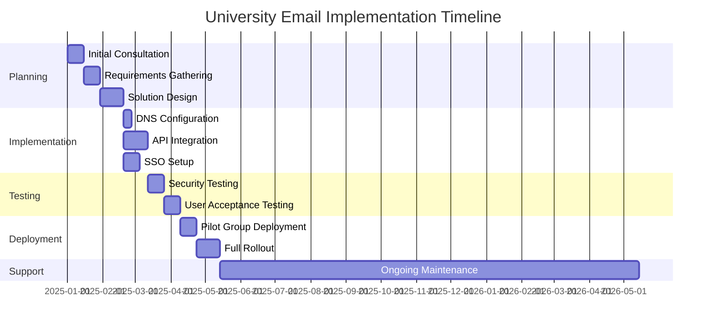
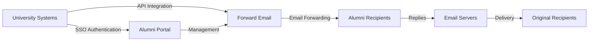

# Case Study: Hvordan Forward Email driver alumni-email-løsninger for topuniversiteter {#case-study-how-forward-email-powers-alumni-email-solutions-for-top-universities}


## Indholdsfortegnelse {#table-of-contents}

* [Forord](#foreword)
* [Dramatiske omkostningsbesparelser med stabil prisfastsættelse](#dramatic-cost-savings-with-stable-pricing)
  * [Virkelige universitetsbesparelser](#real-world-university-savings)
* [Udfordringen med universitetsalumni-email](#the-university-alumni-email-challenge)
  * [Værdien af alumni-email-identitet](#the-value-of-alumni-email-identity)
  * [Traditionelle løsninger halter bagefter](#traditional-solutions-fall-short)
  * [Forward Email-løsningen](#the-forward-email-solution)
* [Teknisk implementering: Sådan fungerer det](#technical-implementation-how-it-works)
  * [Kernearkitektur](#core-architecture)
  * [Integration med universitetssystemer](#integration-with-university-systems)
  * [API-drevet administration](#api-driven-management)
  * [DNS-konfiguration og verifikation](#dns-configuration-and-verification)
  * [Test og kvalitetskontrol](#testing-and-quality-assurance)
* [Implementeringstidslinje](#implementation-timeline)
* [Implementeringsproces: Fra migration til vedligeholdelse](#implementation-process-from-migration-to-maintenance)
  * [Indledende vurdering og planlægning](#initial-assessment-and-planning)
  * [Migreringsstrategi](#migration-strategy)
  * [Teknisk opsætning og konfiguration](#technical-setup-and-configuration)
  * [Brugeroplevelsesdesign](#user-experience-design)
  * [Træning og dokumentation](#training-and-documentation)
  * [Løbende support og optimering](#ongoing-support-and-optimization)
* [Case Study: University of Cambridge](#case-study-university-of-cambridge)
  * [Udfordring](#challenge)
  * [Løsning](#solution)
  * [Resultater](#results)
* [Fordele for universiteter og alumni](#benefits-for-universities-and-alumni)
  * [For universiteter](#for-universities)
  * [For alumni](#for-alumni)
  * [Adoptionsrater blandt alumni](#adoption-rates-among-alumni)
  * [Omkostningsbesparelser sammenlignet med tidligere løsninger](#cost-savings-compared-to-previous-solutions)
* [Sikkerheds- og privatlivsovervejelser](#security-and-privacy-considerations)
  * [Databeskyttelsesforanstaltninger](#data-protection-measures)
  * [Overholdelsesramme](#compliance-framework)
* [Fremtidige udviklinger](#future-developments)
* [Konklusion](#conclusion)


## Forord {#foreword}

Vi har bygget verdens mest sikre, private og fleksible email-videresendelsestjeneste for prestigefyldte universiteter og deres alumni.

I det konkurrenceprægede landskab inden for videregående uddannelse er det ikke blot en tradition, men en strategisk nødvendighed at opretholde livslange forbindelser med alumni. En af de mest håndgribelige måder, hvorpå universiteter fremmer disse forbindelser, er gennem alumni-emailadresser, der giver dimittender en digital identitet, som afspejler deres akademiske arv.

Hos Forward Email har vi indgået partnerskaber med nogle af verdens mest prestigefyldte uddannelsesinstitutioner for at revolutionere, hvordan de administrerer alumni-emailtjenester. Vores email-videresendelsesløsning i virksomhedsklasse driver nu alumni-email-systemerne for [University of Cambridge](https://en.wikipedia.org/wiki/University_of_Cambridge), [University of Maryland](https://en.wikipedia.org/wiki/University_of_Maryland,_College_Park), [Tufts University](https://en.wikipedia.org/wiki/Tufts_University) og [Swarthmore College](https://en.wikipedia.org/wiki/Swarthmore_College), som samlet set betjener tusindvis af alumni verden over.

Dette blogindlæg udforsker, hvordan vores [open-source](https://en.wikipedia.org/wiki/Open-source_software), privatlivsfokuserede email-videresendelsestjeneste er blevet den foretrukne løsning for disse institutioner, de tekniske implementeringer, der gør det muligt, og den transformerende effekt det har haft på både administrativ effektivitet og alumni-tilfredshed.


## Dramatiske omkostningsbesparelser med stabil prisfastsættelse {#dramatic-cost-savings-with-stable-pricing}
De økonomiske fordele ved vores løsning er betydelige, især sammenlignet med de kontinuerligt stigende priser hos traditionelle e-mailudbydere:

| Løsning                       | Omkostning pr. alumnus (årligt)                                                                          | Omkostning for 100.000 alumner | Seneste prisstigninger                                                                                                                                                                   |
| ------------------------------ | --------------------------------------------------------------------------------------------------------- | ------------------------------ | ---------------------------------------------------------------------------------------------------------------------------------------------------------------------------------------- |
| Google Workspace for Business  | $72                                                                                                       | $7.200.000                    | • 2019: G Suite Basic fra $5 til $6/måned (+20%)<br>• 2023: Fleksible planer steget med 20%<br>• 2025: Business Plus fra $18 til $26,40/måned (+47%) med AI-funktioner                    |
| Google Workspace for Education | Gratis (Education Fundamentals)<br>$3/student/år (Education Standard)<br>$5/student/år (Education Plus)    | Gratis - $500.000             | • Mængderabat: 5% for 100-499 licenser<br>• Mængderabat: 10% for 500+ licenser<br>• Gratis niveau begrænset til kerneydelser                                                             |
| Microsoft 365 Business         | $60                                                                                                       | $6.000.000                    | • 2023: Indført halvårlige prisopdateringer<br>• 2025 (jan): Personal fra $6,99 til $9,99/måned (+43%) med Copilot AI<br>• 2025 (apr): 5% stigning på årlige forpligtelser betalt månedligt |
| Microsoft 365 Education        | Gratis (A1)<br>$38-55/fakultet/år (A3)<br>$65-96/fakultet/år (A5)                                         | Gratis - $96.000              | • Studenterlicenser ofte inkluderet ved køb af fakultetslicenser<br>• Tilpassede priser via mængdelicenser<br>• Gratis niveau begrænset til webversioner                                   |
| Selvhostet Exchange            | $45                                                                                                       | $4.500.000                    | Løbende vedligeholdelses- og sikkerhedsomkostninger fortsætter med at stige                                                                                                              |
| **Forward Email Enterprise**   | **Fast $250/måned**                                                                                       | **$3.000/år**                 | **Ingen prisstigninger siden lancering**                                                                                                                                                  |

### Besparelser for universiteter i praksis {#real-world-university-savings}

Så meget sparer vores partneruniversiteter årligt ved at vælge Forward Email fremfor traditionelle udbydere:

| Universitet              | Antal alumner | Årlig omkostning med Google | Årlig omkostning med Forward Email | Årlig besparelse |
| ----------------------- | ------------- | --------------------------- | --------------------------------- | ---------------- |
| University of Cambridge | 30.000        | $90.000                    | $3.000                            | $87.000          |
| Swarthmore College      | 5.000         | $15.000                    | $3.000                            | $12.000          |
| Tufts University        | 12.000        | $36.000                    | $3.000                            | $33.000          |
| University of Maryland  | 25.000        | $75.000                    | $3.000                            | $72.000          |

> \[!NOTE]
> Forward Email enterprise koster typisk kun $250/måned, uden ekstra omkostninger pr. bruger, med whitelisted API-ratebegrænsninger, og den eneste ekstra omkostning er lagerplads, hvis du har brug for ekstra GB/TB til studerende (+$3 pr. 10 GB ekstra lagerplads). Vi bruger NVMe SSD-drev for hurtig understøttelse af IMAP/POP3/SMTP/CalDAV/CardDAV også.
> \[!IMPORTANT]
> I modsætning til Google og Microsoft, som gentagne gange har hævet deres priser samtidig med integration af AI-funktioner, der analyserer dine data, opretholder Forward Email stabile priser med et strengt fokus på privatliv. Vi bruger ikke AI, sporer ikke brugsmønstre og gemmer ikke logs eller e-mails på disk (al behandling sker i hukommelsen), hvilket sikrer fuldstændigt privatliv for dine alumni-kommunikationer.

Dette repræsenterer en betydelig omkostningsreduktion sammenlignet med traditionelle e-mail-hostingløsninger—midler som universiteter kan omdirigere til stipendier, forskning eller andre missionkritiske aktiviteter. Ifølge en analyse fra 2023 foretaget af Email Vendor Selection søger uddannelsesinstitutioner i stigende grad omkostningseffektive alternativer til traditionelle e-mailudbydere, efterhånden som priserne fortsætter med at stige i takt med integrationen af AI-funktioner ([Email Vendor Selection, 2023](https://www.emailvendorselection.com/email-service-provider-list/)).


## Udfordringen med universitets-alumni-e-mail {#the-university-alumni-email-challenge}

For universiteter udgør det en unik udfordring at tilbyde livstids-e-mailadresser til alumner, som traditionelle e-mailløsninger har svært ved effektivt at håndtere. Som det fremgår af en omfattende diskussion på ServerFault, kræver universiteter med store brugerbaser specialiserede e-mailløsninger, der balancerer ydeevne, sikkerhed og omkostningseffektivitet ([ServerFault, 2009](https://serverfault.com/questions/97364/what-is-the-best-mail-server-for-a-university-with-a-large-amount-of-users)).

### Værdien af alumni-e-mailidentitet {#the-value-of-alumni-email-identity}

Alumni-e-mailadresser (som `firstname.lastname@cl.cam.ac.uk` eller `username@terpalum.umd.edu`) tjener flere vigtige funktioner:

* Opretholdelse af institutionel tilknytning og brandidentitet
* Facilitering af løbende kommunikation med universitetet
* Forbedring af professionel troværdighed for dimittender
* Understøttelse af alumni-netværk og fællesskabsopbygning
* Tilvejebringelse af et stabilt, livslangt kontaktpunkt

Forskning af Tekade (2020) fremhæver, at uddannelses-e-mailadresser giver mange fordele for alumner, herunder adgang til akademiske ressourcer, professionel troværdighed og eksklusive rabatter på forskellige tjenester ([Medium, 2020](https://medium.com/coders-capsule/top-20-benefits-of-having-an-educational-email-address-91a09795e05)).

> \[!TIP]
> Besøg vores nye [AlumniEmail.com](https://alumniemail.com) katalog for en omfattende ressource om universitets-alumni-e-mailtjenester, inklusive opsætningsvejledninger, bedste praksis og en søgbar oversigt over alumni-e-maildomæner. Det fungerer som et centralt knudepunkt for al alumni-e-mailinformation.

### Traditionelle løsninger halter bagefter {#traditional-solutions-fall-short}

Konventionelle e-mailsystemer har flere begrænsninger, når de anvendes til alumni-e-mailbehov:

* **Omkostningstunge**: Licensmodeller pr. bruger bliver økonomisk uholdbare for store alumni-grupper
* **Administrativ byrde**: Håndtering af tusinder eller millioner af konti kræver betydelige IT-ressourcer
* **Sikkerhedsproblemer**: Vedligeholdelse af sikkerhed for inaktive konti øger sårbarheden
* **Begrænset fleksibilitet**: Stive systemer kan ikke tilpasses de unikke behov ved alumni-e-mail-videresendelse
* **Privatlivsproblemer**: Mange udbydere scanner e-mailindhold til reklameformål

En Quora-diskussion om vedligeholdelse af universitets-e-mail afslører, at sikkerhedsbekymringer er en væsentlig årsag til, at universiteter kan begrænse eller aflyse alumni-e-mailadresser, da ubrugte konti kan være sårbare over for hacking og identitetstyveri ([Quora, 2011](https://www.quora.com/Is-there-any-cost-for-a-college-or-university-to-maintain-edu-e-mail-addresses)).

### Forward Email-løsningen {#the-forward-email-solution}

Vores tilgang adresserer disse udfordringer gennem en fundamentalt anderledes model:

* E-mail-videresendelse frem for hosting
* Fast pris i stedet for omkostninger pr. bruger
* Open source-arkitektur for gennemsigtighed og sikkerhed
* Privatlivsorienteret design uden indholdsscanning
* Specialiserede funktioner til universitetsidentitetsstyring


## Teknisk implementering: Sådan fungerer det {#technical-implementation-how-it-works}
Vores løsning udnytter en sofistikeret, men alligevel elegant simpel teknisk arkitektur til at levere pålidelig, sikker e-mail videresendelse i stor skala.

### Core Architecture {#core-architecture}

Forward Email-systemet består af flere nøglekomponenter:

* Distribuerede MX-servere for høj tilgængelighed
* Realtids videresendelse uden lagring af beskeder
* Omfattende e-mail-autentificering
* Understøttelse af brugerdefinerede domæner og underdomæner
* API-drevet kontoadministration

Ifølge IT-professionelle på ServerFault anbefales Postfix som den bedste Mail Transfer Agent (MTA) til universiteter, der ønsker at implementere deres egne e-mailløsninger, mens Courier eller Dovecot foretrækkes til IMAP/POP3-adgang ([ServerFault, 2009](https://serverfault.com/questions/97364/what-is-the-best-mail-server-for-a-university-with-a-large-amount-of-users)). Vores løsning eliminerer dog behovet for, at universiteter selv skal administrere disse komplekse systemer.

### Integration with University Systems {#integration-with-university-systems}

Vi har udviklet sømløse integrationsveje med eksisterende universitetsinfrastruktur:

* Automatisk provisioning gennem [RESTful API](https://forwardemail.net/email-api) integration
* Muligheder for brugerdefineret branding af universitetsportaler
* Fleksibel alias-administration for afdelinger og organisationer
* Batch-operationer for effektiv administration

### API-Driven Management {#api-driven-management}

Vores [RESTful API](https://forwardemail.net/email-api) gør det muligt for universiteter at automatisere e-mail-administration:

```javascript
// Example: Creating a new alumni email address
const response = await fetch('https://forwardemail.net/api/v1/domains/example.edu/aliases', {
  method: 'POST',
  headers: {
    'Content-Type': 'application/json',
    'Authorization': `Basic ${Buffer.from(YOUR_API_TOKEN + ":").toString('base64')}`
  },
  body: JSON.stringify({
    name: 'alumni.john.smith',
    recipients: ['johnsmith@gmail.com'],
    has_recipient_verification: true
  })
});
```

### DNS Configuration and Verification {#dns-configuration-and-verification}

Korrekt DNS-konfiguration er afgørende for e-mail-levering. Vores team hjælper med:

* [DNS](https://en.wikipedia.org/wiki/Domain_Name_System) konfiguration inklusive MX-poster
* Omfattende implementering af e-mail-sikkerhed ved hjælp af vores open source [mailauth](https://www.npmjs.com/package/mailauth) pakke, en schweizerkniv til e-mail-autentificering, der håndterer:
  * [SPF](https://en.wikipedia.org/wiki/Sender_Policy_Framework) (Sender Policy Framework) for at forhindre e-mail-forfalskning
  * [DKIM](https://en.wikipedia.org/wiki/DomainKeys_Identified_Mail) (DomainKeys Identified Mail) til e-mail-autentificering
  * [DMARC](https://en.wikipedia.org/wiki/Email_authentication) (Domain-based Message Authentication, Reporting & Conformance) til politikhåndhævelse
  * [MTA-STS](https://en.wikipedia.org/wiki/Opportunistic_TLS) (SMTP MTA Strict Transport Security) for at håndhæve TLS-kryptering
  * [ARC](https://en.wikipedia.org/wiki/DomainKeys_Identified_Mail#Authenticated_Received_Chain) (Authenticated Received Chain) for at bevare autentificering ved videresendelse af beskeder
  * [SRS](https://en.wikipedia.org/wiki/Sender_Rewriting_Scheme) (Sender Rewriting Scheme) for at bevare SPF-validering gennem videresendelse
  * [BIMI](https://en.wikipedia.org/wiki/Email_authentication) (Brand Indicators for Message Identification) til visning af logo i understøttede e-mail-klienter
* DNS TXT-post verifikation for domæneeje

`mailauth`-pakken (<http://npmjs.com/package/mailauth>) er den fuldt open source løsning, der håndterer alle aspekter af e-mail-autentificering i et integreret bibliotek. I modsætning til proprietære løsninger sikrer denne tilgang gennemsigtighed, regelmæssige sikkerhedsopdateringer og fuld kontrol over e-mail-autentificeringsprocessen.

### Testing and Quality Assurance {#testing-and-quality-assurance}

Før fuld implementering gennemfører vi grundige tests:

* End-to-end test af e-mail-levering
* Belastningstest for scenarier med højt volumen
* Sikkerheds-penetrationstest
* API-integrationsvalidering
* Brugergodkendelsestest med repræsentanter fra alumni
## Implementeringstidslinje {#implementation-timeline}


```mermaid
gantt
    title University Email Implementation Timeline
    dateFormat  YYYY-MM-DD
    section Planning
    Initial Consultation           :a1, 2025-01-01, 14d
    Requirements Gathering         :a2, after a1, 14d
    Solution Design                :a3, after a2, 21d
    section Implementation
    DNS Configuration              :b1, after a3, 7d
    API Integration                :b2, after a3, 21d
    SSO Setup                      :b3, after a3, 14d
    section Testing
    Security Testing               :c1, after b1 b2 b3, 14d
    User Acceptance Testing        :c2, after c1, 14d
    section Deployment
    Pilot Group Deployment         :d1, after c2, 14d
    Full Rollout                   :d2, after d1, 21d
    section Support
    Ongoing Maintenance            :e1, after d2, 365d
```


## Implementeringsproces: Fra migration til vedligeholdelse {#implementation-process-from-migration-to-maintenance}

Vores strukturerede implementeringsproces sikrer en glidende overgang for universiteter, der tager vores løsning i brug.

### Indledende vurdering og planlægning {#initial-assessment-and-planning}

Vi starter med en omfattende vurdering af universitetets nuværende emailsystem, alumnidatabase og tekniske krav. Denne fase inkluderer:

* Interessentinterviews med IT, alumni relationer og administration
* Teknisk revision af eksisterende emailinfrastruktur
* Datamapping for alumnioptegnelser
* Sikkerheds- og overholdelsesgennemgang
* Udvikling af projekt tidslinje og milepæle

### Migrationsstrategi {#migration-strategy}

Baseret på vurderingen udvikler vi en skræddersyet migrationsstrategi, der minimerer forstyrrelser samtidig med at sikre fuld dataintegritet:

* Faseopdelt migration efter alumnikohorter
* Parallel drift af systemer under overgangen
* Omfattende datavalideringsprotokoller
* Tilbagefaldsprocedurer ved migrationsproblemer
* Klar kommunikationsplan for alle interessenter

### Teknisk opsætning og konfiguration {#technical-setup-and-configuration}

Vores tekniske team håndterer alle aspekter af systemopsætningen:

* DNS-konfiguration og verifikation
* API-integration med universitetets systemer
* Tilpasset portaludvikling med universitetsbranding
* Opsætning af emailautentificering (SPF, DKIM, DMARC)

### Brugeroplevelsesdesign {#user-experience-design}

Vi arbejder tæt sammen med universiteter for at skabe intuitive grænseflader til både administratorer og alumni:

* Tilpassede alumni emailportaler med branding
* Forenklet administration af emailvideresendelse
* Mobilresponsivt design
* Overholdelse af tilgængelighedsstandarder
* Flersproget support hvor nødvendigt

### Træning og dokumentation {#training-and-documentation}

Omfattende træning sikrer, at alle interessenter effektivt kan bruge systemet:

* Træningssessioner for administratorer
* Teknisk dokumentation til IT-personale
* Brugervejledninger til alumni
* Videovejledninger til almindelige opgaver
* Udvikling af vidensbase

### Løbende support og optimering {#ongoing-support-and-optimization}

Vores partnerskab fortsætter langt ud over implementeringen:

* 24/7 teknisk support
* Regelmæssige systemopdateringer og sikkerhedspatches
* Overvågning og optimering af ydeevne
* Rådgivning om bedste praksis for email
* Dataanalyse og rapportering


## Case Study: University of Cambridge {#case-study-university-of-cambridge}

University of Cambridge søgte en løsning til at tilbyde @cam.ac.uk emailadresser til alumni samtidig med at reducere IT-omkostninger og -arbejdspres.

### Udfordring {#challenge}

Cambridge stod over for flere udfordringer med deres tidligere alumni emailsystem:

* Høje driftsomkostninger ved vedligeholdelse af separat emailinfrastruktur
* Administrativ byrde ved håndtering af tusindvis af konti
* Sikkerhedsbekymringer ved inaktive konti
* Begrænset integration med alumnidatabasesystemer
* Stigende lagringsbehov

### Løsning {#solution}

Forward Email implementerede en omfattende løsning:

* Emailvideresendelse for alle @cam.ac.uk alumniadresser
* Tilpasset portal med branding til alumni selvbetjening
* API-integration med Cambridges alumnidatabase
* Omfattende implementering af emailsikkerhed

### Resultater {#results}

Implementeringen leverede betydelige fordele:
* Betydelig omkostningsreduktion sammenlignet med tidligere løsning
* 99,9% pålidelighed i e-mail levering
* Forenklet administration gennem automatisering
* Forbedret sikkerhed med moderne e-mail autentificering
* Positiv feedback fra alumner om systemets brugervenlighed


## Fordele for universiteter og alumner {#benefits-for-universities-and-alumni}

Vores løsning leverer håndgribelige fordele for både institutioner og deres dimittender.

### For universiteter {#for-universities}

* **Omkostningseffektivitet**: Fast pris uanset antal alumner
* **Administrativ enkelhed**: Automatiseret styring via API
* **Forbedret sikkerhed**: Omfattende e-mail autentificering
* **Brandkonsistens**: Livslange institutionelle e-mailadresser
* **Alumnenetværk**: Styrkede forbindelser gennem løbende service

Ifølge BulkSignature (2023) tilbyder e-mailplatforme til uddannelsesinstitutioner betydelige fordele, herunder omkostningseffektivitet gennem gratis eller lavprisplaner, tidsbesparelse via massekommunikationsmuligheder og sporingsfunktioner til overvågning af e-mail levering og engagement ([BulkSignature, 2023](https://bulksignature.com/blog/5-best-email-platforms-for-educational-institutions/)).

### For alumner {#for-alumni}

* **Professionel identitet**: Prestigefyldt universitets-e-mailadresse
* **E-mail kontinuitet**: Videresend til enhver personlig e-mail
* **Privatlivsbeskyttelse**: Ingen indholdsscanning eller dataudvinding
* **Forenklet administration**: Nem opdatering af modtagere
* **Forbedret sikkerhed**: Moderne e-mail autentificering

Forskning fra International Journal of Education & Literacy Studies fremhæver vigtigheden af korrekt e-mail kommunikation i akademiske miljøer og bemærker, at e-mail færdigheder er en afgørende kompetence for både studerende og alumner i professionelle sammenhænge ([IJELS, 2021](https://files.eric.ed.gov/fulltext/EJ1319324.pdf)).

### Adoptionsrater blandt alumner {#adoption-rates-among-alumni}

Universiteter rapporterer høje adoptions- og tilfredshedsgrader blandt deres alumnenetværk.

### Omkostningsbesparelser sammenlignet med tidligere løsninger {#cost-savings-compared-to-previous-solutions}

Den økonomiske effekt har været betydelig, med universiteter der rapporterer store omkostningsbesparelser sammenlignet med deres tidligere e-mailløsninger.


## Sikkerheds- og privatlivsovervejelser {#security-and-privacy-considerations}

For uddannelsesinstitutioner er beskyttelse af alumnernes data ikke blot god praksis – det er ofte et lovkrav under regler som GDPR i Europa.

### Databeskyttelsesforanstaltninger {#data-protection-measures}

Vores løsning indeholder flere lag af sikkerhed:

* End-to-end kryptering for al e-mail trafik
* Ingen lagring af e-mail indhold på vores servere
* Regelmæssige sikkerhedsrevisioner og penetrationstest
* Overholdelse af internationale databeskyttelsesstandarder
* Transparent, open-source kode til sikkerhedsverifikation

> \[!WARNING]
> Mange e-mailudbydere scanner e-mailindhold til reklameformål eller for at træne AI-modeller. Denne praksis rejser alvorlige privatlivsbekymringer, især for professionelle og akademiske kommunikationer. Forward Email scanner aldrig e-mailindhold og behandler alle e-mails i hukommelsen for at sikre fuldstændigt privatliv.

### Overholdelsesramme {#compliance-framework}

Vi opretholder streng overholdelse af relevante regler:

* GDPR-overholdelse for europæiske institutioner
* SOC 2 Type II certificering
* Årlige sikkerhedsvurderinger
* Databehandleraftale (DPA) tilgængelig på [forwardemail.net/dpa](https://forwardemail.net/dpa)
* Regelmæssige opdateringer af overholdelse i takt med lovgivningens udvikling


## Fremtidige udviklinger {#future-developments}

Vi fortsætter med at forbedre vores alumni e-mailløsning med nye funktioner og kapaciteter:

* Forbedret analyse for universitetsadministratorer
* Avanceret anti-phishing beskyttelse
* Udvidede API-muligheder for dybere integration
* Yderligere autentificeringsmuligheder


## Konklusion {#conclusion}

Forward Email har revolutioneret, hvordan universiteter leverer og administrerer alumni e-mail tjenester. Ved at erstatte dyre, komplekse e-mail hosting løsninger med elegant, sikker e-mail videresendelse, har vi gjort det muligt for institutioner at tilbyde livslange e-mailadresser til alle alumner samtidig med, at omkostninger og administrativt arbejde er blevet dramatisk reduceret.
Vores partnerskaber med prestigefyldte institutioner som Cambridge, Maryland, Tufts og Swarthmore demonstrerer effektiviteten af vores tilgang på tværs af forskellige uddannelsesmiljøer. Efterhånden som universiteter står over for stigende pres for at opretholde forbindelser til alumner samtidig med at kontrollere omkostningerne, tilbyder vores løsning et overbevisende alternativ til traditionelle emailsystemer.


```mermaid
flowchart LR
    A[University Systems] -->|API Integration| B[Forward Email]
    B -->|Email Forwarding| C[Alumni Recipients]
    C -->|Replies| D[Email Servers]
    D -->|Delivery| E[Original Recipients]
    F[Alumni Portal] -->|Management| B
    A -->|SSO Authentication| F
```

For universiteter, der er interesserede i at udforske, hvordan Forward Email kan transformere deres alumni-emailtjenester, kontakt vores team på <support@forwardemail.net> eller besøg [forwardemail.net](https://forwardemail.net) for at lære mere om vores enterprise-løsninger.
