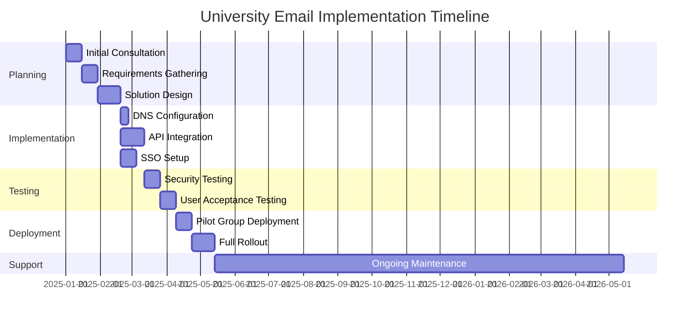
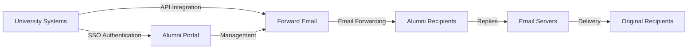

# Fallstudie: Wie Forward Email Alumni-E-Mail-Lösungen für Spitzenuniversitäten unterstützt {#case-study-how-forward-email-powers-alumni-email-solutions-for-top-universities}


## Inhaltsverzeichnis {#table-of-contents}

* [Vorwort](#foreword)
* [Dramatische Kosteneinsparungen durch stabile Preise](#dramatic-cost-savings-with-stable-pricing)
  * [Echte Einsparungen an der Universität](#real-world-university-savings)
* [Die E-Mail-Challenge der Universitäts-Alumni](#the-university-alumni-email-challenge)
  * [Der Wert der E-Mail-Identität von Alumni](#the-value-of-alumni-email-identity)
  * [Herkömmliche Lösungen reichen nicht aus](#traditional-solutions-fall-short)
  * [Die E-Mail-Weiterleitungslösung](#the-forward-email-solution)
* [Technische Umsetzung: So funktioniert’s](#technical-implementation-how-it-works)
  * [Kernarchitektur](#core-architecture)
  * [Integration mit Universitätssystemen](#integration-with-university-systems)
  * [API-gesteuertes Management](#api-driven-management)
  * [DNS-Konfiguration und -Verifizierung](#dns-configuration-and-verification)
  * [Prüfung und Qualitätssicherung](#testing-and-quality-assurance)
* [Zeitplan für die Implementierung](#implementation-timeline)
* [Implementierungsprozess: Von der Migration bis zur Wartung](#implementation-process-from-migration-to-maintenance)
  * [Erste Einschätzung und Planung](#initial-assessment-and-planning)
  * [Migrationsstrategie](#migration-strategy)
  * [Technische Einrichtung und Konfiguration](#technical-setup-and-configuration)
  * [Benutzererfahrungsdesign](#user-experience-design)
  * [Schulung und Dokumentation](#training-and-documentation)
  * [Laufende Unterstützung und Optimierung](#ongoing-support-and-optimization)
* [Fallstudie: Universität Cambridge](#case-study-university-of-cambridge)
  * [Herausforderung](#challenge)
  * [Lösung](#solution)
  * [Ergebnisse](#results)
* [Vorteile für Hochschulen und Alumni](#benefits-for-universities-and-alumni)
  * [Für Universitäten](#for-universities)
  * [Für Alumni](#for-alumni)
  * [Adoptionsraten unter Alumni](#adoption-rates-among-alumni)
  * [Kosteneinsparungen im Vergleich zu früheren Lösungen](#cost-savings-compared-to-previous-solutions)
* [Sicherheits- und Datenschutzaspekte](#security-and-privacy-considerations)
  * [Datenschutzmaßnahmen](#data-protection-measures)
  * [Compliance-Rahmenwerk](#compliance-framework)
* [Zukünftige Entwicklungen](#future-developments)
* [Abschluss](#conclusion)

## Vorwort {#foreword}

Wir haben den weltweit sichersten, privatesten und flexibelsten E-Mail-Weiterleitungsdienst für renommierte Universitäten und ihre Alumni entwickelt.

Im wettbewerbsintensiven Hochschulumfeld ist die Pflege lebenslanger Verbindungen zu Alumni nicht nur eine Frage der Tradition – sie ist ein strategisches Gebot. Eine der greifbarsten Möglichkeiten für Universitäten, diese Verbindungen zu fördern, sind Alumni-E-Mail-Adressen. Sie bieten Absolventen eine digitale Identität, die ihr akademisches Erbe widerspiegelt.

Forward Email hat mit einigen der renommiertesten Bildungseinrichtungen weltweit zusammengearbeitet, um die Verwaltung ihrer Alumni-E-Mail-Dienste zu revolutionieren. Unsere professionelle E-Mail-Weiterleitungslösung unterstützt nun die Alumni-E-Mail-Systeme der [Universität Cambridge](https://en.wikipedia.org/wiki/University_of_Cambridge), [Universität von Maryland](https://en.wikipedia.org/wiki/University_of_Maryland,\_College_Park), [Tufts Universität](https://en.wikipedia.org/wiki/Tufts_University) und [Swarthmore College](https://en.wikipedia.org/wiki/Swarthmore_College) und bedient damit Tausende von Alumni weltweit.

In diesem Blogbeitrag wird untersucht, wie unser datenschutzorientierter E-Mail-Weiterleitungsdienst [Open Source](https://en.wikipedia.org/wiki/Open-source_software) zur bevorzugten Lösung dieser Institutionen geworden ist, welche technischen Implementierungen dies ermöglichen und welche transformativen Auswirkungen er sowohl auf die Verwaltungseffizienz als auch auf die Zufriedenheit der Alumni hatte.

## Erhebliche Kosteneinsparungen durch stabile Preise {#dramatic-cost-savings-with-stable-pricing}

Die finanziellen Vorteile unserer Lösung sind erheblich, insbesondere im Vergleich zu den ständig steigenden Preisen herkömmlicher E-Mail-Anbieter:

| Lösung | Kosten pro Alumnus (jährlich) | Kosten für 100.000 Alumni | Jüngste Preiserhöhungen |
| ------------------------------ | --------------------------------------------------------------------------------------------------------- | ----------------------- | ---------------------------------------------------------------------------------------------------------------------------------------------------------------------------------------- |
| Google Workspace für Unternehmen | $72 | $7,200,000 | • 2019: G Suite Basic von 5 auf 6 $/Monat (+20 %)<br>• 2023: Flexible Pläne um 20 % erhöht<br>• 2025: Business Plus von 18 auf 26,40 $/Monat (+47 %) mit KI-Funktionen |
| Google Workspace für Bildung | Kostenlos (Education Fundamentals)<br>3 $/Student/Jahr (Education Standard)<br>5 $/Student/Jahr (Education Plus) | Kostenlos – 500.000 $ | • Mengenrabatte: 5 % für 100–499 Lizenzen<br>• Mengenrabatte: 10 % für 500+ Lizenzen<br>• Kostenlose Stufe beschränkt auf Kerndienste |
| Microsoft 365 Business | $60 | $6,000,000 | • 2023: Einführung halbjährlicher Preisaktualisierungen<br>• 2025 (Jan): Personal von 6,99 $ auf 9,99 $/Monat (+43 %) mit Copilot AI<br>• 2025 (Apr): 5 % Erhöhung der monatlich gezahlten Jahresverpflichtungen |
| Microsoft 365 Education | Kostenlos (A1)<br>38–55 $/Fakultät/Jahr (A3)<br>65–96 $/Fakultät/Jahr (A5) | Kostenlos – 96.000 $ | • Studentenlizenzen sind oft in den Käufen der Fakultät enthalten<br>• Individuelle Preise durch Volumenlizenzierung<br>• Kostenloses Kontingent auf Webversionen beschränkt |
| Selbstgehosteter Austausch | $45 | $4,500,000 | Laufende Wartungs- und Sicherheitskosten steigen weiter |
| **E-Mail-Weiterleitung Enterprise** | **Festpreis 250 $/Monat** | **3.000 $/Jahr** | **Keine Preiserhöhungen seit der Einführung** |

### Echte Universitätsersparnisse {#real-world-university-savings}

So viel sparen unsere Partneruniversitäten jährlich, wenn sie sich für Forward Email statt für herkömmliche Anbieter entscheiden:

| Universität | Alumni-Zahl | Jährliche Kosten bei Google | Jährliche Kosten mit E-Mail-Weiterleitung | Jährliche Einsparungen |
| ----------------------- | ------------ | ----------------------- | ------------------------------ | -------------- |
| Universität Cambridge | 30,000 | $90,000 | $3,000 | $87,000 |
| Swarthmore College | 5,000 | $15,000 | $3,000 | $12,000 |
| Tufts Universität | 12,000 | $36,000 | $3,000 | $33,000 |
| Universität von Maryland | 25,000 | $75,000 | $3,000 | $72,000 |

> \[!NOTE]
> Forward Email enterprise only costs $250/month typically, with no extra cost per user, whitelisted API rate limitations, and the only additional cost is storage if you need additional GB/TB for students (+$3 per 10 GB additional storage). We use NVMe SSD drives for fast support of IMAP/POP3/SMTP/CalDAV/CardDAV as well.

> \[!IMPORTANT]
> Unlike Google and Microsoft, who have repeatedly increased their prices while integrating AI features that analyze your data, Forward Email maintains stable pricing with a strict privacy focus. We don't use AI, don't track usage patterns, and don't store logs or emails to disk (all processing is done in-memory), ensuring complete privacy for your alumni communications.

Dies stellt eine erhebliche Kostenreduzierung im Vergleich zu herkömmlichen E-Mail-Hosting-Lösungen dar – Mittel, die Universitäten für Stipendien, Forschung oder andere unternehmenskritische Aktivitäten verwenden können. Laut einer Analyse von Email Vendor Selection aus dem Jahr 2023 suchen Bildungseinrichtungen zunehmend nach kostengünstigen Alternativen zu herkömmlichen E-Mail-Anbietern, da die Preise durch die Integration von KI-Funktionen weiter steigen ([Auswahl des E-Mail-Anbieters, 2023](https://www.emailvendorselection.com/email-service-provider-list/)).

## Die E-Mail-Challenge für Universitäts-Alumni {#the-university-alumni-email-challenge}

Für Universitäten stellt die Bereitstellung lebenslanger E-Mail-Adressen für Alumni eine besondere Herausforderung dar, die herkömmliche E-Mail-Lösungen nur schwer bewältigen können. Wie in einer ausführlichen Diskussion auf ServerFault erwähnt, benötigen Universitäten mit großen Nutzerzahlen spezialisierte E-Mail-Lösungen, die Leistung, Sicherheit und Kosteneffizienz in Einklang bringen ([ServerFault, 2009](https://serverfault.com/questions/97364/what-is-the-best-mail-server-for-a-university-with-a-large-amount-of-users)).

### Der Wert der E-Mail-Identität von Alumni {#the-value-of-alumni-email-identity}

Alumni-E-Mail-Adressen (wie `firstname.lastname@cl.cam.ac.uk` oder `username@terpalum.umd.edu`) erfüllen mehrere wichtige Funktionen:

* Pflege der institutionellen Verbindung und der Markenidentität
* Förderung der kontinuierlichen Kommunikation mit der Universität
* Stärkung der beruflichen Glaubwürdigkeit der Absolventinnen und Absolventen
* Förderung der Alumni-Vernetzung und des Community-Aufbaus
* Bereitstellung einer stabilen, lebenslangen Anlaufstelle

Untersuchungen von Tekade (2020) zeigen, dass Bildungs-E-Mail-Adressen Alumni zahlreiche Vorteile bieten, darunter Zugang zu akademischen Ressourcen, berufliche Glaubwürdigkeit und exklusive Rabatte auf verschiedene Dienste ([Mittel, 2020](https://medium.com/coders-capsule/top-20-benefits-of-having-an-educational-email-address-91a09795e05)).

> \[!TIP]
> Visit our new [AlumniEmail.com](https://alumniemail.com) directory for a comprehensive resource on university alumni email services, including setup guides, best practices, and a searchable directory of alumni email domains. It serves as a central hub for all alumni email information.

### Herkömmliche Lösungen reichen nicht aus {#traditional-solutions-fall-short}

Herkömmliche E-Mail-Systeme weisen mehrere Einschränkungen auf, wenn sie auf die E-Mail-Anforderungen von Alumni angewendet werden:

* **Kostenintensive**: Benutzerbasierte Lizenzmodelle sind für große Alumni-Gruppen finanziell untragbar.
* **Verwaltungsaufwand**: Die Verwaltung von Tausenden oder Millionen von Konten erfordert erhebliche IT-Ressourcen.
* **Sicherheitsbedenken**: Die Aufrechterhaltung der Sicherheit ruhender Konten erhöht die Anfälligkeit.
* **Eingeschränkte Flexibilität**: Starre Systeme können sich nicht an die besonderen Anforderungen der E-Mail-Weiterleitung von Alumni anpassen.
* **Datenschutzprobleme**: Viele Anbieter scannen E-Mail-Inhalte zu Werbezwecken.

Eine Quora-Diskussion über die Wartung von Universitäts-E-Mails zeigt, dass Sicherheitsbedenken ein Hauptgrund dafür sind, dass Universitäten die E-Mail-Adressen von Alumni beschränken oder löschen, da ungenutzte Konten anfällig für Hackerangriffe und Identitätsdiebstahl sein können ([Quora, 2011](https://www.quora.com/Is-there-any-cost-for-a-college-or-university-to-maintain-edu-e-mail-addresses)).

### Die Lösung zum Weiterleiten von E-Mails {#the-forward-email-solution}

Unser Ansatz begegnet diesen Herausforderungen durch ein grundlegend anderes Modell:

* E-Mail-Weiterleitung statt Hosting
* Pauschalpreis statt Einzelnutzerkosten
* Open-Source-Architektur für Transparenz und Sicherheit
* Datenschutzorientiertes Design ohne Inhaltsprüfung
* Spezialfunktionen für das Identitätsmanagement von Universitäten

## Technische Umsetzung: So funktioniert es {#technical-implementation-how-it-works}

Unsere Lösung nutzt eine ausgeklügelte und dennoch elegant einfache technische Architektur, um eine zuverlässige und sichere E-Mail-Weiterleitung im großen Maßstab zu ermöglichen.

### Kernarchitektur {#core-architecture}

Das Forward-E-Mail-System besteht aus mehreren Schlüsselkomponenten:

* Verteilte MX-Server für hohe Verfügbarkeit
* Echtzeit-Weiterleitung ohne Nachrichtenspeicherung
* Umfassende E-Mail-Authentifizierung
* Unterstützung benutzerdefinierter Domänen und Subdomänen
* API-gesteuerte Kontoverwaltung

Laut IT-Experten auf ServerFault empfiehlt sich für Universitäten, die eigene E-Mail-Lösungen implementieren möchten, Postfix als bester Mail Transfer Agent (MTA), während Courier oder Dovecot für den IMAP/POP3-Zugriff ([ServerFault, 2009](https://serverfault.com/questions/97364/what-is-the-best-mail-server-for-a-university-with-a-large-amount-of-users)) bevorzugt werden. Unsere Lösung macht es Universitäten jedoch überflüssig, diese komplexen Systeme selbst zu verwalten.

### Integration mit Universitätssystemen {#integration-with-university-systems}

Wir haben nahtlose Integrationspfade mit der vorhandenen Universitätsinfrastruktur entwickelt:

* Automatisierte Bereitstellung durch [RESTful API](https://forwardemail.net/email-api)-Integration
* Individuelle Branding-Optionen für Universitätsportale
* Flexible Alias-Verwaltung für Fachbereiche und Organisationen
* Batch-Operationen für effiziente Verwaltung

### API-gesteuerte Verwaltung {#api-driven-management}

Unser [RESTful API](https://forwardemail.net/email-api) ermöglicht Universitäten die Automatisierung des E-Mail-Managements:

```javascript
// Example: Creating a new alumni email address
const response = await fetch('https://forwardemail.net/api/v1/domains/example.edu/aliases', {
  method: 'POST',
  headers: {
    'Content-Type': 'application/json',
    'Authorization': `Basic ${Buffer.from(YOUR_API_TOKEN + ":").toString('base64')}`
  },
  body: JSON.stringify({
    name: 'alumni.john.smith',
    recipients: ['johnsmith@gmail.com'],
    has_recipient_verification: true
  })
});
```

### DNS-Konfiguration und -Verifizierung {#dns-configuration-and-verification}

Eine korrekte DNS-Konfiguration ist für die E-Mail-Zustellung entscheidend. Unser Team unterstützt Sie bei:

* [DNS](https://en.wikipedia.org/wiki/Domain_Name_System)-Konfiguration inklusive MX-Einträgen
* Umfassende Implementierung der E-Mail-Sicherheit mit unserem Open-Source-Paket [Mailauth](https://www.npmjs.com/package/mailauth), einem Schweizer Taschenmesser für die E-Mail-Authentifizierung. Es umfasst:
* [SPF](https://en.wikipedia.org/wiki/Sender_Policy_Framework) (Sender Policy Framework) zur Verhinderung von E-Mail-Spoofing
* [DKIM](https://en.wikipedia.org/wiki/DomainKeys_Identified_Mail) (DomainKeys Identified Mail) zur E-Mail-Authentifizierung
* [DMARC](https://en.wikipedia.org/wiki/Email_authentication) (Domänenbasierte Nachrichtenauthentifizierung, Reporting & Konformität) zur Richtliniendurchsetzung
* [MTA-STS](https://en.wikipedia.org/wiki/Opportunistic_TLS) (SMTP MTA Strict Transport Security) zur Durchsetzung der TLS-Verschlüsselung
* [ARC](https://en.wikipedia.org/wiki/DomainKeys_Identified_Mail#Authenticated_Received_Chain) (Authenticated Received Chain) zur Aufrechterhaltung der Authentifizierung bei Nachrichtenweiterleitung
* [SRS](https://en.wikipedia.org/wiki/Sender_Rewriting_Scheme) (Sender Rewriting Scheme) zur Aufrechterhaltung der SPF-Validierung während der Weiterleitung
* [BIMI](https://en.wikipedia.org/wiki/Email_authentication) (Markenindikatoren zur Nachrichtenidentifizierung) für die Logoanzeige in unterstützenden E-Mail-Clients
* DNS-TXT-Eintragsüberprüfung für den Domänenbesitz

Das Paket `mailauth` (<http://npmjs.com/package/mailauth>) ist eine vollständig Open-Source-Lösung, die alle Aspekte der E-Mail-Authentifizierung in einer integrierten Bibliothek abdeckt. Im Gegensatz zu proprietären Lösungen gewährleistet dieser Ansatz Transparenz, regelmäßige Sicherheitsupdates und vollständige Kontrolle über den E-Mail-Authentifizierungsprozess.

### Tests und Qualitätssicherung {#testing-and-quality-assurance}

Vor der vollständigen Bereitstellung führen wir strenge Tests durch:

* End-to-End-Tests der E-Mail-Zustellung
* Lasttests für Szenarien mit hohem Datenaufkommen
* Sicherheits-Penetrationstests
* Validierung der API-Integration
* Benutzerakzeptanztests mit Alumni-Vertretern

## Zeitplan für die Implementierung {#implementation-timeline}



## Implementierungsprozess: Von der Migration bis zur Wartung {#implementation-process-from-migration-to-maintenance}

Unser strukturierter Implementierungsprozess gewährleistet einen reibungslosen Übergang für Universitäten, die unsere Lösung übernehmen.

### Erste Einschätzung und Planung {#initial-assessment-and-planning}

Wir beginnen mit einer umfassenden Bewertung des aktuellen E-Mail-Systems, der Alumni-Datenbank und der technischen Anforderungen der Universität. Diese Phase umfasst:

* Stakeholder-Interviews mit IT, Alumni-Betreuung und Verwaltung
* Technische Prüfung der bestehenden E-Mail-Infrastruktur
* Datenmapping für Alumni-Daten
* Sicherheits- und Compliance-Prüfung
* Projektzeitplan und Meilensteinentwicklung

### Migrationsstrategie {#migration-strategy}

Basierend auf der Bewertung entwickeln wir eine maßgeschneiderte Migrationsstrategie, die Störungen minimiert und gleichzeitig die vollständige Datenintegrität gewährleistet:

* Phasenweise Migration durch Alumni-Kohorten
* Paralleler Systembetrieb während der Umstellung
* Umfassende Datenvalidierungsprotokolle
* Fallback-Verfahren für Migrationsprobleme
* Klarer Kommunikationsplan für alle Beteiligten

### Technische Einrichtung und Konfiguration {#technical-setup-and-configuration}

Unser technisches Team kümmert sich um alle Aspekte der Systemeinrichtung:

* DNS-Konfiguration und -Verifizierung
* API-Integration mit Universitätssystemen
* Individuelle Portalentwicklung mit Universitäts-Branding
* Einrichtung der E-Mail-Authentifizierung (SPF, DKIM, DMARC)

### Benutzererfahrungsdesign {#user-experience-design}

Wir arbeiten eng mit Universitäten zusammen, um intuitive Schnittstellen sowohl für Administratoren als auch für Alumni zu erstellen:

* Individuell gestaltete Alumni-E-Mail-Portale
* Vereinfachte Verwaltung der E-Mail-Weiterleitung
* Mobile-responsive Designs
* Barrierefreiheit
* Mehrsprachige Unterstützung bei Bedarf

### Schulung und Dokumentation {#training-and-documentation}

Umfassende Schulungen stellen sicher, dass alle Beteiligten das System effektiv nutzen können:

* Administratorenschulungen
* Technische Dokumentation für IT-Mitarbeiter
* Benutzerhandbücher für Alumni
* Video-Tutorials für häufige Aufgaben
* Entwicklung einer Wissensdatenbank

### Laufende Unterstützung und Optimierung {#ongoing-support-and-optimization}

Unsere Partnerschaft geht weit über die Implementierung hinaus:

* Technischer Support rund um die Uhr
* Regelmäßige Systemupdates und Sicherheitspatches
* Leistungsüberwachung und -optimierung
* Beratung zu Best Practices im E-Mail-Bereich
* Datenanalyse und Reporting

## Fallstudie: Universität Cambridge {#case-study-university-of-cambridge}

Die Universität Cambridge suchte nach einer Lösung, um ihren Alumni E-Mail-Adressen mit der Endung @cam.ac.uk zur Verfügung zu stellen und gleichzeitig den IT-Aufwand und die Kosten zu senken.

### Herausforderung {#challenge}

Cambridge stand mit seinem bisherigen Alumni-E-Mail-System vor mehreren Herausforderungen:

* Hohe Betriebskosten für die Aufrechterhaltung einer separaten E-Mail-Infrastruktur
* Verwaltungsaufwand durch die Verwaltung Tausender Konten
* Sicherheitsbedenken bei ruhenden Konten
* Eingeschränkte Integration mit Alumni-Datenbanksystemen
* Steigender Speicherbedarf

### Lösung {#solution}

Forward Email hat eine umfassende Lösung implementiert:

* E-Mail-Weiterleitung für alle @cam.ac.uk-Alumni-Adressen
* Individuell gestaltetes Portal für Alumni-Self-Service
* API-Integration mit der Cambridge-Alumni-Datenbank
* Umfassende E-Mail-Sicherheitsimplementierung

### Ergebnisse {#results}

Die Implementierung brachte erhebliche Vorteile:

* Deutliche Kostenreduzierung im Vergleich zur vorherigen Lösung
* 99,9 % zuverlässige E-Mail-Zustellung
* Vereinfachte Verwaltung durch Automatisierung
* Verbesserte Sicherheit durch moderne E-Mail-Authentifizierung
* Positives Feedback von Alumni zur Systemnutzbarkeit

## Vorteile für Hochschulen und Alumni {#benefits-for-universities-and-alumni}

Unsere Lösung bietet sowohl den Institutionen als auch ihren Absolventen konkrete Vorteile.

### Für Universitäten {#for-universities}

* **Kosteneffizienz**: Festpreis unabhängig von der Alumni-Anzahl
* **Einfache Administration**: Automatisierte Verwaltung über API
* **Erhöhte Sicherheit**: Umfassende E-Mail-Authentifizierung
* **Markenkonsistenz**: Lebenslange institutionelle E-Mail-Adressen
* **Alumni-Engagement**: Stärkung der Verbindungen durch kontinuierliche Betreuung

Laut BulkSignature (2023) bieten E-Mail-Plattformen für Bildungseinrichtungen erhebliche Vorteile, darunter Kosteneffizienz durch kostenlose oder kostengünstige Pläne, Zeiteffizienz durch Massenkommunikationsfunktionen und Tracking-Funktionen zur Überwachung der E-Mail-Zustellung und des Engagements ([BulkSignature, 2023](https://bulksignature.com/blog/5-best-email-platforms-for-educational-institutions/)).

### Für Alumni {#for-alumni}

* **Professionelle Identität**: Renommierte Universitäts-E-Mail-Adresse
* **E-Mail-Kontinuität**: Weiterleitung an jede private E-Mail-Adresse
* **Datenschutz**: Kein Scannen von Inhalten oder Data Mining
* **Vereinfachte Verwaltung**: Einfache Empfängeraktualisierung
* **Erhöhte Sicherheit**: Moderne E-Mail-Authentifizierung

Eine Studie des International Journal of Education & Literacy Studies unterstreicht die Bedeutung einer angemessenen E-Mail-Kommunikation im akademischen Umfeld und weist darauf hin, dass E-Mail-Kompetenz sowohl für Studierende als auch für Alumni im beruflichen Kontext eine entscheidende Fähigkeit darstellt ([IJELS, 2021](https://files.eric.ed.gov/fulltext/EJ1319324.pdf)).

### Adoptionsraten unter Alumni {#adoption-rates-among-alumni}

Universitäten berichten von hohen Akzeptanz- und Zufriedenheitsraten in ihren Alumni-Gemeinschaften.

### Kosteneinsparungen im Vergleich zu früheren Lösungen {#cost-savings-compared-to-previous-solutions}

Die finanziellen Auswirkungen waren erheblich: Die Universitäten berichteten von erheblichen Kosteneinsparungen im Vergleich zu ihren früheren E-Mail-Lösungen.

## Sicherheits- und Datenschutzaspekte {#security-and-privacy-considerations}

Für Bildungseinrichtungen ist der Schutz der Daten ihrer Alumni nicht nur eine gute Praxis, sondern in Europa oft auch eine gesetzliche Anforderung gemäß Vorschriften wie der DSGVO.

### Datenschutzmaßnahmen {#data-protection-measures}

Unsere Lösung umfasst mehrere Sicherheitsebenen:

* Ende-zu-Ende-Verschlüsselung für den gesamten E-Mail-Verkehr
* Keine Speicherung von E-Mail-Inhalten auf unseren Servern
* Regelmäßige Sicherheitsüberprüfungen und Penetrationstests
* Einhaltung internationaler Datenschutzstandards
* Transparenter Open-Source-Code zur Sicherheitsüberprüfung

> \[!WARNING]
> Many email providers scan email content for advertising purposes or to train AI models. This practice raises serious privacy concerns, especially for professional and academic communications. Forward Email never scans email content and processes all emails in-memory to ensure complete privacy.

### Compliance-Rahmenwerk {#compliance-framework}

Wir halten uns strikt an die geltenden Vorschriften:

* DSGVO-Konformität für europäische Institutionen
* SOC 2 Typ II-Zertifizierung
* Jährliche Sicherheitsbewertungen
* Auftragsverarbeitungsvereinbarung (DPA) verfügbar unter [forwardemail.net/dpa](https://forwardemail.net/dpa)
* Regelmäßige Compliance-Updates im Zuge der Weiterentwicklung der Vorschriften

## Zukünftige Entwicklungen {#future-developments}

Wir verbessern unsere Alumni-E-Mail-Lösung kontinuierlich um neue Funktionen und Möglichkeiten:

* Verbesserte Analysefunktionen für Universitätsadministratoren
* Erweiterter Phishing-Schutz
* Erweiterte API-Funktionen für eine tiefere Integration
* Zusätzliche Authentifizierungsoptionen

## Fazit {#conclusion}

Forward Email hat die Bereitstellung und Verwaltung von Alumni-E-Mail-Diensten durch Universitäten revolutioniert. Durch den Ersatz von teurem, komplexem E-Mail-Hosting durch elegante und sichere E-Mail-Weiterleitung können Hochschulen allen Alumni lebenslange E-Mail-Adressen anbieten und gleichzeitig Kosten und Verwaltungsaufwand drastisch reduzieren.

Unsere Partnerschaften mit renommierten Hochschulen wie Cambridge, Maryland, Tufts und Swarthmore belegen die Wirksamkeit unseres Ansatzes in unterschiedlichsten Bildungsumgebungen. Da Universitäten zunehmend unter Druck stehen, Alumni-Kontakte zu pflegen und gleichzeitig die Kosten im Griff zu behalten, bietet unsere Lösung eine überzeugende Alternative zu herkömmlichen E-Mail-Systemen.



Universitäten, die mehr darüber erfahren möchten, wie Forward Email ihre Alumni-E-Mail-Dienste umgestalten kann, können sich unter <support@forwardemail.net> an unser Team wenden oder [forwardemail.net](https://forwardemail.net) besuchen, um mehr über unsere Unternehmenslösungen zu erfahren.