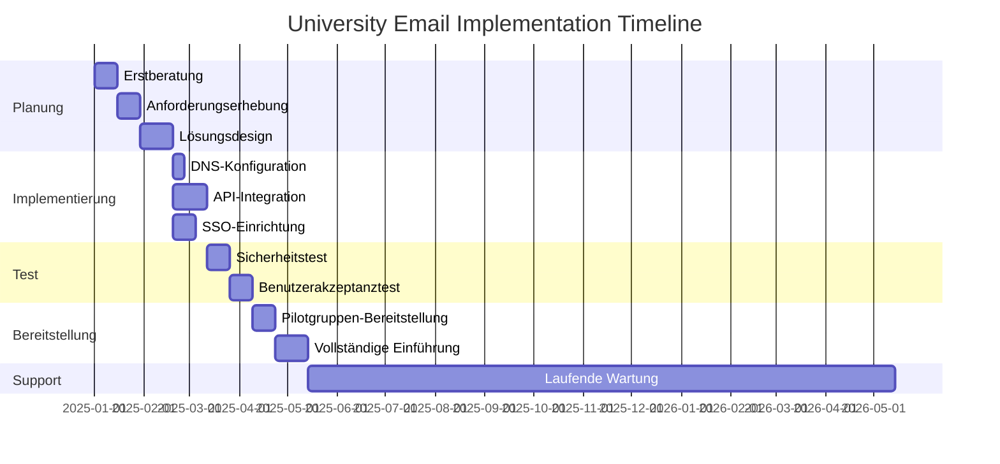
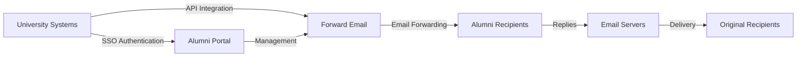

# Fallstudie: Wie Forward Email Alumni-E-Mail-Lösungen für Top-Universitäten ermöglicht {#case-study-how-forward-email-powers-alumni-email-solutions-for-top-universities}


## Inhaltsverzeichnis {#table-of-contents}

* [Vorwort](#foreword)
* [Dramatische Kosteneinsparungen bei stabilen Preisen](#dramatic-cost-savings-with-stable-pricing)
  * [Einsparungen an realen Universitäten](#real-world-university-savings)
* [Die Herausforderung bei Alumni-E-Mails an Universitäten](#the-university-alumni-email-challenge)
  * [Der Wert der Alumni-E-Mail-Identität](#the-value-of-alumni-email-identity)
  * [Traditionelle Lösungen reichen nicht aus](#traditional-solutions-fall-short)
  * [Die Forward Email Lösung](#the-forward-email-solution)
* [Technische Umsetzung: So funktioniert es](#technical-implementation-how-it-works)
  * [Kernarchitektur](#core-architecture)
  * [Integration mit Universitätssystemen](#integration-with-university-systems)
  * [API-gesteuertes Management](#api-driven-management)
  * [DNS-Konfiguration und Verifizierung](#dns-configuration-and-verification)
  * [Tests und Qualitätssicherung](#testing-and-quality-assurance)
* [Umsetzungszeitplan](#implementation-timeline)
* [Implementierungsprozess: Von der Migration bis zur Wartung](#implementation-process-from-migration-to-maintenance)
  * [Erstbewertung und Planung](#initial-assessment-and-planning)
  * [Migrationsstrategie](#migration-strategy)
  * [Technische Einrichtung und Konfiguration](#technical-setup-and-configuration)
  * [Benutzererfahrungsgestaltung](#user-experience-design)
  * [Schulung und Dokumentation](#training-and-documentation)
  * [Laufender Support und Optimierung](#ongoing-support-and-optimization)
* [Fallstudie: Universität Cambridge](#case-study-university-of-cambridge)
  * [Herausforderung](#challenge)
  * [Lösung](#solution)
  * [Ergebnisse](#results)
* [Vorteile für Universitäten und Alumni](#benefits-for-universities-and-alumni)
  * [Für Universitäten](#for-universities)
  * [Für Alumni](#for-alumni)
  * [Akzeptanzraten unter Alumni](#adoption-rates-among-alumni)
  * [Kosteneinsparungen im Vergleich zu früheren Lösungen](#cost-savings-compared-to-previous-solutions)
* [Sicherheits- und Datenschutzüberlegungen](#security-and-privacy-considerations)
  * [Datenschutzmaßnahmen](#data-protection-measures)
  * [Compliance-Rahmenwerk](#compliance-framework)
* [Zukünftige Entwicklungen](#future-developments)
* [Fazit](#conclusion)


## Vorwort {#foreword}

Wir haben den weltweit sichersten, privatesten und flexibelsten E-Mail-Weiterleitungsdienst für renommierte Universitäten und deren Alumni entwickelt.

Im wettbewerbsintensiven Umfeld der Hochschulbildung ist die lebenslange Verbindung zu Alumni nicht nur eine Frage der Tradition – es ist eine strategische Notwendigkeit. Eine der greifbarsten Möglichkeiten, wie Universitäten diese Verbindungen pflegen, sind Alumni-E-Mail-Adressen, die Absolventen eine digitale Identität verleihen, die ihr akademisches Erbe widerspiegelt.

Bei Forward Email arbeiten wir mit einigen der weltweit renommiertesten Bildungseinrichtungen zusammen, um die Verwaltung von Alumni-E-Mail-Diensten zu revolutionieren. Unsere E-Mail-Weiterleitungslösung in Unternehmensqualität betreibt nun die Alumni-E-Mail-Systeme der [University of Cambridge](https://en.wikipedia.org/wiki/University_of_Cambridge), der [University of Maryland](https://en.wikipedia.org/wiki/University_of_Maryland,_College_Park), der [Tufts University](https://en.wikipedia.org/wiki/Tufts_University) und des [Swarthmore College](https://en.wikipedia.org/wiki/Swarthmore_College) und bedient gemeinsam Tausende von Alumni weltweit.

Dieser Blogbeitrag zeigt, wie unser [Open-Source](https://en.wikipedia.org/wiki/Open-source_software), datenschutzorientierter E-Mail-Weiterleitungsdienst zur bevorzugten Lösung für diese Institutionen geworden ist, welche technischen Umsetzungen dies ermöglichen und welche transformative Wirkung dies sowohl auf die administrative Effizienz als auch auf die Zufriedenheit der Alumni hat.


## Dramatische Kosteneinsparungen bei stabilen Preisen {#dramatic-cost-savings-with-stable-pricing}
Die finanziellen Vorteile unserer Lösung sind erheblich, insbesondere im Vergleich zu den kontinuierlich steigenden Preisen traditioneller E-Mail-Anbieter:

| Lösung                        | Kosten pro Alumni (jährlich)                                                                              | Kosten für 100.000 Alumni | Kürzliche Preiserhöhungen                                                                                                                                                                |
| ----------------------------- | --------------------------------------------------------------------------------------------------------- | ------------------------- | ---------------------------------------------------------------------------------------------------------------------------------------------------------------------------------------- |
| Google Workspace for Business | 72 $                                                                                                     | 7.200.000 $               | • 2019: G Suite Basic von 5 $ auf 6 $/Monat (+20%)<br>• 2023: Flexible Pläne um 20 % erhöht<br>• 2025: Business Plus von 18 $ auf 26,40 $/Monat (+47 %) mit KI-Funktionen               |
| Google Workspace for Education| Kostenlos (Education Fundamentals)<br>3 $/Student/Jahr (Education Standard)<br>5 $/Student/Jahr (Education Plus) | Kostenlos - 500.000 $     | • Mengenrabatte: 5 % für 100-499 Lizenzen<br>• Mengenrabatte: 10 % für 500+ Lizenzen<br>• Kostenloses Angebot auf Kernservices beschränkt                                              |
| Microsoft 365 Business        | 60 $                                                                                                     | 6.000.000 $               | • 2023: Einführung halbjährlicher Preisanpassungen<br>• 2025 (Jan): Personal von 6,99 $ auf 9,99 $/Monat (+43 %) mit Copilot KI<br>• 2025 (Apr): 5 % Erhöhung bei jährlichen Zahlungen monatlich |
| Microsoft 365 Education       | Kostenlos (A1)<br>38-55 $/Mitarbeiter/Jahr (A3)<br>65-96 $/Mitarbeiter/Jahr (A5)                          | Kostenlos - 96.000 $      | • Studentenlizenzen oft bei Mitarbeiterkäufen enthalten<br>• Individuelle Preise durch Volumenlizenzen<br>• Kostenloses Angebot auf Webversionen beschränkt                             |
| Selbstgehosteter Exchange     | 45 $                                                                                                     | 4.500.000 $               | Laufende Wartungs- und Sicherheitskosten steigen weiterhin                                                                                                                               |
| **Forward Email Enterprise**  | **Fester Preis 250 $/Monat**                                                                             | **3.000 $/Jahr**          | **Keine Preiserhöhungen seit dem Start**                                                                                                                                                  |

### Einsparungen an realen Universitäten {#real-world-university-savings}

So viel sparen unsere Partneruniversitäten jährlich, indem sie Forward Email gegenüber traditionellen Anbietern wählen:

| Universität               | Anzahl Alumni | Jährliche Kosten mit Google | Jährliche Kosten mit Forward Email | Jährliche Einsparungen |
| ------------------------ | ------------- | --------------------------- | --------------------------------- | ---------------------- |
| University of Cambridge  | 30.000        | 90.000 $                    | 3.000 $                           | 87.000 $               |
| Swarthmore College       | 5.000         | 15.000 $                    | 3.000 $                           | 12.000 $               |
| Tufts University         | 12.000        | 36.000 $                    | 3.000 $                           | 33.000 $               |
| University of Maryland   | 25.000        | 75.000 $                    | 3.000 $                           | 72.000 $               |

> \[!NOTE]
> Forward Email Enterprise kostet typischerweise nur 250 $/Monat, ohne zusätzliche Kosten pro Nutzer, mit freigegebenen API-Rate-Limits, und die einzige zusätzliche Gebühr entsteht durch Speicher, falls Sie zusätzlichen GB/TB für Studierende benötigen (+3 $ pro 10 GB zusätzlicher Speicher). Wir verwenden NVMe-SSD-Laufwerke für schnelle Unterstützung von IMAP/POP3/SMTP/CalDAV/CardDAV.
> \[!IMPORTANT]
> Im Gegensatz zu Google und Microsoft, die ihre Preise wiederholt erhöht haben, während sie KI-Funktionen integrierten, die Ihre Daten analysieren, hält Forward Email stabile Preise mit einem strikten Datenschutzfokus aufrecht. Wir verwenden keine KI, verfolgen keine Nutzungsmuster und speichern keine Protokolle oder E-Mails auf der Festplatte (alle Verarbeitung erfolgt im Arbeitsspeicher), was vollständige Privatsphäre für Ihre Alumni-Kommunikation gewährleistet.

Dies stellt eine erhebliche Kostenreduzierung im Vergleich zu traditionellen E-Mail-Hosting-Lösungen dar – Mittel, die Universitäten für Stipendien, Forschung oder andere missionskritische Aktivitäten umleiten können. Laut einer Analyse von Email Vendor Selection aus dem Jahr 2023 suchen Bildungseinrichtungen zunehmend kosteneffiziente Alternativen zu traditionellen E-Mail-Anbietern, da die Preise mit der Integration von KI-Funktionen weiter steigen ([Email Vendor Selection, 2023](https://www.emailvendorselection.com/email-service-provider-list/)).


## Die Herausforderung der Alumni-E-Mail an Universitäten {#the-university-alumni-email-challenge}

Für Universitäten stellt die Bereitstellung von lebenslangen E-Mail-Adressen für Alumni eine einzigartige Reihe von Herausforderungen dar, die traditionelle E-Mail-Lösungen nur schwer effektiv bewältigen können. Wie in einer umfassenden Diskussion auf ServerFault festgestellt wurde, benötigen Universitäten mit großen Nutzerzahlen spezialisierte E-Mail-Lösungen, die Leistung, Sicherheit und Kosteneffizienz ausbalancieren ([ServerFault, 2009](https://serverfault.com/questions/97364/what-is-the-best-mail-server-for-a-university-with-a-large-amount-of-users)).

### Der Wert der Alumni-E-Mail-Identität {#the-value-of-alumni-email-identity}

Alumni-E-Mail-Adressen (wie `firstname.lastname@cl.cam.ac.uk` oder `username@terpalum.umd.edu`) erfüllen mehrere wichtige Funktionen:

* Aufrechterhaltung der institutionellen Verbindung und Markenidentität
* Ermöglichung der fortlaufenden Kommunikation mit der Universität
* Steigerung der beruflichen Glaubwürdigkeit der Absolventen
* Unterstützung des Alumni-Netzwerks und der Gemeinschaftsbildung
* Bereitstellung eines stabilen, lebenslangen Kontaktpunkts

Forschungen von Tekade (2020) heben hervor, dass Bildungsemail-Adressen zahlreiche Vorteile für Alumni bieten, darunter Zugang zu akademischen Ressourcen, berufliche Glaubwürdigkeit und exklusive Rabatte auf verschiedene Dienstleistungen ([Medium, 2020](https://medium.com/coders-capsule/top-20-benefits-of-having-an-educational-email-address-91a09795e05)).

> \[!TIP]
> Besuchen Sie unser neues Verzeichnis [AlumniEmail.com](https://alumniemail.com) für eine umfassende Ressource zu Alumni-E-Mail-Diensten von Universitäten, einschließlich Einrichtungsanleitungen, Best Practices und einem durchsuchbaren Verzeichnis von Alumni-E-Mail-Domains. Es dient als zentrale Anlaufstelle für alle Alumni-E-Mail-Informationen.

### Traditionelle Lösungen reichen nicht aus {#traditional-solutions-fall-short}

Konventionelle E-Mail-Systeme weisen mehrere Einschränkungen auf, wenn sie auf Alumni-E-Mail-Bedürfnisse angewendet werden:

* **Kostenintensiv**: Lizenzmodelle pro Nutzer werden für große Alumni-Basen finanziell untragbar
* **Verwaltungsaufwand**: Die Verwaltung von Tausenden oder Millionen von Konten erfordert erhebliche IT-Ressourcen
* **Sicherheitsbedenken**: Die Aufrechterhaltung der Sicherheit für inaktive Konten erhöht die Verwundbarkeit
* **Begrenzte Flexibilität**: Starre Systeme können sich nicht an die einzigartigen Bedürfnisse der Alumni-E-Mail-Weiterleitung anpassen
* **Datenschutzprobleme**: Viele Anbieter scannen E-Mail-Inhalte zu Werbezwecken

Eine Quora-Diskussion zur Wartung von Universitäts-E-Mails zeigt, dass Sicherheitsbedenken ein Hauptgrund dafür sind, dass Universitäten Alumni-E-Mail-Adressen einschränken oder einstellen könnten, da ungenutzte Konten anfällig für Hacking und Identitätsdiebstahl sind ([Quora, 2011](https://www.quora.com/Is-there-any-cost-for-a-college-or-university-to-maintain-edu-e-mail-addresses)).

### Die Forward Email Lösung {#the-forward-email-solution}

Unser Ansatz begegnet diesen Herausforderungen durch ein grundlegend anderes Modell:

* E-Mail-Weiterleitung statt Hosting
* Pauschalpreis statt Kosten pro Nutzer
* Open-Source-Architektur für Transparenz und Sicherheit
* Datenschutzorientiertes Design ohne Inhalts-Scanning
* Spezialisierte Funktionen für das Identitätsmanagement von Universitäten


## Technische Umsetzung: So funktioniert es {#technical-implementation-how-it-works}
Unsere Lösung nutzt eine ausgeklügelte, dabei elegant einfache technische Architektur, um zuverlässiges, sicheres E-Mail-Forwarding in großem Maßstab zu gewährleisten.

### Kernarchitektur {#core-architecture}

Das Forward Email System besteht aus mehreren Schlüsselkomponenten:

* Verteilte MX-Server für hohe Verfügbarkeit
* Echtzeit-Weiterleitung ohne Nachrichtenspeicherung
* Umfassende E-Mail-Authentifizierung
* Unterstützung für benutzerdefinierte Domains und Subdomains
* API-gesteuerte Kontoverwaltung

Laut IT-Experten auf ServerFault wird für Universitäten, die eigene E-Mail-Lösungen implementieren möchten, Postfix als bester Mail Transfer Agent (MTA) empfohlen, während Courier oder Dovecot für IMAP/POP3-Zugriff bevorzugt werden ([ServerFault, 2009](https://serverfault.com/questions/97364/what-is-the-best-mail-server-for-a-university-with-a-large-amount-of-users)). Unsere Lösung eliminiert jedoch die Notwendigkeit für Universitäten, diese komplexen Systeme selbst zu verwalten.

### Integration mit Universitätssystemen {#integration-with-university-systems}

Wir haben nahtlose Integrationswege mit bestehender Universitätsinfrastruktur entwickelt:

* Automatisierte Bereitstellung durch [RESTful API](https://forwardemail.net/email-api) Integration
* Anpassbare Branding-Optionen für Universitätsportale
* Flexible Alias-Verwaltung für Fachbereiche und Organisationen
* Batch-Operationen für effiziente Administration

### API-gesteuerte Verwaltung {#api-driven-management}

Unsere [RESTful API](https://forwardemail.net/email-api) ermöglicht es Universitäten, die E-Mail-Verwaltung zu automatisieren:

```javascript
// Beispiel: Erstellen einer neuen Alumni-E-Mail-Adresse
const response = await fetch('https://forwardemail.net/api/v1/domains/example.edu/aliases', {
  method: 'POST',
  headers: {
    'Content-Type': 'application/json',
    'Authorization': `Basic ${Buffer.from(YOUR_API_TOKEN + ":").toString('base64')}`
  },
  body: JSON.stringify({
    name: 'alumni.john.smith',
    recipients: ['johnsmith@gmail.com'],
    has_recipient_verification: true
  })
});
```

### DNS-Konfiguration und Verifizierung {#dns-configuration-and-verification}

Eine korrekte DNS-Konfiguration ist entscheidend für die E-Mail-Zustellung. Unser Team unterstützt bei:

* [DNS](https://de.wikipedia.org/wiki/Domain_Name_System)-Konfiguration einschließlich MX-Einträgen
* Umfassender Implementierung von E-Mail-Sicherheit mit unserem Open-Source-[mailauth](https://www.npmjs.com/package/mailauth)-Paket, einem Schweizer Taschenmesser für E-Mail-Authentifizierung, das folgende Funktionen abdeckt:
  * [SPF](https://de.wikipedia.org/wiki/Sender_Policy_Framework) (Sender Policy Framework) zur Verhinderung von E-Mail-Spoofing
  * [DKIM](https://de.wikipedia.org/wiki/DomainKeys_Identified_Mail) (DomainKeys Identified Mail) für E-Mail-Authentifizierung
  * [DMARC](https://de.wikipedia.org/wiki/E-Mail-Authentifizierung) (Domain-based Message Authentication, Reporting & Conformance) zur Richtliniendurchsetzung
  * [MTA-STS](https://de.wikipedia.org/wiki/Opportunistic_TLS) (SMTP MTA Strict Transport Security) zur Durchsetzung von TLS-Verschlüsselung
  * [ARC](https://de.wikipedia.org/wiki/DomainKeys_Identified_Mail#Authenticated_Received_Chain) (Authenticated Received Chain) zur Aufrechterhaltung der Authentifizierung bei Weiterleitungen
  * [SRS](https://de.wikipedia.org/wiki/Sender_Rewriting_Scheme) (Sender Rewriting Scheme) zur Erhaltung der SPF-Validierung bei Weiterleitungen
  * [BIMI](https://de.wikipedia.org/wiki/E-Mail-Authentifizierung) (Brand Indicators for Message Identification) zur Anzeige von Logos in unterstützenden E-Mail-Clients
* DNS-TXT-Eintrag-Verifizierung zum Nachweis der Domain-Inhaberschaft

Das `mailauth`-Paket (<http://npmjs.com/package/mailauth>) ist die vollständig Open-Source-Lösung, die alle Aspekte der E-Mail-Authentifizierung in einer integrierten Bibliothek abdeckt. Im Gegensatz zu proprietären Lösungen gewährleistet dieser Ansatz Transparenz, regelmäßige Sicherheitsupdates und vollständige Kontrolle über den E-Mail-Authentifizierungsprozess.

### Testen und Qualitätssicherung {#testing-and-quality-assurance}

Vor der vollständigen Einführung führen wir rigorose Tests durch:

* End-to-End-E-Mail-Zustellungstests
* Lasttests für Szenarien mit hohem Volumen
* Sicherheitspenetrationstests
* API-Integrationsvalidierung
* Benutzerakzeptanztests mit Alumni-Vertretern
## Implementierungszeitplan {#implementation-timeline}


```mermaid
gantt
    title University Email Implementation Timeline
    dateFormat  YYYY-MM-DD
    section Planung
    Erstberatung                 :a1, 2025-01-01, 14d
    Anforderungserhebung         :a2, after a1, 14d
    Lösungsdesign                :a3, after a2, 21d
    section Implementierung
    DNS-Konfiguration            :b1, after a3, 7d
    API-Integration              :b2, after a3, 21d
    SSO-Einrichtung              :b3, after a3, 14d
    section Test
    Sicherheitstest              :c1, after b1 b2 b3, 14d
    Benutzerakzeptanztest        :c2, after c1, 14d
    section Bereitstellung
    Pilotgruppen-Bereitstellung  :d1, after c2, 14d
    Vollständige Einführung      :d2, after d1, 21d
    section Support
    Laufende Wartung             :e1, after d2, 365d
```


## Implementierungsprozess: Von der Migration bis zur Wartung {#implementation-process-from-migration-to-maintenance}

Unser strukturierter Implementierungsprozess gewährleistet einen reibungslosen Übergang für Universitäten, die unsere Lösung übernehmen.

### Erste Bewertung und Planung {#initial-assessment-and-planning}

Wir beginnen mit einer umfassenden Bewertung des aktuellen E-Mail-Systems der Universität, der Alumni-Datenbank und der technischen Anforderungen. Diese Phase umfasst:

* Interviews mit Stakeholdern aus IT, Alumni-Beziehungen und Verwaltung
* Technisches Audit der bestehenden E-Mail-Infrastruktur
* Datenzuordnung für Alumni-Datensätze
* Sicherheits- und Compliance-Überprüfung
* Entwicklung des Projektzeitplans und der Meilensteine

### Migrationsstrategie {#migration-strategy}

Basierend auf der Bewertung entwickeln wir eine maßgeschneiderte Migrationsstrategie, die Störungen minimiert und gleichzeitig vollständige Datenintegrität gewährleistet:

* Phasenweise Migration nach Alumni-Kohorten
* Paralleler Betrieb der Systeme während der Übergangszeit
* Umfassende Datenvalidierungsprotokolle
* Rückfallverfahren für eventuelle Migrationsprobleme
* Klare Kommunikationsplanung für alle Beteiligten

### Technische Einrichtung und Konfiguration {#technical-setup-and-configuration}

Unser technisches Team übernimmt alle Aspekte der Systemeinrichtung:

* DNS-Konfiguration und -Überprüfung
* API-Integration mit den Systemen der Universität
* Entwicklung eines benutzerdefinierten Portals mit Universitätsbranding
* Einrichtung der E-Mail-Authentifizierung (SPF, DKIM, DMARC)

### Benutzererfahrung Design {#user-experience-design}

Wir arbeiten eng mit den Universitäten zusammen, um intuitive Schnittstellen für Administratoren und Alumni zu schaffen:

* Alumni-E-Mail-Portale mit individuellem Branding
* Vereinfachte Verwaltung der E-Mail-Weiterleitung
* Mobil-responsive Designs
* Barrierefreiheit-Konformität
* Mehrsprachige Unterstützung, wo erforderlich

### Schulung und Dokumentation {#training-and-documentation}

Umfassende Schulungen stellen sicher, dass alle Beteiligten das System effektiv nutzen können:

* Schulungen für Administratoren
* Technische Dokumentation für IT-Mitarbeiter
* Benutzerhandbücher für Alumni
* Video-Tutorials für häufige Aufgaben
* Entwicklung einer Wissensdatenbank

### Laufender Support und Optimierung {#ongoing-support-and-optimization}

Unsere Partnerschaft geht weit über die Implementierung hinaus:

* 24/7 technischer Support
* Regelmäßige Systemupdates und Sicherheitspatches
* Leistungsüberwachung und Optimierung
* Beratung zu Best Practices im E-Mail-Bereich
* Datenanalyse und Reporting


## Fallstudie: Universität Cambridge {#case-study-university-of-cambridge}

Die Universität Cambridge suchte nach einer Lösung, um Alumni @cam.ac.uk-E-Mail-Adressen bereitzustellen und gleichzeitig den IT-Aufwand und die Kosten zu reduzieren.

### Herausforderung {#challenge}

Cambridge stand vor mehreren Herausforderungen mit ihrem bisherigen Alumni-E-Mail-System:

* Hohe Betriebskosten für die Wartung einer separaten E-Mail-Infrastruktur
* Verwaltungsaufwand bei der Verwaltung von Tausenden von Konten
* Sicherheitsbedenken bei inaktiven Konten
* Eingeschränkte Integration mit Alumni-Datenbanksystemen
* Steigende Speicheranforderungen

### Lösung {#solution}

Forward Email implementierte eine umfassende Lösung:

* E-Mail-Weiterleitung für alle @cam.ac.uk Alumni-Adressen
* Individuell gebrandetes Portal für den Alumni-Self-Service
* API-Integration mit der Alumni-Datenbank von Cambridge
* Umfassende Implementierung der E-Mail-Sicherheit

### Ergebnisse {#results}

Die Implementierung brachte bedeutende Vorteile:
* Erhebliche Kosteneinsparungen im Vergleich zur vorherigen Lösung
* 99,9 % Zuverlässigkeit bei der E-Mail-Zustellung
* Vereinfachte Verwaltung durch Automatisierung
* Verbesserte Sicherheit durch moderne E-Mail-Authentifizierung
* Positives Feedback von Alumni zur Benutzerfreundlichkeit des Systems


## Vorteile für Universitäten und Alumni {#benefits-for-universities-and-alumni}

Unsere Lösung bietet greifbare Vorteile sowohl für Institutionen als auch für deren Absolventen.

### Für Universitäten {#for-universities}

* **Kosteneffizienz**: Festpreise unabhängig von der Anzahl der Alumni
* **Administrative Einfachheit**: Automatisierte Verwaltung über API
* **Erhöhte Sicherheit**: Umfassende E-Mail-Authentifizierung
* **Markenkonsistenz**: Lebenslange institutionelle E-Mail-Adressen
* **Alumni-Engagement**: Gestärkte Verbindungen durch fortlaufenden Service

Laut BulkSignature (2023) bieten E-Mail-Plattformen für Bildungseinrichtungen bedeutende Vorteile, darunter Kosteneffizienz durch kostenlose oder kostengünstige Pläne, Zeitersparnis durch Massenkommunikationsmöglichkeiten und Tracking-Funktionen zur Überwachung der E-Mail-Zustellung und -Interaktion ([BulkSignature, 2023](https://bulksignature.com/blog/5-best-email-platforms-for-educational-institutions/)).

### Für Alumni {#for-alumni}

* **Professionelle Identität**: Prestigeträchtige Universitäts-E-Mail-Adresse
* **E-Mail-Kontinuität**: Weiterleitung an jede persönliche E-Mail
* **Datenschutz**: Kein Scannen von Inhalten oder Datenanalyse
* **Vereinfachte Verwaltung**: Einfache Aktualisierung der Empfänger
* **Erhöhte Sicherheit**: Moderne E-Mail-Authentifizierung

Forschungen des International Journal of Education & Literacy Studies heben die Bedeutung einer korrekten E-Mail-Kommunikation im akademischen Umfeld hervor und betonen, dass E-Mail-Kompetenz eine entscheidende Fähigkeit für Studierende und Alumni in professionellen Kontexten ist ([IJELS, 2021](https://files.eric.ed.gov/fulltext/EJ1319324.pdf)).

### Akzeptanzraten unter Alumni {#adoption-rates-among-alumni}

Universitäten berichten von hohen Akzeptanz- und Zufriedenheitsraten innerhalb ihrer Alumni-Gemeinschaften.

### Kosteneinsparungen im Vergleich zu vorherigen Lösungen {#cost-savings-compared-to-previous-solutions}

Die finanziellen Auswirkungen sind erheblich, da Universitäten signifikante Kosteneinsparungen im Vergleich zu ihren vorherigen E-Mail-Lösungen melden.


## Sicherheits- und Datenschutzaspekte {#security-and-privacy-considerations}

Für Bildungseinrichtungen ist der Schutz von Alumni-Daten nicht nur gute Praxis – oft ist es eine gesetzliche Verpflichtung gemäß Vorschriften wie der DSGVO in Europa.

### Datenschutzmaßnahmen {#data-protection-measures}

Unsere Lösung integriert mehrere Sicherheitsebenen:

* Ende-zu-Ende-Verschlüsselung für den gesamten E-Mail-Verkehr
* Keine Speicherung von E-Mail-Inhalten auf unseren Servern
* Regelmäßige Sicherheitsprüfungen und Penetrationstests
* Einhaltung internationaler Datenschutzstandards
* Transparenter, Open-Source-Code zur Sicherheitsüberprüfung

> \[!WARNING]
> Viele E-Mail-Anbieter scannen E-Mail-Inhalte zu Werbezwecken oder zum Training von KI-Modellen. Diese Praxis wirft ernsthafte Datenschutzbedenken auf, insbesondere bei professioneller und akademischer Kommunikation. Forward Email scannt niemals E-Mail-Inhalte und verarbeitet alle E-Mails ausschließlich im Arbeitsspeicher, um vollständige Privatsphäre zu gewährleisten.

### Compliance-Rahmenwerk {#compliance-framework}

Wir gewährleisten strikte Einhaltung relevanter Vorschriften:

* DSGVO-Konformität für europäische Institutionen
* SOC 2 Typ II Zertifizierung
* Jährliche Sicherheitsbewertungen
* Datenverarbeitungsvertrag (DPA) verfügbar unter [forwardemail.net/dpa](https://forwardemail.net/dpa)
* Regelmäßige Compliance-Updates bei sich ändernden Vorschriften


## Zukünftige Entwicklungen {#future-developments}

Wir erweitern unsere Alumni-E-Mail-Lösung kontinuierlich um neue Funktionen und Möglichkeiten:

* Verbesserte Analysen für Universitätsadministratoren
* Erweiterter Schutz vor Phishing
* Ausgebaute API-Funktionalitäten für tiefere Integration
* Zusätzliche Authentifizierungsoptionen


## Fazit {#conclusion}

Forward Email hat die Art und Weise revolutioniert, wie Universitäten Alumni-E-Mail-Dienste bereitstellen und verwalten. Durch die Ablösung kostspieliger, komplexer E-Mail-Hosting-Lösungen durch elegante, sichere E-Mail-Weiterleitung ermöglichen wir Institutionen, allen Alumni lebenslange E-Mail-Adressen anzubieten und gleichzeitig Kosten und Verwaltungsaufwand drastisch zu reduzieren.
Unsere Partnerschaften mit renommierten Institutionen wie Cambridge, Maryland, Tufts und Swarthmore zeigen die Wirksamkeit unseres Ansatzes in verschiedenen Bildungseinrichtungen. Da Universitäten zunehmend unter Druck stehen, Alumni-Verbindungen aufrechtzuerhalten und gleichzeitig die Kosten zu kontrollieren, bietet unsere Lösung eine überzeugende Alternative zu traditionellen E-Mail-Systemen.


```mermaid
flowchart LR
    A[University Systems] -->|API Integration| B[Forward Email]
    B -->|Email Forwarding| C[Alumni Recipients]
    C -->|Replies| D[Email Servers]
    D -->|Delivery| E[Original Recipients]
    F[Alumni Portal] -->|Management| B
    A -->|SSO Authentication| F
```

Für Universitäten, die daran interessiert sind, wie Forward Email ihre Alumni-E-Mail-Dienste transformieren kann, kontaktieren Sie unser Team unter <support@forwardemail.net> oder besuchen Sie [forwardemail.net](https://forwardemail.net), um mehr über unsere Enterprise-Lösungen zu erfahren.
