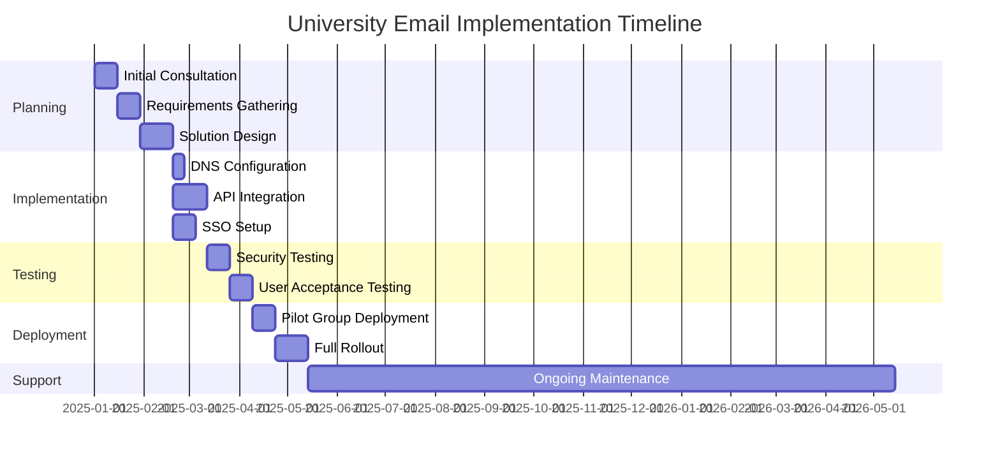
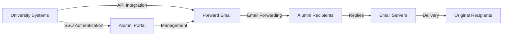

# Caso práctico: Cómo el reenvío de correo electrónico impulsa las soluciones de correo electrónico para exalumnos de las mejores universidades {#case-study-how-forward-email-powers-alumni-email-solutions-for-top-universities}


## Tabla de contenido {#table-of-contents}

* [Prefacio](#foreword)
* [Ahorros de costes drásticos con precios estables](#dramatic-cost-savings-with-stable-pricing)
  * [Ahorros universitarios en el mundo real](#real-world-university-savings)
* [El desafío del correo electrónico de exalumnos universitarios](#the-university-alumni-email-challenge)
  * [El valor de la identidad de correo electrónico de los exalumnos](#the-value-of-alumni-email-identity)
  * [Las soluciones tradicionales se quedan cortas](#traditional-solutions-fall-short)
  * [La solución de reenvío de correo electrónico](#the-forward-email-solution)
* [Implementación técnica: cómo funciona](#technical-implementation-how-it-works)
  * [Arquitectura central](#core-architecture)
  * [Integración con los sistemas universitarios](#integration-with-university-systems)
  * [Gestión basada en API](#api-driven-management)
  * [Configuración y verificación de DNS](#dns-configuration-and-verification)
  * [Pruebas y garantía de calidad](#testing-and-quality-assurance)
* [Cronograma de implementación](#implementation-timeline)
* [Proceso de implementación: de la migración al mantenimiento](#implementation-process-from-migration-to-maintenance)
  * [Evaluación inicial y planificación](#initial-assessment-and-planning)
  * [Estrategia de migración](#migration-strategy)
  * [Configuración y configuración técnica](#technical-setup-and-configuration)
  * [Diseño de experiencia de usuario](#user-experience-design)
  * [Capacitación y documentación](#training-and-documentation)
  * [Soporte y optimización continuos](#ongoing-support-and-optimization)
* [Estudio de caso: Universidad de Cambridge](#case-study-university-of-cambridge)
  * [Desafío](#challenge)
  * [Solución](#solution)
  * [Resultados](#results)
* [Beneficios para Universidades y Exalumnos](#benefits-for-universities-and-alumni)
  * [Para universidades](#for-universities)
  * [Para exalumnos](#for-alumni)
  * [Tasas de adopción entre los exalumnos](#adoption-rates-among-alumni)
  * [Ahorro de costes en comparación con soluciones anteriores](#cost-savings-compared-to-previous-solutions)
* [Consideraciones de seguridad y privacidad](#security-and-privacy-considerations)
  * [Medidas de protección de datos](#data-protection-measures)
  * [Marco de cumplimiento](#compliance-framework)
* [Desarrollos futuros](#future-developments)
* [Conclusión](#conclusion)

## Prólogo {#foreword}

Hemos creado el servicio de reenvío de correo electrónico más seguro, privado y flexible del mundo para universidades prestigiosas y sus ex alumnos.

En el competitivo panorama de la educación superior, mantener vínculos permanentes con los exalumnos no es solo una cuestión de tradición, sino un imperativo estratégico. Una de las maneras más tangibles en que las universidades fomentan estos vínculos es a través de las direcciones de correo electrónico de exalumnos, que proporcionan a los graduados una identidad digital que refleja su trayectoria académica.

En Forward Email, nos hemos asociado con algunas de las instituciones educativas más prestigiosas del mundo para revolucionar la gestión de los servicios de correo electrónico para exalumnos. Nuestra solución de reenvío de correo electrónico de nivel empresarial ahora impulsa los sistemas de correo electrónico para exalumnos de [Universidad de Cambridge](https://en.wikipedia.org/wiki/University_of_Cambridge), [Universidad de Maryland](https://en.wikipedia.org/wiki/University_of_Maryland,\_College_Park), [Universidad Tufts](https://en.wikipedia.org/wiki/Tufts_University) y [Colegio Swarthmore](https://en.wikipedia.org/wiki/Swarthmore_College), que en conjunto prestan servicio a miles de exalumnos de todo el mundo.

Esta entrada de blog explora cómo nuestro servicio de reenvío de correo electrónico centrado en la privacidad [código abierto](https://en.wikipedia.org/wiki/Open-source_software) se ha convertido en la solución preferida de estas instituciones, las implementaciones técnicas que lo hacen posible y el impacto transformador que ha tenido tanto en la eficiencia administrativa como en la satisfacción de los exalumnos.

## Ahorros de costos drásticos con precios estables {#dramatic-cost-savings-with-stable-pricing}

Los beneficios financieros de nuestra solución son sustanciales, especialmente cuando se comparan con los precios en constante aumento de los proveedores de correo electrónico tradicionales:

| Solución | Costo por exalumno (anual) | Costo para 100.000 exalumnos | Aumentos recientes de precios |
| ------------------------------ | --------------------------------------------------------------------------------------------------------- | ----------------------- | ---------------------------------------------------------------------------------------------------------------------------------------------------------------------------------------- |
| Google Workspace para empresas | $72 | $7,200,000 | • 2019: G Suite Basic de $5 a $6/mes (+20%)<br>• 2023: Planes flexibles con aumento del 20%<br>• 2025: Business Plus de $18 a $26,40/mes (+47%) con funciones de IA |
| Google Workspace para la educación | Gratuito (Fundamentos Educativos)<br>$3/estudiante/año (Educación Estándar)<br>$5/estudiante/año (Educación Plus) | Gratis - $500,000 | • Descuentos por volumen: 5 % para 100 a 499 licencias<br>• Descuentos por volumen: 10 % para 500 o más licencias<br>• Nivel gratuito limitado a los servicios principales |
| Microsoft 365 Empresa | $60 | $6,000,000 | • 2023: Se introdujeron actualizaciones de precios semestrales<br>• 2025 (enero): Personal de $6,99 a $9,99/mes (+43 %) con Copilot AI<br>• 2025 (abril): Aumento del 5 % en los compromisos anuales pagados mensualmente |
| Microsoft 365 Educación | Gratuito (A1)<br>$38-55/facultad/año (A3)<br>$65-96/facultad/año (A5) | Gratis - $96,000 | • Las licencias para estudiantes suelen incluirse en las compras para profesores<br>• Precios personalizados mediante licencias por volumen<br>• Nivel gratuito limitado a versiones web |
| Exchange autoalojado | $45 | $4,500,000 | Los costos de mantenimiento y seguridad continúan aumentando |
| **Reenvío de correo electrónico empresarial** | **Fijo $250/mes** | **$3,000/año** | **Sin aumentos de precios desde el lanzamiento** |

### Ahorros universitarios del mundo real {#real-world-university-savings}

Esto es lo que ahorran anualmente nuestras universidades asociadas al elegir Forward Email en lugar de los proveedores tradicionales:

| Universidad | Recuento de exalumnos | Costo anual con Google | Costo anual con reenvío de correo electrónico | Ahorro anual |
| ----------------------- | ------------ | ----------------------- | ------------------------------ | -------------- |
| Universidad de Cambridge | 30,000 | $90,000 | $3,000 | $87,000 |
| Colegio Swarthmore | 5,000 | $15,000 | $3,000 | $12,000 |
| Universidad Tufts | 12,000 | $36,000 | $3,000 | $33,000 |
| Universidad de Maryland | 25,000 | $75,000 | $3,000 | $72,000 |

> \[!NOTE]
> El reenvío de correo electrónico empresarial suele costar solo $250 al mes, sin costo adicional por usuario, con limitaciones de velocidad de API permitidas y el único costo adicional es el almacenamiento si necesita GB/TB adicionales para estudiantes (+$3 por cada 10 GB de almacenamiento adicional). También utilizamos unidades SSD NVMe para una rápida compatibilidad con IMAP/POP3/SMTP/CalDAV/CardDAV.

> \[!IMPORTANT]
> A diferencia de Google y Microsoft, que han aumentado repetidamente sus precios al integrar funciones de IA que analizan tus datos, Forward Email mantiene precios estables con un estricto enfoque en la privacidad. No utilizamos IA, no rastreamos patrones de uso ni almacenamos registros ni correos electrónicos en disco (todo el procesamiento se realiza en memoria), lo que garantiza la total privacidad de tus comunicaciones con exalumnos.

Esto representa una reducción significativa de costos en comparación con las soluciones tradicionales de alojamiento de correo electrónico: fondos que las universidades pueden redirigir a becas, investigación u otras actividades esenciales. Según un análisis de 2023 de Email Vendor Selection, las instituciones educativas buscan cada vez más alternativas rentables a los proveedores de correo electrónico tradicionales, ya que los precios siguen aumentando con la integración de funciones de IA ([Selección de proveedores de correo electrónico, 2023](https://www.emailvendorselection.com/email-service-provider-list/)).

## El desafío del correo electrónico de exalumnos de la Universidad {#the-university-alumni-email-challenge}

Para las universidades, proporcionar direcciones de correo electrónico vitalicias a exalumnos presenta un conjunto único de desafíos que las soluciones de correo electrónico tradicionales tienen dificultades para abordar eficazmente. Como se señaló en un debate exhaustivo sobre ServerFault, las universidades con una gran base de usuarios requieren soluciones de correo electrónico especializadas que equilibren rendimiento, seguridad y rentabilidad ([Fallo del servidor, 2009](https://serverfault.com/questions/97364/what-is-the-best-mail-server-for-a-university-with-a-large-amount-of-users)).

### El valor de la identidad del correo electrónico de exalumnos {#the-value-of-alumni-email-identity}

Las direcciones de correo electrónico de exalumnos (como `firstname.lastname@cl.cam.ac.uk` o `username@terpalum.umd.edu`) cumplen múltiples funciones importantes:

* Mantener la conexión institucional y la identidad de marca
* Facilitar la comunicación continua con la universidad
* Mejorar la credibilidad profesional de los graduados
* Apoyar la creación de redes de exalumnos y la construcción de una comunidad
* Proporcionar un punto de contacto estable y permanente

Una investigación de Tekade (2020) destaca que las direcciones de correo electrónico educativas brindan numerosos beneficios a los exalumnos, incluido el acceso a recursos académicos, credibilidad profesional y descuentos exclusivos en diversos servicios ([Medium, 2020](https://medium.com/coders-capsule/top-20-benefits-of-having-an-educational-email-address-91a09795e05)).

> \[!TIP]
> Visite nuestro nuevo directorio [AlumniEmail.com](https://alumniemail.com) para obtener un recurso completo sobre los servicios de correo electrónico para exalumnos universitarios, incluyendo guías de configuración, mejores prácticas y un directorio con función de búsqueda de dominios de correo electrónico para exalumnos. Sirve como un centro central para toda la información sobre correo electrónico de exalumnos.

### Las soluciones tradicionales se quedan cortas {#traditional-solutions-fall-short}

Los sistemas de correo electrónico convencionales presentan varias limitaciones cuando se aplican a las necesidades de correo electrónico de los exalumnos:

**Costo prohibitivo**: Los modelos de licencias por usuario se vuelven financieramente insostenibles para grandes bases de exalumnos.
* **Carga administrativa**: Gestionar miles o millones de cuentas requiere importantes recursos de TI.
* **Problemas de seguridad**: Mantener la seguridad de las cuentas inactivas aumenta la vulnerabilidad.
* **Flexibilidad limitada**: Los sistemas rígidos no se adaptan a las necesidades únicas del reenvío de correo electrónico de exalumnos.
* **Problemas de privacidad**: Muchos proveedores escanean el contenido del correo electrónico con fines publicitarios.

Una discusión en Quora sobre el mantenimiento del correo electrónico universitario revela que las preocupaciones de seguridad son una de las principales razones por las que las universidades podrían limitar o cancelar las direcciones de correo electrónico de los ex alumnos, ya que las cuentas no utilizadas pueden ser vulnerables a la piratería y al robo de identidad ([Quora, 2011](https://www.quora.com/Is-there-any-cost-for-a-college-or-university-to-maintain-edu-e-mail-addresses)).

### La solución de reenvío de correo electrónico {#the-forward-email-solution}

Nuestro enfoque aborda estos desafíos a través de un modelo fundamentalmente diferente:

* Reenvío de correo electrónico en lugar de alojamiento
* Tarifa fija en lugar de costos por usuario
* Arquitectura de código abierto para mayor transparencia y seguridad
* Diseño que prioriza la privacidad sin escaneo de contenido
* Funciones especializadas para la gestión de identidad universitaria

## Implementación técnica: cómo funciona {#technical-implementation-how-it-works}

Nuestra solución aprovecha una arquitectura técnica sofisticada pero elegantemente simple para brindar un reenvío de correo electrónico confiable y seguro a escala.

### Arquitectura principal {#core-architecture}

El sistema de reenvío de correo electrónico consta de varios componentes clave:

* Servidores MX distribuidos para alta disponibilidad
* Reenvío de mensajes en tiempo real sin almacenamiento
* Autenticación integral de correo electrónico
* Compatibilidad con dominios y subdominios personalizados
* Gestión de cuentas basada en API

Según los profesionales de TI de ServerFault, para las universidades que buscan implementar sus propias soluciones de correo electrónico, Postfix se recomienda como el mejor Agente de Transferencia de Correo (MTA), mientras que Courier o Dovecot son los preferidos para el acceso IMAP/POP3 ([Fallo del servidor, 2009](https://serverfault.com/questions/97364/what-is-the-best-mail-server-for-a-university-with-a-large-amount-of-users)). Sin embargo, nuestra solución elimina la necesidad de que las universidades gestionen estos complejos sistemas por sí mismas.

### Integración con los sistemas universitarios {#integration-with-university-systems}

Hemos desarrollado vías de integración perfecta con la infraestructura universitaria existente:

* Aprovisionamiento automatizado mediante la integración con [API RESTful](https://forwardemail.net/email-api)
* Opciones de personalización de marca para portales universitarios
* Gestión flexible de alias para departamentos y organizaciones
* Operaciones por lotes para una administración eficiente

### Gestión basada en API {#api-driven-management}

Nuestro [API RESTful](https://forwardemail.net/email-api) permite a las universidades automatizar la gestión del correo electrónico:

```javascript
// Example: Creating a new alumni email address
const response = await fetch('https://forwardemail.net/api/v1/domains/example.edu/aliases', {
  method: 'POST',
  headers: {
    'Content-Type': 'application/json',
    'Authorization': `Basic ${Buffer.from(YOUR_API_TOKEN + ":").toString('base64')}`
  },
  body: JSON.stringify({
    name: 'alumni.john.smith',
    recipients: ['johnsmith@gmail.com'],
    has_recipient_verification: true
  })
});
```

### Configuración y verificación de DNS {#dns-configuration-and-verification}

Una configuración correcta del DNS es fundamental para la entrega de correo electrónico. Nuestro equipo le ayuda con:

* Configuración de [DNS](https://en.wikipedia.org/wiki/Domain_Name_System), incluyendo registros MX
* Implementación integral de seguridad de correo electrónico mediante nuestro paquete de código abierto [autenticación de correo](https://www.npmjs.com/package/mailauth), una herramienta esencial para la autenticación de correo electrónico que gestiona:
* [SPF](https://en.wikipedia.org/wiki/Sender_Policy_Framework) (Marco de políticas del remitente) para evitar la suplantación de identidad (spoofing)
* [DKIM](https://en.wikipedia.org/wiki/DomainKeys_Identified_Mail) (Correo identificado con claves de dominio) para la autenticación de correo electrónico
* [DMARC](https://en.wikipedia.org/wiki/Email_authentication) (Autenticación, informes y conformidad de mensajes basada en dominio) para la aplicación de políticas
* [MTA-STS](https://en.wikipedia.org/wiki/Opportunistic_TLS) (Seguridad de transporte estricta SMTP MTA) para aplicar el cifrado TLS
* [ARC](https://en.wikipedia.org/wiki/DomainKeys_Identified_Mail#Authenticated_Received_Chain) (Cadena de recepción autenticada) para mantener la autenticación durante el reenvío de mensajes
* [SRS](https://en.wikipedia.org/wiki/Sender_Rewriting_Scheme) (Esquema de reescritura del remitente) para preservar la validación SPF durante el reenvío
* [BIMI](https://en.wikipedia.org/wiki/Email_authentication) (Indicadores de marca para la identificación de mensajes) para Visualización del logotipo en clientes de correo electrónico compatibles
* Verificación del registro TXT de DNS para la propiedad del dominio

El paquete `mailauth` (<http://npmjs.com/package/mailauth>) es una solución completamente de código abierto que gestiona todos los aspectos de la autenticación de correo electrónico en una biblioteca integrada. A diferencia de las soluciones propietarias, este enfoque garantiza transparencia, actualizaciones de seguridad periódicas y control total sobre el proceso de autenticación de correo electrónico.

### Pruebas y garantía de calidad {#testing-and-quality-assurance}

Antes de la implementación completa, realizamos pruebas rigurosas:

* Pruebas de entrega de correo electrónico de extremo a extremo
* Pruebas de carga para escenarios de alto volumen
* Pruebas de penetración de seguridad
* Validación de la integración de API
* Pruebas de aceptación de usuarios con representantes de antiguos alumnos

## Cronograma de implementación {#implementation-timeline}



## Proceso de implementación: de la migración al mantenimiento {#implementation-process-from-migration-to-maintenance}

Nuestro proceso de implementación estructurado garantiza una transición sin problemas para las universidades que adoptan nuestra solución.

### Evaluación inicial y planificación {#initial-assessment-and-planning}

Comenzamos con una evaluación exhaustiva del sistema de correo electrónico actual de la universidad, la base de datos de exalumnos y los requisitos técnicos. Esta fase incluye:

* Entrevistas con las partes interesadas de TI, relaciones con exalumnos y administración
* Auditoría técnica de la infraestructura de correo electrónico existente
* Mapeo de datos para los registros de exalumnos
* Revisión de seguridad y cumplimiento
* Desarrollo del cronograma y los hitos del proyecto

### Estrategia de migración {#migration-strategy}

Con base en la evaluación, desarrollamos una estrategia de migración personalizada que minimiza las interrupciones y al mismo tiempo garantiza la integridad completa de los datos:

* Enfoque de migración gradual por cohortes de exalumnos
* Operación de sistemas paralelos durante la transición
* Protocolos integrales de validación de datos
* Procedimientos de respaldo para cualquier problema de migración
* Plan de comunicación claro para todas las partes interesadas

### Configuración y configuración técnica {#technical-setup-and-configuration}

Nuestro equipo técnico se encarga de todos los aspectos de la configuración del sistema:

* Configuración y verificación de DNS
* Integración de API con los sistemas universitarios
* Desarrollo de portal personalizado con la imagen de marca de la universidad
* Configuración de autenticación de correo electrónico (SPF, DKIM, DMARC)

### Diseño de experiencia de usuario {#user-experience-design}

Trabajamos en estrecha colaboración con universidades para crear interfaces intuitivas tanto para administradores como para exalumnos:

* Portales de correo electrónico para exalumnos con marca personalizada
* Gestión simplificada del reenvío de correo electrónico
* Diseños compatibles con dispositivos móviles
* Cumplimiento de las normas de accesibilidad
* Soporte multilingüe cuando sea necesario

### Capacitación y documentación {#training-and-documentation}

Una formación integral garantiza que todos los interesados puedan utilizar el sistema eficazmente:

* Sesiones de capacitación para administradores
* Documentación técnica para el personal de TI
* Guías de usuario para exalumnos
* Videotutoriales para tareas comunes
* Desarrollo de la base de conocimientos

### Soporte y optimización continuos {#ongoing-support-and-optimization}

Nuestra asociación continúa mucho más allá de la implementación:

* Soporte técnico 24/7
* Actualizaciones periódicas del sistema y parches de seguridad
* Monitoreo y optimización del rendimiento
* Asesoramiento sobre las mejores prácticas de correo electrónico
* Análisis de datos e informes

## Caso práctico: Universidad de Cambridge {#case-study-university-of-cambridge}

La Universidad de Cambridge buscó una solución para proporcionar direcciones de correo electrónico @cam.ac.uk a los ex alumnos y, al mismo tiempo, reducir los costos y gastos generales de TI.

### Desafío {#challenge}

Cambridge enfrentó varios desafíos con su anterior sistema de correo electrónico para exalumnos:

* Altos costos operativos para mantener una infraestructura de correo electrónico independiente
* Carga administrativa por la gestión de miles de cuentas
* Problemas de seguridad con cuentas inactivas
* Integración limitada con los sistemas de bases de datos de exalumnos
* Aumento de los requisitos de almacenamiento

### Solución {#solution}

Forward Email implementó una solución integral:

* Reenvío de correo electrónico para todas las direcciones de exalumnos @cam.ac.uk
* Portal personalizado para el autoservicio de exalumnos
* Integración de API con la base de datos de exalumnos de Cambridge
* Implementación integral de seguridad de correo electrónico

### Resultados {#results}

La implementación generó beneficios significativos:

* Reducción sustancial de costos en comparación con la solución anterior
* 99.9% de fiabilidad en la entrega de correo electrónico
* Administración simplificada mediante la automatización
* Mayor seguridad con autenticación de correo electrónico moderna
* Comentarios positivos de los exalumnos sobre la usabilidad del sistema

## Beneficios para Universidades y Exalumnos {#benefits-for-universities-and-alumni}

Nuestra solución ofrece beneficios tangibles tanto para las instituciones como para sus graduados.

### Para universidades {#for-universities}

* **Rentabilidad**: Precio fijo independientemente del número de exalumnos
* **Simplicidad administrativa**: Gestión automatizada mediante API
* **Seguridad mejorada**: Autenticación integral de correo electrónico
* **Consistencia de marca**: Direcciones de correo electrónico institucionales de por vida
* **Participación de exalumnos**: Conexiones fortalecidas mediante un servicio continuo

Según BulkSignature (2023), las plataformas de correo electrónico para instituciones educativas ofrecen beneficios significativos que incluyen rentabilidad a través de planes gratuitos o de bajo costo, eficiencia de tiempo a través de capacidades de comunicación masiva y funciones de seguimiento para monitorear la entrega y la participación del correo electrónico ([Firma masiva, 2023](https://bulksignature.com/blog/5-best-email-platforms-for-educational-institutions/)).

### Para exalumnos {#for-alumni}

* **Identidad Profesional**: Correo electrónico universitario de prestigio
* **Continuidad de Correo**: Reenvío a cualquier correo electrónico personal
* **Protección de la Privacidad**: Sin escaneo de contenido ni minería de datos
* **Gestión Simplificada**: Actualizaciones fáciles de destinatarios
* **Seguridad Mejorada**: Autenticación de correo electrónico moderna

Una investigación del International Journal of Education & Literacy Studies destaca la importancia de una comunicación adecuada por correo electrónico en entornos académicos, señalando que la alfabetización por correo electrónico es una habilidad crucial tanto para estudiantes como para exalumnos en contextos profesionales ([IJELS, 2021](https://files.eric.ed.gov/fulltext/EJ1319324.pdf)).

### Tasas de adopción entre exalumnos {#adoption-rates-among-alumni}

Las universidades reportan altos índices de adopción y satisfacción entre sus comunidades de ex alumnos.

### Ahorro de costos en comparación con soluciones anteriores {#cost-savings-compared-to-previous-solutions}

El impacto financiero ha sido sustancial y las universidades han informado de importantes ahorros de costes en comparación con sus soluciones de correo electrónico anteriores.

## Consideraciones de seguridad y privacidad {#security-and-privacy-considerations}

Para las instituciones educativas, proteger los datos de los ex alumnos no es solo una buena práctica: a menudo es un requisito legal según regulaciones como el RGPD en Europa.

### Medidas de protección de datos {#data-protection-measures}

Nuestra solución incorpora múltiples capas de seguridad:

* Cifrado de extremo a extremo para todo el tráfico de correo electrónico
* Sin almacenamiento del contenido del correo electrónico en nuestros servidores
* Auditorías de seguridad y pruebas de penetración periódicas
* Cumplimiento de las normas internacionales de protección de datos
* Código abierto y transparente para la verificación de la seguridad

> \[!WARNING]
> Muchos proveedores de correo electrónico escanean el contenido con fines publicitarios o para entrenar modelos de IA. Esta práctica plantea serias preocupaciones sobre la privacidad, especialmente en las comunicaciones profesionales y académicas. Forward Email nunca escanea el contenido y procesa todos los correos electrónicos en memoria para garantizar la privacidad total.

### Marco de cumplimiento {#compliance-framework}

Mantenemos un estricto cumplimiento con las regulaciones pertinentes:

* Cumplimiento del RGPD para instituciones europeas
* Certificación SOC 2 Tipo II
* Evaluaciones de seguridad anuales
* Acuerdo de Procesamiento de Datos (APD) disponible en [forwardemail.net/dpa](https://forwardemail.net/dpa)
* Actualizaciones periódicas de cumplimiento a medida que evoluciona la normativa

## Desarrollos futuros {#future-developments}

Seguimos mejorando nuestra solución de correo electrónico para exalumnos con nuevas características y capacidades:

* Análisis mejorado para administradores universitarios
* Protecciones antiphishing avanzadas
* API ampliadas para una integración más profunda
* Opciones de autenticación adicionales

## Conclusión {#conclusion}

Forward Email ha revolucionado la forma en que las universidades ofrecen y gestionan los servicios de correo electrónico para exalumnos. Al sustituir el costoso y complejo servicio de alojamiento de correo electrónico por un reenvío elegante y seguro, hemos permitido a las instituciones ofrecer direcciones de correo electrónico vitalicias a todos los exalumnos, reduciendo drásticamente los costes y la carga administrativa.

Nuestras alianzas con prestigiosas instituciones como Cambridge, Maryland, Tufts y Swarthmore demuestran la eficacia de nuestro enfoque en diversos entornos educativos. Ante la creciente presión que enfrentan las universidades para mantener la conexión con sus exalumnos y, al mismo tiempo, controlar los costos, nuestra solución ofrece una alternativa atractiva a los sistemas de correo electrónico tradicionales.



Para las universidades interesadas en explorar cómo Forward Email puede transformar sus servicios de correo electrónico para exalumnos, comuníquese con nuestro equipo en <support@forwardemail.net> o visite [forwardemail.net](https://forwardemail.net) para obtener más información sobre nuestras soluciones empresariales.