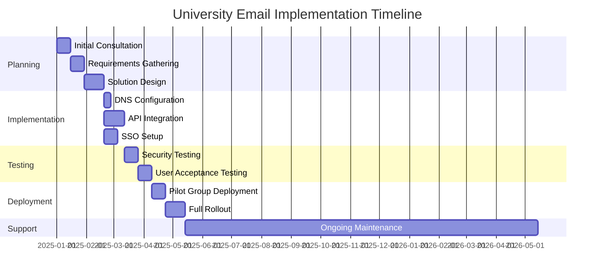
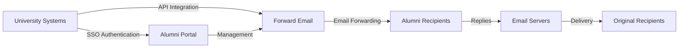

# Estudio de Caso: Cómo Forward Email Impulsa Soluciones de Correo Electrónico para Exalumnos en Universidades de Primer Nivel {#case-study-how-forward-email-powers-alumni-email-solutions-for-top-universities}


## Tabla de Contenidos {#table-of-contents}

* [Prólogo](#foreword)
* [Ahorros Dramáticos con Precios Estables](#dramatic-cost-savings-with-stable-pricing)
  * [Ahorros Reales en Universidades](#real-world-university-savings)
* [El Desafío del Correo Electrónico para Exalumnos Universitarios](#the-university-alumni-email-challenge)
  * [El Valor de la Identidad de Correo Electrónico para Exalumnos](#the-value-of-alumni-email-identity)
  * [Las Soluciones Tradicionales No Son Suficientes](#traditional-solutions-fall-short)
  * [La Solución de Forward Email](#the-forward-email-solution)
* [Implementación Técnica: Cómo Funciona](#technical-implementation-how-it-works)
  * [Arquitectura Central](#core-architecture)
  * [Integración con Sistemas Universitarios](#integration-with-university-systems)
  * [Gestión Impulsada por API](#api-driven-management)
  * [Configuración y Verificación DNS](#dns-configuration-and-verification)
  * [Pruebas y Aseguramiento de Calidad](#testing-and-quality-assurance)
* [Cronograma de Implementación](#implementation-timeline)
* [Proceso de Implementación: De la Migración al Mantenimiento](#implementation-process-from-migration-to-maintenance)
  * [Evaluación y Planificación Inicial](#initial-assessment-and-planning)
  * [Estrategia de Migración](#migration-strategy)
  * [Configuración Técnica](#technical-setup-and-configuration)
  * [Diseño de la Experiencia del Usuario](#user-experience-design)
  * [Capacitación y Documentación](#training-and-documentation)
  * [Soporte Continuo y Optimización](#ongoing-support-and-optimization)
* [Estudio de Caso: Universidad de Cambridge](#case-study-university-of-cambridge)
  * [Desafío](#challenge)
  * [Solución](#solution)
  * [Resultados](#results)
* [Beneficios para Universidades y Exalumnos](#benefits-for-universities-and-alumni)
  * [Para Universidades](#for-universities)
  * [Para Exalumnos](#for-alumni)
  * [Tasas de Adopción entre Exalumnos](#adoption-rates-among-alumni)
  * [Ahorros en Costos Comparados con Soluciones Previas](#cost-savings-compared-to-previous-solutions)
* [Consideraciones de Seguridad y Privacidad](#security-and-privacy-considerations)
  * [Medidas de Protección de Datos](#data-protection-measures)
  * [Marco de Cumplimiento](#compliance-framework)
* [Desarrollos Futuros](#future-developments)
* [Conclusión](#conclusion)


## Prólogo {#foreword}

Hemos creado el servicio de reenvío de correo electrónico más seguro, privado y flexible del mundo para universidades prestigiosas y sus exalumnos.

En el competitivo panorama de la educación superior, mantener conexiones de por vida con los exalumnos no es solo una cuestión de tradición, sino un imperativo estratégico. Una de las formas más tangibles en que las universidades fomentan estas conexiones es a través de direcciones de correo electrónico para exalumnos, proporcionando a los graduados una identidad digital que refleja su herencia académica.

En Forward Email, nos hemos asociado con algunas de las instituciones educativas más prestigiosas del mundo para revolucionar la forma en que gestionan los servicios de correo electrónico para exalumnos. Nuestra solución de reenvío de correo electrónico de nivel empresarial ahora impulsa los sistemas de correo electrónico para exalumnos de la [Universidad de Cambridge](https://en.wikipedia.org/wiki/University_of_Cambridge), la [Universidad de Maryland](https://en.wikipedia.org/wiki/University_of_Maryland,_College_Park), la [Universidad de Tufts](https://en.wikipedia.org/wiki/Tufts_University) y el [Swarthmore College](https://en.wikipedia.org/wiki/Swarthmore_College), sirviendo colectivamente a miles de exalumnos en todo el mundo.

Esta publicación de blog explora cómo nuestro servicio de reenvío de correo electrónico [de código abierto](https://en.wikipedia.org/wiki/Open-source_software) y enfocado en la privacidad se ha convertido en la solución preferida para estas instituciones, las implementaciones técnicas que lo hacen posible y el impacto transformador que ha tenido tanto en la eficiencia administrativa como en la satisfacción de los exalumnos.


## Ahorros Dramáticos con Precios Estables {#dramatic-cost-savings-with-stable-pricing}
Los beneficios financieros de nuestra solución son sustanciales, especialmente en comparación con los precios en continuo aumento de los proveedores tradicionales de correo electrónico:

| Solución                      | Costo por Alumno (Anual)                                                                                  | Costo para 100,000 Alumnos | Aumentos Recientes de Precio                                                                                                                                                             |
| ----------------------------- | --------------------------------------------------------------------------------------------------------- | -------------------------- | ---------------------------------------------------------------------------------------------------------------------------------------------------------------------------------------- |
| Google Workspace para Empresas | $72                                                                                                       | $7,200,000                 | • 2019: G Suite Basic de $5 a $6/mes (+20%)<br>• 2023: Planes flexibles aumentaron un 20%<br>• 2025: Business Plus de $18 a $26.40/mes (+47%) con funciones de IA                      |
| Google Workspace para Educación | Gratis (Education Fundamentals)<br>$3/estudiante/año (Education Standard)<br>$5/estudiante/año (Education Plus) | Gratis - $500,000          | • Descuentos por volumen: 5% para 100-499 licencias<br>• Descuentos por volumen: 10% para 500+ licencias<br>• Nivel gratuito limitado a servicios básicos                               |
| Microsoft 365 Business        | $60                                                                                                       | $6,000,000                 | • 2023: Introducción de actualizaciones de precios semestrales<br>• 2025 (Ene): Personal de $6.99 a $9.99/mes (+43%) con Copilot IA<br>• 2025 (Abr): aumento del 5% en compromisos anuales pagados mensualmente |
| Microsoft 365 Educación       | Gratis (A1)<br>$38-55/facultad/año (A3)<br>$65-96/facultad/año (A5)                                       | Gratis - $96,000           | • Licencias para estudiantes a menudo incluidas con compras para facultad<br>• Precios personalizados mediante licenciamiento por volumen<br>• Nivel gratuito limitado a versiones web  |
| Exchange Autoalojado          | $45                                                                                                       | $4,500,000                 | Los costos continuos de mantenimiento y seguridad siguen aumentando                                                                                                                      |
| **Forward Email Enterprise**  | **Fijo $250/mes**                                                                                        | **$3,000/año**             | **Sin aumentos de precio desde el lanzamiento**                                                                                                                                          |

### Ahorros Reales en Universidades {#real-world-university-savings}

Así es como nuestras universidades asociadas ahorran anualmente al elegir Forward Email en lugar de proveedores tradicionales:

| Universidad               | Cantidad de Alumnos | Costo Anual con Google | Costo Anual con Forward Email | Ahorro Anual |
| ------------------------- | ------------------- | ---------------------- | ----------------------------- | ------------ |
| Universidad de Cambridge  | 30,000              | $90,000                | $3,000                        | $87,000      |
| Swarthmore College        | 5,000               | $15,000                | $3,000                        | $12,000      |
| Universidad de Tufts      | 12,000              | $36,000                | $3,000                        | $33,000      |
| Universidad de Maryland   | 25,000              | $75,000                | $3,000                        | $72,000      |

> \[!NOTE]
> Forward Email enterprise típicamente cuesta solo $250/mes, sin costo adicional por usuario, limitaciones de tasa API en lista blanca, y el único costo adicional es el almacenamiento si necesitas GB/TB adicionales para estudiantes (+$3 por cada 10 GB adicionales). También usamos unidades NVMe SSD para soporte rápido de IMAP/POP3/SMTP/CalDAV/CardDAV.
> \[!IMPORTANT]
> A diferencia de Google y Microsoft, que han aumentado repetidamente sus precios mientras integran funciones de IA que analizan tus datos, Forward Email mantiene precios estables con un enfoque estricto en la privacidad. No usamos IA, no rastreamos patrones de uso y no almacenamos registros ni correos electrónicos en disco (todo el procesamiento se realiza en memoria), garantizando privacidad completa para tus comunicaciones con exalumnos.

Esto representa una reducción significativa de costos en comparación con las soluciones tradicionales de alojamiento de correo electrónico—fondos que las universidades pueden redirigir a becas, investigación u otras actividades críticas para su misión. Según un análisis de 2023 de Email Vendor Selection, las instituciones educativas buscan cada vez más alternativas rentables a los proveedores tradicionales de correo electrónico a medida que los precios continúan aumentando con la integración de funciones de IA ([Email Vendor Selection, 2023](https://www.emailvendorselection.com/email-service-provider-list/)).


## El desafío del correo electrónico para exalumnos universitarios {#the-university-alumni-email-challenge}

Para las universidades, proporcionar direcciones de correo electrónico de por vida a los exalumnos presenta un conjunto único de desafíos que las soluciones tradicionales de correo electrónico tienen dificultades para abordar eficazmente. Como se señala en una discusión exhaustiva en ServerFault, las universidades con grandes bases de usuarios requieren soluciones de correo electrónico especializadas que equilibren rendimiento, seguridad y rentabilidad ([ServerFault, 2009](https://serverfault.com/questions/97364/what-is-the-best-mail-server-for-a-university-with-a-large-amount-of-users)).

### El valor de la identidad de correo electrónico para exalumnos {#the-value-of-alumni-email-identity}

Las direcciones de correo electrónico para exalumnos (como `firstname.lastname@cl.cam.ac.uk` o `username@terpalum.umd.edu`) cumplen múltiples funciones importantes:

* Mantener la conexión institucional y la identidad de marca
* Facilitar la comunicación continua con la universidad
* Mejorar la credibilidad profesional de los graduados
* Apoyar la creación de redes y comunidades de exalumnos
* Proporcionar un punto de contacto estable y de por vida

La investigación de Tekade (2020) destaca que las direcciones de correo electrónico educativas ofrecen numerosos beneficios a los exalumnos, incluyendo acceso a recursos académicos, credibilidad profesional y descuentos exclusivos en varios servicios ([Medium, 2020](https://medium.com/coders-capsule/top-20-benefits-of-having-an-educational-email-address-91a09795e05)).

> \[!TIP]
> Visita nuestro nuevo directorio [AlumniEmail.com](https://alumniemail.com) para un recurso completo sobre servicios de correo electrónico para exalumnos universitarios, incluyendo guías de configuración, mejores prácticas y un directorio buscable de dominios de correo electrónico para exalumnos. Sirve como un centro centralizado para toda la información sobre correo electrónico para exalumnos.

### Las soluciones tradicionales se quedan cortas {#traditional-solutions-fall-short}

Los sistemas convencionales de correo electrónico presentan varias limitaciones cuando se aplican a las necesidades de correo electrónico para exalumnos:

* **Costoso**: Los modelos de licenciamiento por usuario se vuelven financieramente insostenibles para grandes bases de exalumnos
* **Carga administrativa**: Gestionar miles o millones de cuentas requiere recursos significativos de TI
* **Preocupaciones de seguridad**: Mantener la seguridad de cuentas inactivas aumenta la vulnerabilidad
* **Flexibilidad limitada**: Los sistemas rígidos no pueden adaptarse a las necesidades únicas del reenvío de correo electrónico para exalumnos
* **Problemas de privacidad**: Muchos proveedores escanean el contenido del correo electrónico con fines publicitarios

Una discusión en Quora sobre el mantenimiento del correo electrónico universitario revela que las preocupaciones de seguridad son una razón principal por la que las universidades podrían limitar o cancelar las direcciones de correo electrónico para exalumnos, ya que las cuentas no usadas pueden ser vulnerables a hackeos y robo de identidad ([Quora, 2011](https://www.quora.com/Is-there-any-cost-for-a-college-or-university-to-maintain-edu-e-mail-addresses)).

### La solución Forward Email {#the-forward-email-solution}

Nuestro enfoque aborda estos desafíos mediante un modelo fundamentalmente diferente:

* Reenvío de correo electrónico en lugar de alojamiento
* Precio fijo en lugar de costos por usuario
* Arquitectura de código abierto para transparencia y seguridad
* Diseño centrado en la privacidad sin escaneo de contenido
* Funciones especializadas para la gestión de identidad universitaria


## Implementación técnica: Cómo funciona {#technical-implementation-how-it-works}
Nuestra solución aprovecha una arquitectura técnica sofisticada pero elegantemente simple para ofrecer un reenvío de correo electrónico confiable y seguro a gran escala.

### Arquitectura Central {#core-architecture}

El sistema Forward Email consta de varios componentes clave:

* Servidores MX distribuidos para alta disponibilidad
* Reenvío en tiempo real sin almacenamiento de mensajes
* Autenticación de correo electrónico integral
* Soporte para dominios personalizados y subdominios
* Gestión de cuentas impulsada por API

Según profesionales de TI en ServerFault, para universidades que buscan implementar sus propias soluciones de correo electrónico, se recomienda Postfix como el mejor Agente de Transferencia de Correo (MTA), mientras que Courier o Dovecot son preferidos para acceso IMAP/POP3 ([ServerFault, 2009](https://serverfault.com/questions/97364/what-is-the-best-mail-server-for-a-university-with-a-large-amount-of-users)). Sin embargo, nuestra solución elimina la necesidad de que las universidades gestionen estos sistemas complejos por sí mismas.

### Integración con Sistemas Universitarios {#integration-with-university-systems}

Hemos desarrollado vías de integración perfectas con la infraestructura universitaria existente:

* Aprovisionamiento automatizado mediante integración con [RESTful API](https://forwardemail.net/email-api)
* Opciones de marca personalizada para portales universitarios
* Gestión flexible de alias para departamentos y organizaciones
* Operaciones por lotes para una administración eficiente

### Gestión Impulsada por API {#api-driven-management}

Nuestra [RESTful API](https://forwardemail.net/email-api) permite a las universidades automatizar la gestión del correo electrónico:

```javascript
// Ejemplo: Creando una nueva dirección de correo para exalumnos
const response = await fetch('https://forwardemail.net/api/v1/domains/example.edu/aliases', {
  method: 'POST',
  headers: {
    'Content-Type': 'application/json',
    'Authorization': `Basic ${Buffer.from(YOUR_API_TOKEN + ":").toString('base64')}`
  },
  body: JSON.stringify({
    name: 'alumni.john.smith',
    recipients: ['johnsmith@gmail.com'],
    has_recipient_verification: true
  })
});
```

### Configuración y Verificación DNS {#dns-configuration-and-verification}

La configuración adecuada del DNS es crítica para la entrega del correo electrónico. Nuestro equipo ayuda con:

* Configuración de [DNS](https://en.wikipedia.org/wiki/Domain_Name_System) incluyendo registros MX
* Implementación integral de seguridad de correo electrónico usando nuestro paquete de código abierto [mailauth](https://www.npmjs.com/package/mailauth), una navaja suiza para la autenticación de correo electrónico que maneja:
  * [SPF](https://en.wikipedia.org/wiki/Sender_Policy_Framework) (Sender Policy Framework) para prevenir suplantación de correo
  * [DKIM](https://en.wikipedia.org/wiki/DomainKeys_Identified_Mail) (DomainKeys Identified Mail) para autenticación de correo electrónico
  * [DMARC](https://en.wikipedia.org/wiki/Email_authentication) (Domain-based Message Authentication, Reporting & Conformance) para aplicación de políticas
  * [MTA-STS](https://en.wikipedia.org/wiki/Opportunistic_TLS) (SMTP MTA Strict Transport Security) para forzar cifrado TLS
  * [ARC](https://en.wikipedia.org/wiki/DomainKeys_Identified_Mail#Authenticated_Received_Chain) (Authenticated Received Chain) para mantener la autenticación cuando los mensajes son reenviados
  * [SRS](https://en.wikipedia.org/wiki/Sender_Rewriting_Scheme) (Sender Rewriting Scheme) para preservar la validación SPF a través del reenvío
  * [BIMI](https://en.wikipedia.org/wiki/Email_authentication) (Brand Indicators for Message Identification) para mostrar el logo en clientes de correo compatibles
* Verificación de registros TXT DNS para la propiedad del dominio

El paquete `mailauth` (<http://npmjs.com/package/mailauth>) es la solución completamente de código abierto que maneja todos los aspectos de la autenticación de correo electrónico en una biblioteca integrada. A diferencia de soluciones propietarias, este enfoque garantiza transparencia, actualizaciones regulares de seguridad y control total sobre el proceso de autenticación de correo electrónico.

### Pruebas y Aseguramiento de Calidad {#testing-and-quality-assurance}

Antes del despliegue completo, realizamos pruebas rigurosas:

* Pruebas de entrega de correo de extremo a extremo
* Pruebas de carga para escenarios de alto volumen
* Pruebas de penetración de seguridad
* Validación de integración API
* Pruebas de aceptación por usuarios con representantes de exalumnos
## Cronograma de Implementación {#implementation-timeline}


```mermaid
gantt
    title University Email Implementation Timeline
    dateFormat  YYYY-MM-DD
    section Planning
    Initial Consultation           :a1, 2025-01-01, 14d
    Requirements Gathering         :a2, after a1, 14d
    Solution Design                :a3, after a2, 21d
    section Implementation
    DNS Configuration              :b1, after a3, 7d
    API Integration                :b2, after a3, 21d
    SSO Setup                      :b3, after a3, 14d
    section Testing
    Security Testing               :c1, after b1 b2 b3, 14d
    User Acceptance Testing        :c2, after c1, 14d
    section Deployment
    Pilot Group Deployment         :d1, after c2, 14d
    Full Rollout                   :d2, after d1, 21d
    section Support
    Ongoing Maintenance            :e1, after d2, 365d
```


## Proceso de Implementación: De la Migración al Mantenimiento {#implementation-process-from-migration-to-maintenance}

Nuestro proceso estructurado de implementación garantiza una transición fluida para las universidades que adoptan nuestra solución.

### Evaluación Inicial y Planificación {#initial-assessment-and-planning}

Comenzamos con una evaluación exhaustiva del sistema de correo electrónico actual de la universidad, la base de datos de exalumnos y los requisitos técnicos. Esta fase incluye:

* Entrevistas con las partes interesadas de TI, relaciones con exalumnos y administración
* Auditoría técnica de la infraestructura de correo electrónico existente
* Mapeo de datos para los registros de exalumnos
* Revisión de seguridad y cumplimiento
* Desarrollo del cronograma del proyecto y hitos

### Estrategia de Migración {#migration-strategy}

Basándonos en la evaluación, desarrollamos una estrategia de migración personalizada que minimiza la interrupción mientras asegura la integridad completa de los datos:

* Enfoque de migración por fases según cohortes de exalumnos
* Operación de sistemas paralelos durante la transición
* Protocolos completos de validación de datos
* Procedimientos de respaldo para cualquier problema de migración
* Plan de comunicación claro para todas las partes interesadas

### Configuración Técnica {#technical-setup-and-configuration}

Nuestro equipo técnico se encarga de todos los aspectos de la configuración del sistema:

* Configuración y verificación de DNS
* Integración de API con los sistemas universitarios
* Desarrollo de portal personalizado con la marca de la universidad
* Configuración de autenticación de correo electrónico (SPF, DKIM, DMARC)

### Diseño de la Experiencia de Usuario {#user-experience-design}

Trabajamos estrechamente con las universidades para crear interfaces intuitivas tanto para administradores como para exalumnos:

* Portales de correo electrónico para exalumnos con marca personalizada
* Gestión simplificada del reenvío de correo electrónico
* Diseños responsivos para dispositivos móviles
* Cumplimiento de accesibilidad
* Soporte multilingüe donde sea necesario

### Capacitación y Documentación {#training-and-documentation}

La capacitación integral asegura que todas las partes interesadas puedan usar el sistema eficazmente:

* Sesiones de capacitación para administradores
* Documentación técnica para el personal de TI
* Guías de usuario para exalumnos
* Tutoriales en video para tareas comunes
* Desarrollo de base de conocimientos

### Soporte Continuo y Optimización {#ongoing-support-and-optimization}

Nuestra colaboración continúa mucho más allá de la implementación:

* Soporte técnico 24/7
* Actualizaciones regulares del sistema y parches de seguridad
* Monitoreo y optimización del rendimiento
* Consultoría sobre mejores prácticas de correo electrónico
* Análisis de datos e informes


## Estudio de Caso: Universidad de Cambridge {#case-study-university-of-cambridge}

La Universidad de Cambridge buscaba una solución para proporcionar direcciones de correo electrónico @cam.ac.uk a sus exalumnos mientras reducía la carga y los costos de TI.

### Desafío {#challenge}

Cambridge enfrentaba varios desafíos con su sistema anterior de correo para exalumnos:

* Altos costos operativos para mantener una infraestructura de correo separada
* Carga administrativa para gestionar miles de cuentas
* Preocupaciones de seguridad con cuentas inactivas
* Integración limitada con sistemas de base de datos de exalumnos
* Requisitos crecientes de almacenamiento

### Solución {#solution}

Forward Email implementó una solución integral:

* Reenvío de correo para todas las direcciones de exalumnos @cam.ac.uk
* Portal personalizado para autoservicio de exalumnos
* Integración de API con la base de datos de exalumnos de Cambridge
* Implementación completa de seguridad de correo electrónico

### Resultados {#results}

La implementación entregó beneficios significativos:
* Reducción sustancial de costos en comparación con la solución anterior
* Fiabilidad del 99.9% en la entrega de correos electrónicos
* Administración simplificada mediante automatización
* Seguridad mejorada con autenticación moderna de correo electrónico
* Retroalimentación positiva de los exalumnos sobre la usabilidad del sistema


## Beneficios para Universidades y Exalumnos {#benefits-for-universities-and-alumni}

Nuestra solución ofrece beneficios tangibles tanto para las instituciones como para sus graduados.

### Para Universidades {#for-universities}

* **Eficiencia de Costos**: Precio fijo independientemente del número de exalumnos
* **Simplicidad Administrativa**: Gestión automatizada mediante API
* **Seguridad Mejorada**: Autenticación integral de correo electrónico
* **Consistencia de Marca**: Direcciones de correo institucionales de por vida
* **Compromiso con Exalumnos**: Fortalecimiento de conexiones mediante servicio continuo

Según BulkSignature (2023), las plataformas de correo electrónico para instituciones educativas ofrecen beneficios significativos, incluyendo rentabilidad a través de planes gratuitos o de bajo costo, eficiencia de tiempo mediante capacidades de comunicación masiva y funciones de seguimiento para monitorear la entrega y el compromiso con los correos electrónicos ([BulkSignature, 2023](https://bulksignature.com/blog/5-best-email-platforms-for-educational-institutions/)).

### Para Exalumnos {#for-alumni}

* **Identidad Profesional**: Dirección de correo electrónico de universidad prestigiosa
* **Continuidad del Correo**: Reenvío a cualquier correo personal
* **Protección de Privacidad**: Sin escaneo de contenido ni minería de datos
* **Gestión Simplificada**: Actualizaciones fáciles de destinatarios
* **Seguridad Mejorada**: Autenticación moderna de correo electrónico

Investigaciones del International Journal of Education & Literacy Studies destacan la importancia de una comunicación adecuada por correo electrónico en entornos académicos, señalando que la alfabetización en correo electrónico es una habilidad crucial tanto para estudiantes como para exalumnos en contextos profesionales ([IJELS, 2021](https://files.eric.ed.gov/fulltext/EJ1319324.pdf)).

### Tasas de Adopción entre Exalumnos {#adoption-rates-among-alumni}

Las universidades reportan altas tasas de adopción y satisfacción entre sus comunidades de exalumnos.

### Ahorro de Costos en Comparación con Soluciones Anteriores {#cost-savings-compared-to-previous-solutions}

El impacto financiero ha sido sustancial, con universidades reportando ahorros significativos en comparación con sus soluciones anteriores de correo electrónico.


## Consideraciones de Seguridad y Privacidad {#security-and-privacy-considerations}

Para las instituciones educativas, proteger los datos de los exalumnos no solo es una buena práctica, sino que a menudo es un requisito legal bajo regulaciones como el GDPR en Europa.

### Medidas de Protección de Datos {#data-protection-measures}

Nuestra solución incorpora múltiples capas de seguridad:

* Cifrado de extremo a extremo para todo el tráfico de correo electrónico
* No almacenamiento del contenido de los correos en nuestros servidores
* Auditorías de seguridad regulares y pruebas de penetración
* Cumplimiento con estándares internacionales de protección de datos
* Código abierto y transparente para verificación de seguridad

> \[!WARNING]
> Muchos proveedores de correo electrónico escanean el contenido de los correos con fines publicitarios o para entrenar modelos de IA. Esta práctica genera serias preocupaciones de privacidad, especialmente para comunicaciones profesionales y académicas. Forward Email nunca escanea el contenido de los correos y procesa todos los correos en memoria para garantizar privacidad completa.

### Marco de Cumplimiento {#compliance-framework}

Mantenemos un estricto cumplimiento con las regulaciones relevantes:

* Cumplimiento con GDPR para instituciones europeas
* Certificación SOC 2 Tipo II
* Evaluaciones de seguridad anuales
* Acuerdo de Procesamiento de Datos (DPA) disponible en [forwardemail.net/dpa](https://forwardemail.net/dpa)
* Actualizaciones regulares de cumplimiento conforme evolucionan las regulaciones


## Desarrollos Futuros {#future-developments}

Continuamos mejorando nuestra solución de correo para exalumnos con nuevas funciones y capacidades:

* Análisis mejorados para administradores universitarios
* Protecciones avanzadas contra phishing
* Capacidades ampliadas de API para integración más profunda
* Opciones adicionales de autenticación


## Conclusión {#conclusion}

Forward Email ha revolucionado la forma en que las universidades proveen y gestionan servicios de correo para exalumnos. Al reemplazar el alojamiento de correo costoso y complejo con un reenvío de correo elegante y seguro, hemos permitido que las instituciones ofrezcan direcciones de correo electrónico de por vida a todos los exalumnos mientras reducen drásticamente costos y carga administrativa.
Nuestras alianzas con instituciones prestigiosas como Cambridge, Maryland, Tufts y Swarthmore demuestran la efectividad de nuestro enfoque en diversos entornos educativos. A medida que las universidades enfrentan una presión creciente para mantener las conexiones con sus exalumnos mientras controlan los costos, nuestra solución ofrece una alternativa convincente a los sistemas de correo electrónico tradicionales.


```mermaid
flowchart LR
    A[University Systems] -->|API Integration| B[Forward Email]
    B -->|Email Forwarding| C[Alumni Recipients]
    C -->|Replies| D[Email Servers]
    D -->|Delivery| E[Original Recipients]
    F[Alumni Portal] -->|Management| B
    A -->|SSO Authentication| F
```

Para las universidades interesadas en explorar cómo Forward Email puede transformar sus servicios de correo electrónico para exalumnos, contacten a nuestro equipo en <support@forwardemail.net> o visiten [forwardemail.net](https://forwardemail.net) para obtener más información sobre nuestras soluciones empresariales.
