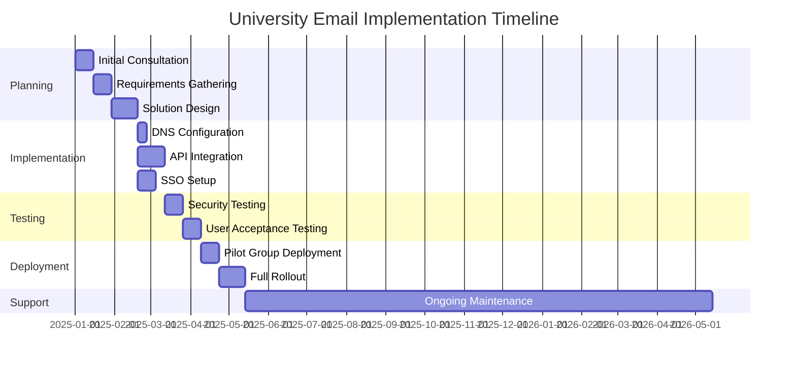
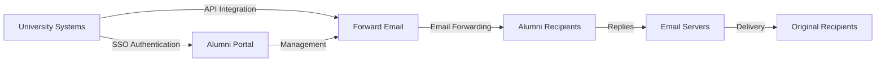

# Case-tutkimus: Miten sähköpostin välitys tukee alumnien sähköpostiratkaisuja huippuyliopistoille {#case-study-how-forward-email-powers-alumni-email-solutions-for-top-universities}


## Sisällysluettelo {#table-of-contents}

* [Esipuhe](#foreword)
* [Dramaattiset kustannussäästöt vakaalla hinnoittelulla](#dramatic-cost-savings-with-stable-pricing)
  * [Reaalimaailman yliopistosäästöt](#real-world-university-savings)
* [Yliopiston alumnien sähköpostihaaste](#the-university-alumni-email-challenge)
  * [Alumnien sähköpostiidentiteetin arvo](#the-value-of-alumni-email-identity)
  * [Perinteiset ratkaisut jäävät vajaaksi](#traditional-solutions-fall-short)
  * [Lähetä sähköpostiratkaisu](#the-forward-email-solution)
* [Tekninen toteutus: Kuinka se toimii](#technical-implementation-how-it-works)
  * [Ydinarkkitehtuuri](#core-architecture)
  * [Integrointi yliopistojärjestelmien kanssa](#integration-with-university-systems)
  * [API-pohjainen hallinta](#api-driven-management)
  * [DNS-määritys ja vahvistus](#dns-configuration-and-verification)
  * [Testaus ja laadunvarmistus](#testing-and-quality-assurance)
* [Toteutuksen aikajana](#implementation-timeline)
* [Käyttöönottoprosessi: siirrosta ylläpitoon](#implementation-process-from-migration-to-maintenance)
  * [Alkuarviointi ja suunnittelu](#initial-assessment-and-planning)
  * [Muuttoliikestrategia](#migration-strategy)
  * [Tekniset asetukset ja konfigurointi](#technical-setup-and-configuration)
  * [Käyttökokemuksen suunnittelu](#user-experience-design)
  * [Koulutus ja dokumentointi](#training-and-documentation)
  * [Jatkuva tuki ja optimointi](#ongoing-support-and-optimization)
* [Tapaustutkimus: Cambridgen yliopisto](#case-study-university-of-cambridge)
  * [Haaste](#challenge)
  * [Ratkaisu](#solution)
  * [Tulokset](#results)
* [Edut yliopistoille ja alumneille](#benefits-for-universities-and-alumni)
  * [Yliopistoille](#for-universities)
  * [Alumneille](#for-alumni)
  * [Adoption hinnat alumnien keskuudessa](#adoption-rates-among-alumni)
  * [Kustannussäästöt aiempiin ratkaisuihin verrattuna](#cost-savings-compared-to-previous-solutions)
* [Turvallisuus- ja tietosuojanäkökohdat](#security-and-privacy-considerations)
  * [Tietosuojatoimenpiteet](#data-protection-measures)
  * [Compliance Framework](#compliance-framework)
* [Tulevaisuuden kehitys](#future-developments)
* [Johtopäätös](#conclusion)

## Esipuhe {#foreword}

Olemme rakentaneet maailman turvallisimman, yksityisimmän ja joustavimman sähköpostin edelleenlähetyspalvelun arvostetuille yliopistoille ja niiden alumneille.

Korkea-asteen koulutuksen kilpailuympäristössä elinikäisten yhteyksien ylläpitäminen alumnien ei ole vain perinnekysymys – se on strateginen välttämättömyys. Yksi konkreettisimmista tavoista, joilla yliopistot edistävät näitä yhteyksiä, ovat alumnien sähköpostiosoitteet, jotka tarjoavat valmistuneille digitaalisen identiteetin, joka heijastaa heidän akateemista perintöään.

Forward Emaililla olemme tehneet yhteistyötä joidenkin maailman arvostetuimpien oppilaitosten kanssa mullistaaksemme heidän alumnien sähköpostipalveluiden hallintansa. Yritystason sähköpostin edelleenlähetysratkaisumme tukee nyt [Cambridgen yliopisto](https://en.wikipedia.org/wiki/University_of_Cambridge)-, [Marylandin yliopisto](https://en.wikipedia.org/wiki/University_of_Maryland,\_College_Park)-, [Tuftsin yliopisto](https://en.wikipedia.org/wiki/Tufts_University)- ja [Swarthmore College](https://en.wikipedia.org/wiki/Swarthmore_College)-ohjelmien alumnien sähköpostijärjestelmiä, jotka palvelevat yhteensä tuhansia alumneja maailmanlaajuisesti.

Tässä blogikirjoituksessa tarkastellaan, miten yksityisyyteen keskittyvästä [avoimen lähdekoodin](https://en.wikipedia.org/wiki/Open-source_software) sähköpostin edelleenlähetyspalvelustamme on tullut näiden oppilaitosten ensisijainen ratkaisu, sen teknisiä toteutuksia ja sen mullistavaa vaikutusta sekä hallinnolliseen tehokkuuteen että alumnien tyytyväisyyteen.

## Merkittäviä kustannussäästöjä vakaalla hinnoittelulla {#dramatic-cost-savings-with-stable-pricing}

Ratkaisumme taloudelliset hyödyt ovat huomattavia, etenkin verrattuna perinteisten sähköpostintarjoajien jatkuvasti nouseviin hintoihin:

| Ratkaisu | Hinta per alumni (vuosittainen) | Hinta 100 000 alumnille | Viimeaikaiset hinnankorotukset |
| ------------------------------ | --------------------------------------------------------------------------------------------------------- | ----------------------- | ---------------------------------------------------------------------------------------------------------------------------------------------------------------------------------------- |
| Google Workspace for Business | $72 | $7,200,000 | • 2019: G Suite Basic 5 dollarista 6 dollariin/kk (+20 %)<br>• 2023: Joustavat liittymät nousivat 20 %<br>• 2025: Business Plus 18 dollarista 26,40 dollariin/kk (+47 %) tekoälyominaisuuksilla |
| Google Workspace for Education | Ilmainen (Education Fundamentals)<br>3 $/opiskelija/vuosi (Education Standard)<br>5 $/opiskelija/vuosi (Education Plus) | Ilmainen - 500 000 dollaria | • Määräalennukset: 5 % 100–499 lisenssille<br>• Määräalennukset: 10 % yli 500 lisenssille<br>• Ilmainen taso rajoitettu ydinpalveluihin |
| Microsoft 365 Business | $60 | $6,000,000 | • 2023: Kaksi kertaa vuodessa tapahtuvat hintapäivitykset otettiin käyttöön<br>• 2025 (Tammikuu): Henkilökohtainen 6,99 dollarista 9,99 dollariin/kk (+43 %) Copilotin tekoälyn avulla<br>• 2025 (Huhtikuu): 5 %:n korotus kuukausittain maksettaviin vuosittaisiin sitoumuksiin |
| Microsoft 365 Education | Ilmainen (A1)<br>38–55 $/opettaja/vuosi (A3)<br>65–96 $/opettaja/vuosi (A5) | Ilmainen - 96 000 dollaria | • Opiskelijalisenssit sisältyvät usein opettajien ostoihin<br>• Räätälöity hinnoittelu volyymilisenssien kautta<br>• Ilmainen taso rajoitettu verkkoversioihin |
| Itseisännöity Exchange | $45 | $4,500,000 | Jatkuvat ylläpito- ja turvallisuuskustannukset nousevat edelleen |
| **Edelleenlähetä sähköpostia yrityksille** | **Kiinteä 250 dollaria/kk** | **3 000 dollaria/vuosi** | **Ei hinnankorotuksia lanseerauksen jälkeen** |

### Yliopiston todelliset säästöt {#real-world-university-savings}

Tässä on kuinka paljon kumppaniyliopistomme säästävät vuosittain valitsemalla Lähetä edelleen sähköposti perinteisten palveluntarjoajien sijaan:

| Yliopisto | Alumni Count | Vuosikulut Googlen kanssa | Vuosikustannukset sähköpostin edelleenlähetyksellä | Vuosittaiset säästöt |
| ----------------------- | ------------ | ----------------------- | ------------------------------ | -------------- |
| Cambridgen yliopisto | 30,000 | $90,000 | $3,000 | $87,000 |
| Swarthmore College | 5,000 | $15,000 | $3,000 | $12,000 |
| Tuftsin yliopisto | 12,000 | $36,000 | $3,000 | $33,000 |
| Marylandin yliopisto | 25,000 | $75,000 | $3,000 | $72,000 |

> \[!NOTE]
> Forward Email enterprise only costs $250/month typically, with no extra cost per user, whitelisted API rate limitations, and the only additional cost is storage if you need additional GB/TB for students (+$3 per 10 GB additional storage). We use NVMe SSD drives for fast support of IMAP/POP3/SMTP/CalDAV/CardDAV as well.

> \[!IMPORTANT]
> Unlike Google and Microsoft, who have repeatedly increased their prices while integrating AI features that analyze your data, Forward Email maintains stable pricing with a strict privacy focus. We don't use AI, don't track usage patterns, and don't store logs or emails to disk (all processing is done in-memory), ensuring complete privacy for your alumni communications.

Tämä edustaa merkittävää kustannussäästöä verrattuna perinteisiin sähköpostin isännöintiratkaisuihin – varoihin, joita yliopistot voivat ohjata apurahoihin, tutkimukseen tai muihin kriittisiin toimintoihin. Email Vendor Selectionin vuonna 2023 tekemän analyysin mukaan oppilaitokset etsivät yhä enemmän kustannustehokkaita vaihtoehtoja perinteisille sähköpostipalveluntarjoajille, koska hinnat nousevat edelleen tekoälyominaisuuksien integroinnin myötä ([Sähköpostitoimittajan valinta, 2023](https://www.emailvendorselection.com/email-service-provider-list/)).

## Yliopiston alumnien sähköpostihaaste {#the-university-alumni-email-challenge}

Yliopistoille elinikäisten sähköpostiosoitteiden tarjoaminen alumneille asettaa ainutlaatuisen joukon haasteita, joihin perinteiset sähköpostiratkaisut eivät pysty tehokkaasti vastaamaan. Kuten ServerFaultia käsittelevässä kattavassa keskustelussa todettiin, suuren käyttäjäkunnan omaavat yliopistot tarvitsevat erikoistuneita sähköpostiratkaisuja, jotka tasapainottavat suorituskyvyn, turvallisuuden ja kustannustehokkuuden ([Palvelinvika, 2009](https://serverfault.com/questions/97364/what-is-the-best-mail-server-for-a-university-with-a-large-amount-of-users)).

### Alumnien sähköpostiosoitteiden arvo {#the-value-of-alumni-email-identity}

Alumnien sähköpostiosoitteilla (kuten `firstname.lastname@cl.cam.ac.uk` tai `username@terpalum.umd.edu`) on useita tärkeitä toimintoja:

* Ylläpitää yhteyttä yliopistoon ja brändi-identiteettiä
* Helpottaa jatkuvaa viestintää yliopiston kanssa
* Parantaa valmistuneiden ammatillista uskottavuutta
* Tukee alumniverkostoitumista ja yhteisöllisyyttä
* Tarjoaa vakaan ja elinikäisen yhteyspisteen

Tekaden (2020) tutkimus korostaa, että koulutussähköpostiosoitteet tarjoavat alumneille lukuisia etuja, kuten pääsyn akateemisiin resursseihin, ammatillisen uskottavuuden ja ainutlaatuisia alennuksia erilaisista palveluista ([Keskikokoinen, 2020](https://medium.com/coders-capsule/top-20-benefits-of-having-an-educational-email-address-91a09795e05)).

> \[!TIP]
> Visit our new [AlumniEmail.com](https://alumniemail.com) directory for a comprehensive resource on university alumni email services, including setup guides, best practices, and a searchable directory of alumni email domains. It serves as a central hub for all alumni email information.

### Perinteiset ratkaisut jäävät vajaaksi {#traditional-solutions-fall-short}

Perinteisissä sähköpostijärjestelmissä on useita rajoituksia, kun niitä sovelletaan alumnien sähköpostitarpeisiin:

* **Kustannusten kohtuuttomuus**: Käyttäjäkohtaisista lisensointimalleista tulee taloudellisesti kestämättömiä suurille alumniyhteisöille.
* **Hallinnollinen taakka**: Tuhansien tai miljoonien tilien hallinta vaatii merkittäviä IT-resursseja.
* **Tietoturvaongelmat**: Käyttämättömien tilien turvallisuuden ylläpitäminen lisää haavoittuvuutta.
* **Rajoitettu joustavuus**: Jäykät järjestelmät eivät pysty mukautumaan alumnien sähköpostin edelleenlähetyksen ainutlaatuisiin tarpeisiin.
* **Tietosuojaongelmat**: Monet palveluntarjoajat skannaavat sähköpostisisältöä mainostarkoituksiin.

Quoran keskustelu yliopistojen sähköpostien ylläpidosta paljastaa, että turvallisuusongelmat ovat merkittävä syy siihen, miksi yliopistot saattavat rajoittaa tai peruuttaa alumnien sähköpostiosoitteita, sillä käyttämättömät tilit voivat olla alttiita hakkeroinnille ja identiteettivarkauksille ([Quora, 2011](https://www.quora.com/Is-there-any-cost-for-a-college-or-university-to-maintain-edu-e-mail-addresses)).

### Sähköpostin edelleenlähetysratkaisu {#the-forward-email-solution}

Lähestymistapamme vastaa näihin haasteisiin täysin erilaisella mallilla:

* Sähköpostin edelleenlähetys hostingin sijaan
* Kiinteä hinnoittelu käyttäjäkohtaisten kustannusten sijaan
* Avoimen lähdekoodin arkkitehtuuri läpinäkyvyyden ja turvallisuuden takaamiseksi
* Tietosuoja ensin ilman sisällön skannausta
* Erikoisominaisuudet yliopistojen identiteetinhallintaan

## Tekninen toteutus: Toimintaperiaate {#technical-implementation-how-it-works}

Ratkaisumme hyödyntää hienostunutta mutta tyylikkään yksinkertaista teknistä arkkitehtuuria luotettavan ja turvallisen sähköpostin edelleenlähetyksen takaamiseksi.

### Ydinarkkitehtuuri {#core-architecture}

Forward Email -järjestelmä koostuu useista avainkomponenteista:

* Hajautetut MX-palvelimet korkean käytettävyyden takaamiseksi
* Reaaliaikainen edelleenlähetys ilman viestien tallennusta
* Kattava sähköpostin todennus
* Mukautettujen verkkotunnusten ja aliverkkotunnusten tuki
* API-pohjainen tilinhallinta

ServerFaultin IT-ammattilaisten mukaan yliopistoille, jotka haluavat ottaa käyttöön omia sähköpostiratkaisujaan, Postfixia suositellaan parhaana sähköpostinsiirtoagenttina (MTA), kun taas Courier tai Dovecot ovat parempia IMAP/POP3-yhteyteen ([Palvelinvika, 2009](https://serverfault.com/questions/97364/what-is-the-best-mail-server-for-a-university-with-a-large-amount-of-users)). Ratkaisumme kuitenkin poistaa yliopistojen tarpeen hallita näitä monimutkaisia järjestelmiä itse.

### Integrointi yliopiston järjestelmiin {#integration-with-university-systems}

Olemme kehittäneet saumattomia integraatiopolkuja olemassa olevan yliopistoinfrastruktuurin kanssa:

* Automaattinen käyttöönotto [RESTful API](https://forwardemail.net/email-api) -integraation kautta
* Yliopiston portaaleille mukautettavat brändäysvaihtoehdot
* Joustava aliasten hallinta osastoille ja organisaatioille
* Eräoperaatiot tehokasta hallintaa varten

### API-pohjainen hallinta {#api-driven-management}

[RESTful API](https://forwardemail.net/email-api) -linkkimme avulla yliopistot voivat automatisoida sähköpostien hallinnan:

```javascript
// Example: Creating a new alumni email address
const response = await fetch('https://forwardemail.net/api/v1/domains/example.edu/aliases', {
  method: 'POST',
  headers: {
    'Content-Type': 'application/json',
    'Authorization': `Basic ${Buffer.from(YOUR_API_TOKEN + ":").toString('base64')}`
  },
  body: JSON.stringify({
    name: 'alumni.john.smith',
    recipients: ['johnsmith@gmail.com'],
    has_recipient_verification: true
  })
});
```

### DNS-konfigurointi ja -vahvistus {#dns-configuration-and-verification}

Oikea DNS-määritys on kriittinen sähköpostin toimitukselle. Tiimimme auttaa:

* [DNS](https://en.wikipedia.org/wiki/Domain_Name_System) -kokoonpano, joka sisältää MX-tietueet
* Kattava sähköpostin suojauksen toteutus avoimen lähdekoodin [mailauth](https://www.npmjs.com/package/mailauth) -paketillamme, joka on kuin linkkuveitsi sähköpostin todennukseen ja käsittelee:
* [SPF](https://en.wikipedia.org/wiki/Sender_Policy_Framework) (Sender Policy Framework) sähköpostihuijausten estämiseksi
* [DKIM](https://en.wikipedia.org/wiki/DomainKeys_Identified_Mail) (DomainKeys Identified Mail) sähköpostin todennukseen
* [DMARC](https://en.wikipedia.org/wiki/Email_authentication) (Domain-based Message Authentication, Reporting & Conformance) käytäntöjen valvontaa varten
* [MTA-STS](https://en.wikipedia.org/wiki/Opportunistic_TLS) (SMTP MTA Strict Transport Security) TLS-salauksen valvomiseksi
* [ARC](https://en.wikipedia.org/wiki/DomainKeys_Identified_Mail#Authenticated_Received_Chain) (Authenticated Received Chain) todennuksen ylläpitämiseksi viestien edelleenlähetyksen yhteydessä
* [SRS](https://en.wikipedia.org/wiki/Sender_Rewriting_Scheme) (Sender Rewriting Scheme) SPF-vahvistuksen säilyttämiseksi edelleenlähetyksen aikana
* [BIMI](https://en.wikipedia.org/wiki/Email_authentication) (Brändi-indikaattorit viestin tunnistamiseen) logon näyttämiseen tuetuissa sähköpostiohjelmissa
* DNS TXT -tietueen vahvistus verkkotunnuksen omistajuudelle

`mailauth` -paketti (<http://npmjs.com/package/mailauth>) on täysin avoimen lähdekoodin ratkaisu, joka käsittelee kaikki sähköpostin todennuksen osa-alueet yhdessä integroidussa kirjastossa. Toisin kuin suljetut ratkaisut, tämä lähestymistapa varmistaa läpinäkyvyyden, säännölliset tietoturvapäivitykset ja täydellisen sähköpostin todennusprosessin hallinnan.

### Testaus ja laadunvarmistus {#testing-and-quality-assurance}

Ennen täydellistä käyttöönottoa suoritamme tiukat testaukset:

* Sähköpostin toimitustestaus kokonaisvaltaisesti
* Kuormitustestaus suurten volyymien skenaarioissa
* Tietoturvan penetraatiotestaus
* API-integraation validointi
* Käyttäjien hyväksyntätestaus alumnien edustajien kanssa

## Toteutuksen aikataulu {#implementation-timeline}



## Käyttöönottoprosessi: Siirrosta ylläpitoon {#implementation-process-from-migration-to-maintenance}

Strukturoitu käyttöönottoprosessimme varmistaa sujuvan siirtymisen ratkaisumme käyttöön ottaville yliopistoille.

### Alustava arviointi ja suunnittelu {#initial-assessment-and-planning}

Aloitamme kattavalla arvioinnilla yliopiston nykyisestä sähköpostijärjestelmästä, alumnitietokannasta ja teknisistä vaatimuksista. Tämä vaihe sisältää:

* Sidosryhmien haastattelut IT-osaston, alumnisuhteiden ja hallinnon kanssa
* Olemassa olevan sähköposti-infrastruktuurin tekninen tarkastus
* Alumnitietojen kartoitus
* Tietoturvan ja vaatimustenmukaisuuden tarkastus
* Projektin aikataulu ja virstanpylväiden kehittäminen

### Muuttostrategia {#migration-strategy}

Arvioinnin perusteella kehitämme räätälöidyn siirtostrategian, joka minimoi häiriöt ja varmistaa tietojen täydellisen eheyden:

* Alumnikohorttien vaiheittainen migraatio
* Järjestelmien rinnakkainen toiminta siirtymän aikana
* Kattavat tietojen validointiprotokollat
* Varamenettelyt mahdollisten migraatio-ongelmien varalta
* Selkeä viestintäsuunnitelma kaikille sidosryhmille

### Tekninen asennus ja konfigurointi {#technical-setup-and-configuration}

Tekninen tiimimme hoitaa kaikki järjestelmän asennuksen osa-alueet:

* DNS-konfigurointi ja -vahvistus
* API-integraatio yliopiston järjestelmiin
* Mukautetun portaalin kehitys yliopiston brändäyksellä
* Sähköpostin todennuksen määritys (SPF, DKIM, DMARC)

### Käyttäjäkokemuksen suunnittelu {#user-experience-design}

Teemme tiivistä yhteistyötä yliopistojen kanssa luodaksemme intuitiivisia käyttöliittymiä sekä järjestelmänvalvojille että alumneille:

* Räätälöidyt alumnien sähköpostiportaalit
* Yksinkertaistettu sähköpostin edelleenlähetyksen hallinta
* Mobiilipohjaiset mallit
* Saavutettavuusvaatimustenmukaisuus
* Monikielinen tuki tarvittaessa

### Koulutus ja dokumentaatio {#training-and-documentation}

Kattava koulutus varmistaa, että kaikki sidosryhmät voivat käyttää järjestelmää tehokkaasti:

* Ylläpitäjäkoulutukset
* Tekninen dokumentaatio IT-henkilöstölle
* Käyttöoppaat alumneille
* Video-oppaat yleisiin tehtäviin
* Tietokannan kehittäminen

### Jatkuva tuki ja optimointi {#ongoing-support-and-optimization}

Yhteistyömme jatkuu pitkälle toteutuksen jälkeen:

* 24/7 tekninen tuki
* Säännölliset järjestelmäpäivitykset ja tietoturvakorjaukset
* Suorituskyvyn seuranta ja optimointi
* Konsultointi sähköpostin parhaista käytännöistä
* Data-analytiikka ja raportointi

## Tapaustutkimus: Cambridgen yliopisto {#case-study-university-of-cambridge}

Cambridgen yliopisto etsi ratkaisua antaakseen @cam.ac.uk-sähköpostiosoitteita alumneille ja samalla vähentää IT-kustannuksia ja -kustannuksia.

### Haaste {#challenge}

Cambridge kohtasi useita haasteita edellisen alumnien sähköpostijärjestelmän kanssa:

* Korkeat käyttökustannukset erillisen sähköposti-infrastruktuurin ylläpidosta
* Tuhansien tilien hallinnan hallinnollinen taakka
* Käyttämättömien tilien turvallisuusongelmat
* Rajoitettu integrointi alumnitietokantajärjestelmiin
* Kasvavat tallennusvaatimukset

### Ratkaisu {#solution}

Forward Email toteutti kattavan ratkaisun:

* Sähköpostin edelleenlähetys kaikille @cam.ac.uk-alumniosoitteille
* Räätälöity portaali alumnien itsepalveluun
* API-integraatio Cambridgen alumnitietokantaan
* Kattava sähköpostin tietoturvan toteutus

### Tulokset {#results}

Toteutus tuotti merkittäviä etuja:

* Merkittävä kustannussäästö edelliseen ratkaisuun verrattuna
* Sähköpostin toimitusvarmuus 99,9 %
* Yksinkertaistettu hallinta automaation avulla
* Parannettu tietoturva modernilla sähköpostin todennuksella
* Positiivista alumnipalautetta järjestelmän käytettävyydestä

## Yliopistojen ja alumnien edut {#benefits-for-universities-and-alumni}

Ratkaisumme tarjoaa konkreettista hyötyä sekä oppilaitoksille että niiden valmistuneille.

### Yliopistoille {#for-universities}

* **Kustannustehokkuus**: Kiinteä hinnoittelu alumnien lukumäärästä riippumatta
* **Hallinnollinen helppous**: Automatisoitu hallinta API:n kautta
* **Parannettu turvallisuus**: Kattava sähköpostin todennus
* **Brändin yhtenäisyys**: Elinikäiset oppilaitoksen sähköpostiosoitteet
* **Alumnien sitouttaminen**: Vahvemmat yhteydet jatkuvan palvelun kautta

BulkSignaturen (2023) mukaan oppilaitosten sähköpostialustat tarjoavat merkittäviä etuja, kuten kustannustehokkuuden ilmaisten tai edullisten tilausten kautta, ajankäytön tehokkuuden joukkoviestintäominaisuuksien avulla sekä seurantaominaisuuksia sähköpostin toimituksen ja sitoutumisen seuraamiseksi ([BulkSignature, 2023](https://bulksignature.com/blog/5-best-email-platforms-for-educational-institutions/)).

### Alumneille {#for-alumni}

* **Ammattimainen identiteetti**: Arvostettu yliopiston sähköpostiosoite
* **Sähköpostin jatkuvuus**: Välitä mihin tahansa henkilökohtaiseen sähköpostiin
* **Yksityisyyden suoja**: Ei sisällön skannausta tai tiedonlouhintaa
* **Yksinkertaistettu hallinta**: Helpot vastaanottajien päivitykset
* **Parannettu turvallisuus**: Moderni sähköpostin todennus

International Journal of Education & Literacy Studies -lehdessä julkaistu tutkimus korostaa asianmukaisen sähköpostiviestinnän merkitystä akateemisissa ympäristöissä ja toteaa, että sähköpostilukutaito on ratkaisevan tärkeä taito sekä opiskelijoille että alumneille ammatillisissa yhteyksissä ([IJELS, 2021](https://files.eric.ed.gov/fulltext/EJ1319324.pdf)).

### Käyttöönottoasteet alumnien keskuudessa {#adoption-rates-among-alumni}

Yliopistot raportoivat korkeasta adoptio- ja tyytyväisyysasteesta alumniyhteisöjensä keskuudessa.

### Kustannussäästöt aiempiin ratkaisuihin verrattuna {#cost-savings-compared-to-previous-solutions}

Taloudellinen vaikutus on ollut huomattava, ja yliopistot ovat raportoineet merkittävistä kustannussäästöistä aiempiin sähköpostiratkaisuihinsa verrattuna.

## Tietoturva- ja yksityisyysnäkökohdat {#security-and-privacy-considerations}

Oppilaitoksille alumnitietojen suojaaminen ei ole vain hyvä käytäntö – se on usein lakisääteinen vaatimus säädösten, kuten GDPR:n, mukaan Euroopassa.

### Tietosuojatoimenpiteet {#data-protection-measures}

Ratkaisumme sisältää useita suojaustasoja:

* Päästä päähän -salaus kaikelle sähköpostiliikenteelle
* Ei sähköpostisisällön tallentamista palvelimillemme
* Säännölliset tietoturvatarkastukset ja penetraatiotestaus
* Kansainvälisten tietosuojastandardien noudattaminen
* Läpinäkyvä, avoimen lähdekoodin koodi tietoturvan varmentamiseen

> \[!WARNING]
> Many email providers scan email content for advertising purposes or to train AI models. This practice raises serious privacy concerns, especially for professional and academic communications. Forward Email never scans email content and processes all emails in-memory to ensure complete privacy.

### Vaatimustenmukaisuuskehys {#compliance-framework}

Noudatamme tiukasti asiaankuuluvia määräyksiä:

* GDPR-vaatimustenmukaisuus eurooppalaisille laitoksille
* SOC 2 Type II -sertifiointi
* Vuosittaiset tietoturva-arvioinnit
* Tietojenkäsittelysopimus (DPA) saatavilla osoitteessa [forwardemail.net/dpa](https://forwardemail.net/dpa)
* Säännölliset vaatimustenmukaisuuspäivitykset määräysten kehittyessä

## Tulevaisuuden kehitys {#future-developments}

Jatkamme alumnien sähköpostiratkaisumme parantamista uusilla ominaisuuksilla ja ominaisuuksilla:

* Parannettu analytiikka yliopiston hallinnolle
* Edistyneet tietojenkalastelunestosuojaukset
* Laajennetut API-ominaisuudet syvempää integraatiota varten
* Lisätodennusvaihtoehdot

## Yhteenveto {#conclusion}

Forward Email on mullistanut tavan, jolla yliopistot tarjoavat ja hallinnoivat alumnien sähköpostipalveluita. Korvaamalla kalliin ja monimutkaisen sähköpostin isännöinnin tyylikkäällä, turvallisella sähköpostin edelleenlähetyksellä, olemme antaneet oppilaitoksille mahdollisuuden tarjota elinikäisiä sähköpostiosoitteita kaikille alumneille ja samalla vähentää dramaattisesti kustannuksia ja hallintokuluja.

Yhteistyömme arvostettujen oppilaitosten, kuten Cambridgen, Marylandin, Tuftsin ja Swarthmoren, kanssa osoittavat lähestymistapamme tehokkuuden erilaisissa koulutusympäristöissä. Yliopistot kohtaavat kasvavan paineen ylläpitää alumniyhteyksiä ja samalla hallita kustannuksia, joten ratkaisumme tarjoaa houkuttelevan vaihtoehdon perinteisille sähköpostijärjestelmille.



Yliopistot, jotka ovat kiinnostuneita selvittämään, miten Forward Email voi mullistaa alumnien sähköpostipalvelunsa, voivat ottaa yhteyttä tiimiimme osoitteessa <support@forwardemail.net> tai käydä osoitteessa [forwardemail.net](https://forwardemail.net) saadaksesi lisätietoja yritysratkaisuistamme.