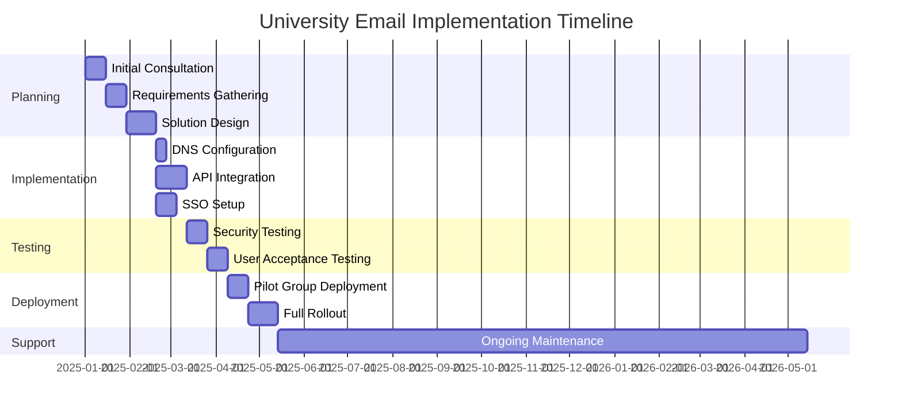
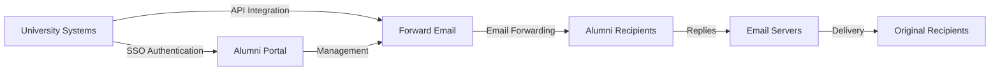

# Case-tutkimus: Miten sähköpostin välitys tukee alumnien sähköpostiratkaisuja huippuyliopistoille {#case-study-how-forward-email-powers-alumni-email-solutions-for-top-universities}


## Sisällysluettelo {#table-of-contents}

* [Esipuhe](#foreword)
* [Merkittäviä kustannussäästöjä vakaalla hinnoittelulla](#dramatic-cost-savings-with-stable-pricing)
  * [Yliopiston todelliset säästöt](#real-world-university-savings)
* [Yliopiston alumnien sähköpostihaaste](#the-university-alumni-email-challenge)
  * [Alumnien sähköposti-identiteetin arvo](#the-value-of-alumni-email-identity)
  * [Perinteiset ratkaisut epäonnistuvat](#traditional-solutions-fall-short)
  * [Sähköpostin edelleenlähetysratkaisu](#the-forward-email-solution)
* [Tekninen toteutus: Näin se toimii](#technical-implementation-how-it-works)
  * [Ydinarkkitehtuuri](#core-architecture)
  * [Integrointi yliopistojärjestelmiin](#integration-with-university-systems)
  * [API-pohjainen hallinta](#api-driven-management)
  * [DNS-konfigurointi ja -vahvistus](#dns-configuration-and-verification)
  * [Testaus ja laadunvarmistus](#testing-and-quality-assurance)
* [Toteutuksen aikataulu](#implementation-timeline)
* [Toteutusprosessi: Migraatiosta ylläpitoon](#implementation-process-from-migration-to-maintenance)
  * [Alustava arviointi ja suunnittelu](#initial-assessment-and-planning)
  * [Muuttoliikestrategia](#migration-strategy)
  * [Tekninen asennus ja konfigurointi](#technical-setup-and-configuration)
  * [Käyttäjäkokemuksen suunnittelu](#user-experience-design)
  * [Koulutus ja dokumentointi](#training-and-documentation)
  * [Jatkuva tuki ja optimointi](#ongoing-support-and-optimization)
* [Case-tutkimus: Cambridgen yliopisto](#case-study-university-of-cambridge)
  * [Haaste](#challenge)
  * [Ratkaisu](#solution)
  * [Tulokset](#results)
* [Yliopistojen ja alumnien edut](#benefits-for-universities-and-alumni)
  * [Yliopistoille](#for-universities)
  * [Alumneille](#for-alumni)
  * [Käyttöönottoasteet alumnien keskuudessa](#adoption-rates-among-alumni)
  * [Kustannussäästöt verrattuna aiempiin ratkaisuihin](#cost-savings-compared-to-previous-solutions)
* [Turvallisuus- ja yksityisyysnäkökohdat](#security-and-privacy-considerations)
  * [Tietosuojatoimenpiteet](#data-protection-measures)
  * [Vaatimustenmukaisuuskehys](#compliance-framework)
* [Tulevaisuuden kehitys](#future-developments)
* [Johtopäätös](#conclusion)

## Esipuhe {#foreword}

Olemme rakentaneet maailman turvallisimman, yksityisimmän ja joustavimman sähköpostin edelleenlähetyspalvelun arvostetuille yliopistoille ja niiden alumneille.

Korkeakoulutuksen kilpailukentässä elinikäisten yhteyksien ylläpitäminen alumnien kanssa ei ole vain perinnekysymys – se on strateginen välttämättömyys. Yksi konkreettisimmista tavoista, joilla yliopistot edistävät näitä yhteyksiä, on alumnien sähköpostiosoitteiden kautta, jotka tarjoavat valmistuneille digitaalisen identiteetin, joka heijastaa heidän akateemista perintöään.

Forward Emaililla olemme tehneet yhteistyötä joidenkin maailman arvostetuimpien oppilaitosten kanssa mullistaaksemme heidän alumnien sähköpostipalveluiden hallintansa. Yritystason sähköpostin edelleenlähetysratkaisumme tukee nyt [Cambridgen yliopisto](https://en.wikipedia.org/wiki/University_of_Cambridge)-, [Marylandin yliopisto](https://en.wikipedia.org/wiki/University_of_Maryland,\_College_Park)-, [Tuftsin yliopisto](https://en.wikipedia.org/wiki/Tufts_University)- ja [Swarthmore College](https://en.wikipedia.org/wiki/Swarthmore_College)-järjestelmien alumnien sähköpostijärjestelmiä, jotka palvelevat yhteensä tuhansia alumneja maailmanlaajuisesti.

Tässä blogikirjoituksessa tarkastellaan, miten yksityisyyteen keskittyvästä [avoimen lähdekoodin](https://en.wikipedia.org/wiki/Open-source_software)-sähköpostin edelleenlähetyspalvelustamme on tullut näiden oppilaitosten ensisijainen ratkaisu, sen teknisiä toteutuksia ja sen mullistavaa vaikutusta sekä hallinnolliseen tehokkuuteen että alumnien tyytyväisyyteen.

## Merkittäviä kustannussäästöjä vakaalla hinnoittelulla {#dramatic-cost-savings-with-stable-pricing}

Ratkaisumme taloudelliset hyödyt ovat huomattavat, erityisesti verrattuna perinteisten sähköpostipalveluntarjoajien jatkuvasti nouseviin hintoihin:

| Ratkaisu | Kustannukset alumnia kohden (vuosittainen) | Kustannukset 100 000 alumnille | Viimeaikaiset hinnankorotukset |
| ------------------------------ | --------------------------------------------------------------------------------------------------------- | ----------------------- | ---------------------------------------------------------------------------------------------------------------------------------------------------------------------------------------- |
| Google Workspace yrityksille | $72 | $7,200,000 | • 2019: G Suite Basic 5 dollarista 6 dollariin/kk (+20 %)<br>• 2023: Joustavat liittymät nousivat 20 %<br>• 2025: Business Plus 18 dollarista 26,40 dollariin/kk (+47 %) tekoälyominaisuuksilla |
| Google Workspace for Education | Ilmainen (Education Fundamentals)<br>3 $/opiskelija/vuosi (Education Standard)<br>5 $/opiskelija/vuosi (Education Plus) | Ilmainen - 500 000 dollaria | • Määräalennukset: 5 % 100–499 lisenssille<br>• Määräalennukset: 10 % yli 500 lisenssille<br>• Ilmainen taso rajoitettu ydinpalveluihin |
| Microsoft 365 Business | $60 | $6,000,000 | • 2023: Kaksi kertaa vuodessa tapahtuvat hintapäivitykset otettiin käyttöön<br>• 2025 (Tammikuu): Henkilökohtainen 6,99 dollarista 9,99 dollariin/kk (+43 %) Copilotin tekoälyn avulla<br>• 2025 (Huhtikuu): 5 %:n korotus kuukausittain maksettaviin vuosittaisiin sitoumuksiin |
| Microsoft 365 Education | Ilmainen (A1)<br>38–55 $/opettaja/vuosi (A3)<br>65–96 $/opettaja/vuosi (A5) | Ilmainen - 96 000 dollaria | • Opiskelijalisenssit sisältyvät usein opettajien ostoihin<br>• Räätälöity hinnoittelu volyymilisenssien kautta<br>• Ilmainen taso rajoitettu verkkoversioihin |
| Itse isännöity Exchange | $45 | $4,500,000 | Jatkuvat ylläpito- ja turvallisuuskustannukset nousevat jatkuvasti |
| **Edelleenlähetä sähköpostia yrityksille** | **Kiinteä 250 dollaria/kk** | **3 000 dollaria/vuosi** | **Ei hinnankorotuksia lanseerauksen jälkeen** |

### Yliopiston todelliset säästöt {#real-world-university-savings}

Näin paljon yhteistyökumppaniyliopistomme säästävät vuosittain valitsemalla sähköpostin edelleenlähetyksen perinteisten palveluntarjoajien sijaan:

| Yliopisto | Alumnien lukumäärä | Vuosittaiset kustannukset Googlen kanssa | Vuosittaiset kustannukset sähköpostin edelleenlähetyksellä | Vuosittaiset säästöt |
| ----------------------- | ------------ | ----------------------- | ------------------------------ | -------------- |
| Cambridgen yliopisto | 30,000 | $90,000 | $3,000 | $87,000 |
| Swarthmore College | 5,000 | $15,000 | $3,000 | $12,000 |
| Tuftsin yliopisto | 12,000 | $36,000 | $3,000 | $33,000 |
| Marylandin yliopisto | 25,000 | $75,000 | $3,000 | $72,000 |

> \[!NOTE]
> Sähköpostin välityspalvelu maksaa tyypillisesti vain 250 dollaria kuukaudessa ilman käyttäjäkohtaisia lisäkustannuksia, sallittujen API-hintojen rajoituksia ja ainoa lisäkustannus on tallennustila, jos tarvitset lisää Gt/Tt opiskelijoille (+3 dollaria per 10 Gt lisätallennustilaa). Käytämme NVMe SSD -asemia myös nopean IMAP/POP3/SMTP/CalDAV/CardDAV-tuen takaamiseksi.

> \[!IMPORTANT]
> Toisin kuin Google ja Microsoft, jotka ovat toistuvasti nostaneet hintojaan ja integroineet tekoälyominaisuuksia, jotka analysoivat dataasi, Forward Email pitää hinnoittelunsa vakaana ja yksityisyydensuoja on tiukasti keskiössä. Emme käytä tekoälyä, emme seuraa käyttömalleja emmekä tallenna lokeja tai sähköposteja levylle (kaikki käsittely tapahtuu muistissa), mikä varmistaa alumniviestinnän täydellisen yksityisyyden.

Tämä edustaa merkittävää kustannussäästöä perinteisiin sähköpostin isännöintiratkaisuihin verrattuna – varoja, joita yliopistot voivat ohjata apurahoihin, tutkimukseen tai muihin kriittisiin toimintoihin. Email Vendor Selectionin vuonna 2023 tekemän analyysin mukaan oppilaitokset etsivät yhä enemmän kustannustehokkaita vaihtoehtoja perinteisille sähköpostipalveluntarjoajille, koska hinnat nousevat edelleen tekoälyominaisuuksien integroinnin myötä ([Sähköpostitoimittajan valinta, 2023](https://www.emailvendorselection.com/email-service-provider-list/)).

## Yliopiston alumnien sähköpostihaaste {#the-university-alumni-email-challenge}

Yliopistoille elinikäisten sähköpostiosoitteiden tarjoaminen alumneille asettaa ainutlaatuisen joukon haasteita, joihin perinteiset sähköpostiratkaisut eivät pysty tehokkaasti vastaamaan. Kuten ServerFaultia käsittelevässä kattavassa keskustelussa todettiin, suuren käyttäjäkunnan omaavat yliopistot tarvitsevat erikoistuneita sähköpostiratkaisuja, jotka tasapainottavat suorituskyvyn, turvallisuuden ja kustannustehokkuuden ([Palvelinvika, 2009](https://serverfault.com/questions/97364/what-is-the-best-mail-server-for-a-university-with-a-large-amount-of-users)).

### Alumnien sähköposti-identiteetin arvo {#the-value-of-alumni-email-identity}

Alumnien sähköpostiosoitteilla (kuten `firstname.lastname@cl.cam.ac.uk` tai `username@terpalum.umd.edu`) on useita tärkeitä toimintoja:

* Ylläpitää yhteyttä yliopistoon ja brändi-identiteettiä
* Helpottaa jatkuvaa viestintää yliopiston kanssa
* Parantaa valmistuneiden ammatillista uskottavuutta
* Tukee alumniverkostoitumista ja yhteisöllisyyttä
* Tarjoaa vakaan ja elinikäisen yhteyspisteen

Tekaden (2020) tutkimus korostaa, että koulutussähköpostiosoitteet tarjoavat alumneille lukuisia etuja, kuten pääsyn akateemisiin resursseihin, ammatillisen uskottavuuden ja ainutlaatuisia alennuksia erilaisista palveluista ([Keskikokoinen, 2020](https://medium.com/coders-capsule/top-20-benefits-of-having-an-educational-email-address-91a09795e05))

> \[!TIP]
> Tutustu uuteen [AlumniEmail.com](https://alumniemail.com)-hakemistoomme, josta löydät kattavan resurssin yliopistojen alumnien sähköpostipalveluista. Löydät mukaan lukien asennusoppaat, parhaat käytännöt ja haettavan hakemiston alumnien sähköpostiverkkotunnuksista. Se toimii kaikkien alumnien sähköpostitietojen keskuksena.

### Perinteiset ratkaisut eivät riitä {#traditional-solutions-fall-short}

Perinteisillä sähköpostijärjestelmillä on useita rajoituksia, kun niitä sovelletaan alumnien sähköpostitarpeisiin:

* **Kustannusten kohtuuttomuus**: Käyttäjäkohtaisista lisensointimalleista tulee taloudellisesti kestämättömiä suurille alumniyhteisöille.
* **Hallinnollinen taakka**: Tuhansien tai miljoonien tilien hallinta vaatii merkittäviä IT-resursseja.
* **Tietoturvaongelmat**: Käyttämättömien tilien turvallisuuden ylläpitäminen lisää haavoittuvuutta.
* **Rajoitettu joustavuus**: Jäykät järjestelmät eivät pysty mukautumaan alumnien sähköpostin edelleenlähetyksen ainutlaatuisiin tarpeisiin.
* **Tietosuojaongelmat**: Monet palveluntarjoajat skannaavat sähköpostisisältöä mainostarkoituksiin.

Quoran keskustelu yliopistojen sähköpostien ylläpidosta paljastaa, että turvallisuusongelmat ovat merkittävä syy siihen, miksi yliopistot saattavat rajoittaa tai peruuttaa alumnien sähköpostiosoitteita, sillä käyttämättömät tilit voivat olla alttiita hakkeroinnille ja identiteettivarkauksille ([Quora, 2011](https://www.quora.com/Is-there-any-cost-for-a-college-or-university-to-maintain-edu-e-mail-addresses)).

### Sähköpostin edelleenlähetysratkaisu {#the-forward-email-solution}

Lähestymistapamme vastaa näihin haasteisiin perustavanlaatuisesti erilaisen mallin avulla:

* Sähköpostin edelleenlähetys hostingin sijaan
* Kiinteä hinnoittelu käyttäjäkohtaisten kustannusten sijaan
* Avoimen lähdekoodin arkkitehtuuri läpinäkyvyyden ja turvallisuuden takaamiseksi
* Tietosuoja ensin ilman sisällön skannausta
* Erikoisominaisuudet yliopistojen identiteetinhallintaan

## Tekninen toteutus: Toimintaperiaate {#technical-implementation-how-it-works}

Ratkaisumme hyödyntää hienostunutta mutta elegantin yksinkertaista teknistä arkkitehtuuria tarjotakseen luotettavan ja turvallisen sähköpostin edelleenlähetyksen laajassa mittakaavassa.

### Ydinarkkitehtuuri {#core-architecture}

Sähköpostin edelleenlähetysjärjestelmä koostuu useista keskeisistä osista:

* Hajautetut MX-palvelimet korkean käytettävyyden takaamiseksi
* Reaaliaikainen edelleenlähetys ilman viestien tallennusta
* Kattava sähköpostin todennus
* Mukautettujen verkkotunnusten ja aliverkkotunnusten tuki
* API-pohjainen tilinhallinta

ServerFaultin IT-ammattilaisten mukaan yliopistoille, jotka haluavat ottaa käyttöön omia sähköpostiratkaisujaan, Postfixia suositellaan parhaana sähköpostinsiirtoagenttina (MTA), kun taas Courier tai Dovecot ovat parempia IMAP/POP3-yhteyteen ([Palvelinvika, 2009](https://serverfault.com/questions/97364/what-is-the-best-mail-server-for-a-university-with-a-large-amount-of-users)). Ratkaisumme kuitenkin poistaa yliopistojen tarpeen hallita näitä monimutkaisia järjestelmiä itse.

### Integrointi yliopiston järjestelmiin {#integration-with-university-systems}

Olemme kehittäneet saumattomia integraatiopolkuja olemassa olevaan yliopistoinfrastruktuuriin:

* Automaattinen käyttöönotto [RESTful-rajapinta](https://forwardemail.net/email-api)-integraation kautta
* Yliopiston portaaleille mukautetut brändäysvaihtoehdot
* Joustava aliasten hallinta osastoille ja organisaatioille
* Eräoperaatiot tehokasta hallintaa varten

### API-pohjainen hallinta {#api-driven-management}

[RESTful-rajapinta](https://forwardemail.net/email-api)-kohteemme avulla yliopistot voivat automatisoida sähköpostien hallinnan:

```javascript
// Example: Creating a new alumni email address
const response = await fetch('https://forwardemail.net/api/v1/domains/example.edu/aliases', {
  method: 'POST',
  headers: {
    'Content-Type': 'application/json',
    'Authorization': `Basic ${Buffer.from(YOUR_API_TOKEN + ":").toString('base64')}`
  },
  body: JSON.stringify({
    name: 'alumni.john.smith',
    recipients: ['johnsmith@gmail.com'],
    has_recipient_verification: true
  })
});
```

### DNS-määritys ja -vahvistus {#dns-configuration-and-verification}

Oikea DNS-konfiguraatio on kriittisen tärkeää sähköpostin toimitukselle. Tiimimme auttaa seuraavissa asioissa:

* [DNS](https://en.wikipedia.org/wiki/Domain_Name_System)-kokoonpano, mukaan lukien MX-tietueet
* Kattava sähköpostin suojauksen toteutus avoimen lähdekoodin [sähköpostiauth](https://www.npmjs.com/package/mailauth)-paketillamme, joka on sähköpostin todennuksen umpikuja ja käsittelee seuraavat asiat:
* [SPF](https://en.wikipedia.org/wiki/Sender_Policy_Framework) (Sender Policy Framework) sähköpostihuijausten estämiseksi
* [DKIM](https://en.wikipedia.org/wiki/DomainKeys_Identified_Mail) (DomainKeys Identified Mail) sähköpostin todennukseen
* [DMARC](https://en.wikipedia.org/wiki/Email_authentication) (Domain-based Message Authentication, Reporting & Conformance) käytäntöjen valvontaan
* [MTA-STS](https://en.wikipedia.org/wiki/Opportunistic_TLS) (SMTP MTA Strict Transport Security) TLS-salauksen valvontaan
* [ARC](https://en.wikipedia.org/wiki/DomainKeys_Identified_Mail#Authenticated_Received_Chain) (Authenticated Received Chain) todennuksen ylläpitämiseksi viestien edelleenlähetyksen yhteydessä
* [SRS](https://en.wikipedia.org/wiki/Sender_Rewriting_Scheme) (Sender Rewriting Scheme) SPF-vahvistuksen säilyttämiseksi edelleenlähetyksen aikana
* [BIMI](https://en.wikipedia.org/wiki/Email_authentication) (Brand Indicators for Message Identification) logon näyttämiseen tuetuissa sähköpostiohjelmissa
* DNS TXT -tietueen vahvistus verkkotunnuksen omistajuudelle

`mailauth`-paketti (<http://npmjs.com/package/mailauth>) on täysin avoimen lähdekoodin ratkaisu, joka käsittelee kaikki sähköpostin todennuksen osa-alueet yhdessä integroidussa kirjastossa. Toisin kuin suljetut ratkaisut, tämä lähestymistapa varmistaa läpinäkyvyyden, säännölliset tietoturvapäivitykset ja täydellisen sähköpostin todennusprosessin hallinnan.

### Testaus ja laadunvarmistus {#testing-and-quality-assurance}

Ennen täyttä käyttöönottoa suoritamme perusteelliset testit:

* Sähköpostin toimitustestaus kokonaisvaltaisesti
* Kuormitustestaus suurten volyymien skenaarioissa
* Tietoturvan penetraatiotestaus
* API-integraation validointi
* Käyttäjien hyväksyntätestaus alumnien edustajien kanssa

## Toteutuksen aikajana {#implementation-timeline}



## Käyttöönottoprosessi: Siirrosta ylläpitoon {#implementation-process-from-migration-to-maintenance}

Rakenteinen käyttöönottoprosessimme varmistaa yliopistojen sujuvan siirtymisen ratkaisumme käyttöön.

### Alustava arviointi ja suunnittelu {#initial-assessment-and-planning}

Aloitamme yliopiston nykyisen sähköpostijärjestelmän, alumnitietokannan ja teknisten vaatimusten kattavalla arvioinnilla. Tämä vaihe sisältää:

* Sidosryhmien haastattelut IT-osaston, alumnisuhteiden ja hallinnon kanssa
* Olemassa olevan sähköposti-infrastruktuurin tekninen tarkastus
* Alumnitietojen kartoitus
* Tietoturvan ja vaatimustenmukaisuuden tarkastus
* Projektin aikataulu ja virstanpylväiden kehittäminen

### Siirtostrategia {#migration-strategy}

Arvioinnin perusteella kehitämme räätälöidyn migraatiostrategian, joka minimoi häiriöt ja varmistaa samalla täydellisen tietojen eheyden:

* Alumnikohorttien vaiheittainen migraatio
* Järjestelmien rinnakkainen toiminta siirtymän aikana
* Kattavat tietojen validointiprotokollat
* Varamenettelyt mahdollisten migraatio-ongelmien varalta
* Selkeä viestintäsuunnitelma kaikille sidosryhmille

### Tekninen asennus ja konfigurointi {#technical-setup-and-configuration}

Tekninen tiimimme hoitaa kaikki järjestelmän asennukseen liittyvät vaiheet:

* DNS-konfigurointi ja -vahvistus
* API-integraatio yliopiston järjestelmiin
* Mukautetun portaalin kehitys yliopiston brändäyksellä
* Sähköpostin todennuksen määritys (SPF, DKIM, DMARC)

### Käyttäjäkokemuksen suunnittelu {#user-experience-design}

Teemme tiivistä yhteistyötä yliopistojen kanssa luodaksemme intuitiivisia käyttöliittymiä sekä hallinnolle että alumneille:

* Räätälöidyt alumnien sähköpostiportaalit
* Yksinkertaistettu sähköpostin edelleenlähetyksen hallinta
* Mobiilipohjaiset mallit
* Saavutettavuusvaatimustenmukaisuus
* Monikielinen tuki tarvittaessa

### Koulutus ja dokumentaatio {#training-and-documentation}

Kattava koulutus varmistaa, että kaikki sidosryhmät osaavat käyttää järjestelmää tehokkaasti:

* Ylläpitäjäkoulutukset
* Tekninen dokumentaatio IT-henkilöstölle
* Käyttöoppaat alumneille
* Video-oppaat yleisiin tehtäviin
* Tietokannan kehittäminen

### Jatkuva tuki ja optimointi {#ongoing-support-and-optimization}

Yhteistyömme jatkuu myös toteutuksen jälkeen:

* 24/7 tekninen tuki
* Säännölliset järjestelmäpäivitykset ja tietoturvakorjaukset
* Suorituskyvyn seuranta ja optimointi
* Konsultointi sähköpostin parhaista käytännöistä
* Data-analytiikka ja raportointi

## Tapaustutkimus: Cambridgen yliopisto {#case-study-university-of-cambridge}

Cambridgen yliopisto etsi ratkaisua, jolla alumneille voitaisiin tarjota @cam.ac.uk-sähköpostiosoitteet ja samalla vähentää IT-kustannuksia ja -yleiskustannuksia.

### Haaste {#challenge}

Cambridge kohtasi useita haasteita aiemman alumnien sähköpostijärjestelmänsä kanssa:

* Korkeat käyttökustannukset erillisen sähköposti-infrastruktuurin ylläpidosta
* Tuhansien tilien hallinnan hallinnollinen taakka
* Käyttämättömien tilien turvallisuusongelmat
* Rajoitettu integrointi alumnitietokantajärjestelmiin
* Kasvavat tallennusvaatimukset

### Ratkaisu {#solution}

Forward Email toteutti kattavan ratkaisun:

* Sähköpostin edelleenlähetys kaikille @cam.ac.uk-alumniosoitteille
* Räätälöity portaali alumnien itsepalveluun
* API-integraatio Cambridgen alumnitietokantaan
* Kattava sähköpostin tietoturvan toteutus

### Tulokset {#results}

Käyttöönotto toi merkittäviä etuja:

* Merkittävä kustannussäästö edelliseen ratkaisuun verrattuna
* Sähköpostin toimitusvarmuus 99,9 %
* Yksinkertaistettu hallinta automaation avulla
* Parannettu tietoturva modernilla sähköpostin todennuksella
* Positiivista alumnipalautetta järjestelmän käytettävyydestä

## Yliopistojen ja alumnien edut {#benefits-for-universities-and-alumni}

Ratkaisumme tarjoaa konkreettisia etuja sekä oppilaitoksille että niiden valmistuneille.

### Yliopistoille {#for-universities}

* **Kustannustehokkuus**: Kiinteä hinnoittelu alumnien lukumäärästä riippumatta
* **Hallinnollinen helppous**: Automatisoitu hallinta API:n kautta
* **Parannettu turvallisuus**: Kattava sähköpostin todennus
* **Brändin yhtenäisyys**: Elinikäiset oppilaitoksen sähköpostiosoitteet
* **Alumnien sitouttaminen**: Vahvemmat yhteydet jatkuvan palvelun kautta

BulkSignaturen (2023) mukaan oppilaitoksille tarkoitetut sähköpostialustat tarjoavat merkittäviä etuja, kuten kustannustehokkuuden ilmaisten tai edullisten tilausten kautta, ajankäytön tehokkuuden joukkoviestintäominaisuuksien avulla sekä seurantaominaisuudet sähköpostin toimituksen ja sitoutumisen seuraamiseksi ([BulkSignature, 2023](https://bulksignature.com/blog/5-best-email-platforms-for-educational-institutions/)).

### Alumneille {#for-alumni}

* **Ammatillinen identiteetti**: Arvostettu yliopiston sähköpostiosoite
* **Sähköpostin jatkuvuus**: Välitä mihin tahansa henkilökohtaiseen sähköpostiin
* **Yksityisyyden suoja**: Ei sisällön skannausta tai tiedonlouhintaa
* **Yksinkertaistettu hallinta**: Helpot vastaanottajien päivitykset
* **Parannettu turvallisuus**: Moderni sähköpostin todennus

International Journal of Education & Literacy Studies -lehdessä julkaistu tutkimus korostaa asianmukaisen sähköpostiviestinnän merkitystä akateemisissa ympäristöissä ja toteaa, että sähköpostilukutaito on ratkaisevan tärkeä taito sekä opiskelijoille että alumneille ammatillisissa yhteyksissä ([IJELS, 2021](https://files.eric.ed.gov/fulltext/EJ1319324.pdf)).

### Käyttöönottoasteet alumnien keskuudessa {#adoption-rates-among-alumni}

Yliopistot raportoivat korkeista omaksumis- ja tyytyväisyysasteista alumniyhteisöjensä keskuudessa.

### Kustannussäästöt verrattuna aiempiin ratkaisuihin {#cost-savings-compared-to-previous-solutions}

Taloudellinen vaikutus on ollut huomattava, ja yliopistot raportoivat merkittävistä kustannussäästöistä aiempiin sähköpostiratkaisuihinsa verrattuna.

## Tietoturva- ja yksityisyysnäkökohdat {#security-and-privacy-considerations}

Oppilaitoksille alumnitietojen suojaaminen ei ole vain hyvä käytäntö – se on usein lakisääteinen vaatimus esimerkiksi GDPR:n kaltaisten eurooppalaisten asetusten nojalla.

### Tietosuojatoimenpiteet {#data-protection-measures}

Ratkaisumme sisältää useita suojauskerroksia:

* Päästä päähän -salaus kaikelle sähköpostiliikenteelle
* Ei sähköpostisisällön tallentamista palvelimillemme
* Säännölliset tietoturvatarkastukset ja penetraatiotestaus
* Kansainvälisten tietosuojastandardien noudattaminen
* Läpinäkyvä, avoimen lähdekoodin koodi tietoturvan varmentamiseen

> \[!WARNING]
> Monet sähköpostipalveluntarjoajat skannaavat sähköpostisisältöä mainostarkoituksiin tai tekoälymallien kouluttamiseksi. Tämä käytäntö herättää vakavia yksityisyyteen liittyviä huolenaiheita, erityisesti ammatillisessa ja akateemisessa viestinnässä. Forward Email ei koskaan skannaa sähköpostisisältöä ja käsittelee kaikki sähköpostit muistissa varmistaakseen täydellisen yksityisyyden.

### Vaatimustenmukaisuuskehys {#compliance-framework}

Noudatamme tarkasti asiaankuuluvia määräyksiä:

* GDPR-vaatimustenmukaisuus eurooppalaisille laitoksille
* SOC 2 Type II -sertifiointi
* Vuosittaiset tietoturva-arvioinnit
* Tietojenkäsittelysopimus (DPA) saatavilla osoitteessa [forwardemail.net/dpa](https://forwardemail.net/dpa)
* Säännölliset vaatimustenmukaisuuspäivitykset määräysten kehittyessä

## Tulevaisuuden kehitys {#future-developments}

Jatkamme alumnien sähköpostiratkaisumme parantamista uusilla ominaisuuksilla ja toiminnoilla:

* Parannettu analytiikka yliopiston hallinnolle
* Edistyneet tietojenkalastelunestosuojaukset
* Laajennetut API-ominaisuudet syvempää integraatiota varten
* Lisätodennusvaihtoehdot

## Johtopäätös {#conclusion}

Sähköpostin edelleenlähetys on mullistanut yliopistojen tavan tarjota ja hallita alumnien sähköpostipalveluita. Korvaamalla kalliin ja monimutkaisen sähköpostipalvelun tyylikkäällä ja turvallisella sähköpostin edelleenlähetyksellä olemme mahdollistaneet oppilaitosten tarjota elinikäisiä sähköpostiosoitteita kaikille alumneille ja samalla vähentäneet merkittävästi kustannuksia ja hallintokuluja.

Yhteistyökumppanimme arvostettujen oppilaitosten, kuten Cambridgen, Marylandin, Tuftsin ja Swarthmoren, kanssa osoittavat lähestymistapamme tehokkuuden erilaisissa oppimisympäristöissä. Yliopistojen kohtaaessa kasvavaa painetta ylläpitää alumniyhteyksiä ja samalla hallita kustannuksia, ratkaisumme tarjoaa houkuttelevan vaihtoehdon perinteisille sähköpostijärjestelmille.



Yliopistot, jotka ovat kiinnostuneita selvittämään, miten Forward Email voi mullistaa alumnien sähköpostipalvelunsa, voivat ottaa yhteyttä tiimiimme osoitteessa <support@forwardemail.net> tai käydä osoitteessa [forwardemail.net](https://forwardemail.net) saadaksesi lisätietoja yritysratkaisuistamme.