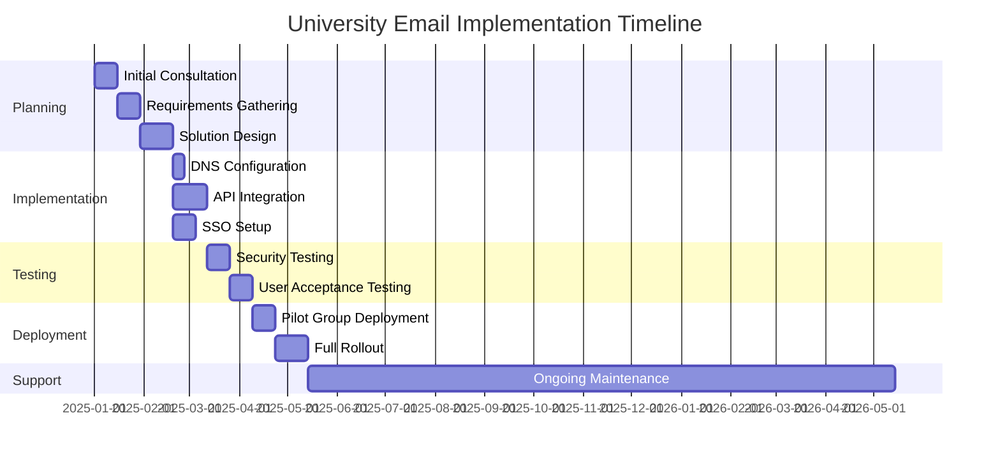
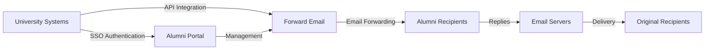

# Case Study: Kuinka Forward Email tehostaa alumnisähköpostiratkaisuja huippuyliopistoille {#case-study-how-forward-email-powers-alumni-email-solutions-for-top-universities}


## Sisällysluettelo {#table-of-contents}

* [Esipuhe](#foreword)
* [Dramaattiset kustannussäästöt vakaalla hinnoittelulla](#dramatic-cost-savings-with-stable-pricing)
  * [Todelliset yliopistojen säästöt](#real-world-university-savings)
* [Yliopiston alumnisähköpostin haaste](#the-university-alumni-email-challenge)
  * [Alumnisähköpostin identiteetin arvo](#the-value-of-alumni-email-identity)
  * [Perinteiset ratkaisut eivät riitä](#traditional-solutions-fall-short)
  * [Forward Email -ratkaisu](#the-forward-email-solution)
* [Tekninen toteutus: Kuinka se toimii](#technical-implementation-how-it-works)
  * [Ydinarkkitehtuuri](#core-architecture)
  * [Integraatio yliopistojärjestelmiin](#integration-with-university-systems)
  * [API-pohjainen hallinta](#api-driven-management)
  * [DNS-konfigurointi ja varmennus](#dns-configuration-and-verification)
  * [Testaus ja laadunvarmistus](#testing-and-quality-assurance)
* [Toteutusaikataulu](#implementation-timeline)
* [Toteutusprosessi: Siirtymästä ylläpitoon](#implementation-process-from-migration-to-maintenance)
  * [Alkukartoitus ja suunnittelu](#initial-assessment-and-planning)
  * [Siirtymästrategia](#migration-strategy)
  * [Tekninen asennus ja konfigurointi](#technical-setup-and-configuration)
  * [Käyttäjäkokemuksen suunnittelu](#user-experience-design)
  * [Koulutus ja dokumentaatio](#training-and-documentation)
  * [Jatkuva tuki ja optimointi](#ongoing-support-and-optimization)
* [Tapaustutkimus: Cambridgen yliopisto](#case-study-university-of-cambridge)
  * [Haaste](#challenge)
  * [Ratkaisu](#solution)
  * [Tulokset](#results)
* [Hyödyt yliopistoille ja alumneille](#benefits-for-universities-and-alumni)
  * [Yliopistoille](#for-universities)
  * [Alumneille](#for-alumni)
  * [Alumnien käyttöönoton tasot](#adoption-rates-among-alumni)
  * [Kustannussäästöt verrattuna aiempiin ratkaisuihin](#cost-savings-compared-to-previous-solutions)
* [Turvallisuus- ja tietosuunnäkökohdat](#security-and-privacy-considerations)
  * [Tietosuojatoimenpiteet](#data-protection-measures)
  * [Säädösten noudattaminen](#compliance-framework)
* [Tulevat kehitykset](#future-developments)
* [Yhteenveto](#conclusion)


## Esipuhe {#foreword}

Olemme rakentaneet maailman turvallisimman, yksityisimmän ja joustavimman sähköpostin edelleenlähetyspalvelun arvostetuille yliopistoille ja heidän alumneilleen.

Korkeakoulutuksen kilpailullisessa kentässä elinikäisten yhteyksien ylläpitäminen alumneihin ei ole pelkästään perinteen ylläpitämistä — se on strateginen välttämättömyys. Yksi konkreettisimmista tavoista, joilla yliopistot vahvistavat näitä yhteyksiä, on alumnisähköpostiosoitteiden tarjoaminen, joka antaa valmistuneille digitaalisen identiteetin, joka heijastaa heidän akateemista perintöään.

Forward Email on tehnyt yhteistyötä joidenkin maailman arvostetuimpien oppilaitosten kanssa mullistaakseen heidän alumnisähköpostipalvelujensa hallinnan. Yritystason sähköpostin edelleenlähetysratkaisumme tukee nyt alumnisähköpostijärjestelmiä [Cambridgen yliopistossa](https://en.wikipedia.org/wiki/University_of_Cambridge), [Marylandin yliopistossa](https://en.wikipedia.org/wiki/University_of_Maryland,_College_Park), [Tuftsin yliopistossa](https://en.wikipedia.org/wiki/Tufts_University) ja [Swarthmore Collegen](https://en.wikipedia.org/wiki/Swarthmore_College), palvellen yhteensä tuhansia alumneja maailmanlaajuisesti.

Tässä blogikirjoituksessa tarkastelemme, kuinka avoimen lähdekoodin, yksityisyyteen keskittynyt sähköpostin edelleenlähetyspalvelumme on muodostunut näiden oppilaitosten suosimaksi ratkaisuksi, teknisiä toteutuksia, jotka tekevät sen mahdolliseksi, sekä sen mullistavaa vaikutusta sekä hallinnolliseen tehokkuuteen että alumnien tyytyväisyyteen.


## Dramaattiset kustannussäästöt vakaalla hinnoittelulla {#dramatic-cost-savings-with-stable-pricing}
Ratkaisumme taloudelliset hyödyt ovat merkittäviä, erityisesti verrattuna perinteisten sähköpostipalveluntarjoajien jatkuvasti nouseviin hintoihin:

| Ratkaisu                      | Kustannus per alumnus (vuosittain)                                                                        | Kustannus 100 000 alumnille | Viimeaikaiset hinnankorotukset                                                                                                                                                           |
| ----------------------------- | --------------------------------------------------------------------------------------------------------- | ---------------------------- | ---------------------------------------------------------------------------------------------------------------------------------------------------------------------------------------- |
| Google Workspace for Business | 72 $                                                                                                      | 7 200 000 $                 | • 2019: G Suite Basic 5 dollarista 6 dollariin kuukaudessa (+20%)<br>• 2023: Joustavat suunnitelmat nousivat 20 %<br>• 2025: Business Plus 18 dollarista 26,40 dollariin kuukaudessa (+47 %) tekoälyominaisuuksilla |
| Google Workspace for Education| Ilmainen (Education Fundamentals)<br>3 $ / opiskelija / vuosi (Education Standard)<br>5 $ / opiskelija / vuosi (Education Plus) | Ilmainen - 500 000 $         | • Määräalennukset: 5 % 100–499 lisenssille<br>• Määräalennukset: 10 % 500+ lisenssille<br>• Ilmainen taso rajoittuu ydinkäyttöön                                                               |
| Microsoft 365 Business        | 60 $                                                                                                      | 6 000 000 $                 | • 2023: Otettiin käyttöön puolivuosittaiset hinnanpäivitykset<br>• 2025 (tammi): Personal 6,99 dollarista 9,99 dollariin kuukaudessa (+43 %) Copilot-tekoälyn kanssa<br>• 2025 (huhti): 5 % korotus vuosimaksuihin, jotka maksetaan kuukausittain |
| Microsoft 365 Education       | Ilmainen (A1)<br>38–55 $ / henkilökunta / vuosi (A3)<br>65–96 $ / henkilökunta / vuosi (A5)                | Ilmainen - 96 000 $          | • Opiskelijaluvat usein sisältyvät henkilökunnan ostoihin<br>• Räätälöity hinnoittelu määrälisensoinnin kautta<br>• Ilmainen taso rajoittuu verkkoversioihin                                  |
| Itseisännöity Exchange        | 45 $                                                                                                      | 4 500 000 $                 | Jatkuvat ylläpito- ja turvallisuuskustannukset kasvavat                                                                                                                                    |
| **Forward Email Enterprise**  | **Kiinteä 250 $/kk**                                                                                       | **3 000 $/vuosi**           | **Ei hinnankorotuksia lanseerauksesta lähtien**                                                                                                                                             |

### Todelliset yliopistosäästöt {#real-world-university-savings}

Näin paljon kumppaniyliopistomme säästävät vuosittain valitsemalla Forward Emailin perinteisten palveluntarjoajien sijaan:

| Yliopisto                | Alumni-määrä | Vuotuinen kustannus Googlella | Vuotuinen kustannus Forward Emaililla | Vuotuiset säästöt |
| ------------------------ | ------------ | ------------------------------ | ------------------------------------- | ----------------- |
| University of Cambridge  | 30 000       | 90 000 $                      | 3 000 $                              | 87 000 $          |
| Swarthmore College       | 5 000        | 15 000 $                      | 3 000 $                              | 12 000 $          |
| Tufts University         | 12 000       | 36 000 $                      | 3 000 $                              | 33 000 $          |
| University of Maryland   | 25 000       | 75 000 $                      | 3 000 $                              | 72 000 $          |

> \[!NOTE]
> Forward Email Enterprise maksaa tyypillisesti vain 250 $ kuukaudessa, ilman käyttäjäkohtaisia lisäkustannuksia, sallituilla API-nopeusrajoituksilla, ja ainoa lisäkustannus on tallennustila, jos tarvitset lisää GB/TB opiskelijoille (+3 $ per 10 GB lisätallennustilaa). Käytämme myös NVMe SSD -levyjä nopeaan IMAP/POP3/SMTP/CalDAV/CardDAV-tukeen.
> \[!IMPORTANT]
> Toisin kuin Google ja Microsoft, jotka ovat toistuvasti nostaneet hintojaan samalla kun ovat integroineet tekoälyominaisuuksia, jotka analysoivat tietojasi, Forward Email pitää hinnat vakaana tiukalla yksityisyydensuojan painotuksella. Emme käytä tekoälyä, emme seuraa käyttökuvioita, emmekä tallenna lokeja tai sähköposteja levylle (kaikki käsittely tapahtuu muistissa), mikä takaa täydellisen yksityisyyden alumniviestinnällesi.

Tämä edustaa merkittävää kustannussäästöä verrattuna perinteisiin sähköpostipalveluratkaisuihin — varoja, jotka yliopistot voivat ohjata stipendeihin, tutkimukseen tai muihin tehtävän kannalta kriittisiin toimintoihin. Vuoden 2023 Email Vendor Selectionin analyysin mukaan oppilaitokset etsivät yhä enemmän kustannustehokkaita vaihtoehtoja perinteisille sähköpostipalveluntarjoajille, kun hinnat jatkavat nousuaan tekoälyominaisuuksien integroinnin myötä ([Email Vendor Selection, 2023](https://www.emailvendorselection.com/email-service-provider-list/)).


## Yliopiston alumnisähköpostin haaste {#the-university-alumni-email-challenge}

Yliopistoille elinikäisten sähköpostiosoitteiden tarjoaminen alumneille aiheuttaa ainutlaatuisen joukon haasteita, joita perinteiset sähköpostiratkaisut eivät pysty tehokkaasti ratkaisemaan. Kuten kattavassa keskustelussa ServerFaultissa todetaan, suurilla käyttäjämäärillä varustetut yliopistot tarvitsevat erikoistuneita sähköpostiratkaisuja, jotka tasapainottavat suorituskyvyn, turvallisuuden ja kustannustehokkuuden ([ServerFault, 2009](https://serverfault.com/questions/97364/what-is-the-best-mail-server-for-a-university-with-a-large-amount-of-users)).

### Alumnisähköpostin arvon merkitys {#the-value-of-alumni-email-identity}

Alumnisähköpostiosoitteet (kuten `firstname.lastname@cl.cam.ac.uk` tai `username@terpalum.umd.edu`) palvelevat useita tärkeitä tarkoituksia:

* Ylläpitää yhteyttä instituutioon ja brändi-identiteettiä
* Mahdollistaa jatkuvan viestinnän yliopiston kanssa
* Parantaa valmistuneiden ammatillista uskottavuutta
* Tukee alumniverkostoitumista ja yhteisön rakentamista
* Tarjoaa vakaan, elinikäisen yhteyspisteen

Tekaden (2020) tutkimus korostaa, että koulutukselliset sähköpostiosoitteet tarjoavat alumneille lukuisia etuja, mukaan lukien pääsyn akateemisiin resursseihin, ammatillisen uskottavuuden ja eksklusiiviset alennukset erilaisista palveluista ([Medium, 2020](https://medium.com/coders-capsule/top-20-benefits-of-having-an-educational-email-address-91a09795e05)).

> \[!TIP]
> Vieraile uudessa [AlumniEmail.com](https://alumniemail.com) hakemistossamme, joka tarjoaa kattavan resurssin yliopistojen alumnisähköpostipalveluista, mukaan lukien asennusoppaat, parhaat käytännöt ja haettavan hakemiston alumnisähköpostin domaineista. Se toimii keskeisenä tietokeskuksena kaikelle alumnisähköpostiin liittyvälle tiedolle.

### Perinteiset ratkaisut eivät riitä {#traditional-solutions-fall-short}

Perinteiset sähköpostijärjestelmät kohtaavat useita rajoituksia sovellettaessa alumnisähköpostin tarpeisiin:

* **Kustannukset ovat liialliset**: Käyttäjäkohtaiset lisenssimallit muuttuvat taloudellisesti kestämättömiksi suurille alumnijoukoille
* **Hallinnollinen taakka**: Tuhansien tai miljoonien tilien hallinta vaatii merkittäviä IT-resursseja
* **Turvallisuusongelmat**: Lepotilassa olevien tilien turvallisuuden ylläpito lisää haavoittuvuutta
* **Rajoitettu joustavuus**: Jäykät järjestelmät eivät pysty mukautumaan alumnisähköpostin edelleenlähetyksen ainutlaatuisiin tarpeisiin
* **Yksityisyysongelmat**: Monet palveluntarjoajat skannaavat sähköpostisisältöjä mainostarkoituksiin

Quoran keskustelu yliopistojen sähköpostin ylläpidosta paljastaa, että turvallisuushuolilla on suuri merkitys siinä, miksi yliopistot saattavat rajoittaa tai peruuttaa alumnisähköpostiosoitteita, koska käyttämättömät tilit voivat olla alttiita hakkeroinnille ja identiteettivarkauksille ([Quora, 2011](https://www.quora.com/Is-there-any-cost-for-a-college-or-university-to-maintain-edu-e-mail-addresses)).

### Forward Email -ratkaisu {#the-forward-email-solution}

Lähestymistapamme vastaa näihin haasteisiin perustavanlaatuisesti erilaisella mallilla:

* Sähköpostin edelleenlähetys hostingin sijaan
* Kiinteähintainen hinnoittelu käyttäjäkohtaisen sijaan
* Avoimen lähdekoodin arkkitehtuuri läpinäkyvyyden ja turvallisuuden takaamiseksi
* Yksityisyys ensin -suunnittelu ilman sisällön skannausta
* Erikoisominaisuudet yliopiston identiteetin hallintaan


## Tekninen toteutus: Miten se toimii {#technical-implementation-how-it-works}
Ratkaisumme hyödyntää kehittynyttä mutta elegantisti yksinkertaista teknistä arkkitehtuuria tarjotakseen luotettavaa ja turvallista sähköpostin edelleenlähetystä suuressa mittakaavassa.

### Core Architecture {#core-architecture}

Forward Email -järjestelmä koostuu useista keskeisistä osista:

* Hajautetut MX-palvelimet korkean käytettävyyden takaamiseksi
* Reaaliaikainen edelleenlähetys ilman viestien tallennusta
* Kattava sähköpostin todennus
* Mukautettu verkkotunnus- ja aliverkkotunnustuki
* API-pohjainen tilinhallinta

IT-ammattilaisten ServerFault-sivustolla mukaan lukien, yliopistojen, jotka haluavat toteuttaa omat sähköpostiratkaisunsa, suositellaan Postfixiä parhaana Mail Transfer Agent (MTA) -ratkaisuna, kun taas Courier tai Dovecot ovat suosittuja IMAP/POP3-yhteyksiin ([ServerFault, 2009](https://serverfault.com/questions/97364/what-is-the-best-mail-server-for-a-university-with-a-large-amount-of-users)). Ratkaisumme kuitenkin poistaa tarpeen yliopistojen hallita näitä monimutkaisia järjestelmiä itse.

### Integration with University Systems {#integration-with-university-systems}

Olemme kehittäneet saumattomat integraatioreitit olemassa olevaan yliopiston infrastruktuuriin:

* Automaattinen provisiointi [RESTful API](https://forwardemail.net/email-api) -integraation kautta
* Mukautetut brändäysvaihtoehdot yliopiston portaaleille
* Joustava alias-hallinta osastoille ja organisaatioille
* Erätoiminnot tehokkaaseen hallinnointiin

### API-Driven Management {#api-driven-management}

[RESTful API](https://forwardemail.net/email-api) mahdollistaa yliopistoille sähköpostinhallinnan automatisoinnin:

```javascript
// Example: Creating a new alumni email address
const response = await fetch('https://forwardemail.net/api/v1/domains/example.edu/aliases', {
  method: 'POST',
  headers: {
    'Content-Type': 'application/json',
    'Authorization': `Basic ${Buffer.from(YOUR_API_TOKEN + ":").toString('base64')}`
  },
  body: JSON.stringify({
    name: 'alumni.john.smith',
    recipients: ['johnsmith@gmail.com'],
    has_recipient_verification: true
  })
});
```

### DNS Configuration and Verification {#dns-configuration-and-verification}

Oikea DNS-konfiguraatio on kriittinen sähköpostin toimitukselle. Tiimimme auttaa seuraavissa:

* [DNS](https://en.wikipedia.org/wiki/Domain_Name_System) -konfiguraatio, mukaan lukien MX-tietueet
* Kattava sähköpostin turvallisuuden toteutus avoimen lähdekoodin [mailauth](https://www.npmjs.com/package/mailauth) -pakettimme avulla, joka on sveitsiläinen linkkuveitsi sähköpostin todennukseen ja hoitaa:
  * [SPF](https://en.wikipedia.org/wiki/Sender_Policy_Framework) (Sender Policy Framework) sähköpostin väärentämisen estämiseksi
  * [DKIM](https://en.wikipedia.org/wiki/DomainKeys_Identified_Mail) (DomainKeys Identified Mail) sähköpostin todennukseen
  * [DMARC](https://en.wikipedia.org/wiki/Email_authentication) (Domain-based Message Authentication, Reporting & Conformance) politiikan noudattamiseen
  * [MTA-STS](https://en.wikipedia.org/wiki/Opportunistic_TLS) (SMTP MTA Strict Transport Security) TLS-salauksen pakottamiseen
  * [ARC](https://en.wikipedia.org/wiki/DomainKeys_Identified_Mail#Authenticated_Received_Chain) (Authenticated Received Chain) todennuksen ylläpitämiseen viestien edelleenlähetyksessä
  * [SRS](https://en.wikipedia.org/wiki/Sender_Rewriting_Scheme) (Sender Rewriting Scheme) SPF-validoinnin säilyttämiseen edelleenlähetyksen kautta
  * [BIMI](https://en.wikipedia.org/wiki/Email_authentication) (Brand Indicators for Message Identification) logon näyttämiseen tukevissa sähköpostiohjelmissa
* DNS TXT -tietueen vahvistus verkkotunnuksen omistajuuden varmistamiseksi

`mailauth`-paketti (<http://npmjs.com/package/mailauth>) on täysin avoimen lähdekoodin ratkaisu, joka hoitaa kaikki sähköpostin todennuksen osa-alueet yhdessä integroidussa kirjastossa. Toisin kuin suljetut ratkaisut, tämä lähestymistapa takaa läpinäkyvyyden, säännölliset tietoturvapäivitykset ja täydellisen hallinnan sähköpostin todennusprosessiin.

### Testing and Quality Assurance {#testing-and-quality-assurance}

Ennen täyttä käyttöönottoa suoritamme perusteelliset testaukset:

* Sähköpostin toimituksen end-to-end -testaus
* Kuormitustestaus suurten volyymien tilanteissa
* Tietoturvan penetraatiotestaus
* API-integraation validointi
* Käyttäjien hyväksymistestaus alumniedustajien kanssa
## Toteutusaikataulu {#implementation-timeline}


```mermaid
gantt
    title University Email Implementation Timeline
    dateFormat  YYYY-MM-DD
    section Planning
    Initial Consultation           :a1, 2025-01-01, 14d
    Requirements Gathering         :a2, after a1, 14d
    Solution Design                :a3, after a2, 21d
    section Implementation
    DNS Configuration              :b1, after a3, 7d
    API Integration                :b2, after a3, 21d
    SSO Setup                      :b3, after a3, 14d
    section Testing
    Security Testing               :c1, after b1 b2 b3, 14d
    User Acceptance Testing        :c2, after c1, 14d
    section Deployment
    Pilot Group Deployment         :d1, after c2, 14d
    Full Rollout                   :d2, after d1, 21d
    section Support
    Ongoing Maintenance            :e1, after d2, 365d
```


## Toteutusprosessi: Siirtymästä ylläpitoon {#implementation-process-from-migration-to-maintenance}

Rakenteellinen toteutusprosessimme varmistaa sujuvan siirtymän yliopistoille, jotka ottavat ratkaisumme käyttöön.

### Alustava arviointi ja suunnittelu {#initial-assessment-and-planning}

Aloitamme kattavalla arvioinnilla yliopiston nykyisestä sähköpostijärjestelmästä, alumnitietokannasta ja teknisistä vaatimuksista. Tämä vaihe sisältää:

* Sidosryhmähaastattelut IT:n, alumnisuhteiden ja hallinnon kanssa
* Nykyisen sähköpostiinfrastruktuurin tekninen auditointi
* Alumnitietojen kartoitus
* Turvallisuus- ja vaatimustenmukaisuuden tarkastus
* Projektin aikataulun ja virstanpylväiden laatiminen

### Siirtymäsuunnitelma {#migration-strategy}

Arvioinnin pohjalta kehitämme räätälöidyn siirtymäsuunnitelman, joka minimoi häiriöt ja varmistaa täydellisen tietojen eheyden:

* Vaiheittainen siirtymä alumniryhmittäin
* Rinnakkaisten järjestelmien käyttö siirtymävaiheen aikana
* Kattavat tietojen validointiprotokollat
* Varatoimenpiteet mahdollisissa siirtymäongelmissa
* Selkeä viestintäsuunnitelma kaikille sidosryhmille

### Tekninen käyttöönotto ja konfigurointi {#technical-setup-and-configuration}

Tekninen tiimimme hoitaa kaikki järjestelmän käyttöönottoon liittyvät asiat:

* DNS-konfigurointi ja varmennus
* API-integraatio yliopiston järjestelmiin
* Räätälöity portaalin kehitys yliopiston brändäyksellä
* Sähköpostin todennuksen käyttöönotto (SPF, DKIM, DMARC)

### Käyttäjäkokemuksen suunnittelu {#user-experience-design}

Teemme tiivistä yhteistyötä yliopistojen kanssa luodaksemme intuitiiviset käyttöliittymät sekä ylläpitäjille että alumneille:

* Räätälöidyt alumnisähköpostin portaalit brändäyksellä
* Yksinkertaistettu sähköpostin edelleenlähetyksen hallinta
* Mobiiliystävälliset suunnittelut
* Esteettömyysvaatimusten noudattaminen
* Monikielinen tuki tarvittaessa

### Koulutus ja dokumentaatio {#training-and-documentation}

Kattava koulutus varmistaa, että kaikki sidosryhmät osaavat käyttää järjestelmää tehokkaasti:

* Ylläpitäjien koulutustilaisuudet
* Tekninen dokumentaatio IT-henkilöstölle
* Käyttäjäoppaat alumneille
* Videotutorialit yleisistä tehtävistä
* Tietopankin kehitys

### Jatkuva tuki ja optimointi {#ongoing-support-and-optimization}

Yhteistyömme jatkuu pitkälle toteutuksen jälkeen:

* 24/7 tekninen tuki
* Säännölliset järjestelmäpäivitykset ja tietoturvakorjaukset
* Suorituskyvyn seuranta ja optimointi
* Konsultointi sähköpostin parhaista käytännöistä
* Datan analysointi ja raportointi


## Case Study: Cambridgen yliopisto {#case-study-university-of-cambridge}

Cambridgen yliopisto etsi ratkaisua tarjotakseen @cam.ac.uk -sähköpostiosoitteet alumneilleen samalla kun IT-kustannukset ja hallinnollinen taakka vähenisivät.

### Haaste {#challenge}

Cambridge kohtasi useita haasteita aiemman alumnisähköpostijärjestelmänsä kanssa:

* Korkeat käyttökustannukset erillisen sähköpostiinfrastruktuurin ylläpidosta
* Hallinnollinen taakka tuhansien tilien hallinnassa
* Turvallisuusongelmat käyttämättömien tilien kanssa
* Rajoitettu integraatio alumnitietokantajärjestelmiin
* Kasvavat tallennustarpeet

### Ratkaisu {#solution}

Forward Email toteutti kattavan ratkaisun:

* Sähköpostin edelleenlähetys kaikille @cam.ac.uk -alumniosoitteille
* Räätälöity portaalin brändäys alumnien itsepalvelua varten
* API-integraatio Cambridgen alumnitietokantaan
* Kattava sähköpostin tietoturvan toteutus

### Tulokset {#results}

Toteutus toi merkittäviä hyötyjä:
* Merkittävä kustannussäästö verrattuna aiempaan ratkaisuun
* 99,9 % sähköpostin toimitusvarmuus
* Hallinnan yksinkertaistaminen automaation avulla
* Parannettu turvallisuus nykyaikaisella sähköpostin todennuksella
* Positiivista palautetta alumneilta järjestelmän käytettävyydestä


## Hyödyt yliopistoille ja alumneille {#benefits-for-universities-and-alumni}

Ratkaisumme tarjoaa konkreettisia hyötyjä sekä oppilaitoksille että heidän valmistuneilleen.

### Yliopistoille {#for-universities}

* **Kustannustehokkuus**: Kiinteä hinnoittelu riippumatta alumnien määrästä
* **Hallinnollinen yksinkertaisuus**: Automaattinen hallinta API:n kautta
* **Parannettu turvallisuus**: Kattava sähköpostin todennus
* **Brändin yhdenmukaisuus**: Elinikäiset oppilaitoksen sähköpostiosoitteet
* **Alumnien sitouttaminen**: Vahvistetut yhteydet jatkuvan palvelun kautta

BulkSignaturein (2023) mukaan koulutuslaitosten sähköpostialustat tarjoavat merkittäviä etuja, kuten kustannustehokkuutta ilmaisten tai edullisten suunnitelmien kautta, ajansäästöä massaviestinnän mahdollisuuksien ansiosta sekä seurantatoimintoja sähköpostin toimituksen ja sitoutumisen valvomiseksi ([BulkSignature, 2023](https://bulksignature.com/blog/5-best-email-platforms-for-educational-institutions/)).

### Alumneille {#for-alumni}

* **Ammatillinen identiteetti**: Arvostettu yliopiston sähköpostiosoite
* **Sähköpostin jatkuvuus**: Uudelleenohjaus mihin tahansa henkilökohtaiseen sähköpostiin
* **Yksityisyyden suoja**: Ei sisällön skannausta tai tiedonlouhintaa
* **Yksinkertaistettu hallinta**: Helppo vastaanottajien päivitys
* **Parannettu turvallisuus**: Nykyaikainen sähköpostin todennus

International Journal of Education & Literacy Studies -lehden tutkimus korostaa asianmukaisen sähköpostiviestinnän merkitystä akateemisissa ympäristöissä ja toteaa, että sähköpostin lukutaito on tärkeä taito sekä opiskelijoille että alumneille ammatillisissa yhteyksissä ([IJELS, 2021](https://files.eric.ed.gov/fulltext/EJ1319324.pdf)).

### Alumnien käyttöönoton tasot {#adoption-rates-among-alumni}

Yliopistot raportoivat korkeista käyttöönoton ja tyytyväisyyden tasoista alumnien keskuudessa.

### Kustannussäästöt verrattuna aiempiin ratkaisuihin {#cost-savings-compared-to-previous-solutions}

Taloudellinen vaikutus on ollut merkittävä, ja yliopistot raportoivat huomattavia kustannussäästöjä verrattuna aiempiin sähköpostiratkaisuihinsa.


## Turvallisuus- ja tietosuunnitelmat {#security-and-privacy-considerations}

Koulutuslaitoksille alumnien tietojen suojaaminen ei ole pelkästään hyvää käytäntöä — se on usein myös lakisääteinen vaatimus esimerkiksi Euroopan GDPR-säädösten nojalla.

### Tietosuojatoimenpiteet {#data-protection-measures}

Ratkaisumme sisältää useita turvakerroksia:

* Päästä päähän -salauksen kaikelle sähköpostiliikenteelle
* Ei sähköpostisisällön tallennusta palvelimillamme
* Säännölliset turvallisuustarkastukset ja tunkeutumistestaukset
* Kansainvälisten tietosuojastandardien noudattaminen
* Läpinäkyvä, avoimen lähdekoodin koodi turvallisuuden varmistamiseksi

> \[!WARNING]
> Monet sähköpostipalveluntarjoajat skannaavat sähköpostisisältöjä mainostarkoituksiin tai tekoälymallien kouluttamiseen. Tämä käytäntö herättää vakavia yksityisyydensuojahuolia, erityisesti ammatillisessa ja akateemisessa viestinnässä. Forward Email ei koskaan skannaa sähköpostisisältöjä ja käsittelee kaikki sähköpostit muistissa täydellisen yksityisyyden varmistamiseksi.

### Säädösten noudattaminen {#compliance-framework}

Noudatamme tiukasti asiaankuuluvia säädöksiä:

* GDPR-vaatimustenmukaisuus eurooppalaisille oppilaitoksille
* SOC 2 Type II -sertifiointi
* Vuosittaiset turvallisuusarvioinnit
* Tietojenkäsittelysopimus (DPA) saatavilla osoitteessa [forwardemail.net/dpa](https://forwardemail.net/dpa)
* Säännölliset päivitykset säädösten muuttuessa


## Tulevat kehityssuunnat {#future-developments}

Jatkamme alumnisähköpostiratkaisumme kehittämistä uusilla ominaisuuksilla ja kyvykkyyksillä:

* Parannetut analytiikkatyökalut yliopiston ylläpitäjille
* Kehittyneet kalastelunestotoiminnot
* Laajennetut API-ominaisuudet syvempään integraatioon
* Lisäautentikointivaihtoehdot


## Yhteenveto {#conclusion}

Forward Email on mullistanut tavan, jolla yliopistot tarjoavat ja hallinnoivat alumnisähköpostipalveluita. Korvaamalla kalliit ja monimutkaiset sähköpostipalvelut tyylikkäällä, turvallisella sähköpostin uudelleenohjauksella olemme mahdollistaneet oppilaitoksille elinikäisten sähköpostiosoitteiden tarjoamisen kaikille alumneille samalla kun kustannukset ja hallinnollinen taakka ovat vähentyneet merkittävästi.
Kumppanuutemme arvostettujen laitosten, kuten Cambridgen, Marylandin, Tuftsin ja Swarthmoren kanssa osoittavat lähestymistapamme tehokkuuden erilaisissa koulutusympäristöissä. Yliopistojen kohdatessa kasvavaa painetta ylläpitää alumnisuhteita samalla kun kustannuksia hallitaan, ratkaisumme tarjoaa vakuuttavan vaihtoehdon perinteisille sähköpostijärjestelmille.


```mermaid
flowchart LR
    A[University Systems] -->|API Integration| B[Forward Email]
    B -->|Email Forwarding| C[Alumni Recipients]
    C -->|Replies| D[Email Servers]
    D -->|Delivery| E[Original Recipients]
    F[Alumni Portal] -->|Management| B
    A -->|SSO Authentication| F
```

Yliopistoille, jotka ovat kiinnostuneita tutkimaan, miten Forward Email voi muuttaa heidän alumnisähköpostipalvelunsa, ota yhteyttä tiimiimme osoitteessa <support@forwardemail.net> tai vieraile osoitteessa [forwardemail.net](https://forwardemail.net) saadaksesi lisätietoja yritysratkaisuistamme.
