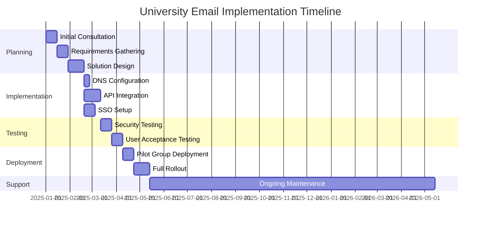
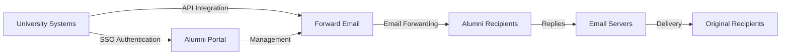

# Étude de cas : Comment Forward Email optimise les solutions de messagerie des anciens élèves pour les meilleures universités {#case-study-how-forward-email-powers-alumni-email-solutions-for-top-universities}


## Table des matières {#table-of-contents}

* [Avant-propos](#foreword)
* [Des économies de coûts spectaculaires grâce à des prix stables](#dramatic-cost-savings-with-stable-pricing)
  * [Économies universitaires concrètes](#real-world-university-savings)
* [Le défi des e-mails des anciens étudiants de l'université](#the-university-alumni-email-challenge)
  * [La valeur de l'identité électronique des anciens élèves](#the-value-of-alumni-email-identity)
  * [Les solutions traditionnelles sont insuffisantes](#traditional-solutions-fall-short)
  * [La solution de transfert d'e-mails](#the-forward-email-solution)
* [Mise en œuvre technique : comment cela fonctionne](#technical-implementation-how-it-works)
  * [Architecture de base](#core-architecture)
  * [Intégration avec les systèmes universitaires](#integration-with-university-systems)
  * [Gestion pilotée par API](#api-driven-management)
  * [Configuration et vérification DNS](#dns-configuration-and-verification)
  * [Tests et assurance qualité](#testing-and-quality-assurance)
* [Calendrier de mise en œuvre](#implementation-timeline)
* [Processus de mise en œuvre : de la migration à la maintenance](#implementation-process-from-migration-to-maintenance)
  * [Évaluation initiale et planification](#initial-assessment-and-planning)
  * [Stratégie de migration](#migration-strategy)
  * [Installation et configuration techniques](#technical-setup-and-configuration)
  * [Conception de l'expérience utilisateur](#user-experience-design)
  * [Formation et documentation](#training-and-documentation)
  * [Support et optimisation continus](#ongoing-support-and-optimization)
* [Étude de cas : Université de Cambridge](#case-study-university-of-cambridge)
  * [Défi](#challenge)
  * [Solution](#solution)
  * [Résultats](#results)
* [Avantages pour les universités et les anciens élèves](#benefits-for-universities-and-alumni)
  * [Pour les universités](#for-universities)
  * [Pour les anciens élèves](#for-alumni)
  * [Taux d'adoption parmi les anciens élèves](#adoption-rates-among-alumni)
  * [Économies de coûts par rapport aux solutions précédentes](#cost-savings-compared-to-previous-solutions)
* [Considérations relatives à la sécurité et à la confidentialité](#security-and-privacy-considerations)
  * [Mesures de protection des données](#data-protection-measures)
  * [Cadre de conformité](#compliance-framework)
* [Développements futurs](#future-developments)
* [Conclusion](#conclusion)

## Avant-propos {#foreword}

Nous avons créé le service de transfert de courrier électronique le plus sécurisé, privé et flexible au monde pour les universités prestigieuses et leurs anciens élèves.

Dans le paysage concurrentiel de l'enseignement supérieur, entretenir des liens durables avec les anciens élèves n'est pas seulement une question de tradition : c'est un impératif stratégique. L'un des moyens les plus concrets pour les universités de favoriser ces liens est l'utilisation des adresses e-mail des anciens élèves, qui offrent aux diplômés une identité numérique reflétant leur parcours académique.

Chez Forward Email, nous avons collaboré avec certains des établissements d'enseignement les plus prestigieux au monde pour révolutionner la gestion de leurs services de messagerie pour les anciens élèves. Notre solution de transfert d'e-mails professionnelle alimente désormais les systèmes de messagerie des anciens élèves des établissements [Université de Cambridge](https://en.wikipedia.org/wiki/University_of_Cambridge), [Université du Maryland](https://en.wikipedia.org/wiki/University_of_Maryland,\_College_Park), [Université Tufts](https://en.wikipedia.org/wiki/Tufts_University) et [Collège Swarthmore](https://en.wikipedia.org/wiki/Swarthmore_College), desservant collectivement des milliers d'anciens élèves dans le monde entier.

Cet article de blog explore comment notre service de transfert de courrier électronique axé sur la confidentialité [open source](https://en.wikipedia.org/wiki/Open-source_software) est devenu la solution préférée de ces institutions, les implémentations techniques qui le rendent possible et l'impact transformateur qu'il a eu sur l'efficacité administrative et la satisfaction des anciens élèves.

## Économies de coûts spectaculaires grâce à des prix stables {#dramatic-cost-savings-with-stable-pricing}

Les avantages financiers de notre solution sont substantiels, surtout si on les compare aux prix en constante augmentation des fournisseurs de messagerie traditionnels :

| Solution | Coût par ancien élève (annuel) | Coût pour 100 000 anciens élèves | Augmentations de prix récentes |
| ------------------------------ | --------------------------------------------------------------------------------------------------------- | ----------------------- | ---------------------------------------------------------------------------------------------------------------------------------------------------------------------------------------- |
| Google Workspace pour les entreprises | $72 | $7,200,000 | • 2019 : G Suite Basic de 5 $ à 6 $/mois (+ 20 %)<br>• 2023 : Forfaits flexibles augmentés de 20 %<br>• 2025 : Business Plus de 18 $ à 26,40 $/mois (+ 47 %) avec fonctionnalités d'IA |
| Google Workspace pour l'éducation | Gratuit (Fondamentaux de l'éducation)<br>3 $/étudiant/an (Éducation Standard)<br>5 $/étudiant/an (Éducation Plus) | Gratuit - 500 000 $ | • Remises sur volume : 5 % pour 100 à 499 licences<br>• Remises sur volume : 10 % pour 500 licences et plus<br>• Offre gratuite limitée aux services de base |
| Microsoft 365 Business | $60 | $6,000,000 | • 2023 : Mises à jour tarifaires semestrielles introduites<br>• 2025 (janv.) : Forfait personnel de 6,99 $ à 9,99 $/mois (+ 43 %) avec Copilot AI<br>• 2025 (avr.) : Augmentation de 5 % des engagements annuels payés mensuellement |
| Microsoft 365 Éducation | Gratuit (A1)<br>38-55 $/professeur/an (A3)<br>65-96 $/professeur/an (A5) | Gratuit - 96 000 $ | • Licences étudiantes souvent incluses avec les achats des professeurs<br>• Tarification personnalisée grâce aux licences en volume<br>• Niveau gratuit limité aux versions Web |
| Échange auto-hébergé | $45 | $4,500,000 | Les coûts de maintenance et de sécurité continuent d'augmenter |
| **Transférer le courrier électronique de l'entreprise** | **Fixe 250 $/mois** | **3 000 $/an** | **Aucune augmentation de prix depuis le lancement** |

### Économies universitaires réelles {#real-world-university-savings}

Voici combien nos universités partenaires économisent chaque année en choisissant Forward Email plutôt que les fournisseurs traditionnels :

| Université | Nombre d'anciens élèves | Coût annuel avec Google | Coût annuel avec transfert d'e-mail | Économies annuelles |
| ----------------------- | ------------ | ----------------------- | ------------------------------ | -------------- |
| Université de Cambridge | 30,000 | $90,000 | $3,000 | $87,000 |
| Collège Swarthmore | 5,000 | $15,000 | $3,000 | $12,000 |
| Université Tufts | 12,000 | $36,000 | $3,000 | $33,000 |
| Université du Maryland | 25,000 | $75,000 | $3,000 | $72,000 |

> \[!NOTE]
> Le service de transfert d'e-mails pour entreprise ne coûte généralement que 250 $/mois, sans frais supplémentaires par utilisateur, avec des limitations de débit API autorisées. Le seul coût supplémentaire est le stockage si vous avez besoin de Go/To supplémentaires pour les étudiants (+ 3 $ par tranche de 10 Go de stockage supplémentaire). Nous utilisons également des disques SSD NVMe pour une prise en charge rapide des protocoles IMAP/POP3/SMTP/CalDAV/CardDAV.

> \[!IMPORTANT]
> Contrairement à Google et Microsoft, qui ont régulièrement augmenté leurs tarifs tout en intégrant des fonctionnalités d'IA analysant vos données, Forward Email maintient des tarifs stables et une attention particulière à la confidentialité. Nous n'utilisons pas d'IA, ne suivons pas les habitudes d'utilisation et ne stockons ni journaux ni e-mails sur disque (tout le traitement est effectué en mémoire), garantissant ainsi une confidentialité totale de vos communications avec les anciens élèves.

Cela représente une réduction significative des coûts par rapport aux solutions d'hébergement de messagerie traditionnelles : les universités peuvent ainsi réaffecter des fonds à des bourses d'études, à la recherche ou à d'autres activités essentielles. Selon une analyse réalisée en 2023 par Email Vendor Selection, les établissements d'enseignement recherchent de plus en plus des alternatives rentables aux fournisseurs de messagerie traditionnels, car les prix continuent d'augmenter avec l'intégration de fonctionnalités d'IA ([Sélection des fournisseurs de courrier électronique, 2023](https://www.emailvendorselection.com/email-service-provider-list/)).

## Le défi des e-mails des anciens élèves de l'université {#the-university-alumni-email-challenge}

Pour les universités, fournir des adresses e-mail permanentes aux anciens élèves présente des défis uniques que les solutions de messagerie traditionnelles peinent à relever efficacement. Comme indiqué dans une discussion approfondie sur ServerFault, les universités disposant d'une base d'utilisateurs importante ont besoin de solutions de messagerie spécialisées alliant performances, sécurité et rentabilité ([ServerFault, 2009](https://serverfault.com/questions/97364/what-is-the-best-mail-server-for-a-university-with-a-large-amount-of-users)).

### La valeur de l'identité de messagerie électronique des anciens élèves {#the-value-of-alumni-email-identity}

Les adresses e-mail des anciens élèves (comme `firstname.lastname@cl.cam.ac.uk` ou `username@terpalum.umd.edu`) remplissent plusieurs fonctions importantes :

* Maintenir le lien institutionnel et l'identité de marque
* Faciliter la communication continue avec l'université
* Améliorer la crédibilité professionnelle des diplômés
* Soutenir le réseautage des anciens élèves et le développement de la communauté
* Offrir un point de contact stable et permanent

Une étude de Tekade (2020) souligne que les adresses e-mail éducatives offrent de nombreux avantages aux anciens élèves, notamment l'accès aux ressources académiques, la crédibilité professionnelle et des remises exclusives sur divers services ([Moyen, 2020](https://medium.com/coders-capsule/top-20-benefits-of-having-an-educational-email-address-91a09795e05)).

> \[!TIP]
> Consultez notre nouveau répertoire [AlumniEmail.com](https://alumniemail.com) pour une ressource complète sur les services de messagerie des anciens étudiants, incluant des guides de configuration, des bonnes pratiques et un répertoire consultable des domaines de messagerie des anciens étudiants. Ce répertoire centralise toutes les informations relatives à la messagerie des anciens étudiants.

### Les solutions traditionnelles sont insuffisantes {#traditional-solutions-fall-short}

Les systèmes de messagerie conventionnels présentent plusieurs limites lorsqu'ils sont appliqués aux besoins de messagerie des anciens élèves :

* **Coût prohibitif** : Les modèles de licences par utilisateur deviennent financièrement insoutenables pour les grandes bases d'anciens élèves.
* **Charge administrative** : La gestion de milliers, voire de millions de comptes, nécessite des ressources informatiques importantes.
* **Problèmes de sécurité** : Le maintien de la sécurité des comptes inactifs accroît la vulnérabilité.
* **Flexibilité limitée** : Les systèmes rigides ne peuvent s'adapter aux besoins spécifiques de transfert d'e-mails des anciens élèves.
* **Problèmes de confidentialité** : De nombreux fournisseurs analysent le contenu des e-mails à des fins publicitaires.

Une discussion Quora sur la maintenance des e-mails universitaires révèle que les problèmes de sécurité sont l'une des principales raisons pour lesquelles les universités peuvent limiter ou annuler les adresses e-mail des anciens élèves, car les comptes inutilisés peuvent être vulnérables au piratage et au vol d'identité ([Quora, 2011](https://www.quora.com/Is-there-any-cost-for-a-college-or-university-to-maintain-edu-e-mail-addresses)).

### La solution de transfert d'e-mails {#the-forward-email-solution}

Notre approche répond à ces défis à travers un modèle fondamentalement différent :

* Transfert d'e-mails plutôt qu'hébergement
* Tarification forfaitaire plutôt que par utilisateur
* Architecture open source pour la transparence et la sécurité
* Conception axée sur la confidentialité, sans analyse de contenu
* Fonctionnalités spécialisées pour la gestion des identités universitaires

Implémentation technique de ## : comment cela fonctionne {#technical-implementation-how-it-works}

Notre solution s'appuie sur une architecture technique sophistiquée mais élégamment simple pour fournir un transfert de courrier électronique fiable et sécurisé à grande échelle.

### Architecture de base {#core-architecture}

Le système de transfert de courrier électronique se compose de plusieurs éléments clés :

* Serveurs MX distribués pour une haute disponibilité
* Transfert en temps réel sans stockage de messages
* Authentification complète des e-mails
* Prise en charge de domaines et de sous-domaines personnalisés
* Gestion de compte pilotée par API

Selon les professionnels de l'informatique sur ServerFault, pour les universités souhaitant mettre en œuvre leurs propres solutions de messagerie, Postfix est recommandé comme agent de transfert de courrier (MTA), tandis que Courier ou Dovecot sont privilégiés pour l'accès IMAP/POP3 ([ServerFault, 2009](https://serverfault.com/questions/97364/what-is-the-best-mail-server-for-a-university-with-a-large-amount-of-users)). Cependant, notre solution évite aux universités de gérer elles-mêmes ces systèmes complexes.

### Intégration avec les systèmes universitaires {#integration-with-university-systems}

Nous avons développé des parcours d’intégration transparents avec l’infrastructure universitaire existante :

* Provisionnement automatisé grâce à l'intégration de [API RESTful](https://forwardemail.net/email-api)
* Options de personnalisation pour les portails universitaires
* Gestion flexible des alias pour les départements et les organisations
* Opérations par lots pour une administration efficace

### Gestion pilotée par API {#api-driven-management}

Notre [API RESTful](https://forwardemail.net/email-api) permet aux universités d'automatiser la gestion des e-mails :

```javascript
// Example: Creating a new alumni email address
const response = await fetch('https://forwardemail.net/api/v1/domains/example.edu/aliases', {
  method: 'POST',
  headers: {
    'Content-Type': 'application/json',
    'Authorization': `Basic ${Buffer.from(YOUR_API_TOKEN + ":").toString('base64')}`
  },
  body: JSON.stringify({
    name: 'alumni.john.smith',
    recipients: ['johnsmith@gmail.com'],
    has_recipient_verification: true
  })
});
```

### Configuration et vérification DNS {#dns-configuration-and-verification}

Une configuration DNS adéquate est essentielle à la distribution des e-mails. Notre équipe vous accompagne dans les domaines suivants :

* Configuration de [DNS](https://en.wikipedia.org/wiki/Domain_Name_System) incluant les enregistrements MX
* Mise en œuvre complète de la sécurité des e-mails grâce à notre package open source [authentification par courrier](https://www.npmjs.com/package/mailauth), véritable couteau suisse pour l'authentification des e-mails. Il gère :
* [SPF](https://en.wikipedia.org/wiki/Sender_Policy_Framework) (Sender Policy Framework) pour empêcher l'usurpation d'identité des e-mails
* [DKIM](https://en.wikipedia.org/wiki/DomainKeys_Identified_Mail) (DomainKeys Identified Mail) pour l'authentification des e-mails
* [DMARC](https://en.wikipedia.org/wiki/Email_authentication) (Domain-based Message Authentication, Reporting & Conformance) pour l'application des politiques
* [MTA-STS](https://en.wikipedia.org/wiki/Opportunistic_TLS) (SMTP MTA Strict Transport Security) pour appliquer le chiffrement TLS
* [ARC](https://en.wikipedia.org/wiki/DomainKeys_Identified_Mail#Authenticated_Received_Chain) (Authenticated Received Chain) pour maintenir l'authentification lors du transfert des messages
* [SRS](https://en.wikipedia.org/wiki/Sender_Rewriting_Scheme) (Sender Rewriting Scheme) pour préserver la validation SPF lors du transfert
* [BIMI](https://en.wikipedia.org/wiki/Email_authentication) (Brand Indicators for Message Identification) pour l'affichage du logo dans les clients de messagerie compatibles
* Vérification de l'enregistrement DNS TXT pour la propriété du domaine

Le package `mailauth` (<http://npmjs.com/package/mailauth>) est une solution entièrement open source qui gère tous les aspects de l'authentification des e-mails dans une bibliothèque intégrée. Contrairement aux solutions propriétaires, cette approche garantit la transparence, des mises à jour de sécurité régulières et un contrôle total du processus d'authentification des e-mails.

### Tests et assurance qualité {#testing-and-quality-assurance}

Avant le déploiement complet, nous effectuons des tests rigoureux :

* Tests de distribution des e-mails de bout en bout
* Tests de charge pour les scénarios à volume élevé
* Tests de pénétration de sécurité
* Validation de l'intégration des API
* Tests d'acceptation utilisateur avec des représentants des anciens élèves

## Calendrier de mise en œuvre de {#implementation-timeline}



Processus d'implémentation ## : de la migration à la maintenance {#implementation-process-from-migration-to-maintenance}

Notre processus de mise en œuvre structuré garantit une transition en douceur pour les universités qui adoptent notre solution.

### Évaluation initiale et planification {#initial-assessment-and-planning}

Nous commençons par une évaluation complète du système de messagerie actuel de l'université, de la base de données des anciens élèves et des exigences techniques. Cette phase comprend :

* Entretiens avec les parties prenantes (services informatiques, relations avec les anciens élèves et administration)
* Audit technique de l'infrastructure de messagerie existante
* Cartographie des données des dossiers des anciens élèves
* Examen de la sécurité et de la conformité
* Élaboration du calendrier et des étapes clés du projet

### Stratégie de migration {#migration-strategy}

Sur la base de l’évaluation, nous élaborons une stratégie de migration sur mesure qui minimise les perturbations tout en garantissant l’intégrité complète des données :

* Migration progressive par cohortes d'anciens élèves
* Fonctionnement parallèle des systèmes pendant la transition
* Protocoles complets de validation des données
* Procédures de secours en cas de problème de migration
* Plan de communication clair pour toutes les parties prenantes

### Configuration et installation techniques {#technical-setup-and-configuration}

Notre équipe technique gère tous les aspects de la configuration du système :

* Configuration et vérification DNS
* Intégration API aux systèmes universitaires
* Développement d'un portail personnalisé à l'image de l'université
* Configuration de l'authentification des e-mails (SPF, DKIM, DMARC)

### Conception de l'expérience utilisateur {#user-experience-design}

Nous travaillons en étroite collaboration avec les universités pour créer des interfaces intuitives pour les administrateurs et les anciens élèves :

* Portails de messagerie personnalisés pour les anciens élèves
* Gestion simplifiée du transfert des e-mails
* Conceptions adaptées aux mobiles
* Conformité aux normes d'accessibilité
* Prise en charge multilingue si nécessaire

### Formation et documentation {#training-and-documentation}

Une formation complète garantit que toutes les parties prenantes peuvent utiliser efficacement le système :

* Formations administrateurs
* Documentation technique pour le personnel informatique
* Guides d'utilisation pour les anciens élèves
* Tutoriels vidéo pour les tâches courantes
* Développement d'une base de connaissances

### Support et optimisation continus {#ongoing-support-and-optimization}

Notre partenariat se poursuit bien au-delà de la mise en œuvre :

* Assistance technique 24h/24 et 7j/7
* Mises à jour système et correctifs de sécurité réguliers
* Suivi et optimisation des performances
* Consultation sur les meilleures pratiques de messagerie
* Analyse et reporting des données

Étude de cas : Université de Cambridge {#case-study-university-of-cambridge}

L'Université de Cambridge a cherché une solution pour fournir des adresses e-mail @cam.ac.uk aux anciens élèves tout en réduisant les frais généraux et les coûts informatiques.

### Défi {#challenge}

Cambridge a été confrontée à plusieurs défis avec son ancien système de messagerie électronique pour les anciens élèves :

* Coûts opérationnels élevés liés à la maintenance d'une infrastructure de messagerie distincte
* Charge administrative liée à la gestion de milliers de comptes
* Problèmes de sécurité liés aux comptes inactifs
* Intégration limitée aux systèmes de bases de données des anciens élèves
* Besoins de stockage croissants

### Solution {#solution}

Forward Email a mis en œuvre une solution complète :

* Transfert d'e-mails pour toutes les adresses d'anciens élèves @cam.ac.uk
* Portail personnalisé pour le libre-service des anciens élèves
* Intégration de l'API avec la base de données des anciens élèves de Cambridge
* Mise en œuvre complète de la sécurité des e-mails

### Résultats {#results}

La mise en œuvre a apporté des avantages significatifs :

* Réduction substantielle des coûts par rapport à la solution précédente
* Fiabilité de distribution des e-mails de 99,9 %
* Administration simplifiée grâce à l'automatisation
* Sécurité renforcée grâce à l'authentification moderne des e-mails
* Retours positifs des anciens élèves sur la convivialité du système

## Avantages pour les universités et les anciens élèves {#benefits-for-universities-and-alumni}

Notre solution offre des avantages tangibles tant aux institutions qu’à leurs diplômés.

### Pour les universités {#for-universities}

* **Rentabilité** : Tarifs fixes quel que soit le nombre d'anciens élèves
* **Simplicité administrative** : Gestion automatisée via API
* **Sécurité renforcée** : Authentification complète des e-mails
* **Cohérence de la marque** : Adresses e-mail institutionnelles à vie
* **Engagement des anciens élèves** : Liens renforcés grâce à un service continu

Selon BulkSignature (2023), les plateformes de messagerie pour les établissements d'enseignement offrent des avantages significatifs, notamment une rentabilité grâce à des plans gratuits ou à faible coût, une efficacité temporelle grâce à des capacités de communication de masse et des fonctionnalités de suivi pour surveiller la livraison et l'engagement des e-mails ([BulkSignature, 2023](https://bulksignature.com/blog/5-best-email-platforms-for-educational-institutions/)).

### Pour les anciens élèves {#for-alumni}

* **Identité professionnelle** : Adresse e-mail universitaire prestigieuse
* **Continuité des e-mails** : Transfert vers n'importe quelle adresse e-mail personnelle
* **Protection de la vie privée** : Pas d'analyse de contenu ni d'exploration de données
* **Gestion simplifiée** : Mises à jour faciles des destinataires
* **Sécurité renforcée** : Authentification moderne des e-mails

Une recherche de l'International Journal of Education & Literacy Studies souligne l'importance d'une communication par courrier électronique appropriée dans les milieux universitaires, notant que la maîtrise du courrier électronique est une compétence cruciale pour les étudiants et les anciens élèves dans les contextes professionnels ([IJELS, 2021](https://files.eric.ed.gov/fulltext/EJ1319324.pdf)).

### Taux d'adoption parmi les anciens élèves {#adoption-rates-among-alumni}

Les universités signalent des taux d’adoption et de satisfaction élevés parmi leurs communautés d’anciens élèves.

### Économies de coûts par rapport aux solutions précédentes {#cost-savings-compared-to-previous-solutions}

L’impact financier a été substantiel, les universités signalant des économies de coûts significatives par rapport à leurs solutions de messagerie précédentes.

## Considérations relatives à la sécurité et à la confidentialité {#security-and-privacy-considerations}

Pour les établissements d'enseignement, la protection des données des anciens élèves n'est pas seulement une bonne pratique : c'est souvent une exigence légale en vertu de réglementations telles que le RGPD en Europe.

### Mesures de protection des données {#data-protection-measures}

Notre solution intègre plusieurs couches de sécurité :

* Chiffrement de bout en bout pour l'ensemble du trafic de messagerie
* Aucun stockage du contenu des e-mails sur nos serveurs
* Audits de sécurité et tests d'intrusion réguliers
* Conformité aux normes internationales de protection des données
* Code source transparent et open source pour la vérification de la sécurité

> \[!WARNING]
> De nombreux fournisseurs de messagerie analysent le contenu des e-mails à des fins publicitaires ou pour entraîner des modèles d'IA. Cette pratique soulève de graves problèmes de confidentialité, notamment pour les communications professionnelles et universitaires. Forward Email n'analyse jamais le contenu des e-mails et traite tous les e-mails en mémoire afin de garantir une confidentialité totale.

### Cadre de conformité {#compliance-framework}

Nous maintenons un strict respect des réglementations en vigueur :

* Conformité au RGPD pour les institutions européennes
* Certification SOC 2 Type II
* Évaluations de sécurité annuelles
* Accord de traitement des données (ATD) disponible à l'adresse [forwardemail.net/dpa](https://forwardemail.net/dpa)
* Mises à jour régulières de conformité en fonction de l'évolution de la réglementation

## Développements futurs {#future-developments}

Nous continuons d'améliorer notre solution de messagerie pour les anciens élèves avec de nouvelles fonctionnalités et capacités :

* Analyses améliorées pour les administrateurs universitaires
* Protections anti-hameçonnage avancées
* Fonctionnalités API étendues pour une intégration plus poussée
* Options d'authentification supplémentaires

## Conclusion {#conclusion}

Forward Email a révolutionné la façon dont les universités fournissent et gèrent les services de messagerie des anciens élèves. En remplaçant un hébergement de messagerie coûteux et complexe par une redirection de messagerie élégante et sécurisée, nous avons permis aux établissements d'offrir des adresses e-mail permanentes à tous les anciens élèves tout en réduisant considérablement les coûts et les frais administratifs.

Nos partenariats avec des institutions prestigieuses comme Cambridge, Maryland, Tufts et Swarthmore démontrent l'efficacité de notre approche dans divers environnements éducatifs. Face à la pression croissante exercée par les universités pour maintenir le lien avec leurs anciens élèves tout en maîtrisant leurs coûts, notre solution offre une alternative convaincante aux systèmes de messagerie traditionnels.



Pour les universités souhaitant découvrir comment Forward Email peut transformer leurs services de messagerie pour anciens élèves, contactez notre équipe à <support@forwardemail.net> ou visitez [forwardemail.net](https://forwardemail.net) pour en savoir plus sur nos solutions d'entreprise.