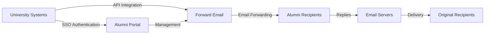

# Étude de cas : Comment Forward Email alimente les solutions d’email pour les anciens élèves des meilleures universités {#case-study-how-forward-email-powers-alumni-email-solutions-for-top-universities}


## Table des matières {#table-of-contents}

* [Avant-propos](#foreword)
* [Économies considérables avec des tarifs stables](#dramatic-cost-savings-with-stable-pricing)
  * [Économies réelles pour les universités](#real-world-university-savings)
* [Le défi de l’email des anciens élèves universitaires](#the-university-alumni-email-challenge)
  * [La valeur de l’identité email des anciens élèves](#the-value-of-alumni-email-identity)
  * [Les solutions traditionnelles ne suffisent pas](#traditional-solutions-fall-short)
  * [La solution Forward Email](#the-forward-email-solution)
* [Mise en œuvre technique : comment ça fonctionne](#technical-implementation-how-it-works)
  * [Architecture principale](#core-architecture)
  * [Intégration avec les systèmes universitaires](#integration-with-university-systems)
  * [Gestion pilotée par API](#api-driven-management)
  * [Configuration et vérification DNS](#dns-configuration-and-verification)
  * [Tests et assurance qualité](#testing-and-quality-assurance)
* [Calendrier de mise en œuvre](#implementation-timeline)
* [Processus de mise en œuvre : de la migration à la maintenance](#implementation-process-from-migration-to-maintenance)
  * [Évaluation initiale et planification](#initial-assessment-and-planning)
  * [Stratégie de migration](#migration-strategy)
  * [Installation technique et configuration](#technical-setup-and-configuration)
  * [Conception de l’expérience utilisateur](#user-experience-design)
  * [Formation et documentation](#training-and-documentation)
  * [Support continu et optimisation](#ongoing-support-and-optimization)
* [Étude de cas : Université de Cambridge](#case-study-university-of-cambridge)
  * [Défi](#challenge)
  * [Solution](#solution)
  * [Résultats](#results)
* [Avantages pour les universités et les anciens élèves](#benefits-for-universities-and-alumni)
  * [Pour les universités](#for-universities)
  * [Pour les anciens élèves](#for-alumni)
  * [Taux d’adoption parmi les anciens élèves](#adoption-rates-among-alumni)
  * [Économies par rapport aux solutions précédentes](#cost-savings-compared-to-previous-solutions)
* [Considérations de sécurité et de confidentialité](#security-and-privacy-considerations)
  * [Mesures de protection des données](#data-protection-measures)
  * [Cadre de conformité](#compliance-framework)
* [Développements futurs](#future-developments)
* [Conclusion](#conclusion)


## Avant-propos {#foreword}

Nous avons construit le service de transfert d’email le plus sécurisé, privé et flexible au monde pour les universités prestigieuses et leurs anciens élèves.

Dans le paysage concurrentiel de l’enseignement supérieur, maintenir des liens à vie avec les anciens élèves n’est pas seulement une question de tradition — c’est un impératif stratégique. L’un des moyens les plus tangibles pour les universités de favoriser ces liens est de fournir aux diplômés des adresses email d’anciens élèves, leur offrant une identité numérique reflétant leur héritage académique.

Chez Forward Email, nous avons établi des partenariats avec certaines des institutions éducatives les plus prestigieuses au monde pour révolutionner la gestion des services d’email des anciens élèves. Notre solution de transfert d’email de niveau entreprise alimente désormais les systèmes d’email des anciens élèves de l’[Université de Cambridge](https://en.wikipedia.org/wiki/University_of_Cambridge), de l’[Université du Maryland](https://en.wikipedia.org/wiki/University_of_Maryland,_College_Park), de la [Tufts University](https://en.wikipedia.org/wiki/Tufts_University) et du [Swarthmore College](https://en.wikipedia.org/wiki/Swarthmore_College), desservant collectivement des milliers d’anciens élèves dans le monde entier.

Ce billet de blog explore comment notre service de transfert d’email [open-source](https://en.wikipedia.org/wiki/Open-source_software) axé sur la confidentialité est devenu la solution privilégiée pour ces institutions, les mises en œuvre techniques qui le rendent possible, et l’impact transformateur qu’il a eu tant sur l’efficacité administrative que sur la satisfaction des anciens élèves.


## Économies considérables avec des tarifs stables {#dramatic-cost-savings-with-stable-pricing}
Les avantages financiers de notre solution sont substantiels, surtout en comparaison avec les prix en constante augmentation des fournisseurs d'email traditionnels :

| Solution                       | Coût par ancien élève (annuel)                                                                             | Coût pour 100 000 anciens élèves | Augmentations récentes des prix                                                                                                                                                         |
| ------------------------------ | --------------------------------------------------------------------------------------------------------- | ------------------------------- | ---------------------------------------------------------------------------------------------------------------------------------------------------------------------------------------- |
| Google Workspace for Business  | 72 $                                                                                                      | 7 200 000 $                    | • 2019 : G Suite Basic de 5 $ à 6 $/mois (+20%)<br>• 2023 : Plans flexibles augmentés de 20%<br>• 2025 : Business Plus de 18 $ à 26,40 $/mois (+47%) avec fonctionnalités IA               |
| Google Workspace for Education | Gratuit (Education Fundamentals)<br>3 $/étudiant/an (Education Standard)<br>5 $/étudiant/an (Education Plus) | Gratuit - 500 000 $             | • Remises sur volume : 5 % pour 100-499 licences<br>• Remises sur volume : 10 % pour 500+ licences<br>• Niveau gratuit limité aux services de base                                      |
| Microsoft 365 Business         | 60 $                                                                                                      | 6 000 000 $                    | • 2023 : Introduction de mises à jour tarifaires semestrielles<br>• 2025 (janv.) : Personnel de 6,99 $ à 9,99 $/mois (+43%) avec Copilot IA<br>• 2025 (avr.) : +5 % sur engagements annuels payés mensuellement |
| Microsoft 365 Education        | Gratuit (A1)<br>38-55 $/enseignant/an (A3)<br>65-96 $/enseignant/an (A5)                                 | Gratuit - 96 000 $             | • Licences étudiantes souvent incluses avec achats enseignants<br>• Tarification personnalisée via licences en volume<br>• Niveau gratuit limité aux versions web                      |
| Exchange auto-hébergé          | 45 $                                                                                                      | 4 500 000 $                    | Les coûts de maintenance et de sécurité en cours continuent d'augmenter                                                                                                                 |
| **Forward Email Enterprise**   | **250 $/mois fixe**                                                                                       | **3 000 $/an**                 | **Aucune augmentation de prix depuis le lancement**                                                                                                                                     |

### Économies réelles des universités {#real-world-university-savings}

Voici combien nos universités partenaires économisent annuellement en choisissant Forward Email plutôt que les fournisseurs traditionnels :

| Université               | Nombre d'anciens élèves | Coût annuel avec Google | Coût annuel avec Forward Email | Économies annuelles |
| ----------------------- | ---------------------- | ----------------------- | ------------------------------ | ------------------- |
| Université de Cambridge | 30 000                 | 90 000 $                | 3 000 $                        | 87 000 $            |
| Swarthmore College      | 5 000                  | 15 000 $                | 3 000 $                        | 12 000 $            |
| Université Tufts        | 12 000                 | 36 000 $                | 3 000 $                        | 33 000 $            |
| Université du Maryland  | 25 000                 | 75 000 $                | 3 000 $                        | 72 000 $            |

> \[!NOTE]
> Forward Email Enterprise coûte typiquement seulement 250 $/mois, sans coût supplémentaire par utilisateur, avec des limitations de taux API en liste blanche, et le seul coût additionnel est le stockage si vous avez besoin de GB/TB supplémentaires pour les étudiants (+3 $ par 10 Go de stockage additionnel). Nous utilisons également des disques NVMe SSD pour un support rapide de IMAP/POP3/SMTP/CalDAV/CardDAV.
> \[!IMPORTANT]
> Contrairement à Google et Microsoft, qui ont augmenté leurs prix à plusieurs reprises tout en intégrant des fonctionnalités d'IA analysant vos données, Forward Email maintient des tarifs stables avec un strict respect de la vie privée. Nous n'utilisons pas d'IA, ne suivons pas les habitudes d'utilisation, et ne stockons pas les journaux ni les e-mails sur disque (tout le traitement se fait en mémoire), garantissant une confidentialité totale pour vos communications avec les anciens élèves.

Cela représente une réduction de coûts significative par rapport aux solutions d'hébergement d'e-mails traditionnelles — des fonds que les universités peuvent réorienter vers des bourses, la recherche ou d'autres activités essentielles à leur mission. Selon une analyse de 2023 par Email Vendor Selection, les établissements d'enseignement recherchent de plus en plus des alternatives économiques aux fournisseurs d'e-mails traditionnels, les prix continuant d'augmenter avec l'intégration des fonctionnalités d'IA ([Email Vendor Selection, 2023](https://www.emailvendorselection.com/email-service-provider-list/)).


## Le défi de l’e-mail pour les anciens élèves universitaires {#the-university-alumni-email-challenge}

Pour les universités, fournir des adresses e-mail à vie aux anciens élèves présente un ensemble unique de défis que les solutions d’e-mail traditionnelles peinent à relever efficacement. Comme indiqué dans une discussion approfondie sur ServerFault, les universités avec de grandes bases d’utilisateurs nécessitent des solutions d’e-mail spécialisées qui équilibrent performance, sécurité et rentabilité ([ServerFault, 2009](https://serverfault.com/questions/97364/what-is-the-best-mail-server-for-a-university-with-a-large-amount-of-users)).

### La valeur de l’identité e-mail des anciens élèves {#the-value-of-alumni-email-identity}

Les adresses e-mail des anciens élèves (comme `firstname.lastname@cl.cam.ac.uk` ou `username@terpalum.umd.edu`) remplissent plusieurs fonctions importantes :

* Maintenir la connexion institutionnelle et l’identité de marque
* Faciliter la communication continue avec l’université
* Renforcer la crédibilité professionnelle des diplômés
* Soutenir le réseautage et la création de communauté entre anciens
* Fournir un point de contact stable et à vie

Les recherches de Tekade (2020) soulignent que les adresses e-mail éducatives offrent de nombreux avantages aux anciens élèves, notamment l’accès aux ressources académiques, la crédibilité professionnelle et des réductions exclusives sur divers services ([Medium, 2020](https://medium.com/coders-capsule/top-20-benefits-of-having-an-educational-email-address-91a09795e05)).

> \[!TIP]
> Visitez notre nouveau répertoire [AlumniEmail.com](https://alumniemail.com) pour une ressource complète sur les services d’e-mail pour anciens élèves universitaires, incluant des guides d’installation, des bonnes pratiques et un annuaire consultable des domaines d’e-mails des anciens. Il sert de centre névralgique pour toutes les informations relatives aux e-mails des anciens.

### Les solutions traditionnelles montrent leurs limites {#traditional-solutions-fall-short}

Les systèmes d’e-mail conventionnels présentent plusieurs limitations lorsqu’ils sont appliqués aux besoins des e-mails des anciens élèves :

* **Coût prohibitif** : les modèles de licence par utilisateur deviennent financièrement insoutenables pour de grandes bases d’anciens élèves
* **Charge administrative** : gérer des milliers voire des millions de comptes nécessite des ressources informatiques importantes
* **Problèmes de sécurité** : maintenir la sécurité des comptes inactifs augmente la vulnérabilité
* **Flexibilité limitée** : les systèmes rigides ne peuvent pas s’adapter aux besoins uniques du transfert d’e-mails des anciens
* **Problèmes de confidentialité** : de nombreux fournisseurs scannent le contenu des e-mails à des fins publicitaires

Une discussion sur Quora concernant la maintenance des e-mails universitaires révèle que les préoccupations de sécurité sont une raison majeure pour laquelle les universités peuvent limiter ou annuler les adresses e-mail des anciens, car les comptes inutilisés peuvent être vulnérables au piratage et au vol d’identité ([Quora, 2011](https://www.quora.com/Is-there-any-cost-for-a-college-or-university-to-maintain-edu-e-mail-addresses)).

### La solution Forward Email {#the-forward-email-solution}

Notre approche répond à ces défis par un modèle fondamentalement différent :

* Transfert d’e-mails plutôt qu’hébergement
* Tarification forfaitaire au lieu de coûts par utilisateur
* Architecture open-source pour la transparence et la sécurité
* Conception axée sur la confidentialité sans scan de contenu
* Fonctionnalités spécialisées pour la gestion de l’identité universitaire


## Mise en œuvre technique : comment ça fonctionne {#technical-implementation-how-it-works}
Notre solution exploite une architecture technique sophistiquée mais élégamment simple pour offrir un transfert d’e-mails fiable et sécurisé à grande échelle.

### Architecture Principale {#core-architecture}

Le système Forward Email se compose de plusieurs composants clés :

* Serveurs MX distribués pour une haute disponibilité
* Transfert en temps réel sans stockage des messages
* Authentification complète des e-mails
* Support des domaines personnalisés et sous-domaines
* Gestion des comptes pilotée par API

Selon les professionnels IT sur ServerFault, pour les universités cherchant à mettre en place leurs propres solutions e-mail, Postfix est recommandé comme meilleur agent de transfert de courrier (MTA), tandis que Courier ou Dovecot sont préférés pour l’accès IMAP/POP3 ([ServerFault, 2009](https://serverfault.com/questions/97364/what-is-the-best-mail-server-for-a-university-with-a-large-amount-of-users)). Cependant, notre solution élimine le besoin pour les universités de gérer elles-mêmes ces systèmes complexes.

### Intégration avec les Systèmes Universitaires {#integration-with-university-systems}

Nous avons développé des voies d’intégration transparentes avec l’infrastructure universitaire existante :

* Provisionnement automatisé via intégration [RESTful API](https://forwardemail.net/email-api)
* Options de personnalisation de la marque pour les portails universitaires
* Gestion flexible des alias pour les départements et organisations
* Opérations par lots pour une administration efficace

### Gestion Pilotée par API {#api-driven-management}

Notre [RESTful API](https://forwardemail.net/email-api) permet aux universités d’automatiser la gestion des e-mails :

```javascript
// Exemple : Création d’une nouvelle adresse e-mail pour les anciens élèves
const response = await fetch('https://forwardemail.net/api/v1/domains/example.edu/aliases', {
  method: 'POST',
  headers: {
    'Content-Type': 'application/json',
    'Authorization': `Basic ${Buffer.from(YOUR_API_TOKEN + ":").toString('base64')}`
  },
  body: JSON.stringify({
    name: 'alumni.john.smith',
    recipients: ['johnsmith@gmail.com'],
    has_recipient_verification: true
  })
});
```

### Configuration et Vérification DNS {#dns-configuration-and-verification}

Une configuration DNS correcte est cruciale pour la livraison des e-mails. Notre équipe assiste avec :

* Configuration [DNS](https://en.wikipedia.org/wiki/Domain_Name_System) incluant les enregistrements MX
* Mise en œuvre complète de la sécurité des e-mails via notre package open-source [mailauth](https://www.npmjs.com/package/mailauth), un couteau suisse pour l’authentification des e-mails qui gère :
  * [SPF](https://en.wikipedia.org/wiki/Sender_Policy_Framework) (Sender Policy Framework) pour prévenir le spoofing d’e-mails
  * [DKIM](https://en.wikipedia.org/wiki/DomainKeys_Identified_Mail) (DomainKeys Identified Mail) pour l’authentification des e-mails
  * [DMARC](https://en.wikipedia.org/wiki/Email_authentication) (Domain-based Message Authentication, Reporting & Conformance) pour l’application des politiques
  * [MTA-STS](https://en.wikipedia.org/wiki/Opportunistic_TLS) (SMTP MTA Strict Transport Security) pour imposer le chiffrement TLS
  * [ARC](https://en.wikipedia.org/wiki/DomainKeys_Identified_Mail#Authenticated_Received_Chain) (Authenticated Received Chain) pour maintenir l’authentification lors du transfert des messages
  * [SRS](https://en.wikipedia.org/wiki/Sender_Rewriting_Scheme) (Sender Rewriting Scheme) pour préserver la validation SPF lors du transfert
  * [BIMI](https://en.wikipedia.org/wiki/Email_authentication) (Brand Indicators for Message Identification) pour l’affichage du logo dans les clients e-mail compatibles
* Vérification des enregistrements TXT DNS pour la propriété du domaine

Le package `mailauth` (<http://npmjs.com/package/mailauth>) est la solution entièrement open-source qui gère tous les aspects de l’authentification des e-mails dans une bibliothèque intégrée. Contrairement aux solutions propriétaires, cette approche garantit transparence, mises à jour régulières de sécurité et contrôle total du processus d’authentification des e-mails.

### Tests et Assurance Qualité {#testing-and-quality-assurance}

Avant le déploiement complet, nous réalisons des tests rigoureux :

* Tests de livraison d’e-mails de bout en bout
* Tests de charge pour les scénarios à fort volume
* Tests de pénétration de sécurité
* Validation de l’intégration API
* Tests d’acceptation utilisateur avec des représentants des anciens élèves
## Calendrier de mise en œuvre {#implementation-timeline}

```mermaid
gantt
    title Calendrier de mise en œuvre de l'email universitaire
    dateFormat  YYYY-MM-DD
    section Planification
    Consultation initiale           :a1, 2025-01-01, 14d
    Collecte des exigences          :a2, après a1, 14d
    Conception de la solution       :a3, après a2, 21d
    section Mise en œuvre
    Configuration DNS               :b1, après a3, 7d
    Intégration API                 :b2, après a3, 21d
    Configuration SSO               :b3, après a3, 14d
    section Tests
    Tests de sécurité               :c1, après b1 b2 b3, 14d
    Tests d'acceptation utilisateur :c2, après c1, 14d
    section Déploiement
    Déploiement groupe pilote       :d1, après c2, 14d
    Déploiement complet             :d2, après d1, 21d
    section Support
    Maintenance continue            :e1, après d2, 365d
```


## Processus de mise en œuvre : de la migration à la maintenance {#implementation-process-from-migration-to-maintenance}

Notre processus structuré de mise en œuvre garantit une transition fluide pour les universités adoptant notre solution.

### Évaluation initiale et planification {#initial-assessment-and-planning}

Nous commençons par une évaluation complète du système de messagerie actuel de l'université, de la base de données des anciens élèves et des exigences techniques. Cette phase comprend :

* Entretiens avec les parties prenantes du service informatique, des relations avec les anciens élèves et de l'administration
* Audit technique de l'infrastructure email existante
* Cartographie des données pour les dossiers des anciens élèves
* Revue de la sécurité et de la conformité
* Élaboration du calendrier du projet et des jalons

### Stratégie de migration {#migration-strategy}

Sur la base de l'évaluation, nous développons une stratégie de migration adaptée qui minimise les perturbations tout en garantissant l'intégrité complète des données :

* Approche de migration par phases selon les cohortes d'anciens élèves
* Fonctionnement parallèle des systèmes pendant la transition
* Protocoles complets de validation des données
* Procédures de secours en cas de problèmes de migration
* Plan de communication clair pour toutes les parties prenantes

### Configuration technique {#technical-setup-and-configuration}

Notre équipe technique prend en charge tous les aspects de la configuration du système :

* Configuration et vérification DNS
* Intégration API avec les systèmes universitaires
* Développement de portail personnalisé avec l'image de l'université
* Configuration de l'authentification email (SPF, DKIM, DMARC)

### Conception de l'expérience utilisateur {#user-experience-design}

Nous collaborons étroitement avec les universités pour créer des interfaces intuitives pour les administrateurs et les anciens élèves :

* Portails email pour anciens élèves à l'image de l'université
* Gestion simplifiée du transfert d'emails
* Designs adaptés aux mobiles
* Conformité à l'accessibilité
* Support multilingue si nécessaire

### Formation et documentation {#training-and-documentation}

Une formation complète garantit que toutes les parties prenantes peuvent utiliser efficacement le système :

* Sessions de formation pour les administrateurs
* Documentation technique pour le personnel informatique
* Guides utilisateurs pour les anciens élèves
* Tutoriels vidéo pour les tâches courantes
* Développement d'une base de connaissances

### Support continu et optimisation {#ongoing-support-and-optimization}

Notre partenariat se poursuit bien au-delà de la mise en œuvre :

* Support technique 24/7
* Mises à jour régulières du système et correctifs de sécurité
* Surveillance et optimisation des performances
* Conseil sur les bonnes pratiques email
* Analyse des données et rapports


## Étude de cas : Université de Cambridge {#case-study-university-of-cambridge}

L'Université de Cambridge recherchait une solution pour fournir des adresses email @cam.ac.uk aux anciens élèves tout en réduisant la charge et les coûts informatiques.

### Défi {#challenge}

Cambridge faisait face à plusieurs défis avec leur ancien système d'email pour anciens élèves :

* Coûts opérationnels élevés pour maintenir une infrastructure email séparée
* Charge administrative liée à la gestion de milliers de comptes
* Problèmes de sécurité liés aux comptes inactifs
* Intégration limitée avec les systèmes de base de données des anciens élèves
* Besoins croissants en stockage

### Solution {#solution}

Forward Email a mis en œuvre une solution complète :

* Transfert d'emails pour toutes les adresses @cam.ac.uk des anciens élèves
* Portail personnalisé en marque blanche pour l'auto-gestion des anciens élèves
* Intégration API avec la base de données des anciens élèves de Cambridge
* Mise en place complète de la sécurité email

### Résultats {#results}

La mise en œuvre a apporté des bénéfices significatifs :
* Réduction substantielle des coûts par rapport à la solution précédente
* Fiabilité de livraison des emails à 99,9 %
* Administration simplifiée grâce à l’automatisation
* Sécurité renforcée avec une authentification moderne des emails
* Retours positifs des anciens élèves sur la facilité d’utilisation du système


## Avantages pour les universités et les anciens élèves {#benefits-for-universities-and-alumni}

Notre solution apporte des bénéfices concrets tant pour les établissements que pour leurs diplômés.

### Pour les universités {#for-universities}

* **Efficacité économique** : Tarification fixe quel que soit le nombre d’anciens élèves
* **Simplicité administrative** : Gestion automatisée via API
* **Sécurité renforcée** : Authentification complète des emails
* **Cohérence de la marque** : Adresses email institutionnelles à vie
* **Engagement des anciens** : Renforcement des liens grâce à un service continu

Selon BulkSignature (2023), les plateformes email pour établissements éducatifs offrent des avantages significatifs incluant la rentabilité grâce à des plans gratuits ou à faible coût, un gain de temps via la communication de masse, et des fonctionnalités de suivi pour contrôler la livraison et l’engagement des emails ([BulkSignature, 2023](https://bulksignature.com/blog/5-best-email-platforms-for-educational-institutions/)).

### Pour les anciens élèves {#for-alumni}

* **Identité professionnelle** : Adresse email prestigieuse de l’université
* **Continuité des emails** : Redirection vers n’importe quelle adresse personnelle
* **Protection de la vie privée** : Pas de scan de contenu ni d’extraction de données
* **Gestion simplifiée** : Mise à jour facile des destinataires
* **Sécurité renforcée** : Authentification moderne des emails

Une étude de l’International Journal of Education & Literacy Studies souligne l’importance d’une communication email appropriée dans le milieu académique, notant que la maîtrise des emails est une compétence cruciale pour les étudiants et anciens dans un contexte professionnel ([IJELS, 2021](https://files.eric.ed.gov/fulltext/EJ1319324.pdf)).

### Taux d’adoption parmi les anciens élèves {#adoption-rates-among-alumni}

Les universités rapportent des taux d’adoption et de satisfaction élevés au sein de leurs communautés d’anciens élèves.

### Économies réalisées par rapport aux solutions précédentes {#cost-savings-compared-to-previous-solutions}

L’impact financier a été important, les universités signalant des économies significatives par rapport à leurs solutions email antérieures.


## Considérations de sécurité et de confidentialité {#security-and-privacy-considerations}

Pour les établissements éducatifs, protéger les données des anciens élèves n’est pas seulement une bonne pratique — c’est souvent une obligation légale sous des réglementations comme le RGPD en Europe.

### Mesures de protection des données {#data-protection-measures}

Notre solution intègre plusieurs couches de sécurité :

* Chiffrement de bout en bout pour tout le trafic email
* Aucun stockage du contenu des emails sur nos serveurs
* Audits de sécurité réguliers et tests d’intrusion
* Conformité aux normes internationales de protection des données
* Code transparent et open-source pour vérification de la sécurité

> \[!WARNING]
> De nombreux fournisseurs d’emails scannent le contenu des emails à des fins publicitaires ou pour entraîner des modèles d’IA. Cette pratique soulève de graves problèmes de confidentialité, notamment pour les communications professionnelles et académiques. Forward Email ne scanne jamais le contenu des emails et traite tous les emails en mémoire pour garantir une confidentialité totale.

### Cadre de conformité {#compliance-framework}

Nous maintenons une conformité stricte avec les réglementations pertinentes :

* Conformité RGPD pour les établissements européens
* Certification SOC 2 Type II
* Évaluations de sécurité annuelles
* Contrat de traitement des données (DPA) disponible sur [forwardemail.net/dpa](https://forwardemail.net/dpa)
* Mises à jour régulières de conformité au fur et à mesure de l’évolution des réglementations


## Développements futurs {#future-developments}

Nous continuons d’améliorer notre solution email pour anciens élèves avec de nouvelles fonctionnalités et capacités :

* Analyses améliorées pour les administrateurs universitaires
* Protections anti-phishing avancées
* Capacités API étendues pour une intégration plus poussée
* Options d’authentification supplémentaires


## Conclusion {#conclusion}

Forward Email a révolutionné la manière dont les universités fournissent et gèrent les services email pour leurs anciens élèves. En remplaçant l’hébergement email coûteux et complexe par un transfert d’emails élégant et sécurisé, nous avons permis aux établissements d’offrir des adresses email à vie à tous leurs diplômés tout en réduisant drastiquement les coûts et la charge administrative.
Nos partenariats avec des institutions prestigieuses telles que Cambridge, Maryland, Tufts et Swarthmore démontrent l'efficacité de notre approche dans divers environnements éducatifs. Alors que les universités sont de plus en plus sous pression pour maintenir les liens avec leurs anciens élèves tout en maîtrisant les coûts, notre solution offre une alternative convaincante aux systèmes de messagerie traditionnels.


```mermaid
flowchart LR
    A[University Systems] -->|API Integration| B[Forward Email]
    B -->|Email Forwarding| C[Alumni Recipients]
    C -->|Replies| D[Email Servers]
    D -->|Delivery| E[Original Recipients]
    F[Alumni Portal] -->|Management| B
    A -->|SSO Authentication| F
```

Pour les universités intéressées par la manière dont Forward Email peut transformer leurs services de messagerie pour anciens élèves, contactez notre équipe à <support@forwardemail.net> ou visitez [forwardemail.net](https://forwardemail.net) pour en savoir plus sur nos solutions d'entreprise.
