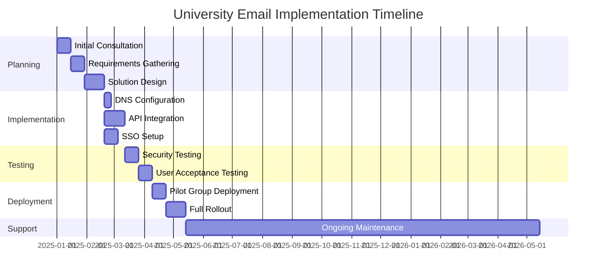
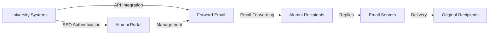

# מקרה בוחן: כיצד דוא"ל קדמי מניע פתרונות דוא"ל לבוגרים באוניברסיטאות מובילות {#case-study-how-forward-email-powers-alumni-email-solutions-for-top-universities}


## תוכן עניינים

* [הַקדָמָה](#foreword)
* [חיסכון דרמטי בעלויות עם תמחור יציב](#dramatic-cost-savings-with-stable-pricing)
  * [חיסכון באוניברסיטה בעולם האמיתי](#real-world-university-savings)
* [אתגר הדוא"ל של בוגרי האוניברסיטה](#the-university-alumni-email-challenge)
  * [הערך של זהות הדוא"ל של הבוגרים](#the-value-of-alumni-email-identity)
  * [פתרונות מסורתיים נכשלים](#traditional-solutions-fall-short)
  * [פתרון העברת דוא"ל](#the-forward-email-solution)
* [יישום טכני: איך זה עובד](#technical-implementation-how-it-works)
  * [ארכיטקטורת ליבה](#core-architecture)
  * [אינטגרציה עם מערכות אוניברסיטאיות](#integration-with-university-systems)
  * [ניהול מונחה API](#api-driven-management)
  * [תצורה ואימות של DNS](#dns-configuration-and-verification)
  * [בדיקות ואבטחת איכות](#testing-and-quality-assurance)
* [ציר זמן יישום](#implementation-timeline)
* [תהליך הטמעה: מהגירה לתחזוקה](#implementation-process-from-migration-to-maintenance)
  * [הערכה ראשונית ותכנון](#initial-assessment-and-planning)
  * [אסטרטגיית הגירה](#migration-strategy)
  * [הגדרה ותצורה טכנית](#technical-setup-and-configuration)
  * [עיצוב חוויית משתמש](#user-experience-design)
  * [הדרכה ותיעוד](#training-and-documentation)
  * [תמיכה ואופטימיזציה שוטפים](#ongoing-support-and-optimization)
* [מקרה בוחן: אוניברסיטת קיימברידג'](#case-study-university-of-cambridge)
  * [אֶתגָר](#challenge)
  * [פִּתָרוֹן](#solution)
  * [תוצאות](#results)
* [יתרונות לאוניברסיטאות ולבוגרים](#benefits-for-universities-and-alumni)
  * [לאוניברסיטאות](#for-universities)
  * [לבוגרים](#for-alumni)
  * [שיעורי אימוץ בקרב בוגרים](#adoption-rates-among-alumni)
  * [חיסכון בעלויות בהשוואה לפתרונות קודמים](#cost-savings-compared-to-previous-solutions)
* [שיקולי אבטחה ופרטיות](#security-and-privacy-considerations)
  * [אמצעי הגנת מידע](#data-protection-measures)
  * [מסגרת תאימות](#compliance-framework)
* [התפתחויות עתידיות](#future-developments)
* [מַסְקָנָה](#conclusion)

## הקדמה {#foreword}

בנינו את שירות העברת הדוא"ל המאובטח, הפרטי והגמיש ביותר בעולם עבור אוניברסיטאות יוקרתיות ובוגריהן.

בנוף התחרותי של ההשכלה הגבוהה, שמירה על קשרים לכל החיים עם בוגרים אינה רק עניין של מסורת - זוהי חובה אסטרטגית. אחת הדרכים המוחשיות ביותר בהן אוניברסיטאות מטפחות קשרים אלה היא באמצעות כתובות דוא"ל של בוגרים, המספקות לבוגרים זהות דיגיטלית המשקפת את מורשתם האקדמית.

ב-Forward Email, שיתפנו פעולה עם כמה ממוסדות החינוך היוקרתיים בעולם כדי לחולל מהפכה באופן שבו הם מנהלים שירותי דוא"ל לבוגרים. פתרון העברת הדוא"ל שלנו ברמה ארגונית מפעיל כעת את מערכות הדוא"ל לבוגרים עבור [אוניברסיטת קיימברידג'](https://en.wikipedia.org/wiki/University_of_Cambridge), [אוניברסיטת מרילנד](https://en.wikipedia.org/wiki/University_of_Maryland,\_College_Park), [אוניברסיטת טאפטס](https://en.wikipedia.org/wiki/Tufts_University) ו-[מכללת סוורת'מור](https://en.wikipedia.org/wiki/Swarthmore_College), המשרתים יחד אלפי בוגרים ברחבי העולם.

פוסט זה בבלוג בוחן כיצד שירות העברת הדוא"ל שלנו, המתמקד בפרטיות, הפך לפתרון המועדף עבור מוסדות אלה, את היישומים הטכניים המאפשרים זאת, ואת ההשפעה הטרנספורמטיבית שהייתה לו הן על היעילות המנהלית והן על שביעות רצון הבוגרים.

## חיסכון דרמטי בעלויות עם תמחור יציב {#dramatic-cost-savings-with-stable-pricing}

היתרונות הפיננסיים של הפתרון שלנו הם משמעותיים, במיוחד בהשוואה למחירים העולים בהתמדה של ספקי דוא"ל מסורתיים:

| פִּתָרוֹן | עלות לבוגר (שנתית) | עלות עבור 100,000 בוגרים | עליות מחירים אחרונות |
| ------------------------------ | --------------------------------------------------------------------------------------------------------- | ----------------------- | ---------------------------------------------------------------------------------------------------------------------------------------------------------------------------------------- |
| גוגל Workspace לעסקים | $72 | $7,200,000 | • 2019: G Suite Basic מ-5 דולר ל-6 דולר לחודש (+20%)<br>• 2023: תוכניות גמישות עלו ב-20%<br>• 2025: Business Plus מ-18 דולר ל-26.40 דולר לחודש (+47%) עם תכונות בינה מלאכותית |
| גוגל וורקספייס לחינוך | חינם (Education Fundamentals)<br>3 דולר לסטודנט/שנה (Education Standard)<br>5 דולר לסטודנט/שנה (Education Plus) | חינם - 500,000 דולר | • הנחות כמות: 5% עבור 100-499 רישיונות<br>• הנחות כמות: 10% עבור 500+ רישיונות<br>• רמת חינמית מוגבלת לשירותי ליבה |
| מיקרוסופט 365 עסקי | $60 | $6,000,000 | • 2023: הוצגו עדכוני מחירים פעמיים בשנה<br>• 2025 (ינואר): תוכנית אישית מ-6.99$ ל-9.99$ לחודש (+43%) עם Copilot AI<br>• 2025 (אפריל): עלייה של 5% בהתחייבויות השנתיות המשולמות מדי חודש |
| מיקרוסופט 365 חינוך | חינם (A1)<br>38-55 דולר לסגל/שנה (A3)<br>65-96 דולר לסגל/שנה (A5) | חינם - 96,000 דולר | • רישיונות סטודנטים כלולים לעיתים קרובות ברכישות של סגל האקדמי<br>• תמחור מותאם אישית באמצעות רישוי רב-תכליתי<br>• רמת חינמית מוגבלת לגרסאות אינטרנט |
| בורסה מאוחסנת עצמית | $45 | $4,500,000 | עלויות התחזוקה והאבטחה השוטפות ממשיכות לעלות |
| **העברת דוא"ל ארגונית** | **תשלום קבוע של 250 דולר לחודש** | **3,000 דולר לשנה** | **אין עליות מחירים מאז ההשקה** |

### חיסכון באוניברסיטה בעולם האמיתי {#real-world-university-savings}

הנה כמה חוסכות האוניברסיטאות השותפות שלנו מדי שנה על ידי בחירת "Forward Email" על פני ספקים מסורתיים:

| אוּנִיבֶרְסִיטָה | ספירת בוגרים | עלות שנתית עם גוגל | עלות שנתית עם העברת דוא"ל | חיסכון שנתי |
| ----------------------- | ------------ | ----------------------- | ------------------------------ | -------------- |
| אוניברסיטת קיימברידג' | 30,000 | $90,000 | $3,000 | $87,000 |
| מכללת סוורת'מור | 5,000 | $15,000 | $3,000 | $12,000 |
| אוניברסיטת טאפטס | 12,000 | $36,000 | $3,000 | $33,000 |
| אוניברסיטת מרילנד | 25,000 | $75,000 | $3,000 | $72,000 |

> \[!NOTE]
> העברת דוא"ל ארגונית עולה בדרך כלל רק 250 דולר לחודש, ללא עלות נוספת למשתמש, מגבלות תעריף API ברשימה הלבנה, והעלות הנוספת היחידה היא אחסון אם אתם זקוקים לג'יגה-בייט/טרה-בייט נוספים עבור סטודנטים (+3 דולר לכל 10 ג'יגה-בייט אחסון נוסף). אנו משתמשים בכונני SSD של NVMe לתמיכה מהירה גם ב-IMAP/POP3/SMTP/CalDAV/CardDAV.

> \[!IMPORTANT]
> בניגוד לגוגל ומיקרוסופט, אשר העלו שוב ושוב את המחירים שלהן תוך שילוב תכונות בינה מלאכותית המנתחות את הנתונים שלך, Forward Email שומרת על תמחור יציב עם דגש קפדני על פרטיות. איננו משתמשים בבינה מלאכותית, איננו עוקבים אחר דפוסי שימוש ואיננו מאחסנים יומני רישום או הודעות דוא"ל בדיסק (כל העיבוד מתבצע בזיכרון), מה שמבטיח פרטיות מוחלטת לתקשורת הבוגרים שלך.

זהו הפחתה משמעותית בעלויות בהשוואה לפתרונות אירוח דוא"ל מסורתיים - כספים שאוניברסיטאות יכולות להפנות למלגות, מחקר או פעילויות קריטיות אחרות. על פי ניתוח משנת 2023 של Email Vendor Selection, מוסדות חינוך מחפשים יותר ויותר חלופות חסכוניות לספקי דוא"ל מסורתיים, ככל שהמחירים ממשיכים לעלות עם שילוב תכונות בינה מלאכותית ([בחירת ספק דוא"ל, 2023](https://www.emailvendorselection.com/email-service-provider-list/)).

## אתגר הדוא"ל של בוגרי האוניברסיטה {#the-university-alumni-email-challenge}

עבור אוניברסיטאות, מתן כתובות דוא"ל לכל החיים לבוגרים מציב מערך ייחודי של אתגרים שפתרונות דוא"ל מסורתיים מתקשים להתמודד איתם ביעילות. כפי שצוין בדיון מקיף ב-ServerFault, אוניברסיטאות עם בסיסי משתמשים גדולים דורשות פתרונות דוא"ל ייעודיים המאזנים ביצועים, אבטחה וחסכון ([תקלת שרת, 2009](https://serverfault.com/questions/97364/what-is-the-best-mail-server-for-a-university-with-a-large-amount-of-users)).

### הערך של זהות הדוא"ל של הבוגרים {#the-value-of-alumni-email-identity}

כתובות דוא"ל של בוגרים (כגון `firstname.lastname@cl.cam.ac.uk` או `username@terpalum.umd.edu`) משרתות מספר פונקציות חשובות:

* שמירה על קשר מוסדי וזהות מותג
* הקלה על תקשורת מתמשכת עם האוניברסיטה
* הגברת האמינות המקצועית של בוגרים
* תמיכה ביצירת קשרים ובניית קהילה בקרב בוגרים
* מתן נקודת קשר יציבה לכל החיים

מחקר של Tekade (2020) מדגיש כי כתובות דוא"ל חינוכיות מספקות יתרונות רבים לבוגרים, כולל גישה למשאבים אקדמיים, אמינות מקצועית והנחות בלעדיות על שירותים שונים ([בינוני, 2020](https://medium.com/coders-capsule/top-20-benefits-of-having-an-educational-email-address-91a09795e05)).

> \[!TIP]
> בקרו במדריך [AlumniEmail.com](https://alumniemail.com) החדש שלנו לקבלת משאב מקיף על שירותי דוא"ל של בוגרי אוניברסיטה, כולל מדריכי התקנה, שיטות עבודה מומלצות ומדריך חיפוש של דומיינים של דוא"ל בוגרים. הוא משמש כמרכז מרכזי לכל מידע הדוא"ל של הבוגרים.

### פתרונות מסורתיים לא עומדים בציפיות {#traditional-solutions-fall-short}

מערכות דוא"ל קונבנציונליות מציגות מספר מגבלות כאשר הן מיושמות על צורכי הדוא"ל של בוגרים:

* **עלות גבוהה מדי**: מודלים של רישוי לפי משתמש הופכים לבלתי ברי קיימא מבחינה כלכלית עבור בסיסי בוגרים גדולים
* **נטל אדמיניסטרטיבי**: ניהול אלפי או מיליוני חשבונות דורש משאבי IT משמעותיים
* **חששות אבטחה**: שמירה על אבטחה עבור חשבונות רדומים מגבירה את הפגיעות
* **גמישות מוגבלת**: מערכות קשיחות אינן יכולות להסתגל לצרכים הייחודיים של העברת דוא"ל של בוגרים
* **בעיות פרטיות**: ספקים רבים סורקים תוכן דוא"ל למטרות פרסום

דיון ב-Quora על תחזוקת דוא"ל של אוניברסיטאות מגלה כי חששות אבטחה הם סיבה עיקרית לכך שאוניברסיטאות עשויות להגביל או לבטל כתובות דוא"ל של בוגרים, מכיוון שחשבונות שאינם בשימוש עלולים להיות פגיעים לפריצה וגניבת זהות ([קווורה, 2011](https://www.quora.com/Is-there-any-cost-for-a-college-or-university-to-maintain-edu-e-mail-addresses)).

### פתרון העברת דוא"ל {#the-forward-email-solution}

הגישה שלנו מתמודדת עם אתגרים אלה באמצעות מודל שונה באופן מהותי:

* העברת דוא"ל במקום אירוח
* תמחור קבוע במקום עלויות לפי משתמש
* ארכיטקטורת קוד פתוח לשקיפות ואבטחה
* עיצוב המתמקד בפרטיות ללא סריקת תוכן
* תכונות מיוחדות לניהול זהויות אוניברסיטאיות

## יישום טכני: איך זה עובד {#technical-implementation-how-it-works}

הפתרון שלנו ממנף ארכיטקטורה טכנית מתוחכמת אך פשוטה באלגנטיות כדי לספק העברת דוא"ל אמינה ומאובטחת בקנה מידה גדול.

### ארכיטקטורת ליבה {#core-architecture}

מערכת העברת הדוא"ל מורכבת ממספר רכיבים עיקריים:

* שרתי MX מבוזרים לזמינות גבוהה
* העברה בזמן אמת ללא אחסון הודעות
* אימות מקיף של דוא"ל
* תמיכה בדומיינים ותת-דומיינים מותאמים אישית
* ניהול חשבונות מבוסס API

לפי אנשי מקצוע בתחום ה-IT ב-ServerFault, עבור אוניברסיטאות המעוניינות ליישם פתרונות דוא"ל משלהן, Postfix מומלץ כסוכן העברת הדואר (MTA) הטוב ביותר, בעוד ש-Courier או Dovecot עדיפים לגישה באמצעות IMAP/POP3 ([תקלת שרת, 2009](https://serverfault.com/questions/97364/what-is-the-best-mail-server-for-a-university-with-a-large-amount-of-users)). עם זאת, הפתרון שלנו מבטל את הצורך של אוניברסיטאות לנהל את המערכות המורכבות הללו בעצמן.

### אינטגרציה עם מערכות אוניברסיטאיות {#integration-with-university-systems}

פיתחנו מסלולי אינטגרציה חלקים עם תשתית האוניברסיטה הקיימת:

* הקצאה אוטומטית באמצעות שילוב [ממשק API RESTful](https://forwardemail.net/email-api)
* אפשרויות מיתוג מותאמות אישית לפורטלים של אוניברסיטה
* ניהול כינויים גמיש עבור מחלקות וארגונים
* פעולות אצווה לניהול יעיל

### ניהול מונחה API של {#api-driven-management}

ה-[ממשק API RESTful](https://forwardemail.net/email-api) שלנו מאפשר לאוניברסיטאות להפוך את ניהול הדוא"ל לאוטומטי:

```javascript
// Example: Creating a new alumni email address
const response = await fetch('https://forwardemail.net/api/v1/domains/example.edu/aliases', {
  method: 'POST',
  headers: {
    'Content-Type': 'application/json',
    'Authorization': `Basic ${Buffer.from(YOUR_API_TOKEN + ":").toString('base64')}`
  },
  body: JSON.stringify({
    name: 'alumni.john.smith',
    recipients: ['johnsmith@gmail.com'],
    has_recipient_verification: true
  })
});
```

### הגדרת DNS ואימות {#dns-configuration-and-verification}

תצורת DNS נכונה היא קריטית למשלוח דוא"ל. הצוות שלנו מסייע ב:

* תצורת [DNS](https://en.wikipedia.org/wiki/Domain_Name_System) כולל רשומות MX
* יישום מקיף של אבטחת דוא"ל באמצעות חבילת [אישור דואר אלקטרוני](https://www.npmjs.com/package/mailauth) בקוד פתוח שלנו, אולר שוויצרי לאימות דוא"ל המטפל ב:
* [SPF](https://en.wikipedia.org/wiki/Sender_Policy_Framework) (מסגרת מדיניות שולח) למניעת זיוף דוא"ל
* [DKIM](https://en.wikipedia.org/wiki/DomainKeys_Identified_Mail) (דואר מזוהה עם מפתחות דומיין) לאימות דוא"ל
* [DMARC](https://en.wikipedia.org/wiki/Email_authentication) (אימות, דיווח ותאימות הודעות מבוססות דומיין) לאכיפת מדיניות
* [MTA-STS](https://en.wikipedia.org/wiki/Opportunistic_TLS) (אבטחת תעבורה קפדנית של SMTP MTA) לאכיפת הצפנת TLS
* [ARC](https://en.wikipedia.org/wiki/DomainKeys_Identified_Mail#Authenticated_Received_Chain) (שרשרת קבלה מאומתת) לשמירה על אימות בעת העברת הודעות
* [SRS](https://en.wikipedia.org/wiki/Sender_Rewriting_Scheme) (תוכנית כתיבה מחדש של שולח) לשמירה על אימות SPF באמצעות העברה
* [BIMI](https://en.wikipedia.org/wiki/Email_authentication) (אינדיקטורי מותג לזיהוי הודעות) לתצוגת לוגו בתמיכה בלקוחות דוא"ל
* אימות רשומת DNS TXT לבעלות על דומיין

חבילת `mailauth` (<http://npmjs.com/package/mailauth>) היא פתרון קוד פתוח לחלוטין המטפל בכל היבטי אימות הדוא"ל בספרייה משולבת אחת. בניגוד לפתרונות קנייניים, גישה זו מבטיחה שקיפות, עדכוני אבטחה שוטפים ושליטה מלאה על תהליך אימות הדוא"ל.

### בדיקות ואבטחת איכות {#testing-and-quality-assurance}

לפני הפריסה המלאה, אנו עורכים בדיקות קפדניות:

* בדיקות מסירת דוא"ל מקצה לקצה
* בדיקות עומס עבור תרחישים של נפח גבוה
* בדיקות חדירה לאבטחה
* אימות שילוב API
* בדיקות קבלת משתמשים עם נציגי בוגרים

## ציר זמן יישום {#implementation-timeline}



## תהליך הטמעה: מהעברה לתחזוקה {#implementation-process-from-migration-to-maintenance}

תהליך היישום המובנה שלנו מבטיח מעבר חלק לאוניברסיטאות המאמצות את הפתרון שלנו.

### הערכה ראשונית ותכנון {#initial-assessment-and-planning}

אנו מתחילים בהערכה מקיפה של מערכת הדוא"ל הנוכחית של האוניברסיטה, מאגר הבוגרים והדרישות הטכניות. שלב זה כולל:

* ראיונות עם בעלי עניין במחלקת ה-IT, קשרי בוגרים והנהלה
* ביקורת טכנית של תשתית הדוא"ל הקיימת
* מיפוי נתונים עבור רשומות בוגרים
* סקירת אבטחה ותאימות
* ציר זמן של הפרויקט ופיתוח אבני דרך

### אסטרטגיית הגירה {#migration-strategy}

בהתבסס על ההערכה, אנו מפתחים אסטרטגיית הגירה מותאמת אישית שתמזער שיבושים תוך הבטחת שלמות נתונים מלאה:

* גישת הגירה מדורגת על ידי קבוצות בוגרים
* הפעלת מערכות מקבילות במהלך המעבר
* פרוטוקולי אימות נתונים מקיפים
* נהלי גיבוי לכל בעיית הגירה
* תוכנית תקשורת ברורה לכל בעלי העניין

### הגדרה ותצורה טכנית {#technical-setup-and-configuration}

הצוות הטכני שלנו מטפל בכל היבטי התקנת המערכת:

* הגדרת DNS ואימות
* שילוב API עם מערכות אוניברסיטאיות
* פיתוח פורטל מותאם אישית עם מיתוג אוניברסיטאי
* הגדרת אימות דוא"ל (SPF, DKIM, DMARC)

### עיצוב חוויית משתמש {#user-experience-design}

אנו עובדים בשיתוף פעולה הדוק עם אוניברסיטאות כדי ליצור ממשקים אינטואיטיביים הן למנהלים והן לבוגרים:

* פורטלים מותאמים אישית של דוא"ל בוגרים
* ניהול פשוט של העברת דוא"ל
* עיצובים רספונסיביים למובייל
* תאימות לנגישות
* תמיכה בריבוי שפות במידת הצורך

### הדרכה ותיעוד {#training-and-documentation}

הכשרה מקיפה מבטיחה שכל בעלי העניין יוכלו להשתמש במערכת ביעילות:

* הדרכות למנהלים
* תיעוד טכני לצוותי IT
* מדריכי משתמש לבוגרים
* סרטוני הדרכה למשימות נפוצות
* פיתוח מאגר ידע

### תמיכה ואופטימיזציה שוטפים {#ongoing-support-and-optimization}

השותפות שלנו נמשכת הרבה מעבר ליישום:

* תמיכה טכנית 24/7
* עדכוני מערכת ותיקוני אבטחה שוטפים
* ניטור ואופטימיזציה של ביצועים
* ייעוץ בנוגע לשיטות עבודה מומלצות בדוא"ל
* ניתוח נתונים ודיווח

## מקרה בוחן: אוניברסיטת קיימברידג' {#case-study-university-of-cambridge}

אוניברסיטת קיימברידג' חיפשה פתרון לספק כתובות דוא"ל עם סיומת @cam.ac.uk לבוגרים, תוך הפחתת תקורות ועלויות IT.

### אתגר {#challenge}

קיימברידג' התמודדה עם מספר אתגרים עם מערכת הדוא"ל הקודמת שלה לבוגרים:

* עלויות תפעול גבוהות לתחזוקת תשתית דוא"ל נפרדת
* נטל אדמיניסטרטיבי של ניהול אלפי חשבונות
* חששות אבטחה בחשבונות רדומים
* אינטגרציה מוגבלת עם מערכות מסד נתונים של בוגרים
* דרישות אחסון גוברות

### פתרון {#solution}

העברת דוא"ל יישמה פתרון מקיף:

* העברת דוא"ל לכל כתובות הבוגרים ב-@cam.ac.uk
* פורטל ממותג בהתאמה אישית לשירות עצמי של בוגרים
* שילוב API עם מסד הנתונים של הבוגרים של קיימברידג'
* יישום מקיף של אבטחת דוא"ל

### תוצאות {#results}

היישום הניב יתרונות משמעותיים:

* הפחתה משמעותית בעלויות בהשוואה לפתרון הקודם
* אמינות מסירת דוא"ל של 99.9%
* ניהול פשוט יותר באמצעות אוטומציה
* אבטחה משופרת עם אימות דוא"ל מודרני
* משוב חיובי של בוגרים על שמישות המערכת

## יתרונות לאוניברסיטאות ולבוגרים {#benefits-for-universities-and-alumni}

הפתרון שלנו מספק יתרונות מוחשיים הן למוסדות והן לבוגריהם.

### עבור אוניברסיטאות {#for-universities}

* **יעילות כלכלית**: תמחור קבוע ללא קשר למספר הבוגרים
* **פשטות ניהולית**: ניהול אוטומטי באמצעות API
* **אבטחה משופרת**: אימות דוא"ל מקיף
* **עקביות מותג**: כתובות דוא"ל מוסדיות לכל החיים
* **מעורבות בוגרים**: קשרים מחוזקים באמצעות שירות מתמשך

לפי BulkSignature (2023), פלטפורמות דוא"ל למוסדות חינוך מציעות יתרונות משמעותיים, כולל יעילות כלכלית באמצעות תוכניות חינמיות או בעלות נמוכה, יעילות בזמן באמצעות יכולות תקשורת המונים ותכונות מעקב לניטור משלוח ומעורבות בדוא"ל ([חתימה בכמות גדולה, 2023](https://bulksignature.com/blog/5-best-email-platforms-for-educational-institutions/)).

### לבוגרים {#for-alumni}

* **זהות מקצועית**: כתובת דוא"ל אוניברסיטאית יוקרתית
* **המשכיות דוא"ל**: העברה לכל דוא"ל אישי
* **הגנת פרטיות**: ללא סריקת תוכן או כריית נתונים
* **ניהול פשוט**: עדכוני נמענים קלים
* **אבטחה משופרת**: אימות דוא"ל מודרני

מחקר של כתב העת הבינלאומי לחינוך ואוריינות מדגיש את החשיבות של תקשורת נכונה בדוא"ל במסגרות אקדמיות, וציין כי אוריינות דוא"ל היא מיומנות חיונית הן לסטודנטים והן לבוגרים בהקשרים מקצועיים ([IJELS, 2021](https://files.eric.ed.gov/fulltext/EJ1319324.pdf)).

### שיעורי אימוץ בקרב בוגרים {#adoption-rates-among-alumni}

אוניברסיטאות מדווחות על שיעורי אימוץ ושביעות רצון גבוהים בקרב קהילות הבוגרים שלהן.

### חיסכון בעלויות בהשוואה לפתרונות קודמים {#cost-savings-compared-to-previous-solutions}

ההשפעה הכספית הייתה משמעותית, כאשר אוניברסיטאות דיווחו על חיסכון משמעותי בעלויות בהשוואה לפתרונות הדוא"ל הקודמים שלהן.

## שיקולי אבטחה ופרטיות {#security-and-privacy-considerations}

עבור מוסדות חינוך, הגנה על נתוני בוגרים אינה רק נוהג טוב - לעתים קרובות זוהי דרישה חוקית במסגרת תקנות כמו ה-GDPR באירופה.

### אמצעי הגנת מידע {#data-protection-measures}

הפתרון שלנו משלב מספר שכבות אבטחה:

* הצפנה מקצה לקצה לכל תעבורת הדוא"ל
* אין אחסון של תוכן דוא"ל בשרתים שלנו
* ביקורות אבטחה ובדיקות חדירה שוטפות
* עמידה בתקני הגנת מידע בינלאומיים
* קוד שקוף ופתוח לאימות אבטחה

> \[!WARNING]
> ספקי דוא"ל רבים סורקים תוכן דוא"ל למטרות פרסום או לאימון מודלים של בינה מלאכותית. נוהג זה מעלה חששות חמורים בנוגע לפרטיות, במיוחד עבור תקשורת מקצועית ואקדמית. העברת דוא"ל לעולם לא סורקת תוכן דוא"ל ומעבדת את כל הדוא"ל בזיכרון כדי להבטיח פרטיות מלאה.

### מסגרת תאימות {#compliance-framework}

אנו מקפידים על עמידה קפדנית בתקנות הרלוונטיות:

* תאימות ל-GDPR עבור מוסדות אירופאים
* הסמכת SOC 2 Type II
* הערכות אבטחה שנתיות
* הסכם עיבוד נתונים (DPA) זמין בכתובת [forwardemail.net/dpa](https://forwardemail.net/dpa)
* עדכוני תאימות שוטפים ככל שהתקנות מתפתחות

## פיתוחים עתידיים {#future-developments}

אנו ממשיכים לשפר את פתרון הדוא"ל לבוגרים שלנו עם תכונות ויכולות חדשות:

* ניתוח משופר למנהלי אוניברסיטה
* הגנות מתקדמות נגד פישינג
* יכולות API מורחבות לאינטגרציה מעמיקה יותר
* אפשרויות אימות נוספות

## מסקנה {#conclusion}

העברת דוא"ל חוללה מהפכה באופן שבו אוניברסיטאות מספקות ומנהלות שירותי דוא"ל לבוגרים. על ידי החלפת אירוח דוא"ל יקר ומורכב בהעברת דוא"ל אלגנטית ומאובטחת, אפשרנו למוסדות להציע כתובות דוא"ל לכל החיים לכל הבוגרים תוך הפחתה דרמטית של עלויות ותקורות אדמיניסטרטיביות.

השותפויות שלנו עם מוסדות יוקרתיים כמו קיימברידג', מרילנד, טאפטס וסווארת'מור מדגימות את יעילות הגישה שלנו בסביבות חינוכיות מגוונות. ככל שאוניברסיטאות מתמודדות עם לחץ גובר לשמור על קשרי בוגרים תוך שליטה בעלויות, הפתרון שלנו מציע אלטרנטיבה משכנעת למערכות דוא"ל מסורתיות.



לאוניברסיטאות המעוניינות לבחון כיצד Forward Email יכול לחולל שינוי בשירותי הדוא"ל לבוגרים שלהן, צרו קשר עם הצוות שלנו בכתובת <support@forwardemail.net> או בקרו באתר [forwardemail.net](https://forwardemail.net) כדי ללמוד עוד על פתרונות הארגון שלנו.