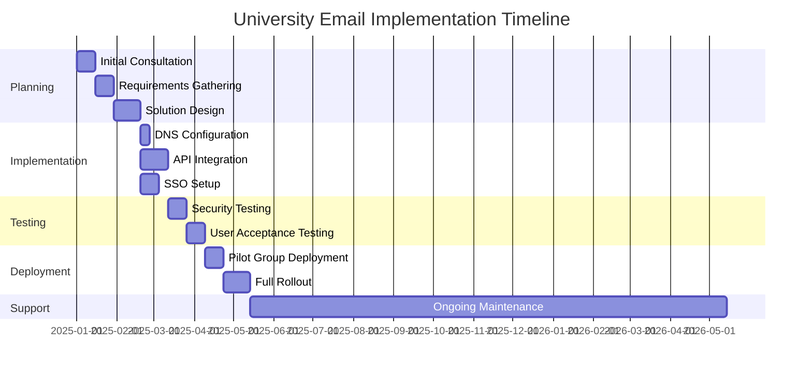
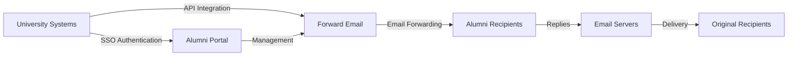

# מחקר מקרה: כיצד Forward Email מחזקת פתרונות דואר אלקטרוני לבוגרי אוניברסיטאות מובילות {#case-study-how-forward-email-powers-alumni-email-solutions-for-top-universities}


## תוכן העניינים {#table-of-contents}

* [הקדמה](#foreword)
* [חיסכון דרמטי בעלויות עם תמחור יציב](#dramatic-cost-savings-with-stable-pricing)
  * [חיסכון אוניברסיטאי במציאות](#real-world-university-savings)
* [האתגר בדואר אלקטרוני לבוגרי אוניברסיטה](#the-university-alumni-email-challenge)
  * [הערך של זהות דואר אלקטרוני לבוגרים](#the-value-of-alumni-email-identity)
  * [פתרונות מסורתיים שאינם מספקים](#traditional-solutions-fall-short)
  * [הפתרון של Forward Email](#the-forward-email-solution)
* [יישום טכני: כיצד זה עובד](#technical-implementation-how-it-works)
  * [ארכיטקטורה מרכזית](#core-architecture)
  * [אינטגרציה עם מערכות האוניברסיטה](#integration-with-university-systems)
  * [ניהול מונחה API](#api-driven-management)
  * [הגדרת DNS ואימות](#dns-configuration-and-verification)
  * [בדיקות ובקרת איכות](#testing-and-quality-assurance)
* [לוח זמנים ליישום](#implementation-timeline)
* [תהליך היישום: מהגירה ועד תחזוקה](#implementation-process-from-migration-to-maintenance)
  * [הערכה ותכנון ראשוניים](#initial-assessment-and-planning)
  * [אסטרטגיית הגירה](#migration-strategy)
  * [הגדרה וקונפיגורציה טכנית](#technical-setup-and-configuration)
  * [עיצוב חוויית משתמש](#user-experience-design)
  * [הדרכה ותיעוד](#training-and-documentation)
  * [תמיכה ושיפור מתמשכים](#ongoing-support-and-optimization)
* [מחקר מקרה: אוניברסיטת קיימברידג'](#case-study-university-of-cambridge)
  * [האתגר](#challenge)
  * [הפתרון](#solution)
  * [התוצאות](#results)
* [יתרונות לאוניברסיטאות ולבוגרים](#benefits-for-universities-and-alumni)
  * [לאוניברסיטאות](#for-universities)
  * [לבוגרים](#for-alumni)
  * [שיעורי אימוץ בקרב הבוגרים](#adoption-rates-among-alumni)
  * [חיסכון בעלויות בהשוואה לפתרונות קודמים](#cost-savings-compared-to-previous-solutions)
* [שיקולי אבטחה ופרטיות](#security-and-privacy-considerations)
  * [אמצעי הגנת נתונים](#data-protection-measures)
  * [מסגרת תאימות](#compliance-framework)
* [פיתוחים עתידיים](#future-developments)
* [סיכום](#conclusion)


## הקדמה {#foreword}

בנינו את שירות העברת הדואר האלקטרוני המאובטח, הפרטי והגמיש ביותר בעולם עבור אוניברסיטאות יוקרתיות ובוגריהן.

בנוף התחרותי של ההשכלה הגבוהה, שמירה על קשרים לכל החיים עם הבוגרים אינה רק עניין של מסורת — זו חובה אסטרטגית. אחת הדרכים המוחשיות ביותר שבהן אוניברסיטאות מטפחות קשרים אלו היא באמצעות כתובות דואר אלקטרוני לבוגרים, המעניקות לבוגרים זהות דיגיטלית המשקפת את המורשת האקדמית שלהם.

ב-Forward Email, שיתפנו פעולה עם כמה מהגופים החינוכיים היוקרתיים ביותר בעולם כדי לחולל מהפכה בניהול שירותי הדואר האלקטרוני לבוגרים. פתרון העברת הדואר האלקטרוני ברמת הארגון שלנו מפעיל כיום את מערכות הדואר האלקטרוני לבוגרים של [אוניברסיטת קיימברידג'](https://en.wikipedia.org/wiki/University_of_Cambridge), [אוניברסיטת מרילנד](https://en.wikipedia.org/wiki/University_of_Maryland,_College_Park), [אוניברסיטת טאפטס](https://en.wikipedia.org/wiki/Tufts_University), ו-[Swarthmore College](https://en.wikipedia.org/wiki/Swarthmore_College), ומשרת אלפי בוגרים ברחבי העולם.

פוסט זה בבלוג בוחן כיצד שירות העברת הדואר האלקטרוני שלנו, המתמקד בפרטיות ופתוח בקוד, הפך לפתרון המועדף על מוסדות אלו, את היישומים הטכניים שמאפשרים זאת, ואת ההשפעה המשמעותית שהייתה לכך על יעילות ניהולית ועל שביעות רצון הבוגרים.


## חיסכון דרמטי בעלויות עם תמחור יציב {#dramatic-cost-savings-with-stable-pricing}
ההטבות הכלכליות של הפתרון שלנו משמעותיות, במיוחד בהשוואה למחירים העולים ללא הפסקה של ספקי הדואר האלקטרוני המסורתיים:

| פתרון                         | עלות לכל בוגר (שנתי)                                                                                      | עלות ל-100,000 בוגרים    | העלאות מחירים אחרונות                                                                                                                                                                   |
| ------------------------------ | --------------------------------------------------------------------------------------------------------- | ----------------------- | ---------------------------------------------------------------------------------------------------------------------------------------------------------------------------------------- |
| Google Workspace לעסקים        | $72                                                                                                       | $7,200,000              | • 2019: G Suite Basic מ-5$ ל-6$/חודש (+20%)<br>• 2023: תכניות גמישות עלו ב-20%<br>• 2025: Business Plus מ-18$ ל-26.40$/חודש (+47%) עם תכונות AI                                  |
| Google Workspace לחינוך        | חינם (Education Fundamentals)<br>$3/סטודנט/שנה (Education Standard)<br>$5/סטודנט/שנה (Education Plus) | חינם - $500,000         | • הנחות על נפח: 5% עבור 100-499 רשיונות<br>• הנחות על נפח: 10% עבור 500+ רשיונות<br>• רמת חינם מוגבלת לשירותים בסיסיים                                                         |
| Microsoft 365 לעסקים           | $60                                                                                                       | $6,000,000              | • 2023: הוצגו עדכוני מחירים פעמיים בשנה<br>• 2025 (ינואר): Personal מ-6.99$ ל-9.99$/חודש (+43%) עם Copilot AI<br>• 2025 (אפריל): עלייה של 5% בהתחייבויות שנתיות בתשלום חודשי    |
| Microsoft 365 לחינוך           | חינם (A1)<br>$38-55/סגל/שנה (A3)<br>$65-96/סגל/שנה (A5)                                                 | חינם - $96,000          | • רשיונות סטודנטים כלולים לעיתים ברכישות סגל<br>• תמחור מותאם דרך רישוי נפח<br>• רמת חינם מוגבלת לגרסאות ווב                                                               |
| Exchange מתארח עצמאית          | $45                                                                                                       | $4,500,000              | עלויות תחזוקה ואבטחה מתמשכות ממשיכות לעלות                                                                                                                                              |
| **Forward Email Enterprise**   | **מחיר קבוע של $250/חודש**                                                                                | **$3,000/שנה**          | **אין עליות מחירים מאז ההשקה**                                                                                                                                                          |

### חיסכון אמיתי באוניברסיטאות {#real-world-university-savings}

כך חוסכות האוניברסיטאות השותפות שלנו מדי שנה בבחירת Forward Email במקום ספקים מסורתיים:

| אוניברסיטה               | מספר בוגרים | עלות שנתית עם Google | עלות שנתית עם Forward Email | חיסכון שנתי  |
| ----------------------- | ------------ | --------------------- | ---------------------------- | ------------ |
| אוניברסיטת קיימברידג'   | 30,000       | $90,000               | $3,000                       | $87,000      |
| Swarthmore College      | 5,000        | $15,000               | $3,000                       | $12,000      |
| אוניברסיטת טאפטס       | 12,000       | $36,000               | $3,000                       | $33,000      |
| אוניברסיטת מרילנד      | 25,000       | $75,000               | $3,000                       | $72,000      |

> \[!NOTE]
> Forward Email enterprise עולה בדרך כלל רק $250 לחודש, ללא עלות נוספת לכל משתמש, עם הגבלות API ברשימת לבנה, והעלות הנוספת היחידה היא אחסון אם אתם צריכים GB/TB נוספים לסטודנטים (+$3 לכל 10 GB אחסון נוסף). אנו משתמשים בכונני NVMe SSD לתמיכה מהירה ב-IMAP/POP3/SMTP/CalDAV/CardDAV.
> \[!IMPORTANT]
> בניגוד לגוגל ומיקרוסופט, שהעלו את מחירי השירותים שלהם שוב ושוב תוך שילוב תכונות בינה מלאכותית שמנתחות את הנתונים שלכם, Forward Email שומרת על מחירים יציבים עם דגש חזק על פרטיות. אנחנו לא משתמשים בבינה מלאכותית, לא עוקבים אחרי דפוסי שימוש, ולא מאחסנים לוגים או מיילים בדיסק (כל העיבוד נעשה בזיכרון), מה שמבטיח פרטיות מלאה לתקשורת עם בוגרי האוניברסיטה שלכם.

זה מייצג הפחתה משמעותית בעלויות לעומת פתרונות אירוח דואר אלקטרוני מסורתיים — כספים שאוניברסיטאות יכולות להפנות מחדש למלגות, מחקר או פעילויות קריטיות אחרות למטרתן. לפי ניתוח משנת 2023 של Email Vendor Selection, מוסדות חינוך מחפשים יותר ויותר חלופות חסכוניות לספקי דואר אלקטרוני מסורתיים ככל שהמחירים ממשיכים לעלות עם שילוב תכונות בינה מלאכותית ([Email Vendor Selection, 2023](https://www.emailvendorselection.com/email-service-provider-list/)).


## אתגר דואר אלקטרוני לבוגרי האוניברסיטה {#the-university-alumni-email-challenge}

עבור אוניברסיטאות, מתן כתובות דואר אלקטרוני לכל החיים לבוגרים מציב סט ייחודי של אתגרים שפתרונות דואר אלקטרוני מסורתיים מתקשים להתמודד איתם ביעילות. כפי שנאמר בדיון מקיף ב-ServerFault, אוניברסיטאות עם בסיס משתמשים גדול דורשות פתרונות דואר אלקטרוני מיוחדים שמאזנים בין ביצועים, אבטחה, ועלות-תועלת ([ServerFault, 2009](https://serverfault.com/questions/97364/what-is-the-best-mail-server-for-a-university-with-a-large-amount-of-users)).

### ערך הזהות בדואר אלקטרוני לבוגרים {#the-value-of-alumni-email-identity}

כתובות דואר אלקטרוני לבוגרים (כמו `firstname.lastname@cl.cam.ac.uk` או `username@terpalum.umd.edu`) ממלאות מספר פונקציות חשובות:

* שמירה על קשר מוסדי וזהות מותגית
* הקלה על תקשורת מתמשכת עם האוניברסיטה
* חיזוק אמינות מקצועית לבוגרים
* תמיכה ברישות בוגרים ובניית קהילה
* מתן נקודת קשר יציבה לכל החיים

מחקר של Tekade (2020) מדגיש שכתובות דואר אלקטרוני חינוכיות מספקות יתרונות רבים לבוגרים, כולל גישה למשאבים אקדמיים, אמינות מקצועית, והנחות בלעדיות על שירותים שונים ([Medium, 2020](https://medium.com/coders-capsule/top-20-benefits-of-having-an-educational-email-address-91a09795e05)).

> \[!TIP]
> בקרו במדריך החדש שלנו ב-[AlumniEmail.com](https://alumniemail.com) למידע מקיף על שירותי דואר אלקטרוני לבוגרי אוניברסיטאות, כולל מדריכי התקנה, שיטות עבודה מומלצות, ומדריך חיפוש של דומיינים לדואר אלקטרוני לבוגרים. זהו מרכז מידע מרכזי לכל הנוגע לדואר אלקטרוני לבוגרים.

### פתרונות מסורתיים אינם מספקים {#traditional-solutions-fall-short}

מערכות דואר אלקטרוני קונבנציונליות מציגות מספר מגבלות כשמיישמים אותן לצרכי דואר אלקטרוני לבוגרים:

* **עלות גבוהה מדי**: מודלים של רישוי לפי משתמש הופכים לבלתי ברי קיימא כלכלית עבור בסיסי בוגרים גדולים
* **עומס ניהולי**: ניהול אלפי או מיליוני חשבונות דורש משאבי IT משמעותיים
* **חששות אבטחה**: שמירה על אבטחה עבור חשבונות לא פעילים מגבירה פגיעות
* **גמישות מוגבלת**: מערכות נוקשות שאינן יכולות להתאים לצרכים הייחודיים של הפניית דואר לבוגרים
* **בעיות פרטיות**: ספקים רבים סורקים תוכן דואר אלקטרוני למטרות פרסום

דיון ב-Quora על תחזוקת דואר אלקטרוני באוניברסיטאות חושף שחששות אבטחה הם סיבה מרכזית לכך שאוניברסיטאות עשויות להגביל או לבטל כתובות דואר אלקטרוני לבוגרים, שכן חשבונות לא בשימוש עלולים להיות פגיעים לפריצה ולגניבת זהות ([Quora, 2011](https://www.quora.com/Is-there-any-cost-for-a-college-or-university-to-maintain-edu-e-mail-addresses)).

### פתרון Forward Email {#the-forward-email-solution}

הגישה שלנו מתמודדת עם אתגרים אלה באמצעות מודל שונה מהיסוד:

* הפניית דואר אלקטרוני במקום אירוח
* תמחור קבוע במקום עלויות לפי משתמש
* ארכיטקטורה בקוד פתוח לשקיפות ואבטחה
* עיצוב שמדגיש פרטיות ללא סריקת תוכן
* תכונות מיוחדות לניהול זהות אוניברסיטאית


## יישום טכני: איך זה עובד {#technical-implementation-how-it-works}
הפתרון שלנו מנצל ארכיטקטורה טכנית מתוחכמת אך פשוטה ואלגנטית כדי לספק העברת דואר אלקטרוני אמינה ובטוחה בקנה מידה רחב.

### ארכיטקטורה מרכזית {#core-architecture}

מערכת Forward Email מורכבת ממספר רכיבים מרכזיים:

* שרתי MX מבוזרים לזמינות גבוהה
* העברה בזמן אמת ללא אחסון הודעות
* אימות דואר אלקטרוני מקיף
* תמיכה בדומיין מותאם ותת-דומיינים
* ניהול חשבונות מונחה API

לפי אנשי IT ב-ServerFault, לאוניברסיטאות המעוניינות ליישם פתרונות דואר אלקטרוני משלהן, Postfix מומלץ כסוכן העברת דואר (MTA) הטוב ביותר, בעוד ש-Courier או Dovecot מועדפים לגישה דרך IMAP/POP3 ([ServerFault, 2009](https://serverfault.com/questions/97364/what-is-the-best-mail-server-for-a-university-with-a-large-amount-of-users)). עם זאת, הפתרון שלנו מבטל את הצורך של אוניברסיטאות לנהל מערכות מורכבות אלו בעצמן.

### אינטגרציה עם מערכות האוניברסיטה {#integration-with-university-systems}

פיתחנו דרכי אינטגרציה חלקות עם תשתיות האוניברסיטה הקיימות:

* פרוביזיה אוטומטית באמצעות אינטגרציה עם [RESTful API](https://forwardemail.net/email-api)
* אפשרויות מיתוג מותאם לפורטלים של האוניברסיטה
* ניהול כינויים גמיש למחלקות וארגונים
* פעולות אצווה לניהול יעיל

### ניהול מונחה API {#api-driven-management}

ה-[RESTful API](https://forwardemail.net/email-api) שלנו מאפשר לאוניברסיטאות לאוטומט את ניהול הדואר האלקטרוני:

```javascript
// דוגמה: יצירת כתובת דואר אלקטרוני חדשה לבוגרים
const response = await fetch('https://forwardemail.net/api/v1/domains/example.edu/aliases', {
  method: 'POST',
  headers: {
    'Content-Type': 'application/json',
    'Authorization': `Basic ${Buffer.from(YOUR_API_TOKEN + ":").toString('base64')}`
  },
  body: JSON.stringify({
    name: 'alumni.john.smith',
    recipients: ['johnsmith@gmail.com'],
    has_recipient_verification: true
  })
});
```

### קונפיגורציית DNS ואימות {#dns-configuration-and-verification}

קונפיגורציית DNS נכונה היא קריטית למשלוח דואר אלקטרוני. הצוות שלנו מסייע ב:

* קונפיגורציית [DNS](https://en.wikipedia.org/wiki/Domain_Name_System) כולל רשומות MX
* יישום אבטחת דואר אלקטרוני מקיף באמצעות חבילת הקוד הפתוח שלנו [mailauth](https://www.npmjs.com/package/mailauth), כלי רב-תכליתי לאימות דואר אלקטרוני המטפל ב:
  * [SPF](https://en.wikipedia.org/wiki/Sender_Policy_Framework) (Sender Policy Framework) למניעת זיוף דואר אלקטרוני
  * [DKIM](https://en.wikipedia.org/wiki/DomainKeys_Identified_Mail) (DomainKeys Identified Mail) לאימות דואר אלקטרוני
  * [DMARC](https://en.wikipedia.org/wiki/Email_authentication) (Domain-based Message Authentication, Reporting & Conformance) לאכיפת מדיניות
  * [MTA-STS](https://en.wikipedia.org/wiki/Opportunistic_TLS) (SMTP MTA Strict Transport Security) לאכיפת הצפנת TLS
  * [ARC](https://en.wikipedia.org/wiki/DomainKeys_Identified_Mail#Authenticated_Received_Chain) (Authenticated Received Chain) לשמירת האימות בעת העברת הודעות
  * [SRS](https://en.wikipedia.org/wiki/Sender_Rewriting_Scheme) (Sender Rewriting Scheme) לשמירת אימות SPF דרך העברה
  * [BIMI](https://en.wikipedia.org/wiki/Email_authentication) (Brand Indicators for Message Identification) להצגת לוגו בלקוחות דואר תומכים
* אימות רשומות TXT ב-DNS לבעלות על הדומיין

חבילת `mailauth` (<http://npmjs.com/package/mailauth>) היא הפתרון הקוד הפתוח המלא המטפל בכל היבטי אימות הדואר האלקטרוני בספרייה משולבת אחת. בניגוד לפתרונות קנייניים, גישה זו מבטיחה שקיפות, עדכוני אבטחה שוטפים ושליטה מלאה בתהליך אימות הדואר האלקטרוני.

### בדיקות ובקרת איכות {#testing-and-quality-assurance}

לפני פריסה מלאה, אנו מבצעים בדיקות קפדניות:

* בדיקות משלוח דואר מקצה לקצה
* בדיקות עומס לתרחישים בעלי נפח גבוה
* בדיקות חדירה לאבטחה
* אימות אינטגרציה עם API
* בדיקות קבלת משתמשים עם נציגי בוגרים
## לוח זמנים ליישום {#implementation-timeline}


```mermaid
gantt
    title University Email Implementation Timeline
    dateFormat  YYYY-MM-DD
    section Planning
    Initial Consultation           :a1, 2025-01-01, 14d
    Requirements Gathering         :a2, after a1, 14d
    Solution Design                :a3, after a2, 21d
    section Implementation
    DNS Configuration              :b1, after a3, 7d
    API Integration                :b2, after a3, 21d
    SSO Setup                      :b3, after a3, 14d
    section Testing
    Security Testing               :c1, after b1 b2 b3, 14d
    User Acceptance Testing        :c2, after c1, 14d
    section Deployment
    Pilot Group Deployment         :d1, after c2, 14d
    Full Rollout                   :d2, after d1, 21d
    section Support
    Ongoing Maintenance            :e1, after d2, 365d
```


## תהליך היישום: מהגירה לתחזוקה {#implementation-process-from-migration-to-maintenance}

תהליך היישום המובנה שלנו מבטיח מעבר חלק לאוניברסיטאות המאמצות את הפתרון שלנו.

### הערכה ותכנון ראשוניים {#initial-assessment-and-planning}

אנו מתחילים בהערכה מקיפה של מערכת הדואר האלקטרוני הנוכחית של האוניברסיטה, מאגר הבוגרים והדרישות הטכניות. שלב זה כולל:

* ראיונות עם בעלי עניין מ-IT, קשרי בוגרים ומינהל
* ביקורת טכנית של תשתית הדואר הקיימת
* מיפוי נתונים לרשומות הבוגרים
* סקירת אבטחה וציות
* פיתוח לוח זמנים ויעדים לפרויקט

### אסטרטגיית הגירה {#migration-strategy}

בהתבסס על ההערכה, אנו מפתחים אסטרטגיית הגירה מותאמת שמפחיתה הפרעות תוך הבטחת שלמות הנתונים:

* גישה להגירה בשלבים לפי קבוצות בוגרים
* הפעלת מערכות במקביל במהלך המעבר
* פרוטוקולי אימות נתונים מקיפים
* נהלי חזרה למצב קודם במקרה של בעיות בהגירה
* תוכנית תקשורת ברורה לכל בעלי העניין

### הגדרה וקונפיגורציה טכנית {#technical-setup-and-configuration}

הצוות הטכני שלנו מטפל בכל היבטי ההגדרה של המערכת:

* קונפיגורציית DNS ואימות
* אינטגרציה של API עם מערכות האוניברסיטה
* פיתוח פורטל מותאם עם מיתוג האוניברסיטה
* הגדרת אימות דואר אלקטרוני (SPF, DKIM, DMARC)

### עיצוב חוויית משתמש {#user-experience-design}

אנו עובדים בשיתוף פעולה עם האוניברסיטאות ליצירת ממשקים אינטואיטיביים למנהלים ולבוגרים:

* פורטלי דואר אלקטרוני ממותגים לבוגרים
* ניהול הפניית דואר פשוט
* עיצובים רספונסיביים למובייל
* עמידה בתקני נגישות
* תמיכה בריבוי שפות לפי הצורך

### הדרכה ותיעוד {#training-and-documentation}

הדרכה מקיפה מבטיחה שכל בעלי העניין יוכלו להשתמש במערכת ביעילות:

* סדנאות הדרכה למנהלים
* תיעוד טכני לצוות ה-IT
* מדריכי משתמש לבוגרים
* סרטוני הדרכה למשימות נפוצות
* פיתוח בסיס ידע

### תמיכה ושיפור מתמשכים {#ongoing-support-and-optimization}

השיתוף שלנו ממשיך הרבה מעבר ליישום:

* תמיכה טכנית 24/7
* עדכוני מערכת שוטפים ותיקוני אבטחה
* ניטור ביצועים ואופטימיזציה
* ייעוץ על שיטות עבודה מומלצות בדואר אלקטרוני
* ניתוח נתונים ודיווח


## מקרה בוחן: אוניברסיטת קיימברידג' {#case-study-university-of-cambridge}

אוניברסיטת קיימברידג' חיפשה פתרון לספק כתובות דואר אלקטרוני @cam.ac.uk לבוגרים תוך הפחתת עומס ועלויות IT.

### אתגר {#challenge}

קיימברידג' התמודדה עם מספר אתגרים במערכת הדואר הקודמת לבוגרים:

* עלויות תפעול גבוהות לתחזוקת תשתית דואר נפרדת
* עומס מנהלי בניהול אלפי חשבונות
* חששות אבטחה מחשבונות לא פעילים
* אינטגרציה מוגבלת עם מערכות מאגרי הבוגרים
* דרישות אחסון גוברות

### פתרון {#solution}

Forward Email יישמה פתרון מקיף:

* הפניית דואר לכל כתובות הבוגרים @cam.ac.uk
* פורטל ממותג מותאם לשירות עצמי לבוגרים
* אינטגרציית API עם מאגר הבוגרים של קיימברידג'
* יישום אבטחת דואר מקיף

### תוצאות {#results}

היישום סיפק יתרונות משמעותיים:
* הפחתה משמעותית בעלויות בהשוואה לפתרון הקודם
* אמינות מסירת דואר אלקטרוני של 99.9%
* ניהול פשוט באמצעות אוטומציה
* אבטחה משופרת עם אימות דואר אלקטרוני מודרני
* משוב חיובי מבוגרים על נוחות השימוש במערכת


## יתרונות לאוניברסיטאות ולבוגרים {#benefits-for-universities-and-alumni}

הפתרון שלנו מספק יתרונות מוחשיים הן למוסדות והן לבוגרים שלהם.

### לאוניברסיטאות {#for-universities}

* **יעילות עלויות**: תמחור קבוע ללא תלות במספר הבוגרים
* **פשטות ניהולית**: ניהול אוטומטי באמצעות API
* **אבטחה משופרת**: אימות דואר אלקטרוני מקיף
* **עקביות מותגית**: כתובות דואר אלקטרוני מוסדיות לכל החיים
* **מעורבות בוגרים**: חיזוק הקשרים באמצעות שירות מתמשך

לפי BulkSignature (2023), פלטפורמות דואר אלקטרוני למוסדות חינוך מציעות יתרונות משמעותיים כולל יעילות עלויות באמצעות תוכניות חינמיות או בעלות נמוכה, חיסכון בזמן באמצעות יכולות תקשורת המונית, ותכונות מעקב לניטור מסירת דואר ומעורבות ([BulkSignature, 2023](https://bulksignature.com/blog/5-best-email-platforms-for-educational-institutions/)).

### לבוגרים {#for-alumni}

* **זהות מקצועית**: כתובת דואר אלקטרוני יוקרתית של האוניברסיטה
* **המשכיות דואר אלקטרוני**: העברה לכל כתובת דואר אישית
* **הגנת פרטיות**: ללא סריקת תוכן או כריית נתונים
* **ניהול פשוט**: עדכוני נמענים קלים
* **אבטחה משופרת**: אימות דואר אלקטרוני מודרני

מחקר מ-International Journal of Education & Literacy Studies מדגיש את חשיבות התקשורת הנכונה בדואר אלקטרוני בסביבות אקדמיות, וציין כי מיומנות בדואר אלקטרוני היא מיומנות חיונית הן לסטודנטים והן לבוגרים בהקשרים מקצועיים ([IJELS, 2021](https://files.eric.ed.gov/fulltext/EJ1319324.pdf)).

### שיעורי אימוץ בקרב בוגרים {#adoption-rates-among-alumni}

אוניברסיטאות מדווחות על שיעורי אימוץ ושביעות רצון גבוהים בקרב קהילות הבוגרים שלהן.

### חיסכון בעלויות בהשוואה לפתרונות קודמים {#cost-savings-compared-to-previous-solutions}

ההשפעה הכלכלית הייתה משמעותית, כאשר אוניברסיטאות מדווחות על חיסכון ניכר בעלויות בהשוואה לפתרונות הדואר האלקטרוני הקודמים שלהן.


## שיקולי אבטחה ופרטיות {#security-and-privacy-considerations}

עבור מוסדות חינוך, הגנת נתוני הבוגרים אינה רק פרקטיקה טובה—לעיתים היא דרישה חוקית תחת תקנות כמו GDPR באירופה.

### אמצעי הגנת נתונים {#data-protection-measures}

הפתרון שלנו משלב שכבות אבטחה מרובות:

* הצפנה מקצה לקצה לכל תעבורת הדואר האלקטרוני
* אין אחסון תוכן הדואר האלקטרוני בשרתים שלנו
* ביקורות אבטחה סדירות ובדיקות חדירה
* עמידה בתקני הגנת נתונים בינלאומיים
* קוד פתוח ושקוף לאימות אבטחה

> \[!WARNING]
> ספקי דואר אלקטרוני רבים סורקים את תוכן הדואר לצרכי פרסום או לאימון מודלי בינה מלאכותית. פרקטיקה זו מעלה חששות פרטיות חמורים, במיוחד לתקשורת מקצועית ואקדמית. Forward Email לעולם אינו סורק תוכן דואר ומעבד את כל המיילים בזיכרון כדי להבטיח פרטיות מלאה.

### מסגרת עמידה בתקנות {#compliance-framework}

אנו שומרים על עמידה קפדנית בתקנות הרלוונטיות:

* עמידה ב-GDPR למוסדות אירופיים
* הסמכת SOC 2 Type II
* הערכות אבטחה שנתיות
* הסכם עיבוד נתונים (DPA) זמין ב-[forwardemail.net/dpa](https://forwardemail.net/dpa)
* עדכוני עמידה שוטפים עם התפתחות התקנות


## פיתוחים עתידיים {#future-developments}

אנו ממשיכים לשפר את פתרון הדואר האלקטרוני לבוגרים עם תכונות ויכולות חדשות:

* ניתוחים משופרים למנהלי אוניברסיטאות
* הגנות מתקדמות נגד פישינג
* הרחבת יכולות API לאינטגרציה עמוקה יותר
* אפשרויות אימות נוספות


## סיכום {#conclusion}

Forward Email חוללה מהפכה באופן שבו אוניברסיטאות מספקות ומנהלות שירותי דואר אלקטרוני לבוגרים. על ידי החלפת אירוח דואר אלקטרוני יקר ומורכב בהעברת דואר אלקטרוני אלגנטית ובטוחה, אפשרנו למוסדות להציע כתובות דואר אלקטרוני לכל החיים לכל הבוגרים תוך הפחתה דרמטית בעלויות ובנטל הניהול.
השיתופי פעולה שלנו עם מוסדות יוקרתיים כמו קיימברידג', מרילנד, טאפטס וסוורת'מור מדגימים את היעילות של הגישה שלנו בסביבות חינוכיות מגוונות. כאשר אוניברסיטאות מתמודדות עם לחץ גובר לשמור על קשר עם בוגרים תוך שליטה בעלויות, הפתרון שלנו מציע אלטרנטיבה משכנעת למערכות דואר אלקטרוני מסורתיות.


```mermaid
flowchart LR
    A[University Systems] -->|API Integration| B[Forward Email]
    B -->|Email Forwarding| C[Alumni Recipients]
    C -->|Replies| D[Email Servers]
    D -->|Delivery| E[Original Recipients]
    F[Alumni Portal] -->|Management| B
    A -->|SSO Authentication| F
```

לאוניברסיטאות המעוניינות לחקור כיצד Forward Email יכול לשנות את שירותי הדואר האלקטרוני לבוגרים שלהן, ניתן לפנות לצוות שלנו ב-<support@forwardemail.net> או לבקר ב-[forwardemail.net](https://forwardemail.net) כדי ללמוד עוד על הפתרונות הארגוניים שלנו.
