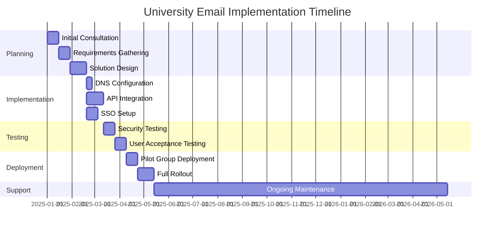
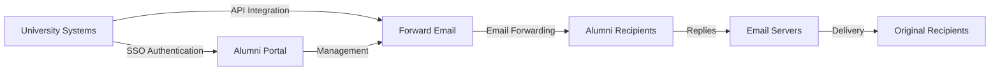

# Esettanulmány: Hogyan segíti a továbbított e-mail az öregdiákoknak szóló e-mail-megoldásokat a vezető egyetemek számára {#case-study-how-forward-email-powers-alumni-email-solutions-for-top-universities}


## Tartalomjegyzék {#table-of-contents}

* [Előszó](#foreword)
* [Drámai költségmegtakarítás a stabil árakkal](#dramatic-cost-savings-with-stable-pricing)
  * [Valós egyetemi megtakarítások](#real-world-university-savings)
* [Az egyetemi öregdiákok e-mail kihívása](#the-university-alumni-email-challenge)
  * [Az öregdiák e-mail identitásának értéke](#the-value-of-alumni-email-identity)
  * [A hagyományos megoldások elmaradnak](#traditional-solutions-fall-short)
  * [Az e-mail továbbítás megoldása](#the-forward-email-solution)
* [Műszaki megvalósítás: Hogyan működik](#technical-implementation-how-it-works)
  * [Core Architecture](#core-architecture)
  * [Integráció az egyetemi rendszerekkel](#integration-with-university-systems)
  * [API-vezérelt menedzsment](#api-driven-management)
  * [DNS konfiguráció és ellenőrzés](#dns-configuration-and-verification)
  * [Tesztelés és minőségbiztosítás](#testing-and-quality-assurance)
* [Megvalósítási idővonal](#implementation-timeline)
* [Megvalósítási folyamat: a migrációtól a karbantartásig](#implementation-process-from-migration-to-maintenance)
  * [Kezdeti értékelés és tervezés](#initial-assessment-and-planning)
  * [Migrációs Stratégia](#migration-strategy)
  * [Műszaki beállítás és konfiguráció](#technical-setup-and-configuration)
  * [Felhasználói élmény tervezés](#user-experience-design)
  * [Képzés és Dokumentáció](#training-and-documentation)
  * [Folyamatos támogatás és optimalizálás](#ongoing-support-and-optimization)
* [Esettanulmány: Cambridge-i Egyetem](#case-study-university-of-cambridge)
  * [Kihívás](#challenge)
  * [Megoldás](#solution)
  * [Eredmények](#results)
* [Előnyök egyetemek és öregdiákok számára](#benefits-for-universities-and-alumni)
  * [Egyetemek számára](#for-universities)
  * [Öregdiákoknak](#for-alumni)
  * [Örökbefogadási arányok öregdiákok körében](#adoption-rates-among-alumni)
  * [Költségmegtakarítás a korábbi megoldásokhoz képest](#cost-savings-compared-to-previous-solutions)
* [Biztonsági és adatvédelmi szempontok](#security-and-privacy-considerations)
  * [Adatvédelmi intézkedések](#data-protection-measures)
  * [Megfelelőségi keretrendszer](#compliance-framework)
* [Jövőbeli fejlesztések](#future-developments)
* [Következtetés](#conclusion)

## Előszó {#foreword}

Megépítettük a világ legbiztonságosabb, privát és legrugalmasabb e-mail-továbbítási szolgáltatását tekintélyes egyetemek és öregdiákjaik számára.

A felsőoktatás versenyhelyzetében az öregdiákokkal való élethosszig tartó kapcsolatok fenntartása nem csupán hagyomány kérdése, hanem stratégiai kényszer. Az egyik legkézzelfoghatóbb módja annak, hogy az egyetemek elősegítsék ezeket a kapcsolatokat, az az öregdiákok e-mail-címe, amellyel a végzett hallgatók olyan digitális identitást biztosítanak, amely tükrözi tudományos örökségüket.

A Forward Emailnél a világ néhány legrangosabb oktatási intézményével működtünk együtt, hogy forradalmasítsuk az öregdiákoknak szóló e-mail szolgáltatások kezelését. Vállalati szintű e-mail továbbítási megoldásunk mostantól a [Cambridge-i Egyetem](https://en.wikipedia.org/wiki/University_of_Cambridge), a [Marylandi Egyetem](https://en.wikipedia.org/wiki/University_of_Maryland,\_College_Park), a [Tufts Egyetem](https://en.wikipedia.org/wiki/Tufts_University) és a [Swarthmore College](https://en.wikipedia.org/wiki/Swarthmore_College) öregdiákoknak szóló e-mail rendszereit működteti, összesen több ezer öregdiákot szolgálva ki világszerte.

Ez a blogbejegyzés azt vizsgálja, hogyan vált a [nyílt forráskódú](https://en.wikipedia.org/wiki/Open-source_software), adatvédelemre összpontosító e-mail-továbbítási szolgáltatásunk ezeknek az intézményeknek a preferált megoldásává, milyen technikai megvalósítások teszik ezt lehetővé, és milyen átalakító hatással volt mind az adminisztratív hatékonyságra, mind az öregdiákok elégedettségére.

## Jelentős költségmegtakarítás stabil árakkal {#dramatic-cost-savings-with-stable-pricing}

Megoldásunk anyagi előnyei jelentősek, különösen a hagyományos e-mail szolgáltatók folyamatosan növekvő áraihoz képest:

| Megoldás | Költség öregdiákonként (éves) | 100 000 öregdiák költsége | Legutóbbi áremelések |
| ------------------------------ | --------------------------------------------------------------------------------------------------------- | ----------------------- | ---------------------------------------------------------------------------------------------------------------------------------------------------------------------------------------- |
| Google Workspace cégeknek | $72 | $7,200,000 | • 2019: G Suite Basic ára 5 dollárról 6 dollárra/hónapra (+20%)<br>• 2023: Rugalmas csomagok ára 20%-kal emelkedett<br>• 2025: Business Plus ára 18 dollárról 26,40 dollárra/hónapra (+47%) mesterséges intelligencia funkciókkal |
| Google Workspace for Education | Ingyenes (Education Fundamentals)<br>3 dollár/diák/év (Education Standard)<br>5 dollár/diák/év (Education Plus) | Ingyenes - 500 000 USD | • Mennyiségi kedvezmények: 5% 100-499 licenc esetén<br>• Mennyiségi kedvezmények: 10% 500+ licenc esetén<br>• Az ingyenes csomag az alapvető szolgáltatásokra korlátozódik |
| Microsoft 365 Business | $60 | $6,000,000 | • 2023: Bevezették a kétévente esedékes árfrissítéseket<br>• 2025 (január): Személyes csomag 6,99 dollárról 9,99 dollárra/hónapban (+43%) a Copilot mesterséges intelligenciájával<br>• 2025 (április): 5%-os növekedés az éves kötelezettségvállalásokban, havonta fizetve |
| Microsoft 365 oktatás | Ingyenes (A1)<br>38–55 USD/oktató/év (A3)<br>65–96 USD/oktató/év (A5) | Ingyenes - 96 000 USD | • A diáklicencek gyakran benne foglaltatnak az oktatói vásárlásokban<br>• Egyedi árképzés mennyiségi licencelés révén<br>• Az ingyenes szint webes verziókra korlátozódik |
| Self-Hosted Exchange | $45 | $4,500,000 | A folyamatos karbantartási és biztonsági költségek továbbra is emelkednek |
| **E-mail továbbítása vállalatnak** | **Fix 250 dollár/hó** | **3000 dollár/év** | **A bevezetés óta nem történt áremelkedés** |

### Egyetemi megtakarítások a való világban {#real-world-university-savings}

Íme, mennyit takarítanak meg partneregyetemeink évente, ha az E-mail továbbítást választják a hagyományos szolgáltatókkal szemben:

| Egyetemi | Öregdiák gróf | Éves költség a Google-nál | Éves költség e-mail továbbítással | Éves megtakarítás |
| ----------------------- | ------------ | ----------------------- | ------------------------------ | -------------- |
| Cambridge-i Egyetem | 30,000 | $90,000 | $3,000 | $87,000 |
| Swarthmore College | 5,000 | $15,000 | $3,000 | $12,000 |
| Tufts Egyetem | 12,000 | $36,000 | $3,000 | $33,000 |
| Marylandi Egyetem | 25,000 | $75,000 | $3,000 | $72,000 |

> \[!NOTE]
> Forward Email enterprise only costs $250/month typically, with no extra cost per user, whitelisted API rate limitations, and the only additional cost is storage if you need additional GB/TB for students (+$3 per 10 GB additional storage). We use NVMe SSD drives for fast support of IMAP/POP3/SMTP/CalDAV/CardDAV as well.

> \[!IMPORTANT]
> Unlike Google and Microsoft, who have repeatedly increased their prices while integrating AI features that analyze your data, Forward Email maintains stable pricing with a strict privacy focus. We don't use AI, don't track usage patterns, and don't store logs or emails to disk (all processing is done in-memory), ensuring complete privacy for your alumni communications.

Ez jelentős költségcsökkentést jelent a hagyományos e-mail-tárhelymegoldásokhoz képest – az egyetemek által ösztöndíjakra, kutatásra vagy más, kritikus fontosságú tevékenységekre átirányítható forrásokhoz képest. Az Email Vendor Selection 2023-as elemzése szerint az oktatási intézmények egyre inkább költséghatékony alternatívákat keresnek a hagyományos e-mail-szolgáltatókkal szemben, mivel az árak a mesterséges intelligencia funkcióinak integrációjával folyamatosan emelkednek ([Szállítóválasztás e-mailben, 2023](https://www.emailvendorselection.com/email-service-provider-list/)).

## Egyetemi Öregdiákok E-mail Kihívása {#the-university-alumni-email-challenge}

Az egyetemek számára az öregdiákoknak biztosított, életre szóló e-mail címek egyedi kihívásokat jelentenek, amelyeket a hagyományos e-mail megoldások nehezen tudnak hatékonyan kezelni. Amint azt a ServerFaultról szóló átfogó beszélgetés is megjegyezte, a nagy felhasználói bázissal rendelkező egyetemeknek speciális e-mail megoldásokra van szükségük, amelyek egyensúlyt teremtenek a teljesítmény, a biztonság és a költséghatékonyság között ([ServerFault, 2009](https://serverfault.com/questions/97364/what-is-the-best-mail-server-for-a-university-with-a-large-amount-of-users)).

### Az öregdiákok e-mail-azonosítójának értéke {#the-value-of-alumni-email-identity}

Az öregdiákok e-mail címei (mint például a `firstname.lastname@cl.cam.ac.uk` vagy a `username@terpalum.umd.edu`) több fontos funkciót is betöltenek:

* Az intézményi kapcsolat és márkaidentitás fenntartása
* Az egyetemmel való folyamatos kommunikáció elősegítése
* A végzettek szakmai hitelességének növelése
* Az öregdiákok hálózatépítésének és közösségépítésének támogatása
* Stabil, élethosszig tartó kapcsolattartási pont biztosítása

A Tekade (2020) kutatása kiemeli, hogy az oktatási e-mail címek számos előnnyel járnak az öregdiákok számára, beleértve az akadémiai forrásokhoz való hozzáférést, a szakmai hitelességet és az exkluzív kedvezményeket különféle szolgáltatásokra ([Közepes, 2020](https://medium.com/coders-capsule/top-20-benefits-of-having-an-educational-email-address-91a09795e05)).

> \[!TIP]
> Visit our new [AlumniEmail.com](https://alumniemail.com) directory for a comprehensive resource on university alumni email services, including setup guides, best practices, and a searchable directory of alumni email domains. It serves as a central hub for all alumni email information.

### A hagyományos megoldások kudarcot vallottak {#traditional-solutions-fall-short}

A hagyományos e-mail rendszerek számos korlátozást tartalmaznak, amikor az öregdiákok e-mail igényeire alkalmazzák:

* **Költségbeli korlátok**: A felhasználónkénti licencelési modellek pénzügyileg fenntarthatatlanná válnak a nagy öregdiák bázisok számára.
* **Adminisztratív terhek**: Több ezer vagy több millió fiók kezelése jelentős informatikai erőforrásokat igényel.
* **Biztonsági aggályok**: Az alvó fiókok biztonságának fenntartása növeli a sebezhetőséget.
* **Korlátozott rugalmasság**: A merev rendszerek nem tudnak alkalmazkodni az öregdiákok e-mail-továbbításának egyedi igényeihez.
* **Adatvédelmi problémák**: Sok szolgáltató hirdetési célokra szkenneli az e-mailek tartalmát.

Egy, az egyetemi e-mail-karbantartásról szóló Quora-beszélgetésből kiderül, hogy a biztonsági aggályok az egyik fő oka annak, hogy az egyetemek korlátozhatják vagy törölhetik az öregdiákok e-mail-címeit, mivel a fel nem használt fiókok sebezhetőek lehetnek a feltörésekkel és az identitáslopással szemben ([Quora, 2011](https://www.quora.com/Is-there-any-cost-for-a-college-or-university-to-maintain-edu-e-mail-addresses)).

### Az e-mail továbbítási megoldás {#the-forward-email-solution}

Megközelítésünk alapvetően más modellen keresztül kezeli ezeket a kihívásokat:

* E-mail továbbítás tárhelyszolgáltatás helyett
* Fix díjas árképzés felhasználónkénti költségek helyett
* Nyílt forráskódú architektúra az átláthatóság és a biztonság érdekében
* Adatvédelem-központú kialakítás tartalomszkennelés nélkül
* Speciális funkciók az egyetemi identitáskezeléshez

## Technikai megvalósítás: Hogyan működik {#technical-implementation-how-it-works}

Megoldásunk kifinomult, mégis elegánsan egyszerű műszaki architektúrát használ, hogy megbízható, biztonságos e-mail-továbbítást biztosítson nagy méretekben.

### Alapvető architektúra {#core-architecture}

A Forward Email rendszer több kulcsfontosságú összetevőből áll:

* Elosztott MX szerverek a magas rendelkezésre állásért
* Valós idejű továbbítás üzenetek tárolása nélkül
* Átfogó e-mail hitelesítés
* Egyéni domain és aldomain támogatás
* API-alapú fiókkezelés

A ServerFault informatikai szakemberei szerint az egyetemek számára, amelyek saját e-mail megoldást szeretnének bevezetni, a Postfix ajánlott a legjobb levéltovábbító ügynökként (MTA), míg az IMAP/POP3 hozzáféréshez a Courier vagy a Dovecot az előnyösebb ([ServerFault, 2009](https://serverfault.com/questions/97364/what-is-the-best-mail-server-for-a-university-with-a-large-amount-of-users)). Megoldásunk azonban kiküszöböli az egyetemek azon igényét, hogy maguk kezeljék ezeket az összetett rendszereket.

### Integráció az egyetemi rendszerekkel {#integration-with-university-systems}

Zökkenőmentes integrációs utakat fejlesztettünk ki a meglévő egyetemi infrastruktúrával:

* Automatizált kiépítés a [RESTful API](https://forwardemail.net/email-api) integráció révén
* Egyedi arculati lehetőségek egyetemi portálokhoz
* Rugalmas alias-kezelés tanszékek és szervezetek számára
* Kötegelt műveletek a hatékony adminisztráció érdekében

### API-alapú menedzsment {#api-driven-management}

A [RESTful API](https://forwardemail.net/email-api) lehetővé teszi az egyetemek számára az e-mail-kezelés automatizálását:

```javascript
// Example: Creating a new alumni email address
const response = await fetch('https://forwardemail.net/api/v1/domains/example.edu/aliases', {
  method: 'POST',
  headers: {
    'Content-Type': 'application/json',
    'Authorization': `Basic ${Buffer.from(YOUR_API_TOKEN + ":").toString('base64')}`
  },
  body: JSON.stringify({
    name: 'alumni.john.smith',
    recipients: ['johnsmith@gmail.com'],
    has_recipient_verification: true
  })
});
```

### DNS-konfiguráció és -ellenőrzés {#dns-configuration-and-verification}

A megfelelő DNS-konfiguráció kritikus fontosságú az e-mailek kézbesítéséhez. Csapatunk segít:

* [DNS](https://en.wikipedia.org/wiki/Domain_Name_System) konfiguráció, beleértve az MX rekordokat
* Átfogó e-mail biztonsági megvalósítás nyílt forráskódú [mailauth](https://www.npmjs.com/package/mailauth) csomagunkkal, egy svájci bicska az e-mail hitelesítéshez, amely a következőket kezeli:
* [SPF](https://en.wikipedia.org/wiki/Sender_Policy_Framework) (Sender Policy Framework) az e-mail hamisítás megakadályozására
* [DKIM](https://en.wikipedia.org/wiki/DomainKeys_Identified_Mail) (DomainKeys Identified Mail) az e-mail hitelesítéshez
* [DMARC](https://en.wikipedia.org/wiki/Email_authentication) (Domain-alapú üzenethitelesítés, jelentéskészítés és megfelelőség) a szabályzat betartatásához
* [MTA-STS](https://en.wikipedia.org/wiki/Opportunistic_TLS) (SMTP MTA Strict Transport Security) a TLS titkosítás kikényszerítéséhez
* [ARC](https://en.wikipedia.org/wiki/DomainKeys_Identified_Mail#Authenticated_Received_Chain) (Authenticated Received Chain) a hitelesítés fenntartására az üzenetek továbbításakor
* [SRS](https://en.wikipedia.org/wiki/Sender_Rewriting_Scheme) (Sender Rewriting Scheme) az SPF-érvényesítés megőrzésére a továbbítás során
* [BIMI](https://en.wikipedia.org/wiki/Email_authentication) (Márkajelzők üzenetazonosításhoz) a logó megjelenítéséhez a támogató e-mail kliensekben
* DNS TXT rekord ellenőrzése a domain tulajdonjogához

A `mailauth` csomag (<http://npmjs.com/package/mailauth>) egy teljesen nyílt forráskódú megoldás, amely az e-mail-hitelesítés minden aspektusát egyetlen integrált könyvtárban kezeli. A zárt megoldásokkal ellentétben ez a megközelítés átláthatóságot, rendszeres biztonsági frissítéseket és teljes kontrollt biztosít az e-mail-hitelesítési folyamat felett.

### Tesztelés és minőségbiztosítás {#testing-and-quality-assurance}

A teljes üzembe helyezés előtt szigorú tesztelést végzünk:

* Teljes körű e-mail kézbesítési tesztelés
* Terheléses tesztelés nagy volumenű forgatókönyvekhez
* Biztonsági behatolási tesztelés
* API integráció validálása
* Felhasználói elfogadási tesztelés alumni képviselőkkel

## Megvalósítási ütemterv {#implementation-timeline}



## Megvalósítási folyamat: A migrációtól a karbantartásig {#implementation-process-from-migration-to-maintenance}

Strukturált megvalósítási folyamatunk zökkenőmentes átmenetet biztosít a megoldásunkat alkalmazó egyetemek számára.

### Kezdeti értékelés és tervezés {#initial-assessment-and-planning}

Kezdjük az egyetem jelenlegi levelezőrendszerének, öregdiák-adatbázisának és műszaki követelményeinek átfogó felmérésével. Ez a fázis a következőket tartalmazza:

* Érdekelt felek interjúi az informatikai, az öregdiák-kapcsolati és az adminisztrációs részleggel
* A meglévő e-mail infrastruktúra technikai auditja
* Az öregdiák-nyilvántartások adattérképezése
* Biztonsági és megfelelőségi felülvizsgálat
* Projekt ütemterve és mérföldkövek kidolgozása

### Migrációs stratégia {#migration-strategy}

Az értékelés alapján személyre szabott migrációs stratégiát dolgozunk ki, amely minimálisra csökkenti a fennakadásokat, miközben biztosítja a teljes adatintegritást:

* Fázisos migrációs megközelítés az öregdiák csoportok által
* Párhuzamos rendszerek működtetése az átmenet során
* Átfogó adatérvényesítési protokollok
* Tartalék eljárások bármilyen migrációs probléma esetén
* Világos kommunikációs terv minden érdekelt fél számára

### Műszaki beállítás és konfiguráció {#technical-setup-and-configuration}

Technikai csapatunk a rendszerbeállítás minden aspektusával foglalkozik:

* DNS konfiguráció és ellenőrzés
* API integráció egyetemi rendszerekkel
* Egyedi portál fejlesztése egyetemi arculattal
* E-mail hitelesítés beállítása (SPF, DKIM, DMARC)

### Felhasználói élmény tervezése {#user-experience-design}

Szorosan együttműködünk az egyetemekkel, hogy intuitív felületeket hozzunk létre mind a rendszergazdák, mind az öregdiákok számára:

* Egyedi arculatú öregdiák e-mail portálok
* Egyszerűsített e-mail-továbbítás kezelés
* Mobilbarát kialakítás
* Akadálymentesítési megfelelőség
* Többnyelvű támogatás, ahol szükséges

### Oktatás és dokumentáció {#training-and-documentation}

Az átfogó képzés biztosítja, hogy minden érdekelt fél hatékonyan tudja használni a rendszert:

* Adminisztrátori képzések
* Műszaki dokumentáció informatikai személyzet számára
* Felhasználói útmutatók öregdiákoknak
* Videós oktatóanyagok gyakori feladatokhoz
* Tudásbázis fejlesztése

### Folyamatos támogatás és optimalizálás {#ongoing-support-and-optimization}

Partnerségünk a megvalósításon túl is folytatódik:

* 24/7-es technikai támogatás
* Rendszeres rendszerfrissítések és biztonsági javítások
* Teljesítményfigyelés és optimalizálás
* Konzultáció az e-mailes legjobb gyakorlatokról
* Adatelemzés és jelentéskészítés

## Esettanulmány: Cambridge-i Egyetem {#case-study-university-of-cambridge}

A Cambridge-i Egyetem megoldást keresett arra, hogy @cam.ac.uk e-mail címeket biztosítson az öregdiákoknak, miközben csökkenti az informatikai általános költségeket és költségeket.

### Kihívás {#challenge}

A Cambridge számos kihívással szembesült a korábbi öregdiákok levelezőrendszerével kapcsolatban:

* Magas üzemeltetési költségek a különálló e-mail infrastruktúra fenntartása miatt
* Több ezer fiók kezelésének adminisztratív terhei
* Biztonsági aggályok az alvó fiókokkal kapcsolatban
* Korlátozott integráció az öregdiák adatbázis-rendszerekkel
* Növekvő tárhelyigény

### Megoldás {#solution}

A Forward Email átfogó megoldást vezetett be:

* E-mail átirányítás minden @cam.ac.uk alumni címre
* Egyedi arculatú portál az alumni önkiszolgáló rendszerhez
* API integráció a Cambridge alumni adatbázisával
* Átfogó e-mail biztonsági megvalósítás

### Eredmények {#results}

A megvalósítás jelentős előnyökkel járt:

* Jelentős költségcsökkentés az előző megoldáshoz képest
* 99,9%-os e-mail kézbesítési megbízhatóság
* Egyszerűsített adminisztráció automatizálás révén
* Fokozott biztonság modern e-mail hitelesítéssel
* Pozitív öregdiák visszajelzések a rendszer használhatóságáról

## Egyetemek és öregdiákok számára nyújtott előnyök {#benefits-for-universities-and-alumni}

Megoldásunk kézzelfogható előnyökkel jár mind az intézmények, mind a végzett hallgatók számára.

### Egyetemeknek {#for-universities}

* **Költséghatékonyság**: Fix árak az öregdiákok számától függetlenül
* **Adminisztrációs egyszerűség**: Automatizált kezelés API-n keresztül
* **Fokozott biztonság**: Átfogó e-mail-hitelesítés
* **Márkakonzisztencia**: Élettartamra szóló intézményi e-mail-címek
* **Öregdiák-kapcsolattartás**: Megerősített kapcsolatok a folyamatos szolgáltatás révén

A BulkSignature (2023) szerint az oktatási intézmények számára készült e-mail platformok jelentős előnyöket kínálnak, beleértve a költséghatékonyságot az ingyenes vagy alacsony költségű csomagokon keresztül, az időhatékonyságot a tömegkommunikációs képességek révén, valamint a nyomon követési funkciókat az e-mailek kézbesítésének és az elköteleződés nyomon követésére ([Tömeges aláírás, 2023](https://bulksignature.com/blog/5-best-email-platforms-for-educational-institutions/)).

### Öregdiákoknak {#for-alumni}

* **Szakmai identitás**: Elismert egyetemi e-mail cím
* **E-mail folytonosság**: Továbbítás bármilyen személyes e-mail címre
* **Adatvédelem**: Nincs tartalomszkennelés vagy adatbányászat
* **Egyszerűsített kezelés**: Könnyű címzettfrissítések
* **Fokozott biztonság**: Modern e-mail hitelesítés

Az International Journal of Education & Literacy Studies kutatása kiemeli a megfelelő e-mailes kommunikáció fontosságát az akadémiai környezetben, megjegyezve, hogy az e-mail-írástudás kulcsfontosságú készség mind a hallgatók, mind az öregdiákok számára a szakmai környezetben ([IJELS, 2021](https://files.eric.ed.gov/fulltext/EJ1319324.pdf)).

### Elfogadási arányok az öregdiákok körében {#adoption-rates-among-alumni}

Az egyetemek magas elfogadási és elégedettségi arányról számolnak be öregdiák közösségeik körében.

### Költségmegtakarítás a korábbi megoldásokhoz képest {#cost-savings-compared-to-previous-solutions}

A pénzügyi hatás jelentős volt, az egyetemek jelentős költségmegtakarításról számoltak be korábbi e-mail megoldásaikhoz képest.

## Biztonsági és adatvédelmi szempontok {#security-and-privacy-considerations}

Az oktatási intézmények számára az öregdiákok adatainak védelme nem csupán bevált gyakorlat – ez gyakran törvényi előírás az olyan szabályozások értelmében, mint a GDPR Európában.

### Adatvédelmi intézkedések {#data-protection-measures}

Megoldásunk több biztonsági réteget tartalmaz:

* Végponttól végpontig terjedő titkosítás az összes e-mail forgalomhoz
* Az e-mail tartalmak nem tárolódnak a szervereinken
* Rendszeres biztonsági auditok és penetrációs tesztelés
* Megfelelés a nemzetközi adatvédelmi szabványoknak
* Átlátható, nyílt forráskódú kód a biztonsági ellenőrzéshez

> \[!WARNING]
> Many email providers scan email content for advertising purposes or to train AI models. This practice raises serious privacy concerns, especially for professional and academic communications. Forward Email never scans email content and processes all emails in-memory to ensure complete privacy.

### Megfelelőségi keretrendszer {#compliance-framework}

Szigorúan betartjuk a vonatkozó előírásokat:

* GDPR megfelelőség európai intézmények számára
* SOC 2 II. típusú tanúsítvány
* Éves biztonsági értékelések
* Adatfeldolgozási megállapodás (DPA) elérhető a [forwardemail.net/dpa](https://forwardemail.net/dpa) címen
* Rendszeres megfelelőségi frissítések a szabályozások változásával

## Jövőbeli fejlesztések {#future-developments}

Folyamatosan bővítjük öregdiák e-mail megoldásunkat új funkciókkal és képességekkel:

* Továbbfejlesztett analitika az egyetemi adminisztrátorok számára
* Fejlett adathalászat elleni védelem
* Kibővített API-képességek a mélyebb integráció érdekében
* További hitelesítési lehetőségek

## Következtetés {#conclusion}

A Forward Email forradalmasította azt, ahogyan az egyetemek biztosítják és kezelik az öregdiákok e-mail szolgáltatásait. Azáltal, hogy a költséges, összetett e-mail-tárhelyet elegáns, biztonságos e-mail-továbbításra cseréltük, lehetővé tettük az intézmények számára, hogy élethosszig tartó e-mail-címeket kínáljanak minden öregdiáknak, miközben drámai módon csökkentik a költségeket és az adminisztrációs költségeket.

Partnerkapcsolataink olyan rangos intézményekkel, mint Cambridge, Maryland, Tufts és Swarthmore demonstrálják megközelítésünk hatékonyságát a különböző oktatási környezetekben. Mivel az egyetemekre egyre nagyobb nyomás nehezedik az öregdiák kapcsolatok fenntartása és a költségek ellenőrzése mellett, megoldásunk lenyűgöző alternatívát kínál a hagyományos levelezőrendszerekkel szemben.



Azoknak az egyetemeknek, amelyek érdeklődnek a Forward Email által alumni e-mail szolgáltatásaik átalakítása iránt, vegye fel a kapcsolatot csapatunkkal a <support@forwardemail.net> címen, vagy látogasson el a [forwardemail.net](https://forwardemail.net) oldalra, ahol többet megtudhat vállalati megoldásainkról.