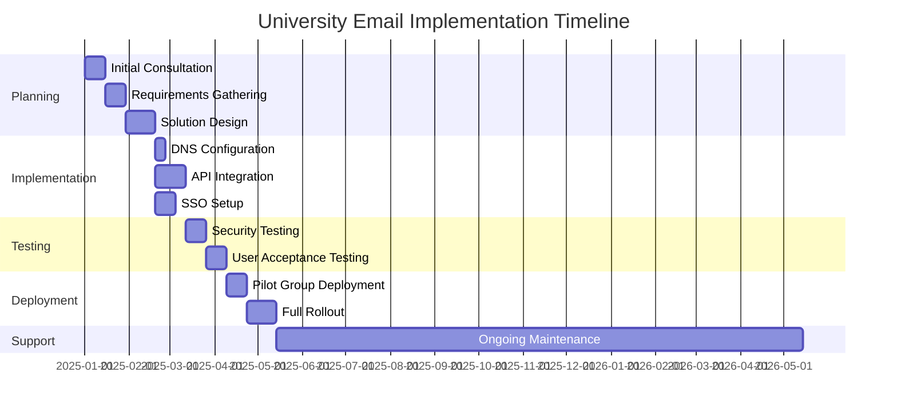
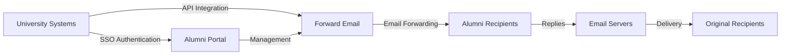

# Esettanulmány: Hogyan támogatja a Forward Email az alumni e-mail megoldásokat a vezető egyetemeken {#case-study-how-forward-email-powers-alumni-email-solutions-for-top-universities}


## Tartalomjegyzék {#table-of-contents}

* [Előszó](#foreword)
* [Drámai költségmegtakarítás stabil árazással](#dramatic-cost-savings-with-stable-pricing)
  * [Valós egyetemi megtakarítások](#real-world-university-savings)
* [Az egyetemi alumni e-mail kihívás](#the-university-alumni-email-challenge)
  * [Az alumni e-mail identitás értéke](#the-value-of-alumni-email-identity)
  * [A hagyományos megoldások hiányosságai](#traditional-solutions-fall-short)
  * [A Forward Email megoldás](#the-forward-email-solution)
* [Technikai megvalósítás: Hogyan működik](#technical-implementation-how-it-works)
  * [Alap architektúra](#core-architecture)
  * [Integráció az egyetemi rendszerekkel](#integration-with-university-systems)
  * [API-alapú menedzsment](#api-driven-management)
  * [DNS konfiguráció és ellenőrzés](#dns-configuration-and-verification)
  * [Tesztelés és minőségbiztosítás](#testing-and-quality-assurance)
* [Megvalósítási ütemterv](#implementation-timeline)
* [Megvalósítási folyamat: Migrációtól a karbantartásig](#implementation-process-from-migration-to-maintenance)
  * [Kezdeti felmérés és tervezés](#initial-assessment-and-planning)
  * [Migrációs stratégia](#migration-strategy)
  * [Technikai beállítás és konfiguráció](#technical-setup-and-configuration)
  * [Felhasználói élmény tervezése](#user-experience-design)
  * [Képzés és dokumentáció](#training-and-documentation)
  * [Folyamatos támogatás és optimalizálás](#ongoing-support-and-optimization)
* [Esettanulmány: Cambridge Egyetem](#case-study-university-of-cambridge)
  * [Kihívás](#challenge)
  * [Megoldás](#solution)
  * [Eredmények](#results)
* [Előnyök egyetemeknek és alumnioknak](#benefits-for-universities-and-alumni)
  * [Egyetemek számára](#for-universities)
  * [Alumniok számára](#for-alumni)
  * [Alumni elfogadási arányok](#adoption-rates-among-alumni)
  * [Költségmegtakarítás a korábbi megoldásokhoz képest](#cost-savings-compared-to-previous-solutions)
* [Biztonsági és adatvédelmi megfontolások](#security-and-privacy-considerations)
  * [Adatvédelmi intézkedések](#data-protection-measures)
  * [Megfelelőségi keretrendszer](#compliance-framework)
* [Jövőbeli fejlesztések](#future-developments)
* [Összefoglalás](#conclusion)


## Előszó {#foreword}

Megalkottuk a világ legbiztonságosabb, legprivátabb és legflexibilisebb e-mail továbbító szolgáltatását rangos egyetemek és alumni közösségeik számára.

A felsőoktatás versenykörnyezetében az alumniokkal való élethosszig tartó kapcsolattartás nem csupán hagyomány kérdése – stratégiai fontosságú. Az egyik legkézzelfoghatóbb módja annak, hogy az egyetemek erősítsék ezeket a kapcsolatokat, az alumni e-mail címek biztosítása, amelyek digitális identitást nyújtanak a végzetteknek, tükrözve akadémiai örökségüket.

A Forward Email-nél együttműködtünk a világ legelismertebb oktatási intézményeivel, hogy forradalmasítsuk az alumni e-mail szolgáltatások kezelését. Vállalati szintű e-mail továbbító megoldásunk jelenleg támogatja az alumni e-mail rendszereket a [Cambridge Egyetemen](https://en.wikipedia.org/wiki/University_of_Cambridge), a [Maryland Egyetemen](https://en.wikipedia.org/wiki/University_of_Maryland,_College_Park), a [Tufts Egyetemen](https://en.wikipedia.org/wiki/Tufts_University) és a [Swarthmore College-ban](https://en.wikipedia.org/wiki/Swarthmore_College), összesen több ezer alumni számára világszerte.

Ez a blogbejegyzés bemutatja, hogyan vált nyílt forráskódú, adatvédelmi fókuszú e-mail továbbító szolgáltatásunk ezeknek az intézményeknek a preferált megoldásává, a technikai megvalósításokat, amelyek lehetővé teszik ezt, valamint az adminisztratív hatékonyságra és az alumni elégedettségre gyakorolt átalakító hatását.


## Drámai költségmegtakarítás stabil árazással {#dramatic-cost-savings-with-stable-pricing}
A megoldásunk pénzügyi előnyei jelentősek, különösen a hagyományos e-mail szolgáltatók folyamatosan növekvő áraihoz képest:

| Megoldás                      | Költség egy volt hallgatóra (éves)                                                                        | Költség 100 000 volt hallgatóra | Legutóbbi áremelések                                                                                                                                                                     |
| ----------------------------- | --------------------------------------------------------------------------------------------------------- | ------------------------------- | ---------------------------------------------------------------------------------------------------------------------------------------------------------------------------------------- |
| Google Workspace for Business | 72 USD                                                                                                   | 7 200 000 USD                   | • 2019: G Suite Basic 5-ről 6 USD/hó-ra (+20%)<br>• 2023: Rugalmas csomagok 20%-os emelése<br>• 2025: Business Plus 18-ról 26,40 USD/hó-ra (+47%) AI funkciókkal                        |
| Google Workspace for Education| Ingyenes (Education Fundamentals)<br>3 USD/hallgató/év (Education Standard)<br>5 USD/hallgató/év (Education Plus) | Ingyenes - 500 000 USD          | • Mennyiségi kedvezmények: 5% 100-499 licenc esetén<br>• Mennyiségi kedvezmények: 10% 500+ licenc esetén<br>• Ingyenes szint korlátozva az alap szolgáltatásokra                        |
| Microsoft 365 Business        | 60 USD                                                                                                   | 6 000 000 USD                   | • 2023: Évente kétszeri árváltoztatás bevezetése<br>• 2025 (jan): Personal 6,99-ről 9,99 USD/hó-ra (+43%) Copilot AI-val<br>• 2025 (ápr): 5% emelés éves előfizetés esetén havi fizetéssel |
| Microsoft 365 Education       | Ingyenes (A1)<br>38-55 USD/oktató/év (A3)<br>65-96 USD/oktató/év (A5)                                   | Ingyenes - 96 000 USD           | • Hallgatói licencek gyakran benne vannak az oktatói vásárlásokban<br>• Egyedi árak mennyiségi licencelés esetén<br>• Ingyenes szint korlátozva a webes verziókra                      |
| Önállóan üzemeltetett Exchange| 45 USD                                                                                                   | 4 500 000 USD                   | Folyamatos karbantartási és biztonsági költségek folyamatos növekedése                                                                                                                  |
| **Forward Email Enterprise**  | **Fix 250 USD/hó**                                                                                       | **3 000 USD/év**                | **Indulás óta nem volt áremelés**                                                                                                                                                        |

### Valós egyetemi megtakarítások {#real-world-university-savings}

Így takarítanak meg évente partner egyetemeink a Forward Email választásával a hagyományos szolgáltatókkal szemben:

| Egyetem                 | Volt hallgatók száma | Éves költség Google-lal | Éves költség Forward Email-lel | Éves megtakarítás |
| ----------------------- | -------------------- | ----------------------- | ------------------------------ | ----------------- |
| Cambridge Egyetem       | 30 000               | 90 000 USD              | 3 000 USD                      | 87 000 USD        |
| Swarthmore College      | 5 000                | 15 000 USD              | 3 000 USD                      | 12 000 USD        |
| Tufts Egyetem           | 12 000               | 36 000 USD              | 3 000 USD                      | 33 000 USD        |
| Maryland Egyetem        | 25 000               | 75 000 USD              | 3 000 USD                      | 72 000 USD        |

> \[!NOTE]
> A Forward Email enterprise általában csak 250 USD/hó költséggel jár, felhasználónként nincs további díj, nincs fehérlistázott API-korlátozás, és az egyetlen további költség a tárhely, ha további GB/TB-ra van szükség a hallgatók számára (+3 USD minden további 10 GB tárhelyért). NVMe SSD meghajtókat használunk az IMAP/POP3/SMTP/CalDAV/CardDAV gyors támogatásához is.
> \[!IMPORTANT]
> Ellentétben a Google-lal és a Microsofttal, akik ismételten emelték áraikat miközben AI funkciókat integráltak, amelyek elemzik az adataidat, a Forward Email stabil árakat tart fenn, szigorú adatvédelmi fókusz mellett. Nem használunk AI-t, nem követjük a használati mintákat, és nem tárolunk naplókat vagy e-maileket lemezen (minden feldolgozás memóriában történik), így teljes adatvédelmet biztosítunk az alumni kommunikációid számára.

Ez jelentős költségcsökkenést jelent a hagyományos e-mail tárhely megoldásokhoz képest – az egyetemek ezeket az összegeket ösztöndíjakra, kutatásra vagy más, küldetésük szempontjából kritikus tevékenységekre fordíthatják. Az Email Vendor Selection 2023-as elemzése szerint az oktatási intézmények egyre inkább költséghatékony alternatívákat keresnek a hagyományos e-mail szolgáltatók helyett, mivel az árak az AI funkciók integrációjával tovább emelkednek ([Email Vendor Selection, 2023](https://www.emailvendorselection.com/email-service-provider-list/)).


## Az egyetemi alumni e-mail kihívás {#the-university-alumni-email-challenge}

Az egyetemek számára az alumni számára élethosszig tartó e-mail címek biztosítása egyedi kihívásokat jelent, amelyeket a hagyományos e-mail megoldások nehezen tudnak hatékonyan kezelni. Ahogy egy átfogó ServerFault vitában megjegyezték, a nagy felhasználói bázissal rendelkező egyetemek speciális e-mail megoldásokat igényelnek, amelyek egyensúlyt teremtenek a teljesítmény, a biztonság és a költséghatékonyság között ([ServerFault, 2009](https://serverfault.com/questions/97364/what-is-the-best-mail-server-for-a-university-with-a-large-amount-of-users)).

### Az alumni e-mail identitás értéke {#the-value-of-alumni-email-identity}

Az alumni e-mail címek (például `firstname.lastname@cl.cam.ac.uk` vagy `username@terpalum.umd.edu`) több fontos funkciót szolgálnak:

* Az intézményi kapcsolat és márkaidentitás fenntartása
* Folyamatos kommunikáció elősegítése az egyetemmel
* A végzettek szakmai hitelességének növelése
* Alumni hálózatépítés és közösségépítés támogatása
* Stabil, élethosszig tartó kapcsolattartási pont biztosítása

Tekade (2020) kutatása rámutat, hogy az oktatási e-mail címek számos előnyt nyújtanak az alumni számára, beleértve a hozzáférést akadémiai forrásokhoz, szakmai hitelességet és exkluzív kedvezményeket különféle szolgáltatásokra ([Medium, 2020](https://medium.com/coders-capsule/top-20-benefits-of-having-an-educational-email-address-91a09795e05)).

> \[!TIP]
> Látogasd meg új [AlumniEmail.com](https://alumniemail.com) könyvtárunkat, amely átfogó forrást kínál az egyetemi alumni e-mail szolgáltatásokról, beleértve a beállítási útmutatókat, legjobb gyakorlatokat és egy kereshető alumni e-mail domain könyvtárat. Ez központi hubként szolgál minden alumni e-mail információ számára.

### A hagyományos megoldások hiányosságai {#traditional-solutions-fall-short}

A hagyományos e-mail rendszerek több korláttal rendelkeznek, amikor az alumni e-mail igényekre alkalmazzák őket:

* **Költségvonzatú**: Felhasználónkénti licencelési modellek pénzügyileg fenntarthatatlanok nagy alumni bázis esetén
* **Adminisztratív terhek**: Több ezer vagy millió fiók kezelése jelentős IT erőforrásokat igényel
* **Biztonsági aggályok**: A tétlen fiókok biztonságának fenntartása növeli a sebezhetőséget
* **Korlátozott rugalmasság**: Merev rendszerek nem tudnak alkalmazkodni az alumni e-mail továbbítás egyedi igényeihez
* **Adatvédelmi problémák**: Sok szolgáltató reklámcélból átvizsgálja az e-mail tartalmat

Egy Quora vita az egyetemi e-mail karbantartásról rámutat, hogy a biztonsági aggályok az egyik fő oka annak, hogy az egyetemek korlátozhatják vagy megszüntethetik az alumni e-mail címeket, mivel a nem használt fiókok sebezhetőek lehetnek hackelésre és személyazonosság-lopásra ([Quora, 2011](https://www.quora.com/Is-there-any-cost-for-a-college-or-university-to-maintain-edu-e-mail-addresses)).

### A Forward Email megoldás {#the-forward-email-solution}

Megközelítésünk ezeket a kihívásokat egy alapvetően eltérő modell segítségével kezeli:

* E-mail továbbítás tárhely helyett
* Fix díjas árképzés felhasználónkénti költségek helyett
* Nyílt forráskódú architektúra az átláthatóság és biztonság érdekében
* Adatvédelmi fókuszú kialakítás, tartalomszkennelés nélkül
* Speciális funkciók az egyetemi identitás kezelésére


## Műszaki megvalósítás: Hogyan működik {#technical-implementation-how-it-works}
Megoldásunk kifinomult, mégis elegánsan egyszerű technikai architektúrát alkalmaz, hogy megbízható, biztonságos e-mail továbbítást biztosítson nagy léptékben.

### Alapvető architektúra {#core-architecture}

A Forward Email rendszer több kulcsfontosságú összetevőből áll:

* Elosztott MX szerverek a magas rendelkezésre állás érdekében
* Valós idejű továbbítás üzenettárolás nélkül
* Átfogó e-mail hitelesítés
* Egyedi domain és aldomain támogatás
* API-alapú fiókkezelés

A ServerFault IT szakemberei szerint egyetemi e-mail megoldások bevezetésére a Postfix ajánlott legjobb Mail Transfer Agent (MTA) megoldásként, míg az IMAP/POP3 hozzáféréshez a Courier vagy Dovecot a preferált ([ServerFault, 2009](https://serverfault.com/questions/97364/what-is-the-best-mail-server-for-a-university-with-a-large-amount-of-users)). Megoldásunk azonban megszünteti az egyetemek számára ezen összetett rendszerek önálló kezelésének szükségességét.

### Integráció az egyetemi rendszerekkel {#integration-with-university-systems}

Zökkenőmentes integrációs útvonalakat fejlesztettünk ki a meglévő egyetemi infrastruktúrával:

* Automatikus előfizetés [RESTful API](https://forwardemail.net/email-api) integráción keresztül
* Egyedi arculati lehetőségek az egyetemi portálok számára
* Rugalmas alias-kezelés karok és szervezetek részére
* Tömeges műveletek a hatékony adminisztráció érdekében

### API-alapú kezelés {#api-driven-management}

[RESTful API-nk](https://forwardemail.net/email-api) lehetővé teszi az egyetemek számára az e-mail kezelés automatizálását:

```javascript
// Példa: Új alumni e-mail cím létrehozása
const response = await fetch('https://forwardemail.net/api/v1/domains/example.edu/aliases', {
  method: 'POST',
  headers: {
    'Content-Type': 'application/json',
    'Authorization': `Basic ${Buffer.from(YOUR_API_TOKEN + ":").toString('base64')}`
  },
  body: JSON.stringify({
    name: 'alumni.john.smith',
    recipients: ['johnsmith@gmail.com'],
    has_recipient_verification: true
  })
});
```

### DNS konfiguráció és ellenőrzés {#dns-configuration-and-verification}

A megfelelő DNS konfiguráció kritikus az e-mailek kézbesítéséhez. Csapatunk segít:

* [DNS](https://en.wikipedia.org/wiki/Domain_Name_System) konfigurációban, beleértve az MX rekordokat
* Átfogó e-mail biztonsági megvalósításban nyílt forráskódú [mailauth](https://www.npmjs.com/package/mailauth) csomagunk segítségével, amely egy svájci bicska az e-mail hitelesítéshez, és kezeli:
  * [SPF](https://en.wikipedia.org/wiki/Sender_Policy_Framework) (Sender Policy Framework) az e-mail hamisítás megelőzésére
  * [DKIM](https://en.wikipedia.org/wiki/DomainKeys_Identified_Mail) (DomainKeys Identified Mail) az e-mail hitelesítéshez
  * [DMARC](https://en.wikipedia.org/wiki/Email_authentication) (Domain-based Message Authentication, Reporting & Conformance) a szabályzat érvényesítéséhez
  * [MTA-STS](https://en.wikipedia.org/wiki/Opportunistic_TLS) (SMTP MTA Strict Transport Security) a TLS titkosítás érvényesítéséhez
  * [ARC](https://en.wikipedia.org/wiki/DomainKeys_Identified_Mail#Authenticated_Received_Chain) (Authenticated Received Chain) az autentikáció megőrzéséhez továbbítás esetén
  * [SRS](https://en.wikipedia.org/wiki/Sender_Rewriting_Scheme) (Sender Rewriting Scheme) az SPF érvényesítés megőrzéséhez továbbítás során
  * [BIMI](https://en.wikipedia.org/wiki/Email_authentication) (Brand Indicators for Message Identification) a logó megjelenítéséhez támogató e-mail kliensekben
* DNS TXT rekord ellenőrzés a domain tulajdonjog igazolásához

A `mailauth` csomag (<http://npmjs.com/package/mailauth>) egy teljesen nyílt forráskódú megoldás, amely az e-mail hitelesítés minden aspektusát egy integrált könyvtárban kezeli. A zárt forráskódú megoldásokkal ellentétben ez az eljárás átláthatóságot, rendszeres biztonsági frissítéseket és teljes kontrollt biztosít az e-mail hitelesítési folyamat felett.

### Tesztelés és minőségbiztosítás {#testing-and-quality-assurance}

A teljes bevezetés előtt alapos tesztelést végzünk:

* Végponttól végpontig tartó e-mail kézbesítési tesztek
* Terheléses tesztelés nagy volumenű forgatókönyvekhez
* Biztonsági behatolás-tesztelés
* API integráció érvényesítése
* Felhasználói elfogadási tesztelés alumni képviselőkkel
## Megvalósítási Ütemterv {#implementation-timeline}


```mermaid
gantt
    title University Email Implementation Timeline
    dateFormat  YYYY-MM-DD
    section Planning
    Initial Consultation           :a1, 2025-01-01, 14d
    Requirements Gathering         :a2, after a1, 14d
    Solution Design                :a3, after a2, 21d
    section Implementation
    DNS Configuration              :b1, after a3, 7d
    API Integration                :b2, after a3, 21d
    SSO Setup                      :b3, after a3, 14d
    section Testing
    Security Testing               :c1, after b1 b2 b3, 14d
    User Acceptance Testing        :c2, after c1, 14d
    section Deployment
    Pilot Group Deployment         :d1, after c2, 14d
    Full Rollout                   :d2, after d1, 21d
    section Support
    Ongoing Maintenance            :e1, after d2, 365d
```


## Megvalósítási Folyamat: A Migrációtól a Karbantartásig {#implementation-process-from-migration-to-maintenance}

Strukturált megvalósítási folyamatunk zökkenőmentes átmenetet biztosít az egyetemek számára, amelyek megoldásunkat alkalmazzák.

### Kezdeti Felmérés és Tervezés {#initial-assessment-and-planning}

Az egyetem jelenlegi e-mail rendszerének, alumni adatbázisának és műszaki követelményeinek átfogó felmérésével kezdünk. Ez a szakasz magában foglalja:

* Érintetti interjúk az IT, alumni kapcsolatok és adminisztráció részéről
* A meglévő e-mail infrastruktúra műszaki auditja
* Alumni rekordok adatleképezése
* Biztonsági és megfelelőségi áttekintés
* Projekt ütemterv és mérföldkövek kidolgozása

### Migrációs Stratégia {#migration-strategy}

A felmérés alapján testreszabott migrációs stratégiát dolgozunk ki, amely minimalizálja a fennakadásokat, miközben biztosítja az adatok teljes integritását:

* Fázisokra bontott migráció alumni csoportok szerint
* Párhuzamos rendszerek működtetése az átmenet alatt
* Átfogó adatellenőrzési protokollok
* Visszaállítási eljárások bármilyen migrációs probléma esetén
* Egyértelmű kommunikációs terv minden érintett számára

### Műszaki Beállítás és Konfiguráció {#technical-setup-and-configuration}

Műszaki csapatunk kezeli a rendszerbeállítás minden aspektusát:

* DNS konfiguráció és ellenőrzés
* API integráció az egyetemi rendszerekkel
* Egyedi portál fejlesztése az egyetem arculatával
* E-mail hitelesítés beállítása (SPF, DKIM, DMARC)

### Felhasználói Élmény Tervezés {#user-experience-design}

Szorosan együttműködünk az egyetemekkel, hogy intuitív felületeket hozzunk létre mind az adminisztrátorok, mind az alumni számára:

* Egyedi arculatú alumni e-mail portálok
* Egyszerűsített e-mail továbbítás kezelése
* Mobilbarát kialakítások
* Hozzáférhetőségi megfelelőség
* Többnyelvű támogatás, ahol szükséges

### Képzés és Dokumentáció {#training-and-documentation}

Átfogó képzés biztosítja, hogy minden érintett hatékonyan tudja használni a rendszert:

* Adminisztrátori képzések
* Műszaki dokumentáció az IT személyzet számára
* Felhasználói útmutatók az alumni részére
* Videó oktatóanyagok gyakori feladatokhoz
* Tudásbázis fejlesztése

### Folyamatos Támogatás és Optimalizáció {#ongoing-support-and-optimization}

Partnerségünk a megvalósítást követően is folytatódik:

* 0-24 órás műszaki támogatás
* Rendszeres frissítések és biztonsági javítások
* Teljesítményfigyelés és optimalizáció
* Tanácsadás az e-mail legjobb gyakorlatokról
* Adat-elemzés és jelentéskészítés


## Esettanulmány: Cambridge-i Egyetem {#case-study-university-of-cambridge}

A Cambridge-i Egyetem olyan megoldást keresett, amely @cam.ac.uk e-mail címeket biztosít az alumni számára, miközben csökkenti az IT terheket és költségeket.

### Kihívás {#challenge}

Cambridge több kihívással szembesült korábbi alumni e-mail rendszerével kapcsolatban:

* Magas működési költségek a különálló e-mail infrastruktúra fenntartásáért
* Több ezer fiók adminisztratív kezelése
* Biztonsági aggályok a nem aktív fiókok miatt
* Korlátozott integráció az alumni adatbázis rendszerekkel
* Növekvő tárhelyigények

### Megoldás {#solution}

A Forward Email átfogó megoldást valósított meg:

* E-mail továbbítás minden @cam.ac.uk alumni címre
* Egyedi arculatú portál az alumni önkiszolgálásához
* API integráció a Cambridge alumni adatbázisával
* Átfogó e-mail biztonsági megvalósítás

### Eredmények {#results}

A megvalósítás jelentős előnyöket hozott:
* Jelentős költségcsökkentés a korábbi megoldáshoz képest
* 99,9%-os e-mail kézbesítési megbízhatóság
* Egyszerűsített adminisztráció automatizálással
* Fokozott biztonság modern e-mail hitelesítéssel
* Pozitív visszajelzések az öregdiákoktól a rendszer használhatóságáról


## Előnyök egyetemek és öregdiákok számára {#benefits-for-universities-and-alumni}

Megoldásunk kézzelfogható előnyöket nyújt mind az intézmények, mind a végzett hallgatók számára.

### Egyetemek számára {#for-universities}

* **Költséghatékonyság**: Fix ár az öregdiákok számától függetlenül
* **Adminisztratív egyszerűség**: Automatizált kezelés API-n keresztül
* **Fokozott biztonság**: Átfogó e-mail hitelesítés
* **Márkahűség**: Élettartamra szóló intézményi e-mail címek
* **Öregdiák kapcsolattartás**: Erősített kapcsolatok folyamatos szolgáltatással

A BulkSignature (2023) szerint az oktatási intézmények számára készült e-mail platformok jelentős előnyöket kínálnak, beleértve a költséghatékonyságot ingyenes vagy alacsony költségű csomagok révén, az időhatékonyságot tömeges kommunikációs lehetőségekkel, valamint a kézbesítés és az elköteleződés nyomon követését ([BulkSignature, 2023](https://bulksignature.com/blog/5-best-email-platforms-for-educational-institutions/)).

### Öregdiákok számára {#for-alumni}

* **Szakmai identitás**: Presztízs értékű egyetemi e-mail cím
* **E-mail folytonosság**: Átirányítás bármely személyes e-mailre
* **Adatvédelem**: Nincs tartalomszkennelés vagy adatbányászat
* **Egyszerűsített kezelés**: Könnyű címzett frissítés
* **Fokozott biztonság**: Modern e-mail hitelesítés

Az International Journal of Education & Literacy Studies kutatása kiemeli az e-mail kommunikáció fontosságát az akadémiai környezetben, megjegyezve, hogy az e-mail írástudás kulcsfontosságú készség mind a diákok, mind az öregdiákok számára a szakmai életben ([IJELS, 2021](https://files.eric.ed.gov/fulltext/EJ1319324.pdf)).

### Öregdiákok általi elfogadási arányok {#adoption-rates-among-alumni}

Az egyetemek magas elfogadási és elégedettségi arányról számolnak be öregdiák közösségeik körében.

### Költségmegtakarítás a korábbi megoldásokhoz képest {#cost-savings-compared-to-previous-solutions}

A pénzügyi hatás jelentős volt, az egyetemek jelentős költségmegtakarításról számoltak be a korábbi e-mail megoldásaikhoz képest.


## Biztonsági és adatvédelmi megfontolások {#security-and-privacy-considerations}

Az oktatási intézmények számára az öregdiák adatok védelme nem csupán jó gyakorlat – gyakran jogi követelmény is, például az Európai Unió GDPR szabályozása szerint.

### Adatvédelmi intézkedések {#data-protection-measures}

Megoldásunk több biztonsági réteget tartalmaz:

* Végpontok közötti titkosítás minden e-mail forgalomra
* E-mail tartalom tárolásának mellőzése szervereinken
* Rendszeres biztonsági auditok és behatolás-tesztelések
* Nemzetközi adatvédelmi szabványoknak való megfelelés
* Átlátható, nyílt forráskódú megoldás a biztonság ellenőrzéséhez

> \[!WARNING]
> Sok e-mail szolgáltató reklámcélból vagy AI modellek képzéséhez szkenneli az e-mailek tartalmát. Ez a gyakorlat komoly adatvédelmi aggályokat vet fel, különösen szakmai és akadémiai kommunikáció esetén. A Forward Email soha nem szkenneli az e-mailek tartalmát, és az összes e-mailt memóriában dolgozza fel a teljes adatvédelem érdekében.

### Megfelelőségi keretrendszer {#compliance-framework}

Szigorúan betartjuk a vonatkozó szabályozásokat:

* GDPR megfelelőség európai intézmények számára
* SOC 2 Type II tanúsítvány
* Éves biztonsági értékelések
* Adatfeldolgozási megállapodás (DPA) elérhető a [forwardemail.net/dpa](https://forwardemail.net/dpa) címen
* Rendszeres megfelelőségi frissítések a szabályozások változásával


## Jövőbeli fejlesztések {#future-developments}

Folyamatosan fejlesztjük az öregdiák e-mail megoldásunkat új funkciókkal és képességekkel:

* Fejlett elemzések egyetemi adminisztrátorok számára
* Haladó adathalászat elleni védelem
* Bővített API képességek mélyebb integrációhoz
* További hitelesítési lehetőségek


## Összefoglalás {#conclusion}

A Forward Email forradalmasította, hogyan biztosítanak és kezelnek az egyetemek öregdiák e-mail szolgáltatásokat. A költséges, bonyolult e-mail tárhely helyett elegáns, biztonságos e-mail továbbítást kínálva lehetővé tettük az intézmények számára, hogy élettartamra szóló e-mail címeket biztosítsanak minden öregdiákjuknak, miközben drámaian csökkentették a költségeket és az adminisztratív terheket.
Partnerségeink olyan neves intézményekkel, mint a Cambridge, Maryland, Tufts és Swarthmore, bizonyítják megközelítésünk hatékonyságát a különböző oktatási környezetekben. Ahogy az egyetemek egyre nagyobb nyomás alatt állnak, hogy fenntartsák az öregdiák-kapcsolatokat miközben kordában tartják a költségeket, megoldásunk vonzó alternatívát kínál a hagyományos e-mail rendszerekkel szemben.


```mermaid
flowchart LR
    A[University Systems] -->|API Integration| B[Forward Email]
    B -->|Email Forwarding| C[Alumni Recipients]
    C -->|Replies| D[Email Servers]
    D -->|Delivery| E[Original Recipients]
    F[Alumni Portal] -->|Management| B
    A -->|SSO Authentication| F
```

Azoknak az egyetemeknek, akik érdeklődnek afelől, hogyan alakíthatja át a Forward Email az öregdiák e-mail szolgáltatásaikat, kérjük, vegyék fel a kapcsolatot csapatunkkal a <support@forwardemail.net> címen, vagy látogassanak el a [forwardemail.net](https://forwardemail.net) oldalra, hogy többet megtudjanak vállalati megoldásainkról.
