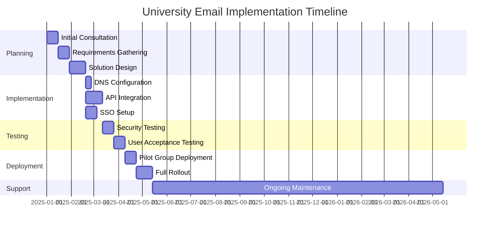
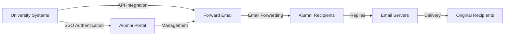

# Studi Kasus: Bagaimana Email Terusan Mendukung Solusi Email Alumni untuk Universitas Terkemuka {#case-study-how-forward-email-powers-alumni-email-solutions-for-top-universities}


## Daftar Isi {#table-of-contents}

* [Kata pengantar](#foreword)
* [Penghematan Biaya yang Drastis dengan Harga yang Stabil](#dramatic-cost-savings-with-stable-pricing)
  * [Penghematan Universitas di Dunia Nyata](#real-world-university-savings)
* [Tantangan Email Alumni Universitas](#the-university-alumni-email-challenge)
  * [Nilai Identitas Email Alumni](#the-value-of-alumni-email-identity)
  * [Solusi Tradisional Tidak Cukup](#traditional-solutions-fall-short)
  * [Solusi Email Teruskan](#the-forward-email-solution)
* [Implementasi Teknis: Cara Kerjanya](#technical-implementation-how-it-works)
  * [Arsitektur Inti](#core-architecture)
  * [Integrasi dengan Sistem Universitas](#integration-with-university-systems)
  * [Manajemen Berbasis API](#api-driven-management)
  * [Konfigurasi dan Verifikasi DNS](#dns-configuration-and-verification)
  * [Pengujian dan Jaminan Kualitas](#testing-and-quality-assurance)
* [Garis Waktu Implementasi](#implementation-timeline)
* [Proses Implementasi: Dari Migrasi ke Pemeliharaan](#implementation-process-from-migration-to-maintenance)
  * [Penilaian dan Perencanaan Awal](#initial-assessment-and-planning)
  * [Strategi Migrasi](#migration-strategy)
  * [Pengaturan dan Konfigurasi Teknis](#technical-setup-and-configuration)
  * [Desain Pengalaman Pengguna](#user-experience-design)
  * [Pelatihan dan Dokumentasi](#training-and-documentation)
  * [Dukungan dan Optimalisasi Berkelanjutan](#ongoing-support-and-optimization)
* [Studi Kasus: Universitas Cambridge](#case-study-university-of-cambridge)
  * [Tantangan](#challenge)
  * [Larutan](#solution)
  * [Hasil](#results)
* [Manfaat bagi Universitas dan Alumni](#benefits-for-universities-and-alumni)
  * [Untuk Universitas](#for-universities)
  * [Untuk Alumni](#for-alumni)
  * [Tingkat Adopsi di Kalangan Alumni](#adoption-rates-among-alumni)
  * [Penghematan Biaya Dibandingkan dengan Solusi Sebelumnya](#cost-savings-compared-to-previous-solutions)
* [Pertimbangan Keamanan dan Privasi](#security-and-privacy-considerations)
  * [Langkah-Langkah Perlindungan Data](#data-protection-measures)
  * [Kerangka Kepatuhan](#compliance-framework)
* [Perkembangan Masa Depan](#future-developments)
* [Kesimpulan](#conclusion)

## Kata Pengantar {#foreword}

Kami telah membangun layanan penerusan email paling aman, pribadi, dan fleksibel di dunia untuk universitas bergengsi dan alumninya.

Dalam lanskap pendidikan tinggi yang kompetitif, menjaga hubungan seumur hidup dengan alumni bukan sekadar tradisi—melainkan keharusan strategis. Salah satu cara paling nyata universitas membina hubungan ini adalah melalui alamat email alumni, yang memberikan lulusan identitas digital yang mencerminkan warisan akademis mereka.

Di Forward Email, kami telah bermitra dengan beberapa institusi pendidikan paling bergengsi di dunia untuk merevolusi cara mereka mengelola layanan email alumni. Solusi penerusan email tingkat perusahaan kami kini mendukung sistem email alumni untuk [Universitas Cambridge](https://en.wikipedia.org/wiki/University_of_Cambridge), [Universitas Maryland](https://en.wikipedia.org/wiki/University_of_Maryland,\_College_Park), [Universitas Tufts](https://en.wikipedia.org/wiki/Tufts_University), dan [Swarthmore College](https://en.wikipedia.org/wiki/Swarthmore_College), yang secara kolektif melayani ribuan alumni di seluruh dunia.

Tulisan blog ini membahas bagaimana layanan penerusan email [sumber terbuka](https://en.wikipedia.org/wiki/Open-source_software) kami yang berfokus pada privasi telah menjadi solusi pilihan bagi lembaga-lembaga ini, implementasi teknis yang memungkinkannya, dan dampak transformatif yang ditimbulkannya terhadap efisiensi administratif dan kepuasan alumni.

## Penghematan Biaya yang Drastis dengan Harga yang Stabil {#dramatic-cost-savings-with-stable-pricing}

Manfaat finansial dari solusi kami sangat besar, terutama jika dibandingkan dengan harga penyedia email tradisional yang terus meningkat:

| Larutan | Biaya per Alumni (Tahunan) | Biaya untuk 100.000 Alumni | Kenaikan Harga Terbaru |
| ------------------------------ | --------------------------------------------------------------------------------------------------------- | ----------------------- | ---------------------------------------------------------------------------------------------------------------------------------------------------------------------------------------- |
| Google Workspace untuk Bisnis | $72 | $7,200,000 | • 2019: G Suite Basic dari $5 menjadi $6/bulan (+20%)<br>• 2023: Paket fleksibel meningkat sebesar 20%<br>• 2025: Business Plus dari $18 menjadi $26,40/bulan (+47%) dengan fitur AI |
| Google Workspace untuk Pendidikan | Gratis (Pendidikan Dasar)<br>$3/siswa/tahun (Pendidikan Standar)<br>$5/siswa/tahun (Pendidikan Plus) | Gratis - $500.000 | • Diskon volume: 5% untuk 100-499 lisensi<br>• Diskon volume: 10% untuk 500+ lisensi<br>• Tingkat gratis terbatas pada layanan inti |
| Microsoft 365 Bisnis | $60 | $6,000,000 | • 2023: Memperkenalkan pembaruan harga dua kali setahun<br>• 2025 (Jan): Personal mulai dari $6,99 menjadi $9,99/bulan (+43%) dengan Copilot AI<br>• 2025 (Apr): Kenaikan 5% pada komitmen tahunan yang dibayarkan setiap bulan |
| Microsoft 365 Education | Gratis (A1)<br>$38-55/fakultas/tahun (A3)<br>$65-96/fakultas/tahun (A5) | Gratis - $96.000 | • Lisensi pelajar sering disertakan dengan pembelian fakultas<br>• Harga khusus melalui lisensi volume<br>• Tingkat gratis terbatas pada versi web |
| Pertukaran yang Dihosting Sendiri | $45 | $4,500,000 | Biaya pemeliharaan dan keamanan yang berkelanjutan terus meningkat |
| **Teruskan Email Perusahaan** | **Tetap $250/bulan** | **$3.000/tahun** | **Tidak ada kenaikan harga sejak peluncuran** |

### Penghematan Universitas Dunia Nyata {#real-world-university-savings}

Berikut ini adalah jumlah penghematan yang diperoleh universitas mitra kami setiap tahunnya dengan memilih Forward Email dibandingkan penyedia tradisional:

| Universitas | Jumlah Alumni | Biaya Tahunan dengan Google | Biaya Tahunan dengan Email Terusan | Penghematan Tahunan |
| ----------------------- | ------------ | ----------------------- | ------------------------------ | -------------- |
| Universitas Cambridge | 30,000 | $90,000 | $3,000 | $87,000 |
| Swarthmore College | 5,000 | $15,000 | $3,000 | $12,000 |
| Universitas Tufts | 12,000 | $36,000 | $3,000 | $33,000 |
| Universitas Maryland | 25,000 | $75,000 | $3,000 | $72,000 |

> \[!NOTE]
> Forward Email Enterprise biasanya hanya dikenakan biaya $250/bulan, tanpa biaya tambahan per pengguna, batasan tarif API yang diizinkan, dan satu-satunya biaya tambahan adalah penyimpanan jika Anda membutuhkan tambahan GB/TB untuk pelajar (+$3 per 10 GB penyimpanan tambahan). Kami juga menggunakan drive SSD NVMe untuk dukungan cepat IMAP/POP3/SMTP/CalDAV/CardDAV.

> \[!IMPORTANT]
> Tidak seperti Google dan Microsoft, yang telah berulang kali menaikkan harga mereka sambil mengintegrasikan fitur AI yang menganalisis data Anda, Forward Email mempertahankan harga yang stabil dengan fokus privasi yang ketat. Kami tidak menggunakan AI, tidak melacak pola penggunaan, dan tidak menyimpan log atau email ke disk (semua pemrosesan dilakukan di dalam memori), memastikan privasi penuh untuk komunikasi alumni Anda.

Hal ini menunjukkan pengurangan biaya yang signifikan dibandingkan solusi hosting email tradisional—dana yang dapat dialihkan universitas untuk beasiswa, penelitian, atau kegiatan penting lainnya. Menurut analisis tahun 2023 oleh Email Vendor Selection, institusi pendidikan semakin mencari alternatif yang hemat biaya untuk penyedia email tradisional karena harga terus meningkat dengan integrasi fitur AI ([Pemilihan Vendor Email, 2023](https://www.emailvendorselection.com/email-service-provider-list/)).

## Tantangan Email Alumni Universitas {#the-university-alumni-email-challenge}

Bagi universitas, menyediakan alamat email seumur hidup bagi alumni menghadirkan serangkaian tantangan unik yang sulit diatasi secara efektif oleh solusi email tradisional. Sebagaimana dijelaskan dalam diskusi komprehensif di ServerFault, universitas dengan basis pengguna yang besar memerlukan solusi email khusus yang menyeimbangkan kinerja, keamanan, dan efektivitas biaya ([Kesalahan Server, 2009](https://serverfault.com/questions/97364/what-is-the-best-mail-server-for-a-university-with-a-large-amount-of-users)).

### Nilai Identitas Email Alumni {#the-value-of-alumni-email-identity}

Alamat email alumni (seperti `firstname.lastname@cl.cam.ac.uk` atau `username@terpalum.umd.edu`) memiliki beberapa fungsi penting:

* Menjaga koneksi institusi dan identitas merek
* Memfasilitasi komunikasi berkelanjutan dengan universitas
* Meningkatkan kredibilitas profesional lulusan
* Mendukung jejaring alumni dan pembangunan komunitas
* Menyediakan titik kontak yang stabil dan seumur hidup

Penelitian oleh Tekade (2020) menyoroti bahwa alamat email pendidikan memberikan banyak manfaat bagi alumni, termasuk akses ke sumber daya akademik, kredibilitas profesional, dan diskon eksklusif untuk berbagai layanan ([Sedang, 2020](https://medium.com/coders-capsule/top-20-benefits-of-having-an-educational-email-address-91a09795e05)).

> \[!TIP]
> Kunjungi direktori [AlumniEmail.com](https://alumniemail.com) baru kami untuk mendapatkan sumber daya lengkap tentang layanan email alumni universitas, termasuk panduan pengaturan, praktik terbaik, dan direktori domain email alumni yang dapat dicari. Direktori ini berfungsi sebagai pusat informasi email alumni.

### Solusi Tradisional Tidak Cukup {#traditional-solutions-fall-short}

Sistem email konvensional memiliki beberapa keterbatasan saat diterapkan pada kebutuhan email alumni:

* **Biaya Terjangkau**: Model lisensi per pengguna menjadi tidak berkelanjutan secara finansial untuk basis alumni yang besar
* **Beban Administratif**: Mengelola ribuan atau jutaan akun membutuhkan sumber daya TI yang signifikan
* **Masalah Keamanan**: Menjaga keamanan untuk akun yang tidak aktif meningkatkan kerentanan
* **Fleksibilitas Terbatas**: Sistem yang kaku tidak dapat beradaptasi dengan kebutuhan unik penerusan email alumni
* **Masalah Privasi**: Banyak penyedia memindai konten email untuk tujuan periklanan

Diskusi Quora tentang pemeliharaan email universitas mengungkapkan bahwa masalah keamanan merupakan alasan utama universitas membatasi atau membatalkan alamat email alumni, karena akun yang tidak digunakan dapat rentan terhadap peretasan dan pencurian identitas ([Quora, tahun 2011](https://www.quora.com/Is-there-any-cost-for-a-college-or-university-to-maintain-edu-e-mail-addresses)).

### Solusi Email Terusan {#the-forward-email-solution}

Pendekatan kami mengatasi tantangan ini melalui model yang secara fundamental berbeda:

* Penerusan email, bukan hosting
* Harga tetap, bukan biaya per pengguna
* Arsitektur sumber terbuka untuk transparansi dan keamanan
* Desain yang mengutamakan privasi tanpa pemindaian konten
* Fitur khusus untuk manajemen identitas universitas

Implementasi Teknis ##: Cara Kerjanya {#technical-implementation-how-it-works}

Solusi kami memanfaatkan arsitektur teknis yang canggih namun tetap sederhana untuk memberikan penerusan email yang andal dan aman dalam skala besar.

### Arsitektur Inti {#core-architecture}

Sistem Email Teruskan terdiri dari beberapa komponen utama:

* Server MX terdistribusi untuk ketersediaan tinggi
* Penerusan real-time tanpa penyimpanan pesan
* Autentikasi email komprehensif
* Dukungan domain dan subdomain khusus
* Manajemen akun berbasis API

Menurut para profesional TI di ServerFault, bagi universitas yang ingin menerapkan solusi email mereka sendiri, Postfix direkomendasikan sebagai Agen Transfer Surat (MTA) terbaik, sementara Courier atau Dovecot lebih disukai untuk akses IMAP/POP3 ([Kesalahan Server, 2009](https://serverfault.com/questions/97364/what-is-the-best-mail-server-for-a-university-with-a-large-amount-of-users)). Namun, solusi kami menghilangkan kebutuhan universitas untuk mengelola sendiri sistem yang kompleks ini.

Integrasi ### dengan Sistem Universitas {#integration-with-university-systems}

Kami telah mengembangkan jalur integrasi yang mulus dengan infrastruktur universitas yang ada:

* Penyediaan otomatis melalui integrasi [API RESTful](https://forwardemail.net/email-api)
* Opsi branding khusus untuk portal universitas
* Manajemen alias yang fleksibel untuk departemen dan organisasi
* Operasi batch untuk administrasi yang efisien

### Manajemen Berbasis API {#api-driven-management}

[API RESTful](https://forwardemail.net/email-api) kami memungkinkan universitas untuk mengotomatiskan manajemen email:

```javascript
// Example: Creating a new alumni email address
const response = await fetch('https://forwardemail.net/api/v1/domains/example.edu/aliases', {
  method: 'POST',
  headers: {
    'Content-Type': 'application/json',
    'Authorization': `Basic ${Buffer.from(YOUR_API_TOKEN + ":").toString('base64')}`
  },
  body: JSON.stringify({
    name: 'alumni.john.smith',
    recipients: ['johnsmith@gmail.com'],
    has_recipient_verification: true
  })
});
```

### Konfigurasi dan Verifikasi DNS {#dns-configuration-and-verification}

Konfigurasi DNS yang tepat sangat penting untuk pengiriman email. Tim kami membantu dengan:

* Konfigurasi [DNS](https://en.wikipedia.org/wiki/Domain_Name_System) termasuk data MX
* Implementasi keamanan email komprehensif menggunakan paket [mailauth](https://www.npmjs.com/package/mailauth) sumber terbuka kami, sebuah Swiss Army Knife untuk autentikasi email yang menangani:
* [SPF](https://en.wikipedia.org/wiki/Sender_Policy_Framework) (Sender Policy Framework) untuk mencegah spoofing email
* [DKIM](https://en.wikipedia.org/wiki/DomainKeys_Identified_Mail) (DomainKeys Identified Mail) untuk autentikasi email
* [DMARC](https://en.wikipedia.org/wiki/Email_authentication) (Domain-based Message Authentication, Reporting & Conformance) untuk penegakan kebijakan
* [MTA-STS](https://en.wikipedia.org/wiki/Opportunistic_TLS) (SMTP MTA Strict Transport Security) untuk menegakkan enkripsi TLS
* [ARC](https://en.wikipedia.org/wiki/DomainKeys_Identified_Mail#Authenticated_Received_Chain) (Authenticated Received Chain) untuk mempertahankan autentikasi saat pesan diteruskan
* [SRS](https://en.wikipedia.org/wiki/Sender_Rewriting_Scheme) (Sender Rewriting Scheme) untuk mempertahankan validasi SPF melalui penerusan
* [BIMI](https://en.wikipedia.org/wiki/Email_authentication) (Brand Indicators for Message Identification) untuk logo ditampilkan di klien email pendukung
* Verifikasi rekaman DNS TXT untuk kepemilikan domain

Paket `mailauth` (<http://npmjs.com/package/mailauth>) adalah solusi sumber terbuka penuh yang menangani semua aspek autentikasi email dalam satu pustaka terintegrasi. Berbeda dengan solusi proprietary, pendekatan ini menjamin transparansi, pembaruan keamanan berkala, dan kendali penuh atas proses autentikasi email.

### Pengujian dan Jaminan Kualitas {#testing-and-quality-assurance}

Sebelum penerapan penuh, kami melakukan pengujian yang ketat:

* Pengujian pengiriman email menyeluruh
* Pengujian beban untuk skenario volume tinggi
* Pengujian penetrasi keamanan
* Validasi integrasi API
* Pengujian penerimaan pengguna dengan perwakilan alumni

## Garis Waktu Implementasi {#implementation-timeline}



Proses Implementasi ##: Dari Migrasi hingga Pemeliharaan {#implementation-process-from-migration-to-maintenance}

Proses implementasi terstruktur kami memastikan transisi yang lancar bagi universitas yang mengadopsi solusi kami.

### Penilaian dan Perencanaan Awal {#initial-assessment-and-planning}

Kami memulai dengan penilaian komprehensif terhadap sistem email universitas saat ini, basis data alumni, dan persyaratan teknis. Tahap ini meliputi:

* Wawancara pemangku kepentingan dengan tim TI, hubungan alumni, dan administrasi
* Audit teknis infrastruktur email yang ada
* Pemetaan data untuk arsip alumni
* Tinjauan keamanan dan kepatuhan
* Pengembangan linimasa dan tonggak proyek

### Strategi Migrasi {#migration-strategy}

Berdasarkan penilaian, kami mengembangkan strategi migrasi khusus yang meminimalkan gangguan sekaligus memastikan integritas data yang lengkap:

* Pendekatan migrasi bertahap oleh kelompok alumni
* Operasi sistem paralel selama transisi
* Protokol validasi data yang komprehensif
* Prosedur cadangan untuk setiap masalah migrasi
* Rencana komunikasi yang jelas untuk semua pemangku kepentingan

### Penyiapan dan Konfigurasi Teknis {#technical-setup-and-configuration}

Tim teknis kami menangani semua aspek pengaturan sistem:

* Konfigurasi dan verifikasi DNS
* Integrasi API dengan sistem universitas
* Pengembangan portal khusus dengan branding universitas
* Pengaturan autentikasi email (SPF, DKIM, DMARC)

### Desain Pengalaman Pengguna {#user-experience-design}

Kami bekerja sama erat dengan universitas untuk menciptakan antarmuka intuitif bagi administrator dan alumni:

* Portal email alumni dengan merek khusus
* Manajemen penerusan email yang disederhanakan
* Desain responsif seluler
* Kepatuhan aksesibilitas
* Dukungan multibahasa jika diperlukan

### Pelatihan dan Dokumentasi {#training-and-documentation}

Pelatihan komprehensif memastikan semua pemangku kepentingan dapat menggunakan sistem secara efektif:

* Sesi pelatihan administrator
* Dokumentasi teknis untuk staf TI
* Panduan pengguna untuk alumni
* Tutorial video untuk tugas-tugas umum
* Pengembangan basis pengetahuan

### Dukungan dan Optimalisasi Berkelanjutan {#ongoing-support-and-optimization}

Kemitraan kami berlanjut jauh melampaui implementasi:

* Dukungan teknis 24/7
* Pembaruan sistem dan patch keamanan berkala
* Pemantauan dan pengoptimalan kinerja
* Konsultasi praktik terbaik email
* Analisis dan pelaporan data

## Studi Kasus: Universitas Cambridge {#case-study-university-of-cambridge}

Universitas Cambridge mencari solusi untuk menyediakan alamat email @cam.ac.uk kepada alumni sekaligus mengurangi biaya overhead dan biaya TI.

### Tantangan {#challenge}

Cambridge menghadapi beberapa tantangan dengan sistem email alumni mereka sebelumnya:

* Biaya operasional yang tinggi untuk memelihara infrastruktur email terpisah
* Beban administratif dalam mengelola ribuan akun
* Masalah keamanan dengan akun yang tidak aktif
* Integrasi terbatas dengan sistem basis data alumni
* Meningkatnya kebutuhan penyimpanan

### Solusi {#solution}

Forward Email menerapkan solusi komprehensif:

* Penerusan email untuk semua alamat alumni @cam.ac.uk
* Portal khusus untuk layanan mandiri alumni
* Integrasi API dengan basis data alumni Cambridge
* Implementasi keamanan email yang komprehensif

### Hasil {#results}

Implementasinya memberikan manfaat yang signifikan:

* Pengurangan biaya yang signifikan dibandingkan solusi sebelumnya
* Keandalan pengiriman email 99,9%
* Administrasi yang disederhanakan melalui otomatisasi
* Keamanan yang ditingkatkan dengan autentikasi email modern
* Umpan balik alumni yang positif mengenai kegunaan sistem

## Manfaat bagi Universitas dan Alumni {#benefits-for-universities-and-alumni}

Solusi kami memberikan manfaat nyata bagi institusi dan lulusannya.

### Untuk Universitas {#for-universities}

* **Efisiensi Biaya**: Harga tetap terlepas dari jumlah alumni
* **Kemudahan Administratif**: Manajemen otomatis melalui API
* **Keamanan yang Ditingkatkan**: Autentikasi email yang komprehensif
* **Konsistensi Merek**: Alamat email institusi seumur hidup
* **Keterlibatan Alumni**: Koneksi yang diperkuat melalui layanan berkelanjutan

Menurut BulkSignature (2023), platform email untuk institusi pendidikan menawarkan manfaat signifikan termasuk efektivitas biaya melalui paket gratis atau berbiaya rendah, efisiensi waktu melalui kemampuan komunikasi massa, dan fitur pelacakan untuk memantau pengiriman dan keterlibatan email ([BulkSignature, 2023](https://bulksignature.com/blog/5-best-email-platforms-for-educational-institutions/)).

### Untuk Alumni {#for-alumni}

* **Identitas Profesional**: Alamat email universitas bergengsi
* **Kontinuitas Email**: Teruskan ke email pribadi apa pun
* **Perlindungan Privasi**: Tanpa pemindaian konten atau penggalian data
* **Manajemen yang Disederhanakan**: Pembaruan penerima yang mudah
* **Keamanan yang Ditingkatkan**: Autentikasi email modern

Penelitian dari International Journal of Education & Literacy Studies menyoroti pentingnya komunikasi email yang tepat dalam lingkungan akademis, dengan mencatat bahwa literasi email merupakan keterampilan penting bagi mahasiswa dan alumni dalam konteks profesional ([IJELS, 2021](https://files.eric.ed.gov/fulltext/EJ1319324.pdf)).

Tingkat Adopsi ### di Kalangan Alumni {#adoption-rates-among-alumni}

Universitas melaporkan tingkat adopsi dan kepuasan yang tinggi di antara komunitas alumni mereka.

Penghematan Biaya ### Dibandingkan dengan Solusi Sebelumnya {#cost-savings-compared-to-previous-solutions}

Dampak keuangannya cukup besar, dengan universitas melaporkan penghematan biaya yang signifikan dibandingkan dengan solusi email mereka sebelumnya.

## Pertimbangan Keamanan dan Privasi {#security-and-privacy-considerations}

Bagi lembaga pendidikan, melindungi data alumni bukan sekadar praktik yang baik—ini sering kali merupakan persyaratan hukum berdasarkan peraturan seperti GDPR di Eropa.

### Langkah-Langkah Perlindungan Data {#data-protection-measures}

Solusi kami menggabungkan beberapa lapisan keamanan:

* Enkripsi menyeluruh untuk semua lalu lintas email
* Tidak ada penyimpanan konten email di server kami
* Audit keamanan dan uji penetrasi rutin
* Kepatuhan terhadap standar perlindungan data internasional
* Kode sumber terbuka yang transparan untuk verifikasi keamanan

> \[!WARNING]
> Banyak penyedia email memindai konten email untuk tujuan periklanan atau untuk melatih model AI. Praktik ini menimbulkan kekhawatiran serius tentang privasi, terutama untuk komunikasi profesional dan akademis. Forward Email tidak pernah memindai konten email dan memproses semua email di dalam memori untuk memastikan privasi sepenuhnya.

### Kerangka Kerja Kepatuhan {#compliance-framework}

Kami menjaga kepatuhan yang ketat terhadap peraturan yang relevan:

* Kepatuhan GDPR untuk institusi Eropa
* Sertifikasi SOC 2 Tipe II
* Penilaian keamanan tahunan
* Perjanjian Pemrosesan Data (DPA) tersedia di [forwardemail.net/dpa](https://forwardemail.net/dpa)
* Pembaruan kepatuhan berkala seiring perkembangan peraturan

## Perkembangan Mendatang {#future-developments}

Kami terus meningkatkan solusi email alumni kami dengan fitur dan kemampuan baru:

* Analisis yang ditingkatkan untuk administrator universitas
* Perlindungan anti-phishing tingkat lanjut
* Kemampuan API yang diperluas untuk integrasi yang lebih mendalam
* Opsi autentikasi tambahan

## Kesimpulan {#conclusion}

Forward Email telah merevolusi cara universitas menyediakan dan mengelola layanan email alumni. Dengan mengganti hosting email yang mahal dan rumit dengan penerusan email yang elegan dan aman, kami telah memungkinkan institusi untuk menawarkan alamat email seumur hidup kepada semua alumni sekaligus mengurangi biaya dan beban administrasi secara drastis.

Kemitraan kami dengan institusi bergengsi seperti Cambridge, Maryland, Tufts, dan Swarthmore menunjukkan efektivitas pendekatan kami di berbagai lingkungan pendidikan. Seiring universitas menghadapi tekanan yang semakin besar untuk mempertahankan koneksi alumni sekaligus mengendalikan biaya, solusi kami menawarkan alternatif yang menarik bagi sistem email tradisional.



Untuk universitas yang tertarik mempelajari bagaimana Forward Email dapat mengubah layanan email alumni mereka, hubungi tim kami di <support@forwardemail.net> atau kunjungi [forwardemail.net](https://forwardemail.net) untuk mempelajari lebih lanjut tentang solusi perusahaan kami.