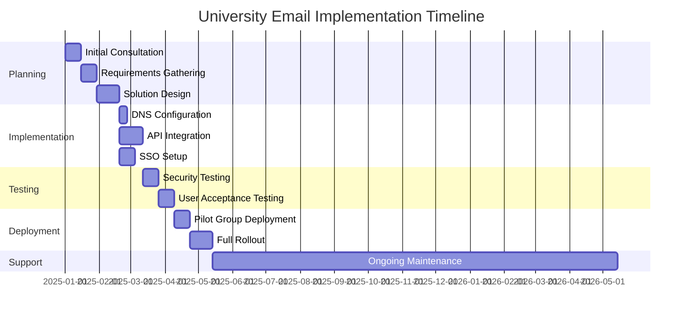
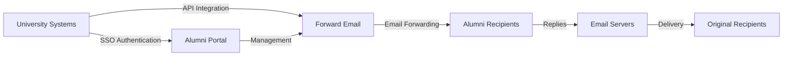

# Studi Kasus: Bagaimana Forward Email Mendukung Solusi Email Alumni untuk Universitas Teratas {#case-study-how-forward-email-powers-alumni-email-solutions-for-top-universities}


## Daftar Isi {#table-of-contents}

* [Kata Pengantar](#foreword)
* [Penghematan Biaya Dramatis dengan Harga Stabil](#dramatic-cost-savings-with-stable-pricing)
  * [Penghematan Nyata di Universitas](#real-world-university-savings)
* [Tantangan Email Alumni Universitas](#the-university-alumni-email-challenge)
  * [Nilai Identitas Email Alumni](#the-value-of-alumni-email-identity)
  * [Solusi Tradisional yang Kurang Memadai](#traditional-solutions-fall-short)
  * [Solusi Forward Email](#the-forward-email-solution)
* [Implementasi Teknis: Cara Kerjanya](#technical-implementation-how-it-works)
  * [Arsitektur Inti](#core-architecture)
  * [Integrasi dengan Sistem Universitas](#integration-with-university-systems)
  * [Manajemen Berbasis API](#api-driven-management)
  * [Konfigurasi dan Verifikasi DNS](#dns-configuration-and-verification)
  * [Pengujian dan Jaminan Kualitas](#testing-and-quality-assurance)
* [Garis Waktu Implementasi](#implementation-timeline)
* [Proses Implementasi: Dari Migrasi hingga Pemeliharaan](#implementation-process-from-migration-to-maintenance)
  * [Penilaian dan Perencanaan Awal](#initial-assessment-and-planning)
  * [Strategi Migrasi](#migration-strategy)
  * [Pengaturan dan Konfigurasi Teknis](#technical-setup-and-configuration)
  * [Desain Pengalaman Pengguna](#user-experience-design)
  * [Pelatihan dan Dokumentasi](#training-and-documentation)
  * [Dukungan dan Optimasi Berkelanjutan](#ongoing-support-and-optimization)
* [Studi Kasus: University of Cambridge](#case-study-university-of-cambridge)
  * [Tantangan](#challenge)
  * [Solusi](#solution)
  * [Hasil](#results)
* [Manfaat untuk Universitas dan Alumni](#benefits-for-universities-and-alumni)
  * [Untuk Universitas](#for-universities)
  * [Untuk Alumni](#for-alumni)
  * [Tingkat Adopsi di Kalangan Alumni](#adoption-rates-among-alumni)
  * [Penghematan Biaya Dibandingkan Solusi Sebelumnya](#cost-savings-compared-to-previous-solutions)
* [Pertimbangan Keamanan dan Privasi](#security-and-privacy-considerations)
  * [Langkah Perlindungan Data](#data-protection-measures)
  * [Kerangka Kepatuhan](#compliance-framework)
* [Pengembangan Masa Depan](#future-developments)
* [Kesimpulan](#conclusion)


## Kata Pengantar {#foreword}

Kami telah membangun layanan penerusan email yang paling aman, privat, dan fleksibel di dunia untuk universitas bergengsi dan para alumninya.

Dalam lanskap pendidikan tinggi yang kompetitif, menjaga hubungan seumur hidup dengan alumni bukan hanya soal tradisi—melainkan sebuah keharusan strategis. Salah satu cara paling nyata universitas memupuk hubungan ini adalah melalui alamat email alumni, yang memberikan lulusan identitas digital yang mencerminkan warisan akademik mereka.

Di Forward Email, kami telah bermitra dengan beberapa institusi pendidikan paling bergengsi di dunia untuk merevolusi cara mereka mengelola layanan email alumni. Solusi penerusan email kelas perusahaan kami kini mendukung sistem email alumni untuk [University of Cambridge](https://en.wikipedia.org/wiki/University_of_Cambridge), [University of Maryland](https://en.wikipedia.org/wiki/University_of_Maryland,_College_Park), [Tufts University](https://en.wikipedia.org/wiki/Tufts_University), dan [Swarthmore College](https://en.wikipedia.org/wiki/Swarthmore_College), yang secara kolektif melayani ribuan alumni di seluruh dunia.

Posting blog ini mengeksplorasi bagaimana layanan penerusan email kami yang [open-source](https://en.wikipedia.org/wiki/Open-source_software) dan berfokus pada privasi telah menjadi solusi pilihan bagi institusi-institusi ini, implementasi teknis yang memungkinkan hal tersebut, serta dampak transformatif yang dirasakan baik dari sisi efisiensi administrasi maupun kepuasan alumni.


## Penghematan Biaya Dramatis dengan Harga Stabil {#dramatic-cost-savings-with-stable-pricing}
Manfaat finansial dari solusi kami sangat besar, terutama jika dibandingkan dengan harga yang terus meningkat dari penyedia email tradisional:

| Solusi                        | Biaya per Alumni (Tahunan)                                                                                 | Biaya untuk 100.000 Alumni | Kenaikan Harga Terbaru                                                                                                                                                                   |
| ------------------------------ | --------------------------------------------------------------------------------------------------------- | -------------------------- | ---------------------------------------------------------------------------------------------------------------------------------------------------------------------------------------- |
| Google Workspace for Business  | $72                                                                                                       | $7.200.000                 | • 2019: G Suite Basic dari $5 menjadi $6/bulan (+20%)<br>• 2023: Paket fleksibel naik 20%<br>• 2025: Business Plus dari $18 menjadi $26,40/bulan (+47%) dengan fitur AI                    |
| Google Workspace for Education | Gratis (Education Fundamentals)<br>$3/siswa/tahun (Education Standard)<br>$5/siswa/tahun (Education Plus) | Gratis - $500.000          | • Diskon volume: 5% untuk 100-499 lisensi<br>• Diskon volume: 10% untuk 500+ lisensi<br>• Tingkat gratis terbatas pada layanan inti                                                         |
| Microsoft 365 Business         | $60                                                                                                       | $6.000.000                 | • 2023: Memperkenalkan pembaruan harga dua kali setahun<br>• 2025 (Jan): Personal dari $6,99 menjadi $9,99/bulan (+43%) dengan Copilot AI<br>• 2025 (Apr): Kenaikan 5% pada komitmen tahunan yang dibayar bulanan |
| Microsoft 365 Education        | Gratis (A1)<br>$38-55/dosen/tahun (A3)<br>$65-96/dosen/tahun (A5)                                         | Gratis - $96.000           | • Lisensi siswa sering termasuk dengan pembelian dosen<br>• Harga khusus melalui lisensi volume<br>• Tingkat gratis terbatas pada versi web                                             |
| Self-Hosted Exchange           | $45                                                                                                       | $4.500.000                 | Biaya pemeliharaan dan keamanan yang berkelanjutan terus meningkat                                                                                                                        |
| **Forward Email Enterprise**   | **Tetap $250/bulan**                                                                                       | **$3.000/tahun**           | **Tidak ada kenaikan harga sejak peluncuran**                                                                                                                                             |

### Penghematan Nyata di Universitas {#real-world-university-savings}

Berikut adalah berapa banyak universitas mitra kami menghemat setiap tahun dengan memilih Forward Email dibandingkan penyedia tradisional:

| Universitas               | Jumlah Alumni | Biaya Tahunan dengan Google | Biaya Tahunan dengan Forward Email | Penghematan Tahunan |
| ------------------------- | ------------- | --------------------------- | --------------------------------- | ------------------- |
| University of Cambridge   | 30.000        | $90.000                    | $3.000                            | $87.000             |
| Swarthmore College        | 5.000         | $15.000                    | $3.000                            | $12.000             |
| Tufts University          | 12.000        | $36.000                    | $3.000                            | $33.000             |
| University of Maryland    | 25.000        | $75.000                    | $3.000                            | $72.000             |

> \[!NOTE]
> Forward Email enterprise biasanya hanya berbiaya $250/bulan, tanpa biaya tambahan per pengguna, batasan API whitelist, dan satu-satunya biaya tambahan adalah penyimpanan jika Anda membutuhkan GB/TB tambahan untuk siswa (+$3 per 10 GB penyimpanan tambahan). Kami menggunakan drive NVMe SSD untuk mendukung IMAP/POP3/SMTP/CalDAV/CardDAV dengan cepat juga.
> \[!IMPORTANT]
> Berbeda dengan Google dan Microsoft, yang telah berulang kali menaikkan harga mereka sambil mengintegrasikan fitur AI yang menganalisis data Anda, Forward Email mempertahankan harga yang stabil dengan fokus ketat pada privasi. Kami tidak menggunakan AI, tidak melacak pola penggunaan, dan tidak menyimpan log atau email ke disk (semua pemrosesan dilakukan di memori), memastikan privasi lengkap untuk komunikasi alumni Anda.

Ini merupakan pengurangan biaya yang signifikan dibandingkan dengan solusi hosting email tradisional—dana yang dapat dialihkan universitas ke beasiswa, penelitian, atau aktivitas penting lainnya. Menurut analisis tahun 2023 oleh Email Vendor Selection, institusi pendidikan semakin mencari alternatif yang hemat biaya dibandingkan penyedia email tradisional karena harga terus naik dengan integrasi fitur AI ([Email Vendor Selection, 2023](https://www.emailvendorselection.com/email-service-provider-list/)).


## Tantangan Email Alumni Universitas {#the-university-alumni-email-challenge}

Bagi universitas, menyediakan alamat email seumur hidup untuk alumni menghadirkan serangkaian tantangan unik yang sulit diatasi secara efektif oleh solusi email tradisional. Seperti yang dicatat dalam diskusi komprehensif di ServerFault, universitas dengan basis pengguna besar memerlukan solusi email khusus yang menyeimbangkan kinerja, keamanan, dan efektivitas biaya ([ServerFault, 2009](https://serverfault.com/questions/97364/what-is-the-best-mail-server-for-a-university-with-a-large-amount-of-users)).

### Nilai Identitas Email Alumni {#the-value-of-alumni-email-identity}

Alamat email alumni (seperti `firstname.lastname@cl.cam.ac.uk` atau `username@terpalum.umd.edu`) memiliki beberapa fungsi penting:

* Mempertahankan koneksi institusional dan identitas merek
* Memfasilitasi komunikasi berkelanjutan dengan universitas
* Meningkatkan kredibilitas profesional bagi lulusan
* Mendukung jaringan alumni dan pembangunan komunitas
* Menyediakan titik kontak yang stabil dan seumur hidup

Penelitian oleh Tekade (2020) menyoroti bahwa alamat email pendidikan memberikan banyak manfaat bagi alumni, termasuk akses ke sumber daya akademik, kredibilitas profesional, dan diskon eksklusif pada berbagai layanan ([Medium, 2020](https://medium.com/coders-capsule/top-20-benefits-of-having-an-educational-email-address-91a09795e05)).

> \[!TIP]
> Kunjungi direktori baru kami di [AlumniEmail.com](https://alumniemail.com) untuk sumber daya komprehensif tentang layanan email alumni universitas, termasuk panduan pengaturan, praktik terbaik, dan direktori domain email alumni yang dapat dicari. Ini berfungsi sebagai pusat informasi lengkap untuk semua hal terkait email alumni.

### Solusi Tradisional Kurang Memadai {#traditional-solutions-fall-short}

Sistem email konvensional memiliki beberapa keterbatasan ketika diterapkan pada kebutuhan email alumni:

* **Biaya Tinggi**: Model lisensi per pengguna menjadi tidak berkelanjutan secara finansial untuk basis alumni yang besar
* **Beban Administratif**: Mengelola ribuan atau jutaan akun membutuhkan sumber daya TI yang signifikan
* **Kekhawatiran Keamanan**: Mempertahankan keamanan untuk akun yang tidak aktif meningkatkan kerentanan
* **Fleksibilitas Terbatas**: Sistem kaku tidak dapat menyesuaikan dengan kebutuhan unik penerusan email alumni
* **Masalah Privasi**: Banyak penyedia memindai konten email untuk tujuan iklan

Diskusi di Quora tentang pemeliharaan email universitas mengungkapkan bahwa kekhawatiran keamanan adalah alasan utama universitas mungkin membatasi atau membatalkan alamat email alumni, karena akun yang tidak digunakan dapat rentan terhadap peretasan dan pencurian identitas ([Quora, 2011](https://www.quora.com/Is-there-any-cost-for-a-college-or-university-to-maintain-edu-e-mail-addresses)).

### Solusi Forward Email {#the-forward-email-solution}

Pendekatan kami mengatasi tantangan ini melalui model yang secara fundamental berbeda:

* Penerusan email daripada hosting
* Harga tetap alih-alih biaya per pengguna
* Arsitektur sumber terbuka untuk transparansi dan keamanan
* Desain berfokus pada privasi tanpa pemindaian konten
* Fitur khusus untuk manajemen identitas universitas


## Implementasi Teknis: Cara Kerjanya {#technical-implementation-how-it-works}
Solusi kami memanfaatkan arsitektur teknis yang canggih namun sederhana secara elegan untuk memberikan penerusan email yang andal dan aman dalam skala besar.

### Core Architecture {#core-architecture}

Sistem Forward Email terdiri dari beberapa komponen utama:

* Server MX terdistribusi untuk ketersediaan tinggi
* Penerusan waktu nyata tanpa penyimpanan pesan
* Autentikasi email yang komprehensif
* Dukungan domain dan subdomain khusus
* Manajemen akun berbasis API

Menurut para profesional TI di ServerFault, untuk universitas yang ingin mengimplementasikan solusi email mereka sendiri, Postfix direkomendasikan sebagai Mail Transfer Agent (MTA) terbaik, sementara Courier atau Dovecot lebih disukai untuk akses IMAP/POP3 ([ServerFault, 2009](https://serverfault.com/questions/97364/what-is-the-best-mail-server-for-a-university-with-a-large-amount-of-users)). Namun, solusi kami menghilangkan kebutuhan universitas untuk mengelola sistem kompleks ini sendiri.

### Integration with University Systems {#integration-with-university-systems}

Kami telah mengembangkan jalur integrasi mulus dengan infrastruktur universitas yang ada:

* Provisioning otomatis melalui integrasi [RESTful API](https://forwardemail.net/email-api)
* Opsi branding khusus untuk portal universitas
* Manajemen alias fleksibel untuk departemen dan organisasi
* Operasi batch untuk administrasi yang efisien

### API-Driven Management {#api-driven-management}

[RESTful API](https://forwardemail.net/email-api) kami memungkinkan universitas mengotomatisasi manajemen email:

```javascript
// Contoh: Membuat alamat email alumni baru
const response = await fetch('https://forwardemail.net/api/v1/domains/example.edu/aliases', {
  method: 'POST',
  headers: {
    'Content-Type': 'application/json',
    'Authorization': `Basic ${Buffer.from(YOUR_API_TOKEN + ":").toString('base64')}`
  },
  body: JSON.stringify({
    name: 'alumni.john.smith',
    recipients: ['johnsmith@gmail.com'],
    has_recipient_verification: true
  })
});
```

### DNS Configuration and Verification {#dns-configuration-and-verification}

Konfigurasi DNS yang tepat sangat penting untuk pengiriman email. Tim kami membantu dengan:

* Konfigurasi [DNS](https://en.wikipedia.org/wiki/Domain_Name_System) termasuk catatan MX
* Implementasi keamanan email komprehensif menggunakan paket open-source kami [mailauth](https://www.npmjs.com/package/mailauth), sebuah alat multifungsi untuk autentikasi email yang menangani:
  * [SPF](https://en.wikipedia.org/wiki/Sender_Policy_Framework) (Sender Policy Framework) untuk mencegah pemalsuan email
  * [DKIM](https://en.wikipedia.org/wiki/DomainKeys_Identified_Mail) (DomainKeys Identified Mail) untuk autentikasi email
  * [DMARC](https://en.wikipedia.org/wiki/Email_authentication) (Domain-based Message Authentication, Reporting & Conformance) untuk penegakan kebijakan
  * [MTA-STS](https://en.wikipedia.org/wiki/Opportunistic_TLS) (SMTP MTA Strict Transport Security) untuk menegakkan enkripsi TLS
  * [ARC](https://en.wikipedia.org/wiki/DomainKeys_Identified_Mail#Authenticated_Received_Chain) (Authenticated Received Chain) untuk mempertahankan autentikasi saat pesan diteruskan
  * [SRS](https://en.wikipedia.org/wiki/Sender_Rewriting_Scheme) (Sender Rewriting Scheme) untuk menjaga validasi SPF melalui penerusan
  * [BIMI](https://en.wikipedia.org/wiki/Email_authentication) (Brand Indicators for Message Identification) untuk menampilkan logo di klien email yang mendukung
* Verifikasi catatan DNS TXT untuk kepemilikan domain

Paket `mailauth` (<http://npmjs.com/package/mailauth>) adalah solusi open-source penuh yang menangani semua aspek autentikasi email dalam satu perpustakaan terintegrasi. Berbeda dengan solusi proprietary, pendekatan ini memastikan transparansi, pembaruan keamanan rutin, dan kontrol penuh atas proses autentikasi email.

### Testing and Quality Assurance {#testing-and-quality-assurance}

Sebelum penerapan penuh, kami melakukan pengujian ketat:

* Pengujian pengiriman email end-to-end
* Pengujian beban untuk skenario volume tinggi
* Pengujian penetrasi keamanan
* Validasi integrasi API
* Pengujian penerimaan pengguna dengan perwakilan alumni
## Garis Waktu Implementasi {#implementation-timeline}


```mermaid
gantt
    title University Email Implementation Timeline
    dateFormat  YYYY-MM-DD
    section Planning
    Initial Consultation           :a1, 2025-01-01, 14d
    Requirements Gathering         :a2, after a1, 14d
    Solution Design                :a3, after a2, 21d
    section Implementation
    DNS Configuration              :b1, after a3, 7d
    API Integration                :b2, after a3, 21d
    SSO Setup                      :b3, after a3, 14d
    section Testing
    Security Testing               :c1, after b1 b2 b3, 14d
    User Acceptance Testing        :c2, after c1, 14d
    section Deployment
    Pilot Group Deployment         :d1, after c2, 14d
    Full Rollout                   :d2, after d1, 21d
    section Support
    Ongoing Maintenance            :e1, after d2, 365d
```


## Proses Implementasi: Dari Migrasi ke Pemeliharaan {#implementation-process-from-migration-to-maintenance}

Proses implementasi terstruktur kami memastikan transisi yang lancar bagi universitas yang mengadopsi solusi kami.

### Penilaian dan Perencanaan Awal {#initial-assessment-and-planning}

Kami memulai dengan penilaian menyeluruh terhadap sistem email universitas saat ini, basis data alumni, dan kebutuhan teknis. Tahap ini meliputi:

* Wawancara pemangku kepentingan dengan IT, hubungan alumni, dan administrasi
* Audit teknis infrastruktur email yang ada
* Pemetaan data untuk catatan alumni
* Tinjauan keamanan dan kepatuhan
* Pengembangan garis waktu proyek dan tonggak pencapaian

### Strategi Migrasi {#migration-strategy}

Berdasarkan penilaian, kami mengembangkan strategi migrasi yang disesuaikan yang meminimalkan gangguan sekaligus memastikan integritas data secara penuh:

* Pendekatan migrasi bertahap berdasarkan kohort alumni
* Operasi sistem paralel selama transisi
* Protokol validasi data yang komprehensif
* Prosedur fallback untuk setiap masalah migrasi
* Rencana komunikasi yang jelas untuk semua pemangku kepentingan

### Pengaturan dan Konfigurasi Teknis {#technical-setup-and-configuration}

Tim teknis kami menangani semua aspek pengaturan sistem:

* Konfigurasi dan verifikasi DNS
* Integrasi API dengan sistem universitas
* Pengembangan portal khusus dengan branding universitas
* Pengaturan autentikasi email (SPF, DKIM, DMARC)

### Desain Pengalaman Pengguna {#user-experience-design}

Kami bekerja sama dengan universitas untuk menciptakan antarmuka yang intuitif bagi administrator dan alumni:

* Portal email alumni dengan branding khusus
* Manajemen penerusan email yang disederhanakan
* Desain responsif untuk perangkat mobile
* Kepatuhan aksesibilitas
* Dukungan multi-bahasa jika diperlukan

### Pelatihan dan Dokumentasi {#training-and-documentation}

Pelatihan komprehensif memastikan semua pemangku kepentingan dapat menggunakan sistem secara efektif:

* Sesi pelatihan administrator
* Dokumentasi teknis untuk staf IT
* Panduan pengguna untuk alumni
* Tutorial video untuk tugas umum
* Pengembangan basis pengetahuan

### Dukungan dan Optimasi Berkelanjutan {#ongoing-support-and-optimization}

Kemitraan kami berlanjut jauh setelah implementasi:

* Dukungan teknis 24/7
* Pembaruan sistem dan patch keamanan secara rutin
* Pemantauan dan optimasi kinerja
* Konsultasi praktik terbaik email
* Analitik data dan pelaporan


## Studi Kasus: University of Cambridge {#case-study-university-of-cambridge}

University of Cambridge mencari solusi untuk menyediakan alamat email @cam.ac.uk kepada alumni sekaligus mengurangi beban dan biaya IT.

### Tantangan {#challenge}

Cambridge menghadapi beberapa tantangan dengan sistem email alumni sebelumnya:

* Biaya operasional tinggi untuk memelihara infrastruktur email terpisah
* Beban administratif mengelola ribuan akun
* Kekhawatiran keamanan dengan akun yang tidak aktif
* Integrasi terbatas dengan sistem basis data alumni
* Kebutuhan penyimpanan yang meningkat

### Solusi {#solution}

Forward Email mengimplementasikan solusi komprehensif:

* Penerusan email untuk semua alamat alumni @cam.ac.uk
* Portal bermerk khusus untuk layanan mandiri alumni
* Integrasi API dengan basis data alumni Cambridge
* Implementasi keamanan email yang komprehensif

### Hasil {#results}

Implementasi memberikan manfaat signifikan:
* Pengurangan biaya yang signifikan dibandingkan solusi sebelumnya
* Keandalan pengiriman email 99,9%
* Administrasi yang disederhanakan melalui otomatisasi
* Keamanan yang ditingkatkan dengan autentikasi email modern
* Umpan balik positif dari alumni mengenai kemudahan penggunaan sistem


## Manfaat untuk Universitas dan Alumni {#benefits-for-universities-and-alumni}

Solusi kami memberikan manfaat nyata bagi institusi maupun lulusan mereka.

### Untuk Universitas {#for-universities}

* **Efisiensi Biaya**: Harga tetap tanpa memandang jumlah alumni
* **Kesederhanaan Administrasi**: Manajemen otomatis melalui API
* **Keamanan yang Ditingkatkan**: Autentikasi email yang komprehensif
* **Konsistensi Merek**: Alamat email institusional seumur hidup
* **Keterlibatan Alumni**: Memperkuat hubungan melalui layanan berkelanjutan

Menurut BulkSignature (2023), platform email untuk institusi pendidikan menawarkan manfaat signifikan termasuk efektivitas biaya melalui paket gratis atau berbiaya rendah, efisiensi waktu melalui kemampuan komunikasi massal, dan fitur pelacakan untuk memantau pengiriman dan keterlibatan email ([BulkSignature, 2023](https://bulksignature.com/blog/5-best-email-platforms-for-educational-institutions/)).

### Untuk Alumni {#for-alumni}

* **Identitas Profesional**: Alamat email universitas bergengsi
* **Kontinuitas Email**: Teruskan ke email pribadi mana pun
* **Perlindungan Privasi**: Tidak ada pemindaian konten atau penambangan data
* **Manajemen yang Disederhanakan**: Pembaruan penerima yang mudah
* **Keamanan yang Ditingkatkan**: Autentikasi email modern

Penelitian dari International Journal of Education & Literacy Studies menyoroti pentingnya komunikasi email yang tepat dalam lingkungan akademik, mencatat bahwa literasi email adalah keterampilan penting bagi mahasiswa dan alumni dalam konteks profesional ([IJELS, 2021](https://files.eric.ed.gov/fulltext/EJ1319324.pdf)).

### Tingkat Adopsi di Kalangan Alumni {#adoption-rates-among-alumni}

Universitas melaporkan tingkat adopsi dan kepuasan yang tinggi di antara komunitas alumni mereka.

### Penghematan Biaya Dibandingkan Solusi Sebelumnya {#cost-savings-compared-to-previous-solutions}

Dampak finansialnya signifikan, dengan universitas melaporkan penghematan biaya besar dibandingkan solusi email sebelumnya.


## Pertimbangan Keamanan dan Privasi {#security-and-privacy-considerations}

Bagi institusi pendidikan, melindungi data alumni bukan hanya praktik yang baik—seringkali merupakan persyaratan hukum di bawah regulasi seperti GDPR di Eropa.

### Langkah-langkah Perlindungan Data {#data-protection-measures}

Solusi kami menggabungkan beberapa lapisan keamanan:

* Enkripsi end-to-end untuk semua lalu lintas email
* Tidak menyimpan konten email di server kami
* Audit keamanan dan pengujian penetrasi secara rutin
* Kepatuhan terhadap standar perlindungan data internasional
* Kode sumber terbuka yang transparan untuk verifikasi keamanan

> \[!WARNING]
> Banyak penyedia email memindai konten email untuk tujuan iklan atau melatih model AI. Praktik ini menimbulkan kekhawatiran serius tentang privasi, terutama untuk komunikasi profesional dan akademik. Forward Email tidak pernah memindai konten email dan memproses semua email secara in-memory untuk memastikan privasi penuh.

### Kerangka Kepatuhan {#compliance-framework}

Kami menjaga kepatuhan ketat terhadap regulasi yang relevan:

* Kepatuhan GDPR untuk institusi di Eropa
* Sertifikasi SOC 2 Tipe II
* Penilaian keamanan tahunan
* Perjanjian Pemrosesan Data (DPA) tersedia di [forwardemail.net/dpa](https://forwardemail.net/dpa)
* Pembaruan kepatuhan secara berkala sesuai perkembangan regulasi


## Pengembangan Masa Depan {#future-developments}

Kami terus meningkatkan solusi email alumni kami dengan fitur dan kemampuan baru:

* Analitik yang ditingkatkan untuk administrator universitas
* Perlindungan anti-phishing yang canggih
* Perluasan kemampuan API untuk integrasi lebih dalam
* Opsi autentikasi tambahan


## Kesimpulan {#conclusion}

Forward Email telah merevolusi cara universitas menyediakan dan mengelola layanan email alumni. Dengan menggantikan hosting email yang mahal dan kompleks dengan penerusan email yang elegan dan aman, kami memungkinkan institusi menawarkan alamat email seumur hidup kepada semua alumni sekaligus secara dramatis mengurangi biaya dan beban administrasi.
Kemitraan kami dengan institusi bergengsi seperti Cambridge, Maryland, Tufts, dan Swarthmore menunjukkan efektivitas pendekatan kami di berbagai lingkungan pendidikan yang beragam. Saat universitas menghadapi tekanan yang meningkat untuk menjaga koneksi dengan alumni sambil mengendalikan biaya, solusi kami menawarkan alternatif menarik dibandingkan sistem email tradisional.


```mermaid
flowchart LR
    A[University Systems] -->|API Integration| B[Forward Email]
    B -->|Email Forwarding| C[Alumni Recipients]
    C -->|Replies| D[Email Servers]
    D -->|Delivery| E[Original Recipients]
    F[Alumni Portal] -->|Management| B
    A -->|SSO Authentication| F
```

Untuk universitas yang tertarik menjajaki bagaimana Forward Email dapat mengubah layanan email alumni mereka, hubungi tim kami di <support@forwardemail.net> atau kunjungi [forwardemail.net](https://forwardemail.net) untuk mempelajari lebih lanjut tentang solusi perusahaan kami.
