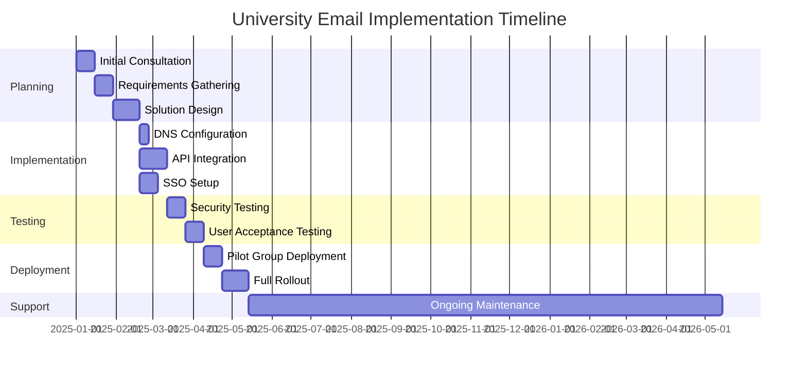
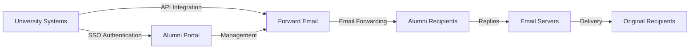

# Caso di studio: come Forward Email potenzia le soluzioni di posta elettronica per gli ex studenti delle migliori università {#case-study-how-forward-email-powers-alumni-email-solutions-for-top-universities}


## Indice {#table-of-contents}

* [Prefazione](#foreword)
* [Risparmio notevole sui costi con prezzi stabili](#dramatic-cost-savings-with-stable-pricing)
  * [Risparmi universitari reali](#real-world-university-savings)
* [La sfida via email degli ex studenti universitari](#the-university-alumni-email-challenge)
  * [Il valore dell'identità email degli ex studenti](#the-value-of-alumni-email-identity)
  * [Le soluzioni tradizionali sono insufficienti](#traditional-solutions-fall-short)
  * [La soluzione di posta elettronica in avanti](#the-forward-email-solution)
* [Implementazione tecnica: come funziona](#technical-implementation-how-it-works)
  * [Architettura di base](#core-architecture)
  * [Integrazione con i sistemi universitari](#integration-with-university-systems)
  * [Gestione basata su API](#api-driven-management)
  * [Configurazione e verifica DNS](#dns-configuration-and-verification)
  * [Test e garanzia della qualità](#testing-and-quality-assurance)
* [Cronologia di implementazione](#implementation-timeline)
* [Processo di implementazione: dalla migrazione alla manutenzione](#implementation-process-from-migration-to-maintenance)
  * [Valutazione e pianificazione iniziale](#initial-assessment-and-planning)
  * [Strategia di migrazione](#migration-strategy)
  * [Configurazione e impostazione tecnica](#technical-setup-and-configuration)
  * [Progettazione dell'esperienza utente](#user-experience-design)
  * [Formazione e documentazione](#training-and-documentation)
  * [Supporto e ottimizzazione continui](#ongoing-support-and-optimization)
* [Caso di studio: Università di Cambridge](#case-study-university-of-cambridge)
  * [Sfida](#challenge)
  * [Soluzione](#solution)
  * [Risultati](#results)
* [Vantaggi per Università ed Alumni](#benefits-for-universities-and-alumni)
  * [Per le università](#for-universities)
  * [Per gli ex studenti](#for-alumni)
  * [Tassi di adozione tra gli ex studenti](#adoption-rates-among-alumni)
  * [Risparmio sui costi rispetto alle soluzioni precedenti](#cost-savings-compared-to-previous-solutions)
* [Considerazioni sulla sicurezza e sulla privacy](#security-and-privacy-considerations)
  * [Misure di protezione dei dati](#data-protection-measures)
  * [Quadro di conformità](#compliance-framework)
* [Sviluppi futuri](#future-developments)
* [Conclusione](#conclusion)

## Prefazione {#foreword}

Abbiamo creato il servizio di inoltro e-mail più sicuro, privato e flessibile al mondo per prestigiose università e i loro ex studenti.

Nel competitivo panorama dell'istruzione superiore, mantenere legami duraturi con gli alumni non è solo una questione di tradizione, ma un imperativo strategico. Uno dei modi più concreti in cui le università promuovono questi legami è attraverso gli indirizzi email degli alumni, che forniscono ai laureati un'identità digitale che riflette il loro percorso accademico.

Noi di Forward Email abbiamo collaborato con alcuni degli istituti scolastici più prestigiosi al mondo per rivoluzionare il modo in cui gestiscono i servizi di posta elettronica per gli ex studenti. La nostra soluzione di inoltro email di livello aziendale ora supporta i sistemi di posta elettronica per gli ex studenti di [Università di Cambridge](https://en.wikipedia.org/wiki/University_of_Cambridge), [Università del Maryland](https://en.wikipedia.org/wiki/University_of_Maryland,\_College_Park), [Università di Tufts](https://en.wikipedia.org/wiki/Tufts_University) e [Swarthmore College](https://en.wikipedia.org/wiki/Swarthmore_College), servendo collettivamente migliaia di ex studenti in tutto il mondo.

Questo articolo del blog illustra come il nostro servizio di inoltro e-mail [open source](https://en.wikipedia.org/wiki/Open-source_software), incentrato sulla privacy, sia diventato la soluzione preferita da queste istituzioni, le implementazioni tecniche che lo rendono possibile e l'impatto trasformativo che ha avuto sia sull'efficienza amministrativa che sulla soddisfazione degli ex studenti.

## Risparmio notevole sui costi con prezzi stabili {#dramatic-cost-savings-with-stable-pricing}

I vantaggi finanziari della nostra soluzione sono sostanziali, soprattutto se confrontati con i prezzi in continuo aumento dei provider di posta elettronica tradizionali:

| Soluzione | Costo per ex studente (annuale) | Costo per 100.000 ex studenti | Recenti aumenti dei prezzi |
| ------------------------------ | --------------------------------------------------------------------------------------------------------- | ----------------------- | ---------------------------------------------------------------------------------------------------------------------------------------------------------------------------------------- |
| Google Workspace per le aziende | $72 | $7,200,000 | • 2019: G Suite Basic da $ 5 a $ 6/mese (+20%)<br>• 2023: Piani flessibili aumentati del 20%<br>• 2025: Business Plus da $ 18 a $ 26,40/mese (+47%) con funzionalità di intelligenza artificiale |
| Google Workspace per l'istruzione | Gratuito (Education Fundamentals)<br>$ 3/studente/anno (Education Standard)<br>$ 5/studente/anno (Education Plus) | Gratuito - $ 500.000 | • Sconti sul volume: 5% per 100-499 licenze<br>• Sconti sul volume: 10% per 500+ licenze<br>• Livello gratuito limitato ai servizi principali |
| Microsoft 365 Business | $60 | $6,000,000 | • 2023: Introdotti aggiornamenti semestrali dei prezzi<br>• 2025 (gennaio): Personale da $ 6,99 a $ 9,99/mese (+43%) con Copilot AI<br>• 2025 (aprile): Aumento del 5% sugli impegni annuali pagati mensilmente |
| Microsoft 365 Education | Gratuito (A1)<br>$ 38-55/docente/anno (A3)<br>$ 65-96/docente/anno (A5) | Gratuito - $ 96.000 | • Licenze per studenti spesso incluse negli acquisti dei docenti<br>• Prezzi personalizzati tramite licenze a volume<br>• Livello gratuito limitato alle versioni web |
| Exchange auto-ospitato | $45 | $4,500,000 | I costi di manutenzione e sicurezza in corso continuano ad aumentare |
| **Inoltra email aziendale** | **Fisso $ 250/mese** | **$ 3.000/anno** | **Nessun aumento di prezzo dal lancio** |

### Risparmi universitari reali {#real-world-university-savings}

Ecco quanto risparmiano ogni anno le nostre università partner scegliendo Forward Email rispetto ai fornitori tradizionali:

| Università | Conteggio degli ex studenti | Costo annuale con Google | Costo annuale con inoltro e-mail | Risparmio annuale |
| ----------------------- | ------------ | ----------------------- | ------------------------------ | -------------- |
| Università di Cambridge | 30,000 | $90,000 | $3,000 | $87,000 |
| Swarthmore College | 5,000 | $15,000 | $3,000 | $12,000 |
| Università di Tufts | 12,000 | $36,000 | $3,000 | $33,000 |
| Università del Maryland | 25,000 | $75,000 | $3,000 | $72,000 |

> \[!NOTE]
> Forward Email Enterprise costa in genere solo $250 al mese, senza costi aggiuntivi per utente, limitazioni di tariffazione API whitelisted e l'unico costo aggiuntivo è lo spazio di archiviazione se sono necessari GB/TB aggiuntivi per gli studenti (+$3 per 10 GB di spazio aggiuntivo). Utilizziamo anche unità SSD NVMe per un supporto rapido di IMAP/POP3/SMTP/CalDAV/CardDAV.

> \[!IMPORTANT]
> A differenza di Google e Microsoft, che hanno ripetutamente aumentato i prezzi integrando funzionalità di intelligenza artificiale che analizzano i tuoi dati, Forward Email mantiene prezzi stabili con una rigorosa attenzione alla privacy. Non utilizziamo l'intelligenza artificiale, non monitoriamo i modelli di utilizzo e non memorizziamo log o email su disco (tutta l'elaborazione avviene in memoria), garantendo la completa privacy delle comunicazioni con i tuoi ex studenti.

Ciò rappresenta una significativa riduzione dei costi rispetto alle tradizionali soluzioni di hosting di posta elettronica: fondi che le università possono reindirizzare a borse di studio, ricerca o altre attività mission-critical. Secondo un'analisi del 2023 condotta da Email Vendor Selection, gli istituti scolastici sono sempre più alla ricerca di alternative convenienti ai provider di posta elettronica tradizionali, poiché i prezzi continuano ad aumentare con l'integrazione di funzionalità di intelligenza artificiale ([Selezione del fornitore di e-mail, 2023](https://www.emailvendorselection.com/email-service-provider-list/)).

## La sfida via email per gli ex studenti dell'Università {#the-university-alumni-email-challenge}

Per le università, fornire indirizzi email permanenti agli ex studenti presenta una serie di sfide uniche che le soluzioni di posta elettronica tradizionali faticano ad affrontare efficacemente. Come evidenziato in un'ampia discussione su ServerFault, le università con un'ampia base di utenti necessitano di soluzioni di posta elettronica specializzate che bilancino prestazioni, sicurezza e convenienza ([ServerFault, 2009](https://serverfault.com/questions/97364/what-is-the-best-mail-server-for-a-university-with-a-large-amount-of-users)).

### Il valore dell'identità email degli ex studenti {#the-value-of-alumni-email-identity}

Gli indirizzi email degli ex studenti (come `firstname.lastname@cl.cam.ac.uk` o `username@terpalum.umd.edu`) svolgono numerose funzioni importanti:

* Mantenere il legame istituzionale e l'identità del marchio
* Facilitare la comunicazione continua con l'università
* Rafforzare la credibilità professionale dei laureati
* Supportare il networking e la creazione di comunità tra ex studenti
* Offrire un punto di contatto stabile e duraturo

Una ricerca di Tekade (2020) evidenzia che gli indirizzi email accademici offrono numerosi vantaggi agli ex studenti, tra cui l'accesso a risorse accademiche, credibilità professionale e sconti esclusivi su vari servizi ([Medio, 2020](https://medium.com/coders-capsule/top-20-benefits-of-having-an-educational-email-address-91a09795e05)).

> \[!TIP]
> Visita la nostra nuova directory [AlumniEmail.com](https://alumniemail.com) per una risorsa completa sui servizi di posta elettronica per gli ex studenti universitari, incluse guide di configurazione, best practice e un elenco consultabile di domini di posta elettronica per gli ex studenti. Funge da hub centrale per tutte le informazioni relative alla posta elettronica degli ex studenti.

### Le soluzioni tradizionali sono insufficienti {#traditional-solutions-fall-short}

I sistemi di posta elettronica convenzionali presentano diverse limitazioni quando applicati alle esigenze di posta elettronica degli ex studenti:

* **Costi proibitivi**: i modelli di licenza per utente diventano finanziariamente insostenibili per le grandi basi di ex studenti
* **Onere amministrativo**: la gestione di migliaia o milioni di account richiede ingenti risorse IT
* **Problemi di sicurezza**: mantenere la sicurezza degli account inattivi aumenta la vulnerabilità
* **Flessibilità limitata**: i sistemi rigidi non riescono ad adattarsi alle esigenze specifiche dell'inoltro delle email degli ex studenti
* **Problemi di privacy**: molti provider analizzano i contenuti delle email per scopi pubblicitari

Una discussione su Quora sulla gestione della posta elettronica universitaria rivela che le preoccupazioni relative alla sicurezza sono una delle ragioni principali per cui le università potrebbero limitare o annullare gli indirizzi email degli ex studenti, poiché gli account inutilizzati possono essere vulnerabili agli attacchi informatici e al furto di identità ([Quora, 2011](https://www.quora.com/Is-there-any-cost-for-a-college-or-university-to-maintain-edu-e-mail-addresses)).

### La soluzione di inoltro e-mail {#the-forward-email-solution}

Il nostro approccio affronta queste sfide attraverso un modello fondamentalmente diverso:

* Inoltro email anziché hosting
* Prezzi fissi anziché costi per utente
* Architettura open source per trasparenza e sicurezza
* Design che privilegia la privacy senza scansione dei contenuti
* Funzionalità specializzate per la gestione dell'identità universitaria

## Implementazione tecnica: come funziona {#technical-implementation-how-it-works}

La nostra soluzione sfrutta un'architettura tecnica sofisticata ma al tempo stesso semplice ed elegante per offrire un inoltro di posta elettronica affidabile e sicuro su larga scala.

### Architettura di base {#core-architecture}

Il sistema Forward Email è costituito da diversi componenti chiave:

* Server MX distribuiti per un'elevata disponibilità
* Inoltro in tempo reale senza archiviazione dei messaggi
* Autenticazione email completa
* Supporto per domini e sottodomini personalizzati
* Gestione degli account basata su API

Secondo i professionisti IT di ServerFault, per le università che desiderano implementare soluzioni di posta elettronica proprietarie, Postfix è consigliato come miglior Mail Transfer Agent (MTA), mentre Courier o Dovecot sono preferibili per l'accesso IMAP/POP3 ([ServerFault, 2009](https://serverfault.com/questions/97364/what-is-the-best-mail-server-for-a-university-with-a-large-amount-of-users)). Tuttavia, la nostra soluzione elimina la necessità per le università di gestire autonomamente questi sistemi complessi.

### Integrazione con i sistemi universitari {#integration-with-university-systems}

Abbiamo sviluppato percorsi di integrazione fluida con le infrastrutture universitarie esistenti:

* Provisioning automatizzato tramite l'integrazione di [API RESTful](https://forwardemail.net/email-api)
* Opzioni di branding personalizzate per i portali universitari
* Gestione flessibile degli alias per dipartimenti e organizzazioni
* Operazioni batch per un'amministrazione efficiente

### Gestione basata su API {#api-driven-management}

Il nostro [API RESTful](https://forwardemail.net/email-api) consente alle università di automatizzare la gestione della posta elettronica:

```javascript
// Example: Creating a new alumni email address
const response = await fetch('https://forwardemail.net/api/v1/domains/example.edu/aliases', {
  method: 'POST',
  headers: {
    'Content-Type': 'application/json',
    'Authorization': `Basic ${Buffer.from(YOUR_API_TOKEN + ":").toString('base64')}`
  },
  body: JSON.stringify({
    name: 'alumni.john.smith',
    recipients: ['johnsmith@gmail.com'],
    has_recipient_verification: true
  })
});
```

### Configurazione e verifica DNS {#dns-configuration-and-verification}

Una corretta configurazione DNS è fondamentale per la consegna delle email. Il nostro team fornisce assistenza per:

* Configurazione [DNS](https://en.wikipedia.org/wiki/Domain_Name_System), inclusi i record MX
* Implementazione completa della sicurezza email utilizzando il nostro pacchetto open source [mailauth](https://www.npmjs.com/package/mailauth), un vero e proprio coltellino svizzero per l'autenticazione email che gestisce:
* [SPF](https://en.wikipedia.org/wiki/Sender_Policy_Framework) (Sender Policy Framework) per prevenire lo spoofing delle email
* [DKIM](https://en.wikipedia.org/wiki/DomainKeys_Identified_Mail) (DomainKeys Identified Mail) per l'autenticazione email
* [DMARC](https://en.wikipedia.org/wiki/Email_authentication) (Domain-based Message Authentication, Reporting & Conformance) per l'applicazione delle policy
* [MTA-STS](https://en.wikipedia.org/wiki/Opportunistic_TLS) (SMTP MTA Strict Transport Security) per applicare la crittografia TLS
* [ARC](https://en.wikipedia.org/wiki/DomainKeys_Identified_Mail#Authenticated_Received_Chain) (Authenticated Received Chain) per mantenere l'autenticazione durante l'inoltro dei messaggi
* [SRS](https://en.wikipedia.org/wiki/Sender_Rewriting_Scheme) (Sender Rewriting Scheme) per preservare la convalida SPF durante l'inoltro
* [BIMI](https://en.wikipedia.org/wiki/Email_authentication) (Brand Indicators for Message Identification) per la visualizzazione del logo nei client email supportati
* Verifica dei record DNS TXT per la proprietà del dominio

Il pacchetto `mailauth` (<http://npmjs.com/package/mailauth>) è la soluzione completamente open source che gestisce tutti gli aspetti dell'autenticazione email in un'unica libreria integrata. A differenza delle soluzioni proprietarie, questo approccio garantisce trasparenza, aggiornamenti di sicurezza regolari e controllo completo sul processo di autenticazione email.

### Test e garanzia della qualità {#testing-and-quality-assurance}

Prima dell'implementazione completa, eseguiamo test rigorosi:

* Test di recapito email end-to-end
* Test di carico per scenari ad alto volume
* Test di penetrazione della sicurezza
* Validazione dell'integrazione API
* Test di accettazione dell'utente con rappresentanti degli ex studenti

## Cronologia di implementazione {#implementation-timeline}



## Processo di implementazione: dalla migrazione alla manutenzione {#implementation-process-from-migration-to-maintenance}

Il nostro processo di implementazione strutturato garantisce una transizione fluida per le università che adottano la nostra soluzione.

### Valutazione iniziale e pianificazione {#initial-assessment-and-planning}

Iniziamo con una valutazione completa dell'attuale sistema di posta elettronica dell'università, del database degli ex studenti e dei requisiti tecnici. Questa fase include:

* Colloqui con gli stakeholder, con i reparti IT, le relazioni con gli ex studenti e l'amministrazione
* Audit tecnico dell'infrastruttura di posta elettronica esistente
* Mappatura dei dati per i registri degli ex studenti
* Revisione della sicurezza e della conformità
* Sviluppo di cronologie e milestone del progetto

### Strategia di migrazione {#migration-strategy}

Sulla base della valutazione, sviluppiamo una strategia di migrazione su misura che riduce al minimo le interruzioni garantendo al contempo la completa integrità dei dati:

* Approccio di migrazione graduale da parte di gruppi di ex studenti
* Funzionamento di sistemi paralleli durante la transizione
* Protocolli di convalida dei dati completi
* Procedure di fallback per eventuali problemi di migrazione
* Piano di comunicazione chiaro per tutti gli stakeholder

### Configurazione e installazione tecnica {#technical-setup-and-configuration}

Il nostro team tecnico gestisce tutti gli aspetti della configurazione del sistema:

* Configurazione e verifica DNS
* Integrazione API con i sistemi universitari
* Sviluppo di portali personalizzati con il branding dell'università
* Configurazione dell'autenticazione email (SPF, DKIM, DMARC)

### Progettazione dell'esperienza utente {#user-experience-design}

Collaboriamo a stretto contatto con le università per creare interfacce intuitive sia per gli amministratori che per gli ex studenti:

* Portali email per ex studenti personalizzati
* Gestione semplificata dell'inoltro email
* Design responsive per dispositivi mobili
* Conformità all'accessibilità
* Supporto multilingue ove necessario

### Formazione e documentazione {#training-and-documentation}

Una formazione completa garantisce che tutte le parti interessate possano utilizzare efficacemente il sistema:

* Sessioni di formazione per amministratori
* Documentazione tecnica per il personale IT
* Guide utente per gli ex studenti
* Video tutorial per le attività più comuni
* Sviluppo della knowledge base

### Supporto e ottimizzazione continui {#ongoing-support-and-optimization}

La nostra partnership continua ben oltre l'implementazione:

* Assistenza tecnica 24 ore su 24, 7 giorni su 7
* Aggiornamenti di sistema regolari e patch di sicurezza
* Monitoraggio e ottimizzazione delle prestazioni
* Consulenza sulle migliori pratiche di posta elettronica
* Analisi dei dati e reporting

## Caso di studio: Università di Cambridge {#case-study-university-of-cambridge}

L'Università di Cambridge cercava una soluzione per fornire indirizzi email @cam.ac.uk agli ex studenti, riducendo al contempo i costi e le spese generali IT.

### Sfida {#challenge}

Cambridge ha dovuto affrontare diverse sfide con il suo precedente sistema di posta elettronica per gli ex studenti:

* Elevati costi operativi per il mantenimento di un'infrastruttura di posta elettronica separata
* Onere amministrativo per la gestione di migliaia di account
* Problemi di sicurezza con gli account inattivi
* Integrazione limitata con i sistemi di database degli ex studenti
* Requisiti di archiviazione crescenti

### Soluzione {#solution}

Forward Email ha implementato una soluzione completa:

* Inoltro email per tutti gli indirizzi @cam.ac.uk degli ex studenti
* Portale personalizzato per il self-service degli ex studenti
* Integrazione API con il database degli ex studenti di Cambridge
* Implementazione completa della sicurezza email

### Risultati {#results}

L'implementazione ha portato notevoli vantaggi:

* Riduzione sostanziale dei costi rispetto alla soluzione precedente
* Affidabilità di recapito delle email pari al 99,9%
* Amministrazione semplificata grazie all'automazione
* Sicurezza migliorata grazie alla moderna autenticazione delle email
* Feedback positivo degli ex studenti sull'usabilità del sistema

## Vantaggi per università e alumni {#benefits-for-universities-and-alumni}

La nostra soluzione offre vantaggi tangibili sia per gli istituti che per i loro laureati.

### Per le università {#for-universities}

* **Efficienza dei costi**: Prezzi fissi indipendentemente dal numero di ex studenti
* **Semplicità amministrativa**: Gestione automatizzata tramite API
* **Sicurezza avanzata**: Autenticazione email completa
* **Coerenza del brand**: Indirizzi email istituzionali a vita
* **Coinvolgimento degli ex studenti**: Relazioni rafforzate grazie al servizio continuativo

Secondo BulkSignature (2023), le piattaforme di posta elettronica per gli istituti scolastici offrono vantaggi significativi, tra cui la convenienza tramite piani gratuiti o a basso costo, l'efficienza temporale tramite funzionalità di comunicazione di massa e funzionalità di tracciamento per monitorare la consegna e l'interazione delle e-mail ([Firma in blocco, 2023](https://bulksignature.com/blog/5-best-email-platforms-for-educational-institutions/)).

### Per gli ex studenti {#for-alumni}

* **Identità professionale**: indirizzo email universitario prestigioso
* **Continuità email**: inoltro a qualsiasi email personale
* **Protezione della privacy**: nessuna scansione dei contenuti o data mining
* **Gestione semplificata**: aggiornamenti facili per i destinatari
* **Sicurezza avanzata**: autenticazione email moderna

Una ricerca pubblicata dall'International Journal of Education & Literacy Studies sottolinea l'importanza di una corretta comunicazione via e-mail in ambito accademico, evidenziando che la competenza nell'uso della posta elettronica è un'abilità fondamentale sia per gli studenti che per gli ex studenti in contesti professionali ([IJELS, 2021](https://files.eric.ed.gov/fulltext/EJ1319324.pdf)).

### Tassi di adozione tra gli ex studenti {#adoption-rates-among-alumni}

Le università segnalano alti tassi di adozione e soddisfazione tra le loro comunità di ex studenti.

### Risparmio sui costi rispetto alle soluzioni precedenti {#cost-savings-compared-to-previous-solutions}

L'impatto finanziario è stato notevole: le università hanno segnalato notevoli risparmi sui costi rispetto alle loro precedenti soluzioni di posta elettronica.

## Considerazioni sulla sicurezza e sulla privacy {#security-and-privacy-considerations}

Per gli istituti scolastici, proteggere i dati degli ex studenti non è solo una buona pratica, ma è spesso anche un obbligo di legge sancito da normative come il GDPR in Europa.

### Misure di protezione dei dati {#data-protection-measures}

La nostra soluzione integra più livelli di sicurezza:

* Crittografia end-to-end per tutto il traffico email
* Nessuna memorizzazione del contenuto email sui nostri server
* Audit di sicurezza e penetration test periodici
* Conformità agli standard internazionali di protezione dei dati
* Codice open source trasparente per la verifica della sicurezza

> \[!WARNING]
> Molti provider di posta elettronica analizzano il contenuto delle email per scopi pubblicitari o per addestrare modelli di intelligenza artificiale. Questa pratica solleva seri problemi di privacy, soprattutto per le comunicazioni professionali e accademiche. Forward Email non analizza mai il contenuto delle email ed elabora tutte le email in memoria per garantire la completa privacy.

### Quadro di conformità {#compliance-framework}

Manteniamo la rigorosa conformità alle normative vigenti:

* Conformità al GDPR per le istituzioni europee
* Certificazione SOC 2 Tipo II
* Valutazioni annuali di sicurezza
* Contratto di elaborazione dati (DPA) disponibile all'indirizzo [forwardemail.net/dpa](https://forwardemail.net/dpa)
* Aggiornamenti periodici sulla conformità in base all'evoluzione delle normative

## Sviluppi futuri {#future-developments}

Continuiamo a migliorare la nostra soluzione di posta elettronica per gli ex studenti con nuove funzionalità e capacità:

* Analisi avanzate per gli amministratori universitari
* Protezioni anti-phishing avanzate
* Funzionalità API estese per una maggiore integrazione
* Opzioni di autenticazione aggiuntive

## Conclusione {#conclusion}

Forward Email ha rivoluzionato il modo in cui le università forniscono e gestiscono i servizi di posta elettronica per gli ex studenti. Sostituendo il costoso e complesso hosting di posta elettronica con un inoltro email elegante e sicuro, abbiamo permesso alle istituzioni di offrire indirizzi email a vita a tutti gli ex studenti, riducendo drasticamente i costi e le spese amministrative.

Le nostre partnership con prestigiose istituzioni come Cambridge, Maryland, Tufts e Swarthmore dimostrano l'efficacia del nostro approccio in diversi contesti formativi. In un momento in cui le università sono sempre più sotto pressione per mantenere i contatti con gli ex studenti, controllando al contempo i costi, la nostra soluzione offre un'alternativa valida ai tradizionali sistemi di posta elettronica.



Le università interessate a scoprire come Forward Email può trasformare i servizi di posta elettronica dei propri ex studenti possono contattare il nostro team all'indirizzo <support@forwardemail.net> o visitare [forwardemail.net](https://forwardemail.net) per saperne di più sulle nostre soluzioni aziendali.