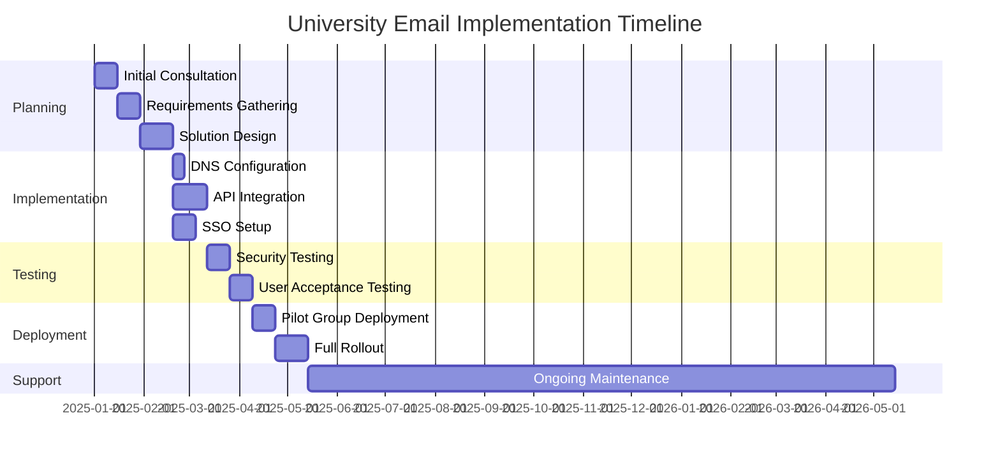
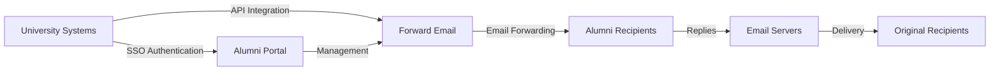

# Caso di Studio: Come Forward Email Alimenta le Soluzioni Email per Alumni delle Università Top {#case-study-how-forward-email-powers-alumni-email-solutions-for-top-universities}


## Indice {#table-of-contents}

* [Prefazione](#foreword)
* [Risparmi Drammatici con Prezzi Stabili](#dramatic-cost-savings-with-stable-pricing)
  * [Risparmi Reali nelle Università](#real-world-university-savings)
* [La Sfida delle Email per Alumni Universitari](#the-university-alumni-email-challenge)
  * [Il Valore dell'Identità Email per Alumni](#the-value-of-alumni-email-identity)
  * [Le Soluzioni Tradizionali Non Bastano](#traditional-solutions-fall-short)
  * [La Soluzione Forward Email](#the-forward-email-solution)
* [Implementazione Tecnica: Come Funziona](#technical-implementation-how-it-works)
  * [Architettura Principale](#core-architecture)
  * [Integrazione con i Sistemi Universitari](#integration-with-university-systems)
  * [Gestione Basata su API](#api-driven-management)
  * [Configurazione e Verifica DNS](#dns-configuration-and-verification)
  * [Test e Controllo Qualità](#testing-and-quality-assurance)
* [Cronologia di Implementazione](#implementation-timeline)
* [Processo di Implementazione: Dalla Migrazione alla Manutenzione](#implementation-process-from-migration-to-maintenance)
  * [Valutazione Iniziale e Pianificazione](#initial-assessment-and-planning)
  * [Strategia di Migrazione](#migration-strategy)
  * [Configurazione Tecnica e Setup](#technical-setup-and-configuration)
  * [Progettazione dell'Esperienza Utente](#user-experience-design)
  * [Formazione e Documentazione](#training-and-documentation)
  * [Supporto Continuo e Ottimizzazione](#ongoing-support-and-optimization)
* [Caso di Studio: Università di Cambridge](#case-study-university-of-cambridge)
  * [Sfida](#challenge)
  * [Soluzione](#solution)
  * [Risultati](#results)
* [Benefici per Università e Alumni](#benefits-for-universities-and-alumni)
  * [Per le Università](#for-universities)
  * [Per gli Alumni](#for-alumni)
  * [Tassi di Adozione tra gli Alumni](#adoption-rates-among-alumni)
  * [Risparmi Rispetto alle Soluzioni Precedenti](#cost-savings-compared-to-previous-solutions)
* [Considerazioni su Sicurezza e Privacy](#security-and-privacy-considerations)
  * [Misure di Protezione dei Dati](#data-protection-measures)
  * [Quadro di Conformità](#compliance-framework)
* [Sviluppi Futuri](#future-developments)
* [Conclusione](#conclusion)


## Prefazione {#foreword}

Abbiamo creato il servizio di inoltro email più sicuro, privato e flessibile al mondo per università prestigiose e i loro alumni.

Nel panorama competitivo dell'istruzione superiore, mantenere connessioni a vita con gli alumni non è solo una questione di tradizione—è un imperativo strategico. Uno dei modi più tangibili con cui le università favoriscono queste connessioni è attraverso gli indirizzi email per alumni, fornendo ai laureati un'identità digitale che riflette la loro eredità accademica.

In Forward Email, abbiamo collaborato con alcune delle istituzioni educative più prestigiose al mondo per rivoluzionare la gestione dei servizi email per alumni. La nostra soluzione di inoltro email di livello enterprise alimenta ora i sistemi email per alumni della [University of Cambridge](https://en.wikipedia.org/wiki/University_of_Cambridge), della [University of Maryland](https://en.wikipedia.org/wiki/University_of_Maryland,_College_Park), della [Tufts University](https://en.wikipedia.org/wiki/Tufts_University) e del [Swarthmore College](https://en.wikipedia.org/wiki/Swarthmore_College), servendo collettivamente migliaia di alumni in tutto il mondo.

Questo post del blog esplora come il nostro servizio di inoltro email [open-source](https://en.wikipedia.org/wiki/Open-source_software), focalizzato sulla privacy, sia diventato la soluzione preferita da queste istituzioni, le implementazioni tecniche che lo rendono possibile e l'impatto trasformativo che ha avuto sia sull'efficienza amministrativa che sulla soddisfazione degli alumni.


## Risparmi Drammatici con Prezzi Stabili {#dramatic-cost-savings-with-stable-pricing}
I benefici finanziari della nostra soluzione sono sostanziali, soprattutto se confrontati con i prezzi in continuo aumento dei fornitori di email tradizionali:

| Soluzione                     | Costo per Alunno (Annuale)                                                                               | Costo per 100.000 Alumni | Aumenti Recenti dei Prezzi                                                                                                                                                              |
| ------------------------------ | --------------------------------------------------------------------------------------------------------- | ----------------------- | ---------------------------------------------------------------------------------------------------------------------------------------------------------------------------------------- |
| Google Workspace for Business  | $72                                                                                                       | $7.200.000              | • 2019: G Suite Basic da $5 a $6/mese (+20%)<br>• 2023: Piani flessibili aumentati del 20%<br>• 2025: Business Plus da $18 a $26,40/mese (+47%) con funzionalità AI                    |
| Google Workspace for Education | Gratis (Education Fundamentals)<br>$3/studente/anno (Education Standard)<br>$5/studente/anno (Education Plus) | Gratis - $500.000       | • Sconti volume: 5% per 100-499 licenze<br>• Sconti volume: 10% per 500+ licenze<br>• Livello gratuito limitato ai servizi core                                                         |
| Microsoft 365 Business         | $60                                                                                                       | $6.000.000              | • 2023: Introdotti aggiornamenti prezzi semestrali<br>• 2025 (Gen): Personal da $6,99 a $9,99/mese (+43%) con Copilot AI<br>• 2025 (Apr): aumento del 5% su impegni annuali pagati mensilmente |
| Microsoft 365 Education        | Gratis (A1)<br>$38-55/docente/anno (A3)<br>$65-96/docente/anno (A5)                                       | Gratis - $96.000        | • Licenze studente spesso incluse con acquisti docenti<br>• Prezzi personalizzati tramite licensing volume<br>• Livello gratuito limitato alle versioni web                             |
| Exchange Autogestito           | $45                                                                                                       | $4.500.000              | Costi continui di manutenzione e sicurezza in aumento                                                                                                                                   |
| **Forward Email Enterprise**   | **Fisso $250/mese**                                                                                       | **$3.000/anno**         | **Nessun aumento di prezzo dal lancio**                                                                                                                                                  |

### Risparmi Reali nelle Università {#real-world-university-savings}

Ecco quanto risparmiano annualmente le nostre università partner scegliendo Forward Email rispetto ai fornitori tradizionali:

| Università               | Numero Alumni | Costo Annuale con Google | Costo Annuale con Forward Email | Risparmio Annuale |
| ----------------------- | ------------ | ------------------------ | ------------------------------- | ----------------- |
| University of Cambridge | 30.000       | $90.000                  | $3.000                          | $87.000           |
| Swarthmore College      | 5.000        | $15.000                  | $3.000                          | $12.000           |
| Tufts University        | 12.000       | $36.000                  | $3.000                          | $33.000           |
| University of Maryland  | 25.000       | $75.000                  | $3.000                          | $72.000           |

> \[!NOTE]
> Forward Email enterprise costa tipicamente solo $250/mese, senza costi aggiuntivi per utente, limitazioni di velocità API in whitelist, e l’unico costo aggiuntivo è lo storage se servono GB/TB aggiuntivi per studenti (+$3 per ogni 10 GB di storage aggiuntivo). Utilizziamo dischi NVMe SSD per un supporto veloce di IMAP/POP3/SMTP/CalDAV/CardDAV.
> \[!IMPORTANT]
> A differenza di Google e Microsoft, che hanno ripetutamente aumentato i loro prezzi integrando funzionalità AI che analizzano i tuoi dati, Forward Email mantiene prezzi stabili con un rigoroso focus sulla privacy. Non utilizziamo AI, non tracciamo i modelli di utilizzo e non memorizziamo log o email su disco (tutta l'elaborazione avviene in memoria), garantendo completa privacy per le tue comunicazioni con gli alumni.

Questo rappresenta una significativa riduzione dei costi rispetto alle soluzioni tradizionali di hosting email—fondi che le università possono reindirizzare a borse di studio, ricerca o altre attività critiche per la missione. Secondo un'analisi del 2023 di Email Vendor Selection, le istituzioni educative cercano sempre più alternative economiche ai fornitori tradizionali di email poiché i prezzi continuano a salire con l'integrazione delle funzionalità AI ([Email Vendor Selection, 2023](https://www.emailvendorselection.com/email-service-provider-list/)).


## La Sfida delle Email per Alumni Universitari {#the-university-alumni-email-challenge}

Per le università, fornire indirizzi email a vita agli alumni presenta una serie unica di sfide che le soluzioni email tradizionali faticano ad affrontare efficacemente. Come evidenziato in una discussione approfondita su ServerFault, le università con grandi basi utenti richiedono soluzioni email specializzate che bilancino prestazioni, sicurezza e costi ([ServerFault, 2009](https://serverfault.com/questions/97364/what-is-the-best-mail-server-for-a-university-with-a-large-amount-of-users)).

### Il Valore dell'Identità Email per Alumni {#the-value-of-alumni-email-identity}

Gli indirizzi email degli alumni (come `firstname.lastname@cl.cam.ac.uk` o `username@terpalum.umd.edu`) svolgono molteplici funzioni importanti:

* Mantenere la connessione istituzionale e l'identità del brand
* Facilitare la comunicazione continua con l'università
* Accrescere la credibilità professionale dei laureati
* Supportare il networking e la costruzione di comunità tra alumni
* Fornire un punto di contatto stabile e a vita

La ricerca di Tekade (2020) evidenzia che gli indirizzi email educativi offrono numerosi vantaggi agli alumni, inclusi accesso a risorse accademiche, credibilità professionale e sconti esclusivi su vari servizi ([Medium, 2020](https://medium.com/coders-capsule/top-20-benefits-of-having-an-educational-email-address-91a09795e05)).

> \[!TIP]
> Visita il nostro nuovo [AlumniEmail.com](https://alumniemail.com) directory per una risorsa completa sui servizi email per alumni universitari, inclusi guide di configurazione, best practice e un elenco ricercabile di domini email per alumni. Serve come hub centrale per tutte le informazioni sulle email per alumni.

### Le Soluzioni Tradizionali Non Sono Sufficienti {#traditional-solutions-fall-short}

I sistemi email convenzionali presentano diverse limitazioni quando applicati alle esigenze delle email per alumni:

* **Costi Proibitivi**: I modelli di licenza per utente diventano finanziariamente insostenibili per grandi basi di alumni
* **Onere Amministrativo**: Gestire migliaia o milioni di account richiede risorse IT significative
* **Problemi di Sicurezza**: Mantenere la sicurezza per account inattivi aumenta la vulnerabilità
* **Flessibilità Limitata**: Sistemi rigidi non possono adattarsi alle esigenze uniche del forwarding email per alumni
* **Questioni di Privacy**: Molti fornitori scansionano il contenuto delle email per scopi pubblicitari

Una discussione su Quora riguardo alla manutenzione delle email universitarie rivela che le preoccupazioni di sicurezza sono una delle principali ragioni per cui le università potrebbero limitare o cancellare gli indirizzi email degli alumni, poiché gli account inutilizzati possono essere vulnerabili a hacking e furto d'identità ([Quora, 2011](https://www.quora.com/Is-there-any-cost-for-a-college-or-university-to-maintain-edu-e-mail-addresses)).

### La Soluzione Forward Email {#the-forward-email-solution}

Il nostro approccio affronta queste sfide attraverso un modello fondamentalmente diverso:

* Inoltro email invece di hosting
* Prezzo fisso invece di costi per utente
* Architettura open-source per trasparenza e sicurezza
* Design privacy-first senza scansione dei contenuti
* Funzionalità specializzate per la gestione dell'identità universitaria


## Implementazione Tecnica: Come Funziona {#technical-implementation-how-it-works}
La nostra soluzione sfrutta un'architettura tecnica sofisticata ma elegantemente semplice per offrire un inoltro email affidabile e sicuro su larga scala.

### Core Architecture {#core-architecture}

Il sistema Forward Email è composto da diversi componenti chiave:

* Server MX distribuiti per alta disponibilità
* Inoltro in tempo reale senza memorizzazione dei messaggi
* Autenticazione email completa
* Supporto per domini personalizzati e sottodomini
* Gestione account tramite API

Secondo i professionisti IT su ServerFault, per le università che desiderano implementare soluzioni email proprie, Postfix è raccomandato come il miglior Mail Transfer Agent (MTA), mentre Courier o Dovecot sono preferiti per l'accesso IMAP/POP3 ([ServerFault, 2009](https://serverfault.com/questions/97364/what-is-the-best-mail-server-for-a-university-with-a-large-amount-of-users)). Tuttavia, la nostra soluzione elimina la necessità per le università di gestire direttamente questi sistemi complessi.

### Integration with University Systems {#integration-with-university-systems}

Abbiamo sviluppato percorsi di integrazione senza soluzione di continuità con l'infrastruttura universitaria esistente:

* Provisioning automatizzato tramite integrazione con [RESTful API](https://forwardemail.net/email-api)
* Opzioni di branding personalizzato per i portali universitari
* Gestione flessibile degli alias per dipartimenti e organizzazioni
* Operazioni batch per una amministrazione efficiente

### API-Driven Management {#api-driven-management}

La nostra [RESTful API](https://forwardemail.net/email-api) consente alle università di automatizzare la gestione delle email:

```javascript
// Example: Creating a new alumni email address
const response = await fetch('https://forwardemail.net/api/v1/domains/example.edu/aliases', {
  method: 'POST',
  headers: {
    'Content-Type': 'application/json',
    'Authorization': `Basic ${Buffer.from(YOUR_API_TOKEN + ":").toString('base64')}`
  },
  body: JSON.stringify({
    name: 'alumni.john.smith',
    recipients: ['johnsmith@gmail.com'],
    has_recipient_verification: true
  })
});
```

### DNS Configuration and Verification {#dns-configuration-and-verification}

La corretta configurazione DNS è fondamentale per la consegna delle email. Il nostro team assiste con:

* Configurazione [DNS](https://en.wikipedia.org/wiki/Domain_Name_System) inclusi i record MX
* Implementazione completa della sicurezza email utilizzando il nostro pacchetto open-source [mailauth](https://www.npmjs.com/package/mailauth), un coltellino svizzero per l'autenticazione email che gestisce:
  * [SPF](https://en.wikipedia.org/wiki/Sender_Policy_Framework) (Sender Policy Framework) per prevenire lo spoofing delle email
  * [DKIM](https://en.wikipedia.org/wiki/DomainKeys_Identified_Mail) (DomainKeys Identified Mail) per l'autenticazione delle email
  * [DMARC](https://en.wikipedia.org/wiki/Email_authentication) (Domain-based Message Authentication, Reporting & Conformance) per l'applicazione delle policy
  * [MTA-STS](https://en.wikipedia.org/wiki/Opportunistic_TLS) (SMTP MTA Strict Transport Security) per imporre la crittografia TLS
  * [ARC](https://en.wikipedia.org/wiki/DomainKeys_Identified_Mail#Authenticated_Received_Chain) (Authenticated Received Chain) per mantenere l'autenticazione quando i messaggi vengono inoltrati
  * [SRS](https://en.wikipedia.org/wiki/Sender_Rewriting_Scheme) (Sender Rewriting Scheme) per preservare la validazione SPF durante l'inoltro
  * [BIMI](https://en.wikipedia.org/wiki/Email_authentication) (Brand Indicators for Message Identification) per la visualizzazione del logo nei client email che lo supportano
* Verifica dei record DNS TXT per la proprietà del dominio

Il pacchetto `mailauth` (<http://npmjs.com/package/mailauth>) è la soluzione completamente open-source che gestisce tutti gli aspetti dell'autenticazione email in un'unica libreria integrata. A differenza delle soluzioni proprietarie, questo approccio garantisce trasparenza, aggiornamenti regolari di sicurezza e completo controllo sul processo di autenticazione email.

### Testing and Quality Assurance {#testing-and-quality-assurance}

Prima del dispiegamento completo, conduciamo test rigorosi:

* Test end-to-end della consegna email
* Test di carico per scenari ad alto volume
* Test di penetrazione sulla sicurezza
* Validazione dell'integrazione API
* Test di accettazione utente con rappresentanti degli alumni
## Cronologia di Implementazione {#implementation-timeline}


```mermaid
gantt
    title University Email Implementation Timeline
    dateFormat  YYYY-MM-DD
    section Planning
    Initial Consultation           :a1, 2025-01-01, 14d
    Requirements Gathering         :a2, after a1, 14d
    Solution Design                :a3, after a2, 21d
    section Implementation
    DNS Configuration              :b1, after a3, 7d
    API Integration                :b2, after a3, 21d
    SSO Setup                      :b3, after a3, 14d
    section Testing
    Security Testing               :c1, after b1 b2 b3, 14d
    User Acceptance Testing        :c2, after c1, 14d
    section Deployment
    Pilot Group Deployment         :d1, after c2, 14d
    Full Rollout                   :d2, after d1, 21d
    section Support
    Ongoing Maintenance            :e1, after d2, 365d
```


## Processo di Implementazione: Dalla Migrazione alla Manutenzione {#implementation-process-from-migration-to-maintenance}

Il nostro processo di implementazione strutturato garantisce una transizione fluida per le università che adottano la nostra soluzione.

### Valutazione Iniziale e Pianificazione {#initial-assessment-and-planning}

Iniziamo con una valutazione completa del sistema email attuale dell'università, del database degli ex studenti e dei requisiti tecnici. Questa fase include:

* Interviste con le parti interessate di IT, relazioni con gli ex studenti e amministrazione
* Audit tecnico dell'infrastruttura email esistente
* Mappatura dei dati per i record degli ex studenti
* Revisione della sicurezza e conformità
* Sviluppo della timeline di progetto e delle tappe fondamentali

### Strategia di Migrazione {#migration-strategy}

Basandoci sulla valutazione, sviluppiamo una strategia di migrazione personalizzata che minimizza le interruzioni garantendo al contempo l'integrità completa dei dati:

* Approccio di migrazione a fasi per coorti di ex studenti
* Operatività parallela dei sistemi durante la transizione
* Protocolli completi di validazione dei dati
* Procedure di fallback per eventuali problemi di migrazione
* Piano di comunicazione chiaro per tutte le parti interessate

### Configurazione Tecnica e Setup {#technical-setup-and-configuration}

Il nostro team tecnico gestisce tutti gli aspetti del setup del sistema:

* Configurazione e verifica DNS
* Integrazione API con i sistemi universitari
* Sviluppo di portali personalizzati con il branding dell'università
* Configurazione dell'autenticazione email (SPF, DKIM, DMARC)

### Progettazione dell'Esperienza Utente {#user-experience-design}

Collaboriamo strettamente con le università per creare interfacce intuitive sia per gli amministratori che per gli ex studenti:

* Portali email per ex studenti con branding personalizzato
* Gestione semplificata dell'inoltro email
* Design responsive per dispositivi mobili
* Conformità all'accessibilità
* Supporto multilingue dove necessario

### Formazione e Documentazione {#training-and-documentation}

Una formazione completa assicura che tutte le parti interessate possano utilizzare efficacemente il sistema:

* Sessioni di formazione per amministratori
* Documentazione tecnica per il personale IT
* Guide utente per gli ex studenti
* Tutorial video per le attività comuni
* Sviluppo di una knowledge base

### Supporto Continuativo e Ottimizzazione {#ongoing-support-and-optimization}

La nostra collaborazione continua ben oltre l'implementazione:

* Supporto tecnico 24/7
* Aggiornamenti regolari del sistema e patch di sicurezza
* Monitoraggio delle prestazioni e ottimizzazione
* Consulenza sulle migliori pratiche email
* Analisi dati e reportistica


## Caso di Studio: Università di Cambridge {#case-study-university-of-cambridge}

L'Università di Cambridge cercava una soluzione per fornire indirizzi email @cam.ac.uk agli ex studenti riducendo al contempo il carico e i costi IT.

### Sfida {#challenge}

Cambridge affrontava diverse sfide con il loro precedente sistema email per ex studenti:

* Elevati costi operativi per mantenere un'infrastruttura email separata
* Onere amministrativo nella gestione di migliaia di account
* Problemi di sicurezza con account inattivi
* Integrazione limitata con i sistemi del database ex studenti
* Crescente necessità di spazio di archiviazione

### Soluzione {#solution}

Forward Email ha implementato una soluzione completa:

* Inoltro email per tutti gli indirizzi ex studenti @cam.ac.uk
* Portale personalizzato per il self-service degli ex studenti
* Integrazione API con il database ex studenti di Cambridge
* Implementazione completa della sicurezza email

### Risultati {#results}

L'implementazione ha portato benefici significativi:
* Riduzione sostanziale dei costi rispetto alla soluzione precedente
* Affidabilità del 99,9% nella consegna delle email
* Amministrazione semplificata tramite automazione
* Sicurezza migliorata con autenticazione email moderna
* Feedback positivo degli ex studenti sull'usabilità del sistema


## Benefici per Università e Alumni {#benefits-for-universities-and-alumni}

La nostra soluzione offre benefici tangibili sia per le istituzioni che per i loro laureati.

### Per le Università {#for-universities}

* **Efficienza dei Costi**: Prezzo fisso indipendentemente dal numero di alumni
* **Semplicità Amministrativa**: Gestione automatizzata tramite API
* **Sicurezza Migliorata**: Autenticazione email completa
* **Coerenza del Marchio**: Indirizzi email istituzionali a vita
* **Coinvolgimento degli Alumni**: Rafforzamento dei legami tramite servizio continuo

Secondo BulkSignature (2023), le piattaforme email per istituzioni educative offrono vantaggi significativi tra cui convenienza economica tramite piani gratuiti o a basso costo, efficienza temporale grazie a capacità di comunicazione di massa e funzionalità di monitoraggio per controllare la consegna e l'engagement delle email ([BulkSignature, 2023](https://bulksignature.com/blog/5-best-email-platforms-for-educational-institutions/)).

### Per gli Alumni {#for-alumni}

* **Identità Professionale**: Indirizzo email prestigioso dell'università
* **Continuità Email**: Inoltro a qualsiasi email personale
* **Protezione della Privacy**: Nessuna scansione dei contenuti o data mining
* **Gestione Semplificata**: Aggiornamenti facili dei destinatari
* **Sicurezza Migliorata**: Autenticazione email moderna

La ricerca dell'International Journal of Education & Literacy Studies evidenzia l'importanza di una corretta comunicazione via email in ambito accademico, sottolineando che la competenza nell'uso della posta elettronica è una abilità cruciale sia per studenti che per alumni in contesti professionali ([IJELS, 2021](https://files.eric.ed.gov/fulltext/EJ1319324.pdf)).

### Tassi di Adozione tra gli Alumni {#adoption-rates-among-alumni}

Le università riportano alti tassi di adozione e soddisfazione tra le loro comunità di alumni.

### Risparmi sui Costi Rispetto alle Soluzioni Precedenti {#cost-savings-compared-to-previous-solutions}

L'impatto finanziario è stato sostanziale, con università che segnalano risparmi significativi rispetto alle loro precedenti soluzioni email.


## Considerazioni su Sicurezza e Privacy {#security-and-privacy-considerations}

Per le istituzioni educative, proteggere i dati degli alumni non è solo una buona pratica—spesso è un requisito legale secondo regolamenti come il GDPR in Europa.

### Misure di Protezione dei Dati {#data-protection-measures}

La nostra soluzione incorpora molteplici livelli di sicurezza:

* Crittografia end-to-end per tutto il traffico email
* Nessuna memorizzazione dei contenuti email sui nostri server
* Audit di sicurezza regolari e penetration testing
* Conformità agli standard internazionali di protezione dei dati
* Codice trasparente e open-source per la verifica della sicurezza

> \[!WARNING]
> Molti provider email scansionano i contenuti delle email per scopi pubblicitari o per addestrare modelli di intelligenza artificiale. Questa pratica solleva serie preoccupazioni sulla privacy, specialmente per comunicazioni professionali e accademiche. Forward Email non scansiona mai i contenuti delle email e processa tutte le email in memoria per garantire completa privacy.

### Quadro di Conformità {#compliance-framework}

Manteniamo una rigorosa conformità alle normative rilevanti:

* Conformità GDPR per istituzioni europee
* Certificazione SOC 2 Tipo II
* Valutazioni di sicurezza annuali
* Accordo sul trattamento dei dati (DPA) disponibile su [forwardemail.net/dpa](https://forwardemail.net/dpa)
* Aggiornamenti regolari di conformità con l'evoluzione delle normative


## Sviluppi Futuri {#future-developments}

Continuiamo a migliorare la nostra soluzione email per alumni con nuove funzionalità e capacità:

* Analisi avanzate per amministratori universitari
* Protezioni anti-phishing potenziate
* Capacità API ampliate per integrazioni più profonde
* Opzioni aggiuntive di autenticazione


## Conclusione {#conclusion}

Forward Email ha rivoluzionato il modo in cui le università forniscono e gestiscono i servizi email per gli alumni. Sostituendo hosting email costosi e complessi con un inoltro email elegante e sicuro, abbiamo permesso alle istituzioni di offrire indirizzi email a vita a tutti gli alumni riducendo drasticamente costi e oneri amministrativi.
Le nostre collaborazioni con istituzioni prestigiose come Cambridge, Maryland, Tufts e Swarthmore dimostrano l'efficacia del nostro approccio in diversi ambienti educativi. Mentre le università affrontano una crescente pressione per mantenere i legami con gli ex studenti controllando i costi, la nostra soluzione offre un'alternativa convincente ai sistemi di posta elettronica tradizionali.


```mermaid
flowchart LR
    A[University Systems] -->|API Integration| B[Forward Email]
    B -->|Email Forwarding| C[Alumni Recipients]
    C -->|Replies| D[Email Servers]
    D -->|Delivery| E[Original Recipients]
    F[Alumni Portal] -->|Management| B
    A -->|SSO Authentication| F
```

Per le università interessate a scoprire come Forward Email può trasformare i servizi di posta elettronica per gli ex studenti, contattate il nostro team all'indirizzo <support@forwardemail.net> o visitate [forwardemail.net](https://forwardemail.net) per saperne di più sulle nostre soluzioni aziendali.
