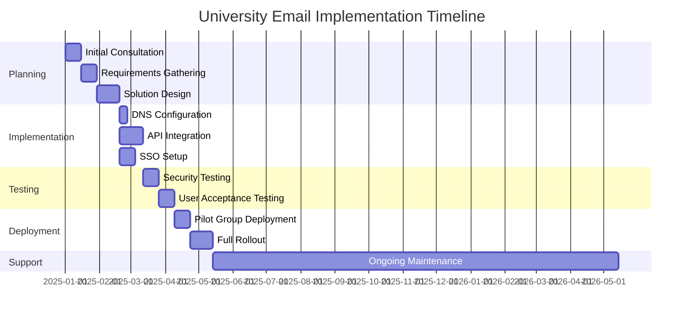
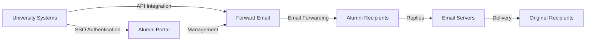

# ケーススタディ: Forward Email がトップ大学の卒業生向けメールソリューションをどのように強化しているか {#case-study-how-forward-email-powers-alumni-email-solutions-for-top-universities}


## 目次 {#table-of-contents}

* [序文](#foreword)
* [安定した価格で大幅なコスト削減](#dramatic-cost-savings-with-stable-pricing)
  * [現実世界の大学の節約](#real-world-university-savings)
* [大学卒業生メールチャレンジ](#the-university-alumni-email-challenge)
  * [卒業生のメールIDの価値](#the-value-of-alumni-email-identity)
  * [従来の解決策は不十分](#traditional-solutions-fall-short)
  * [メール転送ソリューション](#the-forward-email-solution)
* [技術的実装：仕組み](#technical-implementation-how-it-works)
  * [コアアーキテクチャ](#core-architecture)
  * [大学システムとの統合](#integration-with-university-systems)
  * [API駆動型管理](#api-driven-management)
  * [DNSの設定と検証](#dns-configuration-and-verification)
  * [テストと品質保証](#testing-and-quality-assurance)
* [実装タイムライン](#implementation-timeline)
* [実装プロセス：移行から保守まで](#implementation-process-from-migration-to-maintenance)
  * [初期評価と計画](#initial-assessment-and-planning)
  * [移行戦略](#migration-strategy)
  * [技術的なセットアップと構成](#technical-setup-and-configuration)
  * [ユーザーエクスペリエンスデザイン](#user-experience-design)
  * [トレーニングとドキュメント](#training-and-documentation)
  * [継続的なサポートと最適化](#ongoing-support-and-optimization)
* [ケーススタディ：ケンブリッジ大学](#case-study-university-of-cambridge)
  * [チャレンジ](#challenge)
  * [解決](#solution)
  * [結果](#results)
* [大学と卒業生へのメリット](#benefits-for-universities-and-alumni)
  * [大学向け](#for-universities)
  * [卒業生向け](#for-alumni)
  * [卒業生の採用率](#adoption-rates-among-alumni)
  * [以前のソリューションと比較したコスト削減](#cost-savings-compared-to-previous-solutions)
* [セキュリティとプライバシーに関する考慮事項](#security-and-privacy-considerations)
  * [データ保護対策](#data-protection-measures)
  * [コンプライアンスフレームワーク](#compliance-framework)
* [今後の展開](#future-developments)
* [結論](#conclusion)

## 序文 {#foreword}

私たちは、名門大学とその卒業生のために、世界で最も安全で、プライベートで、柔軟なメール転送サービスを構築しました。

競争の激しい高等教育環境において、卒業生との生涯にわたるつながりを維持することは、単なる伝統ではなく、戦略的に不可欠な要素です。大学がこうしたつながりを育む最も具体的な方法の一つは、卒業生のメールアドレスを提供することです。これは、卒業生にそれぞれの学問的背景を反映したデジタルアイデンティティを提供するものです。

Forward Emailは、世界有数の名門教育機関と提携し、卒業生向けメールサービスの管理方法に革命をもたらしました。当社のエンタープライズグレードのメール転送ソリューションは、[ケンブリッジ大学](https://en.wikipedia.org/wiki/University_of_Cambridge)、[メリーランド大学](https://en.wikipedia.org/wiki/University_of_Maryland,\_College_Park)、[タフツ大学](https://en.wikipedia.org/wiki/Tufts_University)、[スワースモア大学](https://en.wikipedia.org/wiki/Swarthmore_College)の卒業生向けメールシステムに導入され、世界中の数千人の卒業生にサービスを提供しています。

このブログ投稿では、プライバシーを重視した当社の [オープンソース](https://en.wikipedia.org/wiki/Open-source_software) メール転送サービスがどのようにしてこれらの教育機関にとって好ましいソリューションとなったのか、それを可能にした技術的な実装、そしてそれが管理効率と卒業生の満足度の両方にどのような変革をもたらしたのかについて説明します。

## 安定した価格で大幅なコスト削減 {#dramatic-cost-savings-with-stable-pricing}

当社のソリューションの経済的メリットは、特に従来のメールプロバイダーの継続的に上昇する価格と比較すると、非常に大きいです。

| 解決 | 卒業生一人当たりの費用（年間） | 卒業生10万人の費用 | 最近の価格上昇 |
| ------------------------------ | --------------------------------------------------------------------------------------------------------- | ----------------------- | ---------------------------------------------------------------------------------------------------------------------------------------------------------------------------------------- |
| ビジネス向け Google Workspace | $72 | $7,200,000 | • 2019 年: G Suite Basic が月額 5 ドルから 6 ドルに (+20%)<br>• 2023 年: フレキシブル プランが 20% 値上げ<br>• 2025 年: AI 機能搭載の Business Plus が月額 18 ドルから 26.40 ドルに (+47%) |
| 教育向け Google Workspace | 無料（Education Fundamentals）<br>生徒 1 人あたり年間 3 ドル（Education Standard）<br>生徒 1 人あたり年間 5 ドル（Education Plus） | 無料 - 50万ドル | • ボリューム割引: 100～499 ライセンスの場合 5%<br>• ボリューム割引: 500 ライセンス以上の場合 10%<br>• 無料利用枠はコアサービスに限定されます |
| Microsoft 365 ビジネス | $60 | $6,000,000 | • 2023年：年2回の価格改定を導入<br>• 2025年（1月）：Copilot AI搭載のパーソナルプランが月額6.99ドルから9.99ドル（43%増）に値上げ<br>• 2025年（4月）：月払いの年間契約が5%増額 |
| Microsoft 365 教育 | 無料（A1）<br>1教員あたり年間38～55ドル（A3）<br>1教員あたり年間65～96ドル（A5） | 無料 - 96,000ドル | • 学生ライセンスは、多くの場合、教職員の購入に含まれています<br>• ボリュームライセンスによるカスタム価格設定<br>• 無料利用枠は Web バージョンに限定されています |
| セルフホスト型Exchange | $45 | $4,500,000 | 継続的なメンテナンスとセキュリティコストは上昇し続けている |
| **メール転送エンタープライズ** | **月額250ドル固定** | **年間3,000ドル** | **発売以来価格上昇なし** |

### 現実世界の大学貯蓄 {#real-world-university-savings}

パートナー大学が従来のプロバイダーではなく Forward Email を選択することで、年間に節約できる金額は次のとおりです。

| 大学 | 卒業生数 | Google の年間コスト | メール転送の年間コスト | 年間節約額 |
| ----------------------- | ------------ | ----------------------- | ------------------------------ | -------------- |
| ケンブリッジ大学 | 30,000 | $90,000 | $3,000 | $87,000 |
| スワースモア大学 | 5,000 | $15,000 | $3,000 | $12,000 |
| タフツ大学 | 12,000 | $36,000 | $3,000 | $33,000 |
| メリーランド大学 | 25,000 | $75,000 | $3,000 | $72,000 |

> \[!NOTE]
> Forward Email Enterpriseは通常月額250ドルで、ユーザーあたりの追加料金は発生せず、APIのホワイトリストによる速度制限もありません。追加費用は、学生向けにストレージ容量を追加する必要がある場合（10GB/TB追加ごとに3ドル）のみです。IMAP/POP3/SMTP/CalDAV/CardDAVの高速サポートのために、NVMe SSDドライブも使用しています。

> \[!IMPORTANT]
> GoogleやMicrosoftは、ユーザーのデータを分析するAI機能を統合しながら価格を繰り返し引き上げてきましたが、Forward Emailは厳格なプライバシー重視の姿勢を保ちながら、安定した価格設定を維持しています。AIは使用せず、利用パターンの追跡も行わず、ログやメールをディスクに保存することもありません（すべての処理はメモリ内で行われます）。そのため、卒業生とのコミュニケーションにおける完全なプライバシーが確保されます。

これは従来のメールホスティングソリューションと比較して大幅なコスト削減を意味し、大学は奨学金、研究、その他のミッションクリティカルな活動に資金を振り向けることができます。Email Vendor Selectionによる2023年の分析によると、AI機能の統合に伴い価格が上昇し続ける中、教育機関は従来のメールプロバイダーに代わる費用対効果の高い代替手段を求める傾向が高まっています([2023年のメールベンダー選定](https://www.emailvendorselection.com/email-service-provider-list/))。

## 大学卒業生向けメールチャレンジ {#the-university-alumni-email-challenge}

大学にとって、卒業生に生涯有効なメールアドレスを提供することは、従来のメールソリューションでは効果的に対処することが難しい、特有の課題をもたらします。ServerFaultの包括的な議論で指摘されているように、大規模なユーザーベースを持つ大学では、パフォーマンス、セキュリティ、そしてコスト効率のバランスが取れた、専用のメールソリューションが必要です ([ServerFault、2009年](https://serverfault.com/questions/97364/what-is-the-best-mail-server-for-a-university-with-a-large-amount-of-users))。

### 卒業生のメールIDの価値 {#the-value-of-alumni-email-identity}

卒業生のメール アドレス (`firstname.lastname@cl.cam.ac.uk` や `username@terpalum.umd.edu` など) には、次のような複数の重要な機能があります。

* 組織とのつながりとブランドアイデンティティの維持
* 大学との継続的なコミュニケーションの促進
* 卒業生の専門的信頼性の向上
* 同窓生ネットワークとコミュニティ構築の支援
* 生涯にわたる安定した連絡先の提供

Tekade (2020) の調査では、教育用メール アドレスは、学術リソースへのアクセス、専門家としての信頼性、さまざまなサービスの特別割引など、卒業生に多くのメリットをもたらすことが強調されています ([ミディアム、2020年](https://medium.com/coders-capsule/top-20-benefits-of-having-an-educational-email-address-91a09795e05))。

> \[!TIP]
> 大学の卒業生向けメールサービスに関する包括的なリソースについては、新しい[AlumniEmail.com](https://alumniemail.com)ディレクトリをご覧ください。設定ガイド、ベストプラクティス、卒業生向けメールドメインの検索可能なディレクトリなどが含まれています。卒業生向けメールに関するあらゆる情報を集約したハブとして機能します。

### 従来のソリューションでは不十分 {#traditional-solutions-fall-short}

従来の電子メール システムを卒業生の電子メールのニーズに適用すると、いくつかの制限があります。

* **コストが高すぎる**: ユーザー単位のライセンスモデルは、大規模な卒業生ベースでは経済的に維持不可能になります
* **管理上の負担**: 数千、数百万のアカウントを管理するには、膨大なITリソースが必要です
* **セキュリティ上の懸念**: 休眠アカウントのセキュリティ維持は、脆弱性を高めます
* **柔軟性の限界**: 硬直したシステムでは、卒業生メール転送の独自のニーズに対応できません
* **プライバシーの問題**: 多くのプロバイダーが広告目的でメールの内容をスキャンしています

大学の電子メールメンテナンスに関する Quora のディスカッションでは、未使用のアカウントはハッキングや個人情報の盗難に対して脆弱である可能性があるため、セキュリティ上の懸念が大学が卒業生の電子メール アドレスを制限またはキャンセルする主な理由であることが明らかになっています ([Quora、2011年](https://www.quora.com/Is-there-any-cost-for-a-college-or-university-to-maintain-edu-e-mail-addresses))。

### メール転送ソリューション {#the-forward-email-solution}

私たちのアプローチは、根本的に異なるモデルを通じてこれらの課題に対処します。

* ホスティングではなくメール転送
* ユーザーごとの料金ではなく定額料金
* 透明性とセキュリティを実現するオープンソースアーキテクチャ
* コンテンツスキャンを行わないプライバシー重視の設計
* 大学のID管理に特化した機能

## 技術的実装：仕組み {#technical-implementation-how-it-works}

当社のソリューションは、洗練されながらも非常にシンプルな技術アーキテクチャを活用して、信頼性が高く安全な大規模な電子メール転送を実現します。

### コアアーキテクチャ {#core-architecture}

転送メール システムは、いくつかの主要コンポーネントで構成されています。

* 高可用性を実現する分散MXサーバー
* メッセージ保存不要のリアルタイム転送
* 包括的なメール認証
* カスタムドメインとサブドメインのサポート
* API駆動型のアカウント管理

ServerFaultのIT専門家によると、独自のメールソリューションを導入しようとしている大学にとって、最適なメール転送エージェント（MTA）はPostfix、IMAP/POP3アクセスにはCourierまたはDovecotが推奨されています（[ServerFault、2009年](https://serverfault.com/questions/97364/what-is-the-best-mail-server-for-a-university-with-a-large-amount-of-users)）。しかし、当社のソリューションを利用すれば、大学がこれらの複雑なシステムを自ら管理する必要がなくなります。

### 大学システムとの統合 {#integration-with-university-systems}

私たちは既存の大学インフラストラクチャとのシームレスな統合パスウェイを開発しました。

* [RESTful API](https://forwardemail.net/email-api) 統合による自動プロビジョニング
* 大学ポータルのカスタムブランディングオプション
* 部門や組織向けの柔軟なエイリアス管理
* 効率的な管理のためのバッチ操作

### API駆動型管理 {#api-driven-management}

当社の [RESTful API](https://forwardemail.net/email-api) により、大学は電子メール管理を自動化できます。

```javascript
// Example: Creating a new alumni email address
const response = await fetch('https://forwardemail.net/api/v1/domains/example.edu/aliases', {
  method: 'POST',
  headers: {
    'Content-Type': 'application/json',
    'Authorization': `Basic ${Buffer.from(YOUR_API_TOKEN + ":").toString('base64')}`
  },
  body: JSON.stringify({
    name: 'alumni.john.smith',
    recipients: ['johnsmith@gmail.com'],
    has_recipient_verification: true
  })
});
```

### DNS の構成と検証 {#dns-configuration-and-verification}

メール配信には適切なDNS設定が不可欠です。弊社のチームが以下のサポートを提供します。

* MXレコードを含む[DNS](https://en.wikipedia.org/wiki/Domain_Name_System)の設定
* オープンソースの[メール認証](https://www.npmjs.com/package/mailauth)パッケージを使用した包括的なメールセキュリティ実装。メール認証のための万能ツールとして、以下の機能を処理します。
* [SPF](https://en.wikipedia.org/wiki/Sender_Policy_Framework) (送信者ポリシーフレームワーク)：メールのなりすましを防止
* [DKIM](https://en.wikipedia.org/wiki/DomainKeys_Identified_Mail) (DomainKeys Identified Mail)：メール認証
* [DMARC](https://en.wikipedia.org/wiki/Email_authentication) (ドメインベースメッセージ認証、レポート、適合)：ポリシー適用
* [MTA-STS](https://en.wikipedia.org/wiki/Opportunistic_TLS) (SMTP MTA Strict Transport Security)：TLS暗号化を強制
* [ARC](https://en.wikipedia.org/wiki/DomainKeys_Identified_Mail#Authenticated_Received_Chain) (認証済み受信チェーン)：メッセージ転送時の認証維持
* [SRS](https://en.wikipedia.org/wiki/Sender_Rewriting_Scheme) (送信者書き換えスキーム)：転送時のSPF検証維持
* [BIMI](https://en.wikipedia.org/wiki/Email_authentication) (ブランド対応メールクライアントでのロゴ表示のためのメッセージ識別情報（IdF）
* ドメイン所有権のDNS TXTレコード検証

`mailauth` パッケージ (<http://npmjs.com/package/mailauth>) は、メール認証のあらゆる側面を単一の統合ライブラリで処理する、完全にオープンソースのソリューションです。プロプライエタリソリューションとは異なり、このアプローチにより、透明性、定期的なセキュリティアップデート、そしてメール認証プロセスの完全な制御が保証されます。

### テストと品質保証 {#testing-and-quality-assurance}

完全展開の前に、厳格なテストを実施します。

* エンドツーエンドのメール配信テスト
* 大容量シナリオの負荷テスト
* セキュリティ侵入テスト
* API統合検証
* 卒業生代表によるユーザー受け入れテスト

## 実装タイムライン {#implementation-timeline}



## 実装プロセス: 移行から保守まで {#implementation-process-from-migration-to-maintenance}

当社の構造化された実装プロセスにより、大学が当社のソリューションを導入する際のスムーズな移行が保証されます。

### 初期評価と計画 {#initial-assessment-and-planning}

まず、大学の現在のメールシステム、卒業生データベース、そして技術要件を包括的に評価します。このフェーズには以下の内容が含まれます。

* IT部門、卒業生関係部門、管理部門との関係者インタビュー
* 既存のメールインフラの技術監査
* 卒業生記録のデータマッピング
* セキュリティとコンプライアンスのレビュー
* プロジェクトのタイムラインとマイルストーンの策定

### 移行戦略 {#migration-strategy}

評価に基づいて、完全なデータ整合性を確保しながら中断を最小限に抑えるカスタマイズされた移行戦略を開発します。

* 卒業生グループによる段階的な移行アプローチ
* 移行期間中のシステム並行運用
* 包括的なデータ検証プロトコル
* 移行に関する問題が発生した場合のフォールバック手順
* すべての関係者への明確なコミュニケーション計画

### 技術的なセットアップと構成 {#technical-setup-and-configuration}

当社の技術チームがシステムセットアップのあらゆる側面を担当します。

* DNS設定と検証
* 大学システムとのAPI統合
* 大学ブランディングを考慮したカスタムポータルの開発
* メール認証の設定（SPF、DKIM、DMARC）

### ユーザーエクスペリエンスデザイン {#user-experience-design}

私たちは大学と緊密に協力し、管理者と卒業生の両方にとって直感的なインターフェースを作成しています。

* カスタムブランドの卒業生向けメールポータル
* 簡素化されたメール転送管理
* モバイルレスポンシブデザイン
* アクセシビリティ対応
* 必要に応じて多言語サポート

### トレーニングとドキュメント {#training-and-documentation}

包括的なトレーニングにより、すべての関係者がシステムを効果的に使用できるようになります。

* 管理者向けトレーニングセッション
* ITスタッフ向け技術ドキュメント
* 卒業生向けユーザーガイド
* 一般的なタスクに関するビデオチュートリアル
* ナレッジベースの開発

### 継続的なサポートと最適化 {#ongoing-support-and-optimization}

私たちのパートナーシップは実装後も継続します。

* 24時間365日対応のテクニカルサポート
* 定期的なシステムアップデートとセキュリティパッチ
* パフォーマンス監視と最適化
* メールのベストプラクティスに関するコンサルティング
* データ分析とレポート作成

## ケーススタディ：ケンブリッジ大学 {#case-study-university-of-cambridge}

ケンブリッジ大学は、IT のオーバーヘッドとコストを削減しながら卒業生に @cam.ac.uk の電子メール アドレスを提供するソリューションを模索していました。

### チャレンジ {#challenge}

ケンブリッジ大学は、以前の卒業生向けメール システムでいくつかの課題に直面していました。

* 個別のメールインフラを維持するための高い運用コスト
* 数千ものアカウントを管理する管理負担
* 休眠アカウントに関するセキュリティ上の懸念
* 同窓生データベースシステムとの連携が限られている
* ストレージ要件の増加

### ソリューション {#solution}

Forward Email は包括的なソリューションを実装しました。

* @cam.ac.uk の卒業生向けメールアドレスへのメール転送
* 卒業生向けセルフサービスポータル
* ケンブリッジ大学卒業生データベースとのAPI統合
* 包括的なメールセキュリティ実装

### 件の結果 {#results}

この実装により、次のような大きなメリットがもたらされました。

* 以前のソリューションと比較して大幅なコスト削減
* 99.9%のメール配信信頼性
* 自動化による管理の簡素化
* 最新のメール認証によるセキュリティ強化
* 卒業生からのシステム使いやすさに関する肯定的なフィードバック

## 大学と卒業生のための特典 {#benefits-for-universities-and-alumni}

当社のソリューションは、教育機関とその卒業生の両方に具体的なメリットをもたらします。

### 大学向け {#for-universities}

* **コスト効率**: 卒業生数に関わらず固定価格
* **管理のシンプルさ**: APIによる自動管理
* **セキュリティ強化**: 包括的なメール認証
* **ブランドの一貫性**: 機関メールアドレスを永久的に使用可能
* **卒業生エンゲージメント**: 継続的なサービス提供によるつながりの強化

BulkSignature (2023) によると、教育機関向けの電子メール プラットフォームには、無料または低コストのプランによる費用対効果、大量通信機能による時間効率、電子メールの配信とエンゲージメントを監視する追跡機能など、大きなメリットがあります ([バルクシグネチャー、2023年](https://bulksignature.com/blog/5-best-email-platforms-for-educational-institutions/))。

### 卒業生向け {#for-alumni}

* **プロフェッショナルID**: 名門大学のメールアドレス
* **メールの継続性**: 個人メールへの転送
* **プライバシー保護**: コンテンツのスキャンやデータマイニングは行われません
* **管理の簡素化**: 受信者の更新が簡単
* **セキュリティ強化**: 最新のメール認証

International Journal of Education & Literacy Studies の研究では、学術的な環境における適切な電子メール コミュニケーションの重要性が強調されており、電子メール リテラシーは職業上の状況において学生と卒業生の両方にとって重要なスキルであると指摘されています ([IJELS, 2021](https://files.eric.ed.gov/fulltext/EJ1319324.pdf))。

### 卒業生の採用率 {#adoption-rates-among-alumni}

大学は卒業生コミュニティの間で高い採用率と満足度を報告しています。

### 以前のソリューションと比較したコスト削減 {#cost-savings-compared-to-previous-solutions}

財務的な影響は大きく、大学側は以前の電子メール ソリューションに比べて大幅なコスト削減を報告しています。

## セキュリティとプライバシーに関する考慮事項 {#security-and-privacy-considerations}

教育機関にとって、卒業生のデータの保護は単なる良い習慣ではなく、欧州の GDPR などの規制では法的要件となることがよくあります。

### データ保護対策 {#data-protection-measures}

当社のソリューションには、複数のセキュリティ層が組み込まれています。

* すべてのメールトラフィックをエンドツーエンドで暗号化
* メールの内容はサーバー上に保存されません
* 定期的なセキュリティ監査と侵入テスト
* 国際データ保護基準への準拠
* セキュリティ検証のための透明性のあるオープンソースコード

> \[!WARNING]
> 多くのメールプロバイダーは、広告目的やAIモデルの学習のためにメールの内容をスキャンしています。この行為は、特に業務上および学術的なコミュニケーションにおいて深刻なプライバシー上の懸念を引き起こします。Forward Emailはメールの内容をスキャンすることはなく、すべてのメールをメモリ内で処理することで完全なプライバシーを確保しています。

### コンプライアンスフレームワーク {#compliance-framework}

当社は関連規制を厳格に遵守します。

* 欧州機関向けGDPRコンプライアンス
* SOC 2 Type II認証
* 年次セキュリティ評価
* データ処理契約（DPA）は[forwardemail.net/dpa](https://forwardemail.net/dpa)で入手可能
* 規制の進化に合わせた定期的なコンプライアンス更新

## 今後の展開 {#future-developments}

当社では、新しい機能や性能を追加して卒業生向けメール ソリューションを継続的に強化しています。

* 大学管理者向けの分析機能強化
* 高度なフィッシング対策
* より緊密な連携を実現するAPI機能の拡張
* 追加の認証オプション

## 結論 {#conclusion}

Forward Emailは、大学における卒業生向けメールサービスの提供と管理に革命をもたらしました。費用と複雑なメールホスティングを、洗練された安全なメール転送サービスに置き換えることで、大学はすべての卒業生に生涯メールアドレスを提供しながら、コストと管理上のオーバーヘッドを大幅に削減できるようになりました。

ケンブリッジ大学、メリーランド大学、タフツ大学、スワースモア大学といった名門大学との提携は、多様な教育環境における当社のアプローチの有効性を実証しています。大学はコストを抑えながら卒業生とのつながりを維持するというプレッシャーがますます高まっており、当社のソリューションは従来のメールシステムに代わる魅力的な選択肢となります。



Forward Email が卒業生向けメール サービスをどのように変革できるかを検討することに関心のある大学は、<support@forwardemail.net> までお問い合わせいただくか、[forwardemail.net](https://forwardemail.net) にアクセスして、当社のエンタープライズ ソリューションの詳細をご覧ください。