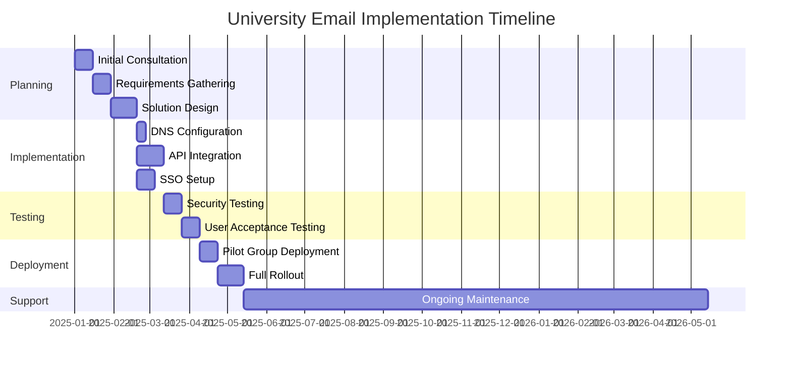
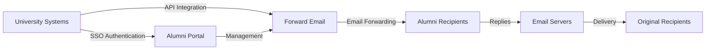

# ケーススタディ：Forward Emailがトップ大学の卒業生メールソリューションを支える方法 {#case-study-how-forward-email-powers-alumni-email-solutions-for-top-universities}


## 目次 {#table-of-contents}

* [序文](#foreword)
* [安定した価格での劇的なコスト削減](#dramatic-cost-savings-with-stable-pricing)
  * [実際の大学での節約例](#real-world-university-savings)
* [大学卒業生メールの課題](#the-university-alumni-email-challenge)
  * [卒業生メールアイデンティティの価値](#the-value-of-alumni-email-identity)
  * [従来のソリューションの限界](#traditional-solutions-fall-short)
  * [Forward Emailのソリューション](#the-forward-email-solution)
* [技術的実装：仕組み](#technical-implementation-how-it-works)
  * [コアアーキテクチャ](#core-architecture)
  * [大学システムとの統合](#integration-with-university-systems)
  * [API駆動の管理](#api-driven-management)
  * [DNS設定と検証](#dns-configuration-and-verification)
  * [テストと品質保証](#testing-and-quality-assurance)
* [実装タイムライン](#implementation-timeline)
* [実装プロセス：移行から保守まで](#implementation-process-from-migration-to-maintenance)
  * [初期評価と計画](#initial-assessment-and-planning)
  * [移行戦略](#migration-strategy)
  * [技術セットアップと構成](#technical-setup-and-configuration)
  * [ユーザーエクスペリエンス設計](#user-experience-design)
  * [トレーニングとドキュメント](#training-and-documentation)
  * [継続的なサポートと最適化](#ongoing-support-and-optimization)
* [ケーススタディ：ケンブリッジ大学](#case-study-university-of-cambridge)
  * [課題](#challenge)
  * [ソリューション](#solution)
  * [結果](#results)
* [大学と卒業生へのメリット](#benefits-for-universities-and-alumni)
  * [大学向け](#for-universities)
  * [卒業生向け](#for-alumni)
  * [卒業生の採用率](#adoption-rates-among-alumni)
  * [従来ソリューションとのコスト削減比較](#cost-savings-compared-to-previous-solutions)
* [セキュリティとプライバシーの考慮事項](#security-and-privacy-considerations)
  * [データ保護対策](#data-protection-measures)
  * [コンプライアンスフレームワーク](#compliance-framework)
* [今後の展開](#future-developments)
* [結論](#conclusion)


## 序文 {#foreword}

私たちは、世界で最も安全でプライベートかつ柔軟なメール転送サービスを、名門大学とその卒業生のために構築しました。

高等教育の競争環境において、卒業生との生涯にわたるつながりを維持することは単なる伝統ではなく、戦略的な必須事項です。大学がこれらのつながりを育む最も具体的な方法の一つが、卒業生に学術的な背景を反映したデジタルアイデンティティを提供する卒業生メールアドレスです。

Forward Emailでは、世界有数の教育機関と提携し、卒業生メールサービスの管理方法を革新してきました。当社のエンタープライズグレードのメール転送ソリューションは、[ケンブリッジ大学](https://en.wikipedia.org/wiki/University_of_Cambridge)、[メリーランド大学](https://en.wikipedia.org/wiki/University_of_Maryland,_College_Park)、[タフツ大学](https://en.wikipedia.org/wiki/Tufts_University)、[スワースモア大学](https://en.wikipedia.org/wiki/Swarthmore_College)の卒業生メールシステムを支え、世界中の何千人もの卒業生にサービスを提供しています。

本ブログ記事では、当社の[オープンソース](https://en.wikipedia.org/wiki/Open-source_software)でプライバシー重視のメール転送サービスがこれらの機関に選ばれる理由、その技術的実装、そして管理効率と卒業生満足度の両面での変革的な影響について探ります。


## 安定した価格での劇的なコスト削減 {#dramatic-cost-savings-with-stable-pricing}
私たちのソリューションの経済的メリットは非常に大きく、特に従来のメールプロバイダーの価格が継続的に上昇していることと比較すると顕著です：

| ソリューション                 | 卒業生1人あたりの年間コスト                                                                                 | 100,000人の卒業生のコスト | 最近の価格上昇                                                                                                                                                                           |
| ------------------------------ | --------------------------------------------------------------------------------------------------------- | ----------------------- | ---------------------------------------------------------------------------------------------------------------------------------------------------------------------------------------- |
| Google Workspace for Business  | $72                                                                                                       | $7,200,000              | • 2019年: G Suite Basicが月額$5から$6へ（+20%）<br>• 2023年: フレキシブルプランが20%値上げ<br>• 2025年: Business Plusが月額$18から$26.40へ（+47%）、AI機能付き                    |
| Google Workspace for Education | 無料（Education Fundamentals）<br>$3/学生/年（Education Standard）<br>$5/学生/年（Education Plus）       | 無料 - $500,000         | • ボリュームディスカウント：100-499ライセンスで5%割引<br>• ボリュームディスカウント：500以上のライセンスで10%割引<br>• 無料プランはコアサービスに限定                                                         |
| Microsoft 365 Business         | $60                                                                                                       | $6,000,000              | • 2023年: 年2回の価格更新を導入<br>• 2025年1月: Personalが月額$6.99から$9.99へ（+43%）、Copilot AI付き<br>• 2025年4月: 月払いの年間契約に5%値上げ                         |
| Microsoft 365 Education        | 無料（A1）<br>$38-55/教職員/年（A3）<br>$65-96/教職員/年（A5）                                         | 無料 - $96,000          | • 学生ライセンスは教職員購入に含まれることが多い<br>• ボリュームライセンスによるカスタム価格設定<br>• 無料プランはウェブ版に限定                                                                             |
| Self-Hosted Exchange           | $45                                                                                                       | $4,500,000              | 継続的なメンテナンスおよびセキュリティコストが増加し続けています                                                                                                                        |
| **Forward Email Enterprise**   | **固定 $250/月**                                                                                          | **$3,000/年**           | **リリース以来価格改定なし**                                                                                                                                                              |

### 実際の大学での節約例 {#real-world-university-savings}

パートナー大学がForward Emailを選択することで、従来のプロバイダーと比べて年間どれだけ節約できるかをご紹介します：

| 大学名                   | 卒業生数     | Google利用時の年間コスト | Forward Email利用時の年間コスト | 年間節約額    |
| ----------------------- | ------------ | ----------------------- | ------------------------------ | -------------- |
| ケンブリッジ大学         | 30,000       | $90,000                 | $3,000                         | $87,000        |
| スワースモア大学         | 5,000        | $15,000                 | $3,000                         | $12,000        |
| タフツ大学               | 12,000       | $36,000                 | $3,000                         | $33,000        |
| メリーランド大学         | 25,000       | $75,000                 | $3,000                         | $72,000        |

> \[!NOTE]
> Forward Email Enterpriseは通常月額$250のみで、ユーザーごとの追加費用はなく、ホワイトリスト化されたAPIレート制限もありません。追加のGB/TBのストレージが必要な場合のみ追加料金（10GBあたり+$3）が発生します。IMAP/POP3/SMTP/CalDAV/CardDAVの高速サポートのためにNVMe SSDドライブを使用しています。
> \[!IMPORTANT]
> GoogleやMicrosoftのように、データを解析するAI機能を統合しつつ価格を繰り返し引き上げている企業とは異なり、Forward Emailは厳格なプライバシー重視のもとで安定した価格を維持しています。私たちはAIを使用せず、利用状況の追跡も行わず、ログやメールをディスクに保存しません（すべての処理はメモリ内で行われます）。これにより、卒業生とのコミュニケーションにおいて完全なプライバシーを確保しています。

これは従来のメールホスティングソリューションと比較して大幅なコスト削減を意味し、大学はその資金を奨学金、研究、その他のミッションに不可欠な活動に振り向けることができます。Email Vendor Selectionによる2023年の分析によると、教育機関はAI機能の統合に伴う価格上昇に対応して、従来のメールプロバイダーの代替となるコスト効率の高い選択肢をますます求めています（[Email Vendor Selection, 2023](https://www.emailvendorselection.com/email-service-provider-list/)）。

## 大学の卒業生メールの課題 {#the-university-alumni-email-challenge}

大学にとって、卒業生に生涯メールアドレスを提供することは、従来のメールソリューションが効果的に対応しきれない独自の課題を伴います。ServerFaultの包括的な議論によると、大規模なユーザーベースを持つ大学は、パフォーマンス、セキュリティ、コスト効率のバランスを取る専門的なメールソリューションを必要としています（[ServerFault, 2009](https://serverfault.com/questions/97364/what-is-the-best-mail-server-for-a-university-with-a-large-amount-of-users)）。

### 卒業生メールアイデンティティの価値 {#the-value-of-alumni-email-identity}

卒業生のメールアドレス（例：`firstname.lastname@cl.cam.ac.uk`や`username@terpalum.umd.edu`）は、以下のような複数の重要な役割を果たします：

* 制度とのつながりとブランドアイデンティティの維持
* 大学との継続的なコミュニケーションの促進
* 卒業生の専門的信用力の向上
* 卒業生ネットワーキングとコミュニティ形成の支援
* 安定した生涯の連絡先の提供

Tekade（2020年）の研究は、教育用メールアドレスが卒業生に対して学術資源へのアクセス、専門的信用力、各種サービスの独占割引など多くの利点を提供することを示しています（[Medium, 2020](https://medium.com/coders-capsule/top-20-benefits-of-having-an-educational-email-address-91a09795e05)）。

> \[!TIP]
> 大学卒業生メールサービスに関する包括的なリソース、設定ガイド、ベストプラクティス、卒業生メールドメインの検索可能なディレクトリを含む新しい[AlumniEmail.com](https://alumniemail.com)ディレクトリをご覧ください。すべての卒業生メール情報の中心的ハブとして機能します。

### 従来のソリューションの限界 {#traditional-solutions-fall-short}

従来のメールシステムは、卒業生メールのニーズに適用するといくつかの制約があります：

* **コストが高すぎる**：ユーザーごとのライセンスモデルは大規模な卒業生ベースには財政的に持続不可能
* **管理負担**：数千または数百万のアカウント管理には多大なITリソースが必要
* **セキュリティ上の懸念**：休眠アカウントのセキュリティ維持は脆弱性を増加させる
* **柔軟性の欠如**：硬直したシステムは卒業生メール転送の独自ニーズに適応できない
* **プライバシー問題**：多くのプロバイダーは広告目的でメール内容をスキャンする

Quoraの大学メール管理に関する議論では、未使用アカウントがハッキングやID盗難のリスクを高めるため、セキュリティ上の懸念が大学が卒業生メールアドレスを制限または廃止する主な理由であることが明らかにされています（[Quora, 2011](https://www.quora.com/Is-there-any-cost-for-a-college-or-university-to-maintain-edu-e-mail-addresses)）。

### Forward Emailのソリューション {#the-forward-email-solution}

私たちのアプローチは、根本的に異なるモデルでこれらの課題に対応します：

* ホスティングではなくメール転送
* ユーザーごとの費用ではなく定額料金
* 透明性とセキュリティのためのオープンソースアーキテクチャ
* コンテンツスキャンなしのプライバシーファースト設計
* 大学のアイデンティティ管理に特化した機能

## 技術的実装：仕組み {#technical-implementation-how-it-works}
私たちのソリューションは、洗練されながらもシンプルな技術アーキテクチャを活用し、大規模で信頼性が高く安全なメール転送を実現しています。

### Core Architecture {#core-architecture}

Forward Emailシステムは、いくつかの主要なコンポーネントで構成されています：

* 高可用性のための分散MXサーバー
* メッセージを保存しないリアルタイム転送
* 包括的なメール認証
* カスタムドメインおよびサブドメインのサポート
* API駆動のアカウント管理

ServerFaultのIT専門家によると、大学が独自のメールソリューションを導入する場合、Postfixが最良のメール転送エージェント（MTA）として推奨され、CourierまたはDovecotがIMAP/POP3アクセスに好まれるとされています（[ServerFault, 2009](https://serverfault.com/questions/97364/what-is-the-best-mail-server-for-a-university-with-a-large-amount-of-users)）。しかし、私たちのソリューションは、大学がこれらの複雑なシステムを自ら管理する必要を排除します。

### Integration with University Systems {#integration-with-university-systems}

既存の大学インフラとのシームレスな統合経路を開発しました：

* [RESTful API](https://forwardemail.net/email-api) 統合による自動プロビジョニング
* 大学ポータル向けのカスタムブランディングオプション
* 学部や組織向けの柔軟なエイリアス管理
* 効率的な管理のための一括操作

### API-Driven Management {#api-driven-management}

私たちの[RESTful API](https://forwardemail.net/email-api)により、大学はメール管理を自動化できます：

```javascript
// Example: Creating a new alumni email address
const response = await fetch('https://forwardemail.net/api/v1/domains/example.edu/aliases', {
  method: 'POST',
  headers: {
    'Content-Type': 'application/json',
    'Authorization': `Basic ${Buffer.from(YOUR_API_TOKEN + ":").toString('base64')}`
  },
  body: JSON.stringify({
    name: 'alumni.john.smith',
    recipients: ['johnsmith@gmail.com'],
    has_recipient_verification: true
  })
});
```

### DNS Configuration and Verification {#dns-configuration-and-verification}

適切なDNS設定はメール配信に不可欠です。私たちのチームは以下を支援します：

* MXレコードを含む[DNS](https://en.wikipedia.org/wiki/Domain_Name_System)設定
* オープンソースの[mailauth](https://www.npmjs.com/package/mailauth)パッケージを使用した包括的なメールセキュリティ実装。これはメール認証のためのスイスアーミーナイフであり、以下を処理します：
  * [SPF](https://en.wikipedia.org/wiki/Sender_Policy_Framework)（送信者ポリシーフレームワーク）によるメールなりすまし防止
  * [DKIM](https://en.wikipedia.org/wiki/DomainKeys_Identified_Mail)（ドメインキー識別メール）によるメール認証
  * [DMARC](https://en.wikipedia.org/wiki/Email_authentication)（ドメインベースメッセージ認証、報告、適合）によるポリシー適用
  * [MTA-STS](https://en.wikipedia.org/wiki/Opportunistic_TLS)（SMTP MTA厳格トランスポートセキュリティ）によるTLS暗号化の強制
  * [ARC](https://en.wikipedia.org/wiki/DomainKeys_Identified_Mail#Authenticated_Received_Chain)（認証済み受信チェーン）による転送時の認証維持
  * [SRS](https://en.wikipedia.org/wiki/Sender_Rewriting_Scheme)（送信者書き換えスキーム）による転送時のSPF検証維持
  * [BIMI](https://en.wikipedia.org/wiki/Email_authentication)（メッセージ識別のためのブランド指標）による対応メールクライアントでのロゴ表示
* ドメイン所有権のためのDNS TXTレコード検証

`mailauth`パッケージ（<http://npmjs.com/package/mailauth>）は、メール認証のすべての側面を一つの統合ライブラリで処理する完全オープンソースのソリューションです。独自ソリューションとは異なり、このアプローチは透明性、定期的なセキュリティ更新、およびメール認証プロセスの完全な制御を保証します。

### Testing and Quality Assurance {#testing-and-quality-assurance}

本格導入前に、厳格なテストを実施します：

* エンドツーエンドのメール配信テスト
* 大量シナリオにおける負荷テスト
* セキュリティ侵入テスト
* API統合検証
* 卒業生代表によるユーザー受け入れテスト
## 実装タイムライン {#implementation-timeline}


```mermaid
gantt
    title University Email Implementation Timeline
    dateFormat  YYYY-MM-DD
    section Planning
    Initial Consultation           :a1, 2025-01-01, 14d
    Requirements Gathering         :a2, after a1, 14d
    Solution Design                :a3, after a2, 21d
    section Implementation
    DNS Configuration              :b1, after a3, 7d
    API Integration                :b2, after a3, 21d
    SSO Setup                      :b3, after a3, 14d
    section Testing
    Security Testing               :c1, after b1 b2 b3, 14d
    User Acceptance Testing        :c2, after c1, 14d
    section Deployment
    Pilot Group Deployment         :d1, after c2, 14d
    Full Rollout                   :d2, after d1, 21d
    section Support
    Ongoing Maintenance            :e1, after d2, 365d
```


## 実装プロセス：移行から保守まで {#implementation-process-from-migration-to-maintenance}

当社の体系的な実装プロセスは、大学が当社のソリューションを採用する際のスムーズな移行を保証します。

### 初期評価と計画 {#initial-assessment-and-planning}

大学の現行メールシステム、卒業生データベース、および技術要件を包括的に評価することから始めます。このフェーズには以下が含まれます：

* IT、卒業生関係、管理部門とのステークホルダーインタビュー
* 既存メールインフラの技術監査
* 卒業生記録のデータマッピング
* セキュリティおよびコンプライアンスのレビュー
* プロジェクトのタイムラインとマイルストーンの策定

### 移行戦略 {#migration-strategy}

評価に基づき、混乱を最小限に抑えつつ完全なデータ整合性を確保するカスタマイズされた移行戦略を策定します：

* 卒業生コホートごとの段階的移行アプローチ
* 移行期間中の並行システム運用
* 包括的なデータ検証プロトコル
* 移行問題発生時のフォールバック手順
* すべてのステークホルダーへの明確なコミュニケーション計画

### 技術セットアップと構成 {#technical-setup-and-configuration}

当社の技術チームがシステムセットアップのすべての側面を担当します：

* DNS設定と検証
* 大学システムとのAPI統合
* 大学ブランドを反映したカスタムポータル開発
* メール認証設定（SPF、DKIM、DMARC）

### ユーザーエクスペリエンスデザイン {#user-experience-design}

管理者と卒業生の両方にとって直感的なインターフェースを大学と密に連携して作成します：

* カスタムブランドの卒業生メールポータル
* 簡素化されたメール転送管理
* モバイル対応デザイン
* アクセシビリティ準拠
* 必要に応じた多言語対応

### トレーニングとドキュメント {#training-and-documentation}

包括的なトレーニングにより、すべてのステークホルダーがシステムを効果的に使用できるようにします：

* 管理者向けトレーニングセッション
* ITスタッフ向け技術ドキュメント
* 卒業生向けユーザーガイド
* 一般的なタスクのビデオチュートリアル
* ナレッジベースの構築

### 継続的なサポートと最適化 {#ongoing-support-and-optimization}

実装後もパートナーシップは続きます：

* 24時間365日の技術サポート
* 定期的なシステム更新とセキュリティパッチ
* パフォーマンス監視と最適化
* メールのベストプラクティスに関するコンサルテーション
* データ分析とレポーティング


## ケーススタディ：ケンブリッジ大学 {#case-study-university-of-cambridge}

ケンブリッジ大学は、IT負荷とコストを削減しつつ、卒業生に@cam.ac.ukのメールアドレスを提供するソリューションを求めていました。

### 課題 {#challenge}

ケンブリッジは以前の卒業生メールシステムで以下の課題に直面していました：

* 別個のメールインフラ維持にかかる高い運用コスト
* 数千のアカウント管理による管理負担
* 休眠アカウントに関するセキュリティ懸念
* 卒業生データベースシステムとの統合の制限
* 増加するストレージ要件

### ソリューション {#solution}

Forward Emailは包括的なソリューションを実装しました：

* すべての@cam.ac.uk卒業生アドレスへのメール転送
* 卒業生セルフサービス用のカスタムブランドポータル
* ケンブリッジの卒業生データベースとのAPI統合
* 包括的なメールセキュリティ実装

### 結果 {#results}

実装により大きな効果が得られました：
* 以前のソリューションと比較して大幅なコスト削減
* 99.9%のメール配信信頼性
* 自動化による管理の簡素化
* 最新のメール認証によるセキュリティ強化
* システムの使いやすさに関する卒業生からの好意的なフィードバック


## 大学および卒業生へのメリット {#benefits-for-universities-and-alumni}

当社のソリューションは、教育機関とその卒業生の双方に具体的なメリットを提供します。

### 大学向け {#for-universities}

* **コスト効率**：卒業生数に関係なく固定価格
* **管理の簡素化**：APIによる自動管理
* **セキュリティ強化**：包括的なメール認証
* **ブランドの一貫性**：生涯にわたる機関メールアドレス
* **卒業生との連携強化**：継続的なサービスによる関係強化

BulkSignature（2023）によると、教育機関向けのメールプラットフォームは、無料または低コストのプランによるコスト効果、大量通信機能による時間効率、メール配信とエンゲージメントの追跡機能など、重要なメリットを提供しています（[BulkSignature, 2023](https://bulksignature.com/blog/5-best-email-platforms-for-educational-institutions/)）。

### 卒業生向け {#for-alumni}

* **プロフェッショナルなアイデンティティ**：名門大学のメールアドレス
* **メールの継続性**：任意の個人メールへの転送可能
* **プライバシー保護**：内容のスキャンやデータマイニングなし
* **管理の簡素化**：受信者情報の簡単な更新
* **セキュリティ強化**：最新のメール認証

International Journal of Education & Literacy Studiesの研究では、学術環境における適切なメールコミュニケーションの重要性が強調されており、メールリテラシーは学生および卒業生にとって専門的な文脈で重要なスキルであると指摘されています（[IJELS, 2021](https://files.eric.ed.gov/fulltext/EJ1319324.pdf)）。

### 卒業生の採用率 {#adoption-rates-among-alumni}

大学は卒業生コミュニティにおける高い採用率と満足度を報告しています。

### 以前のソリューションと比較したコスト削減 {#cost-savings-compared-to-previous-solutions}

財務面で大きな影響があり、大学は以前のメールソリューションと比較して大幅なコスト削減を報告しています。


## セキュリティおよびプライバシーの考慮事項 {#security-and-privacy-considerations}

教育機関にとって、卒業生データの保護は単なる良い慣行ではなく、欧州のGDPRなどの規制に基づく法的要件であることが多いです。

### データ保護対策 {#data-protection-measures}

当社のソリューションは複数のセキュリティ層を組み込んでいます：

* すべてのメールトラフィックに対するエンドツーエンド暗号化
* メール内容をサーバーに保存しない
* 定期的なセキュリティ監査およびペネトレーションテスト
* 国際的なデータ保護基準への準拠
* セキュリティ検証のための透明でオープンソースのコード

> \[!WARNING]
> 多くのメールプロバイダーは広告目的やAIモデルの学習のためにメール内容をスキャンしています。この慣行は、特に専門的および学術的なコミュニケーションにおいて深刻なプライバシー問題を引き起こします。Forward Emailはメール内容を一切スキャンせず、すべてのメールをメモリ内で処理して完全なプライバシーを保証します。

### コンプライアンスフレームワーク {#compliance-framework}

当社は関連規制を厳格に遵守しています：

* 欧州機関向けのGDPR準拠
* SOC 2 タイプII認証
* 年次セキュリティ評価
* [forwardemail.net/dpa](https://forwardemail.net/dpa) にて提供されるデータ処理契約（DPA）
* 規制の変化に応じた定期的なコンプライアンス更新


## 今後の展開 {#future-developments}

当社は卒業生向けメールソリューションを新機能と能力で継続的に強化しています：

* 大学管理者向けの高度な分析機能
* 先進的なフィッシング対策
* より深い統合のためのAPI機能拡張
* 追加の認証オプション


## 結論 {#conclusion}

Forward Emailは、大学が卒業生向けメールサービスを提供・管理する方法を革新しました。高価で複雑なメールホスティングを洗練された安全なメール転送に置き換えることで、すべての卒業生に生涯メールアドレスを提供しつつ、コストと管理負担を劇的に削減しています。
ケンブリッジ、メリーランド、タフツ、スワースモアなどの名門機関とのパートナーシップは、多様な教育環境における当社のアプローチの有効性を示しています。大学が卒業生とのつながりを維持しつつコストを抑えるという圧力に直面する中で、当社のソリューションは従来のメールシステムに代わる魅力的な選択肢を提供します。


```mermaid
flowchart LR
    A[University Systems] -->|API Integration| B[Forward Email]
    B -->|Email Forwarding| C[Alumni Recipients]
    C -->|Replies| D[Email Servers]
    D -->|Delivery| E[Original Recipients]
    F[Alumni Portal] -->|Management| B
    A -->|SSO Authentication| F
```

Forward Emailが卒業生向けメールサービスをどのように変革できるかに関心のある大学は、<support@forwardemail.net>までお問い合わせいただくか、[forwardemail.net](https://forwardemail.net)をご覧になり、当社のエンタープライズソリューションについて詳しくお知りください。
