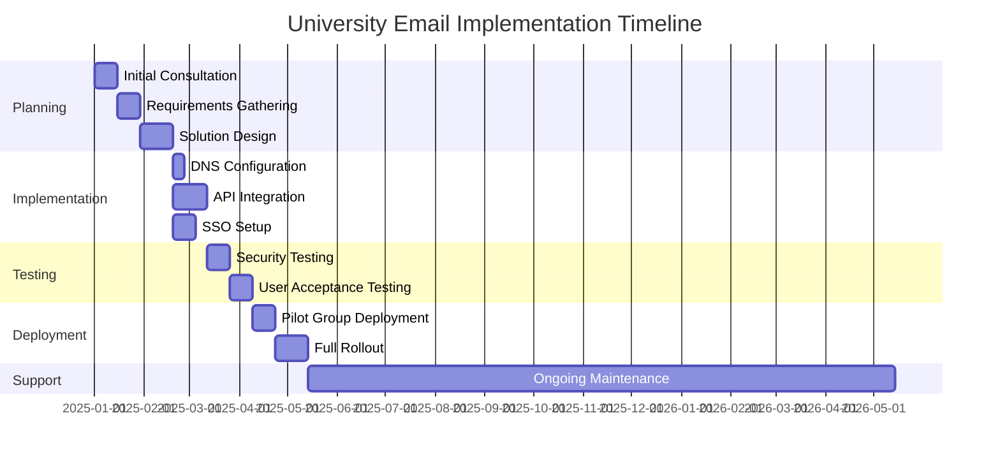
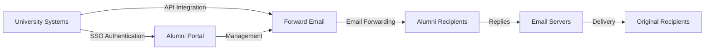

# 사례 연구: Forward Email이 최고 대학의 동문 이메일 솔루션을 강화하는 방법 {#case-study-how-forward-email-powers-alumni-email-solutions-for-top-universities}


## 목차 {#table-of-contents}

* [머리말](#foreword)
* [안정적인 가격으로 극적인 비용 절감](#dramatic-cost-savings-with-stable-pricing)
  * [실제 대학 저축](#real-world-university-savings)
* [대학 동문 이메일 챌린지](#the-university-alumni-email-challenge)
  * [동문 이메일 ID의 가치](#the-value-of-alumni-email-identity)
  * [기존 솔루션은 부족합니다](#traditional-solutions-fall-short)
  * [포워드 이메일 솔루션](#the-forward-email-solution)
* [기술 구현: 작동 방식](#technical-implementation-how-it-works)
  * [핵심 아키텍처](#core-architecture)
  * [대학 시스템과의 통합](#integration-with-university-systems)
  * [API 기반 관리](#api-driven-management)
  * [DNS 구성 및 확인](#dns-configuration-and-verification)
  * [테스트 및 품질 보증](#testing-and-quality-assurance)
* [구현 타임라인](#implementation-timeline)
* [구현 프로세스: 마이그레이션에서 유지 관리까지](#implementation-process-from-migration-to-maintenance)
  * [초기 평가 및 계획](#initial-assessment-and-planning)
  * [이주 전략](#migration-strategy)
  * [기술 설정 및 구성](#technical-setup-and-configuration)
  * [사용자 경험 디자인](#user-experience-design)
  * [교육 및 문서화](#training-and-documentation)
  * [지속적인 지원 및 최적화](#ongoing-support-and-optimization)
* [사례 연구: 케임브리지 대학교](#case-study-university-of-cambridge)
  * [도전](#challenge)
  * [해결책](#solution)
  * [결과](#results)
* [대학 및 동문의 혜택](#benefits-for-universities-and-alumni)
  * [대학을 위해](#for-universities)
  * [동문들을 위해](#for-alumni)
  * [동문들의 입양률](#adoption-rates-among-alumni)
  * [이전 솔루션 대비 비용 절감](#cost-savings-compared-to-previous-solutions)
* [보안 및 개인 정보 보호 고려 사항](#security-and-privacy-considerations)
  * [데이터 보호 조치](#data-protection-measures)
  * [규정 준수 프레임워크](#compliance-framework)
* [향후 개발](#future-developments)
* [결론](#conclusion)

## 서문 {#foreword}

우리는 명문 대학과 그 동문을 위해 세계에서 가장 안전하고, 개인정보 보호가 강화되고, 유연한 이메일 전달 서비스를 구축했습니다.

경쟁이 치열한 고등 교육 환경에서 동문들과 평생 지속되는 관계를 유지하는 것은 단순히 전통의 문제가 아니라 전략적 필수 요소입니다. 대학이 이러한 관계를 구축하는 가장 실질적인 방법 중 하나는 동문 이메일 주소를 통해 졸업생들에게 학문적 유산을 반영하는 디지털 정체성을 제공하는 것입니다.

Forward Email은 세계 유수의 교육 기관들과 협력하여 동문 이메일 서비스 관리 방식을 혁신해 왔습니다. Forward Email의 엔터프라이즈급 이메일 전달 솔루션은 이제 [케임브리지 대학교](https://en.wikipedia.org/wiki/University_of_Cambridge), [메릴랜드 대학교](https://en.wikipedia.org/wiki/University_of_Maryland,\_College_Park), [터프츠 대학교](https://en.wikipedia.org/wiki/Tufts_University), [스와스모어 칼리지](https://en.wikipedia.org/wiki/Swarthmore_College)의 동문 이메일 시스템을 지원하여 전 세계 수천 명의 동문에게 서비스를 제공하고 있습니다.

이 블로그 게시물에서는 개인정보 보호에 중점을 둔 이메일 전달 서비스인 [오픈소스](https://en.wikipedia.org/wiki/Open-source_software)가 이러한 기관에서 선호하는 솔루션이 된 과정, 이를 가능하게 하는 기술적 구현, 그리고 행정 효율성과 동문 만족도에 미친 혁신적인 영향에 대해 알아봅니다.

## 안정적인 가격으로 엄청난 비용 절감 {#dramatic-cost-savings-with-stable-pricing}

특히 기존 이메일 공급업체의 가격이 지속적으로 상승하는 것과 비교했을 때, 당사 솔루션의 재정적 이점은 상당합니다.

| 해결책 | 동문당 비용(연간) | 10만 명의 동문 비용 | 최근 가격 인상 |
| ------------------------------ | --------------------------------------------------------------------------------------------------------- | ----------------------- | ---------------------------------------------------------------------------------------------------------------------------------------------------------------------------------------- |
| 비즈니스용 Google Workspace | $72 | $7,200,000 | • 2019년: G Suite Basic이 월 5달러에서 6달러로 인상(+20%)<br>• 2023년: 유연한 요금제가 20% 인상<br>• 2025년: AI 기능이 포함된 Business Plus가 월 18달러에서 26.40달러로 인상(+47%) |
| 교육용 Google Workspace | 무료(Education Fundamentals)<br>$3/학생/년(Education Standard)<br>$5/학생/년(Education Plus) | 무료 - 50만 달러 | • 볼륨 할인: 100-499개 라이선스의 경우 5%<br>• 볼륨 할인: 500개 이상 라이선스의 경우 10%<br>• 무료 계층은 핵심 서비스에 한함 |
| 마이크로소프트 365 비즈니스 | $60 | $6,000,000 | • 2023년: 2년마다 가격 업데이트 도입<br>• 2025년(1월): Copilot AI를 탑재한 개인용 요금제가 월 $6.99에서 $9.99로 인상(+43%)<br>• 2025년(4월): 월 단위로 지불하는 연간 약정 요금이 5% 인상됨 |
| Microsoft 365 교육 | 무료(A1)<br>$38-55/교수/년(A3)<br>$65-96/교수/년(A5) | 무료 - $96,000 | • 학생용 라이선스는 종종 교수진 구매에 포함됩니다.<br>• 볼륨 라이선스를 통한 맞춤 가격 책정<br>• 무료 계층은 웹 버전으로 제한됨 |
| 셀프 호스팅 거래소 | $45 | $4,500,000 | 지속적인 유지 관리 및 보안 비용이 계속 증가하고 있습니다. |
| **Forward Email Enterprise** | **고정 $250/월** | **연간 3,000달러** | **출시 이후 가격 인상 없음** |

### 실제 대학 비용 절감 {#real-world-university-savings}

기존 공급업체 대신 Forward Email을 선택하여 파트너 대학이 매년 얼마나 비용을 절감하는지 알아보세요.

| 대학교 | 동문 수 | Google의 연간 비용 | 전달 이메일로 인한 연간 비용 | 연간 절감액 |
| ----------------------- | ------------ | ----------------------- | ------------------------------ | -------------- |
| 케임브리지 대학교 | 30,000 | $90,000 | $3,000 | $87,000 |
| 스와스모어 칼리지 | 5,000 | $15,000 | $3,000 | $12,000 |
| 터프츠 대학교 | 12,000 | $36,000 | $3,000 | $33,000 |
| 메릴랜드 대학교 | 25,000 | $75,000 | $3,000 | $72,000 |

> \[!NOTE]
> Forward Email Enterprise는 일반적으로 월 $250에 불과하며, 사용자당 추가 비용 없이 API 속도 제한이 적용됩니다. 학생을 위해 추가 GB/TB가 필요한 경우 추가 비용은 스토리지뿐입니다(추가 스토리지 10GB당 $3 추가). IMAP/POP3/SMTP/CalDAV/CardDAV의 빠른 지원을 위해 NVMe SSD 드라이브도 사용합니다.

> \[!IMPORTANT]
> 데이터 분석 AI 기능을 통합하면서 가격을 지속적으로 인상해 온 Google과 Microsoft와 달리, Forward Email은 엄격한 개인정보 보호 정책을 유지하면서도 안정적인 가격을 유지하고 있습니다. Forward Email은 AI를 사용하지 않고, 사용 패턴을 추적하지 않으며, 로그나 이메일을 디스크에 저장하지 않습니다(모든 처리는 메모리 내에서 이루어짐). 이를 통해 동문 소통의 완벽한 개인정보 보호를 보장합니다.

이는 기존 이메일 호스팅 솔루션에 비해 상당한 비용 절감 효과를 가져옵니다. 대학은 이 자금을 장학금, 연구 또는 기타 핵심 사업에 투자할 수 있습니다. 이메일 벤더 셀렉션(Email Vendor Selection)의 2023년 분석에 따르면, AI 기능([2023년 이메일 공급업체 선정](https://www.emailvendorselection.com/email-service-provider-list/)) 통합으로 가격이 계속 상승함에 따라 교육 기관들은 기존 이메일 서비스 제공업체보다 비용 효율적인 대안을 점점 더 많이 찾고 있습니다.

## 대학 동문 이메일 챌린지 {#the-university-alumni-email-challenge}

대학의 경우, 동문에게 평생 이메일 주소를 제공하는 것은 기존 이메일 솔루션으로는 효과적으로 해결하기 어려운 고유한 과제를 안겨줍니다. ServerFault에 대한 심도 있는 논의에서 언급했듯이, 대규모 사용자를 보유한 대학은 성능, 보안, 그리고 비용 효율성의 균형을 맞춘 특화된 이메일 솔루션이 필요합니다([서버폴트, 2009](https://serverfault.com/questions/97364/what-is-the-best-mail-server-for-a-university-with-a-large-amount-of-users)).

### 동문 이메일 ID의 가치 {#the-value-of-alumni-email-identity}

동문 이메일 주소(`firstname.lastname@cl.cam.ac.uk` 또는 `username@terpalum.umd.edu` 등)는 여러 가지 중요한 기능을 수행합니다.

* 기관과의 연결 및 브랜드 아이덴티티 유지
* 대학과의 지속적인 소통 촉진
* 졸업생의 전문적 신뢰도 향상
* 동문 네트워킹 및 커뮤니티 구축 지원
* 안정적인 평생 연락 창구 제공

Tekade(2020)의 연구에 따르면 교육용 이메일 주소는 학업 자료에 대한 접근, 전문적 신뢰도, 다양한 서비스에 대한 독점 할인 등 동문에게 수많은 이점을 제공한다는 점이 강조되었습니다([미디엄, 2020](https://medium.com/coders-capsule/top-20-benefits-of-having-an-educational-email-address-91a09795e05)).

> \[!TIP]
> 새로운 [AlumniEmail.com](https://alumniemail.com) 디렉토리를 방문하여 설정 가이드, 모범 사례, 검색 가능한 동문 이메일 도메인 디렉토리 등 대학 동문 이메일 서비스에 대한 포괄적인 리소스를 확인하세요. 모든 동문 이메일 정보의 중심 허브 역할을 합니다.

### 기존 솔루션은 부족합니다 {#traditional-solutions-fall-short}

기존 이메일 시스템은 동문 이메일 요구 사항에 적용 시 여러 가지 한계를 나타냅니다.

* **비용 부담**: 대규모 동문 기반을 가진 사용자에게 사용자당 라이선스 모델은 재정적으로 지속 불가능해집니다.
* **관리 부담**: 수천 또는 수백만 개의 계정을 관리하는 데 상당한 IT 리소스가 필요합니다.
* **보안 문제**: 휴면 계정의 보안 유지로 인해 취약성이 증가합니다.
* **유연성 제한**: 경직된 시스템은 동문 이메일 전달의 고유한 요구 사항을 충족할 수 없습니다.
* **개인정보 보호 문제**: 많은 제공업체가 광고 목적으로 이메일 콘텐츠를 스캔합니다.

Quora에서 대학 이메일 유지 관리에 대해 논의한 결과, 대학에서 동문 이메일 주소를 제한하거나 취소하는 주된 이유는 보안 문제인 것으로 드러났습니다. 사용하지 않는 계정은 해킹과 신원 도용에 취약할 수 있기 때문입니다([쿼라, 2011](https://www.quora.com/Is-there-any-cost-for-a-college-or-university-to-maintain-edu-e-mail-addresses)).

### 전달 이메일 솔루션 {#the-forward-email-solution}

우리의 접근 방식은 근본적으로 다른 모델을 통해 이러한 과제를 해결합니다.

* 호스팅 대신 이메일 전달
* 사용자당 비용 대신 정액제
* 투명성과 보안을 위한 오픈소스 아키텍처
* 콘텐츠 스캐닝 없는 개인정보 보호 우선 설계
* 대학 신원 관리를 위한 특화 기능

## 기술 구현: 작동 방식 {#technical-implementation-how-it-works}

당사의 솔루션은 정교하면서도 우아한 단순함을 갖춘 기술 아키텍처를 활용하여 대규모로 안정적이고 안전한 이메일 전달 서비스를 제공합니다.

### 핵심 아키텍처 {#core-architecture}

전달 이메일 시스템은 몇 가지 주요 구성 요소로 구성됩니다.

* 고가용성을 위한 분산형 MX 서버
* 메시지 저장 없이 실시간 전달
* 포괄적인 이메일 인증
* 사용자 지정 도메인 및 하위 도메인 지원
* API 기반 계정 관리

ServerFault의 IT 전문가들에 따르면, 자체 이메일 솔루션을 구축하려는 대학의 경우 Postfix가 최고의 메일 전송 에이전트(MTA)로 권장되며, IMAP/POP3 접속에는 Courier나 Dovecot이 선호됩니다([서버폴트, 2009](https://serverfault.com/questions/97364/what-is-the-best-mail-server-for-a-university-with-a-large-amount-of-users)). 하지만 저희 솔루션을 사용하면 대학이 이러한 복잡한 시스템을 직접 관리할 필요가 없습니다.

### 대학 시스템과의 통합 {#integration-with-university-systems}

우리는 기존 대학 인프라와 원활하게 통합되는 경로를 개발했습니다.

* [RESTful API](https://forwardemail.net/email-api) 통합을 통한 자동 프로비저닝
* 대학 포털을 위한 맞춤형 브랜딩 옵션
* 부서 및 조직을 위한 유연한 별칭 관리
* 효율적인 관리를 위한 일괄 작업

### API 기반 관리 {#api-driven-management}

[RESTful API](https://forwardemail.net/email-api)을 사용하면 대학에서 이메일 관리를 자동화할 수 있습니다.

```javascript
// Example: Creating a new alumni email address
const response = await fetch('https://forwardemail.net/api/v1/domains/example.edu/aliases', {
  method: 'POST',
  headers: {
    'Content-Type': 'application/json',
    'Authorization': `Basic ${Buffer.from(YOUR_API_TOKEN + ":").toString('base64')}`
  },
  body: JSON.stringify({
    name: 'alumni.john.smith',
    recipients: ['johnsmith@gmail.com'],
    has_recipient_verification: true
  })
});
```

### DNS 구성 및 확인 {#dns-configuration-and-verification}

이메일 전송을 위해서는 적절한 DNS 설정이 필수적입니다. 저희 팀은 다음과 같은 서비스를 지원합니다.

* MX 레코드를 포함한 [DNS](https://en.wikipedia.org/wiki/Domain_Name_System) 구성
* 오픈소스 [메일 인증](https://www.npmjs.com/package/mailauth) 패키지를 사용하여 포괄적인 이메일 보안을 구현했습니다. 이 패키지는 이메일 인증을 위한 만능 도구로, 다음을 처리합니다.
* 이메일 스푸핑 방지를 위한 [SPF](https://en.wikipedia.org/wiki/Sender_Policy_Framework)(발신자 정책 프레임워크)
* 이메일 인증을 위한 [DKIM](https://en.wikipedia.org/wiki/DomainKeys_Identified_Mail)(도메인키 식별 메일)
* 정책 적용을 위한 [DMARC](https://en.wikipedia.org/wiki/Email_authentication)(도메인 기반 메시지 인증, 보고 및 준수)
* TLS 암호화 적용을 위한 [MTA-STS](https://en.wikipedia.org/wiki/Opportunistic_TLS)(SMTP MTA Strict Transport Security)
* 메시지 전달 시 인증을 유지하기 위한 [ARC](https://en.wikipedia.org/wiki/DomainKeys_Identified_Mail#Authenticated_Received_Chain)(인증된 수신 체인)
* 전달 중 SPF 검증을 유지하기 위한 [SRS](https://en.wikipedia.org/wiki/Sender_Rewriting_Scheme)(발신자 재작성 체계)
* [BIMI](https://en.wikipedia.org/wiki/Email_authentication) (메시지 식별을 위한 브랜드 표시) 지원 이메일 클라이언트의 로고 표시
* 도메인 소유권 확인을 위한 DNS TXT 레코드 확인

`mailauth` 패키지(<http://npmjs.com/package/mailauth>)는 이메일 인증의 모든 측면을 하나의 통합 라이브러리에서 처리하는 완전 오픈 소스 솔루션입니다. 독점 솔루션과 달리, 이 방식은 투명성, 정기적인 보안 업데이트, 그리고 이메일 인증 프로세스에 대한 완벽한 제어를 보장합니다.

### 테스트 및 품질 보증 {#testing-and-quality-assurance}

전체 배포 전에 엄격한 테스트를 실시합니다.

* 엔드 투 엔드 이메일 전송 테스트
* 대용량 시나리오에 대한 부하 테스트
* 보안 침투 테스트
* API 통합 검증
* 동문 담당자와의 사용자 수용 테스트

## 구현 타임라인 {#implementation-timeline}



## 구현 프로세스: 마이그레이션에서 유지 관리까지 {#implementation-process-from-migration-to-maintenance}

당사의 체계적인 구현 프로세스는 당사 솔루션을 도입한 대학의 원활한 전환을 보장합니다.

### 초기 평가 및 계획 {#initial-assessment-and-planning}

먼저 대학의 현재 이메일 시스템, 동문 데이터베이스, 그리고 기술 요건에 대한 종합적인 평가를 진행합니다. 이 단계에는 다음이 포함됩니다.

* IT, 동문 관계 및 행정 담당자와의 이해관계자 인터뷰
* 기존 이메일 인프라 기술 감사
* 동문 기록 데이터 매핑
* 보안 및 규정 준수 검토
* 프로젝트 일정 및 마일스톤 개발

### 마이그레이션 전략 {#migration-strategy}

평가를 바탕으로 완전한 데이터 무결성을 보장하는 동시에 중단을 최소화하는 맞춤형 마이그레이션 전략을 개발합니다.

* 동문 집단의 단계적 마이그레이션 방식
* 전환 중 병렬 시스템 운영
* 포괄적인 데이터 검증 프로토콜
* 마이그레이션 문제 발생 시 대체 절차
* 모든 이해관계자를 위한 명확한 소통 계획

### 기술 설정 및 구성 {#technical-setup-and-configuration}

당사 기술팀은 시스템 설정의 모든 측면을 처리합니다.

* DNS 설정 및 검증
* 대학 시스템과의 API 통합
* 대학 브랜딩을 활용한 맞춤형 포털 개발
* 이메일 인증 설정(SPF, DKIM, DMARC)

### 사용자 경험 디자인 {#user-experience-design}

우리는 관리자와 동문 모두를 위한 직관적인 인터페이스를 만들기 위해 대학과 긴밀히 협력합니다.

* 맞춤형 브랜드 동문 이메일 포털
* 간소화된 이메일 전달 관리
* 모바일 반응형 디자인
* 접근성 준수
* 필요한 경우 다국어 지원

### 교육 및 문서 {#training-and-documentation}

포괄적인 교육을 통해 모든 이해관계자가 시스템을 효과적으로 사용할 수 있도록 보장합니다.

* 관리자 교육 세션
* IT 직원을 위한 기술 문서
* 졸업생을 위한 사용자 가이드
* 일반 작업에 대한 비디오 튜토리얼
* 지식 기반 개발

### 지속적인 지원 및 최적화 {#ongoing-support-and-optimization}

우리의 파트너십은 구현 이후에도 계속됩니다.

* 24시간 연중무휴 기술 지원
* 정기적인 시스템 업데이트 및 보안 패치
* 성능 모니터링 및 최적화
* 이메일 모범 사례 컨설팅
* 데이터 분석 및 보고

## 사례 연구: 케임브리지 대학교 {#case-study-university-of-cambridge}

케임브리지 대학교는 IT 운영비와 비용을 줄이는 동시에 동문들에게 @cam.ac.uk 이메일 주소를 제공하기 위한 솔루션을 모색했습니다.

### 챌린지 {#challenge}

케임브리지는 이전 동문 이메일 시스템을 사용하면서 여러 가지 문제에 직면했습니다.

* 별도의 이메일 인프라 유지에 따른 높은 운영 비용
* 수천 개의 계정을 관리하는 행정적 부담
* 휴면 계정 관련 보안 문제
* 동문 데이터베이스 시스템과의 통합 제한
* 증가하는 스토리지 요구 사항

### 솔루션 {#solution}

Forward Email은 포괄적인 솔루션을 구현했습니다.

* 모든 @cam.ac.uk 동문 주소에 대한 이메일 전달
* 동문 셀프 서비스를 위한 맞춤형 브랜드 포털
* 케임브리지 동문 데이터베이스와 API 통합
* 포괄적인 이메일 보안 구현

### 결과 {#results}

구현을 통해 다음과 같은 상당한 이점이 있었습니다.

* 기존 솔루션 대비 상당한 비용 절감
* 99.9% 이메일 전송 안정성
* 자동화를 통한 간편한 관리
* 최신 이메일 인증을 통한 보안 강화
* 시스템 사용성에 대한 동문들의 긍정적인 피드백

## 대학 및 동문을 위한 혜택 {#benefits-for-universities-and-alumni}

우리의 솔루션은 교육기관과 졸업생 모두에게 실질적인 이점을 제공합니다.

### 대학용 {#for-universities}

* **비용 효율성**: 동문 수와 관계없이 고정 가격
* **관리 편의성**: API를 통한 자동화된 관리
* **강화된 보안**: 포괄적인 이메일 인증
* **브랜드 일관성**: 평생 기관 이메일 주소
* **동문 참여**: 지속적인 서비스를 통해 강화된 연결

BulkSignature(2023)에 따르면 교육 기관을 위한 이메일 플랫폼은 무료 또는 저렴한 요금제를 통한 비용 효율성, 대량 커뮤니케이션 기능을 통한 시간 효율성, 이메일 전달 및 참여를 모니터링하는 추적 기능([벌크시그니처, 2023](https://bulksignature.com/blog/5-best-email-platforms-for-educational-institutions/))을 포함하여 상당한 이점을 제공합니다.

### 동문용 {#for-alumni}

* **전문적 정체성**: 명문 대학교 이메일 주소
* **이메일 연속성**: 모든 개인 이메일로 전달
* **개인정보 보호**: 콘텐츠 검사 또는 데이터 마이닝 없음
* **간소화된 관리**: 수신자 업데이트 용이
* **강화된 보안**: 최신 이메일 인증

국제 교육 및 문해 연구 저널의 연구에 따르면, 학업 환경에서 적절한 이메일 의사소통의 중요성이 강조되었으며, 이메일 문해력은 전문적인 맥락에서 학생과 동문 모두에게 필수적인 기술이라고 지적했습니다([IJELS, 2021](https://files.eric.ed.gov/fulltext/EJ1319324.pdf)).

### 동문의 채택률 {#adoption-rates-among-alumni}

대학들은 동문 커뮤니티에서 높은 채택률과 만족도를 보고합니다.

### 이전 솔루션 대비 비용 절감 {#cost-savings-compared-to-previous-solutions}

재정적 영향은 엄청났으며, 대학들은 이전 이메일 솔루션에 비해 상당한 비용 절감 효과를 보고했습니다.

## 보안 및 개인 정보 보호 고려 사항 {#security-and-privacy-considerations}

교육 기관의 경우 동문 데이터를 보호하는 것은 좋은 관행일 뿐만 아니라 유럽의 GDPR과 같은 규정에 따른 법적 요구 사항이기도 합니다.

### 데이터 보호 조치 {#data-protection-measures}

당사 솔루션은 여러 계층의 보안을 통합합니다.

* 모든 이메일 트래픽에 대한 종단 간 암호화
* 당사 서버에 이메일 콘텐츠를 저장하지 않습니다.
* 정기적인 보안 감사 및 침투 테스트
* 국제 데이터 보호 표준 준수
* 보안 검증을 위한 투명한 오픈 소스 코드

> \[!WARNING]
> 많은 이메일 제공업체가 광고 목적이나 AI 모델 학습을 위해 이메일 콘텐츠를 스캔합니다. 이러한 관행은 특히 전문 및 학술 커뮤니케이션의 경우 심각한 개인정보 보호 문제를 야기합니다. Forward Email은 이메일 콘텐츠를 절대 스캔하지 않으며, 완전한 개인정보 보호를 위해 모든 이메일을 메모리 내에서 처리합니다.

### 규정 준수 프레임워크 {#compliance-framework}

우리는 관련 규정을 엄격히 준수합니다.

* 유럽 기관을 위한 GDPR 준수
* SOC 2 Type II 인증
* 연간 보안 평가
* 데이터 처리 계약(DPA)은 [forwardemail.net/dpa](https://forwardemail.net/dpa)에서 확인 가능
* 규정 변화에 따른 정기적인 규정 준수 업데이트

## 향후 개발 {#future-developments}

저희는 새로운 기능과 성능으로 동문 이메일 솔루션을 지속적으로 개선하고 있습니다.

* 대학 관리자를 위한 향상된 분석 기능
* 고급 안티피싱 보호 기능
* 더욱 긴밀한 통합을 위한 확장된 API 기능
* 추가 인증 옵션

## 결론 {#conclusion}

Forward Email은 대학이 동문 이메일 서비스를 제공하고 관리하는 방식에 혁신을 가져왔습니다. 값비싸고 복잡한 이메일 호스팅을 간편하고 안전한 이메일 전달 시스템으로 대체함으로써, 대학은 모든 동문에게 평생 이메일 주소를 제공하는 동시에 비용과 관리 부담을 획기적으로 줄일 수 있게 되었습니다.

케임브리지, 메릴랜드, 터프츠, 스와스모어와 같은 명문 교육기관과의 파트너십은 다양한 교육 환경에서 저희의 접근 방식이 얼마나 효과적인지 보여줍니다. 대학들이 비용 절감과 동시에 동문과의 관계를 유지해야 하는 압박이 커짐에 따라, 저희 솔루션은 기존 이메일 시스템에 대한 매력적인 대안을 제시합니다.



Forward Email이 동문 이메일 서비스를 어떻게 혁신할 수 있는지 알아보고 싶은 대학의 경우 <support@forwardemail.net>으로 당사 팀에 문의하거나 [forwardemail.net](https://forwardemail.net)을 방문하여 당사의 엔터프라이즈 솔루션에 대해 자세히 알아보세요.