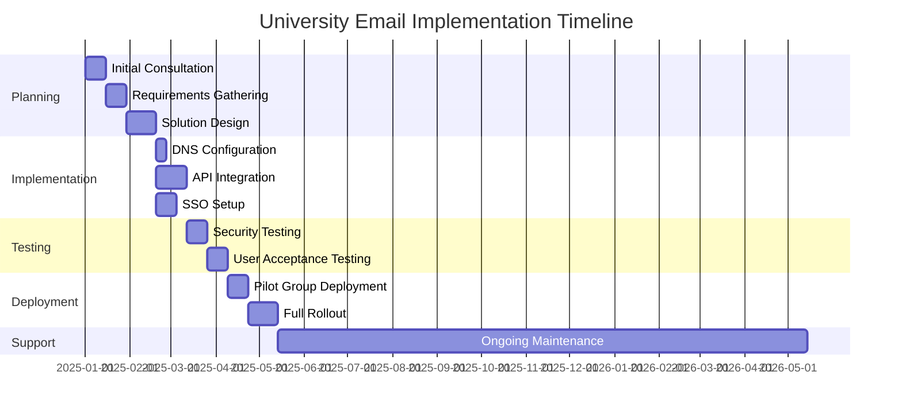
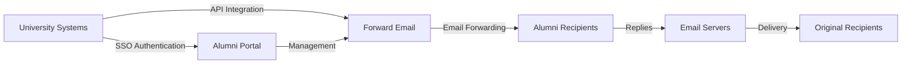

# 사례 연구: Forward Email이 최고의 대학들을 위한 동문 이메일 솔루션을 어떻게 지원하는가 {#case-study-how-forward-email-powers-alumni-email-solutions-for-top-universities}


## 목차 {#table-of-contents}

* [서문](#foreword)
* [안정적인 가격으로 극적인 비용 절감](#dramatic-cost-savings-with-stable-pricing)
  * [실제 대학 비용 절감 사례](#real-world-university-savings)
* [대학 동문 이메일 과제](#the-university-alumni-email-challenge)
  * [동문 이메일 정체성의 가치](#the-value-of-alumni-email-identity)
  * [전통적인 솔루션의 한계](#traditional-solutions-fall-short)
  * [Forward Email 솔루션](#the-forward-email-solution)
* [기술적 구현: 작동 원리](#technical-implementation-how-it-works)
  * [핵심 아키텍처](#core-architecture)
  * [대학 시스템과의 통합](#integration-with-university-systems)
  * [API 기반 관리](#api-driven-management)
  * [DNS 구성 및 검증](#dns-configuration-and-verification)
  * [테스트 및 품질 보증](#testing-and-quality-assurance)
* [구현 일정](#implementation-timeline)
* [구현 과정: 마이그레이션부터 유지보수까지](#implementation-process-from-migration-to-maintenance)
  * [초기 평가 및 계획](#initial-assessment-and-planning)
  * [마이그레이션 전략](#migration-strategy)
  * [기술 설정 및 구성](#technical-setup-and-configuration)
  * [사용자 경험 설계](#user-experience-design)
  * [교육 및 문서화](#training-and-documentation)
  * [지속적인 지원 및 최적화](#ongoing-support-and-optimization)
* [사례 연구: 케임브리지 대학교](#case-study-university-of-cambridge)
  * [과제](#challenge)
  * [솔루션](#solution)
  * [결과](#results)
* [대학과 동문을 위한 혜택](#benefits-for-universities-and-alumni)
  * [대학을 위한 혜택](#for-universities)
  * [동문을 위한 혜택](#for-alumni)
  * [동문 채택률](#adoption-rates-among-alumni)
  * [기존 솔루션 대비 비용 절감](#cost-savings-compared-to-previous-solutions)
* [보안 및 개인정보 보호 고려사항](#security-and-privacy-considerations)
  * [데이터 보호 조치](#data-protection-measures)
  * [준수 프레임워크](#compliance-framework)
* [향후 개발 방향](#future-developments)
* [결론](#conclusion)


## 서문 {#foreword}

우리는 명문 대학과 그 동문들을 위해 세계에서 가장 안전하고, 개인 정보 보호가 뛰어나며, 유연한 이메일 전달 서비스를 구축했습니다.

고등 교육의 경쟁 환경에서 동문과의 평생 연결을 유지하는 것은 단순한 전통의 문제가 아니라 전략적 필수 요소입니다. 대학들이 이러한 연결을 촉진하는 가장 구체적인 방법 중 하나는 동문 이메일 주소를 제공하여 졸업생들에게 그들의 학문적 유산을 반영하는 디지털 정체성을 부여하는 것입니다.

Forward Email은 세계에서 가장 명성 있는 교육 기관들과 협력하여 동문 이메일 서비스를 관리하는 방식을 혁신했습니다. 우리의 엔터프라이즈급 이메일 전달 솔루션은 현재 [케임브리지 대학교](https://en.wikipedia.org/wiki/University_of_Cambridge), [메릴랜드 대학교](https://en.wikipedia.org/wiki/University_of_Maryland,_College_Park), [터프츠 대학교](https://en.wikipedia.org/wiki/Tufts_University), 그리고 [스와스모어 칼리지](https://en.wikipedia.org/wiki/Swarthmore_College)의 동문 이메일 시스템을 지원하며, 전 세계 수천 명의 동문들에게 서비스를 제공하고 있습니다.

이 블로그 게시물에서는 우리의 [오픈 소스](https://en.wikipedia.org/wiki/Open-source_software)이며 개인정보 중심의 이메일 전달 서비스가 이들 기관에서 선호되는 솔루션이 된 이유, 이를 가능하게 하는 기술적 구현, 그리고 행정 효율성과 동문 만족도 모두에 미친 혁신적 영향을 살펴봅니다.


## 안정적인 가격으로 극적인 비용 절감 {#dramatic-cost-savings-with-stable-pricing}
우리 솔루션의 재정적 이점은 전통적인 이메일 제공업체의 지속적인 가격 인상과 비교할 때 특히 큽니다:

| 솔루션                         | 동문 1인당 비용 (연간)                                                                                     | 100,000명 동문 비용      | 최근 가격 인상                                                                                                                                                                           |
| ------------------------------ | --------------------------------------------------------------------------------------------------------- | ----------------------- | ---------------------------------------------------------------------------------------------------------------------------------------------------------------------------------------- |
| Google Workspace for Business  | $72                                                                                                       | $7,200,000              | • 2019: G Suite Basic 월 $5에서 $6로 (+20%)<br>• 2023: 유연한 요금제 20% 인상<br>• 2025: Business Plus 월 $18에서 $26.40로 (+47%), AI 기능 포함                                    |
| Google Workspace for Education | 무료 (Education Fundamentals)<br>$3/학생/년 (Education Standard)<br>$5/학생/년 (Education Plus)             | 무료 - $500,000         | • 대량 구매 할인: 100-499 라이선스 5% 할인<br>• 대량 구매 할인: 500개 이상 라이선스 10% 할인<br>• 무료 등급은 핵심 서비스에 한정                                                                 |
| Microsoft 365 Business         | $60                                                                                                       | $6,000,000              | • 2023: 연 2회 가격 업데이트 도입<br>• 2025 (1월): Personal 월 $6.99에서 $9.99로 (+43%), Copilot AI 포함<br>• 2025 (4월): 월별 결제 연간 약정 5% 인상                              |
| Microsoft 365 Education        | 무료 (A1)<br>$38-55/교직원/년 (A3)<br>$65-96/교직원/년 (A5)                                              | 무료 - $96,000          | • 학생 라이선스는 종종 교직원 구매에 포함<br>• 대량 라이선스 구매 시 맞춤 가격 제공<br>• 무료 등급은 웹 버전에 한정                                                                                 |
| 자체 호스팅 Exchange           | $45                                                                                                       | $4,500,000              | 지속적인 유지보수 및 보안 비용 증가                                                                                                                                                      |
| **Forward Email Enterprise**   | **고정 $250/월**                                                                                          | **$3,000/년**           | **출시 이후 가격 인상 없음**                                                                                                                                                              |

### 실제 대학 절감액 {#real-world-university-savings}

우리 파트너 대학들이 전통적인 제공업체 대신 Forward Email을 선택하여 연간 얼마나 절감하는지입니다:

| 대학                     | 동문 수      | Google 연간 비용         | Forward Email 연간 비용       | 연간 절감액    |
| ------------------------ | ------------ | ----------------------- | ---------------------------- | -------------- |
| 케임브리지 대학교         | 30,000       | $90,000                 | $3,000                       | $87,000        |
| 스와스모어 칼리지         | 5,000        | $15,000                 | $3,000                       | $12,000        |
| 터프츠 대학교             | 12,000       | $36,000                 | $3,000                       | $33,000        |
| 메릴랜드 대학교           | 25,000       | $75,000                 | $3,000                       | $72,000        |

> \[!NOTE]
> Forward Email 엔터프라이즈는 일반적으로 월 $250의 고정 비용만 발생하며, 사용자당 추가 비용이 없고, 화이트리스트 API 속도 제한이 있으며, 추가 GB/TB 저장 공간이 필요한 경우에만 추가 비용이 발생합니다 (+10GB 추가 저장 공간당 $3). IMAP/POP3/SMTP/CalDAV/CardDAV의 빠른 지원을 위해 NVMe SSD 드라이브를 사용합니다.
> \[!IMPORTANT]
> 구글과 마이크로소프트와 달리, 이들은 데이터를 분석하는 AI 기능을 통합하면서 가격을 반복적으로 인상했지만, Forward Email은 엄격한 개인정보 보호에 중점을 두고 안정적인 가격을 유지합니다. 우리는 AI를 사용하지 않으며, 사용 패턴을 추적하지 않고, 로그나 이메일을 디스크에 저장하지 않습니다(모든 처리는 메모리 내에서 이루어짐). 이를 통해 동문 커뮤니케이션의 완전한 프라이버시를 보장합니다.

이는 전통적인 이메일 호스팅 솔루션에 비해 상당한 비용 절감을 의미하며, 대학들은 이 자금을 장학금, 연구 또는 기타 핵심 미션 활동에 재투자할 수 있습니다. Email Vendor Selection의 2023년 분석에 따르면, 교육 기관들은 AI 기능 통합으로 가격이 계속 상승함에 따라 전통적인 이메일 제공업체에 대한 비용 효율적인 대안을 점점 더 찾고 있습니다 ([Email Vendor Selection, 2023](https://www.emailvendorselection.com/email-service-provider-list/)).


## 대학 동문 이메일 과제 {#the-university-alumni-email-challenge}

대학에서는 동문에게 평생 이메일 주소를 제공하는 것이 전통적인 이메일 솔루션이 효과적으로 해결하기 어려운 독특한 과제를 제시합니다. ServerFault의 포괄적인 논의에 따르면, 대규모 사용자 기반을 가진 대학들은 성능, 보안 및 비용 효율성의 균형을 맞춘 전문 이메일 솔루션이 필요합니다 ([ServerFault, 2009](https://serverfault.com/questions/97364/what-is-the-best-mail-server-for-a-university-with-a-large-amount-of-users)).

### 동문 이메일 정체성의 가치 {#the-value-of-alumni-email-identity}

동문 이메일 주소(`firstname.lastname@cl.cam.ac.uk` 또는 `username@terpalum.umd.edu`와 같은)는 여러 중요한 기능을 수행합니다:

* 기관과의 연결 및 브랜드 정체성 유지
* 대학과의 지속적인 소통 촉진
* 졸업생의 전문성 신뢰도 향상
* 동문 네트워킹 및 커뮤니티 구축 지원
* 안정적이고 평생 지속되는 연락처 제공

Tekade(2020)의 연구는 교육용 이메일 주소가 동문에게 학술 자료 접근, 전문성 신뢰도, 다양한 서비스에 대한 독점 할인 등 수많은 혜택을 제공함을 강조합니다 ([Medium, 2020](https://medium.com/coders-capsule/top-20-benefits-of-having-an-educational-email-address-91a09795e05)).

> \[!TIP]
> 대학 동문 이메일 서비스에 관한 종합 자료, 설정 가이드, 모범 사례 및 동문 이메일 도메인 검색 디렉터리를 제공하는 새로운 [AlumniEmail.com](https://alumniemail.com) 디렉터리를 방문해 보세요. 모든 동문 이메일 정보를 위한 중앙 허브 역할을 합니다.

### 전통적인 솔루션의 한계 {#traditional-solutions-fall-short}

기존 이메일 시스템은 동문 이메일 요구에 적용할 때 여러 제한점을 가집니다:

* **비용 부담**: 사용자당 라이선스 모델은 대규모 동문 기반에 대해 재정적으로 지속 불가능
* **관리 부담**: 수천 또는 수백만 계정 관리는 상당한 IT 자원 필요
* **보안 문제**: 휴면 계정 보안 유지가 취약점 증가
* **제한된 유연성**: 경직된 시스템은 동문 이메일 전달의 고유한 요구에 적응 불가
* **개인정보 문제**: 많은 제공업체가 광고 목적으로 이메일 내용을 스캔

Quora의 대학 이메일 유지 관리 토론에 따르면, 보안 문제는 대학들이 동문 이메일 주소를 제한하거나 취소하는 주요 이유이며, 사용하지 않는 계정은 해킹 및 신원 도용에 취약할 수 있습니다 ([Quora, 2011](https://www.quora.com/Is-there-any-cost-for-a-college-or-university-to-maintain-edu-e-mail-addresses)).

### Forward Email 솔루션 {#the-forward-email-solution}

우리의 접근법은 근본적으로 다른 모델을 통해 이러한 과제를 해결합니다:

* 호스팅이 아닌 이메일 전달
* 사용자당 비용이 아닌 정액 요금제
* 투명성과 보안을 위한 오픈 소스 아키텍처
* 콘텐츠 스캔 없는 프라이버시 우선 설계
* 대학 정체성 관리를 위한 특화 기능


## 기술 구현: 작동 방식 {#technical-implementation-how-it-works}
우리 솔루션은 정교하면서도 우아하게 단순한 기술 아키텍처를 활용하여 대규모로 신뢰할 수 있고 안전한 이메일 전달을 제공합니다.

### 핵심 아키텍처 {#core-architecture}

Forward Email 시스템은 여러 주요 구성 요소로 이루어져 있습니다:

* 고가용성을 위한 분산 MX 서버
* 메시지 저장 없이 실시간 전달
* 포괄적인 이메일 인증
* 맞춤 도메인 및 서브도메인 지원
* API 기반 계정 관리

ServerFault의 IT 전문가들에 따르면, 자체 이메일 솔루션을 구현하려는 대학의 경우 Postfix가 최고의 메일 전송 에이전트(MTA)로 추천되며, Courier 또는 Dovecot이 IMAP/POP3 접근을 위해 선호됩니다 ([ServerFault, 2009](https://serverfault.com/questions/97364/what-is-the-best-mail-server-for-a-university-with-a-large-amount-of-users)). 그러나 우리 솔루션은 대학이 이러한 복잡한 시스템을 직접 관리할 필요를 없애줍니다.

### 대학 시스템과의 통합 {#integration-with-university-systems}

기존 대학 인프라와 원활한 통합 경로를 개발했습니다:

* [RESTful API](https://forwardemail.net/email-api) 통합을 통한 자동 프로비저닝
* 대학 포털을 위한 맞춤 브랜딩 옵션
* 부서 및 조직을 위한 유연한 별칭 관리
* 효율적인 관리를 위한 일괄 작업

### API 기반 관리 {#api-driven-management}

우리의 [RESTful API](https://forwardemail.net/email-api)를 통해 대학은 이메일 관리를 자동화할 수 있습니다:

```javascript
// 예시: 새로운 동문 이메일 주소 생성
const response = await fetch('https://forwardemail.net/api/v1/domains/example.edu/aliases', {
  method: 'POST',
  headers: {
    'Content-Type': 'application/json',
    'Authorization': `Basic ${Buffer.from(YOUR_API_TOKEN + ":").toString('base64')}`
  },
  body: JSON.stringify({
    name: 'alumni.john.smith',
    recipients: ['johnsmith@gmail.com'],
    has_recipient_verification: true
  })
});
```

### DNS 구성 및 검증 {#dns-configuration-and-verification}

적절한 DNS 구성은 이메일 전달에 매우 중요합니다. 우리 팀은 다음을 지원합니다:

* MX 레코드를 포함한 [DNS](https://en.wikipedia.org/wiki/Domain_Name_System) 구성
* 오픈 소스 [mailauth](https://www.npmjs.com/package/mailauth) 패키지를 사용한 포괄적인 이메일 보안 구현, 이 스위스 아미 나이프는 다음을 처리합니다:
  * 이메일 스푸핑 방지를 위한 [SPF](https://en.wikipedia.org/wiki/Sender_Policy_Framework) (발신자 정책 프레임워크)
  * 이메일 인증을 위한 [DKIM](https://en.wikipedia.org/wiki/DomainKeys_Identified_Mail) (도메인키 식별 메일)
  * 정책 시행을 위한 [DMARC](https://en.wikipedia.org/wiki/Email_authentication) (도메인 기반 메시지 인증, 보고 및 준수)
  * TLS 암호화를 강제하는 [MTA-STS](https://en.wikipedia.org/wiki/Opportunistic_TLS) (SMTP MTA 엄격 전송 보안)
  * 메시지 전달 시 인증을 유지하는 [ARC](https://en.wikipedia.org/wiki/DomainKeys_Identified_Mail#Authenticated_Received_Chain) (인증된 수신 체인)
  * 전달을 통한 SPF 검증 유지를 위한 [SRS](https://en.wikipedia.org/wiki/Sender_Rewriting_Scheme) (발신자 재작성 스킴)
  * 지원하는 이메일 클라이언트에서 로고 표시를 위한 [BIMI](https://en.wikipedia.org/wiki/Email_authentication) (메시지 식별용 브랜드 지표)
* 도메인 소유권 확인을 위한 DNS TXT 레코드 검증

`mailauth` 패키지(<http://npmjs.com/package/mailauth>)는 이메일 인증의 모든 측면을 하나의 통합 라이브러리로 처리하는 완전한 오픈 소스 솔루션입니다. 독점 솔루션과 달리 이 접근법은 투명성, 정기적인 보안 업데이트, 이메일 인증 프로세스에 대한 완전한 제어를 보장합니다.

### 테스트 및 품질 보증 {#testing-and-quality-assurance}

전체 배포 전에 엄격한 테스트를 수행합니다:

* 종단 간 이메일 전달 테스트
* 대량 시나리오를 위한 부하 테스트
* 보안 침투 테스트
* API 통합 검증
* 동문 대표와 함께하는 사용자 수용 테스트
## Implementation Timeline {#implementation-timeline}


```mermaid
gantt
    title University Email Implementation Timeline
    dateFormat  YYYY-MM-DD
    section Planning
    Initial Consultation           :a1, 2025-01-01, 14d
    Requirements Gathering         :a2, after a1, 14d
    Solution Design                :a3, after a2, 21d
    section Implementation
    DNS Configuration              :b1, after a3, 7d
    API Integration                :b2, after a3, 21d
    SSO Setup                      :b3, after a3, 14d
    section Testing
    Security Testing               :c1, after b1 b2 b3, 14d
    User Acceptance Testing        :c2, after c1, 14d
    section Deployment
    Pilot Group Deployment         :d1, after c2, 14d
    Full Rollout                   :d2, after d1, 21d
    section Support
    Ongoing Maintenance            :e1, after d2, 365d
```


## Implementation Process: From Migration to Maintenance {#implementation-process-from-migration-to-maintenance}

우리의 체계적인 구현 프로세스는 대학들이 솔루션을 도입할 때 원활한 전환을 보장합니다.

### Initial Assessment and Planning {#initial-assessment-and-planning}

우리는 대학의 현재 이메일 시스템, 동문 데이터베이스 및 기술 요구사항에 대한 종합적인 평가로 시작합니다. 이 단계에는 다음이 포함됩니다:

* IT, 동문 관계, 행정 담당자와의 이해관계자 인터뷰
* 기존 이메일 인프라에 대한 기술 감사
* 동문 기록 데이터 매핑
* 보안 및 규정 준수 검토
* 프로젝트 일정 및 마일스톤 개발

### Migration Strategy {#migration-strategy}

평가를 바탕으로 중단을 최소화하면서 데이터 무결성을 완전히 보장하는 맞춤형 마이그레이션 전략을 개발합니다:

* 동문 그룹별 단계적 마이그레이션 접근법
* 전환 기간 동안 병행 시스템 운영
* 종합적인 데이터 검증 프로토콜
* 마이그레이션 문제 발생 시 대비 절차
* 모든 이해관계자를 위한 명확한 커뮤니케이션 계획

### Technical Setup and Configuration {#technical-setup-and-configuration}

기술 팀이 시스템 설정의 모든 측면을 담당합니다:

* DNS 구성 및 검증
* 대학 시스템과의 API 통합
* 대학 브랜드를 반영한 맞춤 포털 개발
* 이메일 인증 설정 (SPF, DKIM, DMARC)

### User Experience Design {#user-experience-design}

관리자와 동문 모두를 위한 직관적인 인터페이스를 만들기 위해 대학과 긴밀히 협력합니다:

* 맞춤 브랜드 동문 이메일 포털
* 간편한 이메일 전달 관리
* 모바일 반응형 디자인
* 접근성 준수
* 필요 시 다국어 지원

### Training and Documentation {#training-and-documentation}

포괄적인 교육을 통해 모든 이해관계자가 시스템을 효과적으로 사용할 수 있도록 합니다:

* 관리자 교육 세션
* IT 직원용 기술 문서
* 동문용 사용자 가이드
* 일반 작업에 대한 비디오 튜토리얼
* 지식 베이스 개발

### Ongoing Support and Optimization {#ongoing-support-and-optimization}

우리의 파트너십은 구현 이후에도 계속됩니다:

* 24/7 기술 지원
* 정기적인 시스템 업데이트 및 보안 패치
* 성능 모니터링 및 최적화
* 이메일 모범 사례에 대한 상담
* 데이터 분석 및 보고


## Case Study: University of Cambridge {#case-study-university-of-cambridge}

케임브리지 대학교는 IT 부담과 비용을 줄이면서 동문들에게 @cam.ac.uk 이메일 주소를 제공할 수 있는 솔루션을 찾았습니다.

### Challenge {#challenge}

케임브리지는 이전 동문 이메일 시스템에서 여러 가지 문제에 직면했습니다:

* 별도의 이메일 인프라 유지에 따른 높은 운영 비용
* 수천 개 계정 관리에 따른 행정 부담
* 휴면 계정에 대한 보안 우려
* 동문 데이터베이스 시스템과의 제한된 통합
* 증가하는 저장 공간 요구

### Solution {#solution}

Forward Email은 종합적인 솔루션을 구현했습니다:

* 모든 @cam.ac.uk 동문 주소에 대한 이메일 전달
* 동문 셀프서비스를 위한 맞춤 브랜드 포털
* 케임브리지 동문 데이터베이스와의 API 통합
* 종합적인 이메일 보안 구현

### Results {#results}

구현은 다음과 같은 중요한 혜택을 제공했습니다:
* 이전 솔루션에 비해 상당한 비용 절감
* 99.9% 이메일 전달 신뢰성
* 자동화를 통한 간소화된 관리
* 최신 이메일 인증으로 강화된 보안
* 시스템 사용성에 대한 긍정적인 동문 피드백


## 대학 및 동문을 위한 혜택 {#benefits-for-universities-and-alumni}

우리 솔루션은 기관과 졸업생 모두에게 실질적인 혜택을 제공합니다.

### 대학을 위한 혜택 {#for-universities}

* **비용 효율성**: 동문 수에 관계없는 고정 가격
* **관리의 간편성**: API를 통한 자동화된 관리
* **강화된 보안**: 포괄적인 이메일 인증
* **브랜드 일관성**: 평생 기관 이메일 주소 제공
* **동문 참여**: 지속적인 서비스를 통한 강화된 연결

BulkSignature(2023)에 따르면, 교육 기관용 이메일 플랫폼은 무료 또는 저비용 플랜을 통한 비용 효율성, 대량 커뮤니케이션 기능을 통한 시간 효율성, 이메일 전달 및 참여 모니터링 기능 등 중요한 혜택을 제공합니다 ([BulkSignature, 2023](https://bulksignature.com/blog/5-best-email-platforms-for-educational-institutions/)).

### 동문을 위한 혜택 {#for-alumni}

* **전문적 정체성**: 명망 있는 대학 이메일 주소
* **이메일 연속성**: 개인 이메일로 전달 가능
* **개인정보 보호**: 콘텐츠 스캔 또는 데이터 마이닝 없음
* **간편한 관리**: 수신자 정보 손쉬운 업데이트
* **강화된 보안**: 최신 이메일 인증

국제 교육 및 문해 연구 저널(International Journal of Education & Literacy Studies)의 연구는 학술 환경에서 적절한 이메일 커뮤니케이션의 중요성을 강조하며, 이메일 문해력은 학생과 동문 모두에게 전문적 맥락에서 중요한 기술임을 지적합니다 ([IJELS, 2021](https://files.eric.ed.gov/fulltext/EJ1319324.pdf)).

### 동문 채택률 {#adoption-rates-among-alumni}

대학들은 동문 커뮤니티 내에서 높은 채택률과 만족도를 보고하고 있습니다.

### 이전 솔루션 대비 비용 절감 {#cost-savings-compared-to-previous-solutions}

재정적 영향은 상당하며, 대학들은 이전 이메일 솔루션에 비해 큰 비용 절감을 보고하고 있습니다.


## 보안 및 개인정보 보호 고려사항 {#security-and-privacy-considerations}

교육 기관에게 동문 데이터 보호는 단순한 모범 사례가 아니라, 유럽 GDPR과 같은 규정에 따른 법적 요구사항인 경우가 많습니다.

### 데이터 보호 조치 {#data-protection-measures}

우리 솔루션은 다중 보안 계층을 포함합니다:

* 모든 이메일 트래픽에 대한 종단 간 암호화
* 이메일 콘텐츠를 서버에 저장하지 않음
* 정기적인 보안 감사 및 침투 테스트
* 국제 데이터 보호 기준 준수
* 보안 검증을 위한 투명한 오픈 소스 코드

> \[!WARNING]
> 많은 이메일 제공업체가 광고 목적으로 또는 AI 모델 학습을 위해 이메일 콘텐츠를 스캔합니다. 이 관행은 특히 전문적이고 학술적인 커뮤니케이션에서 심각한 개인정보 보호 문제를 야기합니다. Forward Email은 이메일 콘텐츠를 절대 스캔하지 않으며, 모든 이메일을 메모리 내에서 처리하여 완전한 개인정보 보호를 보장합니다.

### 준수 프레임워크 {#compliance-framework}

우리는 관련 규정을 엄격히 준수합니다:

* 유럽 기관을 위한 GDPR 준수
* SOC 2 유형 II 인증
* 연례 보안 평가
* [forwardemail.net/dpa](https://forwardemail.net/dpa)에서 제공되는 데이터 처리 계약(DPA)
* 규정 변화에 따른 정기적인 준수 업데이트


## 향후 개발 계획 {#future-developments}

우리는 동문 이메일 솔루션을 새로운 기능과 역량으로 지속적으로 향상시키고 있습니다:

* 대학 관리자용 향상된 분석 기능
* 고급 피싱 방지 보호
* 더 깊은 통합을 위한 확장된 API 기능
* 추가 인증 옵션


## 결론 {#conclusion}

Forward Email은 대학이 동문 이메일 서비스를 제공하고 관리하는 방식을 혁신했습니다. 비용이 많이 들고 복잡한 이메일 호스팅을 우아하고 안전한 이메일 전달로 대체함으로써, 모든 동문에게 평생 이메일 주소를 제공하는 동시에 비용과 관리 부담을 극적으로 줄일 수 있었습니다.
케임브리지, 메릴랜드, 터프츠, 스와스모어와 같은 명문 기관들과의 파트너십은 다양한 교육 환경에서 우리의 접근 방식이 효과적임을 보여줍니다. 대학들이 비용을 통제하면서 동문과의 연결을 유지해야 하는 압박이 커지는 가운데, 우리의 솔루션은 전통적인 이메일 시스템에 대한 매력적인 대안을 제공합니다.


```mermaid
flowchart LR
    A[University Systems] -->|API Integration| B[Forward Email]
    B -->|Email Forwarding| C[Alumni Recipients]
    C -->|Replies| D[Email Servers]
    D -->|Delivery| E[Original Recipients]
    F[Alumni Portal] -->|Management| B
    A -->|SSO Authentication| F
```

동문 이메일 서비스를 혁신하는 Forward Email에 관심이 있는 대학은 <support@forwardemail.net>으로 연락하거나 [forwardemail.net](https://forwardemail.net)에서 엔터프라이즈 솔루션에 대해 자세히 알아보세요.
