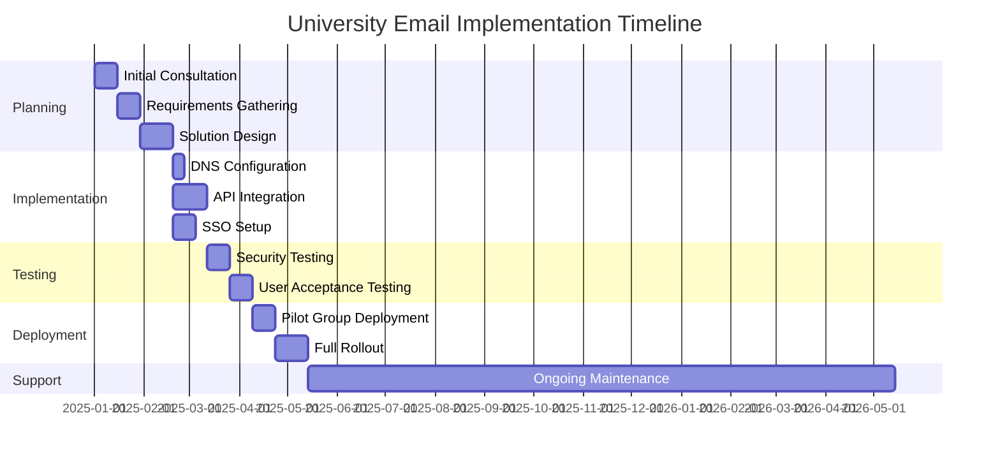
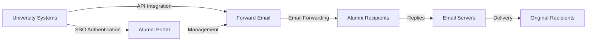

# Case Study: Hoe Forward Email e-mailoplossingen voor alumni van topuniversiteiten mogelijk maakt {#case-study-how-forward-email-powers-alumni-email-solutions-for-top-universities}


## Inhoudsopgave {#table-of-contents}

* [Voorwoord](#foreword)
* [Dramatische kostenbesparingen met stabiele prijzen](#dramatic-cost-savings-with-stable-pricing)
  * [Echte universiteitsbesparingen](#real-world-university-savings)
* [De e-mailuitdaging voor alumni van de universiteit](#the-university-alumni-email-challenge)
  * [De waarde van e-mailidentiteit voor alumni](#the-value-of-alumni-email-identity)
  * [Traditionele oplossingen schieten tekort](#traditional-solutions-fall-short)
  * [De Forward Email-oplossing](#the-forward-email-solution)
* [Technische implementatie: hoe het werkt](#technical-implementation-how-it-works)
  * [Kernarchitectuur](#core-architecture)
  * [Integratie met universitaire systemen](#integration-with-university-systems)
  * [API-gestuurd beheer](#api-driven-management)
  * [DNS-configuratie en -verificatie](#dns-configuration-and-verification)
  * [Testen en kwaliteitsborging](#testing-and-quality-assurance)
* [Implementatietijdlijn](#implementation-timeline)
* [Implementatieproces: van migratie tot onderhoud](#implementation-process-from-migration-to-maintenance)
  * [Eerste beoordeling en planning](#initial-assessment-and-planning)
  * [Migratiestrategie](#migration-strategy)
  * [Technische installatie en configuratie](#technical-setup-and-configuration)
  * [Gebruikerservaringsontwerp](#user-experience-design)
  * [Training en documentatie](#training-and-documentation)
  * [Doorlopende ondersteuning en optimalisatie](#ongoing-support-and-optimization)
* [Casestudy: Universiteit van Cambridge](#case-study-university-of-cambridge)
  * [Uitdaging](#challenge)
  * [Oplossing](#solution)
  * [Resultaten](#results)
* [Voordelen voor universiteiten en alumni](#benefits-for-universities-and-alumni)
  * [Voor universiteiten](#for-universities)
  * [Voor alumni](#for-alumni)
  * [Adoptiepercentages onder alumni](#adoption-rates-among-alumni)
  * [Kostenbesparingen vergeleken met eerdere oplossingen](#cost-savings-compared-to-previous-solutions)
* [Beveiligings- en privacyoverwegingen](#security-and-privacy-considerations)
  * [Gegevensbeschermingsmaatregelen](#data-protection-measures)
  * [Compliance-kader](#compliance-framework)
* [Toekomstige ontwikkelingen](#future-developments)
* [Conclusie](#conclusion)

## Voorwoord {#foreword}

Wij hebben de veiligste, meest privé en flexibele e-maildoorstuurservice ter wereld ontwikkeld voor prestigieuze universiteiten en hun alumni.

In het competitieve landschap van het hoger onderwijs is het onderhouden van levenslange banden met alumni niet alleen een kwestie van traditie, maar ook een strategische noodzaak. Een van de meest tastbare manieren waarop universiteiten deze banden bevorderen, is via e-mailadressen van alumni. Zo krijgen afgestudeerden een digitale identiteit die hun academische erfgoed weerspiegelt.

Bij Forward Email werken we samen met enkele van 's werelds meest prestigieuze onderwijsinstellingen om de manier waarop ze e-maildiensten voor alumni beheren te revolutioneren. Onze professionele e-mailforwardingoplossing ondersteunt nu de e-mailsystemen voor alumni van [Universiteit van Cambridge](https://en.wikipedia.org/wiki/University_of_Cambridge), [Universiteit van Maryland](https://en.wikipedia.org/wiki/University_of_Maryland,\_College_Park), [Tufts Universiteit](https://en.wikipedia.org/wiki/Tufts_University) en [Swarthmore College](https://en.wikipedia.org/wiki/Swarthmore_College), die samen duizenden alumni wereldwijd bedienen.

In deze blogpost onderzoeken we hoe onze privacygerichte e-maildoorstuurservice [open source](https://en.wikipedia.org/wiki/Open-source_software) de voorkeursoplossing is geworden voor deze instellingen, de technische implementaties die dit mogelijk maken en de transformerende impact die het heeft gehad op zowel de administratieve efficiëntie als de tevredenheid van alumni.

## Dramatische kostenbesparingen met stabiele prijzen {#dramatic-cost-savings-with-stable-pricing}

De financiële voordelen van onze oplossing zijn aanzienlijk, vooral in vergelijking met de voortdurend stijgende prijzen van traditionele e-mailproviders:

| Oplossing | Kosten per alumnus (jaarlijks) | Kosten voor 100.000 alumni | Recente prijsverhogingen |
| ------------------------------ | --------------------------------------------------------------------------------------------------------- | ----------------------- | ---------------------------------------------------------------------------------------------------------------------------------------------------------------------------------------- |
| Google Workspace voor Bedrijven | $72 | $7,200,000 | • 2019: G Suite Basic van $ 5 naar $ 6 per maand (+20%)<br>• 2023: Flexibele abonnementen met 20% gestegen<br>• 2025: Business Plus van $ 18 naar $ 26,40 per maand (+47%) met AI-functies |
| Google Workspace voor Onderwijs | Gratis (Education Fundamentals)<br>$3/student/jaar (Education Standard)<br>$5/student/jaar (Education Plus) | Gratis - $500.000 | • Volumekortingen: 5% voor 100-499 licenties<br>• Volumekortingen: 10% voor 500+ licenties<br>• Gratis abonnement beperkt tot kernservices |
| Microsoft 365 Zakelijk | $60 | $6,000,000 | • 2023: Tweemaal per jaar prijsupdates geïntroduceerd<br>• 2025 (januari): Persoonlijk van $ 6,99 naar $ 9,99/maand (+43%) met Copilot AI<br>• 2025 (april): 5% stijging op de jaarlijkse verplichtingen die maandelijks worden betaald |
| Microsoft 365 Onderwijs | Gratis (A1)<br>$38-55/faculteit/jaar (A3)<br>$65-96/faculteit/jaar (A5) | Gratis - $96.000 | • Studentenlicenties zijn vaak inbegrepen bij aankopen door docenten<br>• Aangepaste prijzen via volumelicenties<br>• Gratis abonnement is beperkt tot webversies |
| Zelf-gehoste Exchange | $45 | $4,500,000 | De kosten voor doorlopend onderhoud en beveiliging blijven stijgen |
| **E-mail doorsturen naar Enterprise** | **Vast $250/maand** | **$3.000/jaar** | **Geen prijsverhogingen sinds de lancering** |

### Echte besparingen op de universiteit {#real-world-university-savings}

Dit is hoeveel onze partneruniversiteiten jaarlijks besparen als ze voor Forward Email kiezen in plaats van traditionele aanbieders:

| Universiteit | Alumni-aantal | Jaarlijkse kosten met Google | Jaarlijkse kosten met doorstuur-e-mail | Jaarlijkse besparingen |
| ----------------------- | ------------ | ----------------------- | ------------------------------ | -------------- |
| Universiteit van Cambridge | 30,000 | $90,000 | $3,000 | $87,000 |
| Swarthmore College | 5,000 | $15,000 | $3,000 | $12,000 |
| Tufts Universiteit | 12,000 | $36,000 | $3,000 | $33,000 |
| Universiteit van Maryland | 25,000 | $75,000 | $3,000 | $72,000 |

> \[!NOTE]
> Forward Email Enterprise kost doorgaans slechts $ 250 per maand, zonder extra kosten per gebruiker, met toegestane API-limieten en de enige extra kosten zijn opslag als je extra GB/TB nodig hebt voor studenten (+$ 3 per 10 GB extra opslag). We gebruiken ook NVMe SSD-schijven voor snelle ondersteuning van IMAP/POP3/SMTP/CalDAV/CardDAV.

> \[!IMPORTANT]
> In tegenstelling tot Google en Microsoft, die hun prijzen herhaaldelijk hebben verhoogd en tegelijkertijd AI-functies hebben geïntegreerd die je data analyseren, hanteert Forward Email stabiele prijzen met een strikte focus op privacy. We gebruiken geen AI, volgen geen gebruikspatronen en slaan geen logs of e-mails op schijf op (alle verwerking vindt in het geheugen plaats), waardoor volledige privacy voor je alumni-communicatie is gegarandeerd.

Dit vertegenwoordigt een aanzienlijke kostenbesparing ten opzichte van traditionele e-mailhostingoplossingen – geld dat universiteiten kunnen omzetten naar beurzen, onderzoek of andere bedrijfskritische activiteiten. Volgens een analyse uit 2023 van Email Vendor Selection zijn onderwijsinstellingen steeds vaker op zoek naar kosteneffectieve alternatieven voor traditionele e-mailproviders, aangezien de prijzen blijven stijgen door de integratie van AI-functies ([E-mailleverancierselectie, 2023](https://www.emailvendorselection.com/email-service-provider-list/)).

## De e-mailuitdaging voor alumni van de universiteit {#the-university-alumni-email-challenge}

Voor universiteiten brengt het verstrekken van levenslange e-mailadressen aan alumni een unieke reeks uitdagingen met zich mee die traditionele e-mailoplossingen moeilijk effectief kunnen aanpakken. Zoals opgemerkt in een uitgebreide discussie op ServerFault, hebben universiteiten met een grote gebruikersbasis behoefte aan gespecialiseerde e-mailoplossingen die prestaties, beveiliging en kosteneffectiviteit in evenwicht houden ([ServerFault, 2009](https://serverfault.com/questions/97364/what-is-the-best-mail-server-for-a-university-with-a-large-amount-of-users)).

### De waarde van alumni-e-mailidentiteit {#the-value-of-alumni-email-identity}

Alumni-e-mailadressen (zoals `firstname.lastname@cl.cam.ac.uk` of `username@terpalum.umd.edu`) vervullen meerdere belangrijke functies:

* Het onderhouden van de institutionele connectie en merkidentiteit
* Het faciliteren van continue communicatie met de universiteit
* Het vergroten van de professionele geloofwaardigheid van afgestudeerden
* Het ondersteunen van alumni-netwerken en community-building
* Het bieden van een stabiel, permanent aanspreekpunt

Uit onderzoek van Tekade (2020) blijkt dat educatieve e-mailadressen alumni veel voordelen bieden, waaronder toegang tot academische bronnen, professionele geloofwaardigheid en exclusieve kortingen op verschillende diensten ([Gemiddeld, 2020](https://medium.com/coders-capsule/top-20-benefits-of-having-an-educational-email-address-91a09795e05)).

> \[!TIP]
> Bezoek onze nieuwe [AlumniEmail.com](https://alumniemail.com)-directory voor een uitgebreide bron over e-maildiensten voor alumni van de universiteit, inclusief installatiehandleidingen, best practices en een doorzoekbare directory van e-maildomeinen voor alumni. Deze directory dient als centrale hub voor alle e-mailinformatie voor alumni.

### Traditionele oplossingen schieten tekort {#traditional-solutions-fall-short}

Conventionele e-mailsystemen kennen een aantal beperkingen als ze worden toegepast op de e-mailbehoeften van alumni:

* **Te duur**: Licentiemodellen per gebruiker worden financieel onhoudbaar voor grote alumni-bases
* **Administratieve last**: Het beheer van duizenden of miljoenen accounts vereist aanzienlijke IT-middelen
* **Beveiligingsproblemen**: Het handhaven van de beveiliging van inactieve accounts verhoogt de kwetsbaarheid
* **Beperkte flexibiliteit**: Rigide systemen kunnen zich niet aanpassen aan de unieke behoeften van het doorsturen van e-mails van alumni
* **Privacyproblemen**: Veel providers scannen e-mailinhoud voor reclamedoeleinden

Uit een Quora-discussie over het beheer van e-mailadressen van universiteiten blijkt dat zorgen over de beveiliging een belangrijke reden zijn waarom universiteiten e-mailadressen van alumni beperken of annuleren, omdat ongebruikte accounts kwetsbaar kunnen zijn voor hacking en identiteitsdiefstal ([Quora, 2011](https://www.quora.com/Is-there-any-cost-for-a-college-or-university-to-maintain-edu-e-mail-addresses)).

### De oplossing voor het doorsturen van e-mails {#the-forward-email-solution}

Onze aanpak pakt deze uitdagingen aan met een fundamenteel ander model:

* E-mail doorsturen in plaats van hosting
* Vaste prijs in plaats van kosten per gebruiker
* Open-sourcearchitectuur voor transparantie en beveiliging
* Privacy-eerst ontwerp zonder contentscanning
* Gespecialiseerde functies voor universitair identiteitsbeheer

## Technische implementatie: hoe het werkt {#technical-implementation-how-it-works}

Onze oplossing maakt gebruik van een geavanceerde, maar toch elegant eenvoudige technische architectuur om betrouwbare, veilige e-maildoorsturing op grote schaal te leveren.

### Kernarchitectuur {#core-architecture}

Het Forward Email-systeem bestaat uit verschillende hoofdonderdelen:

* Gedistribueerde MX-servers voor hoge beschikbaarheid
* Realtime doorsturen zonder berichtenopslag
* Uitgebreide e-mailauthenticatie
* Ondersteuning voor aangepaste domeinen en subdomeinen
* API-gestuurd accountbeheer

Volgens IT-professionals op ServerFault wordt Postfix aanbevolen als de beste Mail Transfer Agent (MTA) voor universiteiten die hun eigen e-mailoplossingen willen implementeren, terwijl Courier of Dovecot de voorkeur genieten voor IMAP/POP3-toegang ([ServerFault, 2009](https://serverfault.com/questions/97364/what-is-the-best-mail-server-for-a-university-with-a-large-amount-of-users)). Onze oplossing maakt het echter voor universiteiten overbodig om deze complexe systemen zelf te beheren.

### Integratie met universitaire systemen {#integration-with-university-systems}

We hebben naadloze integratiepaden ontwikkeld met de bestaande universitaire infrastructuur:

* Geautomatiseerde provisioning via [RESTful API](https://forwardemail.net/email-api)-integratie
* Aangepaste brandingopties voor universiteitsportals
* Flexibel aliasbeheer voor afdelingen en organisaties
* Batchbewerkingen voor efficiënt beheer

### API-gestuurd beheer {#api-driven-management}

Met onze [RESTful API](https://forwardemail.net/email-api) kunnen universiteiten hun e-mailbeheer automatiseren:

```javascript
// Example: Creating a new alumni email address
const response = await fetch('https://forwardemail.net/api/v1/domains/example.edu/aliases', {
  method: 'POST',
  headers: {
    'Content-Type': 'application/json',
    'Authorization': `Basic ${Buffer.from(YOUR_API_TOKEN + ":").toString('base64')}`
  },
  body: JSON.stringify({
    name: 'alumni.john.smith',
    recipients: ['johnsmith@gmail.com'],
    has_recipient_verification: true
  })
});
```

### DNS-configuratie en verificatie {#dns-configuration-and-verification}

Een goede DNS-configuratie is cruciaal voor e-mailbezorging. Ons team helpt u met:

* [DNS](https://en.wikipedia.org/wiki/Domain_Name_System) configuratie inclusief MX-records
* Uitgebreide implementatie van e-mailbeveiliging met behulp van ons open-source [mailauth](https://www.npmjs.com/package/mailauth)-pakket, een Zwitsers zakmes voor e-mailauthenticatie dat het volgende afhandelt:
* [SPF](https://en.wikipedia.org/wiki/Sender_Policy_Framework) (Sender Policy Framework) om e-mailspoofing te voorkomen
* [DKIM](https://en.wikipedia.org/wiki/DomainKeys_Identified_Mail) (DomainKeys Identified Mail) voor e-mailauthenticatie
* [DMARC](https://en.wikipedia.org/wiki/Email_authentication) (Domain-based Message Authentication, Reporting & Conformance) voor beleidshandhaving
* [MTA-STS](https://en.wikipedia.org/wiki/Opportunistic_TLS) (SMTP MTA Strict Transport Security) om TLS-encryptie af te dwingen
* [ARC](https://en.wikipedia.org/wiki/DomainKeys_Identified_Mail#Authenticated_Received_Chain) (Authenticated Received Chain) om authenticatie te behouden wanneer berichten worden doorgestuurd
* [SRS](https://en.wikipedia.org/wiki/Sender_Rewriting_Scheme) (Sender Rewriting Scheme) om SPF-validatie te behouden tijdens het doorsturen
* [BIMI](https://en.wikipedia.org/wiki/Email_authentication) (Brand Indicators for Message Identification) voor logoweergave in Ondersteunende e-mailclients
* DNS TXT-recordverificatie voor domeineigendom

Het `mailauth`-pakket (<http://npmjs.com/package/mailauth>) is de volledig open-sourceoplossing die alle aspecten van e-mailauthenticatie in één geïntegreerde bibliotheek afhandelt. In tegenstelling tot propriëtaire oplossingen garandeert deze aanpak transparantie, regelmatige beveiligingsupdates en volledige controle over het e-mailauthenticatieproces.

### Testen en kwaliteitsborging {#testing-and-quality-assurance}

Voordat we volledig implementeren, voeren we strenge tests uit:

* End-to-end testen van e-mailbezorging
* Loadtests voor scenario's met een hoog volume
* Penetratietesten voor beveiliging
* Validatie van API-integratie
* Gebruikersacceptatietests met alumnivertegenwoordigers

## Implementatietijdlijn {#implementation-timeline}



## Implementatieproces: van migratie tot onderhoud {#implementation-process-from-migration-to-maintenance}

Ons gestructureerde implementatieproces zorgt ervoor dat de overgang voor universiteiten die onze oplossing implementeren, soepel verloopt.

### Eerste beoordeling en planning {#initial-assessment-and-planning}

We beginnen met een uitgebreide beoordeling van het huidige e-mailsysteem, de alumnidatabase en de technische vereisten van de universiteit. Deze fase omvat:

* Interviews met stakeholders, IT, alumni-relaties en administratie
* Technische audit van de bestaande e-mailinfrastructuur
* Datamapping voor alumni-dossiers
* Beveiligings- en compliance-evaluatie
* Projecttijdlijn en mijlpalenontwikkeling

### Migratiestrategie {#migration-strategy}

Op basis van de beoordeling ontwikkelen we een op maat gemaakte migratiestrategie die de verstoring minimaliseert en tegelijkertijd de volledige integriteit van de gegevens garandeert:

* Gefaseerde migratieaanpak per alumnicohort
* Parallelle systeemwerking tijdens de overgang
* Uitgebreide protocollen voor gegevensvalidatie
* Terugvalprocedures voor eventuele migratieproblemen
* Duidelijk communicatieplan voor alle belanghebbenden

### Technische installatie en configuratie {#technical-setup-and-configuration}

Ons technische team verzorgt alle aspecten van de systeeminstallatie:

* DNS-configuratie en -verificatie
* API-integratie met universiteitssystemen
* Ontwikkeling van een portal op maat met de huisstijl van de universiteit
* Instellen van e-mailauthenticatie (SPF, DKIM, DMARC)

### Gebruikerservaringsontwerp {#user-experience-design}

We werken nauw samen met universiteiten om intuïtieve interfaces te creëren voor zowel beheerders als alumni:

* Alumni-e-mailportals met een eigen huisstijl
* Vereenvoudigd beheer van e-maildoorsturing
* Mobielvriendelijke ontwerpen
* Toegankelijkheidsnaleving
* Meertalige ondersteuning waar nodig

### Training en documentatie {#training-and-documentation}

Een uitgebreide training zorgt ervoor dat alle belanghebbenden het systeem effectief kunnen gebruiken:

* Trainingen voor beheerders
* Technische documentatie voor IT-personeel
* Gebruikershandleidingen voor alumni
* Videotutorials voor veelvoorkomende taken
* Ontwikkeling van een kennisbank

### Doorlopende ondersteuning en optimalisatie {#ongoing-support-and-optimization}

Ons partnerschap gaat veel verder dan de implementatie:

* 24/7 technische ondersteuning
* Regelmatige systeemupdates en beveiligingspatches
* Prestatiebewaking en -optimalisatie
* Advies over best practices voor e-mail
* Data-analyse en rapportage

## Casestudy: Universiteit van Cambridge {#case-study-university-of-cambridge}

De Universiteit van Cambridge zocht naar een oplossing om @cam.ac.uk-e-mailadressen aan alumni te verstrekken en tegelijkertijd de IT-overhead en -kosten te verlagen.

### Uitdaging {#challenge}

Cambridge ondervond verschillende uitdagingen met hun vorige alumni-e-mailsysteem:

* Hoge operationele kosten voor het onderhouden van een aparte e-mailinfrastructuur
* Administratieve last van het beheer van duizenden accounts
* Beveiligingsproblemen met inactieve accounts
* Beperkte integratie met alumni-databasesystemen
* Toenemende opslagvereisten

### Oplossing {#solution}

Forward Email implementeerde een uitgebreide oplossing:

* E-maildoorsturen voor alle alumni-adressen van @cam.ac.uk
* Portaal met eigen huisstijl voor selfservice voor alumni
* API-integratie met de alumni-database van Cambridge
* Uitgebreide implementatie van e-mailbeveiliging

### Resultaten {#results}

De implementatie leverde aanzienlijke voordelen op:

* Aanzienlijke kostenbesparing ten opzichte van de vorige oplossing
* 99,9% betrouwbaarheid van e-mailbezorging
* Vereenvoudigd beheer door automatisering
* Verbeterde beveiliging met moderne e-mailauthenticatie
* Positieve feedback van alumni over de bruikbaarheid van het systeem

## Voordelen voor universiteiten en alumni {#benefits-for-universities-and-alumni}

Onze oplossing levert tastbare voordelen op voor zowel instellingen als hun afgestudeerden.

### Voor universiteiten {#for-universities}

* **Kostenefficiëntie**: Vaste prijs, ongeacht het aantal alumni
* **Administratieve eenvoud**: Geautomatiseerd beheer via API
* **Verbeterde beveiliging**: Uitgebreide e-mailauthenticatie
* **Merkconsistentie**: Levenslange institutionele e-mailadressen
* **Alumni-betrokkenheid**: Versterkte banden door continue service

Volgens BulkSignature (2023) bieden e-mailplatforms voor onderwijsinstellingen aanzienlijke voordelen, waaronder kosteneffectiviteit dankzij gratis of goedkope abonnementen, tijdsefficiëntie dankzij mogelijkheden voor massacommunicatie en trackingfuncties om de bezorging van e-mails en de betrokkenheid daarbij te controleren ([BulkSignature, 2023](https://bulksignature.com/blog/5-best-email-platforms-for-educational-institutions/)).

### Voor alumni {#for-alumni}

* **Professionele identiteit**: Prestigieus universitair e-mailadres
* **E-mailcontinuïteit**: Doorsturen naar elk persoonlijk e-mailadres
* **Privacybescherming**: Geen contentscanning of datamining
* **Vereenvoudigd beheer**: Eenvoudige updates voor ontvangers
* **Verbeterde beveiliging**: Moderne e-mailauthenticatie

Onderzoek van het International Journal of Education & Literacy Studies benadrukt het belang van goede e-mailcommunicatie in academische settings. E-mailvaardigheden zijn volgens hen een cruciale vaardigheid voor zowel studenten als alumni in professionele contexten ([IJELS, 2021](https://files.eric.ed.gov/fulltext/EJ1319324.pdf)).

### Adoptiepercentages onder alumni {#adoption-rates-among-alumni}

Universiteiten melden een hoge acceptatiegraad en tevredenheid onder hun alumnigemeenschappen.

### Kostenbesparingen vergeleken met eerdere oplossingen {#cost-savings-compared-to-previous-solutions}

De financiële impact was substantieel: universiteiten meldden aanzienlijke kostenbesparingen vergeleken met hun eerdere e-mailoplossingen.

## Beveiligings- en privacyoverwegingen {#security-and-privacy-considerations}

Voor onderwijsinstellingen is het beschermen van alumnigegevens niet alleen een goede gewoonte; het is vaak een wettelijke verplichting volgens regelgeving zoals de AVG in Europa.

### Gegevensbeschermingsmaatregelen {#data-protection-measures}

Onze oplossing omvat meerdere beveiligingslagen:

* End-to-end encryptie voor al het e-mailverkeer
* Geen opslag van e-mailinhoud op onze servers
* Regelmatige beveiligingsaudits en penetratietests
* Voldoet aan internationale normen voor gegevensbescherming
* Transparante, open-sourcecode voor beveiligingsverificatie

> \[!WARNING]
> Veel e-mailproviders scannen e-mailinhoud voor reclamedoeleinden of om AI-modellen te trainen. Deze praktijk roept ernstige privacyproblemen op, met name bij professionele en academische communicatie. Forward Email scant nooit e-mailinhoud en verwerkt alle e-mails in het geheugen om volledige privacy te garanderen.

### Nalevingskader {#compliance-framework}

Wij houden ons strikt aan de relevante regelgeving:

* AVG-naleving voor Europese instellingen
* SOC 2 Type II-certificering
* Jaarlijkse beveiligingsbeoordelingen
* Gegevensverwerkingsovereenkomst (DPA) beschikbaar op [forwardemail.net/dpa](https://forwardemail.net/dpa)
* Regelmatige nalevingsupdates naarmate de regelgeving evolueert

## Toekomstige ontwikkelingen {#future-developments}

We blijven onze alumni-e-mailoplossing verbeteren met nieuwe functies en mogelijkheden:

* Verbeterde analyses voor universiteitsbeheerders
* Geavanceerde anti-phishingbeveiliging
* Uitgebreide API-mogelijkheden voor diepere integratie
* Extra authenticatieopties

## Conclusie {#conclusion}

Forward Email heeft een revolutie teweeggebracht in de manier waarop universiteiten e-maildiensten voor alumni aanbieden en beheren. Door dure, complexe e-mailhosting te vervangen door elegante, veilige e-mailforwarding, hebben we instellingen in staat gesteld om levenslange e-mailadressen aan te bieden aan alle alumni, terwijl de kosten en administratieve overhead drastisch zijn verlaagd.

Onze partnerschappen met prestigieuze instellingen zoals Cambridge, Maryland, Tufts en Swarthmore tonen de effectiviteit van onze aanpak aan in diverse onderwijsomgevingen. Nu universiteiten steeds meer onder druk staan om alumni-relaties te onderhouden en tegelijkertijd de kosten te beheersen, biedt onze oplossing een aantrekkelijk alternatief voor traditionele e-mailsystemen.



Universiteiten die willen weten hoe Forward Email hun e-maildiensten voor alumni kan transformeren, kunnen contact opnemen met ons team via <support@forwardemail.net> of een bezoek brengen aan [forwardemail.net](https://forwardemail.net) voor meer informatie over onze oplossingen voor bedrijven.