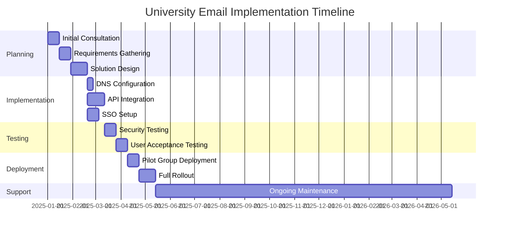
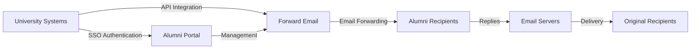

# Case Study: Hoe Forward Email Alumni E-mailoplossingen aandrijft voor Topuniversiteiten {#case-study-how-forward-email-powers-alumni-email-solutions-for-top-universities}


## Inhoudsopgave {#table-of-contents}

* [Voorwoord](#foreword)
* [Dramatische Kostenbesparingen met Stabiele Prijzen](#dramatic-cost-savings-with-stable-pricing)
  * [Besparingen in de Praktijk bij Universiteiten](#real-world-university-savings)
* [De Uitdaging van Alumni E-mail bij Universiteiten](#the-university-alumni-email-challenge)
  * [De Waarde van Alumni E-mailidentiteit](#the-value-of-alumni-email-identity)
  * [Traditionele Oplossingen Schieten Tekort](#traditional-solutions-fall-short)
  * [De Forward Email Oplossing](#the-forward-email-solution)
* [Technische Implementatie: Hoe Het Werkt](#technical-implementation-how-it-works)
  * [Kernarchitectuur](#core-architecture)
  * [Integratie met Universitaire Systemen](#integration-with-university-systems)
  * [API-Gestuurde Beheer](#api-driven-management)
  * [DNS-configuratie en Verificatie](#dns-configuration-and-verification)
  * [Testen en Kwaliteitsborging](#testing-and-quality-assurance)
* [Implementatietijdlijn](#implementation-timeline)
* [Implementatieproces: Van Migratie tot Onderhoud](#implementation-process-from-migration-to-maintenance)
  * [Initiële Beoordeling en Planning](#initial-assessment-and-planning)
  * [Migratiestrategie](#migration-strategy)
  * [Technische Setup en Configuratie](#technical-setup-and-configuration)
  * [Ontwerp van de Gebruikerservaring](#user-experience-design)
  * [Training en Documentatie](#training-and-documentation)
  * [Voortdurende Ondersteuning en Optimalisatie](#ongoing-support-and-optimization)
* [Case Study: University of Cambridge](#case-study-university-of-cambridge)
  * [Uitdaging](#challenge)
  * [Oplossing](#solution)
  * [Resultaten](#results)
* [Voordelen voor Universiteiten en Alumni](#benefits-for-universities-and-alumni)
  * [Voor Universiteiten](#for-universities)
  * [Voor Alumni](#for-alumni)
  * [Adoptiecijfers onder Alumni](#adoption-rates-among-alumni)
  * [Kostenbesparingen Vergeleken met Vorige Oplossingen](#cost-savings-compared-to-previous-solutions)
* [Beveiligings- en Privacyoverwegingen](#security-and-privacy-considerations)
  * [Maatregelen voor Gegevensbescherming](#data-protection-measures)
  * [Compliancekader](#compliance-framework)
* [Toekomstige Ontwikkelingen](#future-developments)
* [Conclusie](#conclusion)


## Voorwoord {#foreword}

We hebben 's werelds meest veilige, private en flexibele e-maildoorstuurservice gebouwd voor prestigieuze universiteiten en hun alumni.

In het competitieve landschap van het hoger onderwijs is het onderhouden van levenslange verbindingen met alumni niet alleen een kwestie van traditie—het is een strategische noodzaak. Een van de meest tastbare manieren waarop universiteiten deze verbindingen bevorderen, is via alumni e-mailadressen, die afgestudeerden een digitale identiteit bieden die hun academische erfgoed weerspiegelt.

Bij Forward Email zijn we een samenwerking aangegaan met enkele van 's werelds meest prestigieuze onderwijsinstellingen om te revolutioneren hoe zij alumni e-mailservices beheren. Onze e-maildoorstuuroplossing van ondernemingsniveau ondersteunt nu de alumni e-mailsystemen van de [University of Cambridge](https://en.wikipedia.org/wiki/University_of_Cambridge), de [University of Maryland](https://en.wikipedia.org/wiki/University_of_Maryland,_College_Park), [Tufts University](https://en.wikipedia.org/wiki/Tufts_University) en [Swarthmore College](https://en.wikipedia.org/wiki/Swarthmore_College), die gezamenlijk duizenden alumni wereldwijd bedienen.

Deze blogpost onderzoekt hoe onze [open-source](https://en.wikipedia.org/wiki/Open-source_software), privacygerichte e-maildoorstuurservice de voorkeursoplossing is geworden voor deze instellingen, de technische implementaties die dit mogelijk maken, en de transformerende impact die het heeft gehad op zowel administratieve efficiëntie als alumni tevredenheid.


## Dramatische Kostenbesparingen met Stabiele Prijzen {#dramatic-cost-savings-with-stable-pricing}
De financiële voordelen van onze oplossing zijn aanzienlijk, vooral in vergelijking met de continu stijgende prijzen van traditionele e-mailproviders:

| Oplossing                     | Kosten per alumnus (jaarlijks)                                                                            | Kosten voor 100.000 alumni | Recente prijsstijgingen                                                                                                                                                                  |
| ------------------------------ | --------------------------------------------------------------------------------------------------------- | -------------------------- | ---------------------------------------------------------------------------------------------------------------------------------------------------------------------------------------- |
| Google Workspace for Business  | $72                                                                                                       | $7.200.000                 | • 2019: G Suite Basic van $5 naar $6/maand (+20%)<br>• 2023: Flexibele plannen verhoogd met 20%<br>• 2025: Business Plus van $18 naar $26,40/maand (+47%) met AI-functies                 |
| Google Workspace for Education | Gratis (Education Fundamentals)<br>$3/student/jaar (Education Standard)<br>$5/student/jaar (Education Plus) | Gratis - $500.000          | • Korting bij volume: 5% voor 100-499 licenties<br>• Korting bij volume: 10% voor 500+ licenties<br>• Gratis laag beperkt tot kernservices                                            |
| Microsoft 365 Business         | $60                                                                                                       | $6.000.000                 | • 2023: Tweejaarlijkse prijsupdates geïntroduceerd<br>• 2025 (jan): Personal van $6,99 naar $9,99/maand (+43%) met Copilot AI<br>• 2025 (apr): 5% verhoging op jaarlijkse abonnementen betaald per maand |
| Microsoft 365 Education        | Gratis (A1)<br>$38-55/faculteit/jaar (A3)<br>$65-96/faculteit/jaar (A5)                                   | Gratis - $96.000           | • Studentenlicenties vaak inbegrepen bij faculteitsaankopen<br>• Maatwerkprijzen via volumelicenties<br>• Gratis laag beperkt tot webversies                                          |
| Zelf-gehoste Exchange          | $45                                                                                                       | $4.500.000                 | Doorlopende onderhouds- en beveiligingskosten blijven stijgen                                                                                                                            |
| **Forward Email Enterprise**   | **Vast $250/maand**                                                                                       | **$3.000/jaar**            | **Geen prijsstijgingen sinds lancering**                                                                                                                                                  |

### Besparingen bij partneruniversiteiten in de praktijk {#real-world-university-savings}

Dit is hoeveel onze partneruniversiteiten jaarlijks besparen door te kiezen voor Forward Email in plaats van traditionele providers:

| Universiteit             | Aantal alumni | Jaarlijkse kosten met Google | Jaarlijkse kosten met Forward Email | Jaarlijkse besparing |
| ----------------------- | ------------- | ---------------------------- | ---------------------------------- | -------------------- |
| University of Cambridge | 30.000        | $90.000                      | $3.000                             | $87.000              |
| Swarthmore College      | 5.000         | $15.000                      | $3.000                             | $12.000              |
| Tufts University        | 12.000        | $36.000                      | $3.000                             | $33.000              |
| University of Maryland  | 25.000        | $75.000                      | $3.000                             | $72.000              |

> \[!NOTE]
> Forward Email enterprise kost doorgaans slechts $250/maand, zonder extra kosten per gebruiker, met whitelisted API-snelheidslimieten, en de enige bijkomende kosten zijn opslag als je extra GB/TB nodig hebt voor studenten (+$3 per 10 GB extra opslag). We gebruiken NVMe SSD-schijven voor snelle ondersteuning van IMAP/POP3/SMTP/CalDAV/CardDAV.
> \[!IMPORTANT]
> In tegenstelling tot Google en Microsoft, die hun prijzen herhaaldelijk hebben verhoogd terwijl ze AI-functies integreren die uw gegevens analyseren, hanteert Forward Email stabiele prijzen met een strikte focus op privacy. Wij gebruiken geen AI, volgen geen gebruikspatronen en slaan geen logs of e-mails op schijf op (alle verwerking gebeurt in het geheugen), wat volledige privacy garandeert voor uw alumni-communicatie.

Dit betekent een aanzienlijke kostenbesparing vergeleken met traditionele e-mailhostingoplossingen—middelen die universiteiten kunnen herbestemmen voor beurzen, onderzoek of andere missie-kritieke activiteiten. Volgens een analyse uit 2023 door Email Vendor Selection zoeken onderwijsinstellingen steeds vaker naar kosteneffectieve alternatieven voor traditionele e-mailproviders nu de prijzen blijven stijgen door de integratie van AI-functies ([Email Vendor Selection, 2023](https://www.emailvendorselection.com/email-service-provider-list/)).


## De Uitdaging van Universitaire Alumni E-mail {#the-university-alumni-email-challenge}

Voor universiteiten brengt het aanbieden van levenslange e-mailadressen aan alumni een unieke reeks uitdagingen met zich mee die traditionele e-mailoplossingen moeilijk effectief kunnen aanpakken. Zoals opgemerkt in een uitgebreide discussie op ServerFault, hebben universiteiten met grote gebruikersaantallen gespecialiseerde e-mailoplossingen nodig die prestaties, beveiliging en kosteneffectiviteit in balans brengen ([ServerFault, 2009](https://serverfault.com/questions/97364/what-is-the-best-mail-server-for-a-university-with-a-large-amount-of-users)).

### De Waarde van Alumni E-mailidentiteit {#the-value-of-alumni-email-identity}

Alumni e-mailadressen (zoals `firstname.lastname@cl.cam.ac.uk` of `username@terpalum.umd.edu`) vervullen meerdere belangrijke functies:

* Het behouden van institutionele verbondenheid en merkidentiteit
* Het faciliteren van voortdurende communicatie met de universiteit
* Het vergroten van professionele geloofwaardigheid voor afgestudeerden
* Het ondersteunen van alumni-netwerken en gemeenschapsvorming
* Het bieden van een stabiel, levenslang contactpunt

Onderzoek door Tekade (2020) benadrukt dat educatieve e-mailadressen talrijke voordelen bieden aan alumni, waaronder toegang tot academische bronnen, professionele geloofwaardigheid en exclusieve kortingen op diverse diensten ([Medium, 2020](https://medium.com/coders-capsule/top-20-benefits-of-having-an-educational-email-address-91a09795e05)).

> \[!TIP]
> Bezoek onze nieuwe [AlumniEmail.com](https://alumniemail.com) directory voor een uitgebreide bron over universitaire alumni e-maildiensten, inclusief installatiehandleidingen, best practices en een doorzoekbare directory van alumni e-maildomeinen. Het dient als een centraal knooppunt voor alle alumni e-mailinformatie.

### Traditionele Oplossingen Schieten Tekort {#traditional-solutions-fall-short}

Conventionele e-mailsystemen kennen verschillende beperkingen wanneer ze worden toegepast op alumni e-mailbehoeften:

* **Kostenbelemmerend**: Licentiemodellen per gebruiker worden financieel onhoudbaar voor grote alumnibases
* **Administratieve Last**: Het beheren van duizenden of miljoenen accounts vereist aanzienlijke IT-middelen
* **Beveiligingszorgen**: Het handhaven van beveiliging voor inactieve accounts verhoogt de kwetsbaarheid
* **Beperkte Flexibiliteit**: Starre systemen kunnen zich niet aanpassen aan de unieke behoeften van alumni e-maildoorsturing
* **Privacyproblemen**: Veel providers scannen e-mailinhoud voor advertentiedoeleinden

Een Quora-discussie over het onderhoud van universitaire e-mail onthult dat beveiligingszorgen een belangrijke reden zijn waarom universiteiten alumni e-mailadressen kunnen beperken of annuleren, omdat ongebruikte accounts kwetsbaar kunnen zijn voor hacking en identiteitsdiefstal ([Quora, 2011](https://www.quora.com/Is-there-any-cost-for-a-college-or-university-to-maintain-edu-e-mail-addresses)).

### De Forward Email Oplossing {#the-forward-email-solution}

Onze aanpak pakt deze uitdagingen aan via een fundamenteel ander model:

* E-maildoorsturing in plaats van hosting
* Vaste prijs in plaats van kosten per gebruiker
* Open-source architectuur voor transparantie en beveiliging
* Privacy-first ontwerp zonder inhoudsscanning
* Gespecialiseerde functies voor universiteitsidentiteitsbeheer


## Technische Implementatie: Hoe Het Werkt {#technical-implementation-how-it-works}
Onze oplossing maakt gebruik van een geavanceerde maar elegant eenvoudige technische architectuur om betrouwbare, veilige e-maildoorsturing op grote schaal te leveren.

### Kernarchitectuur {#core-architecture}

Het Forward Email-systeem bestaat uit verschillende belangrijke componenten:

* Gedistribueerde MX-servers voor hoge beschikbaarheid
* Real-time doorsturing zonder berichtopslag
* Uitgebreide e-mailauthenticatie
* Ondersteuning voor aangepaste domeinen en subdomeinen
* API-gestuurde accountbeheer

Volgens IT-professionals op ServerFault wordt voor universiteiten die hun eigen e-mailoplossingen willen implementeren, Postfix aanbevolen als de beste Mail Transfer Agent (MTA), terwijl Courier of Dovecot de voorkeur genieten voor IMAP/POP3-toegang ([ServerFault, 2009](https://serverfault.com/questions/97364/what-is-the-best-mail-server-for-a-university-with-a-large-amount-of-users)). Onze oplossing elimineert echter de noodzaak voor universiteiten om deze complexe systemen zelf te beheren.

### Integratie met universiteitssystemen {#integration-with-university-systems}

We hebben naadloze integratiepaden ontwikkeld met bestaande universiteitsinfrastructuur:

* Geautomatiseerde provisioning via [RESTful API](https://forwardemail.net/email-api) integratie
* Opties voor aangepaste branding voor universiteitsportalen
* Flexibel aliasbeheer voor afdelingen en organisaties
* Batchbewerkingen voor efficiënte administratie

### API-gestuurd beheer {#api-driven-management}

Onze [RESTful API](https://forwardemail.net/email-api) stelt universiteiten in staat e-mailbeheer te automatiseren:

```javascript
// Voorbeeld: Een nieuw alumni e-mailadres aanmaken
const response = await fetch('https://forwardemail.net/api/v1/domains/example.edu/aliases', {
  method: 'POST',
  headers: {
    'Content-Type': 'application/json',
    'Authorization': `Basic ${Buffer.from(YOUR_API_TOKEN + ":").toString('base64')}`
  },
  body: JSON.stringify({
    name: 'alumni.john.smith',
    recipients: ['johnsmith@gmail.com'],
    has_recipient_verification: true
  })
});
```

### DNS-configuratie en verificatie {#dns-configuration-and-verification}

Een correcte DNS-configuratie is cruciaal voor e-mailbezorging. Ons team helpt met:

* [DNS](https://en.wikipedia.org/wiki/Domain_Name_System) configuratie inclusief MX-records
* Uitgebreide implementatie van e-mailbeveiliging met onze open-source [mailauth](https://www.npmjs.com/package/mailauth) package, een Zwitsers zakmes voor e-mailauthenticatie die afhandelt:
  * [SPF](https://en.wikipedia.org/wiki/Sender_Policy_Framework) (Sender Policy Framework) ter voorkoming van e-mailspoofing
  * [DKIM](https://en.wikipedia.org/wiki/DomainKeys_Identified_Mail) (DomainKeys Identified Mail) voor e-mailauthenticatie
  * [DMARC](https://en.wikipedia.org/wiki/Email_authentication) (Domain-based Message Authentication, Reporting & Conformance) voor beleidsafdwinging
  * [MTA-STS](https://en.wikipedia.org/wiki/Opportunistic_TLS) (SMTP MTA Strict Transport Security) om TLS-encryptie af te dwingen
  * [ARC](https://en.wikipedia.org/wiki/DomainKeys_Identified_Mail#Authenticated_Received_Chain) (Authenticated Received Chain) om authenticatie te behouden wanneer berichten worden doorgestuurd
  * [SRS](https://en.wikipedia.org/wiki/Sender_Rewriting_Scheme) (Sender Rewriting Scheme) om SPF-validatie te behouden bij doorsturing
  * [BIMI](https://en.wikipedia.org/wiki/Email_authentication) (Brand Indicators for Message Identification) voor het tonen van logo’s in ondersteunde e-mailclients
* DNS TXT-record verificatie voor domeineigendom

De `mailauth` package (<http://npmjs.com/package/mailauth>) is de volledig open-source oplossing die alle aspecten van e-mailauthenticatie in één geïntegreerde bibliotheek afhandelt. In tegenstelling tot propriëtaire oplossingen zorgt deze aanpak voor transparantie, regelmatige beveiligingsupdates en volledige controle over het e-mailauthenticatieproces.

### Testen en kwaliteitsborging {#testing-and-quality-assurance}

Voor de volledige uitrol voeren we rigoureuze tests uit:

* End-to-end e-mailbezorgingstests
* Loadtesting voor scenario’s met hoge volumes
* Beveiligingspenetratietests
* Validatie van API-integratie
* Gebruikersacceptatietests met vertegenwoordigers van alumni
## Implementatietijdlijn {#implementation-timeline}


```mermaid
gantt
    title University Email Implementation Timeline
    dateFormat  YYYY-MM-DD
    section Planning
    Initial Consultation           :a1, 2025-01-01, 14d
    Requirements Gathering         :a2, after a1, 14d
    Solution Design                :a3, after a2, 21d
    section Implementation
    DNS Configuration              :b1, after a3, 7d
    API Integration                :b2, after a3, 21d
    SSO Setup                      :b3, after a3, 14d
    section Testing
    Security Testing               :c1, after b1 b2 b3, 14d
    User Acceptance Testing        :c2, after c1, 14d
    section Deployment
    Pilot Group Deployment         :d1, after c2, 14d
    Full Rollout                   :d2, after d1, 21d
    section Support
    Ongoing Maintenance            :e1, after d2, 365d
```


## Implementatieproces: Van Migratie tot Onderhoud {#implementation-process-from-migration-to-maintenance}

Ons gestructureerde implementatieproces zorgt voor een soepele overgang voor universiteiten die onze oplossing adopteren.

### Initiële Beoordeling en Planning {#initial-assessment-and-planning}

We beginnen met een uitgebreide beoordeling van het huidige e-mailsysteem van de universiteit, de alumnidatabase en technische vereisten. Deze fase omvat:

* Interviews met belanghebbenden van IT, alumni-relaties en administratie
* Technische audit van de bestaande e-mailinfrastructuur
* Datamapping voor alumnirecords
* Beoordeling van beveiliging en naleving
* Ontwikkeling van projecttijdlijn en mijlpalen

### Migratiestrategie {#migration-strategy}

Op basis van de beoordeling ontwikkelen we een op maat gemaakte migratiestrategie die verstoring minimaliseert en volledige dataintegriteit waarborgt:

* Gefaseerde migratie per alumnicohort
* Parallelle systeemwerking tijdens de overgang
* Uitgebreide datavalidatieprotocollen
* Terugvalprocedures voor eventuele migratieproblemen
* Duidelijk communicatieplan voor alle belanghebbenden

### Technische Setup en Configuratie {#technical-setup-and-configuration}

Ons technische team verzorgt alle aspecten van de systeemsetup:

* DNS-configuratie en verificatie
* API-integratie met universiteitssystemen
* Ontwikkeling van een aangepast portaal met universiteitsbranding
* E-mailauthenticatie-instelling (SPF, DKIM, DMARC)

### Gebruikerservaring Ontwerp {#user-experience-design}

We werken nauw samen met universiteiten om intuïtieve interfaces te creëren voor zowel beheerders als alumni:

* Op maat gemaakte alumni e-mailportalen met branding
* Vereenvoudigd beheer van e-maildoorsturing
* Mobiel-responsieve ontwerpen
* Toegankelijkheidsconformiteit
* Meertalige ondersteuning waar nodig

### Training en Documentatie {#training-and-documentation}

Uitgebreide training zorgt ervoor dat alle belanghebbenden het systeem effectief kunnen gebruiken:

* Trainingssessies voor beheerders
* Technische documentatie voor IT-personeel
* Gebruikershandleidingen voor alumni
* Videotutorials voor veelvoorkomende taken
* Ontwikkeling van een kennisbank

### Voortdurende Ondersteuning en Optimalisatie {#ongoing-support-and-optimization}

Onze samenwerking gaat ver voorbij de implementatie:

* 24/7 technische ondersteuning
* Regelmatige systeemupdates en beveiligingspatches
* Prestatiemonitoring en optimalisatie
* Advies over e-mail best practices
* Data-analyse en rapportage


## Case Study: Universiteit van Cambridge {#case-study-university-of-cambridge}

De Universiteit van Cambridge zocht een oplossing om @cam.ac.uk e-mailadressen aan alumni te bieden en tegelijkertijd de IT-overhead en kosten te verlagen.

### Uitdaging {#challenge}

Cambridge stond voor verschillende uitdagingen met hun vorige alumnie-mailsysteem:

* Hoge operationele kosten voor het onderhouden van een aparte e-mailinfrastructuur
* Administratieve last van het beheren van duizenden accounts
* Beveiligingszorgen rond inactieve accounts
* Beperkte integratie met alumnidatabasesystemen
* Toenemende opslagvereisten

### Oplossing {#solution}

Forward Email implementeerde een uitgebreide oplossing:

* E-maildoorsturing voor alle @cam.ac.uk alumnie-adressen
* Aangepast portaal met branding voor zelfbediening door alumni
* API-integratie met de alumnidatabase van Cambridge
* Uitgebreide implementatie van e-mailbeveiliging

### Resultaten {#results}

De implementatie leverde aanzienlijke voordelen op:
* Aanzienlijke kostenbesparing vergeleken met de vorige oplossing
* 99,9% betrouwbaarheid van e-mailbezorging
* Vereenvoudigd beheer door automatisering
* Verbeterde beveiliging met moderne e-mailauthenticatie
* Positieve feedback van alumni over gebruiksvriendelijkheid van het systeem


## Voordelen voor Universiteiten en Alumni {#benefits-for-universities-and-alumni}

Onze oplossing levert tastbare voordelen voor zowel instellingen als hun afgestudeerden.

### Voor Universiteiten {#for-universities}

* **Kostenbesparing**: Vaste prijs ongeacht het aantal alumni
* **Administratieve eenvoud**: Geautomatiseerd beheer via API
* **Verbeterde beveiliging**: Uitgebreide e-mailauthenticatie
* **Merkconsistentie**: Levenslange institutionele e-mailadressen
* **Alumni Betrokkenheid**: Versterkte verbindingen door voortdurende service

Volgens BulkSignature (2023) bieden e-mailplatforms voor onderwijsinstellingen aanzienlijke voordelen, waaronder kosteneffectiviteit via gratis of goedkope plannen, tijdbesparing door massacommunicatiemogelijkheden, en trackingfuncties om e-mailbezorging en betrokkenheid te monitoren ([BulkSignature, 2023](https://bulksignature.com/blog/5-best-email-platforms-for-educational-institutions/)).

### Voor Alumni {#for-alumni}

* **Professionele identiteit**: Prestigieus universiteitse-mailadres
* **E-mailcontinuïteit**: Doorsturen naar elk persoonlijk e-mailadres
* **Privacybescherming**: Geen inhoudsscanning of datamining
* **Vereenvoudigd beheer**: Gemakkelijke ontvangerupdates
* **Verbeterde beveiliging**: Moderne e-mailauthenticatie

Onderzoek van het International Journal of Education & Literacy Studies benadrukt het belang van correcte e-mailcommunicatie in academische omgevingen, waarbij e-mailvaardigheid een cruciale vaardigheid is voor zowel studenten als alumni in professionele contexten ([IJELS, 2021](https://files.eric.ed.gov/fulltext/EJ1319324.pdf)).

### Adoptiecijfers onder Alumni {#adoption-rates-among-alumni}

Universiteiten rapporteren hoge adoptie- en tevredenheidspercentages binnen hun alumnigemeenschappen.

### Kostenbesparingen vergeleken met vorige oplossingen {#cost-savings-compared-to-previous-solutions}

De financiële impact is aanzienlijk geweest, waarbij universiteiten aanzienlijke kostenbesparingen melden vergeleken met hun eerdere e-mailoplossingen.


## Beveiligings- en Privacyoverwegingen {#security-and-privacy-considerations}

Voor onderwijsinstellingen is het beschermen van alumnigegevens niet alleen goede praktijk—het is vaak een wettelijke vereiste onder regelgeving zoals de AVG in Europa.

### Maatregelen voor Gegevensbescherming {#data-protection-measures}

Onze oplossing bevat meerdere beveiligingslagen:

* End-to-end encryptie voor al het e-mailverkeer
* Geen opslag van e-mailinhoud op onze servers
* Regelmatige beveiligingsaudits en penetratietests
* Naleving van internationale gegevensbeschermingsnormen
* Transparante, open-source code voor beveiligingsverificatie

> \[!WARNING]
> Veel e-mailproviders scannen e-mailinhoud voor advertentiedoeleinden of om AI-modellen te trainen. Deze praktijk roept ernstige privacyzorgen op, vooral voor professionele en academische communicatie. Forward Email scant nooit e-mailinhoud en verwerkt alle e-mails in het geheugen om volledige privacy te waarborgen.

### Nalevingskader {#compliance-framework}

Wij handhaven strikte naleving van relevante regelgeving:

* AVG-naleving voor Europese instellingen
* SOC 2 Type II certificering
* Jaarlijkse beveiligingsbeoordelingen
* Verwerkersovereenkomst (DPA) beschikbaar op [forwardemail.net/dpa](https://forwardemail.net/dpa)
* Regelmatige updates van naleving naarmate regelgeving evolueert


## Toekomstige Ontwikkelingen {#future-developments}

We blijven onze alumni-e-mailoplossing verbeteren met nieuwe functies en mogelijkheden:

* Verbeterde analytics voor universiteitsbeheerders
* Geavanceerde anti-phishingbescherming
* Uitgebreide API-mogelijkheden voor diepere integratie
* Extra authenticatieopties


## Conclusie {#conclusion}

Forward Email heeft de manier waarop universiteiten alumni-e-maildiensten aanbieden en beheren gerevolutioneerd. Door dure, complexe e-mailhosting te vervangen door elegante, veilige e-maildoorsturing, hebben we instellingen in staat gesteld levenslange e-mailadressen aan alle alumni te bieden, terwijl de kosten en administratieve lasten drastisch zijn verminderd.
Onze samenwerkingen met prestigieuze instellingen zoals Cambridge, Maryland, Tufts en Swarthmore tonen de effectiviteit van onze aanpak in diverse onderwijsomgevingen aan. Nu universiteiten onder toenemende druk staan om contact met alumni te onderhouden en tegelijkertijd de kosten te beheersen, biedt onze oplossing een overtuigend alternatief voor traditionele e-mailsystemen.


```mermaid
flowchart LR
    A[University Systems] -->|API Integration| B[Forward Email]
    B -->|Email Forwarding| C[Alumni Recipients]
    C -->|Replies| D[Email Servers]
    D -->|Delivery| E[Original Recipients]
    F[Alumni Portal] -->|Management| B
    A -->|SSO Authentication| F
```

Voor universiteiten die geïnteresseerd zijn in hoe Forward Email hun alumni-e-maildiensten kan transformeren, neem contact op met ons team via <support@forwardemail.net> of bezoek [forwardemail.net](https://forwardemail.net) om meer te weten te komen over onze enterprise-oplossingen.
