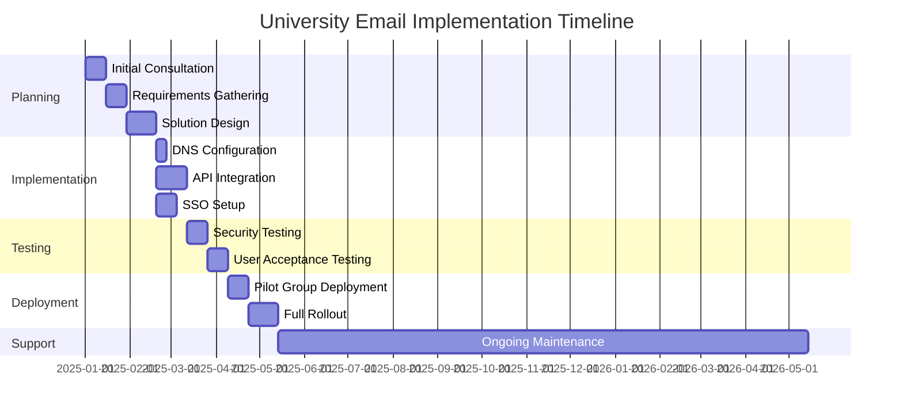
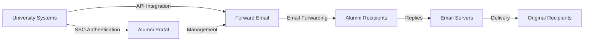

# Casestudie: Hvordan videresendt e-post styrker e-postløsninger for alumni for toppuniversiteter {#case-study-how-forward-email-powers-alumni-email-solutions-for-top-universities}


## Innholdsfortegnelse {#table-of-contents}

* [Forord](#foreword)
* [Dramatiske kostnadsbesparelser med stabil prissetting](#dramatic-cost-savings-with-stable-pricing)
  * [Real-World University Savings](#real-world-university-savings)
* [The University Alumni Email Challenge](#the-university-alumni-email-challenge)
  * [Verdien av alumni-e-postidentitet](#the-value-of-alumni-email-identity)
  * [Tradisjonelle løsninger kommer til kort](#traditional-solutions-fall-short)
  * [Videresend e-postløsning](#the-forward-email-solution)
* [Teknisk implementering: Slik fungerer det](#technical-implementation-how-it-works)
  * [Kjernearkitektur](#core-architecture)
  * [Integrasjon med universitetssystemer](#integration-with-university-systems)
  * [API-drevet ledelse](#api-driven-management)
  * [DNS-konfigurasjon og -verifisering](#dns-configuration-and-verification)
  * [Testing og kvalitetssikring](#testing-and-quality-assurance)
* [Tidslinje for implementering](#implementation-timeline)
* [Implementeringsprosess: Fra migrering til vedlikehold](#implementation-process-from-migration-to-maintenance)
  * [Innledende vurdering og planlegging](#initial-assessment-and-planning)
  * [Migrasjonsstrategi](#migration-strategy)
  * [Teknisk oppsett og konfigurasjon](#technical-setup-and-configuration)
  * [Design for brukeropplevelse](#user-experience-design)
  * [Opplæring og dokumentasjon](#training-and-documentation)
  * [Løpende støtte og optimalisering](#ongoing-support-and-optimization)
* [Kasusstudie: University of Cambridge](#case-study-university-of-cambridge)
  * [Utfordring](#challenge)
  * [Løsning](#solution)
  * [Resultater](#results)
* [Fordeler for universiteter og alumner](#benefits-for-universities-and-alumni)
  * [For universiteter](#for-universities)
  * [For alumni](#for-alumni)
  * [Adopsjonsrater blant alumni](#adoption-rates-among-alumni)
  * [Kostnadsbesparelser sammenlignet med tidligere løsninger](#cost-savings-compared-to-previous-solutions)
* [Sikkerhets- og personvernhensyn](#security-and-privacy-considerations)
  * [Databeskyttelsestiltak](#data-protection-measures)
  * [Samsvarsramme](#compliance-framework)
* [Fremtidig utvikling](#future-developments)
* [Konklusjon](#conclusion)

## Forord {#foreword}

Vi har bygget verdens mest sikre, private og fleksible videresendingstjeneste for prestisjetunge universiteter og deres alumni.

I det konkurransedyktige landskapet til høyere utdanning er det å opprettholde livslange forbindelser med alumni ikke bare et spørsmål om tradisjon - det er et strategisk imperativ. En av de mest håndgripelige måtene universiteter fremmer disse forbindelsene på er gjennom alumni-e-postadresser, som gir nyutdannede en digital identitet som gjenspeiler deres akademiske arv.

Hos Forward Email har vi inngått samarbeid med noen av verdens mest prestisjefylte utdanningsinstitusjoner for å revolusjonere måten de administrerer e-posttjenester for alumni på. Vår løsning for videresending av e-post i bedriftsklassen driver nå e-postsystemene for alumni for [Universitetet i Cambridge](https://en.wikipedia.org/wiki/University_of_Cambridge), [University of Maryland](https://en.wikipedia.org/wiki/University_of_Maryland,\_College_Park), [Tufts University](https://en.wikipedia.org/wiki/Tufts_University) og [Swarthmore College](https://en.wikipedia.org/wiki/Swarthmore_College), som til sammen betjener tusenvis av alumni over hele verden.

Dette blogginnlegget utforsker hvordan vår [åpen kildekode](https://en.wikipedia.org/wiki/Open-source_software) personvernfokuserte tjeneste for videresending av e-post har blitt den foretrukne løsningen for disse institusjonene, de tekniske implementeringene som gjør det mulig, og den transformative effekten den har hatt på både administrativ effektivitet og alumnitilfredshet.

## Dramatiske kostnadsbesparelser med stabile priser {#dramatic-cost-savings-with-stable-pricing}

De økonomiske fordelene med løsningen vår er betydelige, spesielt sammenlignet med de stadig økende prisene til tradisjonelle e-postleverandører:

| Løsning | Kostnad per alumnus (årlig) | Kostnad for 100 000 alumner | Nylige prisøkninger |
| ------------------------------ | --------------------------------------------------------------------------------------------------------- | ----------------------- | ---------------------------------------------------------------------------------------------------------------------------------------------------------------------------------------- |
| Google Workspace for Business | $72 | $7,200,000 | • 2019: G Suite Basic fra 5 dollar til 6 dollar/måned (+20 %)<br>• 2023: Fleksible abonnementer økte med 20 %<br>• 2025: Business Plus fra 18 dollar til 26,40 dollar/måned (+47 %) med AI-funksjoner |
| Google Workspace for Education | Gratis (Education Fundamentals)<br>3 dollar/student/år (Education Standard)<br>5 dollar/student/år (Education Plus) | Gratis - $500 000 | • Volumrabatter: 5 % for 100–499 lisenser<br>• Volumrabatter: 10 % for 500+ lisenser<br>• Gratisnivå begrenset til kjernetjenester |
| Microsoft 365 Business | $60 | $6,000,000 | • 2023: Introduserte prisoppdateringer to ganger i året<br>• 2025 (januar): Personlig fra 6,99 dollar til 9,99 dollar/måned (+43 %) med Copilot AI<br>• 2025 (april): 5 % økning på årlige forpliktelser som betales månedlig |
| Microsoft 365 Education | Gratis (A1)<br>$38–55/fakultet/år (A3)<br>$65–96/fakultet/år (A5) | Gratis - $96 000 | • Studentlisenser er ofte inkludert i kjøp fra fakultetet<br>• Tilpassede priser gjennom volumlisensiering<br>• Gratisnivå begrenset til nettversjoner |
| Self-hosted Exchange | $45 | $4,500,000 | Løpende vedlikeholds- og sikkerhetskostnader fortsetter å øke |
| **Videresend e-post til bedrift** | **Fastpris 250 dollar/måned** | **3000 dollar/år** | **Ingen prisøkninger siden lansering** |

### Sparing på universiteter i den virkelige verden {#real-world-university-savings}

Her er hvor mye partneruniversitetene våre sparer årlig ved å velge Videresend e-post fremfor tradisjonelle leverandører:

| Universitet | Alumnitelling | Årlig kostnad med Google | Årlig kostnad med videresending av e-post | Årlige besparelser |
| ----------------------- | ------------ | ----------------------- | ------------------------------ | -------------- |
| Universitetet i Cambridge | 30,000 | $90,000 | $3,000 | $87,000 |
| Swarthmore College | 5,000 | $15,000 | $3,000 | $12,000 |
| Tufts University | 12,000 | $36,000 | $3,000 | $33,000 |
| University of Maryland | 25,000 | $75,000 | $3,000 | $72,000 |

> \[!NOTE]
> Forward Email enterprise only costs $250/month typically, with no extra cost per user, whitelisted API rate limitations, and the only additional cost is storage if you need additional GB/TB for students (+$3 per 10 GB additional storage). We use NVMe SSD drives for fast support of IMAP/POP3/SMTP/CalDAV/CardDAV as well.

> \[!IMPORTANT]
> Unlike Google and Microsoft, who have repeatedly increased their prices while integrating AI features that analyze your data, Forward Email maintains stable pricing with a strict privacy focus. We don't use AI, don't track usage patterns, and don't store logs or emails to disk (all processing is done in-memory), ensuring complete privacy for your alumni communications.

Dette representerer en betydelig kostnadsreduksjon sammenlignet med tradisjonelle e-posthostingløsninger – midler som universiteter kan omdirigere til stipend, forskning eller andre forretningskritiske aktiviteter. Ifølge en analyse fra 2023 utført av Email Vendor Selection, søker utdanningsinstitusjoner i økende grad kostnadseffektive alternativer til tradisjonelle e-postleverandører ettersom prisene fortsetter å stige med integreringen av AI-funksjoner ([Valg av e-postleverandør, 2023](https://www.emailvendorselection.com/email-service-provider-list/)).

## E-postutfordringen for universitetsalumner {#the-university-alumni-email-challenge}

For universiteter presenterer det å tilby livstids-e-postadresser til alumner en unik utfordring som tradisjonelle e-postløsninger sliter med å håndtere effektivt. Som nevnt i en omfattende diskusjon på ServerFault, krever universiteter med store brukerbaser spesialiserte e-postløsninger som balanserer ytelse, sikkerhet og kostnadseffektivitet ([ServerFault, 2009](https://serverfault.com/questions/97364/what-is-the-best-mail-server-for-a-university-with-a-large-amount-of-users)).

### Verdien av e-postadresse for alumner {#the-value-of-alumni-email-identity}

E-postadresser til alumner (som `firstname.lastname@cl.cam.ac.uk` eller `username@terpalum.umd.edu`) tjener flere viktige funksjoner:

* Opprettholde institusjonell tilknytning og merkeidentitet
* Tilrettelegge for kontinuerlig kommunikasjon med universitetet
* Styrke faglig troverdighet for nyutdannede
* Støtte nettverksbygging og fellesskapsbygging for alumner
* Tilby et stabilt kontaktpunkt for livet

Forskning fra Tekade (2020) fremhever at e-postadresser innen utdanning gir en rekke fordeler for tidligere studenter, inkludert tilgang til akademiske ressurser, faglig troverdighet og eksklusive rabatter på ulike tjenester ([Middels, 2020](https://medium.com/coders-capsule/top-20-benefits-of-having-an-educational-email-address-91a09795e05)).

> \[!TIP]
> Visit our new [AlumniEmail.com](https://alumniemail.com) directory for a comprehensive resource on university alumni email services, including setup guides, best practices, and a searchable directory of alumni email domains. It serves as a central hub for all alumni email information.

### Tradisjonelle løsninger kommer til kort {#traditional-solutions-fall-short}

Konvensjonelle e-postsystemer har flere begrensninger når de brukes på alumni-e-postbehov:

* **Kostnadsmessig uoverkommelig**: Lisensmodeller per bruker blir økonomisk uholdbare for store alumnibaser
* **Administrativ byrde**: Administrering av tusenvis eller millioner av kontoer krever betydelige IT-ressurser
* **Sikkerhetsproblemer**: Opprettholdelse av sikkerhet for sovende kontoer øker sårbarheten
* **Begrenset fleksibilitet**: Stive systemer kan ikke tilpasse seg de unike behovene til videresending av e-post fra alumni
* **Personvernproblemer**: Mange leverandører skanner e-postinnhold for reklameformål

En Quora-diskusjon om vedlikehold av universiteters e-post avslører at sikkerhetsbekymringer er en viktig grunn til at universiteter kan begrense eller kansellere e-postadresser for alumner, ettersom ubrukte kontoer kan være sårbare for hacking og identitetstyveri ([Quora, 2011](https://www.quora.com/Is-there-any-cost-for-a-college-or-university-to-maintain-edu-e-mail-addresses)).

### Løsningen for videresending av e-post {#the-forward-email-solution}

Vår tilnærming adresserer disse utfordringene gjennom en fundamentalt annen modell:

* Videresending av e-post i stedet for hosting
* Fastpris i stedet for kostnader per bruker
* Åpen kildekode-arkitektur for åpenhet og sikkerhet
* Personvernfokusert design uten innholdsskanning
* Spesialiserte funksjoner for identitetshåndtering på universitetet

## Teknisk implementering: Slik fungerer det {#technical-implementation-how-it-works}

Løsningen vår utnytter en sofistikert, men elegant enkel teknisk arkitektur for å levere pålitelig, sikker videresending av e-post i stor skala.

### Kjernearkitektur {#core-architecture}

Videresend e-postsystemet består av flere nøkkelkomponenter:

* Distribuerte MX-servere for høy tilgjengelighet
* Videresending i sanntid uten meldingslagring
* Omfattende e-postautentisering
* Støtte for tilpassede domener og underdomener
* API-drevet kontoadministrasjon

Ifølge IT-eksperter på ServerFault anbefales Postfix som den beste Mail Transfer Agent (MTA) for universiteter som ønsker å implementere sine egne e-postløsninger, mens Courier eller Dovecot foretrekkes for IMAP/POP3-tilgang ([ServerFault, 2009](https://serverfault.com/questions/97364/what-is-the-best-mail-server-for-a-university-with-a-large-amount-of-users)). Løsningen vår eliminerer imidlertid behovet for at universitetene må administrere disse komplekse systemene selv.

### Integrasjon med universitetssystemer {#integration-with-university-systems}

Vi har utviklet sømløse integreringsveier med eksisterende universitetsinfrastruktur:

* Automatisert klargjøring gjennom [RESTful API](https://forwardemail.net/email-api)-integrasjon
* Tilpassede merkevarealternativer for universitetsportaler
* Fleksibel aliasadministrasjon for avdelinger og organisasjoner
* Batchoperasjoner for effektiv administrasjon

### API-drevet administrasjon {#api-driven-management}

Vår [RESTful API](https://forwardemail.net/email-api) lar universiteter automatisere e-posthåndtering:

```javascript
// Example: Creating a new alumni email address
const response = await fetch('https://forwardemail.net/api/v1/domains/example.edu/aliases', {
  method: 'POST',
  headers: {
    'Content-Type': 'application/json',
    'Authorization': `Basic ${Buffer.from(YOUR_API_TOKEN + ":").toString('base64')}`
  },
  body: JSON.stringify({
    name: 'alumni.john.smith',
    recipients: ['johnsmith@gmail.com'],
    has_recipient_verification: true
  })
});
```

### DNS-konfigurasjon og -verifisering {#dns-configuration-and-verification}

Riktig DNS-konfigurasjon er avgjørende for e-postlevering. Vårt team bistår med:

* [DNS](https://en.wikipedia.org/wiki/Domain_Name_System) konfigurasjon inkludert MX-poster
* Omfattende implementering av e-postsikkerhet ved hjelp av vår åpen kildekode-pakke [mailauth](https://www.npmjs.com/package/mailauth), en sveitsisk lommekniv for e-postautentisering som håndterer:
* [SPF](https://en.wikipedia.org/wiki/Sender_Policy_Framework) (Sender Policy Framework) for å forhindre e-postforfalskning
* [DKIM](https://en.wikipedia.org/wiki/DomainKeys_Identified_Mail) (DomainKeys Identified Mail) for e-postautentisering
* [DMARC](https://en.wikipedia.org/wiki/Email_authentication) (Domenebasert meldingsautentisering, rapportering og samsvar) for håndhevelse av retningslinjer
* [MTA-STS](https://en.wikipedia.org/wiki/Opportunistic_TLS) (SMTP MTA Strict Transport Security) for å håndheve TLS-kryptering
* [ARC](https://en.wikipedia.org/wiki/DomainKeys_Identified_Mail#Authenticated_Received_Chain) (Autentisert mottakkjede) for å opprettholde autentisering når meldinger videresendes
* [SRS](https://en.wikipedia.org/wiki/Sender_Rewriting_Scheme) (Sender Rewriting Scheme) for å bevare SPF-validering gjennom videresending
* [BIMI](https://en.wikipedia.org/wiki/Email_authentication) (Merkevareindikatorer) for meldingsidentifikasjon) for logovisning i støttede e-postklienter
* DNS TXT-oppføringsverifisering for domeneeierskap

Pakken `mailauth` (<http://npmjs.com/package/mailauth>) er en fullstendig åpen kildekode-løsning som håndterer alle aspekter ved e-postautentisering i ett integrert bibliotek. I motsetning til proprietære løsninger sikrer denne tilnærmingen åpenhet, regelmessige sikkerhetsoppdateringer og full kontroll over e-postautentiseringsprosessen.

### Testing og kvalitetssikring {#testing-and-quality-assurance}

Før full distribusjon gjennomfører vi strenge tester:

* Ende-til-ende e-postleveringstesting
* Lasttesting for scenarier med høyt volum
* Sikkerhetspenetrasjonstesting
* Validering av API-integrasjon
* Brukeraksepttesting med alumni-representanter

## Implementeringstidslinje {#implementation-timeline}



## Implementeringsprosess: Fra migrering til vedlikehold {#implementation-process-from-migration-to-maintenance}

Vår strukturerte implementeringsprosess sikrer en jevn overgang for universiteter som tar i bruk løsningen vår.

### Innledende vurdering og planlegging {#initial-assessment-and-planning}

Vi begynner med en omfattende vurdering av universitetets nåværende e-postsystem, alumnidatabase og tekniske krav. Denne fasen inkluderer:

* Interessentintervjuer med IT, alumnirelasjoner og administrasjon
* Teknisk revisjon av eksisterende e-postinfrastruktur
* Datakartlegging for alumni-poster
* Gjennomgang av sikkerhet og samsvar
* Prosjektets tidslinje og milepælutvikling

### Migreringsstrategi {#migration-strategy}

Basert på vurderingen utvikler vi en skreddersydd migrasjonsstrategi som minimerer forstyrrelser samtidig som vi sikrer fullstendig dataintegritet:

* Fasebasert migreringstilnærming for alumni-kohorter
* Parallell systemdrift under overgangen
* Omfattende datavalideringsprotokoller
* Reservprosedyrer for eventuelle migreringsproblemer
* Tydelig kommunikasjonsplan for alle interessenter

### Teknisk oppsett og konfigurasjon {#technical-setup-and-configuration}

Vårt tekniske team håndterer alle aspekter av systemoppsett:

* DNS-konfigurasjon og verifisering
* API-integrasjon med universitetssystemer
* Utvikling av tilpassede portaler med universitetsmerkevarebygging
* Oppsett av e-postautentisering (SPF, DKIM, DMARC)

### Brukeropplevelsesdesign {#user-experience-design}

Vi jobber tett med universiteter for å lage intuitive grensesnitt for både administratorer og alumni:

* Tilpassede e-postportaler for alumni
* Forenklet administrasjon av videresending av e-post
* Mobilresponsive design
* Samsvar med tilgjengelighetsregler
* Flerspråklig støtte der det er nødvendig

### Opplæring og dokumentasjon {#training-and-documentation}

Omfattende opplæring sikrer at alle interessenter effektivt kan bruke systemet:

* Administratoropplæring
* Teknisk dokumentasjon for IT-ansatte
* Brukerveiledninger for tidligere studenter
* Videoopplæringsprogrammer for vanlige oppgaver
* Utvikling av kunnskapsbase

### Løpende støtte og optimalisering {#ongoing-support-and-optimization}

Partnerskapet vårt fortsetter langt utover implementeringen:

* Teknisk støtte døgnet rundt
* Regelmessige systemoppdateringer og sikkerhetsoppdateringer
* Ytelsesovervåking og optimalisering
* Konsultasjon om beste praksis for e-post
* Dataanalyse og rapportering

## Case-studie: Universitetet i Cambridge {#case-study-university-of-cambridge}

University of Cambridge søkte en løsning for å gi @cam.ac.uk e-postadresser til alumni og samtidig redusere IT-overhead og kostnader.

### Utfordring {#challenge}

Cambridge møtte flere utfordringer med deres tidligere alumni-e-postsystem:

* Høye driftskostnader for å opprettholde separat e-postinfrastruktur
* Administrativ byrde ved å administrere tusenvis av kontoer
* Sikkerhetsproblemer med inaktive kontoer
* Begrenset integrasjon med alumnidatabasesystemer
* Økende lagringsbehov

### Løsning {#solution}

Forward Email implementerte en omfattende løsning:

* Videresending av e-post for alle @cam.ac.uk alumni-adresser
* Tilpasset portal for selvbetjening av alumni
* API-integrasjon med Cambridges alumni-database
* Omfattende implementering av e-postsikkerhet

### Resultater {#results}

Implementeringen ga betydelige fordeler:

* Betydelig kostnadsreduksjon sammenlignet med tidligere løsning
* 99,9 % pålitelighet for e-postlevering
* Forenklet administrasjon gjennom automatisering
* Forbedret sikkerhet med moderne e-postautentisering
* Positive tilbakemeldinger fra alumni om systemets brukervennlighet

## Fordeler for universiteter og tidligere studenter {#benefits-for-universities-and-alumni}

Vår løsning gir konkrete fordeler for både institusjoner og deres nyutdannede.

### For universiteter {#for-universities}

* **Kostnadseffektivitet**: Fast pris uavhengig av antall alumni
* **Administrativ enkelhet**: Automatisert administrasjon gjennom API
* **Forbedret sikkerhet**: Omfattende e-postautentisering
* **Merkevarekonsistens**: Livstids e-postadresser til institusjonen
* **Alumniengasjement**: Styrkete forbindelser gjennom kontinuerlig tjeneste

Ifølge BulkSignature (2023) tilbyr e-postplattformer for utdanningsinstitusjoner betydelige fordeler, inkludert kostnadseffektivitet gjennom gratis eller lavprisabonnementer, tidseffektivitet gjennom massekommunikasjonsmuligheter og sporingsfunksjoner for å overvåke e-postlevering og engasjement ([BulkSignature, 2023](https://bulksignature.com/blog/5-best-email-platforms-for-educational-institutions/)).

### For tidligere studenter {#for-alumni}

* **Profesjonell identitet**: Prestisjefylt universitets-e-postadresse
* **E-postkontinuitet**: Videresend til enhver personlig e-post
* **Personvern**: Ingen innholdsskanning eller datautvinning
* **Forenklet administrasjon**: Enkle mottakeroppdateringer
* **Forbedret sikkerhet**: Moderne e-postautentisering

Forskning fra International Journal of Education & Literacy Studies fremhever viktigheten av god e-postkommunikasjon i akademiske miljøer, og bemerker at e-postkompetanse er en avgjørende ferdighet for både studenter og tidligere studenter i profesjonelle sammenhenger ([IJELS, 2021](https://files.eric.ed.gov/fulltext/EJ1319324.pdf)).

### Adopsjonsrater blant alumner {#adoption-rates-among-alumni}

Universiteter rapporterer høye adopsjons- og tilfredshetsrater blant sine alumnimiljøer.

### Kostnadsbesparelser sammenlignet med tidligere løsninger {#cost-savings-compared-to-previous-solutions}

Den økonomiske konsekvensen har vært betydelig, og universiteter rapporterer betydelige kostnadsbesparelser sammenlignet med sine tidligere e-postløsninger.

## Sikkerhets- og personvernhensyn {#security-and-privacy-considerations}

For utdanningsinstitusjoner er beskyttelse av alumnidata ikke bare god praksis – det er ofte et lovkrav i henhold til forskrifter som GDPR i Europa.

### Tiltak for databeskyttelse {#data-protection-measures}

Vår løsning inneholder flere lag med sikkerhet:

* Ende-til-ende-kryptering for all e-posttrafikk
* Ingen lagring av e-postinnhold på serverne våre
* Regelmessige sikkerhetsrevisjoner og penetrasjonstester
* Samsvar med internasjonale standarder for databeskyttelse
* Transparent, åpen kildekode for sikkerhetsverifisering

> \[!WARNING]
> Many email providers scan email content for advertising purposes or to train AI models. This practice raises serious privacy concerns, especially for professional and academic communications. Forward Email never scans email content and processes all emails in-memory to ensure complete privacy.

### Samsvarsrammeverk {#compliance-framework}

Vi opprettholder streng overholdelse av relevante forskrifter:

* Samsvar med GDPR for europeiske institusjoner
* SOC 2 Type II-sertifisering
* Årlige sikkerhetsvurderinger
* Databehandleravtale (DPA) tilgjengelig på [forwardemail.net/dpa](https://forwardemail.net/dpa)
* Regelmessige samsvarsoppdateringer etter hvert som regelverket utvikler seg

## Fremtidig utvikling {#future-developments}

Vi fortsetter å forbedre vår alumni-e-postløsning med nye funksjoner og muligheter:

* Forbedret analyse for universitetsadministratorer
* Avansert beskyttelse mot phishing
* Utvidede API-muligheter for dypere integrasjon
* Flere autentiseringsalternativer

## Konklusjon {#conclusion}

Forward Email har revolusjonert hvordan universiteter tilbyr og administrerer alumni-e-posttjenester. Ved å erstatte kostbar, kompleks e-posthosting med elegant, sikker videresending av e-post, har vi gjort det mulig for institusjoner å tilby livslange e-postadresser til alle alumni samtidig som kostnadene og administrative overhead reduseres dramatisk.

Våre partnerskap med prestisjetunge institusjoner som Cambridge, Maryland, Tufts og Swarthmore demonstrerer effektiviteten til vår tilnærming på tvers av ulike utdanningsmiljøer. Ettersom universiteter møter økende press for å opprettholde alumniforbindelser mens de kontrollerer kostnadene, tilbyr løsningen vår et overbevisende alternativ til tradisjonelle e-postsystemer.



Universiteter som er interessert i å utforske hvordan Forward Email kan forvandle e-posttjenestene for alumni, kan kontakte teamet vårt på <support@forwardemail.net> eller besøke [forwardemail.net](https://forwardemail.net) for å lære mer om våre bedriftsløsninger.