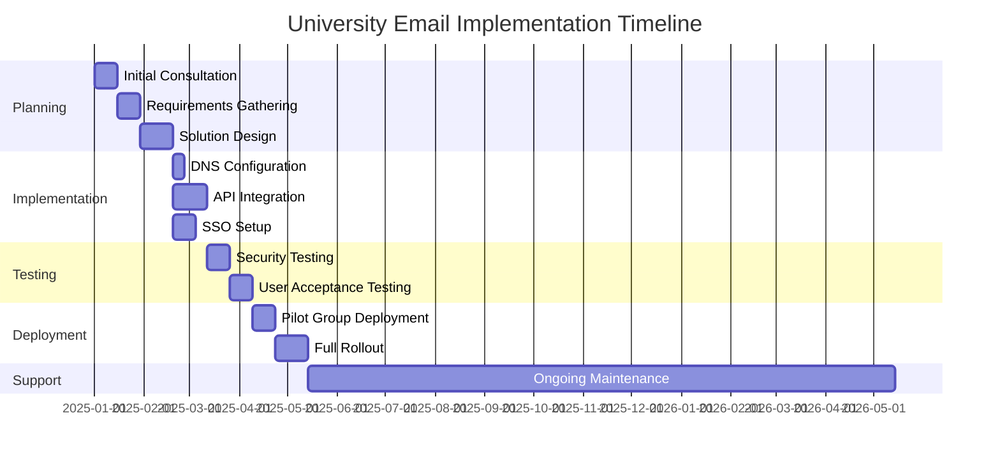
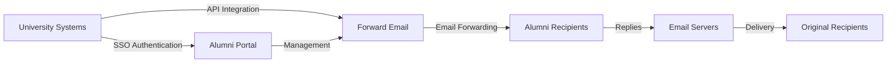

# Case Study: Hvordan Forward Email driver e-postløsninger for alumner ved toppuniversiteter {#case-study-how-forward-email-powers-alumni-email-solutions-for-top-universities}


## Innholdsfortegnelse {#table-of-contents}

* [Forord](#foreword)
* [Dramatiske kostnadsbesparelser med stabil prising](#dramatic-cost-savings-with-stable-pricing)
  * [Reelle besparelser for universiteter](#real-world-university-savings)
* [Utfordringen med e-post for universitetsalumner](#the-university-alumni-email-challenge)
  * [Verdien av alumne-e-postidentitet](#the-value-of-alumni-email-identity)
  * [Tradisjonelle løsninger strekker ikke til](#traditional-solutions-fall-short)
  * [Forward Email-løsningen](#the-forward-email-solution)
* [Teknisk implementering: Slik fungerer det](#technical-implementation-how-it-works)
  * [Kjernearkitektur](#core-architecture)
  * [Integrasjon med universitetssystemer](#integration-with-university-systems)
  * [API-drevet administrasjon](#api-driven-management)
  * [DNS-konfigurasjon og verifisering](#dns-configuration-and-verification)
  * [Testing og kvalitetssikring](#testing-and-quality-assurance)
* [Implementeringstidslinje](#implementation-timeline)
* [Implementeringsprosess: Fra migrering til vedlikehold](#implementation-process-from-migration-to-maintenance)
  * [Innledende vurdering og planlegging](#initial-assessment-and-planning)
  * [Migreringsstrategi](#migration-strategy)
  * [Teknisk oppsett og konfigurasjon](#technical-setup-and-configuration)
  * [Brukeropplevelsesdesign](#user-experience-design)
  * [Opplæring og dokumentasjon](#training-and-documentation)
  * [Løpende støtte og optimalisering](#ongoing-support-and-optimization)
* [Case Study: University of Cambridge](#case-study-university-of-cambridge)
  * [Utfordring](#challenge)
  * [Løsning](#solution)
  * [Resultater](#results)
* [Fordeler for universiteter og alumner](#benefits-for-universities-and-alumni)
  * [For universiteter](#for-universities)
  * [For alumner](#for-alumni)
  * [Adopsjonsrater blant alumner](#adoption-rates-among-alumni)
  * [Kostnadsbesparelser sammenlignet med tidligere løsninger](#cost-savings-compared-to-previous-solutions)
* [Sikkerhets- og personvernhensyn](#security-and-privacy-considerations)
  * [Databeskyttelsestiltak](#data-protection-measures)
  * [Overholdelsesrammeverk](#compliance-framework)
* [Fremtidige utviklinger](#future-developments)
* [Konklusjon](#conclusion)


## Forord {#foreword}

Vi har bygget verdens mest sikre, private og fleksible e-postvideresendingstjeneste for prestisjetunge universiteter og deres alumner.

I det konkurransepregede landskapet innen høyere utdanning er det å opprettholde livslange forbindelser med alumner ikke bare et spørsmål om tradisjon—det er en strategisk nødvendighet. En av de mest håndfaste måtene universiteter styrker disse forbindelsene på, er gjennom alumne-e-postadresser som gir kandidater en digital identitet som reflekterer deres akademiske arv.

Hos Forward Email har vi inngått samarbeid med noen av verdens mest prestisjetunge utdanningsinstitusjoner for å revolusjonere hvordan de administrerer alumne-e-posttjenester. Vår e-postvideresendingsløsning på bedriftsnivå driver nå alumne-e-postsystemene for [University of Cambridge](https://en.wikipedia.org/wiki/University_of_Cambridge), [University of Maryland](https://en.wikipedia.org/wiki/University_of_Maryland,_College_Park), [Tufts University](https://en.wikipedia.org/wiki/Tufts_University) og [Swarthmore College](https://en.wikipedia.org/wiki/Swarthmore_College), som samlet betjener tusenvis av alumner over hele verden.

Dette blogginnlegget utforsker hvordan vår [åpen kildekode](https://en.wikipedia.org/wiki/Open-source_software), personvernfokuserte e-postvideresendingstjeneste har blitt den foretrukne løsningen for disse institusjonene, de tekniske implementeringene som gjør det mulig, og den transformative effekten det har hatt på både administrativ effektivitet og alumne-tilfredshet.


## Dramatiske kostnadsbesparelser med stabil prising {#dramatic-cost-savings-with-stable-pricing}
De økonomiske fordelene med vår løsning er betydelige, spesielt sammenlignet med de kontinuerlig økende prisene hos tradisjonelle e-postleverandører:

| Løsning                       | Kostnad per alumnus (årlig)                                                                             | Kostnad for 100 000 alumni | Nylige prisøkninger                                                                                                                                                                      |
| ------------------------------ | ------------------------------------------------------------------------------------------------------- | -------------------------- | ---------------------------------------------------------------------------------------------------------------------------------------------------------------------------------------- |
| Google Workspace for Business  | $72                                                                                                     | $7 200 000                 | • 2019: G Suite Basic fra $5 til $6/måned (+20%)<br>• 2023: Fleksible planer økte med 20%<br>• 2025: Business Plus fra $18 til $26,40/måned (+47%) med AI-funksjoner                    |
| Google Workspace for Education | Gratis (Education Fundamentals)<br>$3/student/år (Education Standard)<br>$5/student/år (Education Plus) | Gratis - $500 000           | • Volumrabatter: 5 % for 100-499 lisenser<br>• Volumrabatter: 10 % for 500+ lisenser<br>• Gratisnivå begrenset til kjernefunksjoner                                                     |
| Microsoft 365 Business         | $60                                                                                                     | $6 000 000                 | • 2023: Innførte halvårlige prisoppdateringer<br>• 2025 (jan): Personal fra $6,99 til $9,99/måned (+43%) med Copilot AI<br>• 2025 (apr): 5 % økning på årlige forpliktelser betalt månedlig |
| Microsoft 365 Education        | Gratis (A1)<br>$38-55/fakultet/år (A3)<br>$65-96/fakultet/år (A5)                                       | Gratis - $96 000           | • Studentlisenser ofte inkludert ved kjøp for fakultet<br>• Tilpasset prising gjennom volumlisensiering<br>• Gratisnivå begrenset til nettversjoner                                     |
| Selvhostet Exchange            | $45                                                                                                     | $4 500 000                 | Løpende vedlikeholds- og sikkerhetskostnader fortsetter å øke                                                                                                                           |
| **Forward Email Enterprise**   | **Fast $250/måned**                                                                                      | **$3 000/år**              | **Ingen prisøkninger siden lansering**                                                                                                                                                    |

### Faktiske universitetsbesparelser {#real-world-university-savings}

Slik sparer våre partneruniversiteter årlig ved å velge Forward Email fremfor tradisjonelle leverandører:

| Universitet              | Antall alumni | Årlig kostnad med Google | Årlig kostnad med Forward Email | Årlige besparelser |
| ----------------------- | ------------- | ------------------------ | ------------------------------- | ------------------ |
| University of Cambridge | 30 000        | $90 000                  | $3 000                          | $87 000            |
| Swarthmore College      | 5 000         | $15 000                  | $3 000                          | $12 000            |
| Tufts University        | 12 000        | $36 000                  | $3 000                          | $33 000            |
| University of Maryland  | 25 000        | $75 000                  | $3 000                          | $72 000            |

> \[!NOTE]
> Forward Email enterprise koster vanligvis bare $250/måned, uten ekstra kostnad per bruker, hvitelistede API-ratebegrensninger, og den eneste tilleggskostnaden er lagring hvis du trenger ekstra GB/TB for studenter (+$3 per 10 GB ekstra lagring). Vi bruker NVMe SSD-disker for rask støtte av IMAP/POP3/SMTP/CalDAV/CardDAV også.
> \[!IMPORTANT]
> I motsetning til Google og Microsoft, som gjentatte ganger har økt prisene sine samtidig som de integrerer AI-funksjoner som analyserer dataene dine, opprettholder Forward Email stabile priser med et strengt personvernfokus. Vi bruker ikke AI, sporer ikke bruksdata, og lagrer ikke logger eller e-poster på disk (all behandling skjer i minnet), noe som sikrer fullstendig personvern for dine alumnikommunikasjoner.

Dette representerer en betydelig kostnadsreduksjon sammenlignet med tradisjonelle e-postløsninger – midler som universiteter kan omdirigere til stipender, forskning eller andre oppdragskritiske aktiviteter. Ifølge en analyse fra 2023 av Email Vendor Selection søker utdanningsinstitusjoner i økende grad kostnadseffektive alternativer til tradisjonelle e-postleverandører ettersom prisene fortsetter å stige med integreringen av AI-funksjoner ([Email Vendor Selection, 2023](https://www.emailvendorselection.com/email-service-provider-list/)).


## The University Alumni Email Challenge {#the-university-alumni-email-challenge}

For universiteter byr det på unike utfordringer å tilby livslange e-postadresser til alumni, som tradisjonelle e-postløsninger sliter med å håndtere effektivt. Som nevnt i en omfattende diskusjon på ServerFault, krever universiteter med store brukerbaser spesialiserte e-postløsninger som balanserer ytelse, sikkerhet og kostnadseffektivitet ([ServerFault, 2009](https://serverfault.com/questions/97364/what-is-the-best-mail-server-for-a-university-with-a-large-amount-of-users)).

### The Value of Alumni Email Identity {#the-value-of-alumni-email-identity}

Alumni-e-postadresser (som `firstname.lastname@cl.cam.ac.uk` eller `username@terpalum.umd.edu`) tjener flere viktige funksjoner:

* Opprettholde institusjonell tilknytning og merkevareidentitet
* Legge til rette for løpende kommunikasjon med universitetet
* Øke profesjonell troverdighet for kandidater
* Støtte alumninettverk og fellesskapsbygging
* Gi et stabilt, livslangt kontaktpunkt

Forskning av Tekade (2020) fremhever at utdanningsrelaterte e-postadresser gir mange fordeler for alumni, inkludert tilgang til akademiske ressurser, profesjonell troverdighet og eksklusive rabatter på ulike tjenester ([Medium, 2020](https://medium.com/coders-capsule/top-20-benefits-of-having-an-educational-email-address-91a09795e05)).

> \[!TIP]
> Besøk vår nye [AlumniEmail.com](https://alumniemail.com) katalog for en omfattende ressurs om universitetsalumni e-posttjenester, inkludert oppsettsguider, beste praksis og en søkbar katalog over alumni e-postdomener. Den fungerer som et sentralt knutepunkt for all informasjon om alumni e-post.

### Traditional Solutions Fall Short {#traditional-solutions-fall-short}

Konvensjonelle e-postsystemer har flere begrensninger når de brukes til alumni e-postbehov:

* **Kostnadsdrivende**: Lisensmodeller per bruker blir økonomisk uholdbare for store alumnibaser
* **Administrativ byrde**: Håndtering av tusenvis eller millioner av kontoer krever betydelige IT-ressurser
* **Sikkerhetsbekymringer**: Opprettholdelse av sikkerhet for inaktive kontoer øker sårbarheten
* **Begrenset fleksibilitet**: Rigide systemer kan ikke tilpasses de unike behovene for alumni e-postvideresending
* **Personvernproblemer**: Mange leverandører skanner e-postinnhold for reklameformål

En Quora-diskusjon om vedlikehold av universitets-e-post avslører at sikkerhetsbekymringer er en hovedårsak til at universiteter kan begrense eller kansellere alumni-e-postadresser, da ubrukte kontoer kan være sårbare for hacking og identitetstyveri ([Quora, 2011](https://www.quora.com/Is-there-any-cost-for-a-college-or-university-to-maintain-edu-e-mail-addresses)).

### The Forward Email Solution {#the-forward-email-solution}

Vår tilnærming løser disse utfordringene gjennom en fundamentalt annerledes modell:

* E-postvideresending i stedet for hosting
* Fastpris i stedet for kostnad per bruker
* Åpen kildekode-arkitektur for åpenhet og sikkerhet
* Personvern-først design uten innholdsskanning
* Spesialiserte funksjoner for universitetsidentitetsadministrasjon


## Technical Implementation: How It Works {#technical-implementation-how-it-works}
Vår løsning benytter en sofistikert, men elegant enkel teknisk arkitektur for å levere pålitelig, sikker e-postvideresending i stor skala.

### Core Architecture {#core-architecture}

Forward Email-systemet består av flere nøkkelkomponenter:

* Distribuerte MX-servere for høy tilgjengelighet
* Sanntids videresending uten lagring av meldinger
* Omfattende e-postautentisering
* Støtte for egendefinerte domener og underdomener
* API-drevet kontoadministrasjon

Ifølge IT-profesjonelle på ServerFault anbefales Postfix som den beste Mail Transfer Agent (MTA) for universiteter som ønsker å implementere egne e-postløsninger, mens Courier eller Dovecot foretrekkes for IMAP/POP3-tilgang ([ServerFault, 2009](https://serverfault.com/questions/97364/what-is-the-best-mail-server-for-a-university-with-a-large-amount-of-users)). Vår løsning eliminerer imidlertid behovet for at universiteter selv må administrere disse komplekse systemene.

### Integration with University Systems {#integration-with-university-systems}

Vi har utviklet sømløse integrasjonsveier med eksisterende universitetsinfrastruktur:

* Automatisk provisjonering gjennom [RESTful API](https://forwardemail.net/email-api)-integrasjon
* Tilpassede merkevarealternativer for universitetsportaler
* Fleksibel aliasadministrasjon for avdelinger og organisasjoner
* Masseoperasjoner for effektiv administrasjon

### API-Driven Management {#api-driven-management}

Vårt [RESTful API](https://forwardemail.net/email-api) gjør det mulig for universiteter å automatisere e-postadministrasjon:

```javascript
// Eksempel: Opprette en ny alumni e-postadresse
const response = await fetch('https://forwardemail.net/api/v1/domains/example.edu/aliases', {
  method: 'POST',
  headers: {
    'Content-Type': 'application/json',
    'Authorization': `Basic ${Buffer.from(YOUR_API_TOKEN + ":").toString('base64')}`
  },
  body: JSON.stringify({
    name: 'alumni.john.smith',
    recipients: ['johnsmith@gmail.com'],
    has_recipient_verification: true
  })
});
```

### DNS Configuration and Verification {#dns-configuration-and-verification}

Korrekt DNS-konfigurasjon er kritisk for e-postlevering. Vårt team bistår med:

* [DNS](https://en.wikipedia.org/wiki/Domain_Name_System)-konfigurasjon inkludert MX-poster
* Omfattende implementering av e-postsikkerhet ved bruk av vår open-source [mailauth](https://www.npmjs.com/package/mailauth)-pakke, en sveitsisk lommekniv for e-postautentisering som håndterer:
  * [SPF](https://en.wikipedia.org/wiki/Sender_Policy_Framework) (Sender Policy Framework) for å forhindre e-postforfalskning
  * [DKIM](https://en.wikipedia.org/wiki/DomainKeys_Identified_Mail) (DomainKeys Identified Mail) for e-postautentisering
  * [DMARC](https://en.wikipedia.org/wiki/Email_authentication) (Domain-based Message Authentication, Reporting & Conformance) for policyhåndhevelse
  * [MTA-STS](https://en.wikipedia.org/wiki/Opportunistic_TLS) (SMTP MTA Strict Transport Security) for å håndheve TLS-kryptering
  * [ARC](https://en.wikipedia.org/wiki/DomainKeys_Identified_Mail#Authenticated_Received_Chain) (Authenticated Received Chain) for å opprettholde autentisering når meldinger videresendes
  * [SRS](https://en.wikipedia.org/wiki/Sender_Rewriting_Scheme) (Sender Rewriting Scheme) for å bevare SPF-validering gjennom videresending
  * [BIMI](https://en.wikipedia.org/wiki/Email_authentication) (Brand Indicators for Message Identification) for visning av logo i støttede e-postklienter
* Verifisering av DNS TXT-poster for domeneeierskap

`mailauth`-pakken (<http://npmjs.com/package/mailauth>) er den fullstendig open-source løsningen som håndterer alle aspekter av e-postautentisering i ett integrert bibliotek. I motsetning til proprietære løsninger sikrer denne tilnærmingen åpenhet, regelmessige sikkerhetsoppdateringer og full kontroll over e-postautentiseringsprosessen.

### Testing and Quality Assurance {#testing-and-quality-assurance}

Før full utrulling gjennomfører vi grundig testing:

* End-to-end testing av e-postlevering
* Belastningstesting for høyvolumsscenarier
* Sikkerhetspenetrasjonstesting
* Validering av API-integrasjon
* Brukergodkjenningstesting med alumni-representanter
## Implementeringstidslinje {#implementation-timeline}


```mermaid
gantt
    title University Email Implementation Timeline
    dateFormat  YYYY-MM-DD
    section Planning
    Initial Consultation           :a1, 2025-01-01, 14d
    Requirements Gathering         :a2, after a1, 14d
    Solution Design                :a3, after a2, 21d
    section Implementation
    DNS Configuration              :b1, after a3, 7d
    API Integration                :b2, after a3, 21d
    SSO Setup                      :b3, after a3, 14d
    section Testing
    Security Testing               :c1, after b1 b2 b3, 14d
    User Acceptance Testing        :c2, after c1, 14d
    section Deployment
    Pilot Group Deployment         :d1, after c2, 14d
    Full Rollout                   :d2, after d1, 21d
    section Support
    Ongoing Maintenance            :e1, after d2, 365d
```


## Implementeringsprosess: Fra migrering til vedlikehold {#implementation-process-from-migration-to-maintenance}

Vår strukturerte implementeringsprosess sikrer en smidig overgang for universiteter som tar i bruk vår løsning.

### Innledende vurdering og planlegging {#initial-assessment-and-planning}

Vi starter med en omfattende vurdering av universitetets nåværende e-postsystem, alumnidatabase og tekniske krav. Denne fasen inkluderer:

* Interessentintervjuer med IT, alumnirelasjoner og administrasjon
* Teknisk revisjon av eksisterende e-postinfrastruktur
* Datakartlegging for alumniposter
* Sikkerhets- og samsvarsrevisjon
* Utvikling av prosjektplan og milepæler

### Migreringsstrategi {#migration-strategy}

Basert på vurderingen utvikler vi en skreddersydd migreringsstrategi som minimerer forstyrrelser samtidig som full dataintegritet sikres:

* Fasevis migrering etter alumnikohorter
* Parallell drift av systemer under overgangen
* Omfattende datavalideringsprotokoller
* Tilbakefallsprosedyrer ved eventuelle migreringsproblemer
* Klar kommunikasjonsplan for alle interessenter

### Teknisk oppsett og konfigurasjon {#technical-setup-and-configuration}

Vårt tekniske team håndterer alle aspekter ved systemoppsettet:

* DNS-konfigurasjon og verifisering
* API-integrasjon med universitetets systemer
* Tilpasset portalutvikling med universitetsprofil
* Oppsett av e-postautentisering (SPF, DKIM, DMARC)

### Brukeropplevelsesdesign {#user-experience-design}

Vi samarbeider tett med universitetene for å lage intuitive grensesnitt for både administratorer og alumni:

* Tilpassede alumnie-postportaler med universitetsprofil
* Forenklet administrasjon av e-postvideresending
* Mobiltilpassede design
* Tilgjengelighetssamsvar
* Flerspråklig støtte der det er nødvendig

### Opplæring og dokumentasjon {#training-and-documentation}

Omfattende opplæring sikrer at alle interessenter kan bruke systemet effektivt:

* Opplæringsøkter for administratorer
* Teknisk dokumentasjon for IT-personell
* Brukerveiledninger for alumni
* Videotutorials for vanlige oppgaver
* Utvikling av kunnskapsbase

### Løpende støtte og optimalisering {#ongoing-support-and-optimization}

Vårt partnerskap fortsetter lenge etter implementeringen:

* 24/7 teknisk support
* Regelmessige systemoppdateringer og sikkerhetspatcher
* Overvåking og optimalisering av ytelse
* Rådgivning om beste praksis for e-post
* Dataanalyse og rapportering


## Casestudie: University of Cambridge {#case-study-university-of-cambridge}

University of Cambridge søkte en løsning for å tilby @cam.ac.uk e-postadresser til alumni samtidig som IT-kostnader og administrasjon ble redusert.

### Utfordring {#challenge}

Cambridge stod overfor flere utfordringer med sitt tidligere alumnie-postsystem:

* Høye driftskostnader for å opprettholde separat e-postinfrastruktur
* Administrativ byrde ved håndtering av tusenvis av kontoer
* Sikkerhetsbekymringer knyttet til inaktive kontoer
* Begrenset integrasjon med alumnidatabasesystemer
* Økende lagringsbehov

### Løsning {#solution}

Forward Email implementerte en omfattende løsning:

* E-postvideresending for alle @cam.ac.uk alumnadresser
* Tilpasset portal for selvbetjening for alumni
* API-integrasjon med Cambridges alumnidatabase
* Omfattende implementering av e-postsikkerhet

### Resultater {#results}

Implementeringen ga betydelige fordeler:
* Betydelig kostnadsreduksjon sammenlignet med tidligere løsning
* 99,9 % pålitelighet i e-postlevering
* Forenklet administrasjon gjennom automatisering
* Forbedret sikkerhet med moderne e-postautentisering
* Positiv tilbakemelding fra alumni om systemets brukervennlighet


## Fordeler for universiteter og alumni {#benefits-for-universities-and-alumni}

Vår løsning gir konkrete fordeler for både institusjoner og deres kandidater.

### For universiteter {#for-universities}

* **Kostnadseffektivitet**: Fast pris uavhengig av antall alumni
* **Administrativ enkelhet**: Automatisert administrasjon via API
* **Forbedret sikkerhet**: Omfattende e-postautentisering
* **Merkevarekonsistens**: Livslange institusjonelle e-postadresser
* **Alumni-engasjement**: Styrkede forbindelser gjennom kontinuerlig tjeneste

Ifølge BulkSignature (2023) tilbyr e-postplattformer for utdanningsinstitusjoner betydelige fordeler, inkludert kostnadseffektivitet gjennom gratis- eller lavprisplaner, tidsbesparelse gjennom massekommunikasjonsmuligheter, og sporingsfunksjoner for å overvåke e-postlevering og engasjement ([BulkSignature, 2023](https://bulksignature.com/blog/5-best-email-platforms-for-educational-institutions/)).

### For alumni {#for-alumni}

* **Profesjonell identitet**: Prestisjefylt universitets-e-postadresse
* **E-postkontinuitet**: Viderekobling til hvilken som helst personlig e-post
* **Personvern**: Ingen innholdsskanning eller datainnsamling
* **Forenklet administrasjon**: Enkle oppdateringer av mottakere
* **Forbedret sikkerhet**: Moderne e-postautentisering

Forskning fra International Journal of Education & Literacy Studies fremhever viktigheten av korrekt e-postkommunikasjon i akademiske miljøer, og påpeker at e-postkompetanse er en avgjørende ferdighet for både studenter og alumni i profesjonelle sammenhenger ([IJELS, 2021](https://files.eric.ed.gov/fulltext/EJ1319324.pdf)).

### Adopsjonsrater blant alumni {#adoption-rates-among-alumni}

Universiteter rapporterer høye adopsjons- og tilfredshetsrater blant sine alumnimiljøer.

### Kostnadsbesparelser sammenlignet med tidligere løsninger {#cost-savings-compared-to-previous-solutions}

Den økonomiske effekten har vært betydelig, med universiteter som rapporterer store kostnadsbesparelser sammenlignet med deres tidligere e-postløsninger.


## Sikkerhets- og personvernhensyn {#security-and-privacy-considerations}

For utdanningsinstitusjoner er beskyttelse av alumnidata ikke bare god praksis – det er ofte et lovkrav under regelverk som GDPR i Europa.

### Tiltak for databeskyttelse {#data-protection-measures}

Vår løsning inkluderer flere lag med sikkerhet:

* Ende-til-ende-kryptering for all e-posttrafikk
* Ingen lagring av e-postinnhold på våre servere
* Regelmessige sikkerhetsrevisjoner og penetrasjonstesting
* Overholdelse av internasjonale standarder for databeskyttelse
* Transparent, åpen kildekode for sikkerhetsverifisering

> \[!WARNING]
> Mange e-postleverandører skanner e-postinnhold for reklameformål eller for å trene AI-modeller. Denne praksisen reiser alvorlige personvernproblemer, spesielt for profesjonell og akademisk kommunikasjon. Forward Email skanner aldri e-postinnhold og behandler alle e-poster i minnet for å sikre fullstendig personvern.

### Overholdelsesrammeverk {#compliance-framework}

Vi opprettholder streng overholdelse av relevante regelverk:

* GDPR-overholdelse for europeiske institusjoner
* SOC 2 Type II-sertifisering
* Årlige sikkerhetsvurderinger
* Databehandleravtale (DPA) tilgjengelig på [forwardemail.net/dpa](https://forwardemail.net/dpa)
* Regelmessige oppdateringer av overholdelse i takt med regelverksutvikling


## Fremtidige utviklinger {#future-developments}

Vi fortsetter å forbedre vår alumni-e-postløsning med nye funksjoner og muligheter:

* Forbedret analyse for universitetsadministratorer
* Avanserte anti-phishing-beskyttelser
* Utvidede API-muligheter for dypere integrasjon
* Ytterligere autentiseringsalternativer


## Konklusjon {#conclusion}

Forward Email har revolusjonert hvordan universiteter tilbyr og administrerer e-posttjenester for alumni. Ved å erstatte kostbar, kompleks e-posthosting med elegant, sikker e-postvideresending, har vi gjort det mulig for institusjoner å tilby livslange e-postadresser til alle alumni samtidig som kostnader og administrativt arbeid reduseres dramatisk.
Våre partnerskap med prestisjetunge institusjoner som Cambridge, Maryland, Tufts og Swarthmore demonstrerer effektiviteten av vår tilnærming på tvers av ulike utdanningsmiljøer. Ettersom universiteter møter økende press for å opprettholde forbindelser med alumner samtidig som de kontrollerer kostnader, tilbyr vår løsning et overbevisende alternativ til tradisjonelle e-postsystemer.


```mermaid
flowchart LR
    A[University Systems] -->|API Integration| B[Forward Email]
    B -->|Email Forwarding| C[Alumni Recipients]
    C -->|Replies| D[Email Servers]
    D -->|Delivery| E[Original Recipients]
    F[Alumni Portal] -->|Management| B
    A -->|SSO Authentication| F
```

For universiteter som er interessert i å utforske hvordan Forward Email kan transformere deres alumne-e-posttjenester, kontakt vårt team på <support@forwardemail.net> eller besøk [forwardemail.net](https://forwardemail.net) for å lære mer om våre bedriftsløsninger.
