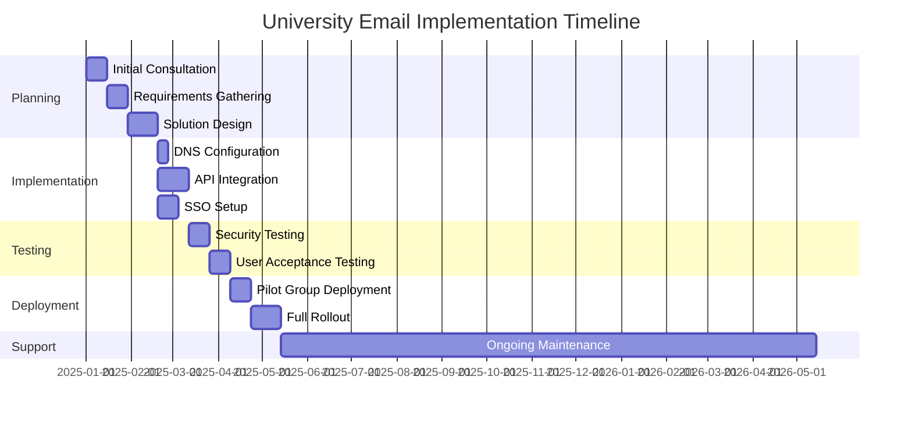
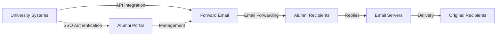

# Studium przypadku: W jaki sposób Forward Email wspomaga rozwiązania e-mailowe dla absolwentów czołowych uniwersytetów {#case-study-how-forward-email-powers-alumni-email-solutions-for-top-universities}


## Spis treści {#table-of-contents}

* [Przedmowa](#foreword)
* [Dramatyczne oszczędności kosztów przy stabilnych cenach](#dramatic-cost-savings-with-stable-pricing)
  * [Oszczędności uniwersyteckie w świecie rzeczywistym](#real-world-university-savings)
* [Wyzwanie e-mailowe dla absolwentów uniwersytetu](#the-university-alumni-email-challenge)
  * [Wartość tożsamości e-mailowej absolwentów](#the-value-of-alumni-email-identity)
  * [Tradycyjne rozwiązania zawodzą](#traditional-solutions-fall-short)
  * [Rozwiązanie Forward Email](#the-forward-email-solution)
* [Wdrożenie techniczne: Jak to działa](#technical-implementation-how-it-works)
  * [Architektura rdzeniowa](#core-architecture)
  * [Integracja z systemami uniwersyteckimi](#integration-with-university-systems)
  * [Zarządzanie oparte na API](#api-driven-management)
  * [Konfiguracja i weryfikacja DNS](#dns-configuration-and-verification)
  * [Testowanie i zapewnienie jakości](#testing-and-quality-assurance)
* [Harmonogram wdrożenia](#implementation-timeline)
* [Proces wdrażania: od migracji do konserwacji](#implementation-process-from-migration-to-maintenance)
  * [Ocena wstępna i planowanie](#initial-assessment-and-planning)
  * [Strategia migracji](#migration-strategy)
  * [Instalacja i konfiguracja techniczna](#technical-setup-and-configuration)
  * [Projektowanie doświadczeń użytkownika](#user-experience-design)
  * [Szkolenia i dokumentacja](#training-and-documentation)
  * [Ciągłe wsparcie i optymalizacja](#ongoing-support-and-optimization)
* [Studium przypadku: Uniwersytet Cambridge](#case-study-university-of-cambridge)
  * [Wyzwanie](#challenge)
  * [Rozwiązanie](#solution)
  * [Wyniki](#results)
* [Korzyści dla uczelni i absolwentów](#benefits-for-universities-and-alumni)
  * [Dla uniwersytetów](#for-universities)
  * [Dla absolwentów](#for-alumni)
  * [Wskaźniki adopcji wśród absolwentów](#adoption-rates-among-alumni)
  * [Oszczędności kosztów w porównaniu z poprzednimi rozwiązaniami](#cost-savings-compared-to-previous-solutions)
* [Zagadnienia bezpieczeństwa i prywatności](#security-and-privacy-considerations)
  * [Środki ochrony danych](#data-protection-measures)
  * [Ramy zgodności](#compliance-framework)
* [Przyszłe wydarzenia](#future-developments)
* [Wniosek](#conclusion)

## Przedmowa {#foreword}

Stworzyliśmy najbezpieczniejszą, najbardziej prywatną i elastyczną usługę przekazywania wiadomości e-mail dla prestiżowych uniwersytetów i ich absolwentów.

W konkurencyjnym środowisku szkolnictwa wyższego, podtrzymywanie długotrwałych relacji z absolwentami to nie tylko kwestia tradycji – to strategiczny imperatyw. Jednym z najbardziej namacalnych sposobów, w jaki uniwersytety pielęgnują te więzi, są adresy e-mail absolwentów, zapewniające absolwentom cyfrową tożsamość odzwierciedlającą ich akademickie dziedzictwo.

W Forward Email nawiązaliśmy współpracę z jednymi z najbardziej prestiżowych instytucji edukacyjnych na świecie, aby zrewolucjonizować sposób zarządzania pocztą elektroniczną dla absolwentów. Nasze rozwiązanie do przekierowywania poczty elektronicznej klasy korporacyjnej obsługuje teraz systemy poczty elektronicznej dla absolwentów [Uniwersytet Cambridge](https://en.wikipedia.org/wiki/University_of_Cambridge), [Uniwersytet Maryland](https://en.wikipedia.org/wiki/University_of_Maryland,\_College_Park), [Uniwersytet Tufts](https://en.wikipedia.org/wiki/Tufts_University) i [Kolegium Swarthmore](https://en.wikipedia.org/wiki/Swarthmore_College), obsługując łącznie tysiące absolwentów na całym świecie.

W tym wpisie na blogu wyjaśniamy, w jaki sposób nasza usługa przekazywania wiadomości e-mail [oprogramowanie typu open source](https://en.wikipedia.org/wiki/Open-source_software), skoncentrowana na prywatności, stała się preferowanym rozwiązaniem dla tych instytucji, jakie techniczne wdrożenia to umożliwiają oraz jaki transformacyjny wpływ wywarła zarówno na wydajność administracyjną, jak i zadowolenie absolwentów.

## Dramatyczne oszczędności kosztów przy stabilnych cenach {#dramatic-cost-savings-with-stable-pricing}

Korzyści finansowe wynikające ze stosowania naszego rozwiązania są znaczące, zwłaszcza w porównaniu z ciągle rosnącymi cenami tradycyjnych dostawców poczty e-mail:

| Rozwiązanie | Koszt na absolwenta (roczny) | Koszt dla 100 000 absolwentów | Ostatnie podwyżki cen |
| ------------------------------ | --------------------------------------------------------------------------------------------------------- | ----------------------- | ---------------------------------------------------------------------------------------------------------------------------------------------------------------------------------------- |
| Google Workspace dla Firm | $72 | $7,200,000 | • 2019: G Suite Basic z 5 do 6 USD/miesiąc (+20%)<br>• 2023: Ceny planów elastycznych wzrosły o 20%<br>• 2025: Business Plus z 18 do 26,40 USD/miesiąc (+47%) z funkcjami AI |
| Google Workspace dla edukacji | Bezpłatnie (Education Fundamentals)<br>3 USD/ucznia/rok (Education Standard)<br>5 USD/ucznia/rok (Education Plus) | Bezpłatnie - 500 000 dolarów | • Rabaty ilościowe: 5% dla 100–499 licencji<br>• Rabaty ilościowe: 10% dla ponad 500 licencji<br>• Bezpłatny poziom ograniczony do usług podstawowych |
| Microsoft 365 Business | $60 | $6,000,000 | • 2023: Wprowadzono dwukrotne aktualizacje cen w roku<br>• 2025 (styczeń): Personal z 6,99 USD do 9,99 USD/miesiąc (+43%) z Copilot AI<br>• 2025 (kwiecień): 5% wzrost rocznych zobowiązań opłacanych co miesiąc |
| Microsoft 365 Education | Bezpłatnie (A1)<br>38–55 USD/wykładowca/rok (A3)<br>65–96 USD/wykładowca/rok (A5) | Bezpłatnie - 96 000 dolarów | • Licencje studenckie często dołączane do zakupów dokonywanych przez kadrę dydaktyczną<br>• Ceny ustalane indywidualnie poprzez licencjonowanie zbiorcze<br>• Bezpłatny poziom ograniczony do wersji internetowych |
| Samodzielnie hostowana giełda | $45 | $4,500,000 | Koszty bieżącej konserwacji i bezpieczeństwa stale rosną |
| **Przekaż dalej pocztę elektroniczną dla przedsiębiorstwa** | **Stała opłata 250 USD/miesiąc** | **3000 USD/rok** | **Brak podwyżek cen od premiery** |

### Rzeczywiste oszczędności uniwersyteckie {#real-world-university-savings}

Oto, ile nasze partnerskie uniwersytety oszczędzają rocznie wybierając usługę Forward Email zamiast tradycyjnych dostawców:

| Uniwersytet | Liczba absolwentów | Roczny koszt z Google | Roczny koszt z przekierowaniem wiadomości e-mail | Roczne oszczędności |
| ----------------------- | ------------ | ----------------------- | ------------------------------ | -------------- |
| Uniwersytet Cambridge | 30,000 | $90,000 | $3,000 | $87,000 |
| Kolegium Swarthmore | 5,000 | $15,000 | $3,000 | $12,000 |
| Uniwersytet Tufts | 12,000 | $36,000 | $3,000 | $33,000 |
| Uniwersytet Maryland | 25,000 | $75,000 | $3,000 | $72,000 |

> \[!NOTE]
> Usługa Forward Email Enterprise kosztuje zazwyczaj tylko 250 USD miesięcznie, bez dodatkowych kosztów za użytkownika, z ograniczeniami dotyczącymi stawek API na białej liście i jedynym dodatkowym kosztem, jeśli potrzebujesz dodatkowych GB/TB dla studentów (+3 USD za każde dodatkowe 10 GB). Używamy również dysków SSD NVMe do szybkiej obsługi protokołów IMAP/POP3/SMTP/CalDAV/CardDAV.

> \[!IMPORTANT]
> W przeciwieństwie do Google i Microsoftu, które wielokrotnie podnosiły ceny, integrując funkcje sztucznej inteligencji analizujące dane, Forward Email utrzymuje stabilne ceny, dbając jednocześnie o prywatność. Nie korzystamy ze sztucznej inteligencji, nie śledzimy wzorców użytkowania i nie przechowujemy logów ani wiadomości e-mail na dysku (całe przetwarzanie odbywa się w pamięci), zapewniając pełną prywatność komunikacji z absolwentami.

Oznacza to znaczną redukcję kosztów w porównaniu z tradycyjnymi rozwiązaniami hostingu poczty e-mail – środkami, które uniwersytety mogą przeznaczyć na stypendia, badania lub inne działania o znaczeniu krytycznym. Według analizy przeprowadzonej w 2023 roku przez Email Vendor Selection, instytucje edukacyjne coraz częściej poszukują opłacalnych alternatyw dla tradycyjnych dostawców poczty e-mail, ponieważ ceny stale rosną wraz z integracją funkcji sztucznej inteligencji ([Wybór dostawcy poczty e-mail, 2023](https://www.emailvendorselection.com/email-service-provider-list/)).

## Wyzwanie e-mailowe dla absolwentów uniwersytetu {#the-university-alumni-email-challenge}

Dla uniwersytetów zapewnienie absolwentom dożywotnich adresów e-mail stanowi wyjątkowe wyzwanie, z którym tradycyjne rozwiązania pocztowe nie są w stanie skutecznie sobie poradzić. Jak zauważono w obszernej dyskusji na temat ServerFault, uniwersytety z dużą bazą użytkowników potrzebują specjalistycznych rozwiązań pocztowych, które łączą wydajność, bezpieczeństwo i opłacalność ([Błąd serwera, 2009](https://serverfault.com/questions/97364/what-is-the-best-mail-server-for-a-university-with-a-large-amount-of-users)).

### Wartość tożsamości e-mail absolwentów {#the-value-of-alumni-email-identity}

Adresy e-mail absolwentów (takie jak `firstname.lastname@cl.cam.ac.uk` lub `username@terpalum.umd.edu`) pełnią kilka ważnych funkcji:

* Utrzymywanie relacji instytucjonalnych i tożsamości marki
* Ułatwianie bieżącej komunikacji z uczelnią
* Podnoszenie wiarygodności zawodowej absolwentów
* Wspieranie networkingu absolwentów i budowania społeczności
* Zapewnienie stabilnego, dożywotniego punktu kontaktowego

Badania przeprowadzone przez Tekade (2020) podkreślają, że adresy e-mail przeznaczone do celów edukacyjnych zapewniają absolwentom liczne korzyści, w tym dostęp do zasobów akademickich, wiarygodność zawodową i ekskluzywne zniżki na różne usługi ([Średni, 2020](https://medium.com/coders-capsule/top-20-benefits-of-having-an-educational-email-address-91a09795e05)).

> \[!TIP]
> Odwiedź nasz nowy katalog [AlumniEmail.com](https://alumniemail.com), aby uzyskać kompleksowe źródło informacji na temat usług poczty e-mail dla absolwentów uniwersytetów, w tym przewodniki konfiguracji, najlepsze praktyki oraz przeszukiwalny katalog domen poczty e-mail absolwentów. Służy on jako centralne centrum wszystkich informacji o poczcie e-mail dla absolwentów.

### Tradycyjne rozwiązania zawodzą {#traditional-solutions-fall-short}

Konwencjonalne systemy poczty elektronicznej stwarzają szereg ograniczeń w kontekście zaspokajania potrzeb absolwentów w zakresie poczty elektronicznej:

* **Wysokie koszty**: Modele licencjonowania na użytkownika stają się nieopłacalne dla dużej liczby absolwentów.
* **Obciążenia administracyjne**: Zarządzanie tysiącami, a nawet milionami kont wymaga znacznych zasobów IT.
* **Obawy dotyczące bezpieczeństwa**: Utrzymanie bezpieczeństwa nieaktywnych kont zwiększa podatność na ataki.
* **Ograniczona elastyczność**: Sztywne systemy nie są w stanie dostosować się do specyficznych potrzeb związanych z przekazywaniem wiadomości e-mail absolwentom.
* **Problemy z prywatnością**: Wielu dostawców skanuje treści wiadomości e-mail w celach reklamowych.

Dyskusja na portalu Quora na temat konserwacji uniwersyteckiej poczty e-mail ujawnia, że obawy dotyczące bezpieczeństwa są głównym powodem, dla którego uniwersytety mogą ograniczać lub usuwać adresy e-mail absolwentów, ponieważ nieużywane konta mogą być narażone na włamania i kradzież tożsamości ([Quora, 2011](https://www.quora.com/Is-there-any-cost-for-a-college-or-university-to-maintain-edu-e-mail-addresses)).

### Rozwiązanie do przekazywania wiadomości e-mail {#the-forward-email-solution}

Nasze podejście rozwiązuje te problemy za pomocą zasadniczo odmiennego modelu:

* Przekierowanie poczty e-mail zamiast hostingu
* Stała opłata zamiast kosztów za użytkownika
* Architektura open source zapewniająca przejrzystość i bezpieczeństwo
* Projekt stawiający prywatność na pierwszym miejscu, bez skanowania treści
* Specjalistyczne funkcje do zarządzania tożsamością uniwersytecką

## Implementacja techniczna: Jak to działa {#technical-implementation-how-it-works}

Nasze rozwiązanie wykorzystuje zaawansowaną, a jednocześnie prostą architekturę techniczną, aby zapewnić niezawodne i bezpieczne przekazywanie wiadomości e-mail na dużą skalę.

### Architektura rdzenia {#core-architecture}

System Forward Email składa się z kilku kluczowych komponentów:

* Rozproszone serwery MX zapewniające wysoką dostępność
* Przekierowywanie w czasie rzeczywistym bez konieczności przechowywania wiadomości
* Kompleksowe uwierzytelnianie poczty e-mail
* Obsługa niestandardowych domen i subdomen
* Zarządzanie kontami za pomocą interfejsu API

Według specjalistów IT z ServerFault, dla uniwersytetów, które chcą wdrożyć własne rozwiązania pocztowe, Postfix jest rekomendowany jako najlepszy agent transferu poczty (MTA), natomiast Courier lub Dovecot są preferowane w przypadku dostępu IMAP/POP3 ([Błąd serwera, 2009](https://serverfault.com/questions/97364/what-is-the-best-mail-server-for-a-university-with-a-large-amount-of-users)). Jednak nasze rozwiązanie eliminuje konieczność samodzielnego zarządzania tymi złożonymi systemami przez uniwersytety.

### Integracja z systemami uniwersyteckimi {#integration-with-university-systems}

Opracowaliśmy ścieżki płynnej integracji z istniejącą infrastrukturą uniwersytecką:

* Automatyczne provisionowanie poprzez integrację [Interfejs API RESTful](https://forwardemail.net/email-api)
* Opcje niestandardowego brandingu portali uniwersyteckich
* Elastyczne zarządzanie aliasami dla wydziałów i organizacji
* Operacje wsadowe dla efektywnej administracji

### Zarządzanie oparte na API {#api-driven-management}

Dzięki naszemu [Interfejs API RESTful](https://forwardemail.net/email-api) uniwersytety mogą zautomatyzować zarządzanie pocztą e-mail:

```javascript
// Example: Creating a new alumni email address
const response = await fetch('https://forwardemail.net/api/v1/domains/example.edu/aliases', {
  method: 'POST',
  headers: {
    'Content-Type': 'application/json',
    'Authorization': `Basic ${Buffer.from(YOUR_API_TOKEN + ":").toString('base64')}`
  },
  body: JSON.stringify({
    name: 'alumni.john.smith',
    recipients: ['johnsmith@gmail.com'],
    has_recipient_verification: true
  })
});
```

### Konfiguracja i weryfikacja DNS {#dns-configuration-and-verification}

Prawidłowa konfiguracja DNS jest kluczowa dla dostarczania wiadomości e-mail. Nasz zespół pomaga w:

* Konfiguracja [DNS](https://en.wikipedia.org/wiki/Domain_Name_System), w tym rekordy MX
* Kompleksowa implementacja zabezpieczeń poczty e-mail z wykorzystaniem naszego pakietu open source [autoryzacja poczty](https://www.npmjs.com/package/mailauth), scyzoryka szwajcarskiego do uwierzytelniania poczty e-mail, który obsługuje:
* [SPF](https://en.wikipedia.org/wiki/Sender_Policy_Framework) (Sender Policy Framework) w celu zapobiegania podszywaniu się pod wiadomości e-mail
* [DKIM](https://en.wikipedia.org/wiki/DomainKeys_Identified_Mail) (DomainKeys Identified Mail) w celu uwierzytelniania poczty e-mail
* [DMARC](https://en.wikipedia.org/wiki/Email_authentication) (Domain-based Message Authentication, Reporting & Conformance) w celu egzekwowania zasad
* [MTA-STS](https://en.wikipedia.org/wiki/Opportunistic_TLS) (SMTP MTA Strict Transport Security) w celu egzekwowania szyfrowania TLS
* [ARC](https://en.wikipedia.org/wiki/DomainKeys_Identified_Mail#Authenticated_Received_Chain) (Authenticated Received Chain) w celu utrzymania uwierzytelniania podczas przekazywania wiadomości
* [SRS](https://en.wikipedia.org/wiki/Sender_Rewriting_Scheme) (Sender Rewriting Scheme) w celu zachowania walidacji SPF podczas przekazywania
* [BIMI](https://en.wikipedia.org/wiki/Email_authentication) (Wskaźniki marki do identyfikacji wiadomości) do wyświetlania logo w obsługiwanych klientach poczty e-mail
* Weryfikacja rekordu DNS TXT w celu potwierdzenia własności domeny

Pakiet `mailauth` (<http://npmjs.com/package/mailauth>) to w pełni otwarte rozwiązanie, które obsługuje wszystkie aspekty uwierzytelniania poczty e-mail w jednej zintegrowanej bibliotece. W przeciwieństwie do rozwiązań zastrzeżonych, takie podejście zapewnia transparentność, regularne aktualizacje zabezpieczeń i pełną kontrolę nad procesem uwierzytelniania poczty e-mail.

### Testowanie i zapewnienie jakości {#testing-and-quality-assurance}

Przed pełnym wdrożeniem przeprowadzamy rygorystyczne testy:

* Kompleksowe testowanie dostarczania wiadomości e-mail
* Testowanie obciążenia w scenariuszach o dużej objętości
* Testowanie penetracyjne zabezpieczeń
* Walidacja integracji API
* Testowanie akceptacji użytkownika z przedstawicielami absolwentów

## Harmonogram wdrożenia {#implementation-timeline}



Proces wdrażania ##: od migracji do konserwacji {#implementation-process-from-migration-to-maintenance}

Nasz ustrukturyzowany proces wdrażania gwarantuje płynne przejście dla uniwersytetów wdrażających nasze rozwiązanie.

### Ocena wstępna i planowanie {#initial-assessment-and-planning}

Zaczynamy od kompleksowej oceny obecnego systemu poczty elektronicznej uniwersytetu, bazy danych absolwentów i wymagań technicznych. Ta faza obejmuje:

* Wywiady z interesariuszami z działem IT, działem relacji z absolwentami i administracją
* Audyt techniczny istniejącej infrastruktury poczty e-mail
* Mapowanie danych dla dokumentacji absolwentów
* Przegląd bezpieczeństwa i zgodności
* Harmonogram projektu i opracowanie kamieni milowych

### Strategia migracji {#migration-strategy}

Na podstawie oceny opracowujemy dostosowaną strategię migracji, która minimalizuje zakłócenia, zapewniając jednocześnie pełną integralność danych:

* Fazowe podejście do migracji według grup absolwentów
* Równoległe działanie systemów w okresie przejściowym
* Kompleksowe protokoły walidacji danych
* Procedury awaryjne na wypadek problemów z migracją
* Przejrzysty plan komunikacji dla wszystkich interesariuszy

### Konfiguracja techniczna i konfiguracja {#technical-setup-and-configuration}

Nasz zespół techniczny zajmuje się wszystkimi aspektami konfiguracji systemu:

* Konfiguracja i weryfikacja DNS
* Integracja API z systemami uniwersyteckimi
* Tworzenie portalu na zamówienie z brandingiem uniwersyteckim
* Konfiguracja uwierzytelniania poczty e-mail (SPF, DKIM, DMARC)

### Projektowanie doświadczeń użytkownika {#user-experience-design}

Współpracujemy ściśle z uniwersytetami, aby tworzyć intuicyjne interfejsy zarówno dla administratorów, jak i absolwentów:

* Portale e-mail dla absolwentów z własną marką
* Uproszczone zarządzanie przekierowaniem wiadomości e-mail
* Projekty responsywne dla urządzeń mobilnych
* Zgodność z zasadami dostępności
* Wsparcie wielojęzyczne w razie potrzeby

### Szkolenie i dokumentacja {#training-and-documentation}

Kompleksowe szkolenie gwarantuje, że wszyscy interesariusze będą mogli skutecznie korzystać z systemu:

* Szkolenia dla administratorów
* Dokumentacja techniczna dla personelu IT
* Podręczniki użytkownika dla absolwentów
* Samouczki wideo dotyczące typowych zadań
* Rozwój bazy wiedzy

### Ciągłe wsparcie i optymalizacja {#ongoing-support-and-optimization}

Nasza współpraca trwa dłużej niż jej wdrożenie:

* Całodobowe wsparcie techniczne
* Regularne aktualizacje systemu i poprawki bezpieczeństwa
* Monitorowanie i optymalizacja wydajności
* Konsultacje dotyczące najlepszych praktyk w zakresie poczty e-mail
* Analiza danych i raportowanie

## Studium przypadku: Uniwersytet Cambridge {#case-study-university-of-cambridge}

Uniwersytet Cambridge szukał rozwiązania, które umożliwiłoby absolwentom udostępnienie adresów e-mail @cam.ac.uk, a jednocześnie pozwoliłoby ograniczyć koszty i obciążenia informatyczne.

### Wyzwanie {#challenge}

Uniwersytet Cambridge musiał zmierzyć się z kilkoma wyzwaniami związanymi z poprzednim systemem poczty elektronicznej dla absolwentów:

* Wysokie koszty operacyjne związane z utrzymaniem oddzielnej infrastruktury poczty e-mail
* Obciążenie administracyjne związane z zarządzaniem tysiącami kont
* Obawy dotyczące bezpieczeństwa w przypadku nieaktywnych kont
* Ograniczona integracja z systemami baz danych absolwentów
* Rosnące wymagania dotyczące pamięci masowej

### Rozwiązanie {#solution}

Forward Email wdrożył kompleksowe rozwiązanie:

* Przekierowanie wiadomości e-mail na wszystkie adresy absolwentów @cam.ac.uk
* Portal z własną marką do samoobsługi absolwentów
* Integracja API z bazą danych absolwentów Cambridge
* Kompleksowe wdrożenie zabezpieczeń poczty e-mail

### Wyniki {#results}

Wdrożenie przyniosło znaczące korzyści:

* Znaczna redukcja kosztów w porównaniu z poprzednim rozwiązaniem
* 99,9% niezawodności dostarczania wiadomości e-mail
* Uproszczona administracja dzięki automatyzacji
* Zwiększone bezpieczeństwo dzięki nowoczesnemu uwierzytelnianiu wiadomości e-mail
* Pozytywne opinie absolwentów na temat użyteczności systemu

## Korzyści dla uczelni i absolwentów {#benefits-for-universities-and-alumni}

Nasze rozwiązanie przynosi wymierne korzyści zarówno instytucjom, jak i ich absolwentom.

### Dla uniwersytetów {#for-universities}

* **Oszczędność kosztów**: Stałe ceny niezależnie od liczby absolwentów
* **Prostota administracyjna**: Zautomatyzowane zarządzanie za pośrednictwem API
* **Zwiększone bezpieczeństwo**: Kompleksowe uwierzytelnianie poczty e-mail
* **Spójność marki**: Dożywotnie instytucjonalne adresy e-mail
* **Zaangażowanie absolwentów**: Wzmocnione relacje dzięki ciągłej obsłudze

Według BulkSignature (2023) platformy poczty e-mail dla instytucji edukacyjnych oferują znaczące korzyści, w tym opłacalność dzięki bezpłatnym lub tanim planom, efektywność czasową dzięki możliwościom masowej komunikacji oraz funkcje śledzenia pozwalające monitorować dostarczanie wiadomości e-mail i zaangażowanie ([Podpis zbiorczy, 2023](https://bulksignature.com/blog/5-best-email-platforms-for-educational-institutions/)).

### Dla absolwentów {#for-alumni}

* **Tożsamość zawodowa**: Prestiżowy adres e-mail uniwersytetu
* **Ciągłość poczty e-mail**: Przekierowanie na dowolny adres e-mail prywatny
* **Ochrona prywatności**: Brak skanowania treści i eksploracji danych
* **Uproszczone zarządzanie**: Łatwa aktualizacja adresatów
* **Zwiększone bezpieczeństwo**: Nowoczesne uwierzytelnianie poczty e-mail

Badania opublikowane w czasopiśmie International Journal of Education & Literacy Studies podkreślają znaczenie prawidłowej komunikacji e-mailowej w środowisku akademickim, zauważając, że umiejętność korzystania z poczty e-mail jest kluczowa zarówno dla studentów, jak i absolwentów w kontekście zawodowym ([IJELS, 2021](https://files.eric.ed.gov/fulltext/EJ1319324.pdf)).

### Wskaźniki adopcji wśród absolwentów {#adoption-rates-among-alumni}

Uczelnie wyższe informują o wysokim poziomie akceptacji i zadowolenia wśród swoich absolwentów.

### Oszczędności kosztów w porównaniu z poprzednimi rozwiązaniami {#cost-savings-compared-to-previous-solutions}

Efekt finansowy okazał się znaczący, a uniwersytety zgłosiły znaczące oszczędności w porównaniu ze swoimi poprzednimi rozwiązaniami poczty e-mail.

## Zagadnienia bezpieczeństwa i prywatności {#security-and-privacy-considerations}

W przypadku placówek edukacyjnych ochrona danych absolwentów to nie tylko dobra praktyka, ale często także wymóg prawny wynikający z przepisów takich jak europejskie rozporządzenie RODO.

### Środki ochrony danych {#data-protection-measures}

Nasze rozwiązanie obejmuje wiele warstw zabezpieczeń:

* Kompleksowe szyfrowanie całego ruchu e-mail
* Brak przechowywania treści e-mail na naszych serwerach
* Regularne audyty bezpieczeństwa i testy penetracyjne
* Zgodność z międzynarodowymi standardami ochrony danych
* Przejrzysty, otwarty kod źródłowy do weryfikacji bezpieczeństwa

> \[!WARNING]
> Wielu dostawców poczty e-mail skanuje treść wiadomości e-mail w celach reklamowych lub w celu trenowania modeli sztucznej inteligencji. Ta praktyka budzi poważne obawy dotyczące prywatności, szczególnie w komunikacji zawodowej i akademickiej. Forward Email nigdy nie skanuje treści wiadomości e-mail i przetwarza wszystkie wiadomości w pamięci, aby zapewnić pełną prywatność.

### Struktura zgodności {#compliance-framework}

Przestrzegamy ściśle obowiązujących przepisów:

* Zgodność z RODO dla instytucji europejskich
* Certyfikacja SOC 2 typu II
* Coroczne oceny bezpieczeństwa
* Umowa o przetwarzaniu danych (DPA) dostępna pod adresem [forwardemail.net/dpa](https://forwardemail.net/dpa)
* Regularne aktualizacje zgodności w miarę rozwoju przepisów

## Przyszłe zmiany {#future-developments}

Ciągle udoskonalamy nasze rozwiązanie poczty e-mail dla absolwentów, dodając nowe funkcje i możliwości:

* Ulepszona analityka dla administratorów uniwersyteckich
* Zaawansowane zabezpieczenia antyphishingowe
* Rozszerzone możliwości API dla głębszej integracji
* Dodatkowe opcje uwierzytelniania

## Wniosek {#conclusion}

Forward Email zrewolucjonizował sposób, w jaki uniwersytety zapewniają i zarządzają usługami poczty elektronicznej dla absolwentów. Zastępując kosztowny, skomplikowany hosting poczty elektronicznej eleganckim i bezpiecznym przekierowywaniem wiadomości, umożliwiliśmy instytucjom oferowanie wszystkim absolwentom dożywotnich adresów e-mail, jednocześnie radykalnie redukując koszty i obciążenia administracyjne.

Nasze partnerstwa z prestiżowymi instytucjami, takimi jak Cambridge, Maryland, Tufts i Swarthmore, dowodzą skuteczności naszego podejścia w zróżnicowanych środowiskach edukacyjnych. W obliczu rosnącej presji, jaką uniwersytety odczuwają, aby utrzymać kontakt z absolwentami, jednocześnie kontrolując koszty, nasze rozwiązanie stanowi atrakcyjną alternatywę dla tradycyjnych systemów poczty elektronicznej.



Jeśli uniwersytety są zainteresowane sprawdzeniem, w jaki sposób Forward Email może zmienić sposób obsługi poczty e-mail dla absolwentów, prosimy o kontakt z naszym zespołem pod adresem <support@forwardemail.net> lub odwiedzenie strony [forwardemail.net](https://forwardemail.net), aby dowiedzieć się więcej o naszych rozwiązaniach dla przedsiębiorstw.