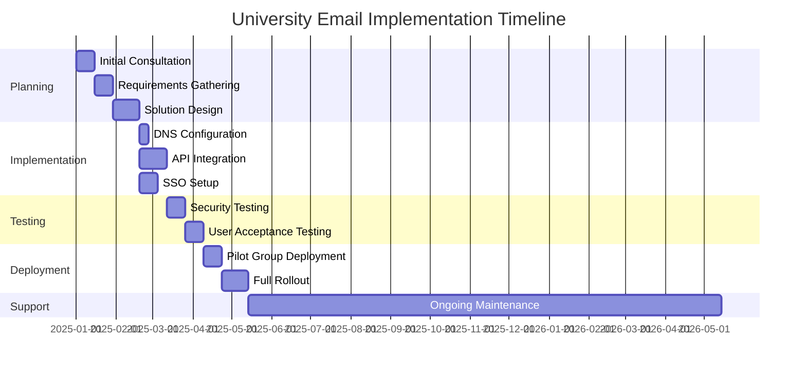
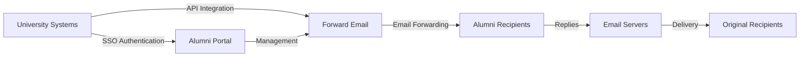

# Studium przypadku: Jak Forward Email wspiera rozwiązania e-mailowe dla absolwentów czołowych uniwersytetów {#case-study-how-forward-email-powers-alumni-email-solutions-for-top-universities}


## Spis treści {#table-of-contents}

* [Przedmowa](#foreword)
* [Dramatyczne oszczędności przy stabilnych cenach](#dramatic-cost-savings-with-stable-pricing)
  * [Rzeczywiste oszczędności uniwersyteckie](#real-world-university-savings)
* [Wyzwanie e-mailowe dla absolwentów uniwersytetu](#the-university-alumni-email-challenge)
  * [Wartość tożsamości e-mailowej absolwenta](#the-value-of-alumni-email-identity)
  * [Tradycyjne rozwiązania zawodzą](#traditional-solutions-fall-short)
  * [Rozwiązanie Forward Email](#the-forward-email-solution)
* [Implementacja techniczna: Jak to działa](#technical-implementation-how-it-works)
  * [Podstawowa architektura](#core-architecture)
  * [Integracja z systemami uniwersyteckimi](#integration-with-university-systems)
  * [Zarządzanie oparte na API](#api-driven-management)
  * [Konfiguracja i weryfikacja DNS](#dns-configuration-and-verification)
  * [Testowanie i zapewnienie jakości](#testing-and-quality-assurance)
* [Harmonogram wdrożenia](#implementation-timeline)
* [Proces wdrożenia: Od migracji do utrzymania](#implementation-process-from-migration-to-maintenance)
  * [Wstępna ocena i planowanie](#initial-assessment-and-planning)
  * [Strategia migracji](#migration-strategy)
  * [Konfiguracja techniczna](#technical-setup-and-configuration)
  * [Projektowanie doświadczenia użytkownika](#user-experience-design)
  * [Szkolenia i dokumentacja](#training-and-documentation)
  * [Wsparcie i optymalizacja na bieżąco](#ongoing-support-and-optimization)
* [Studium przypadku: Uniwersytet Cambridge](#case-study-university-of-cambridge)
  * [Wyzwanie](#challenge)
  * [Rozwiązanie](#solution)
  * [Wyniki](#results)
* [Korzyści dla uniwersytetów i absolwentów](#benefits-for-universities-and-alumni)
  * [Dla uniwersytetów](#for-universities)
  * [Dla absolwentów](#for-alumni)
  * [Wskaźniki adopcji wśród absolwentów](#adoption-rates-among-alumni)
  * [Oszczędności w porównaniu z poprzednimi rozwiązaniami](#cost-savings-compared-to-previous-solutions)
* [Aspekty bezpieczeństwa i prywatności](#security-and-privacy-considerations)
  * [Środki ochrony danych](#data-protection-measures)
  * [Ramowy system zgodności](#compliance-framework)
* [Przyszłe rozwinięcia](#future-developments)
* [Podsumowanie](#conclusion)


## Przedmowa {#foreword}

Stworzyliśmy najbardziej bezpieczną, prywatną i elastyczną usługę przekierowywania e-maili na świecie dla prestiżowych uniwersytetów i ich absolwentów.

W konkurencyjnym środowisku szkolnictwa wyższego utrzymywanie trwałych więzi z absolwentami to nie tylko kwestia tradycji — to strategiczny imperatyw. Jednym z najbardziej namacalnych sposobów, w jaki uniwersytety pielęgnują te więzi, są adresy e-mailowe dla absolwentów, zapewniające absolwentom cyfrową tożsamość odzwierciedlającą ich dziedzictwo akademickie.

W Forward Email nawiązaliśmy współpracę z niektórymi z najbardziej prestiżowych instytucji edukacyjnych na świecie, aby zrewolucjonizować sposób zarządzania usługami e-mailowymi dla absolwentów. Nasze rozwiązanie do przekierowywania e-maili klasy enterprise zasila obecnie systemy e-mailowe dla absolwentów [Uniwersytetu Cambridge](https://en.wikipedia.org/wiki/University_of_Cambridge), [Uniwersytetu Maryland](https://en.wikipedia.org/wiki/University_of_Maryland,_College_Park), [Tufts University](https://en.wikipedia.org/wiki/Tufts_University) oraz [Swarthmore College](https://en.wikipedia.org/wiki/Swarthmore_College), obsługując łącznie tysiące absolwentów na całym świecie.

Ten wpis na blogu przedstawia, jak nasza [otwartoźródłowa](https://en.wikipedia.org/wiki/Open-source_software), skoncentrowana na prywatności usługa przekierowywania e-maili stała się preferowanym rozwiązaniem dla tych instytucji, techniczne implementacje, które to umożliwiają, oraz transformujący wpływ, jaki miała na efektywność administracyjną i satysfakcję absolwentów.


## Dramatyczne oszczędności przy stabilnych cenach {#dramatic-cost-savings-with-stable-pricing}
Korzyści finansowe naszego rozwiązania są znaczne, zwłaszcza w porównaniu z ciągle rosnącymi cenami tradycyjnych dostawców poczty elektronicznej:

| Rozwiązanie                   | Koszt na absolwenta (rocznie)                                                                             | Koszt dla 100 000 absolwentów | Ostatnie podwyżki cen                                                                                                                                                                   |
| ------------------------------ | --------------------------------------------------------------------------------------------------------- | ----------------------------- | ---------------------------------------------------------------------------------------------------------------------------------------------------------------------------------------- |
| Google Workspace for Business  | 72 USD                                                                                                   | 7 200 000 USD                 | • 2019: G Suite Basic z 5 do 6 USD/miesiąc (+20%)<br>• 2023: Plany elastyczne podrożały o 20%<br>• 2025: Business Plus z 18 do 26,40 USD/miesiąc (+47%) z funkcjami AI                    |
| Google Workspace for Education | Darmowe (Education Fundamentals)<br>3 USD/student/rok (Education Standard)<br>5 USD/student/rok (Education Plus) | Darmowe - 500 000 USD         | • Rabaty ilościowe: 5% dla 100-499 licencji<br>• Rabaty ilościowe: 10% dla 500+ licencji<br>• Darmowy poziom ograniczony do podstawowych usług                                         |
| Microsoft 365 Business         | 60 USD                                                                                                   | 6 000 000 USD                 | • 2023: Wprowadzono półroczne aktualizacje cen<br>• 2025 (styczeń): Personal z 6,99 do 9,99 USD/miesiąc (+43%) z Copilot AI<br>• 2025 (kwiecień): 5% podwyżka przy rocznych zobowiązaniach płaconych miesięcznie |
| Microsoft 365 Education        | Darmowe (A1)<br>38-55 USD/pracownik/rok (A3)<br>65-96 USD/pracownik/rok (A5)                             | Darmowe - 96 000 USD          | • Licencje studenckie często wliczone w zakup dla pracowników<br>• Indywidualne ceny przy licencjach hurtowych<br>• Darmowy poziom ograniczony do wersji webowych                       |
| Self-Hosted Exchange           | 45 USD                                                                                                   | 4 500 000 USD                 | Koszty bieżącej konserwacji i bezpieczeństwa nadal rosną                                                                                                                                  |
| **Forward Email Enterprise**   | **Stała opłata 250 USD/miesiąc**                                                                         | **3 000 USD/rok**             | **Brak podwyżek cen od momentu uruchomienia**                                                                                                                                             |

### Oszczędności rzeczywistych uczelni {#real-world-university-savings}

Oto ile rocznie oszczędzają nasze partnerskie uczelnie, wybierając Forward Email zamiast tradycyjnych dostawców:

| Uczelnia                 | Liczba absolwentów | Roczny koszt z Google | Roczny koszt z Forward Email | Roczne oszczędności |
| ------------------------ | ------------------ | --------------------- | ---------------------------- | ------------------- |
| University of Cambridge  | 30 000             | 90 000 USD            | 3 000 USD                    | 87 000 USD          |
| Swarthmore College       | 5 000              | 15 000 USD            | 3 000 USD                    | 12 000 USD          |
| Tufts University         | 12 000             | 36 000 USD            | 3 000 USD                    | 33 000 USD          |
| University of Maryland   | 25 000             | 75 000 USD            | 3 000 USD                    | 72 000 USD          |

> \[!NOTE]
> Forward Email Enterprise kosztuje zazwyczaj tylko 250 USD/miesiąc, bez dodatkowych opłat za użytkownika, z limitami API na białej liście, a jedynym dodatkowym kosztem jest przestrzeń dyskowa, jeśli potrzebujesz dodatkowych GB/TB dla studentów (+3 USD za każde dodatkowe 10 GB). Używamy dysków NVMe SSD dla szybkiego wsparcia IMAP/POP3/SMTP/CalDAV/CardDAV.
> \[!IMPORTANT]
> W przeciwieństwie do Google i Microsoft, którzy wielokrotnie podnosili ceny, integrując funkcje AI analizujące Twoje dane, Forward Email utrzymuje stabilne ceny z rygorystycznym naciskiem na prywatność. Nie używamy AI, nie śledzimy wzorców użytkowania i nie przechowujemy logów ani e-maili na dysku (wszystkie przetwarzania odbywają się w pamięci), zapewniając pełną prywatność Twojej komunikacji z absolwentami.

Jest to znaczące obniżenie kosztów w porównaniu z tradycyjnymi rozwiązaniami hostingowymi poczty e-mail — środki, które uczelnie mogą przekierować na stypendia, badania lub inne kluczowe działania misji. Według analizy z 2023 roku przeprowadzonej przez Email Vendor Selection, instytucje edukacyjne coraz częściej poszukują opłacalnych alternatyw dla tradycyjnych dostawców poczty e-mail, ponieważ ceny nadal rosną wraz z integracją funkcji AI ([Email Vendor Selection, 2023](https://www.emailvendorselection.com/email-service-provider-list/)).


## Wyzwanie e-mailowe dla absolwentów uczelni {#the-university-alumni-email-challenge}

Dla uczelni zapewnienie dożywotnich adresów e-mail dla absolwentów stanowi unikalny zestaw wyzwań, które tradycyjne rozwiązania e-mailowe mają trudności skutecznie rozwiązać. Jak zauważono w obszernej dyskusji na ServerFault, uczelnie z dużą liczbą użytkowników wymagają specjalistycznych rozwiązań e-mailowych, które równoważą wydajność, bezpieczeństwo i opłacalność ([ServerFault, 2009](https://serverfault.com/questions/97364/what-is-the-best-mail-server-for-a-university-with-a-large-amount-of-users)).

### Wartość tożsamości e-mailowej absolwenta {#the-value-of-alumni-email-identity}

Adresy e-mail absolwentów (takie jak `firstname.lastname@cl.cam.ac.uk` lub `username@terpalum.umd.edu`) pełnią wiele ważnych funkcji:

* Utrzymywanie więzi instytucjonalnej i tożsamości marki
* Ułatwianie ciągłej komunikacji z uczelnią
* Zwiększanie wiarygodności zawodowej absolwentów
* Wspieranie sieciowania i budowania społeczności absolwentów
* Zapewnienie stabilnego, dożywotniego punktu kontaktowego

Badania Tekade (2020) podkreślają, że edukacyjne adresy e-mail przynoszą absolwentom liczne korzyści, w tym dostęp do zasobów akademickich, wiarygodność zawodową oraz ekskluzywne zniżki na różne usługi ([Medium, 2020](https://medium.com/coders-capsule/top-20-benefits-of-having-an-educational-email-address-91a09795e05)).

> \[!TIP]
> Odwiedź nasz nowy katalog [AlumniEmail.com](https://alumniemail.com) — kompleksowe źródło informacji o usługach e-mail dla absolwentów uczelni, w tym przewodniki konfiguracji, najlepsze praktyki oraz przeszukiwalny katalog domen e-mail absolwentów. Służy jako centralny punkt informacji o e-mailach dla absolwentów.

### Tradycyjne rozwiązania zawodzą {#traditional-solutions-fall-short}

Konwencjonalne systemy e-mailowe mają kilka ograniczeń w zastosowaniu do potrzeb e-mailowych absolwentów:

* **Koszty zaporowe**: modele licencjonowania na użytkownika stają się finansowo nieopłacalne dla dużych baz absolwentów
* **Obciążenie administracyjne**: zarządzanie tysiącami lub milionami kont wymaga znacznych zasobów IT
* **Problemy z bezpieczeństwem**: utrzymanie bezpieczeństwa nieaktywnych kont zwiększa podatność
* **Ograniczona elastyczność**: sztywne systemy nie mogą dostosować się do unikalnych potrzeb przekierowywania e-maili absolwentów
* **Problemy z prywatnością**: wielu dostawców skanuje treść e-maili w celach reklamowych

Dyskusja na Quora dotycząca utrzymania e-maili uczelnianych ujawnia, że obawy o bezpieczeństwo są głównym powodem, dla którego uczelnie mogą ograniczać lub anulować adresy e-mail absolwentów, ponieważ nieużywane konta mogą być podatne na włamania i kradzież tożsamości ([Quora, 2011](https://www.quora.com/Is-there-any-cost-for-a-college-or-university-to-maintain-edu-e-mail-addresses)).

### Rozwiązanie Forward Email {#the-forward-email-solution}

Nasze podejście rozwiązuje te wyzwania poprzez zasadniczo inny model:

* Przekierowywanie e-maili zamiast hostingu
* Stała opłata zamiast kosztów na użytkownika
* Architektura open-source dla przejrzystości i bezpieczeństwa
* Projektowanie z naciskiem na prywatność bez skanowania treści
* Specjalistyczne funkcje do zarządzania tożsamością uczelni


## Implementacja techniczna: Jak to działa {#technical-implementation-how-it-works}
Nasze rozwiązanie wykorzystuje zaawansowaną, a jednocześnie elegancko prostą architekturę techniczną, aby zapewnić niezawodne i bezpieczne przekazywanie wiadomości e-mail na dużą skalę.

### Core Architecture {#core-architecture}

System Forward Email składa się z kilku kluczowych komponentów:

* Rozproszone serwery MX dla wysokiej dostępności
* Przekazywanie w czasie rzeczywistym bez przechowywania wiadomości
* Kompleksowa autoryzacja e-mail
* Obsługa niestandardowych domen i subdomen
* Zarządzanie kontami oparte na API

Według specjalistów IT na ServerFault, dla uczelni chcących wdrożyć własne rozwiązania e-mail, Postfix jest rekomendowany jako najlepszy Mail Transfer Agent (MTA), natomiast Courier lub Dovecot są preferowane do dostępu IMAP/POP3 ([ServerFault, 2009](https://serverfault.com/questions/97364/what-is-the-best-mail-server-for-a-university-with-a-large-amount-of-users)). Nasze rozwiązanie eliminuje jednak konieczność samodzielnego zarządzania tymi skomplikowanymi systemami przez uczelnie.

### Integration with University Systems {#integration-with-university-systems}

Opracowaliśmy bezproblemowe ścieżki integracji z istniejącą infrastrukturą uczelni:

* Automatyczne provisionowanie poprzez integrację z [RESTful API](https://forwardemail.net/email-api)
* Opcje niestandardowego brandingu dla portali uczelnianych
* Elastyczne zarządzanie aliasami dla wydziałów i organizacji
* Operacje wsadowe dla efektywnej administracji

### API-Driven Management {#api-driven-management}

Nasze [RESTful API](https://forwardemail.net/email-api) umożliwia uczelniom automatyzację zarządzania e-mailami:

```javascript
// Example: Creating a new alumni email address
const response = await fetch('https://forwardemail.net/api/v1/domains/example.edu/aliases', {
  method: 'POST',
  headers: {
    'Content-Type': 'application/json',
    'Authorization': `Basic ${Buffer.from(YOUR_API_TOKEN + ":").toString('base64')}`
  },
  body: JSON.stringify({
    name: 'alumni.john.smith',
    recipients: ['johnsmith@gmail.com'],
    has_recipient_verification: true
  })
});
```

### DNS Configuration and Verification {#dns-configuration-and-verification}

Prawidłowa konfiguracja DNS jest kluczowa dla dostarczania e-maili. Nasz zespół pomaga w:

* Konfiguracji [DNS](https://en.wikipedia.org/wiki/Domain_Name_System) w tym rekordów MX
* Kompleksowej implementacji zabezpieczeń e-mail za pomocą naszego open-source’owego pakietu [mailauth](https://www.npmjs.com/package/mailauth), szwajcarskiego scyzoryka do autoryzacji e-mail, który obsługuje:
  * [SPF](https://en.wikipedia.org/wiki/Sender_Policy_Framework) (Sender Policy Framework) zapobiegający podszywaniu się pod nadawcę
  * [DKIM](https://en.wikipedia.org/wiki/DomainKeys_Identified_Mail) (DomainKeys Identified Mail) do autoryzacji e-mail
  * [DMARC](https://en.wikipedia.org/wiki/Email_authentication) (Domain-based Message Authentication, Reporting & Conformance) do egzekwowania polityk
  * [MTA-STS](https://en.wikipedia.org/wiki/Opportunistic_TLS) (SMTP MTA Strict Transport Security) do wymuszania szyfrowania TLS
  * [ARC](https://en.wikipedia.org/wiki/DomainKeys_Identified_Mail#Authenticated_Received_Chain) (Authenticated Received Chain) do utrzymania autoryzacji podczas przekazywania wiadomości
  * [SRS](https://en.wikipedia.org/wiki/Sender_Rewriting_Scheme) (Sender Rewriting Scheme) do zachowania walidacji SPF podczas przekazywania
  * [BIMI](https://en.wikipedia.org/wiki/Email_authentication) (Brand Indicators for Message Identification) do wyświetlania logo w obsługujących klientach poczty
* Weryfikacji rekordów TXT DNS potwierdzających własność domeny

Pakiet `mailauth` (<http://npmjs.com/package/mailauth>) to w pełni open-source’owe rozwiązanie, które obsługuje wszystkie aspekty autoryzacji e-mail w jednej zintegrowanej bibliotece. W przeciwieństwie do rozwiązań własnościowych, podejście to zapewnia przejrzystość, regularne aktualizacje bezpieczeństwa oraz pełną kontrolę nad procesem autoryzacji e-mail.

### Testing and Quality Assurance {#testing-and-quality-assurance}

Przed pełnym wdrożeniem przeprowadzamy rygorystyczne testy:

* Testy end-to-end dostarczania e-maili
* Testy obciążeniowe dla scenariuszy o dużym natężeniu ruchu
* Testy penetracyjne bezpieczeństwa
* Walidację integracji API
* Testy akceptacyjne użytkowników z udziałem przedstawicieli absolwentów
## Harmonogram wdrożenia {#implementation-timeline}


```mermaid
gantt
    title University Email Implementation Timeline
    dateFormat  YYYY-MM-DD
    section Planning
    Initial Consultation           :a1, 2025-01-01, 14d
    Requirements Gathering         :a2, after a1, 14d
    Solution Design                :a3, after a2, 21d
    section Implementation
    DNS Configuration              :b1, after a3, 7d
    API Integration                :b2, after a3, 21d
    SSO Setup                      :b3, after a3, 14d
    section Testing
    Security Testing               :c1, after b1 b2 b3, 14d
    User Acceptance Testing        :c2, after c1, 14d
    section Deployment
    Pilot Group Deployment         :d1, after c2, 14d
    Full Rollout                   :d2, after d1, 21d
    section Support
    Ongoing Maintenance            :e1, after d2, 365d
```


## Proces wdrożenia: od migracji do utrzymania {#implementation-process-from-migration-to-maintenance}

Nasz ustrukturyzowany proces wdrożenia zapewnia płynne przejście dla uczelni wdrażających nasze rozwiązanie.

### Wstępna ocena i planowanie {#initial-assessment-and-planning}

Zaczynamy od kompleksowej oceny obecnego systemu poczty elektronicznej uczelni, bazy danych absolwentów oraz wymagań technicznych. Ta faza obejmuje:

* Wywiady z interesariuszami z działu IT, relacji z absolwentami i administracji
* Audyt techniczny istniejącej infrastruktury pocztowej
* Mapowanie danych dla rekordów absolwentów
* Przegląd bezpieczeństwa i zgodności
* Opracowanie harmonogramu projektu i kamieni milowych

### Strategia migracji {#migration-strategy}

Na podstawie oceny opracowujemy dostosowaną strategię migracji, która minimalizuje zakłócenia przy jednoczesnym zapewnieniu pełnej integralności danych:

* Podejście migracji etapowej według kohort absolwentów
* Równoległe działanie systemów podczas przejścia
* Kompleksowe protokoły walidacji danych
* Procedury awaryjne na wypadek problemów z migracją
* Jasny plan komunikacji dla wszystkich interesariuszy

### Konfiguracja techniczna i ustawienia {#technical-setup-and-configuration}

Nasz zespół techniczny zajmuje się wszystkimi aspektami konfiguracji systemu:

* Konfiguracja i weryfikacja DNS
* Integracja API z systemami uczelni
* Tworzenie niestandardowego portalu z brandingiem uczelni
* Ustawienia uwierzytelniania poczty (SPF, DKIM, DMARC)

### Projektowanie doświadczenia użytkownika {#user-experience-design}

Ściśle współpracujemy z uczelniami, aby tworzyć intuicyjne interfejsy zarówno dla administratorów, jak i absolwentów:

* Portale e-mailowe dla absolwentów z indywidualnym brandingiem
* Uproszczone zarządzanie przekazywaniem poczty
* Responsywne projekty mobilne
* Zgodność z wymogami dostępności
* Wsparcie wielojęzyczne tam, gdzie jest potrzebne

### Szkolenia i dokumentacja {#training-and-documentation}

Kompleksowe szkolenia zapewniają, że wszyscy interesariusze mogą efektywnie korzystać z systemu:

* Sesje szkoleniowe dla administratorów
* Dokumentacja techniczna dla personelu IT
* Przewodniki użytkownika dla absolwentów
* Samouczki wideo dotyczące najczęstszych zadań
* Tworzenie bazy wiedzy

### Stałe wsparcie i optymalizacja {#ongoing-support-and-optimization}

Nasza współpraca trwa długo po wdrożeniu:

* Całodobowe wsparcie techniczne
* Regularne aktualizacje systemu i poprawki bezpieczeństwa
* Monitorowanie wydajności i optymalizacja
* Konsultacje dotyczące najlepszych praktyk e-mailowych
* Analizy danych i raportowanie


## Studium przypadku: Uniwersytet Cambridge {#case-study-university-of-cambridge}

Uniwersytet Cambridge poszukiwał rozwiązania umożliwiającego przyznanie adresów e-mail @cam.ac.uk absolwentom, jednocześnie redukując obciążenie i koszty działu IT.

### Wyzwanie {#challenge}

Cambridge napotkał kilka wyzwań związanych z poprzednim systemem poczty dla absolwentów:

* Wysokie koszty operacyjne utrzymania oddzielnej infrastruktury pocztowej
* Obciążenie administracyjne związane z zarządzaniem tysiącami kont
* Obawy dotyczące bezpieczeństwa nieaktywnych kont
* Ograniczona integracja z systemami bazy danych absolwentów
* Rosnące wymagania dotyczące przestrzeni dyskowej

### Rozwiązanie {#solution}

Forward Email wdrożył kompleksowe rozwiązanie:

* Przekazywanie poczty dla wszystkich adresów absolwentów @cam.ac.uk
* Portal z indywidualnym brandingiem dla samoobsługi absolwentów
* Integracja API z bazą danych absolwentów Cambridge
* Kompleksowa implementacja zabezpieczeń poczty

### Wyniki {#results}

Wdrożenie przyniosło znaczące korzyści:
* Znaczne obniżenie kosztów w porównaniu z poprzednim rozwiązaniem
* 99,9% niezawodności dostarczania wiadomości e-mail
* Uproszczona administracja dzięki automatyzacji
* Zwiększone bezpieczeństwo dzięki nowoczesnej autoryzacji e-mail
* Pozytywne opinie absolwentów na temat użyteczności systemu


## Korzyści dla uczelni i absolwentów {#benefits-for-universities-and-alumni}

Nasze rozwiązanie przynosi wymierne korzyści zarówno instytucjom, jak i ich absolwentom.

### Dla uczelni {#for-universities}

* **Efektywność kosztowa**: Stała cena niezależnie od liczby absolwentów
* **Prostota administracji**: Zautomatyzowane zarządzanie przez API
* **Zwiększone bezpieczeństwo**: Kompleksowa autoryzacja e-mail
* **Spójność marki**: Dożywotnie adresy e-mail instytucji
* **Zaangażowanie absolwentów**: Wzmocnione więzi dzięki ciągłej usłudze

Według BulkSignature (2023), platformy e-mailowe dla instytucji edukacyjnych oferują znaczące korzyści, w tym efektywność kosztową dzięki darmowym lub niskokosztowym planom, oszczędność czasu dzięki możliwości masowej komunikacji oraz funkcje śledzenia dostarczania i zaangażowania w e-maile ([BulkSignature, 2023](https://bulksignature.com/blog/5-best-email-platforms-for-educational-institutions/)).

### Dla absolwentów {#for-alumni}

* **Profesjonalna tożsamość**: Prestiżowy adres e-mail uczelni
* **Ciągłość e-maili**: Przekierowanie na dowolny prywatny adres e-mail
* **Ochrona prywatności**: Brak skanowania treści i analizy danych
* **Uproszczone zarządzanie**: Łatwa aktualizacja odbiorców
* **Zwiększone bezpieczeństwo**: Nowoczesna autoryzacja e-mail

Badania opublikowane w International Journal of Education & Literacy Studies podkreślają znaczenie właściwej komunikacji e-mailowej w środowisku akademickim, zauważając, że umiejętność korzystania z e-maila jest kluczową kompetencją zarówno dla studentów, jak i absolwentów w kontekstach zawodowych ([IJELS, 2021](https://files.eric.ed.gov/fulltext/EJ1319324.pdf)).

### Wskaźniki adopcji wśród absolwentów {#adoption-rates-among-alumni}

Uczelnie raportują wysokie wskaźniki adopcji i satysfakcji wśród swoich społeczności absolwentów.

### Oszczędności kosztów w porównaniu z poprzednimi rozwiązaniami {#cost-savings-compared-to-previous-solutions}

Wpływ finansowy był znaczący, uczelnie zgłaszają istotne oszczędności kosztów w porównaniu z poprzednimi rozwiązaniami e-mailowymi.


## Aspekty bezpieczeństwa i prywatności {#security-and-privacy-considerations}

Dla instytucji edukacyjnych ochrona danych absolwentów to nie tylko dobra praktyka — często jest to wymóg prawny wynikający z regulacji takich jak RODO w Europie.

### Środki ochrony danych {#data-protection-measures}

Nasze rozwiązanie zawiera wielowarstwowe zabezpieczenia:

* Szyfrowanie end-to-end dla całego ruchu e-mailowego
* Brak przechowywania treści e-maili na naszych serwerach
* Regularne audyty bezpieczeństwa i testy penetracyjne
* Zgodność z międzynarodowymi standardami ochrony danych
* Przejrzysty, otwarty kod źródłowy do weryfikacji bezpieczeństwa

> \[!WARNING]
> Wielu dostawców e-maili skanuje treść wiadomości w celach reklamowych lub do trenowania modeli AI. Ta praktyka budzi poważne obawy dotyczące prywatności, zwłaszcza w komunikacji zawodowej i akademickiej. Forward Email nigdy nie skanuje treści e-maili i przetwarza wszystkie wiadomości w pamięci, aby zapewnić pełną prywatność.

### Ramy zgodności {#compliance-framework}

Utrzymujemy ścisłą zgodność z obowiązującymi regulacjami:

* Zgodność z RODO dla instytucji europejskich
* Certyfikat SOC 2 Type II
* Coroczne oceny bezpieczeństwa
* Umowa o przetwarzaniu danych (DPA) dostępna na [forwardemail.net/dpa](https://forwardemail.net/dpa)
* Regularne aktualizacje zgodności wraz z rozwojem regulacji


## Przyszłe rozwinięcia {#future-developments}

Nieustannie rozwijamy nasze rozwiązanie e-mailowe dla absolwentów, dodając nowe funkcje i możliwości:

* Rozbudowana analityka dla administratorów uczelni
* Zaawansowane zabezpieczenia antyphishingowe
* Rozszerzone możliwości API dla głębszej integracji
* Dodatkowe opcje autoryzacji


## Podsumowanie {#conclusion}

Forward Email zrewolucjonizował sposób, w jaki uczelnie oferują i zarządzają usługami e-mailowymi dla absolwentów. Zastępując kosztowne i skomplikowane hostowanie e-maili eleganckim, bezpiecznym przekazywaniem wiadomości, umożliwiliśmy instytucjom oferowanie dożywotnich adresów e-mail wszystkim absolwentom, jednocześnie drastycznie obniżając koszty i nakład administracyjny.
Nasze partnerstwa z prestiżowymi instytucjami takimi jak Cambridge, Maryland, Tufts i Swarthmore pokazują skuteczność naszego podejścia w różnych środowiskach edukacyjnych. W miarę jak uczelnie stają przed rosnącą presją utrzymania kontaktów z absolwentami przy jednoczesnej kontroli kosztów, nasze rozwiązanie oferuje przekonującą alternatywę dla tradycyjnych systemów e-mail.


```mermaid
flowchart LR
    A[University Systems] -->|API Integration| B[Forward Email]
    B -->|Email Forwarding| C[Alumni Recipients]
    C -->|Replies| D[Email Servers]
    D -->|Delivery| E[Original Recipients]
    F[Alumni Portal] -->|Management| B
    A -->|SSO Authentication| F
```

Dla uczelni zainteresowanych poznaniem, jak Forward Email może odmienić ich usługi e-mail dla absolwentów, prosimy o kontakt z naszym zespołem pod adresem <support@forwardemail.net> lub odwiedzenie [forwardemail.net](https://forwardemail.net), aby dowiedzieć się więcej o naszych rozwiązaniach dla przedsiębiorstw.
