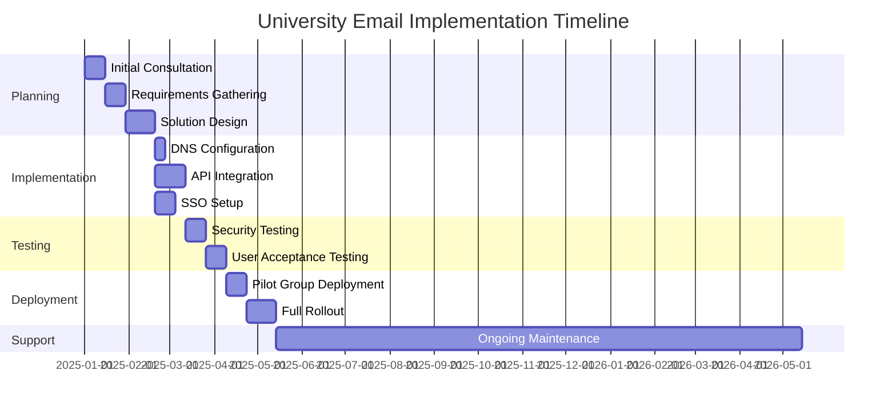
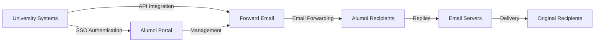

# Estudo de caso: como o Forward Email impulsiona soluções de e-mail para ex-alunos em universidades de ponta {#case-study-how-forward-email-powers-alumni-email-solutions-for-top-universities}


## Índice {#table-of-contents}

* [Prefácio](#foreword)
* [Economia de custos drástica com preços estáveis](#dramatic-cost-savings-with-stable-pricing)
  * [Poupança universitária no mundo real](#real-world-university-savings)
* [Desafio de e-mail de ex-alunos da universidade](#the-university-alumni-email-challenge)
  * [O valor da identidade de e-mail de ex-alunos](#the-value-of-alumni-email-identity)
  * [Soluções tradicionais não atendem às expectativas](#traditional-solutions-fall-short)
  * [A solução de encaminhamento de e-mail](#the-forward-email-solution)
* [Implementação Técnica: Como Funciona](#technical-implementation-how-it-works)
  * [Arquitetura central](#core-architecture)
  * [Integração com Sistemas Universitários](#integration-with-university-systems)
  * [Gestão orientada por API](#api-driven-management)
  * [Configuração e verificação de DNS](#dns-configuration-and-verification)
  * [Testes e Garantia de Qualidade](#testing-and-quality-assurance)
* [Cronograma de implementação](#implementation-timeline)
* [Processo de Implementação: Da Migração à Manutenção](#implementation-process-from-migration-to-maintenance)
  * [Avaliação e Planejamento Inicial](#initial-assessment-and-planning)
  * [Estratégia de Migração](#migration-strategy)
  * [Configuração e instalação técnica](#technical-setup-and-configuration)
  * [Design de experiência do usuário](#user-experience-design)
  * [Treinamento e Documentação](#training-and-documentation)
  * [Suporte e otimização contínuos](#ongoing-support-and-optimization)
* [Estudo de caso: Universidade de Cambridge](#case-study-university-of-cambridge)
  * [Desafio](#challenge)
  * [Solução](#solution)
  * [Resultados](#results)
* [Benefícios para Universidades e Ex-alunos](#benefits-for-universities-and-alumni)
  * [Para universidades](#for-universities)
  * [Para ex-alunos](#for-alumni)
  * [Taxas de adoção entre ex-alunos](#adoption-rates-among-alumni)
  * [Economia de custos em comparação com soluções anteriores](#cost-savings-compared-to-previous-solutions)
* [Considerações sobre segurança e privacidade](#security-and-privacy-considerations)
  * [Medidas de Proteção de Dados](#data-protection-measures)
  * [Estrutura de conformidade](#compliance-framework)
* [Desenvolvimentos futuros](#future-developments)
* [Conclusão](#conclusion)

## Prefácio {#foreword}

Criamos o serviço de encaminhamento de e-mail mais seguro, privado e flexível do mundo para universidades de prestígio e seus ex-alunos.

No cenário competitivo do ensino superior, manter conexões duradouras com ex-alunos não é apenas uma questão de tradição — é um imperativo estratégico. Uma das maneiras mais tangíveis pelas quais as universidades promovem essas conexões é por meio dos endereços de e-mail de ex-alunos, fornecendo aos graduados uma identidade digital que reflete sua herança acadêmica.

Na Forward Email, firmamos parcerias com algumas das instituições de ensino mais prestigiadas do mundo para revolucionar a forma como gerenciam os serviços de e-mail para ex-alunos. Nossa solução de encaminhamento de e-mails de nível empresarial agora alimenta os sistemas de e-mail para ex-alunos [Universidade de Cambridge](https://en.wikipedia.org/wiki/University_of_Cambridge), [Universidade de Maryland](https://en.wikipedia.org/wiki/University_of_Maryland,\_College_Park), [Universidade Tufts](https://en.wikipedia.org/wiki/Tufts_University) e [Faculdade Swarthmore](https://en.wikipedia.org/wiki/Swarthmore_College), atendendo coletivamente milhares de ex-alunos em todo o mundo.

Esta postagem do blog explora como nosso serviço de encaminhamento de e-mail [código aberto](https://en.wikipedia.org/wiki/Open-source_software), focado em privacidade, se tornou a solução preferida para essas instituições, as implementações técnicas que o tornam possível e o impacto transformador que ele teve na eficiência administrativa e na satisfação dos ex-alunos.

## Economia drástica de custos com preços estáveis {#dramatic-cost-savings-with-stable-pricing}

Os benefícios financeiros da nossa solução são substanciais, especialmente quando comparados aos preços continuamente crescentes dos provedores de e-mail tradicionais:

| Solução | Custo por ex-aluno (anual) | Custo para 100.000 ex-alunos | Aumentos de preços recentes |
| ------------------------------ | --------------------------------------------------------------------------------------------------------- | ----------------------- | ---------------------------------------------------------------------------------------------------------------------------------------------------------------------------------------- |
| Google Workspace para Empresas | $72 | $7,200,000 | • 2019: G Suite Basic de US$ 5 para US$ 6/mês (+20%)<br>• 2023: Planos flexíveis aumentaram 20%<br>• 2025: Business Plus de US$ 18 para US$ 26,40/mês (+47%) com recursos de IA |
| Google Workspace para Educação | Gratuito (Fundamentos da Educação)<br>US$ 3/aluno/ano (Educação Padrão)<br>US$ 5/aluno/ano (Educação Plus) | Grátis - $ 500.000 | • Descontos por volume: 5% para 100-499 licenças<br>• Descontos por volume: 10% para mais de 500 licenças<br>• Nível gratuito limitado aos serviços principais |
| Microsoft 365 Business | $60 | $6,000,000 | • 2023: Introdução de atualizações de preços semestrais<br>• 2025 (janeiro): Pessoal de US$ 6,99 para US$ 9,99/mês (+43%) com Copilot AI<br>• 2025 (abril): aumento de 5% nos compromissos anuais pagos mensalmente |
| Microsoft 365 Educação | Gratuito (A1)<br>$38-55/professor/ano (A3)<br>$65-96/professor/ano (A5) | Grátis - $ 96.000 | • Licenças de estudante geralmente incluídas nas compras do corpo docente<br>• Preços personalizados por meio de licenciamento por volume<br>• Nível gratuito limitado às versões da web |
| Exchange auto-hospedado | $45 | $4,500,000 | Os custos contínuos de manutenção e segurança continuam a aumentar |
| **Encaminhar e-mail corporativo** | **Fixo $ 250/mês** | **US$ 3.000/ano** | **Nenhum aumento de preço desde o lançamento** |

### Poupança universitária do mundo real {#real-world-university-savings}

Veja quanto nossas universidades parceiras economizam anualmente ao escolher o Forward Email em vez de provedores tradicionais:

| Universidade | Contagem de ex-alunos | Custo anual com o Google | Custo anual com encaminhamento de e-mail | Poupança Anual |
| ----------------------- | ------------ | ----------------------- | ------------------------------ | -------------- |
| Universidade de Cambridge | 30,000 | $90,000 | $3,000 | $87,000 |
| Faculdade Swarthmore | 5,000 | $15,000 | $3,000 | $12,000 |
| Universidade Tufts | 12,000 | $36,000 | $3,000 | $33,000 |
| Universidade de Maryland | 25,000 | $75,000 | $3,000 | $72,000 |

> \[!NOTE]
> O Forward Email Enterprise normalmente custa apenas US$ 250/mês, sem custo adicional por usuário, com limitações de taxa de API na lista de permissões, e o único custo adicional é o armazenamento, caso você precise de GB/TB adicionais para estudantes (+US$ 3 por 10 GB de armazenamento adicional). Também usamos unidades SSD NVMe para suporte rápido a IMAP/POP3/SMTP/CalDAV/CardDAV.

> \[!IMPORTANT]
> Ao contrário do Google e da Microsoft, que aumentaram repetidamente seus preços ao integrar recursos de IA que analisam seus dados, o Forward Email mantém preços estáveis com foco estrito na privacidade. Não utilizamos IA, não rastreamos padrões de uso e não armazenamos registros ou e-mails em disco (todo o processamento é feito na memória), garantindo total privacidade para as comunicações com seus ex-alunos.

Isso representa uma redução significativa de custos em comparação com as soluções tradicionais de hospedagem de e-mail — recursos que as universidades podem redirecionar para bolsas de estudo, pesquisas ou outras atividades de missão crítica. De acordo com uma análise de 2023 da Email Vendor Selection, as instituições de ensino estão cada vez mais buscando alternativas econômicas aos provedores de e-mail tradicionais, à medida que os preços continuam subindo com a integração de recursos de IA ([Seleção de Fornecedores por E-mail, 2023](https://www.emailvendorselection.com/email-service-provider-list/)).

## Desafio de e-mail para ex-alunos da universidade {#the-university-alumni-email-challenge}

Para as universidades, fornecer endereços de e-mail vitalícios a ex-alunos apresenta um conjunto único de desafios que as soluções de e-mail tradicionais têm dificuldade em resolver de forma eficaz. Conforme observado em uma discussão abrangente no ServerFault, universidades com grandes bases de usuários exigem soluções de e-mail especializadas que equilibrem desempenho, segurança e custo-benefício ([ServerFault, 2009](https://serverfault.com/questions/97364/what-is-the-best-mail-server-for-a-university-with-a-large-amount-of-users)).

### O valor da identidade de e-mail de ex-alunos {#the-value-of-alumni-email-identity}

Endereços de e-mail de ex-alunos (como `firstname.lastname@cl.cam.ac.uk` ou `username@terpalum.umd.edu`) desempenham várias funções importantes:

* Manter a conexão institucional e a identidade da marca
* Facilitar a comunicação contínua com a universidade
* Aumentar a credibilidade profissional dos graduados
* Apoiar o networking e a construção de comunidade entre ex-alunos
* Fornecer um ponto de contato estável e vitalício

Uma pesquisa da Tekade (2020) destaca que endereços de e-mail educacionais oferecem inúmeros benefícios aos ex-alunos, incluindo acesso a recursos acadêmicos, credibilidade profissional e descontos exclusivos em vários serviços ([Médio, 2020](https://medium.com/coders-capsule/top-20-benefits-of-having-an-educational-email-address-91a09795e05)).

> \[!TIP]
> Visite nosso novo diretório [AlumniEmail.com](https://alumniemail.com) para obter um recurso abrangente sobre serviços de e-mail para ex-alunos universitários, incluindo guias de configuração, práticas recomendadas e um diretório pesquisável de domínios de e-mail para ex-alunos. Ele serve como um hub central para todas as informações sobre e-mail para ex-alunos.

### Soluções tradicionais não atendem às expectativas {#traditional-solutions-fall-short}

Os sistemas de e-mail convencionais apresentam diversas limitações quando aplicados às necessidades de e-mail de ex-alunos:

* **Custo Proibitivo**: Modelos de licenciamento por usuário tornam-se financeiramente insustentáveis para grandes bases de ex-alunos
* **Carga Administrativa**: Gerenciar milhares ou milhões de contas exige recursos significativos de TI
* **Preocupações com a Segurança**: Manter a segurança de contas inativas aumenta a vulnerabilidade
* **Flexibilidade Limitada**: Sistemas rígidos não conseguem se adaptar às necessidades específicas de encaminhamento de e-mails de ex-alunos
* **Problemas de Privacidade**: Muitos provedores rastreiam o conteúdo de e-mails para fins publicitários

Uma discussão no Quora sobre manutenção de e-mail universitário revela que preocupações com segurança são um dos principais motivos pelos quais as universidades podem limitar ou cancelar endereços de e-mail de ex-alunos, já que contas não utilizadas podem ser vulneráveis a hackers e roubo de identidade ([Quora, 2011](https://www.quora.com/Is-there-any-cost-for-a-college-or-university-to-maintain-edu-e-mail-addresses)).

### A solução de encaminhamento de e-mail {#the-forward-email-solution}

Nossa abordagem aborda esses desafios por meio de um modelo fundamentalmente diferente:

* Encaminhamento de e-mails em vez de hospedagem
* Preço fixo em vez de custos por usuário
* Arquitetura de código aberto para transparência e segurança
* Design que prioriza a privacidade sem escaneamento de conteúdo
* Recursos especializados para gerenciamento de identidade universitária

## Implementação técnica: como funciona {#technical-implementation-how-it-works}

Nossa solução utiliza uma arquitetura técnica sofisticada, porém elegantemente simples, para fornecer encaminhamento de e-mail confiável e seguro em escala.

### Arquitetura principal {#core-architecture}

O sistema Forward Email consiste em vários componentes principais:

* Servidores MX distribuídos para alta disponibilidade
* Encaminhamento em tempo real sem armazenamento de mensagens
* Autenticação de e-mail abrangente
* Suporte a domínios e subdomínios personalizados
* Gerenciamento de contas baseado em API

De acordo com profissionais de TI da ServerFault, para universidades que buscam implementar suas próprias soluções de e-mail, o Postfix é recomendado como o melhor Agente de Transferência de E-mails (MTA), enquanto Courier ou Dovecot são preferíveis para acesso IMAP/POP3 ([ServerFault, 2009](https://serverfault.com/questions/97364/what-is-the-best-mail-server-for-a-university-with-a-large-amount-of-users)). No entanto, nossa solução elimina a necessidade de as universidades gerenciarem esses sistemas complexos por conta própria.

### Integração com Sistemas Universitários {#integration-with-university-systems}

Desenvolvemos caminhos de integração contínua com a infraestrutura universitária existente:

* Provisionamento automatizado por meio da integração [API RESTful](https://forwardemail.net/email-api)
* Opções de identidade visual personalizadas para portais universitários
* Gerenciamento flexível de alias para departamentos e organizações
* Operações em lote para uma administração eficiente

### Gerenciamento orientado por API {#api-driven-management}

Nosso [API RESTful](https://forwardemail.net/email-api) permite que universidades automatizem o gerenciamento de e-mail:

```javascript
// Example: Creating a new alumni email address
const response = await fetch('https://forwardemail.net/api/v1/domains/example.edu/aliases', {
  method: 'POST',
  headers: {
    'Content-Type': 'application/json',
    'Authorization': `Basic ${Buffer.from(YOUR_API_TOKEN + ":").toString('base64')}`
  },
  body: JSON.stringify({
    name: 'alumni.john.smith',
    recipients: ['johnsmith@gmail.com'],
    has_recipient_verification: true
  })
});
```

### Configuração e verificação de DNS {#dns-configuration-and-verification}

A configuração correta do DNS é essencial para a entrega de e-mails. Nossa equipe auxilia com:

* Configuração [DNS](https://en.wikipedia.org/wiki/Domain_Name_System) incluindo registros MX
* Implementação abrangente de segurança de e-mail usando nosso pacote [autenticação de e-mail](https://www.npmjs.com/package/mailauth) de código aberto, um canivete suíço para autenticação de e-mail que lida com:
* [SPF](https://en.wikipedia.org/wiki/Sender_Policy_Framework) (Estrutura de Política de Remetente) para evitar spoofing de e-mail
* [DKIM](https://en.wikipedia.org/wiki/DomainKeys_Identified_Mail) (E-mail Identificado por DomainKeys) para autenticação de e-mail
* [DMARC](https://en.wikipedia.org/wiki/Email_authentication) (Autenticação, Relatórios e Conformidade de Mensagens Baseadas em Domínio) para aplicação de políticas
* [MTA-STS](https://en.wikipedia.org/wiki/Opportunistic_TLS) (Segurança de Transporte Estrita SMTP MTA) para aplicar criptografia TLS
* [ARC](https://en.wikipedia.org/wiki/DomainKeys_Identified_Mail#Authenticated_Received_Chain) (Cadeia Recebida Autenticada) para manter a autenticação quando as mensagens são encaminhadas
* [SRS](https://en.wikipedia.org/wiki/Sender_Rewriting_Scheme) (Esquema de Reescrita de Remetente) para preservar a validação SPF durante o encaminhamento
* [BIMI](https://en.wikipedia.org/wiki/Email_authentication) (Indicadores de Marca para Identificação de Mensagens) para exibição de logotipo em clientes de e-mail de suporte
* Verificação de registro DNS TXT para propriedade de domínio

O pacote `mailauth` (<http://npmjs.com/package/mailauth>) é uma solução totalmente de código aberto que gerencia todos os aspectos da autenticação de e-mail em uma única biblioteca integrada. Diferentemente das soluções proprietárias, essa abordagem garante transparência, atualizações regulares de segurança e controle total sobre o processo de autenticação de e-mail.

### Testes e Garantia de Qualidade {#testing-and-quality-assurance}

Antes da implantação completa, realizamos testes rigorosos:

* Teste de entrega de e-mail de ponta a ponta
* Teste de carga para cenários de alto volume
* Teste de penetração de segurança
* Validação de integração de API
* Teste de aceitação do usuário com representantes de ex-alunos

## Cronograma de implementação do {#implementation-timeline}



Processo de implementação do ##: da migração à manutenção {#implementation-process-from-migration-to-maintenance}

Nosso processo de implementação estruturado garante uma transição tranquila para universidades que adotam nossa solução.

### Avaliação e Planejamento Inicial {#initial-assessment-and-planning}

Começamos com uma avaliação abrangente do atual sistema de e-mail da universidade, do banco de dados de ex-alunos e dos requisitos técnicos. Esta fase inclui:

* Entrevistas com stakeholders de TI, relações com ex-alunos e administração
* Auditoria técnica da infraestrutura de e-mail existente
* Mapeamento de dados para registros de ex-alunos
* Revisão de segurança e conformidade
* Cronograma do projeto e desenvolvimento de marcos

### Estratégia de Migração {#migration-strategy}

Com base na avaliação, desenvolvemos uma estratégia de migração personalizada que minimiza as interrupções e garante a integridade completa dos dados:

* Abordagem de migração em fases por coortes de ex-alunos
* Operação de sistemas paralelos durante a transição
* Protocolos abrangentes de validação de dados
* Procedimentos de fallback para quaisquer problemas de migração
* Plano de comunicação claro para todas as partes interessadas

### Configuração e instalação técnica {#technical-setup-and-configuration}

Nossa equipe técnica cuida de todos os aspectos da configuração do sistema:

* Configuração e verificação de DNS
* Integração de API com sistemas universitários
* Desenvolvimento de portal personalizado com a marca da universidade
* Configuração de autenticação de e-mail (SPF, DKIM, DMARC)

### Design de experiência do usuário {#user-experience-design}

Trabalhamos em estreita colaboração com universidades para criar interfaces intuitivas para administradores e ex-alunos:

* Portais de e-mail de ex-alunos com marca personalizada
* Gerenciamento simplificado de encaminhamento de e-mails
* Designs responsivos para dispositivos móveis
* Conformidade com as normas de acessibilidade
* Suporte multilíngue quando necessário

### Treinamento e Documentação {#training-and-documentation}

O treinamento abrangente garante que todas as partes interessadas possam usar o sistema de forma eficaz:

* Sessões de treinamento para administradores
* Documentação técnica para a equipe de TI
* Guias do usuário para ex-alunos
* Tutoriais em vídeo para tarefas comuns
* Desenvolvimento de base de conhecimento

### Suporte e otimização contínuos {#ongoing-support-and-optimization}

Nossa parceria continua muito além da implementação:

* Suporte técnico 24 horas por dia, 7 dias por semana
* Atualizações regulares do sistema e patches de segurança
* Monitoramento e otimização de desempenho
* Consultoria sobre as melhores práticas de e-mail
* Análise e relatórios de dados

## Estudo de caso: Universidade de Cambridge {#case-study-university-of-cambridge}

A Universidade de Cambridge buscou uma solução para fornecer endereços de e-mail @cam.ac.uk aos ex-alunos, reduzindo ao mesmo tempo os custos e a sobrecarga de TI.

### Desafio {#challenge}

Cambridge enfrentou vários desafios com seu antigo sistema de e-mail de ex-alunos:

* Altos custos operacionais para manter uma infraestrutura de e-mail separada
* Carga administrativa de gerenciar milhares de contas
* Preocupações com a segurança de contas inativas
* Integração limitada com sistemas de banco de dados de ex-alunos
* Aumento dos requisitos de armazenamento

### Solução {#solution}

A Forward Email implementou uma solução abrangente:

* Encaminhamento de e-mail para todos os endereços de ex-alunos @cam.ac.uk
* Portal personalizado para autoatendimento de ex-alunos
* Integração de API com o banco de dados de ex-alunos de Cambridge
* Implementação abrangente de segurança de e-mail

### Resultados {#results}

A implementação proporcionou benefícios significativos:

* Redução substancial de custos em comparação com a solução anterior
* Confiabilidade de 99,9% na entrega de e-mails
* Administração simplificada por meio da automação
* Segurança aprimorada com autenticação de e-mail moderna
* Feedback positivo de ex-alunos sobre a usabilidade do sistema

## Benefícios para Universidades e Ex-alunos {#benefits-for-universities-and-alumni}

Nossa solução oferece benefícios tangíveis tanto para as instituições quanto para seus graduados.

### Para universidades {#for-universities}

* **Custo-benefício**: Preço fixo independentemente do número de ex-alunos
* **Simplicidade administrativa**: Gerenciamento automatizado por meio de API
* **Segurança aprimorada**: Autenticação de e-mail abrangente
* **Consistência da marca**: Endereços de e-mail institucionais vitalícios
* **Engajamento de ex-alunos**: Conexões fortalecidas por meio de serviço contínuo

De acordo com a BulkSignature (2023), as plataformas de e-mail para instituições educacionais oferecem benefícios significativos, incluindo custo-benefício por meio de planos gratuitos ou de baixo custo, eficiência de tempo por meio de recursos de comunicação em massa e recursos de rastreamento para monitorar a entrega e o engajamento de e-mails ([Assinatura em massa, 2023](https://bulksignature.com/blog/5-best-email-platforms-for-educational-institutions/)).

### Para ex-alunos {#for-alumni}

* **Identidade Profissional**: Endereço de e-mail de universidade de prestígio
* **Continuidade de E-mail**: Encaminhamento para qualquer e-mail pessoal
* **Proteção de Privacidade**: Sem escaneamento de conteúdo ou mineração de dados
* **Gerenciamento Simplificado**: Atualizações fáceis para destinatários
* **Segurança Aprimorada**: Autenticação de e-mail moderna

Uma pesquisa do International Journal of Education & Literacy Studies destaca a importância da comunicação adequada por e-mail em ambientes acadêmicos, observando que a alfabetização por e-mail é uma habilidade crucial tanto para alunos quanto para ex-alunos em contextos profissionais ([IJELS, 2021](https://files.eric.ed.gov/fulltext/EJ1319324.pdf)).

### Taxas de adoção entre ex-alunos {#adoption-rates-among-alumni}

As universidades relatam altas taxas de adoção e satisfação entre suas comunidades de ex-alunos.

### Economia de custos em comparação com soluções anteriores {#cost-savings-compared-to-previous-solutions}

O impacto financeiro foi substancial, com universidades relatando economias de custos significativas em comparação com suas soluções de e-mail anteriores.

## Considerações de segurança e privacidade {#security-and-privacy-considerations}

Para instituições educacionais, proteger dados de ex-alunos não é apenas uma boa prática — geralmente é uma exigência legal sob regulamentações como o GDPR na Europa.

### Medidas de Proteção de Dados {#data-protection-measures}

Nossa solução incorpora várias camadas de segurança:

* Criptografia de ponta a ponta para todo o tráfego de e-mail
* Sem armazenamento de conteúdo de e-mail em nossos servidores
* Auditorias de segurança e testes de penetração regulares
* Conformidade com os padrões internacionais de proteção de dados
* Código transparente e de código aberto para verificação de segurança

> \[!WARNING]
> Muitos provedores de e-mail verificam o conteúdo dos e-mails para fins publicitários ou para treinar modelos de IA. Essa prática levanta sérias preocupações com a privacidade, especialmente para comunicações profissionais e acadêmicas. O Forward Email nunca verifica o conteúdo dos e-mails e processa todos os e-mails armazenados na memória para garantir total privacidade.

### Estrutura de conformidade {#compliance-framework}

Mantemos estrita conformidade com as regulamentações relevantes:

* Conformidade com o RGPD para instituições europeias
* Certificação SOC 2 Tipo II
* Avaliações anuais de segurança
* Contrato de Processamento de Dados (DPA) disponível em [forwardemail.net/dpa](https://forwardemail.net/dpa)
* Atualizações regulares de conformidade conforme a evolução das regulamentações

## Desenvolvimentos Futuros {#future-developments}

Continuamos aprimorando nossa solução de e-mail para ex-alunos com novos recursos e funcionalidades:

* Análises aprimoradas para administradores universitários
* Proteções antiphishing avançadas
* Recursos de API expandidos para integração mais profunda
* Opções de autenticação adicionais

## Conclusão {#conclusion}

O Forward Email revolucionou a forma como as universidades fornecem e gerenciam serviços de e-mail para ex-alunos. Ao substituir a hospedagem de e-mail complexa e cara por um encaminhamento de e-mail elegante e seguro, permitimos que as instituições ofereçam endereços de e-mail vitalícios a todos os ex-alunos, reduzindo drasticamente os custos e as despesas administrativas.

Nossas parcerias com instituições de prestígio como Cambridge, Maryland, Tufts e Swarthmore demonstram a eficácia da nossa abordagem em diversos ambientes educacionais. À medida que as universidades enfrentam uma pressão crescente para manter a conexão com seus ex-alunos e, ao mesmo tempo, controlar custos, nossa solução oferece uma alternativa atraente aos sistemas de e-mail tradicionais.



Para universidades interessadas em explorar como o Forward Email pode transformar seus serviços de e-mail para ex-alunos, entre em contato com nossa equipe em <support@forwardemail.net> ou visite [forwardemail.net](https://forwardemail.net) para saber mais sobre nossas soluções empresariais.