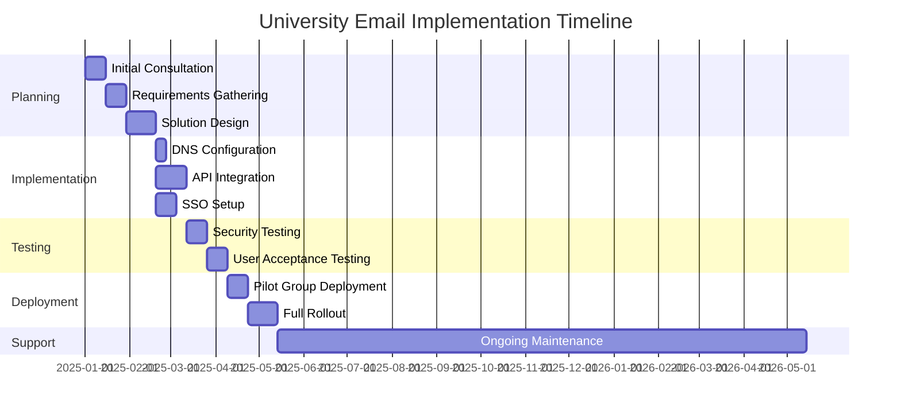
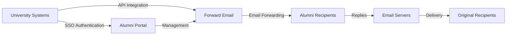

# Estudo de Caso: Como o Forward Email Potencializa Soluções de Email para Ex-Alunos das Principais Universidades {#case-study-how-forward-email-powers-alumni-email-solutions-for-top-universities}


## Índice {#table-of-contents}

* [Prefácio](#foreword)
* [Economias Dramáticas com Preços Estáveis](#dramatic-cost-savings-with-stable-pricing)
  * [Economias Reais em Universidades](#real-world-university-savings)
* [O Desafio do Email para Ex-Alunos Universitários](#the-university-alumni-email-challenge)
  * [O Valor da Identidade de Email dos Ex-Alunos](#the-value-of-alumni-email-identity)
  * [Soluções Tradicionais Não São Suficientes](#traditional-solutions-fall-short)
  * [A Solução Forward Email](#the-forward-email-solution)
* [Implementação Técnica: Como Funciona](#technical-implementation-how-it-works)
  * [Arquitetura Principal](#core-architecture)
  * [Integração com Sistemas Universitários](#integration-with-university-systems)
  * [Gerenciamento via API](#api-driven-management)
  * [Configuração e Verificação de DNS](#dns-configuration-and-verification)
  * [Testes e Garantia de Qualidade](#testing-and-quality-assurance)
* [Cronograma de Implementação](#implementation-timeline)
* [Processo de Implementação: Da Migração à Manutenção](#implementation-process-from-migration-to-maintenance)
  * [Avaliação Inicial e Planejamento](#initial-assessment-and-planning)
  * [Estratégia de Migração](#migration-strategy)
  * [Configuração Técnica](#technical-setup-and-configuration)
  * [Design da Experiência do Usuário](#user-experience-design)
  * [Treinamento e Documentação](#training-and-documentation)
  * [Suporte Contínuo e Otimização](#ongoing-support-and-optimization)
* [Estudo de Caso: Universidade de Cambridge](#case-study-university-of-cambridge)
  * [Desafio](#challenge)
  * [Solução](#solution)
  * [Resultados](#results)
* [Benefícios para Universidades e Ex-Alunos](#benefits-for-universities-and-alumni)
  * [Para Universidades](#for-universities)
  * [Para Ex-Alunos](#for-alumni)
  * [Taxas de Adoção entre Ex-Alunos](#adoption-rates-among-alumni)
  * [Economias em Relação às Soluções Anteriores](#cost-savings-compared-to-previous-solutions)
* [Considerações de Segurança e Privacidade](#security-and-privacy-considerations)
  * [Medidas de Proteção de Dados](#data-protection-measures)
  * [Estrutura de Conformidade](#compliance-framework)
* [Desenvolvimentos Futuros](#future-developments)
* [Conclusão](#conclusion)


## Prefácio {#foreword}

Construímos o serviço de encaminhamento de email mais seguro, privado e flexível do mundo para universidades de prestígio e seus ex-alunos.

No cenário competitivo do ensino superior, manter conexões ao longo da vida com os ex-alunos não é apenas uma questão de tradição — é uma imperativa estratégica. Uma das formas mais tangíveis pelas quais as universidades fomentam essas conexões é por meio de endereços de email para ex-alunos, fornecendo aos graduados uma identidade digital que reflete sua herança acadêmica.

Na Forward Email, fizemos parceria com algumas das instituições educacionais mais prestigiadas do mundo para revolucionar a forma como gerenciam os serviços de email para ex-alunos. Nossa solução de encaminhamento de email de nível empresarial agora alimenta os sistemas de email para ex-alunos da [University of Cambridge](https://en.wikipedia.org/wiki/University_of_Cambridge), da [University of Maryland](https://en.wikipedia.org/wiki/University_of_Maryland,_College_Park), da [Tufts University](https://en.wikipedia.org/wiki/Tufts_University) e do [Swarthmore College](https://en.wikipedia.org/wiki/Swarthmore_College), atendendo coletivamente milhares de ex-alunos em todo o mundo.

Este post no blog explora como nosso serviço de encaminhamento de email [open-source](https://en.wikipedia.org/wiki/Open-source_software), focado em privacidade, se tornou a solução preferida por essas instituições, as implementações técnicas que o tornam possível e o impacto transformador que teve tanto na eficiência administrativa quanto na satisfação dos ex-alunos.


## Economias Dramáticas com Preços Estáveis {#dramatic-cost-savings-with-stable-pricing}
Os benefícios financeiros da nossa solução são substanciais, especialmente quando comparados aos preços continuamente crescentes dos provedores tradicionais de e-mail:

| Solução                       | Custo por Aluno (Anual)                                                                                   | Custo para 100.000 Alunos | Aumentos Recentes de Preço                                                                                                                                                              |
| ------------------------------ | --------------------------------------------------------------------------------------------------------- | ------------------------- | ---------------------------------------------------------------------------------------------------------------------------------------------------------------------------------------- |
| Google Workspace for Business  | $72                                                                                                       | $7.200.000                | • 2019: G Suite Basic de $5 para $6/mês (+20%)<br>• 2023: Planos flexíveis aumentaram 20%<br>• 2025: Business Plus de $18 para $26,40/mês (+47%) com recursos de IA                    |
| Google Workspace for Education | Grátis (Education Fundamentals)<br>$3/aluno/ano (Education Standard)<br>$5/aluno/ano (Education Plus)     | Grátis - $500.000         | • Descontos por volume: 5% para 100-499 licenças<br>• Descontos por volume: 10% para 500+ licenças<br>• Camada gratuita limitada aos serviços principais                                |
| Microsoft 365 Business         | $60                                                                                                       | $6.000.000                | • 2023: Introduziu atualizações de preço semestrais<br>• 2025 (Jan): Personal de $6,99 para $9,99/mês (+43%) com Copilot IA<br>• 2025 (Abr): aumento de 5% em compromissos anuais pagos mensalmente |
| Microsoft 365 Education        | Grátis (A1)<br>$38-55/docente/ano (A3)<br>$65-96/docente/ano (A5)                                         | Grátis - $96.000          | • Licenças para estudantes frequentemente incluídas com compras para docentes<br>• Preços personalizados via licenciamento por volume<br>• Camada gratuita limitada às versões web       |
| Exchange Auto-Hospedado        | $45                                                                                                       | $4.500.000                | Custos contínuos de manutenção e segurança continuam a aumentar                                                                                                                         |
| **Forward Email Enterprise**   | **$250 fixos/mês**                                                                                        | **$3.000/ano**            | **Sem aumentos de preço desde o lançamento**                                                                                                                                             |

### Economia Real em Universidades {#real-world-university-savings}

Veja quanto nossas universidades parceiras economizam anualmente ao escolher o Forward Email em vez dos provedores tradicionais:

| Universidade             | Número de Alunos | Custo Anual com Google | Custo Anual com Forward Email | Economia Anual |
| ----------------------- | ---------------- | ---------------------- | ----------------------------- | ------------- |
| University of Cambridge | 30.000           | $90.000                | $3.000                        | $87.000       |
| Swarthmore College      | 5.000            | $15.000                | $3.000                        | $12.000       |
| Tufts University        | 12.000           | $36.000                | $3.000                        | $33.000       |
| University of Maryland  | 25.000           | $75.000                | $3.000                        | $72.000       |

> \[!NOTE]
> O Forward Email enterprise normalmente custa apenas $250/mês, sem custo extra por usuário, limitações de taxa de API na lista branca, e o único custo adicional é o armazenamento caso você precise de GB/TB adicionais para estudantes (+$3 por 10 GB adicionais de armazenamento). Usamos drives NVMe SSD para suporte rápido a IMAP/POP3/SMTP/CalDAV/CardDAV também.
> \[!IMPORTANT]
> Ao contrário do Google e da Microsoft, que aumentaram repetidamente seus preços enquanto integravam recursos de IA que analisam seus dados, o Forward Email mantém preços estáveis com um foco rigoroso em privacidade. Não usamos IA, não rastreamos padrões de uso e não armazenamos logs ou e-mails em disco (todo o processamento é feito na memória), garantindo privacidade completa para suas comunicações com ex-alunos.

Isso representa uma redução significativa de custos em comparação com soluções tradicionais de hospedagem de e-mail — fundos que as universidades podem redirecionar para bolsas de estudo, pesquisa ou outras atividades críticas para a missão. De acordo com uma análise de 2023 da Email Vendor Selection, instituições educacionais estão cada vez mais buscando alternativas econômicas aos provedores tradicionais de e-mail à medida que os preços continuam a subir com a integração de recursos de IA ([Email Vendor Selection, 2023](https://www.emailvendorselection.com/email-service-provider-list/)).


## O Desafio do E-mail para Ex-Alunos Universitários {#the-university-alumni-email-challenge}

Para as universidades, fornecer endereços de e-mail vitalícios para ex-alunos apresenta um conjunto único de desafios que as soluções tradicionais de e-mail têm dificuldade em resolver de forma eficaz. Conforme observado em uma discussão abrangente no ServerFault, universidades com grandes bases de usuários requerem soluções especializadas de e-mail que equilibrem desempenho, segurança e custo-benefício ([ServerFault, 2009](https://serverfault.com/questions/97364/what-is-the-best-mail-server-for-a-university-with-a-large-amount-of-users)).

### O Valor da Identidade de E-mail dos Ex-Alunos {#the-value-of-alumni-email-identity}

Endereços de e-mail de ex-alunos (como `firstname.lastname@cl.cam.ac.uk` ou `username@terpalum.umd.edu`) cumprem várias funções importantes:

* Manter a conexão institucional e a identidade da marca
* Facilitar a comunicação contínua com a universidade
* Aumentar a credibilidade profissional dos graduados
* Apoiar o networking e a construção de comunidade entre ex-alunos
* Fornecer um ponto de contato estável e vitalício

Pesquisas de Tekade (2020) destacam que endereços de e-mail educacionais oferecem inúmeros benefícios aos ex-alunos, incluindo acesso a recursos acadêmicos, credibilidade profissional e descontos exclusivos em vários serviços ([Medium, 2020](https://medium.com/coders-capsule/top-20-benefits-of-having-an-educational-email-address-91a09795e05)).

> \[!TIP]
> Visite nosso novo diretório [AlumniEmail.com](https://alumniemail.com) para um recurso abrangente sobre serviços de e-mail para ex-alunos universitários, incluindo guias de configuração, melhores práticas e um diretório pesquisável de domínios de e-mail para ex-alunos. Serve como um hub central para todas as informações sobre e-mail para ex-alunos.

### Soluções Tradicionais Não São Suficientes {#traditional-solutions-fall-short}

Sistemas convencionais de e-mail apresentam várias limitações quando aplicados às necessidades de e-mail para ex-alunos:

* **Custo Proibitivo**: Modelos de licenciamento por usuário tornam-se financeiramente insustentáveis para grandes bases de ex-alunos
* **Carga Administrativa**: Gerenciar milhares ou milhões de contas requer recursos significativos de TI
* **Preocupações de Segurança**: Manter a segurança de contas inativas aumenta a vulnerabilidade
* **Flexibilidade Limitada**: Sistemas rígidos não conseguem se adaptar às necessidades únicas do encaminhamento de e-mail para ex-alunos
* **Questões de Privacidade**: Muitos provedores escaneiam o conteúdo do e-mail para fins publicitários

Uma discussão no Quora sobre manutenção de e-mail universitário revela que preocupações de segurança são uma das principais razões pelas quais universidades podem limitar ou cancelar endereços de e-mail para ex-alunos, já que contas não utilizadas podem ser vulneráveis a hackers e roubo de identidade ([Quora, 2011](https://www.quora.com/Is-there-any-cost-for-a-college-or-university-to-maintain-edu-e-mail-addresses)).

### A Solução Forward Email {#the-forward-email-solution}

Nossa abordagem resolve esses desafios por meio de um modelo fundamentalmente diferente:

* Encaminhamento de e-mail em vez de hospedagem
* Preço fixo em vez de custos por usuário
* Arquitetura open-source para transparência e segurança
* Design com foco em privacidade, sem escaneamento de conteúdo
* Recursos especializados para gestão da identidade universitária


## Implementação Técnica: Como Funciona {#technical-implementation-how-it-works}
Nossa solução utiliza uma arquitetura técnica sofisticada, porém elegantemente simples, para oferecer encaminhamento de e-mail confiável e seguro em larga escala.

### Arquitetura Principal {#core-architecture}

O sistema Forward Email consiste em vários componentes-chave:

* Servidores MX distribuídos para alta disponibilidade
* Encaminhamento em tempo real sem armazenamento de mensagens
* Autenticação de e-mail abrangente
* Suporte a domínios personalizados e subdomínios
* Gerenciamento de contas orientado por API

De acordo com profissionais de TI no ServerFault, para universidades que buscam implementar suas próprias soluções de e-mail, o Postfix é recomendado como o melhor Agente de Transferência de Correio (MTA), enquanto Courier ou Dovecot são preferidos para acesso IMAP/POP3 ([ServerFault, 2009](https://serverfault.com/questions/97364/what-is-the-best-mail-server-for-a-university-with-a-large-amount-of-users)). No entanto, nossa solução elimina a necessidade de as universidades gerenciarem esses sistemas complexos por conta própria.

### Integração com Sistemas Universitários {#integration-with-university-systems}

Desenvolvemos caminhos de integração perfeitos com a infraestrutura universitária existente:

* Provisionamento automatizado através da integração com [RESTful API](https://forwardemail.net/email-api)
* Opções de personalização de marca para portais universitários
* Gerenciamento flexível de aliases para departamentos e organizações
* Operações em lote para administração eficiente

### Gerenciamento Orientado por API {#api-driven-management}

Nossa [RESTful API](https://forwardemail.net/email-api) permite que universidades automatizem o gerenciamento de e-mails:

```javascript
// Exemplo: Criando um novo endereço de e-mail para ex-alunos
const response = await fetch('https://forwardemail.net/api/v1/domains/example.edu/aliases', {
  method: 'POST',
  headers: {
    'Content-Type': 'application/json',
    'Authorization': `Basic ${Buffer.from(YOUR_API_TOKEN + ":").toString('base64')}`
  },
  body: JSON.stringify({
    name: 'alumni.john.smith',
    recipients: ['johnsmith@gmail.com'],
    has_recipient_verification: true
  })
});
```

### Configuração e Verificação de DNS {#dns-configuration-and-verification}

A configuração correta do DNS é crítica para a entrega de e-mails. Nossa equipe auxilia com:

* Configuração de [DNS](https://en.wikipedia.org/wiki/Domain_Name_System), incluindo registros MX
* Implementação abrangente de segurança de e-mail usando nosso pacote open-source [mailauth](https://www.npmjs.com/package/mailauth), uma ferramenta multifuncional para autenticação de e-mail que gerencia:
  * [SPF](https://en.wikipedia.org/wiki/Sender_Policy_Framework) (Sender Policy Framework) para prevenir falsificação de e-mails
  * [DKIM](https://en.wikipedia.org/wiki/DomainKeys_Identified_Mail) (DomainKeys Identified Mail) para autenticação de e-mails
  * [DMARC](https://en.wikipedia.org/wiki/Email_authentication) (Domain-based Message Authentication, Reporting & Conformance) para aplicação de políticas
  * [MTA-STS](https://en.wikipedia.org/wiki/Opportunistic_TLS) (SMTP MTA Strict Transport Security) para impor criptografia TLS
  * [ARC](https://en.wikipedia.org/wiki/DomainKeys_Identified_Mail#Authenticated_Received_Chain) (Authenticated Received Chain) para manter a autenticação quando mensagens são encaminhadas
  * [SRS](https://en.wikipedia.org/wiki/Sender_Rewriting_Scheme) (Sender Rewriting Scheme) para preservar a validação SPF durante o encaminhamento
  * [BIMI](https://en.wikipedia.org/wiki/Email_authentication) (Brand Indicators for Message Identification) para exibição de logotipo em clientes de e-mail compatíveis
* Verificação de propriedade do domínio via registro TXT do DNS

O pacote `mailauth` (<http://npmjs.com/package/mailauth>) é a solução totalmente open-source que gerencia todos os aspectos da autenticação de e-mail em uma biblioteca integrada. Diferentemente de soluções proprietárias, essa abordagem garante transparência, atualizações regulares de segurança e controle completo sobre o processo de autenticação de e-mail.

### Testes e Garantia de Qualidade {#testing-and-quality-assurance}

Antes da implantação completa, realizamos testes rigorosos:

* Testes de entrega de e-mail ponta a ponta
* Testes de carga para cenários de alto volume
* Testes de penetração de segurança
* Validação de integração da API
* Testes de aceitação do usuário com representantes de ex-alunos
## Cronograma de Implementação {#implementation-timeline}


```mermaid
gantt
    title University Email Implementation Timeline
    dateFormat  YYYY-MM-DD
    section Planning
    Initial Consultation           :a1, 2025-01-01, 14d
    Requirements Gathering         :a2, after a1, 14d
    Solution Design                :a3, after a2, 21d
    section Implementation
    DNS Configuration              :b1, after a3, 7d
    API Integration                :b2, after a3, 21d
    SSO Setup                      :b3, after a3, 14d
    section Testing
    Security Testing               :c1, after b1 b2 b3, 14d
    User Acceptance Testing        :c2, after c1, 14d
    section Deployment
    Pilot Group Deployment         :d1, after c2, 14d
    Full Rollout                   :d2, after d1, 21d
    section Support
    Ongoing Maintenance            :e1, after d2, 365d
```


## Processo de Implementação: Da Migração à Manutenção {#implementation-process-from-migration-to-maintenance}

Nosso processo estruturado de implementação garante uma transição suave para as universidades que adotam nossa solução.

### Avaliação Inicial e Planejamento {#initial-assessment-and-planning}

Começamos com uma avaliação abrangente do sistema de email atual da universidade, banco de dados de ex-alunos e requisitos técnicos. Esta fase inclui:

* Entrevistas com partes interessadas de TI, relações com ex-alunos e administração
* Auditoria técnica da infraestrutura de email existente
* Mapeamento de dados para registros de ex-alunos
* Revisão de segurança e conformidade
* Desenvolvimento do cronograma do projeto e marcos

### Estratégia de Migração {#migration-strategy}

Com base na avaliação, desenvolvemos uma estratégia de migração personalizada que minimiza a interrupção enquanto garante a integridade completa dos dados:

* Abordagem de migração faseada por coortes de ex-alunos
* Operação de sistemas paralelos durante a transição
* Protocolos abrangentes de validação de dados
* Procedimentos de contingência para quaisquer problemas de migração
* Plano de comunicação claro para todas as partes interessadas

### Configuração Técnica e Implementação {#technical-setup-and-configuration}

Nossa equipe técnica cuida de todos os aspectos da configuração do sistema:

* Configuração e verificação de DNS
* Integração de API com sistemas da universidade
* Desenvolvimento de portal personalizado com a marca da universidade
* Configuração de autenticação de email (SPF, DKIM, DMARC)

### Design da Experiência do Usuário {#user-experience-design}

Trabalhamos em estreita colaboração com as universidades para criar interfaces intuitivas para administradores e ex-alunos:

* Portais de email para ex-alunos com marca personalizada
* Gestão simplificada de encaminhamento de email
* Designs responsivos para dispositivos móveis
* Conformidade com acessibilidade
* Suporte multilíngue onde necessário

### Treinamento e Documentação {#training-and-documentation}

Treinamento abrangente garante que todas as partes interessadas possam usar o sistema efetivamente:

* Sessões de treinamento para administradores
* Documentação técnica para equipe de TI
* Guias do usuário para ex-alunos
* Tutoriais em vídeo para tarefas comuns
* Desenvolvimento de base de conhecimento

### Suporte Contínuo e Otimização {#ongoing-support-and-optimization}

Nossa parceria continua muito além da implementação:

* Suporte técnico 24/7
* Atualizações regulares do sistema e patches de segurança
* Monitoramento e otimização de desempenho
* Consultoria sobre melhores práticas de email
* Análise de dados e relatórios


## Estudo de Caso: Universidade de Cambridge {#case-study-university-of-cambridge}

A Universidade de Cambridge buscava uma solução para fornecer endereços de email @cam.ac.uk para ex-alunos, reduzindo a sobrecarga e os custos de TI.

### Desafio {#challenge}

Cambridge enfrentava vários desafios com seu sistema anterior de email para ex-alunos:

* Altos custos operacionais para manter infraestrutura de email separada
* Carga administrativa para gerenciar milhares de contas
* Preocupações de segurança com contas inativas
* Integração limitada com sistemas de banco de dados de ex-alunos
* Crescente necessidade de armazenamento

### Solução {#solution}

Forward Email implementou uma solução abrangente:

* Encaminhamento de email para todos os endereços de ex-alunos @cam.ac.uk
* Portal personalizado para autoatendimento dos ex-alunos
* Integração de API com o banco de dados de ex-alunos de Cambridge
* Implementação completa de segurança de email

### Resultados {#results}

A implementação trouxe benefícios significativos:
* Redução substancial de custos em comparação com a solução anterior
* Confiabilidade de entrega de e-mails de 99,9%
* Administração simplificada por meio de automação
* Segurança aprimorada com autenticação moderna de e-mails
* Feedback positivo dos ex-alunos sobre a usabilidade do sistema


## Benefícios para Universidades e Ex-Alunos {#benefits-for-universities-and-alumni}

Nossa solução oferece benefícios tangíveis tanto para as instituições quanto para seus graduados.

### Para Universidades {#for-universities}

* **Eficiência de Custos**: Preço fixo independentemente do número de ex-alunos
* **Simplicidade Administrativa**: Gestão automatizada via API
* **Segurança Aprimorada**: Autenticação completa de e-mails
* **Consistência da Marca**: Endereços de e-mail institucionais vitalícios
* **Engajamento dos Ex-Alunos**: Fortalecimento das conexões por meio do serviço contínuo

De acordo com BulkSignature (2023), plataformas de e-mail para instituições educacionais oferecem benefícios significativos, incluindo custo-benefício por meio de planos gratuitos ou de baixo custo, eficiência de tempo por meio de capacidades de comunicação em massa e recursos de rastreamento para monitorar a entrega e o engajamento dos e-mails ([BulkSignature, 2023](https://bulksignature.com/blog/5-best-email-platforms-for-educational-institutions/)).

### Para Ex-Alunos {#for-alumni}

* **Identidade Profissional**: Endereço de e-mail da universidade de prestígio
* **Continuidade do E-mail**: Encaminhamento para qualquer e-mail pessoal
* **Proteção de Privacidade**: Sem escaneamento de conteúdo ou mineração de dados
* **Gestão Simplificada**: Atualizações fáceis de destinatários
* **Segurança Aprimorada**: Autenticação moderna de e-mails

Pesquisas do International Journal of Education & Literacy Studies destacam a importância da comunicação adequada por e-mail em ambientes acadêmicos, observando que a literacia em e-mails é uma habilidade crucial tanto para estudantes quanto para ex-alunos em contextos profissionais ([IJELS, 2021](https://files.eric.ed.gov/fulltext/EJ1319324.pdf)).

### Taxas de Adoção Entre Ex-Alunos {#adoption-rates-among-alumni}

As universidades relatam altas taxas de adoção e satisfação entre suas comunidades de ex-alunos.

### Economia de Custos em Comparação com Soluções Anteriores {#cost-savings-compared-to-previous-solutions}

O impacto financeiro tem sido substancial, com universidades relatando economias significativas em comparação com suas soluções anteriores de e-mail.


## Considerações de Segurança e Privacidade {#security-and-privacy-considerations}

Para instituições educacionais, proteger os dados dos ex-alunos não é apenas uma boa prática — muitas vezes é uma exigência legal sob regulamentos como o GDPR na Europa.

### Medidas de Proteção de Dados {#data-protection-measures}

Nossa solução incorpora múltiplas camadas de segurança:

* Criptografia de ponta a ponta para todo o tráfego de e-mails
* Nenhum armazenamento do conteúdo dos e-mails em nossos servidores
* Auditorias regulares de segurança e testes de penetração
* Conformidade com padrões internacionais de proteção de dados
* Código transparente e open-source para verificação de segurança

> \[!WARNING]
> Muitos provedores de e-mail escaneiam o conteúdo dos e-mails para fins publicitários ou para treinar modelos de IA. Essa prática levanta sérias preocupações de privacidade, especialmente para comunicações profissionais e acadêmicas. Forward Email nunca escaneia o conteúdo dos e-mails e processa todos os e-mails em memória para garantir total privacidade.

### Estrutura de Conformidade {#compliance-framework}

Mantemos conformidade rigorosa com os regulamentos relevantes:

* Conformidade com GDPR para instituições europeias
* Certificação SOC 2 Tipo II
* Avaliações anuais de segurança
* Acordo de Processamento de Dados (DPA) disponível em [forwardemail.net/dpa](https://forwardemail.net/dpa)
* Atualizações regulares de conformidade conforme a evolução dos regulamentos


## Desenvolvimentos Futuros {#future-developments}

Continuamos a aprimorar nossa solução de e-mail para ex-alunos com novos recursos e capacidades:

* Análises aprimoradas para administradores universitários
* Proteções avançadas contra phishing
* Capacidades expandidas de API para integração mais profunda
* Opções adicionais de autenticação


## Conclusão {#conclusion}

Forward Email revolucionou a forma como as universidades fornecem e gerenciam serviços de e-mail para ex-alunos. Ao substituir hospedagem de e-mail cara e complexa por um encaminhamento de e-mail elegante e seguro, permitimos que as instituições ofereçam endereços de e-mail vitalícios para todos os ex-alunos, enquanto reduzem drasticamente custos e a carga administrativa.
Nossas parcerias com instituições prestigiadas como Cambridge, Maryland, Tufts e Swarthmore demonstram a eficácia de nossa abordagem em diversos ambientes educacionais. À medida que as universidades enfrentam uma pressão crescente para manter conexões com ex-alunos enquanto controlam os custos, nossa solução oferece uma alternativa atraente aos sistemas tradicionais de e-mail.


```mermaid
flowchart LR
    A[University Systems] -->|API Integration| B[Forward Email]
    B -->|Email Forwarding| C[Alumni Recipients]
    C -->|Replies| D[Email Servers]
    D -->|Delivery| E[Original Recipients]
    F[Alumni Portal] -->|Management| B
    A -->|SSO Authentication| F
```

Para universidades interessadas em explorar como o Forward Email pode transformar seus serviços de e-mail para ex-alunos, entre em contato com nossa equipe em <support@forwardemail.net> ou visite [forwardemail.net](https://forwardemail.net) para saber mais sobre nossas soluções empresariais.
