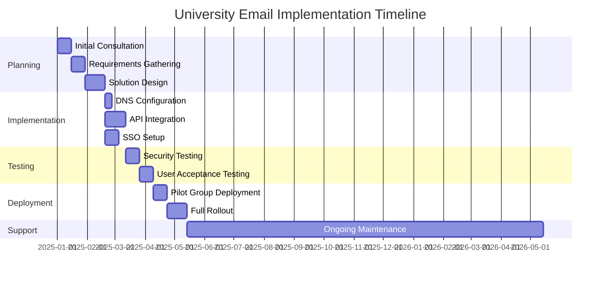
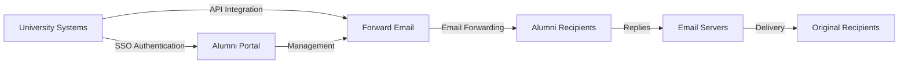

# Пример исследования: Как Forward Email способствует развитию решений для электронной почты выпускников в ведущих университетах {#case-study-how-forward-email-powers-alumni-email-solutions-for-top-universities}


## Содержание {#table-of-contents}

* [Предисловие](#foreword)
* [Значительная экономия средств благодаря стабильным ценам](#dramatic-cost-savings-with-stable-pricing)
  * [Реальная экономия на университете](#real-world-university-savings)
* [Конкурс электронных писем для выпускников университетов](#the-university-alumni-email-challenge)
  * [Ценность идентификации электронной почты выпускника](#the-value-of-alumni-email-identity)
  * [Традиционные решения не оправдывают ожиданий](#traditional-solutions-fall-short)
  * [Решение для пересылки электронной почты](#the-forward-email-solution)
* [Техническая реализация: как это работает](#technical-implementation-how-it-works)
  * [Основная архитектура](#core-architecture)
  * [Интеграция с университетскими системами](#integration-with-university-systems)
  * [Управление на основе API](#api-driven-management)
  * [Настройка и проверка DNS](#dns-configuration-and-verification)
  * [Тестирование и контроль качества](#testing-and-quality-assurance)
* [Сроки реализации](#implementation-timeline)
* [Процесс внедрения: от миграции до обслуживания](#implementation-process-from-migration-to-maintenance)
  * [Первоначальная оценка и планирование](#initial-assessment-and-planning)
  * [Стратегия миграции](#migration-strategy)
  * [Техническая настройка и конфигурация](#technical-setup-and-configuration)
  * [Дизайн пользовательского опыта](#user-experience-design)
  * [Обучение и документация](#training-and-documentation)
  * [Постоянная поддержка и оптимизация](#ongoing-support-and-optimization)
* [Пример исследования: Кембриджский университет](#case-study-university-of-cambridge)
  * [Испытание](#challenge)
  * [Решение](#solution)
  * [Результаты](#results)
* [Преимущества для университетов и выпускников](#benefits-for-universities-and-alumni)
  * [Для университетов](#for-universities)
  * [Для выпускников](#for-alumni)
  * [Показатели усыновления среди выпускников](#adoption-rates-among-alumni)
  * [Экономия средств по сравнению с предыдущими решениями](#cost-savings-compared-to-previous-solutions)
* [Вопросы безопасности и конфиденциальности](#security-and-privacy-considerations)
  * [Меры защиты данных](#data-protection-measures)
  * [Структура соответствия](#compliance-framework)
* [Будущие разработки](#future-developments)
* [Заключение](#conclusion)

## Предисловие {#foreword}

Мы создали самую безопасную, конфиденциальную и гибкую в мире службу пересылки электронной почты для престижных университетов и их выпускников.

В условиях конкуренции в сфере высшего образования поддержание связей с выпускниками на протяжении всей жизни — не просто дань традиции, а стратегическая необходимость. Один из наиболее эффективных способов, с помощью которых университеты поддерживают эти связи, — это использование адресов электронной почты выпускников, предоставляющих им цифровую идентификацию, отражающую их академическое наследие.

Компания Forward Email сотрудничает с некоторыми из самых престижных учебных заведений мира, чтобы кардинально изменить подход к управлению электронной почтой для выпускников. Наше решение для пересылки электронной почты корпоративного уровня теперь используется в системах электронной почты выпускников [Кембриджский университет](https://en.wikipedia.org/wiki/University_of_Cambridge), [Мэрилендский университет](https://en.wikipedia.org/wiki/University_of_Maryland,\_College_Park), [Университет Тафтса](https://en.wikipedia.org/wiki/Tufts_University) и [Колледж Свортмор](https://en.wikipedia.org/wiki/Swarthmore_College), обслуживая тысячи выпускников по всему миру.

В этой записи блога рассказывается о том, как наша служба пересылки электронной почты [с открытым исходным кодом](https://en.wikipedia.org/wiki/Open-source_software), ориентированная на конфиденциальность, стала предпочтительным решением для этих учреждений, о технических реализациях, которые сделали это возможным, и о преобразующем влиянии, которое она оказала как на административную эффективность, так и на удовлетворенность выпускников.

## Значительная экономия средств благодаря стабильным ценам {#dramatic-cost-savings-with-stable-pricing}

Финансовые преимущества нашего решения существенны, особенно по сравнению с постоянно растущими ценами традиционных поставщиков услуг электронной почты:

| Решение | Стоимость на одного выпускника (годовая) | Стоимость для 100 000 выпускников | Недавний рост цен |
| ------------------------------ | --------------------------------------------------------------------------------------------------------- | ----------------------- | ---------------------------------------------------------------------------------------------------------------------------------------------------------------------------------------- |
| Google Workspace для бизнеса | $72 | $7,200,000 | • 2019: G Suite Basic с 5 до 6 долларов США в месяц (+20%)<br>• 2023: Гибкие планы увеличены на 20%<br>• 2025: Business Plus с 18 до 26,40 долларов США в месяц (+47%) с функциями ИИ |
| Google Workspace для образования | Бесплатно (Education Fundamentals)<br>3 доллара США за студента в год (Education Standard)<br>5 долларов США за студента в год (Education Plus) | Бесплатно - 500 000 долларов США | • Скидки за объем: 5% для 100–499 лицензий<br>• Скидки за объем: 10% для более 500 лицензий<br>• Бесплатный уровень ограничен основными сервисами |
| Microsoft 365 Бизнес | $60 | $6,000,000 | • 2023: Введено обновление цен дважды в год<br>• 2025 (январь): Персональный с 6,99 до 9,99 долларов США в месяц (+43%) с Copilot AI<br>• 2025 (апрель): Увеличение на 5% годовых обязательств с ежемесячной оплатой |
| Microsoft 365 Образование | Бесплатно (A1)<br>38–55 долл. США/преподавательский состав/год (A3)<br>65–96 долл. США/преподавательский состав/год (A5) | Бесплатно - 96 000 долларов США | • Студенческие лицензии часто включены в стоимость приобретения для преподавателей<br>• Индивидуальное ценообразование за счет корпоративного лицензирования<br>• Бесплатный уровень ограничен веб-версиями |
| Самостоятельная биржа | $45 | $4,500,000 | Расходы на текущее обслуживание и безопасность продолжают расти |
| **Пересылка электронной почты Enterprise** | **Фиксированная ставка 250 долларов в месяц** | **3000 долларов в год** | **Цены не повышались с момента запуска** |

### Реальная экономия на университете {#real-world-university-savings}

Вот сколько ежегодно экономят наши университеты-партнеры, выбирая Forward Email вместо традиционных поставщиков:

| Университет | Количество выпускников | Годовая стоимость с Google | Годовая стоимость с пересылкой электронной почты | Годовая экономия |
| ----------------------- | ------------ | ----------------------- | ------------------------------ | -------------- |
| Кембриджский университет | 30,000 | $90,000 | $3,000 | $87,000 |
| Колледж Свортмор | 5,000 | $15,000 | $3,000 | $12,000 |
| Университет Тафтса | 12,000 | $36,000 | $3,000 | $33,000 |
| Мэрилендский университет | 25,000 | $75,000 | $3,000 | $72,000 |

> \[!NOTE]
> Стоимость пересылки электронной почты для предприятий обычно составляет всего 250 долларов США в месяц, без дополнительной платы за пользователя, с ограничениями по скорости API, указанными в белом списке. Единственная дополнительная плата — это хранилище, если вам нужны дополнительные ГБ/ТБ для студентов (+3 доллара США за каждые 10 ГБ дополнительного хранилища). Мы также используем SSD-накопители NVMe для быстрой поддержки IMAP/POP3/SMTP/CalDAV/CardDAV.

> \[!IMPORTANT]
> В отличие от Google и Microsoft, которые неоднократно повышали цены, внедряя функции искусственного интеллекта для анализа ваших данных, Forward Email сохраняет стабильные цены, уделяя особое внимание конфиденциальности. Мы не используем искусственный интеллект, не отслеживаем модели использования и не храним логи или электронные письма на диске (вся обработка выполняется в оперативной памяти), обеспечивая полную конфиденциальность вашего общения с выпускниками.

Это значительно снижает затраты по сравнению с традиционными решениями для хостинга электронной почты, позволяя университетам перенаправлять эти средства на стипендии, исследования или другие критически важные для их миссии проекты. Согласно анализу Email Vendor Selection за 2023 год, образовательные учреждения всё чаще ищут экономически выгодные альтернативы традиционным почтовым сервисам, поскольку цены продолжают расти из-за интеграции функций искусственного интеллекта ([Выбор поставщика электронной почты, 2023 г.](https://www.emailvendorselection.com/email-service-provider-list/)).

## Конкурс по электронной почте для выпускников университета {#the-university-alumni-email-challenge}

Предоставление выпускникам пожизненных адресов электронной почты представляет собой для университетов ряд уникальных проблем, с которыми традиционные решения для электронной почты не справляются эффективно. Как отмечалось в обширном обсуждении на ServerFault, университетам с большой базой пользователей требуются специализированные решения для электронной почты, обеспечивающие баланс между производительностью, безопасностью и экономической эффективностью ([ServerFault, 2009](https://serverfault.com/questions/97364/what-is-the-best-mail-server-for-a-university-with-a-large-amount-of-users)).

### Ценность идентификации электронной почты выпускника {#the-value-of-alumni-email-identity}

Адреса электронной почты выпускников (например, `firstname.lastname@cl.cam.ac.uk` или `username@terpalum.umd.edu`) выполняют несколько важных функций:

* Поддержание институциональных связей и идентичности бренда
* Содействие постоянному взаимодействию с университетом
* Повышение профессионального авторитета выпускников
* Поддержка налаживания связей и развития сообщества выпускников
* Обеспечение стабильной и постоянной точки контакта

Исследование Текаде (2020) подчеркивает, что образовательные адреса электронной почты предоставляют выпускникам многочисленные преимущества, включая доступ к академическим ресурсам, профессиональную репутацию и эксклюзивные скидки на различные услуги ([Средний, 2020](https://medium.com/coders-capsule/top-20-benefits-of-having-an-educational-email-address-91a09795e05)).

> \[!TIP]
> Посетите наш новый каталог [AlumniEmail.com](https://alumniemail.com), чтобы получить исчерпывающий доступ к сервисам электронной почты для выпускников университетов, включая руководства по настройке, рекомендации и каталог доменов электронной почты выпускников с возможностью поиска. Он служит центральным хранилищем всей информации об электронной почте выпускников.

### Традиционные решения не оправдывают ожиданий {#traditional-solutions-fall-short}

Традиционные системы электронной почты имеют ряд ограничений применительно к электронной почте выпускников:

* **Непомерно высокая стоимость**: Модели лицензирования по количеству пользователей становятся финансово невыгодными для больших баз выпускников.
* **Административная нагрузка**: Управление тысячами или миллионами учётных записей требует значительных ИТ-ресурсов.
* **Проблемы безопасности**: Обеспечение безопасности неиспользуемых учётных записей повышает их уязвимость.
* **Ограниченная гибкость**: Жёсткие системы не могут адаптироваться к уникальным потребностям пересылки электронных писем выпускников.
* **Проблемы конфиденциальности**: Многие провайдеры сканируют содержимое электронных писем в рекламных целях.

Обсуждение на Quora, посвященное обслуживанию университетской электронной почты, показало, что проблемы безопасности являются основной причиной, по которой университеты могут ограничивать или аннулировать адреса электронной почты выпускников, поскольку неиспользуемые учетные записи могут быть уязвимы для взлома и кражи личных данных ([Quora, 2011](https://www.quora.com/Is-there-any-cost-for-a-college-or-university-to-maintain-edu-e-mail-addresses)).

### Решение для пересылки электронной почты {#the-forward-email-solution}

Наш подход решает эти проблемы с помощью принципиально иной модели:

* Пересылка электронной почты вместо хостинга
* Фиксированная плата вместо оплаты за пользователя
* Архитектура с открытым исходным кодом для прозрачности и безопасности
* Дизайн, ориентированный на конфиденциальность, без сканирования контента
* Специализированные функции для управления идентификацией в университете

## Техническая реализация: как это работает {#technical-implementation-how-it-works}

Наше решение использует сложную, но в то же время элегантно простую техническую архитектуру для обеспечения надежной и безопасной пересылки электронной почты в любом масштабе.

### Основная архитектура {#core-architecture}

Система пересылки электронной почты состоит из нескольких ключевых компонентов:

* Распределенные MX-серверы для высокой доступности
* Пересылка сообщений в режиме реального времени без необходимости хранения
* Комплексная аутентификация электронной почты
* Поддержка пользовательских доменов и поддоменов
* Управление учетными записями через API

По мнению IT-специалистов на ServerFault, для университетов, стремящихся внедрить собственные решения для электронной почты, Postfix рекомендуется как лучший агент пересылки почты (MTA), а Courier или Dovecot — для доступа по протоколам IMAP/POP3 ([ServerFault, 2009](https://serverfault.com/questions/97364/what-is-the-best-mail-server-for-a-university-with-a-large-amount-of-users)). Однако наше решение избавляет университеты от необходимости самостоятельно управлять этими сложными системами.

### Интеграция с университетскими системами {#integration-with-university-systems}

Мы разработали пути бесшовной интеграции с существующей инфраструктурой университета:

* Автоматизированная подготовка благодаря интеграции [RESTful API](https://forwardemail.net/email-api)
* Индивидуальные возможности брендинга для университетских порталов
* Гибкое управление псевдонимами для отделов и организаций
* Пакетные операции для эффективного администрирования

### Управление через API {#api-driven-management}

Наш [RESTful API](https://forwardemail.net/email-api) позволяет университетам автоматизировать управление электронной почтой:

```javascript
// Example: Creating a new alumni email address
const response = await fetch('https://forwardemail.net/api/v1/domains/example.edu/aliases', {
  method: 'POST',
  headers: {
    'Content-Type': 'application/json',
    'Authorization': `Basic ${Buffer.from(YOUR_API_TOKEN + ":").toString('base64')}`
  },
  body: JSON.stringify({
    name: 'alumni.john.smith',
    recipients: ['johnsmith@gmail.com'],
    has_recipient_verification: true
  })
});
```

### Настройка и проверка DNS {#dns-configuration-and-verification}

Правильная настройка DNS критически важна для доставки электронной почты. Наша команда поможет:

* Конфигурация [DNS](https://en.wikipedia.org/wiki/Domain_Name_System), включая записи MX
* Комплексная реализация безопасности электронной почты с использованием нашего пакета [почтовая авторизация](https://www.npmjs.com/package/mailauth) с открытым исходным кодом — универсального инструмента для аутентификации электронной почты, который обрабатывает:
* [SPF](https://en.wikipedia.org/wiki/Sender_Policy_Framework) (инфраструктура политики отправителя) для предотвращения подмены электронной почты
* [DKIM](https://en.wikipedia.org/wiki/DomainKeys_Identified_Mail) (идентификация почты по DomainKeys) для аутентификации электронной почты
* [DMARC](https://en.wikipedia.org/wiki/Email_authentication) (аутентификация сообщений на основе домена, отчётность и соответствие) для применения политик
* [MTA-STS](https://en.wikipedia.org/wiki/Opportunistic_TLS) (строгая безопасность транспорта SMTP MTA) для обеспечения шифрования TLS
* [ARC](https://en.wikipedia.org/wiki/DomainKeys_Identified_Mail#Authenticated_Received_Chain) (аутентифицированная цепочка полученных сообщений) для поддержания аутентификации при пересылке сообщений
* [SRS](https://en.wikipedia.org/wiki/Sender_Rewriting_Scheme) (схема перезаписи отправителя) для сохранения проверки SPF при пересылке
* [BIMI](https://en.wikipedia.org/wiki/Email_authentication) (индикаторы бренда для идентификации сообщений) для отображения логотипа в поддерживаемых почтовых клиентах
* Проверка записи DNS TXT для права собственности на домен

Пакет `mailauth` (<http://npmjs.com/package/mailauth>) — это полностью открытое решение, которое охватывает все аспекты аутентификации электронной почты в одной интегрированной библиотеке. В отличие от проприетарных решений, такой подход обеспечивает прозрачность, регулярные обновления безопасности и полный контроль над процессом аутентификации электронной почты.

### Тестирование и обеспечение качества {#testing-and-quality-assurance}

Перед полным развертыванием мы проводим тщательное тестирование:

* Сквозное тестирование доставки электронной почты
* Нагрузочное тестирование для сценариев с большим объемом данных
* Тестирование на проникновение в систему безопасности
* Проверка интеграции API
* Тестирование пользовательского приёма с участием представителей выпускников

## Временная шкала реализации {#implementation-timeline}



Процесс внедрения ##: от миграции до обслуживания {#implementation-process-from-migration-to-maintenance}

Наш структурированный процесс внедрения обеспечивает плавный переход университетов к нашему решению.

### Первоначальная оценка и планирование {#initial-assessment-and-planning}

Мы начинаем с комплексной оценки текущей системы электронной почты университета, базы данных выпускников и технических требований. Этот этап включает в себя:

* Интервью с заинтересованными сторонами: представителями ИТ-отдела, отдела по работе с выпускниками и администрации
* Технический аудит существующей инфраструктуры электронной почты
* Сопоставление данных с записями выпускников
* Проверка безопасности и соответствия требованиям
* Разработка графика проекта и основных этапов

### Стратегия миграции {#migration-strategy}

На основе оценки мы разрабатываем индивидуальную стратегию миграции, которая сводит к минимуму нарушения и обеспечивает полную целостность данных:

* Поэтапный подход к миграции, осуществляемый группами выпускников
* Параллельная работа систем во время перехода
* Комплексные протоколы проверки данных
* Резервные процедуры для решения любых проблем с миграцией
* Четкий план коммуникации для всех заинтересованных сторон

### Техническая настройка и конфигурация {#technical-setup-and-configuration}

Наша техническая команда занимается всеми аспектами настройки системы:

* Настройка и проверка DNS
* Интеграция API с университетскими системами
* Разработка собственного портала с брендингом университета
* Настройка аутентификации электронной почты (SPF, DKIM, DMARC)

### Дизайн пользовательского опыта {#user-experience-design}

Мы тесно сотрудничаем с университетами над созданием интуитивно понятных интерфейсов как для администраторов, так и для выпускников:

* Индивидуально разработанные почтовые порталы для выпускников
* Упрощённое управление пересылкой электронной почты
* Адаптивный дизайн для мобильных устройств
* Соответствие требованиям доступности
* Многоязычная поддержка при необходимости

### Обучение и документация {#training-and-documentation}

Комплексное обучение гарантирует, что все заинтересованные стороны смогут эффективно использовать систему:

* Обучающие семинары для администраторов
* Техническая документация для ИТ-специалистов
* Руководства пользователя для выпускников
* Видеоуроки по типовым задачам
* Разработка базы знаний

### Постоянная поддержка и оптимизация {#ongoing-support-and-optimization}

Наше партнерство продолжается и после реализации:

* Круглосуточная техническая поддержка
* Регулярные обновления системы и исправления безопасности
* Мониторинг и оптимизация производительности
* Консультации по лучшим практикам работы с электронной почтой
* Аналитика данных и составление отчётов

## Пример: Кембриджский университет {#case-study-university-of-cambridge}

Кембриджский университет искал решение, позволяющее предоставить выпускникам адреса электронной почты @cam.ac.uk и одновременно сократить накладные расходы и затраты на ИТ.

### Вызов {#challenge}

Кембридж столкнулся с рядом проблем в своей предыдущей системе электронной почты выпускников:

* Высокие эксплуатационные расходы на поддержание отдельной инфраструктуры электронной почты
* Административная нагрузка, связанная с управлением тысячами учётных записей
* Проблемы безопасности, связанные с неактивными учётными записями
* Ограниченная интеграция с системами баз данных выпускников
* Растущие требования к объёму хранилища

### Решение {#solution}

Forward Email реализовала комплексное решение:

* Переадресация электронной почты на все адреса выпускников @cam.ac.uk
* Индивидуально разработанный портал для самостоятельного обслуживания выпускников
* Интеграция API с базой данных выпускников Кембриджа
* Комплексная реализация безопасности электронной почты

### Результаты {#results}

Внедрение принесло значительные преимущества:

* Значительное снижение затрат по сравнению с предыдущим решением
* Надёжность доставки электронной почты 99,9%
* Упрощённое администрирование благодаря автоматизации
* Повышенная безопасность благодаря современной аутентификации электронной почты
* Положительные отзывы выпускников об удобстве использования системы

## Преимущества для университетов и выпускников {#benefits-for-universities-and-alumni}

Наше решение обеспечивает ощутимые преимущества как учебным заведениям, так и их выпускникам.

### Для университетов {#for-universities}

* **Экономическая эффективность**: Фиксированная цена, не зависящая от количества выпускников
* **Простота администрирования**: Автоматизированное управление через API
* **Повышенная безопасность**: Комплексная аутентификация электронной почты
* **Единообразие бренда**: Пожизненные адреса электронной почты организации
* **Вовлеченность выпускников**: Укрепление связей благодаря постоянному обслуживанию

По данным BulkSignature (2023), платформы электронной почты для образовательных учреждений предлагают значительные преимущества, включая экономическую эффективность за счет бесплатных или недорогих тарифных планов, экономию времени за счет возможностей массовой коммуникации и функций отслеживания для контроля доставки и вовлеченности электронной почты ([BulkSignature, 2023](https://bulksignature.com/blog/5-best-email-platforms-for-educational-institutions/)).

### Для выпускников {#for-alumni}

* **Профессиональная идентичность**: Престижный университетский адрес электронной почты
* **Непрерывность электронной почты**: Пересылка на любой личный адрес электронной почты
* **Защита конфиденциальности**: Без сканирования контента и сбора данных
* **Упрощенное управление**: Простое обновление получателей
* **Повышенная безопасность**: Современная аутентификация электронной почты

В исследовании Международного журнала исследований в области образования и грамотности подчеркивается важность правильного общения по электронной почте в академической среде и отмечается, что грамотность в использовании электронной почты является важнейшим навыком как для студентов, так и для выпускников в профессиональном контексте ([IJELS, 2021](https://files.eric.ed.gov/fulltext/EJ1319324.pdf)).

### Показатели усыновления среди выпускников {#adoption-rates-among-alumni}

Университеты сообщают о высоких показателях принятия и удовлетворенности среди своих выпускников.

### Экономия средств по сравнению с предыдущими решениями {#cost-savings-compared-to-previous-solutions}

Финансовые последствия оказались существенными: университеты сообщили о существенной экономии средств по сравнению с предыдущими решениями в области электронной почты.

## Вопросы безопасности и конфиденциальности {#security-and-privacy-considerations}

Для образовательных учреждений защита данных выпускников — это не просто хорошая практика, но зачастую и юридическое требование в соответствии с такими нормативными актами, как GDPR в Европе.

### Меры защиты данных {#data-protection-measures}

Наше решение включает несколько уровней безопасности:

* Сквозное шифрование всего почтового трафика
* Отсутствие хранения содержимого электронной почты на наших серверах
* Регулярные аудиты безопасности и тестирование на проникновение
* Соответствие международным стандартам защиты данных
* Прозрачный открытый исходный код для проверки безопасности

> \[!WARNING]
> Многие почтовые сервисы сканируют содержимое электронных писем в рекламных целях или для обучения моделей искусственного интеллекта. Такая практика вызывает серьёзные опасения по поводу конфиденциальности, особенно в сфере профессиональной и академической переписки. Forward Email никогда не сканирует содержимое электронных писем и обрабатывает все письма в памяти, чтобы обеспечить полную конфиденциальность.

### Структура соответствия {#compliance-framework}

Мы строго соблюдаем соответствующие правила:

* Соответствие требованиям GDPR для европейских организаций
* Сертификация SOC 2 Тип II
* Ежегодная оценка безопасности
* Соглашение об обработке данных (DPA) доступно по адресу [forwardemail.net/dpa](https://forwardemail.net/dpa)
* Регулярные обновления по мере развития нормативных требований

## Будущие разработки {#future-developments}

Мы продолжаем совершенствовать наше решение для электронной почты выпускников, добавляя новые функции и возможности:

* Расширенная аналитика для администраторов университета
* Расширенная защита от фишинга
* Расширенные возможности API для более глубокой интеграции
* Дополнительные варианты аутентификации

## Заключение {#conclusion}

Пересылка электронной почты произвела революцию в предоставлении и управлении электронной почтой для выпускников университетов. Заменив дорогостоящий и сложный хостинг электронной почты на элегантную и безопасную пересылку, мы позволили учреждениям предлагать всем выпускникам пожизненные адреса электронной почты, значительно сократив расходы и административные издержки.

Наше партнёрство с такими престижными учебными заведениями, как Кембридж (штат Мэриленд), Университет Тафтса и Университет Суортмора, демонстрирует эффективность нашего подхода в различных образовательных средах. Поскольку университеты сталкиваются с растущей необходимостью поддерживать связи с выпускниками, одновременно контролируя расходы, наше решение предлагает убедительную альтернативу традиционным системам электронной почты.



Университетам, заинтересованным в изучении того, как Forward Email может преобразовать их службы электронной почты для выпускников, следует связаться с нашей командой по адресу <support@forwardemail.net> или посетить сайт [forwardemail.net](https://forwardemail.net), чтобы узнать больше о наших корпоративных решениях.