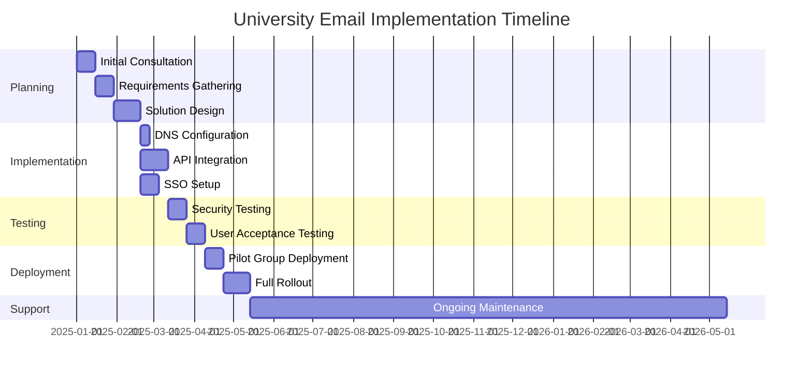
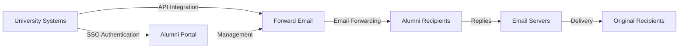

# Пример использования: Как Forward Email способствует развитию решений для электронной почты выпускников в ведущих университетах {#case-study-how-forward-email-powers-alumni-email-solutions-for-top-universities}


## Содержание {#table-of-contents}

* [Предисловие](#foreword)
* [Значительная экономия средств благодаря стабильным ценам](#dramatic-cost-savings-with-stable-pricing)
  * [Реальная экономия на университете](#real-world-university-savings)
* [Конкурс по электронной почте для выпускников университетов](#the-university-alumni-email-challenge)
  * [Ценность идентификации выпускников по электронной почте](#the-value-of-alumni-email-identity)
  * [Традиционные решения не оправдывают ожиданий](#traditional-solutions-fall-short)
  * [Решение для пересылки электронной почты](#the-forward-email-solution)
* [Техническая реализация: как это работает](#technical-implementation-how-it-works)
  * [Основная архитектура](#core-architecture)
  * [Интеграция с университетскими системами](#integration-with-university-systems)
  * [Управление на основе API](#api-driven-management)
  * [Конфигурация и проверка DNS](#dns-configuration-and-verification)
  * [Тестирование и контроль качества](#testing-and-quality-assurance)
* [Сроки реализации](#implementation-timeline)
* [Процесс внедрения: от миграции до обслуживания](#implementation-process-from-migration-to-maintenance)
  * [Первоначальная оценка и планирование](#initial-assessment-and-planning)
  * [Стратегия миграции](#migration-strategy)
  * [Техническая настройка и конфигурация](#technical-setup-and-configuration)
  * [Проектирование пользовательского опыта](#user-experience-design)
  * [Обучение и документация](#training-and-documentation)
  * [Постоянная поддержка и оптимизация](#ongoing-support-and-optimization)
* [Пример из практики: Кембриджский университет](#case-study-university-of-cambridge)
  * [Испытание](#challenge)
  * [Решение](#solution)
  * [Результаты](#results)
* [Преимущества для университетов и выпускников](#benefits-for-universities-and-alumni)
  * [Для университетов](#for-universities)
  * [Для выпускников](#for-alumni)
  * [Уровень усыновления среди выпускников](#adoption-rates-among-alumni)
  * [Экономия средств по сравнению с предыдущими решениями](#cost-savings-compared-to-previous-solutions)
* [Вопросы безопасности и конфиденциальности](#security-and-privacy-considerations)
  * [Меры защиты данных](#data-protection-measures)
  * [Структура соответствия](#compliance-framework)
* [Будущие разработки](#future-developments)
* [Заключение](#conclusion)

## Предисловие {#foreword}

Мы создали самую безопасную, конфиденциальную и гибкую в мире службу пересылки электронной почты для престижных университетов и их выпускников.

В конкурентной среде высшего образования поддержание связей с выпускниками на протяжении всей жизни — это не просто вопрос традиции, это стратегический императив. Один из наиболее ощутимых способов, с помощью которых университеты поддерживают эти связи, — это адреса электронной почты выпускников, предоставляющие выпускникам цифровую идентификацию, отражающую их академическое наследие.

Компания Forward Email сотрудничает с некоторыми из самых престижных учебных заведений мира, чтобы кардинально изменить подход к управлению электронной почтой для выпускников. Наше решение для пересылки электронной почты корпоративного уровня теперь используется в системах электронной почты выпускников [Кембриджский университет](https://en.wikipedia.org/wiki/University_of_Cambridge), [Мэрилендский университет](https://en.wikipedia.org/wiki/University_of_Maryland,\_College_Park), [Университет Тафтса](https://en.wikipedia.org/wiki/Tufts_University) и [Колледж Свортмор](https://en.wikipedia.org/wiki/Swarthmore_College), обслуживая тысячи выпускников по всему миру.

В этой записи блога рассказывается о том, как наша [с открытым исходным кодом](https://en.wikipedia.org/wiki/Open-source_software), ориентированная на конфиденциальность служба пересылки электронной почты, стала предпочтительным решением для этих учреждений, о технических реализациях, которые сделали это возможным, и о преобразующем влиянии, которое она оказала как на административную эффективность, так и на удовлетворенность выпускников.

## Значительная экономия средств благодаря стабильным ценам {#dramatic-cost-savings-with-stable-pricing}

Финансовые преимущества нашего решения существенны, особенно по сравнению с постоянно растущими ценами традиционных поставщиков услуг электронной почты:

| Решение | Стоимость на одного выпускника (годовая) | Стоимость для 100 000 выпускников | Недавний рост цен |
| ------------------------------ | --------------------------------------------------------------------------------------------------------- | ----------------------- | ---------------------------------------------------------------------------------------------------------------------------------------------------------------------------------------- |
| Google Workspace для бизнеса | $72 | $7,200,000 | • 2019: G Suite Basic с 5 до 6 долларов США в месяц (+20%)<br>• 2023: Гибкие планы увеличены на 20%<br>• 2025: Business Plus с 18 до 26,40 долларов США в месяц (+47%) с функциями ИИ |
| Google Workspace для образования | Бесплатно (Education Fundamentals)<br>3 доллара США за студента в год (Education Standard)<br>5 долларов США за студента в год (Education Plus) | Бесплатно - 500 000 долларов США | • Скидки за объем: 5% для 100–499 лицензий<br>• Скидки за объем: 10% для более 500 лицензий<br>• Бесплатный уровень ограничен основными сервисами |
| Microsoft 365 Бизнес | $60 | $6,000,000 | • 2023: Введено обновление цен дважды в год<br>• 2025 (январь): Персональный с 6,99 до 9,99 долларов США в месяц (+43%) с Copilot AI<br>• 2025 (апрель): Увеличение на 5% годовых обязательств с ежемесячной оплатой |
| Microsoft 365 Образование | Бесплатно (A1)<br>38–55 долл. США/преподавательский состав/год (A3)<br>65–96 долл. США/преподавательский состав/год (A5) | Бесплатно - 96 000 долларов США | • Студенческие лицензии часто включены в стоимость приобретения для преподавателей<br>• Индивидуальное ценообразование за счет корпоративного лицензирования<br>• Бесплатный уровень ограничен веб-версиями |
| Самостоятельно размещенный обмен | $45 | $4,500,000 | Расходы на текущее обслуживание и безопасность продолжают расти |
| **Пересылка электронной почты Enterprise** | **Фиксированная ставка 250 долларов в месяц** | **3000 долларов в год** | **Цены не повышались с момента запуска** |

### Реальная экономия на обучении в университете {#real-world-university-savings}

Вот сколько ежегодно экономят наши университеты-партнеры, выбирая Forward Email вместо традиционных поставщиков услуг:

| Университет | Количество выпускников | Годовая стоимость с Google | Годовая стоимость с пересылкой по электронной почте | Годовая экономия |
| ----------------------- | ------------ | ----------------------- | ------------------------------ | -------------- |
| Кембриджский университет | 30,000 | $90,000 | $3,000 | $87,000 |
| Колледж Свортмор | 5,000 | $15,000 | $3,000 | $12,000 |
| Университет Тафтса | 12,000 | $36,000 | $3,000 | $33,000 |
| Мэрилендский университет | 25,000 | $75,000 | $3,000 | $72,000 |

> \[!NOTE]
> Forward Email enterprise only costs $250/month typically, with no extra cost per user, whitelisted API rate limitations, and the only additional cost is storage if you need additional GB/TB for students (+$3 per 10 GB additional storage). We use NVMe SSD drives for fast support of IMAP/POP3/SMTP/CalDAV/CardDAV as well.

> \[!IMPORTANT]
> Unlike Google and Microsoft, who have repeatedly increased their prices while integrating AI features that analyze your data, Forward Email maintains stable pricing with a strict privacy focus. We don't use AI, don't track usage patterns, and don't store logs or emails to disk (all processing is done in-memory), ensuring complete privacy for your alumni communications.

Это значительно снижает затраты по сравнению с традиционными решениями для хостинга электронной почты, позволяя университетам перенаправлять эти средства на стипендии, исследования или другие критически важные для их миссии проекты. Согласно анализу, проведённому Email Vendor Selection в 2023 году, образовательные учреждения всё чаще ищут экономически выгодные альтернативы традиционным почтовым сервисам, поскольку цены продолжают расти из-за интеграции функций искусственного интеллекта ([Выбор поставщика электронной почты, 2023 г.](https://www.emailvendorselection.com/email-service-provider-list/)).

## Конкурс по электронной почте для выпускников университета {#the-university-alumni-email-challenge}

Предоставление выпускникам пожизненных адресов электронной почты представляет собой для университетов ряд уникальных проблем, с которыми традиционные почтовые решения с трудом справляются. Как отмечалось в обширном обсуждении на ServerFault, университетам с большой базой пользователей требуются специализированные почтовые решения, обеспечивающие баланс между производительностью, безопасностью и экономической эффективностью ([ServerFault, 2009](https://serverfault.com/questions/97364/what-is-the-best-mail-server-for-a-university-with-a-large-amount-of-users)).

### Ценность идентификации электронной почты выпускника {#the-value-of-alumni-email-identity}

Адреса электронной почты выпускников (например, `firstname.lastname@cl.cam.ac.uk` или `username@terpalum.umd.edu`) выполняют несколько важных функций:

* Поддержание институциональных связей и идентичности бренда
* Содействие постоянному общению с университетом
* Повышение профессиональной репутации выпускников
* Поддержка связей выпускников и построения сообщества
* Предоставление стабильной, пожизненной точки контакта

Исследование Текаде (2020) подчеркивает, что образовательные адреса электронной почты предоставляют выпускникам многочисленные преимущества, включая доступ к академическим ресурсам, профессиональную репутацию и эксклюзивные скидки на различные услуги ([Средний, 2020](https://medium.com/coders-capsule/top-20-benefits-of-having-an-educational-email-address-91a09795e05)).

> \[!TIP]
> Visit our new [AlumniEmail.com](https://alumniemail.com) directory for a comprehensive resource on university alumni email services, including setup guides, best practices, and a searchable directory of alumni email domains. It serves as a central hub for all alumni email information.

### Традиционные решения не оправдывают ожиданий {#traditional-solutions-fall-short}

Традиционные системы электронной почты имеют ряд ограничений при применении к потребностям выпускников в электронной почте:

* **Непомерно высокая стоимость**: модели лицензирования на пользователя становятся финансово невыгодными для больших баз выпускников
* **Административное бремя**: управление тысячами или миллионами учетных записей требует значительных ИТ-ресурсов
* **Проблемы безопасности**: поддержание безопасности неактивных учетных записей увеличивает уязвимость
* **Ограниченная гибкость**: жесткие системы не могут адаптироваться к уникальным потребностям пересылки электронной почты выпускников
* **Проблемы конфиденциальности**: многие поставщики сканируют содержимое электронной почты в рекламных целях

Обсуждение на Quora, посвященное обслуживанию университетской электронной почты, показало, что проблемы безопасности являются основной причиной, по которой университеты могут ограничивать или аннулировать адреса электронной почты выпускников, поскольку неиспользуемые учетные записи могут быть уязвимы для взлома и кражи личных данных ([Quora, 2011](https://www.quora.com/Is-there-any-cost-for-a-college-or-university-to-maintain-edu-e-mail-addresses)).

### Решение для пересылки электронной почты {#the-forward-email-solution}

Наш подход решает эти проблемы с помощью принципиально иной модели:

* Пересылка электронной почты вместо хостинга
* Фиксированная цена вместо оплаты за пользователя
* Архитектура с открытым исходным кодом для прозрачности и безопасности
* Дизайн, ориентированный на конфиденциальность, без сканирования контента
* Специализированные функции для управления идентификацией в университете

## Техническая реализация: как это работает {#technical-implementation-how-it-works}

Наше решение использует сложную, но в то же время элегантно простую техническую архитектуру для обеспечения надежной и безопасной пересылки электронной почты в любом масштабе.

### Основная архитектура {#core-architecture}

Система пересылки электронной почты состоит из нескольких ключевых компонентов:

* Распределенные серверы MX для высокой доступности
* Пересылка в реальном времени без хранения сообщений
* Комплексная аутентификация электронной почты
* Поддержка пользовательских доменов и поддоменов
* Управление учетными записями на основе API

По мнению IT-специалистов на ServerFault, для университетов, стремящихся внедрить собственные решения для электронной почты, Postfix рекомендуется как лучший агент пересылки почты (MTA), а для доступа по протоколам IMAP/POP3 предпочтительны Courier или Dovecot ([ServerFault, 2009](https://serverfault.com/questions/97364/what-is-the-best-mail-server-for-a-university-with-a-large-amount-of-users)). Однако наше решение избавляет университеты от необходимости самостоятельно управлять этими сложными системами.

### Интеграция с университетскими системами {#integration-with-university-systems}

Мы разработали пути бесшовной интеграции с существующей университетской инфраструктурой:

* Автоматизированная подготовка благодаря интеграции с [RESTful-API](https://forwardemail.net/email-api)
* Индивидуальные возможности брендинга для университетских порталов
* Гибкое управление псевдонимами для отделов и организаций
* Пакетные операции для эффективного администрирования

### Управление через API {#api-driven-management}

Наша [RESTful-API](https://forwardemail.net/email-api) позволяет университетам автоматизировать управление электронной почтой:

```javascript
// Example: Creating a new alumni email address
const response = await fetch('https://forwardemail.net/api/v1/domains/example.edu/aliases', {
  method: 'POST',
  headers: {
    'Content-Type': 'application/json',
    'Authorization': `Basic ${Buffer.from(YOUR_API_TOKEN + ":").toString('base64')}`
  },
  body: JSON.stringify({
    name: 'alumni.john.smith',
    recipients: ['johnsmith@gmail.com'],
    has_recipient_verification: true
  })
});
```

### Настройка и проверка DNS {#dns-configuration-and-verification}

Правильная конфигурация DNS имеет решающее значение для доставки электронной почты. Наша команда помогает с:

* Конфигурация [DNS](https://en.wikipedia.org/wiki/Domain_Name_System), включая записи MX
* Комплексная реализация безопасности электронной почты с использованием нашего пакета с открытым исходным кодом [mailauth](https://www.npmjs.com/package/mailauth) — универсального решения для аутентификации электронной почты, которое обрабатывает:
* [SPF](https://en.wikipedia.org/wiki/Sender_Policy_Framework) (инфраструктуру политики отправителя) для предотвращения подмены электронной почты
* [DKIM](https://en.wikipedia.org/wiki/DomainKeys_Identified_Mail) (идентификацию почты по DomainKeys) для аутентификации электронной почты
* [DMARC](https://en.wikipedia.org/wiki/Email_authentication) (аутентификацию сообщений на основе домена, создание отчетов и соответствие требованиям) для применения политик
* [MTA-STS](https://en.wikipedia.org/wiki/Opportunistic_TLS) (строгую безопасность транспорта SMTP MTA) для обеспечения шифрования TLS
* [ARC](https://en.wikipedia.org/wiki/DomainKeys_Identified_Mail#Authenticated_Received_Chain) (аутентифицированную цепочку полученных сообщений) для поддержания аутентификации при пересылке сообщений
* [SRS](https://en.wikipedia.org/wiki/Sender_Rewriting_Scheme) (схема перезаписи отправителя) для сохранения проверки SPF при пересылке
* [BIMI](https://en.wikipedia.org/wiki/Email_authentication) (индикаторы бренда для идентификации сообщений) для отображения логотипа в поддерживаемых почтовых клиентах
* Проверка записи DNS TXT для подтверждения права собственности на домен

Пакет `mailauth` (<http://npmjs.com/package/mailauth>) — это полностью открытое решение, которое охватывает все аспекты аутентификации электронной почты в одной интегрированной библиотеке. В отличие от проприетарных решений, такой подход обеспечивает прозрачность, регулярные обновления безопасности и полный контроль над процессом аутентификации электронной почты.

### Тестирование и обеспечение качества {#testing-and-quality-assurance}

Перед полным развертыванием мы проводим тщательное тестирование:

* Тестирование доставки электронной почты «от начала до конца»
* Тестирование нагрузки для сценариев с большим объемом
* Тестирование проникновения безопасности
* Проверка интеграции API
* Тестирование принятия пользователем с представителями выпускников

## Сроки реализации {#implementation-timeline}



## Процесс внедрения: от миграции до обслуживания {#implementation-process-from-migration-to-maintenance}

Наш структурированный процесс внедрения обеспечивает плавный переход университетов на наше решение.

### Первоначальная оценка и планирование {#initial-assessment-and-planning}

Мы начинаем с комплексной оценки текущей системы электронной почты университета, базы данных выпускников и технических требований. Эта фаза включает:

* Интервью с заинтересованными сторонами в сфере ИТ, связей с выпускниками и администрации
* Технический аудит существующей инфраструктуры электронной почты
* Картографирование данных для записей выпускников
* Обзор безопасности и соответствия
* Разработка графика проекта и основных этапов

### Стратегия миграции {#migration-strategy}

На основе оценки мы разрабатываем индивидуальную стратегию миграции, которая сводит к минимуму сбои и обеспечивает полную целостность данных:

* Поэтапный подход к миграции выпускников
* Параллельная работа систем во время перехода
* Комплексные протоколы проверки данных
* Резервные процедуры для любых проблем с миграцией
* Четкий план коммуникации для всех заинтересованных сторон

### Техническая настройка и конфигурация {#technical-setup-and-configuration}

Наша техническая команда занимается всеми аспектами настройки системы:

* Конфигурация и проверка DNS
* Интеграция API с университетскими системами
* Разработка индивидуального портала с университетским брендингом
* Настройка аутентификации электронной почты (SPF, DKIM, DMARC)

### Дизайн пользовательского опыта {#user-experience-design}

Мы тесно сотрудничаем с университетами для создания интуитивно понятных интерфейсов как для администраторов, так и для выпускников:

* Индивидуально разработанные порталы электронной почты для выпускников
* Упрощенное управление пересылкой электронной почты
* Адаптивный для мобильных устройств дизайн
* Соответствие требованиям доступности
* Многоязычная поддержка при необходимости

### Обучение и документация {#training-and-documentation}

Комплексное обучение гарантирует, что все заинтересованные стороны смогут эффективно использовать систему:

* Учебные сессии для администраторов
* Техническая документация для ИТ-персонала
* Руководства пользователя для выпускников
* Видеоуроки по общим задачам
* Разработка базы знаний

### Постоянная поддержка и оптимизация {#ongoing-support-and-optimization}

Наше партнерство продолжается и после реализации:

* Круглосуточная техническая поддержка
* Регулярные обновления системы и исправления безопасности
* Мониторинг и оптимизация производительности
* Консультации по лучшим практикам работы с электронной почтой
* Аналитика данных и отчетность

## Пример: Кембриджский университет {#case-study-university-of-cambridge}

Кембриджский университет искал решение, позволяющее предоставить выпускникам адреса электронной почты @cam.ac.uk, одновременно сократив накладные расходы и затраты на ИТ.

### Вызов {#challenge}

Кембридж столкнулся с рядом проблем в предыдущей системе электронной почты выпускников:

* Высокие эксплуатационные расходы на поддержание отдельной инфраструктуры электронной почты
* Административная нагрузка по управлению тысячами учетных записей
* Проблемы безопасности с неактивными учетными записями
* Ограниченная интеграция с системами баз данных выпускников
* Растущие требования к хранению

### Решение {#solution}

Forward Email реализовал комплексное решение:

* Пересылка электронной почты для всех адресов выпускников @cam.ac.uk
* Индивидуально разработанный портал для самообслуживания выпускников
* Интеграция API с базой данных выпускников Кембриджа
* Комплексная реализация безопасности электронной почты

### Результаты {#results}

Внедрение принесло значительные преимущества:

* Значительное снижение затрат по сравнению с предыдущим решением
* Надежность доставки электронной почты 99,9%
* Упрощенное администрирование за счет автоматизации
* Повышенная безопасность с современной аутентификацией электронной почты
* Положительные отзывы выпускников об удобстве использования системы

## Преимущества для университетов и выпускников {#benefits-for-universities-and-alumni}

Наше решение обеспечивает ощутимые преимущества как для учебных заведений, так и для их выпускников.

### Для университетов {#for-universities}

* **Экономическая эффективность**: фиксированная цена независимо от количества выпускников
* **Простота администрирования**: автоматизированное управление через API
* **Повышенная безопасность**: комплексная аутентификация электронной почты
* **Согласованность бренда**: бессрочные институциональные адреса электронной почты
* **Вовлеченность выпускников**: укрепление связей посредством постоянного обслуживания

По данным BulkSignature (2023), платформы электронной почты для образовательных учреждений предлагают значительные преимущества, включая экономическую эффективность за счет бесплатных или недорогих тарифных планов, экономию времени за счет возможностей массовой коммуникации и функций отслеживания для контроля доставки и вовлеченности электронной почты ([Массовая подпись, 2023](https://bulksignature.com/blog/5-best-email-platforms-for-educational-institutions/)).

### Для выпускников {#for-alumni}

* **Профессиональная идентификация**: престижный университетский адрес электронной почты
* **Непрерывность электронной почты**: пересылка на любой личный адрес электронной почты
* **Защита конфиденциальности**: отсутствие сканирования контента или сбора данных
* **Упрощенное управление**: простое обновление получателей
* **Повышенная безопасность**: современная аутентификация электронной почты

В исследовании Международного журнала исследований в области образования и грамотности подчеркивается важность правильного общения по электронной почте в академической среде и отмечается, что грамотность в использовании электронной почты является важнейшим навыком как для студентов, так и для выпускников в профессиональном контексте ([IJELS, 2021](https://files.eric.ed.gov/fulltext/EJ1319324.pdf)).

### Показатели усыновления среди выпускников {#adoption-rates-among-alumni}

Университеты сообщают о высоких показателях принятия и удовлетворенности среди своих выпускников.

### Экономия средств по сравнению с предыдущими решениями {#cost-savings-compared-to-previous-solutions}

Финансовый эффект оказался существенным: университеты сообщили о существенной экономии средств по сравнению с предыдущими решениями для электронной почты.

## Вопросы безопасности и конфиденциальности {#security-and-privacy-considerations}

Для образовательных учреждений защита данных выпускников — это не просто хорошая практика, но и зачастую юридическое требование в соответствии с такими нормативными актами, как GDPR в Европе.

### Меры защиты данных {#data-protection-measures}

Наше решение включает в себя несколько уровней безопасности:

* Сквозное шифрование для всего трафика электронной почты
* Не храним содержимое электронной почты на наших серверах
* Регулярные проверки безопасности и тестирование на проникновение
* Соответствие международным стандартам защиты данных
* Прозрачный открытый исходный код для проверки безопасности

> \[!WARNING]
> Many email providers scan email content for advertising purposes or to train AI models. This practice raises serious privacy concerns, especially for professional and academic communications. Forward Email never scans email content and processes all emails in-memory to ensure complete privacy.

### Структура соответствия {#compliance-framework}

Мы строго соблюдаем соответствующие правила:

* Соответствие требованиям GDPR для европейских учреждений
* Сертификация SOC 2 Тип II
* Ежегодная оценка безопасности
* Соглашение об обработке данных (DPA) доступно по ссылке [forwardemail.net/dpa](https://forwardemail.net/dpa)
* Регулярные обновления по мере развития нормативных требований

## Будущие разработки {#future-developments}

Мы продолжаем совершенствовать наше решение для электронной почты выпускников, добавляя новые функции и возможности:

* Расширенная аналитика для администраторов университета
* Расширенная защита от фишинга
* Расширенные возможности API для более глубокой интеграции
* Дополнительные параметры аутентификации

## Заключение {#conclusion}

Пересылка электронной почты произвела революцию в том, как университеты предоставляют и управляют службами электронной почты выпускников. Заменив дорогостоящий, сложный хостинг электронной почты на элегантную, безопасную пересылку электронной почты, мы позволили учреждениям предлагать пожизненные адреса электронной почты всем выпускникам, при этом значительно сократив расходы и административные издержки.

Наши партнерства с престижными учреждениями, такими как Кембридж, Мэриленд, Тафтс и Суортмор, демонстрируют эффективность нашего подхода в различных образовательных средах. Поскольку университеты сталкиваются с растущим давлением, связанным с необходимостью поддерживать связи с выпускниками, контролируя при этом расходы, наше решение предлагает убедительную альтернативу традиционным системам электронной почты.



Университетам, заинтересованным в изучении того, как Forward Email может преобразовать их службы электронной почты для выпускников, следует связаться с нашей командой по адресу <support@forwardemail.net> или посетить [forwardemail.net](https://forwardemail.net), чтобы узнать больше о наших корпоративных решениях.