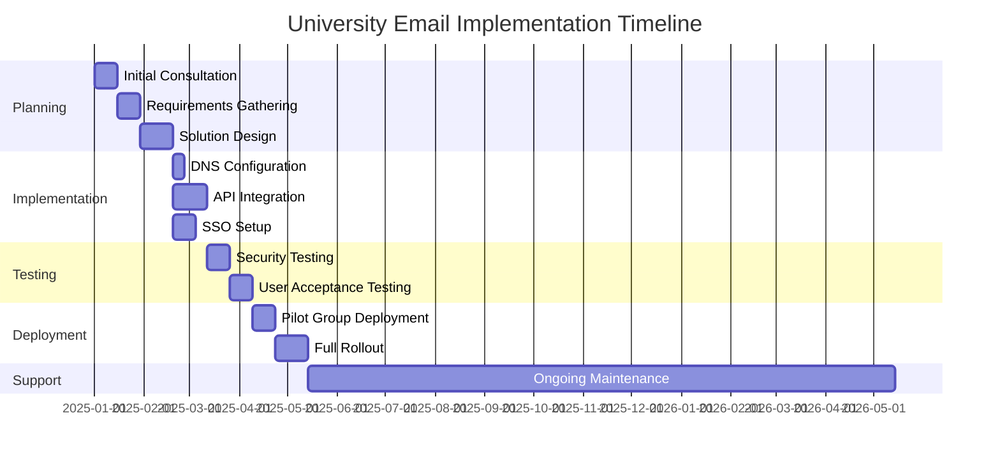
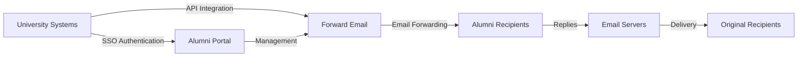

# Кейс: Как Forward Email обеспечивает решения для электронной почты выпускников ведущих университетов {#case-study-how-forward-email-powers-alumni-email-solutions-for-top-universities}


## Содержание {#table-of-contents}

* [Предисловие](#foreword)
* [Драматическая экономия средств при стабильном ценообразовании](#dramatic-cost-savings-with-stable-pricing)
  * [Реальная экономия университетов](#real-world-university-savings)
* [Проблема электронной почты выпускников университета](#the-university-alumni-email-challenge)
  * [Ценность электронной почты выпускников как идентичности](#the-value-of-alumni-email-identity)
  * [Традиционные решения не справляются](#traditional-solutions-fall-short)
  * [Решение Forward Email](#the-forward-email-solution)
* [Техническая реализация: как это работает](#technical-implementation-how-it-works)
  * [Основная архитектура](#core-architecture)
  * [Интеграция с университетскими системами](#integration-with-university-systems)
  * [Управление через API](#api-driven-management)
  * [Настройка и проверка DNS](#dns-configuration-and-verification)
  * [Тестирование и обеспечение качества](#testing-and-quality-assurance)
* [График внедрения](#implementation-timeline)
* [Процесс внедрения: от миграции до обслуживания](#implementation-process-from-migration-to-maintenance)
  * [Первичная оценка и планирование](#initial-assessment-and-planning)
  * [Стратегия миграции](#migration-strategy)
  * [Техническая настройка и конфигурация](#technical-setup-and-configuration)
  * [Дизайн пользовательского опыта](#user-experience-design)
  * [Обучение и документация](#training-and-documentation)
  * [Постоянная поддержка и оптимизация](#ongoing-support-and-optimization)
* [Кейс: Университет Кембриджа](#case-study-university-of-cambridge)
  * [Проблема](#challenge)
  * [Решение](#solution)
  * [Результаты](#results)
* [Преимущества для университетов и выпускников](#benefits-for-universities-and-alumni)
  * [Для университетов](#for-universities)
  * [Для выпускников](#for-alumni)
  * [Уровень принятия среди выпускников](#adoption-rates-among-alumni)
  * [Экономия средств по сравнению с предыдущими решениями](#cost-savings-compared-to-previous-solutions)
* [Вопросы безопасности и конфиденциальности](#security-and-privacy-considerations)
  * [Меры защиты данных](#data-protection-measures)
  * [Рамки соответствия требованиям](#compliance-framework)
* [Будущие разработки](#future-developments)
* [Заключение](#conclusion)


## Предисловие {#foreword}

Мы создали самый безопасный, приватный и гибкий сервис пересылки электронной почты в мире для престижных университетов и их выпускников.

В конкурентной среде высшего образования поддержание пожизненных связей с выпускниками — это не просто традиция, а стратегическая необходимость. Одним из самых ощутимых способов, которыми университеты укрепляют эти связи, являются адреса электронной почты выпускников, предоставляющие выпускникам цифровую идентичность, отражающую их академическое наследие.

В Forward Email мы сотрудничаем с некоторыми из самых престижных образовательных учреждений мира, чтобы революционизировать управление сервисами электронной почты для выпускников. Наше корпоративное решение для пересылки электронной почты теперь обеспечивает работу систем электронной почты выпускников для [Университета Кембриджа](https://en.wikipedia.org/wiki/University_of_Cambridge), [Университета Мэриленда](https://en.wikipedia.org/wiki/University_of_Maryland,_College_Park), [Университета Тафтса](https://en.wikipedia.org/wiki/Tufts_University) и [Колледжа Суортмор](https://en.wikipedia.org/wiki/Swarthmore_College), обслуживая вместе тысячи выпускников по всему миру.

В этом блоге мы расскажем, как наш [открытый](https://en.wikipedia.org/wiki/Open-source_software), ориентированный на конфиденциальность сервис пересылки электронной почты стал предпочтительным решением для этих учреждений, технические реализации, которые это обеспечивают, и трансформационное влияние, которое он оказал как на административную эффективность, так и на удовлетворенность выпускников.


## Драматическая экономия средств при стабильном ценообразовании {#dramatic-cost-savings-with-stable-pricing}
Финансовые преимущества нашего решения значительны, особенно по сравнению с постоянно растущими ценами традиционных провайдеров электронной почты:

| Решение                       | Стоимость на одного выпускника (годовая)                                                                  | Стоимость для 100 000 выпускников | Последние повышения цен                                                                                                                                                                  |
| ------------------------------ | --------------------------------------------------------------------------------------------------------- | --------------------------------- | ---------------------------------------------------------------------------------------------------------------------------------------------------------------------------------------- |
| Google Workspace for Business  | $72                                                                                                       | $7,200,000                        | • 2019: G Suite Basic с $5 до $6/месяц (+20%)<br>• 2023: Гибкие планы увеличены на 20%<br>• 2025: Business Plus с $18 до $26.40/месяц (+47%) с функциями ИИ                         |
| Google Workspace for Education | Бесплатно (Education Fundamentals)<br>$3/студент/год (Education Standard)<br>$5/студент/год (Education Plus) | Бесплатно - $500,000              | • Скидки за объем: 5% для 100-499 лицензий<br>• Скидки за объем: 10% для 500+ лицензий<br>• Бесплатный уровень ограничен основными сервисами                                           |
| Microsoft 365 Business         | $60                                                                                                       | $6,000,000                       | • 2023: Введены обновления цен два раза в год<br>• 2025 (янв): Personal с $6.99 до $9.99/месяц (+43%) с Copilot AI<br>• 2025 (апр): Повышение на 5% для годовых обязательств с помесячной оплатой |
| Microsoft 365 Education        | Бесплатно (A1)<br>$38-55/преподаватель/год (A3)<br>$65-96/преподаватель/год (A5)                         | Бесплатно - $96,000              | • Лицензии для студентов часто включены при покупке для преподавателей<br>• Индивидуальное ценообразование через объемные лицензии<br>• Бесплатный уровень ограничен веб-версиями          |
| Self-Hosted Exchange           | $45                                                                                                       | $4,500,000                      | Постоянные расходы на обслуживание и безопасность продолжают расти                                                                                                                      |
| **Forward Email Enterprise**   | **Фиксированная цена $250/месяц**                                                                         | **$3,000/год**                  | **С момента запуска не было повышения цен**                                                                                                                                              |

### Реальная экономия университетов {#real-world-university-savings}

Вот сколько наши партнерские университеты экономят ежегодно, выбирая Forward Email вместо традиционных провайдеров:

| Университет              | Количество выпускников | Годовая стоимость с Google | Годовая стоимость с Forward Email | Годовая экономия |
| ----------------------- | --------------------- | -------------------------- | --------------------------------- | ---------------- |
| Кембриджский университет | 30,000                | $90,000                    | $3,000                            | $87,000          |
| Колледж Суортмор        | 5,000                 | $15,000                    | $3,000                            | $12,000          |
| Университет Тафтса      | 12,000                | $36,000                    | $3,000                            | $33,000          |
| Университет Мэриленда   | 25,000                | $75,000                    | $3,000                            | $72,000          |

> \[!NOTE]
> Enterprise-версия Forward Email обычно стоит всего $250/месяц, без дополнительной платы за пользователя, без ограничений по API с белым списком, и единственная дополнительная стоимость — это хранение, если вам нужно дополнительное место в ГБ/ТБ для студентов (+$3 за каждые дополнительные 10 ГБ). Мы используем NVMe SSD-диски для быстрой поддержки IMAP/POP3/SMTP/CalDAV/CardDAV.
> \[!IMPORTANT]
> В отличие от Google и Microsoft, которые неоднократно повышали цены, интегрируя функции ИИ для анализа ваших данных, Forward Email сохраняет стабильные цены с строгим акцентом на конфиденциальность. Мы не используем ИИ, не отслеживаем шаблоны использования и не сохраняем логи или письма на диск (вся обработка происходит в памяти), обеспечивая полную конфиденциальность ваших коммуникаций с выпускниками.

Это представляет собой значительное сокращение затрат по сравнению с традиционными решениями для хостинга электронной почты — средства, которые университеты могут перенаправить на стипендии, исследования или другие критически важные задачи. Согласно анализу Email Vendor Selection 2023 года, образовательные учреждения все чаще ищут экономичные альтернативы традиционным почтовым провайдерам, поскольку цены продолжают расти с интеграцией функций ИИ ([Email Vendor Selection, 2023](https://www.emailvendorselection.com/email-service-provider-list/)).


## Проблема электронной почты для выпускников университета {#the-university-alumni-email-challenge}

Для университетов предоставление пожизненных адресов электронной почты выпускникам представляет собой уникальный набор задач, с которыми традиционные почтовые решения не всегда эффективно справляются. Как отмечено в подробном обсуждении на ServerFault, университеты с большой базой пользователей требуют специализированных почтовых решений, которые балансируют производительность, безопасность и экономическую эффективность ([ServerFault, 2009](https://serverfault.com/questions/97364/what-is-the-best-mail-server-for-a-university-with-a-large-amount-of-users)).

### Ценность электронной почты для выпускников {#the-value-of-alumni-email-identity}

Адреса электронной почты выпускников (например, `firstname.lastname@cl.cam.ac.uk` или `username@terpalum.umd.edu`) выполняют несколько важных функций:

* Поддержание связи с учреждением и идентичности бренда
* Обеспечение постоянной коммуникации с университетом
* Повышение профессионального авторитета выпускников
* Поддержка сетевого взаимодействия и сообщества выпускников
* Обеспечение стабильной, пожизненной точки контакта

Исследование Текаде (2020) подчеркивает, что образовательные адреса электронной почты предоставляют выпускникам множество преимуществ, включая доступ к академическим ресурсам, профессиональный авторитет и эксклюзивные скидки на различные услуги ([Medium, 2020](https://medium.com/coders-capsule/top-20-benefits-of-having-an-educational-email-address-91a09795e05)).

> \[!TIP]
> Посетите наш новый каталог [AlumniEmail.com](https://alumniemail.com) — это комплексный ресурс по услугам электронной почты для выпускников университетов, включая руководства по настройке, лучшие практики и поисковый каталог доменов электронной почты выпускников. Это центральный узел для всей информации об электронной почте выпускников.

### Традиционные решения не справляются {#traditional-solutions-fall-short}

Обычные почтовые системы имеют несколько ограничений при применении к потребностям электронной почты выпускников:

* **Высокая стоимость**: модели лицензирования на пользователя становятся финансово невыгодными для больших баз выпускников
* **Административная нагрузка**: управление тысячами или миллионами аккаунтов требует значительных ИТ-ресурсов
* **Проблемы безопасности**: поддержание безопасности неактивных аккаунтов увеличивает уязвимость
* **Ограниченная гибкость**: жесткие системы не могут адаптироваться к уникальным потребностям переадресации электронной почты выпускников
* **Проблемы конфиденциальности**: многие провайдеры сканируют содержимое писем в рекламных целях

Обсуждение на Quora по поддержке университетской почты показывает, что проблемы безопасности являются основной причиной, по которой университеты могут ограничивать или отменять адреса электронной почты выпускников, поскольку неиспользуемые аккаунты могут быть уязвимы к взлому и краже личности ([Quora, 2011](https://www.quora.com/Is-there-any-cost-for-a-college-or-university-to-maintain-edu-e-mail-addresses)).

### Решение Forward Email {#the-forward-email-solution}

Наш подход решает эти задачи с помощью принципиально иной модели:

* Переадресация электронной почты вместо хостинга
* Фиксированная плата вместо оплаты за пользователя
* Открытая архитектура для прозрачности и безопасности
* Конфиденциальность в первую очередь без сканирования содержимого
* Специализированные функции для управления идентичностью университета


## Техническая реализация: как это работает {#technical-implementation-how-it-works}
Наше решение использует сложную, но элегантно простую техническую архитектуру для обеспечения надежной и безопасной пересылки электронной почты в масштабах.

### Основная архитектура {#core-architecture}

Система Forward Email состоит из нескольких ключевых компонентов:

* Распределённые MX-серверы для высокой доступности
* Пересылка в реальном времени без хранения сообщений
* Комплексная аутентификация электронной почты
* Поддержка пользовательских доменов и поддоменов
* Управление аккаунтами через API

По мнению IT-специалистов на ServerFault, для университетов, желающих внедрить собственные почтовые решения, Postfix рекомендуется как лучший Mail Transfer Agent (MTA), а Courier или Dovecot предпочтительны для доступа по IMAP/POP3 ([ServerFault, 2009](https://serverfault.com/questions/97364/what-is-the-best-mail-server-for-a-university-with-a-large-amount-of-users)). Однако наше решение устраняет необходимость университетам самостоятельно управлять этими сложными системами.

### Интеграция с университетскими системами {#integration-with-university-systems}

Мы разработали бесшовные пути интеграции с существующей инфраструктурой университета:

* Автоматическое предоставление через интеграцию с [RESTful API](https://forwardemail.net/email-api)
* Опции кастомизации брендинга для университетских порталов
* Гибкое управление псевдонимами для факультетов и организаций
* Пакетные операции для эффективного администрирования

### Управление через API {#api-driven-management}

Наш [RESTful API](https://forwardemail.net/email-api) позволяет университетам автоматизировать управление электронной почтой:

```javascript
// Пример: Создание нового адреса электронной почты для выпускников
const response = await fetch('https://forwardemail.net/api/v1/domains/example.edu/aliases', {
  method: 'POST',
  headers: {
    'Content-Type': 'application/json',
    'Authorization': `Basic ${Buffer.from(YOUR_API_TOKEN + ":").toString('base64')}`
  },
  body: JSON.stringify({
    name: 'alumni.john.smith',
    recipients: ['johnsmith@gmail.com'],
    has_recipient_verification: true
  })
});
```

### Конфигурация DNS и проверка {#dns-configuration-and-verification}

Правильная конфигурация DNS критична для доставки электронной почты. Наша команда помогает с:

* Конфигурацией [DNS](https://en.wikipedia.org/wiki/Domain_Name_System), включая MX-записи
* Комплексной реализацией безопасности электронной почты с использованием нашего open-source пакета [mailauth](https://www.npmjs.com/package/mailauth), универсального инструмента для аутентификации почты, который поддерживает:
  * [SPF](https://en.wikipedia.org/wiki/Sender_Policy_Framework) (Sender Policy Framework) для предотвращения подделки отправителя
  * [DKIM](https://en.wikipedia.org/wiki/DomainKeys_Identified_Mail) (DomainKeys Identified Mail) для аутентификации почты
  * [DMARC](https://en.wikipedia.org/wiki/Email_authentication) (Domain-based Message Authentication, Reporting & Conformance) для применения политики
  * [MTA-STS](https://en.wikipedia.org/wiki/Opportunistic_TLS) (SMTP MTA Strict Transport Security) для обеспечения шифрования TLS
  * [ARC](https://en.wikipedia.org/wiki/DomainKeys_Identified_Mail#Authenticated_Received_Chain) (Authenticated Received Chain) для сохранения аутентификации при пересылке сообщений
  * [SRS](https://en.wikipedia.org/wiki/Sender_Rewriting_Scheme) (Sender Rewriting Scheme) для сохранения проверки SPF при пересылке
  * [BIMI](https://en.wikipedia.org/wiki/Email_authentication) (Brand Indicators for Message Identification) для отображения логотипа в поддерживающих почтовых клиентах
* Проверкой TXT-записей DNS для подтверждения владения доменом

Пакет `mailauth` (<http://npmjs.com/package/mailauth>) — это полностью open-source решение, которое охватывает все аспекты аутентификации электронной почты в одной интегрированной библиотеке. В отличие от проприетарных решений, такой подход обеспечивает прозрачность, регулярные обновления безопасности и полный контроль над процессом аутентификации почты.

### Тестирование и обеспечение качества {#testing-and-quality-assurance}

Перед полномасштабным развертыванием мы проводим тщательное тестирование:

* Тестирование доставки электронной почты от начала до конца
* Нагрузочное тестирование для сценариев с большим объемом
* Тестирование на проникновение для проверки безопасности
* Валидация интеграции API
* Приемочное тестирование с участием представителей выпускников
## График реализации {#implementation-timeline}


```mermaid
gantt
    title University Email Implementation Timeline
    dateFormat  YYYY-MM-DD
    section Planning
    Initial Consultation           :a1, 2025-01-01, 14d
    Requirements Gathering         :a2, after a1, 14d
    Solution Design                :a3, after a2, 21d
    section Implementation
    DNS Configuration              :b1, after a3, 7d
    API Integration                :b2, after a3, 21d
    SSO Setup                      :b3, after a3, 14d
    section Testing
    Security Testing               :c1, after b1 b2 b3, 14d
    User Acceptance Testing        :c2, after c1, 14d
    section Deployment
    Pilot Group Deployment         :d1, after c2, 14d
    Full Rollout                   :d2, after d1, 21d
    section Support
    Ongoing Maintenance            :e1, after d2, 365d
```


## Процесс реализации: от миграции до обслуживания {#implementation-process-from-migration-to-maintenance}

Наш структурированный процесс реализации обеспечивает плавный переход для университетов, внедряющих наше решение.

### Первичная оценка и планирование {#initial-assessment-and-planning}

Мы начинаем с комплексной оценки текущей системы электронной почты университета, базы данных выпускников и технических требований. Этот этап включает:

* Интервью с заинтересованными сторонами из ИТ, отдела по работе с выпускниками и администрации
* Технический аудит существующей инфраструктуры электронной почты
* Картирование данных для записей выпускников
* Проверка безопасности и соответствия требованиям
* Разработка графика проекта и ключевых этапов

### Стратегия миграции {#migration-strategy}

На основе оценки мы разрабатываем индивидуальную стратегию миграции, которая минимизирует перебои и обеспечивает полную целостность данных:

* Поэтапный подход к миграции по когорте выпускников
* Параллельная работа систем в период перехода
* Комплексные протоколы проверки данных
* Процедуры отката на случай проблем с миграцией
* Четкий план коммуникаций для всех заинтересованных сторон

### Техническая настройка и конфигурация {#technical-setup-and-configuration}

Наша техническая команда занимается всеми аспектами настройки системы:

* Конфигурация и проверка DNS
* Интеграция API с университетскими системами
* Разработка кастомного портала с брендингом университета
* Настройка аутентификации электронной почты (SPF, DKIM, DMARC)

### Дизайн пользовательского опыта {#user-experience-design}

Мы тесно сотрудничаем с университетами для создания интуитивно понятных интерфейсов как для администраторов, так и для выпускников:

* Порталы электронной почты для выпускников с фирменным стилем
* Упрощенное управление переадресацией почты
* Адаптивный дизайн для мобильных устройств
* Соответствие требованиям доступности
* Поддержка нескольких языков при необходимости

### Обучение и документация {#training-and-documentation}

Комплексное обучение гарантирует, что все заинтересованные стороны смогут эффективно использовать систему:

* Сессии обучения администраторов
* Техническая документация для ИТ-персонала
* Руководства пользователя для выпускников
* Видеоуроки по распространенным задачам
* Разработка базы знаний

### Постоянная поддержка и оптимизация {#ongoing-support-and-optimization}

Наше партнерство продолжается далеко за пределами внедрения:

* Круглосуточная техническая поддержка
* Регулярные обновления системы и патчи безопасности
* Мониторинг производительности и оптимизация
* Консультации по лучшим практикам работы с электронной почтой
* Аналитика данных и отчетность


## Кейc: Университет Кембриджа {#case-study-university-of-cambridge}

Университет Кембриджа искал решение для предоставления адресов электронной почты @cam.ac.uk выпускникам при снижении нагрузки на ИТ и затрат.

### Задача {#challenge}

Кембридж столкнулся с несколькими проблемами в своей предыдущей системе электронной почты для выпускников:

* Высокие операционные расходы на поддержание отдельной инфраструктуры электронной почты
* Административная нагрузка по управлению тысячами аккаунтов
* Проблемы безопасности с неактивными аккаунтами
* Ограниченная интеграция с системами базы данных выпускников
* Растущие требования к хранилищу данных

### Решение {#solution}

Forward Email реализовал комплексное решение:

* Переадресация электронной почты для всех адресов выпускников @cam.ac.uk
* Портал с фирменным стилем для самостоятельного обслуживания выпускников
* Интеграция API с базой данных выпускников Кембриджа
* Комплексная реализация безопасности электронной почты

### Результаты {#results}

Внедрение принесло значительные преимущества:
* Существенное снижение затрат по сравнению с предыдущим решением
* 99,9% надежность доставки электронной почты
* Упрощённое администрирование за счёт автоматизации
* Повышенная безопасность с использованием современных методов аутентификации электронной почты
* Положительные отзывы выпускников о удобстве системы


## Преимущества для университетов и выпускников {#benefits-for-universities-and-alumni}

Наше решение приносит ощутимые выгоды как для учебных заведений, так и для их выпускников.

### Для университетов {#for-universities}

* **Экономия средств**: фиксированная цена независимо от количества выпускников
* **Простота администрирования**: автоматическое управление через API
* **Повышенная безопасность**: комплексная аутентификация электронной почты
* **Согласованность бренда**: пожизненные институциональные адреса электронной почты
* **Вовлечённость выпускников**: укрепление связей через постоянное обслуживание

Согласно BulkSignature (2023), платформы электронной почты для образовательных учреждений предлагают значительные преимущества, включая экономичность за счёт бесплатных или недорогих тарифов, экономию времени благодаря возможностям массовой рассылки и функции отслеживания доставки и вовлечённости ([BulkSignature, 2023](https://bulksignature.com/blog/5-best-email-platforms-for-educational-institutions/)).

### Для выпускников {#for-alumni}

* **Профессиональная идентичность**: престижный университетский адрес электронной почты
* **Непрерывность электронной почты**: пересылка на любой личный адрес
* **Защита конфиденциальности**: отсутствие сканирования содержимого и майнинга данных
* **Упрощённое управление**: лёгкое обновление получателей
* **Повышенная безопасность**: современные методы аутентификации электронной почты

Исследование Международного журнала образования и грамотности подчёркивает важность правильного использования электронной почты в академической среде, отмечая, что грамотность в области электронной почты является ключевым навыком как для студентов, так и для выпускников в профессиональной сфере ([IJELS, 2021](https://files.eric.ed.gov/fulltext/EJ1319324.pdf)).

### Уровень принятия среди выпускников {#adoption-rates-among-alumni}

Университеты сообщают о высоком уровне принятия и удовлетворённости среди своих выпускников.

### Экономия средств по сравнению с предыдущими решениями {#cost-savings-compared-to-previous-solutions}

Финансовый эффект оказался значительным: университеты отмечают существенную экономию по сравнению с предыдущими решениями для электронной почты.


## Вопросы безопасности и конфиденциальности {#security-and-privacy-considerations}

Для образовательных учреждений защита данных выпускников — это не просто хорошая практика, а зачастую юридическое требование в соответствии с такими нормативами, как GDPR в Европе.

### Меры защиты данных {#data-protection-measures}

Наше решение включает несколько уровней безопасности:

* Сквозное шифрование всей электронной почты
* Отсутствие хранения содержимого писем на наших серверах
* Регулярные аудиты безопасности и тестирование на проникновение
* Соответствие международным стандартам защиты данных
* Прозрачный, открытый исходный код для проверки безопасности

> \[!WARNING]
> Многие провайдеры электронной почты сканируют содержимое писем в рекламных целях или для обучения моделей ИИ. Эта практика вызывает серьёзные опасения по поводу конфиденциальности, особенно для профессиональной и академической переписки. Forward Email никогда не сканирует содержимое писем и обрабатывает все письма в памяти, обеспечивая полную конфиденциальность.

### Рамки соответствия {#compliance-framework}

Мы строго соблюдаем соответствующие нормативы:

* Соответствие GDPR для европейских учреждений
* Сертификация SOC 2 Type II
* Ежегодные оценки безопасности
* Соглашение об обработке данных (DPA) доступно по адресу [forwardemail.net/dpa](https://forwardemail.net/dpa)
* Регулярные обновления соответствия по мере изменения нормативов


## Будущие разработки {#future-developments}

Мы продолжаем совершенствовать наше решение для электронной почты выпускников, добавляя новые функции и возможности:

* Расширенная аналитика для администраторов университетов
* Продвинутые средства защиты от фишинга
* Расширенные возможности API для глубокой интеграции
* Дополнительные варианты аутентификации


## Заключение {#conclusion}

Forward Email произвёл революцию в том, как университеты предоставляют и управляют услугами электронной почты для выпускников. Заменив дорогостоящий и сложный хостинг электронной почты элегантной и безопасной пересылкой, мы позволили учреждениям предоставлять пожизненные адреса электронной почты всем выпускникам, значительно снижая затраты и административную нагрузку.
Наши партнерства с престижными учреждениями, такими как Кембридж, Мэриленд, Тафтс и Суортмор, демонстрируют эффективность нашего подхода в различных образовательных средах. Поскольку университеты сталкиваются с растущим давлением по поддержанию связей с выпускниками при контроле затрат, наше решение предлагает убедительную альтернативу традиционным почтовым системам.


```mermaid
flowchart LR
    A[University Systems] -->|API Integration| B[Forward Email]
    B -->|Email Forwarding| C[Alumni Recipients]
    C -->|Replies| D[Email Servers]
    D -->|Delivery| E[Original Recipients]
    F[Alumni Portal] -->|Management| B
    A -->|SSO Authentication| F
```

Для университетов, заинтересованных в изучении того, как Forward Email может преобразовать их сервисы электронной почты для выпускников, свяжитесь с нашей командой по адресу <support@forwardemail.net> или посетите [forwardemail.net](https://forwardemail.net), чтобы узнать больше о наших корпоративных решениях.
