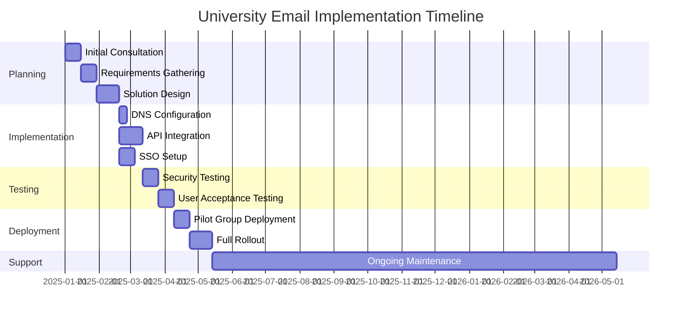
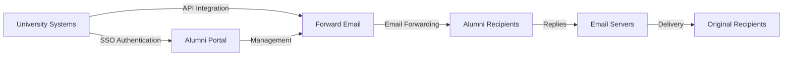

# Fallstudie: Hur vidarebefordran av e-post ger e-postlösningar för alumner på toppuniversitet {#case-study-how-forward-email-powers-alumni-email-solutions-for-top-universities}


## Innehållsförteckning {#table-of-contents}

* [Förord](#foreword)
* [Dramatiska kostnadsbesparingar med stabil prissättning](#dramatic-cost-savings-with-stable-pricing)
  * [Sparande på universitet i verkligheten](#real-world-university-savings)
* [Universitetets alumniutmaning via e-post](#the-university-alumni-email-challenge)
  * [Värdet av alumniernas e-postadress](#the-value-of-alumni-email-identity)
  * [Traditionella lösningar misslyckas](#traditional-solutions-fall-short)
  * [Lösningen för vidarebefordran av e-post](#the-forward-email-solution)
* [Teknisk implementering: Så fungerar det](#technical-implementation-how-it-works)
  * [Kärnarkitektur](#core-architecture)
  * [Integration med universitetssystem](#integration-with-university-systems)
  * [API-driven hantering](#api-driven-management)
  * [DNS-konfiguration och verifiering](#dns-configuration-and-verification)
  * [Testning och kvalitetssäkring](#testing-and-quality-assurance)
* [Implementeringstidslinje](#implementation-timeline)
* [Implementeringsprocess: Från migrering till underhåll](#implementation-process-from-migration-to-maintenance)
  * [Inledande bedömning och planering](#initial-assessment-and-planning)
  * [Migrationsstrategi](#migration-strategy)
  * [Teknisk installation och konfiguration](#technical-setup-and-configuration)
  * [Design av användarupplevelse](#user-experience-design)
  * [Utbildning och dokumentation](#training-and-documentation)
  * [Löpande support och optimering](#ongoing-support-and-optimization)
* [Fallstudie: Cambridges universitet](#case-study-university-of-cambridge)
  * [Utmaning](#challenge)
  * [Lösning](#solution)
  * [Resultat](#results)
* [Fördelar för universitet och alumner](#benefits-for-universities-and-alumni)
  * [För universitet](#for-universities)
  * [För alumner](#for-alumni)
  * [Adoptionsfrekvens bland alumner](#adoption-rates-among-alumni)
  * [Kostnadsbesparingar jämfört med tidigare lösningar](#cost-savings-compared-to-previous-solutions)
* [Säkerhets- och integritetsöverväganden](#security-and-privacy-considerations)
  * [Dataskyddsåtgärder](#data-protection-measures)
  * [Regelverk för efterlevnad](#compliance-framework)
* [Framtida utveckling](#future-developments)
* [Slutsats](#conclusion)

## Förord {#foreword}

Vi har byggt världens säkraste, mest privata och flexibla e-postvidarebefordringstjänst för prestigefyllda universitet och deras alumner.

I den konkurrensutsatta högre utbildningens landskap är det inte bara en traditionsfråga att upprätthålla livslånga kontakter med alumner – det är ett strategiskt krav. Ett av de mest konkreta sätten som universitet främjar dessa kontakter är genom e-postadresser till alumner, vilket ger akademiker en digital identitet som återspeglar deras akademiska arv.

På Forward Email har vi samarbetat med några av världens mest prestigefyllda utbildningsinstitutioner för att revolutionera hur de hanterar e-posttjänster för alumner. Vår lösning för vidarebefordran av e-post i företagsklass driver nu e-postsystemen för alumner för [Cambridges universitet](https://en.wikipedia.org/wiki/University_of_Cambridge), [Marylands universitet](https://en.wikipedia.org/wiki/University_of_Maryland,\_College_Park), [Tufts universitet](https://en.wikipedia.org/wiki/Tufts_University) och [Swarthmore College](https://en.wikipedia.org/wiki/Swarthmore_College), som tillsammans betjänar tusentals alumner världen över.

Det här blogginlägget utforskar hur vår [öppen källkod](https://en.wikipedia.org/wiki/Open-source_software), integritetsfokuserade vidarebefordringstjänst för e-post har blivit den föredragna lösningen för dessa institutioner, de tekniska implementeringar som gör det möjligt och den transformativa inverkan den har haft på både administrativ effektivitet och alumni-nöjdhet.

## Dramatiska kostnadsbesparingar med stabil prissättning {#dramatic-cost-savings-with-stable-pricing}

De ekonomiska fördelarna med vår lösning är betydande, särskilt jämfört med de ständigt ökande priserna hos traditionella e-postleverantörer:

| Lösning | Kostnad per alumn (årlig) | Kostnad för 100 000 alumner | Senaste prisökningarna |
| ------------------------------ | --------------------------------------------------------------------------------------------------------- | ----------------------- | ---------------------------------------------------------------------------------------------------------------------------------------------------------------------------------------- |
| Google Workspace för företag | $72 | $7,200,000 | • 2019: G Suite Basic från 5 USD till 6 USD/månad (+20 %)<br>• 2023: Flexibla abonnemang ökade med 20 %<br>• 2025: Business Plus från 18 USD till 26,40 USD/månad (+47 %) med AI-funktioner |
| Google Workspace för utbildning | Gratis (Education Fundamentals)<br>3 USD/student/år (Education Standard)<br>5 USD/student/år (Education Plus) | Gratis - 500 000 dollar | • Volymrabatter: 5 % för 100–499 licenser<br>• Volymrabatter: 10 % för 500+ licenser<br>• Gratisnivå begränsad till kärntjänster |
| Microsoft 365 Business | $60 | $6,000,000 | • 2023: Introducerade prisuppdateringar två gånger om året<br>• 2025 (jan): Personligt från 6,99 USD till 9,99 USD/månad (+43 %) med Copilot AI<br>• 2025 (apr): 5 % ökning av årliga åtaganden som betalas månadsvis |
| Microsoft 365 Utbildning | Gratis (A1)<br>38–55 USD/fakultet/år (A3)<br>65–96 USD/fakultet/år (A5) | Gratis - 96 000 dollar | • Studentlicenser ingår ofta i köp av lärare<br>• Anpassade priser genom volymlicensering<br>• Gratisnivå begränsad till webbversioner |
| Självhostad Exchange | $45 | $4,500,000 | Löpande underhålls- och säkerhetskostnader fortsätter att öka |
| **Vidarebefordra e-postföretag** | **Fast 250 kr/månad** | **3 000 dollar/år** | **Inga prishöjningar sedan lanseringen** |

### Besparingar från verkliga universitet {#real-world-university-savings}

Här är hur mycket våra partneruniversitet sparar årligen genom att välja Vidarebefordra e-post framför traditionella leverantörer:

| Universitet | Antal alumner | Årskostnad med Google | Årskostnad med vidarebefordran av e-post | Årliga besparingar |
| ----------------------- | ------------ | ----------------------- | ------------------------------ | -------------- |
| Cambridges universitet | 30,000 | $90,000 | $3,000 | $87,000 |
| Swarthmore College | 5,000 | $15,000 | $3,000 | $12,000 |
| Tufts universitet | 12,000 | $36,000 | $3,000 | $33,000 |
| Marylands universitet | 25,000 | $75,000 | $3,000 | $72,000 |

> \[!NOTE]
> Vidarebefordra e-post för företag kostar vanligtvis endast 250 USD/månad, utan extra kostnad per användare, begränsningar för vitlistade API-priser, och den enda extra kostnaden är lagring om du behöver ytterligare GB/TB för studenter (+3 USD per 10 GB ytterligare lagringsutrymme). Vi använder även NVMe SSD-diskar för snabbt stöd för IMAP/POP3/SMTP/CalDAV/CardDAV.

> \[!IMPORTANT]
> Till skillnad från Google och Microsoft, som upprepade gånger har höjt sina priser samtidigt som de integrerat AI-funktioner som analyserar dina data, upprätthåller Forward Email stabila priser med ett strikt fokus på integritet. Vi använder inte AI, spårar inte användningsmönster och lagrar inte loggar eller e-postmeddelanden på disk (all bearbetning sker i minnet), vilket garanterar fullständig integritet för din alumnikommunikation.

Detta representerar en betydande kostnadsminskning jämfört med traditionella e-posthostinglösningar – medel som universitet kan omdirigera till stipendier, forskning eller andra verksamhetskritiska aktiviteter. Enligt en analys från 2023 av Email Vendor Selection söker utbildningsinstitutioner i allt högre grad kostnadseffektiva alternativ till traditionella e-postleverantörer i takt med att priserna fortsätter att stiga med integrationen av AI-funktioner ([Val av e-postleverantör, 2023](https://www.emailvendorselection.com/email-service-provider-list/)).

## Universitetets alumniutmaning via e-post {#the-university-alumni-email-challenge}

För universitet innebär det en unik uppsättning utmaningar att tillhandahålla livstids-e-postadresser till alumner som traditionella e-postlösningar har svårt att hantera effektivt. Som nämnts i en omfattande diskussion om ServerFault kräver universitet med stora användarbaser specialiserade e-postlösningar som balanserar prestanda, säkerhet och kostnadseffektivitet ([Serverfel, 2009](https://serverfault.com/questions/97364/what-is-the-best-mail-server-for-a-university-with-a-large-amount-of-users)).

### Värdet av alumni-e-postadresser {#the-value-of-alumni-email-identity}

Alumni-e-postadresser (som `firstname.lastname@cl.cam.ac.uk` eller `username@terpalum.umd.edu`) fyller flera viktiga funktioner:

* Upprätthålla institutionell koppling och varumärkesidentitet
* Underlätta kontinuerlig kommunikation med universitetet
* Stärka den professionella trovärdigheten för akademiker
* Stödja alumninätverk och communitybyggande
* Tillhandahålla en stabil kontaktpunkt för livet

Forskning från Tekade (2020) visar att e-postadresser inom utbildningsområdet ger alumner många fördelar, inklusive tillgång till akademiska resurser, professionell trovärdighet och exklusiva rabatter på olika tjänster ([Medel, 2020](https://medium.com/coders-capsule/top-20-benefits-of-having-an-educational-email-address-91a09795e05)).

> \[!TIP]
> Besök vår nya [AlumniEmail.com](https://alumniemail.com)-katalog för en omfattande resurs om e-posttjänster för universitetets alumner, inklusive installationsguider, bästa praxis och en sökbar katalog över e-postdomäner för alumner. Den fungerar som en central hubb för all information om e-post till alumner.

### Traditionella lösningar misslyckas {#traditional-solutions-fall-short}

Konventionella e-postsystem har flera begränsningar när de tillämpas på alumners e-postbehov:

* **Kostnadsöverkomlig**: Licensmodeller per användare blir ekonomiskt ohållbara för stora alumnibaser
* **Administrativ börda**: Att hantera tusentals eller miljontals konton kräver betydande IT-resurser
* **Säkerhetsproblem**: Att upprätthålla säkerheten för vilande konton ökar sårbarheten
* **Begränsad flexibilitet**: Stela system kan inte anpassas till de unika behoven för vidarebefordran av e-post från alumner
* **Integritetsproblem**: Många leverantörer skannar e-postinnehåll för reklamändamål

En Quora-diskussion om underhåll av universitets e-post visar att säkerhetsproblem är en viktig anledning till att universitet kan begränsa eller avsluta alumni-e-postadresser, eftersom oanvända konton kan vara sårbara för hackning och identitetsstöld ([Quora, 2011](https://www.quora.com/Is-there-any-cost-for-a-college-or-university-to-maintain-edu-e-mail-addresses)).

### Lösningen för vidarebefordran av e-post {#the-forward-email-solution}

Vårt tillvägagångssätt hanterar dessa utmaningar genom en fundamentalt annorlunda modell:

* Vidarebefordran av e-post istället för webbhotell
* Fast avgift istället för kostnader per användare
* Arkitektur med öppen källkod för transparens och säkerhet
* Design med fokus på integritet utan innehållsskanning
* Specialiserade funktioner för hantering av universitetsidentitet

## Teknisk implementering: Så fungerar det {#technical-implementation-how-it-works}

Vår lösning utnyttjar en sofistikerad men elegant enkel teknisk arkitektur för att leverera pålitlig och säker vidarebefordran av e-post i stor skala.

### Kärnarkitektur {#core-architecture}

Systemet för vidarebefordran av e-post består av flera viktiga komponenter:

* Distribuerade MX-servrar för hög tillgänglighet
* Vidarebefordran i realtid utan meddelandelagring
* Omfattande e-postautentisering
* Stöd för anpassade domäner och underdomäner
* API-driven kontohantering

Enligt IT-experter på ServerFault rekommenderas Postfix som den bästa Mail Transfer Agent (MTA) för universitet som vill implementera sina egna e-postlösningar, medan Courier eller Dovecot föredras för IMAP/POP3-åtkomst ([Serverfel, 2009](https://serverfault.com/questions/97364/what-is-the-best-mail-server-for-a-university-with-a-large-amount-of-users)). Vår lösning eliminerar dock behovet för universiteten att hantera dessa komplexa system själva.

### Integration med universitetssystem {#integration-with-university-systems}

Vi har utvecklat sömlösa integrationsvägar med befintlig universitetsinfrastruktur:

* Automatiserad provisionering genom [RESTful API](https://forwardemail.net/email-api)-integration
* Anpassade varumärkesalternativ för universitetsportaler
* Flexibel aliashantering för institutioner och organisationer
* Batchåtgärder för effektiv administration

### API-driven hantering {#api-driven-management}

Vår [RESTful API](https://forwardemail.net/email-api) gör det möjligt för universitet att automatisera e-posthantering:

```javascript
// Example: Creating a new alumni email address
const response = await fetch('https://forwardemail.net/api/v1/domains/example.edu/aliases', {
  method: 'POST',
  headers: {
    'Content-Type': 'application/json',
    'Authorization': `Basic ${Buffer.from(YOUR_API_TOKEN + ":").toString('base64')}`
  },
  body: JSON.stringify({
    name: 'alumni.john.smith',
    recipients: ['johnsmith@gmail.com'],
    has_recipient_verification: true
  })
});
```

### DNS-konfiguration och verifiering {#dns-configuration-and-verification}

Korrekt DNS-konfiguration är avgörande för e-postleverans. Vårt team hjälper till med:

* [DNS](https://en.wikipedia.org/wiki/Domain_Name_System)-konfiguration inklusive MX-poster
* Omfattande implementering av e-postsäkerhet med vårt öppna källkodspaket [e-postautentisering](https://www.npmjs.com/package/mailauth), en schweizisk armékniv för e-postautentisering som hanterar:
* [SPF](https://en.wikipedia.org/wiki/Sender_Policy_Framework) (Sender Policy Framework) för att förhindra e-postförfalskning
* [DKIM](https://en.wikipedia.org/wiki/DomainKeys_Identified_Mail) (DomainKeys Identified Mail) för e-postautentisering
* [DMARC](https://en.wikipedia.org/wiki/Email_authentication) (Domänbaserad meddelandeautentisering, rapportering och efterlevnad) för policytillämpning
* [MTA-STS](https://en.wikipedia.org/wiki/Opportunistic_TLS) (SMTP MTA Strict Transport Security) för att tillämpa TLS-kryptering
* [ARC](https://en.wikipedia.org/wiki/DomainKeys_Identified_Mail#Authenticated_Received_Chain) (Autentiserad mottagen kedja) för att upprätthålla autentisering när meddelanden vidarebefordras
* [SRS](https://en.wikipedia.org/wiki/Sender_Rewriting_Scheme) (Sender Rewriting Scheme) för att bevara SPF-validering genom vidarebefordran
* [BIMI](https://en.wikipedia.org/wiki/Email_authentication) (Varumärkesindikatorer för meddelandeidentifiering) för logotypvisning i stödjande e-postklienter
* DNS TXT-postverifiering för domänägande

Paketet `mailauth` (<http://npmjs.com/package/mailauth>) är en helt öppen källkodslösning som hanterar alla aspekter av e-postautentisering i ett integrerat bibliotek. Till skillnad från proprietära lösningar säkerställer denna metod transparens, regelbundna säkerhetsuppdateringar och fullständig kontroll över e-postautentiseringsprocessen.

### Testning och kvalitetssäkring {#testing-and-quality-assurance}

Innan fullständig driftsättning genomför vi rigorösa tester:

* Helhetstestning av e-postleverans
* Lasttestning för scenarier med hög volym
* Säkerhetspenetrationstestning
* Validering av API-integration
* Användaracceptanstestning med alumnirepresentanter

## Implementeringstidslinje {#implementation-timeline}



## Implementeringsprocess: Från migrering till underhåll {#implementation-process-from-migration-to-maintenance}

Vår strukturerade implementeringsprocess säkerställer en smidig övergång för universitet som anammar vår lösning.

### Inledande bedömning och planering {#initial-assessment-and-planning}

Vi börjar med en omfattande bedömning av universitetets nuvarande e-postsystem, alumnidatabas och tekniska krav. Denna fas inkluderar:

* Intervjuer med intressenter inom IT, alumnrelationer och administration
* Teknisk granskning av befintlig e-postinfrastruktur
* Datamappning för alumniregister
* Granskning av säkerhet och efterlevnad
* Projektets tidslinje och utveckling av milstolpar

### Migreringsstrategi {#migration-strategy}

Baserat på bedömningen utvecklar vi en skräddarsydd migreringsstrategi som minimerar störningar samtidigt som fullständig dataintegritet säkerställs:

* Stegvis migreringsmetod för alumnigrupper
* Parallell systemdrift under övergången
* Omfattande protokoll för datavalidering
* Reservprocedurer för eventuella migreringsproblem
* Tydlig kommunikationsplan för alla intressenter

### Teknisk installation och konfiguration {#technical-setup-and-configuration}

Vårt tekniska team hanterar alla aspekter av systeminstallationen:

* DNS-konfiguration och verifiering
* API-integration med universitetssystem
* Anpassad portalutveckling med universitetets varumärkesbyggande
* Konfiguration av e-postautentisering (SPF, DKIM, DMARC)

### Användarupplevelsedesign {#user-experience-design}

Vi arbetar nära universitet för att skapa intuitiva gränssnitt för både administratörer och alumner:

* Anpassade e-postportaler för alumner
* Förenklad hantering av vidarebefordran av e-post
* Mobilanpassad design
* Tillgänglighetsefterlevnad
* Flerspråkigt stöd vid behov

### Utbildning och dokumentation {#training-and-documentation}

Omfattande utbildning säkerställer att alla berörda parter kan använda systemet effektivt:

* Administratörsutbildningar
* Teknisk dokumentation för IT-personal
* Användarhandledning för alumner
* Videohandledningar för vanliga uppgifter
* Utveckling av kunskapsbas

### Löpande support och optimering {#ongoing-support-and-optimization}

Vårt partnerskap fortsätter långt efter genomförandet:

* Teknisk support dygnet runt
* Regelbundna systemuppdateringar och säkerhetsuppdateringar
* Prestandaövervakning och optimering
* Konsultation om bästa praxis för e-post
* Dataanalys och rapportering

## Fallstudie: Cambridges universitet {#case-study-university-of-cambridge}

University of Cambridge sökte en lösning för att tillhandahålla e-postadresser med @cam.ac.uk till alumner, samtidigt som IT-kostnader minskades.

### Utmaning {#challenge}

Cambridge stod inför flera utmaningar med sitt tidigare e-postsystem för alumner:

* Höga driftskostnader för att underhålla separat e-postinfrastruktur
* Administrativ börda av att hantera tusentals konton
* Säkerhetsproblem med vilande konton
* Begränsad integration med alumnidatabassystem
* Ökande lagringsbehov

### Lösning {#solution}

Vidarebefordra e-post implementerade en heltäckande lösning:

* Vidarebefordran av e-post för alla alumni-adresser på @cam.ac.uk
* Anpassad portal för självbetjäning av alumner
* API-integration med Cambridges alumnidatabas
* Omfattande implementering av e-postsäkerhet

### Resultat {#results}

Implementeringen gav betydande fördelar:

* Betydande kostnadsminskning jämfört med tidigare lösning
* 99,9 % leveranssäkerhet för e-post
* Förenklad administration genom automatisering
* Förbättrad säkerhet med modern e-postautentisering
* Positiv feedback från alumner om systemets användbarhet

## Fördelar för universitet och alumner {#benefits-for-universities-and-alumni}

Vår lösning ger konkreta fördelar för både institutioner och deras akademiker.

### För universitet {#for-universities}

* **Kostnadseffektivitet**: Fast prissättning oavsett antal alumner
* **Administrativ enkelhet**: Automatiserad hantering via API
* **Förbättrad säkerhet**: Omfattande e-postautentisering
* **Varumärkeskonsekvens**: Livstids institutionella e-postadresser
* **Alumnengagemang**: Stärkta kontakter genom kontinuerlig service

Enligt BulkSignature (2023) erbjuder e-postplattformar för utbildningsinstitutioner betydande fördelar, inklusive kostnadseffektivitet genom gratis- eller lågkostnadsplaner, tidseffektivitet genom masskommunikationsfunktioner och spårningsfunktioner för att övervaka e-postleverans och engagemang ([Bulksignatur, 2023](https://bulksignature.com/blog/5-best-email-platforms-for-educational-institutions/)).

### För alumner {#for-alumni}

* **Professionell identitet**: Prestigefylld universitets-e-postadress
* **E-postkontinuitet**: Vidarebefordra till valfri personlig e-postadress
* **Integritetsskydd**: Ingen innehållsskanning eller datautvinning
* **Förenklad hantering**: Enkla mottagaruppdateringar
* **Förbättrad säkerhet**: Modern e-postautentisering

Forskning från International Journal of Education & Literacy Studies belyser vikten av korrekt e-postkommunikation i akademiska miljöer och noterar att e-postkunskap är en avgörande färdighet för både studenter och alumner i professionella sammanhang ([IJELS, 2021](https://files.eric.ed.gov/fulltext/EJ1319324.pdf)).

### Adoptionsfrekvens bland alumner {#adoption-rates-among-alumni}

Universitet rapporterar höga andel användande och nöjdhet bland sina alumnigrupper.

### Kostnadsbesparingar jämfört med tidigare lösningar {#cost-savings-compared-to-previous-solutions}

Den ekonomiska effekten har varit betydande, och universiteten rapporterar betydande kostnadsbesparingar jämfört med sina tidigare e-postlösningar.

## Säkerhets- och sekretessöverväganden {#security-and-privacy-considerations}

För utbildningsinstitutioner är skydd av alumnidata inte bara god praxis – det är ofta ett lagkrav enligt regler som GDPR i Europa.

### Dataskyddsåtgärder {#data-protection-measures}

Vår lösning innehåller flera säkerhetslager:

* End-to-end-kryptering för all e-posttrafik
* Ingen lagring av e-postinnehåll på våra servrar
* Regelbundna säkerhetsrevisioner och penetrationstester
* Efterlevnad av internationella dataskyddsstandarder
* Transparent, öppen källkod för säkerhetsverifiering

> \[!WARNING]
> Många e-postleverantörer skannar e-postinnehåll i reklamsyfte eller för att träna AI-modeller. Denna praxis ger upphov till allvarliga integritetsproblem, särskilt för professionell och akademisk kommunikation. Vidarebefordra e-post skannar aldrig e-postinnehåll och bearbetar alla e-postmeddelanden i minnet för att säkerställa fullständig integritet.

### Efterlevnadsramverk {#compliance-framework}

Vi följer noggrant relevanta föreskrifter:

* GDPR-efterlevnad för europeiska institutioner
* SOC 2 Typ II-certifiering
* Årliga säkerhetsbedömningar
* Databehandlingsavtal (DPA) tillgängligt på [forwardemail.net/dpa](https://forwardemail.net/dpa)
* Regelbundna uppdateringar av efterlevnaden i takt med att regelverken utvecklas

## Framtida utvecklingar {#future-developments}

Vi fortsätter att förbättra vår e-postlösning för alumner med nya funktioner:

* Förbättrad analys för universitetsadministratörer
* Avancerat skydd mot nätfiske
* Utökade API-funktioner för djupare integration
* Ytterligare autentiseringsalternativ

## Slutsats {#conclusion}

Vidarebefordran av e-post har revolutionerat hur universitet tillhandahåller och hanterar e-posttjänster för alumner. Genom att ersätta kostsam och komplex e-posthosting med elegant och säker vidarebefordran av e-post har vi gjort det möjligt för institutioner att erbjuda livstids e-postadresser till alla alumner samtidigt som vi dramatiskt minskar kostnader och administrativa omkostnader.

Våra partnerskap med prestigefyllda institutioner som Cambridge, Maryland, Tufts och Swarthmore visar hur effektiv vår strategi är i olika utbildningsmiljöer. I takt med att universitet står inför ökande press att upprätthålla alumnikontakter samtidigt som de kontrollerar kostnaderna, erbjuder vår lösning ett övertygande alternativ till traditionella e-postsystem.



För universitet som är intresserade av att utforska hur Forward Email kan omvandla sina e-posttjänster för alumner, kontakta vårt team på <support@forwardemail.net> eller besök [forwardemail.net](https://forwardemail.net) för att lära dig mer om våra företagslösningar.