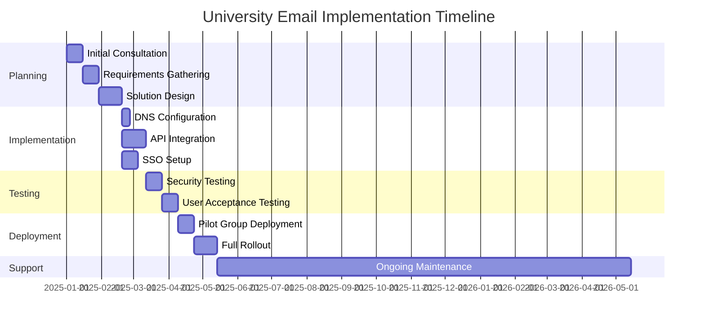
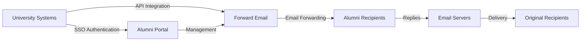

# Fallstudie: Hur Forward Email driver alumnemail-lösningar för toppuniversitet {#case-study-how-forward-email-powers-alumni-email-solutions-for-top-universities}


## Innehållsförteckning {#table-of-contents}

* [Förord](#foreword)
* [Dramatiska kostnadsbesparingar med stabil prissättning](#dramatic-cost-savings-with-stable-pricing)
  * [Verkliga universitetsbesparingar](#real-world-university-savings)
* [Utmaningen med alumnemail på universitet](#the-university-alumni-email-challenge)
  * [Värdet av alumnemail-identitet](#the-value-of-alumni-email-identity)
  * [Traditionella lösningar räcker inte till](#traditional-solutions-fall-short)
  * [Forward Email-lösningen](#the-forward-email-solution)
* [Teknisk implementering: Så fungerar det](#technical-implementation-how-it-works)
  * [Kärnarkitektur](#core-architecture)
  * [Integration med universitetssystem](#integration-with-university-systems)
  * [API-driven hantering](#api-driven-management)
  * [DNS-konfiguration och verifiering](#dns-configuration-and-verification)
  * [Testning och kvalitetskontroll](#testing-and-quality-assurance)
* [Implementeringstidslinje](#implementation-timeline)
* [Implementeringsprocess: Från migrering till underhåll](#implementation-process-from-migration-to-maintenance)
  * [Initial bedömning och planering](#initial-assessment-and-planning)
  * [Migreringsstrategi](#migration-strategy)
  * [Teknisk uppsättning och konfiguration](#technical-setup-and-configuration)
  * [Användarupplevelsedesign](#user-experience-design)
  * [Utbildning och dokumentation](#training-and-documentation)
  * [Löpande support och optimering](#ongoing-support-and-optimization)
* [Fallstudie: University of Cambridge](#case-study-university-of-cambridge)
  * [Utmaning](#challenge)
  * [Lösning](#solution)
  * [Resultat](#results)
* [Fördelar för universitet och alumner](#benefits-for-universities-and-alumni)
  * [För universitet](#for-universities)
  * [För alumner](#for-alumni)
  * [Adoptionsgrad bland alumner](#adoption-rates-among-alumni)
  * [Kostnadsbesparingar jämfört med tidigare lösningar](#cost-savings-compared-to-previous-solutions)
* [Säkerhets- och integritetshänsyn](#security-and-privacy-considerations)
  * [Dataskyddsåtgärder](#data-protection-measures)
  * [Efterlevnadsramverk](#compliance-framework)
* [Framtida utvecklingar](#future-developments)
* [Slutsats](#conclusion)


## Förord {#foreword}

Vi har byggt världens mest säkra, privata och flexibla e-postvidarebefordringstjänst för prestigefyllda universitet och deras alumner.

I den konkurrensutsatta högskolevärlden är det inte bara en tradition att upprätthålla livslånga kontakter med alumner – det är en strategisk nödvändighet. Ett av de mest påtagliga sätten som universitet främjar dessa kontakter är genom alumnemailadresser, som ger utexaminerade en digital identitet som speglar deras akademiska arv.

På Forward Email har vi samarbetat med några av världens mest prestigefyllda utbildningsinstitutioner för att revolutionera hur de hanterar alumnemailtjänster. Vår företagsklassade e-postvidarebefordringslösning driver nu alumnemail-systemen för [University of Cambridge](https://en.wikipedia.org/wiki/University_of_Cambridge), [University of Maryland](https://en.wikipedia.org/wiki/University_of_Maryland,_College_Park), [Tufts University](https://en.wikipedia.org/wiki/Tufts_University) och [Swarthmore College](https://en.wikipedia.org/wiki/Swarthmore_College), som tillsammans betjänar tusentals alumner världen över.

Detta blogginlägg utforskar hur vår [öppen källkod](https://en.wikipedia.org/wiki/Open-source_software), integritetsfokuserade e-postvidarebefordringstjänst har blivit den föredragna lösningen för dessa institutioner, de tekniska implementationerna som möjliggör detta, och den omvälvande påverkan det haft på både administrativ effektivitet och alumnnöjdhet.


## Dramatiska kostnadsbesparingar med stabil prissättning {#dramatic-cost-savings-with-stable-pricing}
De ekonomiska fördelarna med vår lösning är betydande, särskilt jämfört med de ständigt ökande priserna hos traditionella e-postleverantörer:

| Lösning                       | Kostnad per alumn (årlig)                                                                                 | Kostnad för 100 000 alumner | Nyliga prisökningar                                                                                                                                                                      |
| ------------------------------ | --------------------------------------------------------------------------------------------------------- | --------------------------- | ---------------------------------------------------------------------------------------------------------------------------------------------------------------------------------------- |
| Google Workspace for Business  | 72 $                                                                                                     | 7 200 000 $                 | • 2019: G Suite Basic från 5 $ till 6 $/månad (+20%)<br>• 2023: Flexibla planer ökade med 20%<br>• 2025: Business Plus från 18 $ till 26,40 $/månad (+47%) med AI-funktioner           |
| Google Workspace for Education | Gratis (Education Fundamentals)<br>3 $/student/år (Education Standard)<br>5 $/student/år (Education Plus) | Gratis - 500 000 $          | • Volymrabatter: 5% för 100-499 licenser<br>• Volymrabatter: 10% för 500+ licenser<br>• Gratisnivå begränsad till kärntjänster                                                           |
| Microsoft 365 Business         | 60 $                                                                                                     | 6 000 000 $                 | • 2023: Införde prisuppdateringar två gånger per år<br>• 2025 (jan): Personal från 6,99 $ till 9,99 $/månad (+43%) med Copilot AI<br>• 2025 (apr): 5% ökning på årliga åtaganden betalda månadsvis |
| Microsoft 365 Education        | Gratis (A1)<br>38-55 $/anställd/år (A3)<br>65-96 $/anställd/år (A5)                                     | Gratis - 96 000 $           | • Studentlicenser ingår ofta vid köp för anställda<br>• Anpassade priser via volymlicenser<br>• Gratisnivå begränsad till webbversioner                                                 |
| Självhostad Exchange           | 45 $                                                                                                     | 4 500 000 $                 | Fortlöpande underhålls- och säkerhetskostnader fortsätter att öka                                                                                                                        |
| **Forward Email Enterprise**   | **Fast 250 $/månad**                                                                                      | **3 000 $/år**              | **Inga prisökningar sedan lansering**                                                                                                                                                    |

### Verkliga universitetsbesparingar {#real-world-university-savings}

Så här mycket sparar våra partneruniversitet årligen genom att välja Forward Email istället för traditionella leverantörer:

| Universitet              | Antal alumner | Årlig kostnad med Google | Årlig kostnad med Forward Email | Årliga besparingar |
| ----------------------- | ------------- | ------------------------ | ------------------------------- | ------------------ |
| University of Cambridge | 30 000        | 90 000 $                 | 3 000 $                        | 87 000 $           |
| Swarthmore College      | 5 000         | 15 000 $                 | 3 000 $                        | 12 000 $           |
| Tufts University        | 12 000        | 36 000 $                 | 3 000 $                        | 33 000 $           |
| University of Maryland  | 25 000        | 75 000 $                 | 3 000 $                        | 72 000 $           |

> \[!NOTE]
> Forward Email enterprise kostar vanligtvis endast 250 $/månad, utan extra kostnad per användare, vitlistade API-begränsningar, och den enda extra kostnaden är lagring om du behöver ytterligare GB/TB för studenter (+3 $ per 10 GB extra lagring). Vi använder NVMe SSD-enheter för snabb support av IMAP/POP3/SMTP/CalDAV/CardDAV också.
> \[!IMPORTANT]
> Till skillnad från Google och Microsoft, som upprepade gånger har höjt sina priser samtidigt som de integrerat AI-funktioner som analyserar dina data, behåller Forward Email stabil prissättning med ett strikt fokus på integritet. Vi använder inte AI, spårar inte användningsmönster och lagrar inte loggar eller e-postmeddelanden på disk (all bearbetning sker i minnet), vilket säkerställer fullständig integritet för dina alumnikommunikationer.

Detta innebär en betydande kostnadsminskning jämfört med traditionella e-posthostinglösningar – medel som universitet kan omdirigera till stipendier, forskning eller andra verksamhetskritiska aktiviteter. Enligt en analys från 2023 av Email Vendor Selection söker utbildningsinstitutioner i allt högre grad kostnadseffektiva alternativ till traditionella e-postleverantörer eftersom priserna fortsätter att stiga i takt med integrationen av AI-funktioner ([Email Vendor Selection, 2023](https://www.emailvendorselection.com/email-service-provider-list/)).


## The University Alumni Email Challenge {#the-university-alumni-email-challenge}

För universitet innebär tillhandahållandet av livstids-e-postadresser till alumner en unik uppsättning utmaningar som traditionella e-postlösningar har svårt att hantera effektivt. Som påpekats i en omfattande diskussion på ServerFault kräver universitet med stora användarbaser specialiserade e-postlösningar som balanserar prestanda, säkerhet och kostnadseffektivitet ([ServerFault, 2009](https://serverfault.com/questions/97364/what-is-the-best-mail-server-for-a-university-with-a-large-amount-of-users)).

### The Value of Alumni Email Identity {#the-value-of-alumni-email-identity}

Alumners e-postadresser (som `firstname.lastname@cl.cam.ac.uk` eller `username@terpalum.umd.edu`) fyller flera viktiga funktioner:

* Bibehålla institutionell koppling och varumärkesidentitet
* Underlätta pågående kommunikation med universitetet
* Förbättra professionell trovärdighet för utexaminerade
* Stödja alumninätverk och gemenskapsbyggande
* Erbjuda en stabil, livslång kontaktpunkt

Forskning av Tekade (2020) framhäver att utbildningsrelaterade e-postadresser ger många fördelar för alumner, inklusive tillgång till akademiska resurser, professionell trovärdighet och exklusiva rabatter på olika tjänster ([Medium, 2020](https://medium.com/coders-capsule/top-20-benefits-of-having-an-educational-email-address-91a09795e05)).

> \[!TIP]
> Besök vår nya [AlumniEmail.com](https://alumniemail.com) katalog för en omfattande resurs om universitetsalumners e-posttjänster, inklusive installationsguider, bästa praxis och en sökbar katalog över alumners e-postdomäner. Den fungerar som en central hubb för all information om alumners e-post.

### Traditional Solutions Fall Short {#traditional-solutions-fall-short}

Konventionella e-postsystem har flera begränsningar när de används för alumners e-postbehov:

* **Kostnadsbegränsande**: Licensmodeller per användare blir ekonomiskt ohållbara för stora alumnibaser
* **Administrativ börda**: Hantering av tusentals eller miljontals konton kräver betydande IT-resurser
* **Säkerhetsproblem**: Att upprätthålla säkerhet för inaktiva konton ökar sårbarheten
* **Begränsad flexibilitet**: Rigida system kan inte anpassas till alumners unika behov av e-postvidarebefordran
* **Integritetsproblem**: Många leverantörer skannar e-postinnehåll för reklamändamål

En diskussion på Quora om underhåll av universitets-e-post avslöjar att säkerhetsproblem är en huvudorsak till att universitet kan begränsa eller avbryta alumners e-postadresser, eftersom oanvända konton kan vara sårbara för hacking och identitetsstöld ([Quora, 2011](https://www.quora.com/Is-there-any-cost-for-a-college-or-university-to-maintain-edu-e-mail-addresses)).

### The Forward Email Solution {#the-forward-email-solution}

Vår metod tar itu med dessa utmaningar genom en fundamentalt annorlunda modell:

* E-postvidarebefordran istället för hosting
* Fast pris istället för kostnad per användare
* Öppen källkod för transparens och säkerhet
* Integritetsfokuserad design utan innehållsskanning
* Specialiserade funktioner för universitetsidentitetshantering


## Technical Implementation: How It Works {#technical-implementation-how-it-works}
Vår lösning utnyttjar en sofistikerad men elegant enkel teknisk arkitektur för att leverera pålitlig, säker e-postvidarebefordran i stor skala.

### Core Architecture {#core-architecture}

Forward Email-systemet består av flera nyckelkomponenter:

* Distribuerade MX-servrar för hög tillgänglighet
* Realtidsvidarebefordran utan meddelandelagring
* Omfattande e-postautentisering
* Stöd för anpassade domäner och underdomäner
* API-driven kontohantering

Enligt IT-proffs på ServerFault rekommenderas Postfix som den bästa Mail Transfer Agent (MTA) för universitet som vill implementera egna e-postlösningar, medan Courier eller Dovecot föredras för IMAP/POP3-åtkomst ([ServerFault, 2009](https://serverfault.com/questions/97364/what-is-the-best-mail-server-for-a-university-with-a-large-amount-of-users)). Vår lösning eliminerar dock behovet för universitet att själva hantera dessa komplexa system.

### Integration with University Systems {#integration-with-university-systems}

Vi har utvecklat sömlösa integrationsvägar med befintlig universitetsinfrastruktur:

* Automatisk provisionering via [RESTful API](https://forwardemail.net/email-api)-integration
* Anpassningsbara varumärkesalternativ för universitetsportaler
* Flexibel aliashantering för institutioner och organisationer
* Batchoperationer för effektiv administration

### API-Driven Management {#api-driven-management}

Vårt [RESTful API](https://forwardemail.net/email-api) möjliggör för universitet att automatisera e-posthantering:

```javascript
// Example: Creating a new alumni email address
const response = await fetch('https://forwardemail.net/api/v1/domains/example.edu/aliases', {
  method: 'POST',
  headers: {
    'Content-Type': 'application/json',
    'Authorization': `Basic ${Buffer.from(YOUR_API_TOKEN + ":").toString('base64')}`
  },
  body: JSON.stringify({
    name: 'alumni.john.smith',
    recipients: ['johnsmith@gmail.com'],
    has_recipient_verification: true
  })
});
```

### DNS Configuration and Verification {#dns-configuration-and-verification}

Korrekt DNS-konfiguration är avgörande för e-postleverans. Vårt team hjälper till med:

* [DNS](https://en.wikipedia.org/wiki/Domain_Name_System)-konfiguration inklusive MX-poster
* Omfattande implementering av e-postsäkerhet med vårt open-source [mailauth](https://www.npmjs.com/package/mailauth)-paket, en schweizisk armékniv för e-postautentisering som hanterar:
  * [SPF](https://en.wikipedia.org/wiki/Sender_Policy_Framework) (Sender Policy Framework) för att förhindra e-postförfalskning
  * [DKIM](https://en.wikipedia.org/wiki/DomainKeys_Identified_Mail) (DomainKeys Identified Mail) för e-postautentisering
  * [DMARC](https://en.wikipedia.org/wiki/Email_authentication) (Domain-based Message Authentication, Reporting & Conformance) för policyimplementering
  * [MTA-STS](https://en.wikipedia.org/wiki/Opportunistic_TLS) (SMTP MTA Strict Transport Security) för att upprätthålla TLS-kryptering
  * [ARC](https://en.wikipedia.org/wiki/DomainKeys_Identified_Mail#Authenticated_Received_Chain) (Authenticated Received Chain) för att bibehålla autentisering när meddelanden vidarebefordras
  * [SRS](https://en.wikipedia.org/wiki/Sender_Rewriting_Scheme) (Sender Rewriting Scheme) för att bevara SPF-validering vid vidarebefordran
  * [BIMI](https://en.wikipedia.org/wiki/Email_authentication) (Brand Indicators for Message Identification) för logotypvisning i stödjande e-postklienter
* Verifiering av DNS TXT-poster för domänägarskap

`mailauth`-paketet (<http://npmjs.com/package/mailauth>) är den helt open-source lösningen som hanterar alla aspekter av e-postautentisering i ett integrerat bibliotek. Till skillnad från proprietära lösningar säkerställer detta tillvägagångssätt transparens, regelbundna säkerhetsuppdateringar och full kontroll över e-postautentiseringsprocessen.

### Testing and Quality Assurance {#testing-and-quality-assurance}

Innan full implementering genomför vi rigorösa tester:

* Slut-till-slut-testning av e-postleverans
* Belastningstestning för högvolymscenarier
* Säkerhetspenetrationstestning
* Validering av API-integration
* Användaracceptanstestning med alumnirepresentanter
## Implementation Timeline {#implementation-timeline}


```mermaid
gantt
    title University Email Implementation Timeline
    dateFormat  YYYY-MM-DD
    section Planning
    Initial Consultation           :a1, 2025-01-01, 14d
    Requirements Gathering         :a2, after a1, 14d
    Solution Design                :a3, after a2, 21d
    section Implementation
    DNS Configuration              :b1, after a3, 7d
    API Integration                :b2, after a3, 21d
    SSO Setup                      :b3, after a3, 14d
    section Testing
    Security Testing               :c1, after b1 b2 b3, 14d
    User Acceptance Testing        :c2, after c1, 14d
    section Deployment
    Pilot Group Deployment         :d1, after c2, 14d
    Full Rollout                   :d2, after d1, 21d
    section Support
    Ongoing Maintenance            :e1, after d2, 365d
```


## Implementation Process: From Migration to Maintenance {#implementation-process-from-migration-to-maintenance}

Vår strukturerade implementeringsprocess säkerställer en smidig övergång för universitet som adopterar vår lösning.

### Initial Assessment and Planning {#initial-assessment-and-planning}

Vi börjar med en omfattande bedömning av universitetets nuvarande e-postsystem, alumnidatabas och tekniska krav. Denna fas inkluderar:

* Intressentintervjuer med IT, alumnirelationer och administration
* Teknisk revision av befintlig e-postinfrastruktur
* Datakartläggning för alumniposter
* Säkerhets- och efterlevnadsgranskning
* Projektplan och utveckling av milstolpar

### Migration Strategy {#migration-strategy}

Baserat på bedömningen utvecklar vi en skräddarsydd migrationsstrategi som minimerar störningar samtidigt som fullständig dataintegritet säkerställs:

* Fasad migration efter alumnikohorter
* Parallell drift av system under övergången
* Omfattande datavalideringsprotokoll
* Återställningsprocedurer vid eventuella migrationsproblem
* Tydlig kommunikationsplan för alla intressenter

### Technical Setup and Configuration {#technical-setup-and-configuration}

Vårt tekniska team hanterar alla aspekter av systemuppsättningen:

* DNS-konfiguration och verifiering
* API-integration med universitetets system
* Anpassad portalutveckling med universitetets profil
* E-postautentisering (SPF, DKIM, DMARC)

### User Experience Design {#user-experience-design}

Vi samarbetar nära med universiteten för att skapa intuitiva gränssnitt för både administratörer och alumner:

* Anpassade alumnie-postportaler med universitetets profil
* Förenklad hantering av e-postvidarebefordran
* Mobilanpassade design
* Tillgänglighetsanpassning
* Flerspråkigt stöd där det behövs

### Training and Documentation {#training-and-documentation}

Omfattande utbildning säkerställer att alla intressenter kan använda systemet effektivt:

* Administratörsutbildningar
* Teknisk dokumentation för IT-personal
* Användarguider för alumner
* Videotutorials för vanliga uppgifter
* Utveckling av kunskapsbas

### Ongoing Support and Optimization {#ongoing-support-and-optimization}

Vårt partnerskap fortsätter långt efter implementeringen:

* Teknisk support dygnet runt
* Regelbundna systemuppdateringar och säkerhetspatchar
* Prestandaövervakning och optimering
* Rådgivning om bästa praxis för e-post
* Dataanalys och rapportering


## Case Study: University of Cambridge {#case-study-university-of-cambridge}

University of Cambridge sökte en lösning för att erbjuda @cam.ac.uk e-postadresser till alumner samtidigt som IT-kostnader och arbetsbörda minskades.

### Challenge {#challenge}

Cambridge stod inför flera utmaningar med sitt tidigare alumnie-postsystem:

* Höga driftskostnader för att underhålla separat e-postinfrastruktur
* Administrativ börda att hantera tusentals konton
* Säkerhetsproblem med inaktiva konton
* Begränsad integration med alumnidatabassystem
* Ökande lagringsbehov

### Solution {#solution}

Forward Email implementerade en omfattande lösning:

* E-postvidarebefordran för alla @cam.ac.uk alumnadresser
* Anpassad portal för självbetjäning för alumner
* API-integration med Cambridges alumnidatabas
* Omfattande implementering av e-postsäkerhet

### Results {#results}

Implementeringen gav betydande fördelar:
* Betydande kostnadsreduktion jämfört med tidigare lösning
* 99,9 % leveranssäkerhet för e-post
* Förenklad administration genom automatisering
* Förbättrad säkerhet med modern e-postautentisering
* Positiv feedback från alumner om systemets användarvänlighet


## Fördelar för universitet och alumner {#benefits-for-universities-and-alumni}

Vår lösning ger påtagliga fördelar för både institutioner och deras alumner.

### För universitet {#for-universities}

* **Kostnadseffektivitet**: Fast pris oavsett antal alumner
* **Administrativ enkelhet**: Automatiserad hantering via API
* **Förbättrad säkerhet**: Omfattande e-postautentisering
* **Varumärkeskonsekvens**: Livslånga institutionella e-postadresser
* **Alumnengagemang**: Stärkta kontakter genom pågående tjänst

Enligt BulkSignature (2023) erbjuder e-postplattformar för utbildningsinstitutioner betydande fördelar inklusive kostnadseffektivitet genom gratis- eller lågkostnadsplaner, tidsbesparing genom masskommunikationsmöjligheter och spårningsfunktioner för att övervaka e-postleverans och engagemang ([BulkSignature, 2023](https://bulksignature.com/blog/5-best-email-platforms-for-educational-institutions/)).

### För alumner {#for-alumni}

* **Professionell identitet**: Prestigefylld universitets-e-postadress
* **E-postkontinuitet**: Vidarebefordran till valfri personlig e-post
* **Integritetsskydd**: Ingen innehållsskanning eller datamining
* **Förenklad hantering**: Enkla mottagaruppdateringar
* **Förbättrad säkerhet**: Modern e-postautentisering

Forskning från International Journal of Education & Literacy Studies betonar vikten av korrekt e-postkommunikation i akademiska miljöer och noterar att e-postkompetens är en avgörande färdighet för både studenter och alumner i professionella sammanhang ([IJELS, 2021](https://files.eric.ed.gov/fulltext/EJ1319324.pdf)).

### Antagningsgrad bland alumner {#adoption-rates-among-alumni}

Universitet rapporterar höga antagnings- och nöjdhetsnivåer bland sina alumnigemenskaper.

### Kostnadsbesparingar jämfört med tidigare lösningar {#cost-savings-compared-to-previous-solutions}

Den ekonomiska effekten har varit betydande, med universitet som rapporterar stora kostnadsbesparingar jämfört med deras tidigare e-postlösningar.


## Säkerhets- och integritetshänsyn {#security-and-privacy-considerations}

För utbildningsinstitutioner är skydd av alumners data inte bara god praxis – det är ofta ett lagkrav enligt regler som GDPR i Europa.

### Åtgärder för dataskydd {#data-protection-measures}

Vår lösning inkluderar flera säkerhetslager:

* End-to-end-kryptering för all e-posttrafik
* Ingen lagring av e-postinnehåll på våra servrar
* Regelbundna säkerhetsrevisioner och penetrationstester
* Efterlevnad av internationella dataskyddsstandarder
* Transparent, öppen källkod för säkerhetsverifiering

> \[!WARNING]
> Många e-postleverantörer skannar e-postinnehåll för reklamändamål eller för att träna AI-modeller. Denna praxis väcker allvarliga integritetsbekymmer, särskilt för professionell och akademisk kommunikation. Forward Email skannar aldrig e-postinnehåll och behandlar all e-post i minnet för att säkerställa fullständig integritet.

### Efterlevnadsramverk {#compliance-framework}

Vi upprätthåller strikt efterlevnad av relevanta regler:

* GDPR-efterlevnad för europeiska institutioner
* SOC 2 Typ II-certifiering
* Årliga säkerhetsbedömningar
* Databehandlingsavtal (DPA) tillgängligt på [forwardemail.net/dpa](https://forwardemail.net/dpa)
* Regelbundna uppdateringar av efterlevnad i takt med att regler utvecklas


## Framtida utveckling {#future-developments}

Vi fortsätter att förbättra vår alumn-e-postlösning med nya funktioner och kapaciteter:

* Förbättrad analys för universitetsadministratörer
* Avancerat skydd mot nätfiske
* Utökade API-möjligheter för djupare integration
* Ytterligare autentiseringsalternativ


## Slutsats {#conclusion}

Forward Email har revolutionerat hur universitet tillhandahåller och hanterar e-posttjänster för alumner. Genom att ersätta kostsam, komplex e-posthosting med elegant, säker e-postvidarebefordran har vi möjliggjort för institutioner att erbjuda livslånga e-postadresser till alla alumner samtidigt som kostnader och administrativ börda minskats dramatiskt.
Våra partnerskap med prestigefyllda institutioner som Cambridge, Maryland, Tufts och Swarthmore visar effektiviteten i vår metod över olika utbildningsmiljöer. Eftersom universitet står inför ökande press att upprätthålla kontakt med alumner samtidigt som kostnaderna kontrolleras, erbjuder vår lösning ett övertygande alternativ till traditionella e-postsystem.


```mermaid
flowchart LR
    A[University Systems] -->|API Integration| B[Forward Email]
    B -->|Email Forwarding| C[Alumni Recipients]
    C -->|Replies| D[Email Servers]
    D -->|Delivery| E[Original Recipients]
    F[Alumni Portal] -->|Management| B
    A -->|SSO Authentication| F
```

För universitet som är intresserade av att utforska hur Forward Email kan förändra deras alumnie-posttjänster, kontakta vårt team på <support@forwardemail.net> eller besök [forwardemail.net](https://forwardemail.net) för att lära dig mer om våra företagslösningar.
