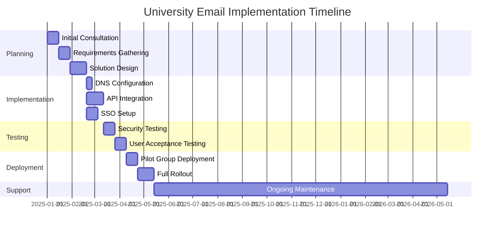
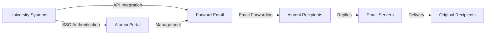

# กรณีศึกษา: อีเมล Forward ขับเคลื่อนโซลูชันอีเมลสำหรับศิษย์เก่าในมหาวิทยาลัยชั้นนำได้อย่างไร {#case-study-how-forward-email-powers-alumni-email-solutions-for-top-universities}


## สารบัญ {#table-of-contents}

* [คำนำ](#foreword)
* [ประหยัดต้นทุนได้อย่างน่าทึ่งด้วยราคาที่มั่นคง](#dramatic-cost-savings-with-stable-pricing)
  * [การออมเงินในมหาวิทยาลัยในโลกแห่งความเป็นจริง](#real-world-university-savings)
* [ความท้าทายอีเมลของศิษย์เก่ามหาวิทยาลัย](#the-university-alumni-email-challenge)
  * [คุณค่าของการระบุตัวตนอีเมลของศิษย์เก่า](#the-value-of-alumni-email-identity)
  * [โซลูชันแบบดั้งเดิมไม่เพียงพอ](#traditional-solutions-fall-short)
  * [โซลูชันการส่งต่ออีเมล](#the-forward-email-solution)
* [การใช้งานทางเทคนิค: วิธีการทำงาน](#technical-implementation-how-it-works)
  * [สถาปัตยกรรมหลัก](#core-architecture)
  * [การบูรณาการกับระบบมหาวิทยาลัย](#integration-with-university-systems)
  * [การจัดการที่ขับเคลื่อนด้วย API](#api-driven-management)
  * [การกำหนดค่าและการยืนยัน DNS](#dns-configuration-and-verification)
  * [การทดสอบและการรับรองคุณภาพ](#testing-and-quality-assurance)
* [กำหนดเวลาการดำเนินการ](#implementation-timeline)
* [กระบวนการดำเนินการ: จากการย้ายข้อมูลไปจนถึงการบำรุงรักษา](#implementation-process-from-migration-to-maintenance)
  * [การประเมินและการวางแผนเบื้องต้น](#initial-assessment-and-planning)
  * [กลยุทธ์การย้ายถิ่นฐาน](#migration-strategy)
  * [การตั้งค่าและการกำหนดค่าทางเทคนิค](#technical-setup-and-configuration)
  * [การออกแบบประสบการณ์ผู้ใช้](#user-experience-design)
  * [การฝึกอบรมและการจัดทำเอกสาร](#training-and-documentation)
  * [การสนับสนุนและการเพิ่มประสิทธิภาพอย่างต่อเนื่อง](#ongoing-support-and-optimization)
* [กรณีศึกษา: มหาวิทยาลัยเคมบริดจ์](#case-study-university-of-cambridge)
  * [ท้าทาย](#challenge)
  * [สารละลาย](#solution)
  * [ผลลัพธ์](#results)
* [สิทธิประโยชน์สำหรับมหาวิทยาลัยและศิษย์เก่า](#benefits-for-universities-and-alumni)
  * [สำหรับมหาวิทยาลัย](#for-universities)
  * [สำหรับศิษย์เก่า](#for-alumni)
  * [อัตราการรับเลี้ยงบุตรบุญธรรมในหมู่ศิษย์เก่า](#adoption-rates-among-alumni)
  * [ประหยัดต้นทุนเมื่อเทียบกับโซลูชันก่อนหน้า](#cost-savings-compared-to-previous-solutions)
* [ข้อควรพิจารณาด้านความปลอดภัยและความเป็นส่วนตัว](#security-and-privacy-considerations)
  * [มาตรการคุ้มครองข้อมูล](#data-protection-measures)
  * [กรอบการปฏิบัติตาม](#compliance-framework)
* [การพัฒนาในอนาคต](#future-developments)
* [บทสรุป](#conclusion)

## คำนำ {#foreword}

เราได้สร้างบริการส่งต่ออีเมลที่ปลอดภัย เป็นส่วนตัว และยืดหยุ่นที่สุดในโลกสำหรับมหาวิทยาลัยที่มีชื่อเสียงและศิษย์เก่าของมหาวิทยาลัยเหล่านั้น

ในภูมิทัศน์การแข่งขันของการศึกษาระดับอุดมศึกษา การรักษาความสัมพันธ์อันดีกับศิษย์เก่าตลอดชีวิตไม่ใช่แค่เรื่องของธรรมเนียมปฏิบัติ หากแต่เป็นสิ่งจำเป็นเชิงกลยุทธ์ หนึ่งในวิธีที่เป็นรูปธรรมที่สุดที่มหาวิทยาลัยต่างๆ ใช้ในการส่งเสริมความสัมพันธ์เหล่านี้ คือการใช้ที่อยู่อีเมลของศิษย์เก่า ซึ่งจะช่วยให้บัณฑิตมีอัตลักษณ์ดิจิทัลที่สะท้อนถึงมรดกทางวิชาการของพวกเขา

ที่ Forward Email เราได้ร่วมมือกับสถาบันการศึกษาชั้นนำระดับโลกหลายแห่งเพื่อปฏิวัติวิธีการจัดการบริการอีเมลสำหรับศิษย์เก่า โซลูชันการส่งต่ออีเมลระดับองค์กรของเราช่วยขับเคลื่อนระบบอีเมลสำหรับศิษย์เก่าสำหรับ [มหาวิทยาลัยเคมบริดจ์](https://en.wikipedia.org/wiki/University_of_Cambridge), [มหาวิทยาลัยแมริแลนด์](https://en.wikipedia.org/wiki/University_of_Maryland,\_College_Park), [มหาวิทยาลัยทัฟส์](https://en.wikipedia.org/wiki/Tufts_University) และ [วิทยาลัยสวอร์ธมอร์](https://en.wikipedia.org/wiki/Swarthmore_College) ซึ่งให้บริการศิษย์เก่าหลายพันคนทั่วโลก

โพสต์บล็อกนี้จะเจาะลึกถึงสาเหตุที่บริการส่งต่ออีเมลที่เน้นความเป็นส่วนตัวอย่าง [โอเพนซอร์ส](https://en.wikipedia.org/wiki/Open-source_software) กลายมาเป็นโซลูชันที่สถาบันต่างๆ เลือกใช้ การใช้งานทางเทคนิคที่ทำให้บริการดังกล่าวเป็นไปได้ และผลกระทบเชิงเปลี่ยนแปลงที่เกิดขึ้นกับทั้งประสิทธิภาพในการบริหารจัดการและความพึงพอใจของศิษย์เก่า

## ประหยัดต้นทุนได้อย่างมากด้วยราคาที่เสถียร {#dramatic-cost-savings-with-stable-pricing}

ผลประโยชน์ทางการเงินของโซลูชั่นของเรามีมากมาย โดยเฉพาะเมื่อเปรียบเทียบกับราคาของผู้ให้บริการอีเมลแบบดั้งเดิมที่เพิ่มขึ้นอย่างต่อเนื่อง:

| สารละลาย | ต้นทุนต่อศิษย์เก่า (ต่อปี) | ค่าใช้จ่ายสำหรับศิษย์เก่า 100,000 คน | การปรับราคาล่าสุด |
| ------------------------------ | --------------------------------------------------------------------------------------------------------- | ----------------------- | ---------------------------------------------------------------------------------------------------------------------------------------------------------------------------------------- |
| Google Workspace สำหรับธุรกิจ | $72 | $7,200,000 | • 2019: G Suite Basic เพิ่มจาก $5 เป็น $6/เดือน (+20%)<br>• 2023: แผนแบบยืดหยุ่นเพิ่มขึ้น 20%<br>• 2025: Business Plus เพิ่มจาก $18 เป็น $26.40/เดือน (+47%) พร้อมฟีเจอร์ AI |
| Google Workspace สำหรับการศึกษา | ฟรี (พื้นฐานการศึกษา)<br>$3/นักเรียน/ปี (มาตรฐานการศึกษา)<br>$5/นักเรียน/ปี (การศึกษาพลัส) | ฟรี - 500,000 ดอลลาร์ | • ส่วนลดตามปริมาณ: 5% สำหรับใบอนุญาต 100-499 ใบ<br>• ส่วนลดตามปริมาณ: 10% สำหรับใบอนุญาต 500 ใบขึ้นไป<br>• ระดับฟรีจำกัดเฉพาะบริการหลักเท่านั้น |
| ไมโครซอฟท์ 365 ธุรกิจ | $60 | $6,000,000 | • 2023: เปิดตัวการอัปเดตราคาสองครั้งต่อปี<br>• 2025 (ม.ค.): ส่วนบุคคลจาก $6.99 เป็น $9.99/เดือน (+43%) ด้วย Copilot AI<br>• 2025 (เม.ย.): เพิ่มขึ้น 5% สำหรับการผูกมัดรายปีที่ชำระเป็นรายเดือน |
| Microsoft 365 การศึกษา | ฟรี (A1)<br>$38-55/คณะ/ปี (A3)<br>$65-96/คณะ/ปี (A5) | ฟรี - $96,000 | • ใบอนุญาตสำหรับนักเรียนมักจะรวมอยู่ในการซื้อของคณะ<br>• กำหนดราคาเองผ่านใบอนุญาตแบบกลุ่ม<br>• ระดับฟรีจำกัดเฉพาะเวอร์ชันเว็บ |
| การแลกเปลี่ยนแบบโฮสต์ด้วยตนเอง | $45 | $4,500,000 | ต้นทุนการบำรุงรักษาและความปลอดภัยอย่างต่อเนื่องยังคงเพิ่มสูงขึ้น |
| **ส่งต่ออีเมลองค์กร** | **คงที่ $250/เดือน** | **3,000 เหรียญสหรัฐ/ปี** | **ไม่มีการขึ้นราคาตั้งแต่เปิดตัว** |

### การออมเงินในมหาวิทยาลัยในโลกแห่งความเป็นจริง {#real-world-university-savings}

นี่คือจำนวนเงินที่มหาวิทยาลัยพันธมิตรของเราประหยัดได้ในแต่ละปีโดยเลือก Forward Email แทนผู้ให้บริการแบบดั้งเดิม:

| มหาวิทยาลัย | จำนวนศิษย์เก่า | ค่าใช้จ่ายรายปีกับ Google | ค่าใช้จ่ายรายปีพร้อมการส่งต่ออีเมล | การออมรายปี |
| ----------------------- | ------------ | ----------------------- | ------------------------------ | -------------- |
| มหาวิทยาลัยเคมบริดจ์ | 30,000 | $90,000 | $3,000 | $87,000 |
| วิทยาลัยสวอร์ธมอร์ | 5,000 | $15,000 | $3,000 | $12,000 |
| มหาวิทยาลัยทัฟส์ | 12,000 | $36,000 | $3,000 | $33,000 |
| มหาวิทยาลัยแมริแลนด์ | 25,000 | $75,000 | $3,000 | $72,000 |

> \[!NOTE]
> โดยทั่วไป Forward Email Enterprise มีค่าใช้จ่ายเพียง 250 ดอลลาร์สหรัฐ/เดือน โดยไม่มีค่าใช้จ่ายเพิ่มเติมต่อผู้ใช้ มีข้อจำกัดอัตรา API ที่อนุญาต และมีค่าใช้จ่ายเพิ่มเติมเพียงอย่างเดียวคือพื้นที่เก็บข้อมูล หากคุณต้องการพื้นที่ GB/TB เพิ่มเติมสำหรับนักศึกษา (+3 ดอลลาร์สหรัฐ ต่อพื้นที่เก็บข้อมูลเพิ่มเติม 10 GB) เราใช้ไดรฟ์ NVMe SSD เพื่อรองรับ IMAP/POP3/SMTP/CalDAV/CardDAV ได้อย่างรวดเร็วเช่นกัน

> \[!IMPORTANT]
> ต่างจาก Google และ Microsoft ที่ขึ้นราคาซ้ำแล้วซ้ำเล่า พร้อมกับผสานรวมฟีเจอร์ AI ที่วิเคราะห์ข้อมูลของคุณไว้ Forward Email ยังคงรักษาราคาที่คงที่โดยเน้นความเป็นส่วนตัวอย่างเคร่งครัด เราไม่ใช้ AI ไม่ติดตามรูปแบบการใช้งาน และไม่เก็บบันทึกหรืออีเมลไว้ในดิสก์ (การประมวลผลทั้งหมดดำเนินการในหน่วยความจำ) เพื่อให้แน่ใจว่าการสื่อสารกับศิษย์เก่าของคุณมีความเป็นส่วนตัวอย่างสมบูรณ์

นับเป็นการลดต้นทุนอย่างมีนัยสำคัญเมื่อเทียบกับโซลูชันโฮสติ้งอีเมลแบบเดิม ซึ่งเป็นเงินทุนที่มหาวิทยาลัยสามารถนำกลับไปใช้เพื่อการศึกษา การวิจัย หรือกิจกรรมสำคัญอื่นๆ ได้ จากการวิเคราะห์ของ Email Vendor Selection ในปี 2023 พบว่าสถาบันการศึกษากำลังมองหาทางเลือกที่คุ้มค่ากว่าผู้ให้บริการอีเมลแบบเดิมมากขึ้น เนื่องจากราคายังคงสูงขึ้นอย่างต่อเนื่องจากการผสานรวมฟีเจอร์ AI ([การเลือกผู้ขายอีเมล 2023](https://www.emailvendorselection.com/email-service-provider-list/))

## ความท้าทายทางอีเมลสำหรับศิษย์เก่ามหาวิทยาลัย {#the-university-alumni-email-challenge}

สำหรับมหาวิทยาลัย การให้ที่อยู่อีเมลตลอดชีพแก่ศิษย์เก่าถือเป็นความท้าทายเฉพาะตัวที่โซลูชันอีเมลแบบเดิมไม่สามารถจัดการได้อย่างมีประสิทธิภาพ ดังที่ได้กล่าวไว้ในการอภิปรายอย่างครอบคลุมเกี่ยวกับ ServerFault มหาวิทยาลัยที่มีฐานผู้ใช้จำนวนมากต้องการโซลูชันอีเมลเฉพาะทางที่สมดุลระหว่างประสิทธิภาพ ความปลอดภัย และความคุ้มค่า ([เซิร์ฟเวอร์ฟอลต์ 2009](https://serverfault.com/questions/97364/what-is-the-best-mail-server-for-a-university-with-a-large-amount-of-users))

### คุณค่าของข้อมูลประจำตัวอีเมลศิษย์เก่า {#the-value-of-alumni-email-identity}

ที่อยู่อีเมลของศิษย์เก่า (เช่น `firstname.lastname@cl.cam.ac.uk` หรือ `username@terpalum.umd.edu`) มีหน้าที่สำคัญหลายประการ:

* รักษาความสัมพันธ์อันดีระหว่างสถาบันและอัตลักษณ์ของแบรนด์
* อำนวยความสะดวกในการสื่อสารกับมหาวิทยาลัยอย่างต่อเนื่อง
* เสริมสร้างความน่าเชื่อถือทางวิชาชีพให้กับบัณฑิต
* สนับสนุนการสร้างเครือข่ายศิษย์เก่าและการสร้างชุมชน
* มอบช่องทางการติดต่อที่มั่นคงตลอดชีพ

งานวิจัยของ Tekade (2020) เน้นย้ำว่าที่อยู่อีเมลด้านการศึกษาให้ประโยชน์มากมายแก่ศิษย์เก่า รวมถึงการเข้าถึงแหล่งข้อมูลทางวิชาการ ความน่าเชื่อถือในอาชีพ และส่วนลดพิเศษสำหรับบริการต่างๆ ([ขนาดกลาง 2020](https://medium.com/coders-capsule/top-20-benefits-of-having-an-educational-email-address-91a09795e05))

> \[!TIP]
> เยี่ยมชมไดเรกทอรี [AlumniEmail.com](https://alumniemail.com) ใหม่ของเราเพื่อดูแหล่งข้อมูลที่ครอบคลุมเกี่ยวกับบริการอีเมลศิษย์เก่ามหาวิทยาลัย รวมถึงคู่มือการตั้งค่า แนวทางปฏิบัติที่ดีที่สุด และไดเรกทอรีโดเมนอีเมลศิษย์เก่าที่ค้นหาได้ ไดเรกทอรีนี้ทำหน้าที่เป็นศูนย์กลางสำหรับข้อมูลอีเมลศิษย์เก่าทั้งหมด

### โซลูชันแบบดั้งเดิมไม่เพียงพอ {#traditional-solutions-fall-short}

ระบบอีเมลแบบเดิมมีข้อจำกัดหลายประการเมื่อนำไปใช้กับความต้องการอีเมลของศิษย์เก่า:

* **ต้นทุนสูง**: รูปแบบการให้สิทธิ์ใช้งานต่อผู้ใช้อาจไม่ยั่งยืนทางการเงินสำหรับฐานศิษย์เก่าขนาดใหญ่
* **ภาระงานด้านการบริหาร**: การจัดการบัญชีหลายพันหรือหลายล้านบัญชีต้องใช้ทรัพยากรไอทีจำนวนมาก
* **ข้อกังวลด้านความปลอดภัย**: การรักษาความปลอดภัยสำหรับบัญชีที่ไม่ได้ใช้งานจะเพิ่มความเสี่ยง
* **ความยืดหยุ่นจำกัด**: ระบบที่ยืดหยุ่นไม่สามารถปรับให้เข้ากับความต้องการเฉพาะของการส่งต่ออีเมลของศิษย์เก่าได้
* **ปัญหาความเป็นส่วนตัว**: ผู้ให้บริการหลายรายสแกนเนื้อหาอีเมลเพื่อวัตถุประสงค์ทางการโฆษณา

การอภิปรายใน Quora เกี่ยวกับการบำรุงรักษาอีเมลของมหาวิทยาลัยเผยให้เห็นว่าข้อกังวลด้านความปลอดภัยเป็นสาเหตุหลักที่มหาวิทยาลัยอาจจำกัดหรือยกเลิกที่อยู่อีเมลของศิษย์เก่า เนื่องจากบัญชีที่ไม่ได้ใช้งานอาจเสี่ยงต่อการถูกแฮ็กและการโจรกรรมข้อมูลประจำตัว ([ควอร่า, 2011](https://www.quora.com/Is-there-any-cost-for-a-college-or-university-to-maintain-edu-e-mail-addresses))

### โซลูชันการส่งต่ออีเมล {#the-forward-email-solution}

แนวทางของเราจัดการกับความท้าทายเหล่านี้โดยใช้รูปแบบที่แตกต่างกันโดยพื้นฐาน:

* ส่งต่ออีเมลแทนการโฮสต์
* คิดราคาแบบเหมาจ่ายแทนการคิดราคาต่อผู้ใช้
* สถาปัตยกรรมโอเพนซอร์สเพื่อความโปร่งใสและความปลอดภัย
* การออกแบบที่เน้นความเป็นส่วนตัวเป็นหลัก โดยไม่ต้องสแกนเนื้อหา
* คุณสมบัติพิเศษสำหรับการจัดการข้อมูลประจำตัวของมหาวิทยาลัย

## การใช้งานทางเทคนิค: วิธีการทำงาน {#technical-implementation-how-it-works}

โซลูชันของเราใช้ประโยชน์จากสถาปัตยกรรมทางเทคนิคที่ซับซ้อนแต่เรียบง่ายอย่างมีสไตล์เพื่อส่งมอบการส่งต่ออีเมลที่เชื่อถือได้และปลอดภัยในระดับขนาดใหญ่

### สถาปัตยกรรมหลัก {#core-architecture}

ระบบส่งต่ออีเมลประกอบด้วยส่วนประกอบสำคัญหลายประการ:

* เซิร์ฟเวอร์ MX แบบกระจายเพื่อความพร้อมใช้งานสูง
* การส่งต่อแบบเรียลไทม์โดยไม่ต้องจัดเก็บข้อความ
* การตรวจสอบสิทธิ์อีเมลที่ครอบคลุม
* รองรับโดเมนและโดเมนย่อยแบบกำหนดเอง
* การจัดการบัญชีที่ขับเคลื่อนด้วย API

ผู้เชี่ยวชาญด้านไอทีของ ServerFault ระบุว่า สำหรับมหาวิทยาลัยที่ต้องการนำโซลูชันอีเมลของตนเองไปใช้ แนะนำให้ใช้ Postfix เป็นตัวแทนถ่ายโอนอีเมล (MTA) ที่ดีที่สุด ขณะที่ Courier หรือ Dovecot เป็นตัวเลือกที่ดีที่สุดสำหรับการเข้าถึง IMAP/POP3 ([เซิร์ฟเวอร์ฟอลต์ 2009](https://serverfault.com/questions/97364/what-is-the-best-mail-server-for-a-university-with-a-large-amount-of-users)) อย่างไรก็ตาม โซลูชันของเราช่วยลดความจำเป็นที่มหาวิทยาลัยต้องจัดการระบบที่ซับซ้อนเหล่านี้ด้วยตนเอง

การบูรณาการ ### กับระบบมหาวิทยาลัย {#integration-with-university-systems}

เราได้พัฒนาเส้นทางการบูรณาการที่ราบรื่นกับโครงสร้างพื้นฐานของมหาวิทยาลัยที่มีอยู่:

* การจัดเตรียมอัตโนมัติผ่านการผสานรวม [API ที่เงียบสงบ](https://forwardemail.net/email-api)
* ตัวเลือกการสร้างแบรนด์แบบกำหนดเองสำหรับพอร์ทัลมหาวิทยาลัย
* การจัดการนามแฝงที่ยืดหยุ่นสำหรับแผนกและองค์กร
* การดำเนินการแบบกลุ่มเพื่อการบริหารจัดการที่มีประสิทธิภาพ

### การจัดการที่ขับเคลื่อนด้วย API {#api-driven-management}

[API ที่เงียบสงบ](https://forwardemail.net/email-api) ของเราช่วยให้มหาวิทยาลัยสามารถจัดการอีเมลโดยอัตโนมัติ:

```javascript
// Example: Creating a new alumni email address
const response = await fetch('https://forwardemail.net/api/v1/domains/example.edu/aliases', {
  method: 'POST',
  headers: {
    'Content-Type': 'application/json',
    'Authorization': `Basic ${Buffer.from(YOUR_API_TOKEN + ":").toString('base64')}`
  },
  body: JSON.stringify({
    name: 'alumni.john.smith',
    recipients: ['johnsmith@gmail.com'],
    has_recipient_verification: true
  })
});
```

### การกำหนดค่าและการยืนยัน DNS {#dns-configuration-and-verification}

การกำหนดค่า DNS ที่เหมาะสมเป็นสิ่งสำคัญสำหรับการส่งอีเมล ทีมงานของเราให้ความช่วยเหลือในเรื่องต่อไปนี้:

* การกำหนดค่า [DNS](https://en.wikipedia.org/wiki/Domain_Name_System) รวมถึงระเบียน MX
* การใช้งานระบบรักษาความปลอดภัยอีเมลที่ครอบคลุมโดยใช้แพ็กเกจ [เมลออธ](https://www.npmjs.com/package/mailauth) แบบโอเพนซอร์สของเรา ซึ่งเป็นเครื่องมือสำคัญสำหรับการตรวจสอบสิทธิ์อีเมลที่จัดการ:
* [SPF](https://en.wikipedia.org/wiki/Sender_Policy_Framework) (Sender Policy Framework) เพื่อป้องกันการปลอมแปลงอีเมล
* [DKIM](https://en.wikipedia.org/wiki/DomainKeys_Identified_Mail) (DomainKeys Identified Mail) สำหรับการตรวจสอบสิทธิ์อีเมล
* [DMARC](https://en.wikipedia.org/wiki/Email_authentication) (Domain-based Message Authentication, Reporting & Conformance) สำหรับการบังคับใช้นโยบาย
* [MTA-STS](https://en.wikipedia.org/wiki/Opportunistic_TLS) (SMTP MTA Strict Transport Security) เพื่อบังคับใช้การเข้ารหัส TLS
* [ARC](https://en.wikipedia.org/wiki/DomainKeys_Identified_Mail#Authenticated_Received_Chain) (Authenticated Received Chain) เพื่อรักษาการตรวจสอบสิทธิ์เมื่อข้อความถูกส่งต่อ
* [SRS](https://en.wikipedia.org/wiki/Sender_Rewriting_Scheme) (Sender Rewriting Scheme) เพื่อรักษาการตรวจสอบ SPF ผ่านการส่งต่อ
* [BIMI](https://en.wikipedia.org/wiki/Email_authentication) (ตัวบ่งชี้แบรนด์สำหรับการระบุข้อความ) สำหรับการแสดงโลโก้ในโปรแกรมรับส่งอีเมลที่รองรับ
* การยืนยันบันทึก DNS TXT สำหรับการเป็นเจ้าของโดเมน

แพ็กเกจ `mailauth` (<http://npmjs.com/package/mailauth>) คือโซลูชันโอเพนซอร์สเต็มรูปแบบที่จัดการทุกแง่มุมของการตรวจสอบสิทธิ์อีเมลในไลบรารีที่ผสานรวมเป็นหนึ่งเดียว ซึ่งแตกต่างจากโซลูชันที่เป็นกรรมสิทธิ์ แนวทางนี้รับประกันความโปร่งใส การอัปเดตความปลอดภัยอย่างสม่ำเสมอ และการควบคุมกระบวนการตรวจสอบสิทธิ์อีเมลอย่างสมบูรณ์

### การทดสอบและการรับรองคุณภาพ {#testing-and-quality-assurance}

ก่อนที่จะใช้งานเต็มรูปแบบ เราจะทำการทดสอบอย่างเข้มงวด:

* การทดสอบการส่งอีเมลแบบครบวงจร
* การทดสอบโหลดสำหรับสถานการณ์ที่มีปริมาณการใช้งานสูง
* การทดสอบการเจาะระบบความปลอดภัย
* การตรวจสอบความถูกต้องของการผสานรวม API
* การทดสอบการยอมรับของผู้ใช้ร่วมกับตัวแทนศิษย์เก่า

## ไทม์ไลน์การใช้งาน {#implementation-timeline}



กระบวนการใช้งาน ##: จากการย้ายข้อมูลไปจนถึงการบำรุงรักษา {#implementation-process-from-migration-to-maintenance}

กระบวนการดำเนินการตามโครงสร้างของเราช่วยให้มหาวิทยาลัยต่างๆ สามารถนำโซลูชันของเราไปใช้ได้อย่างราบรื่น

### การประเมินและการวางแผนเบื้องต้น {#initial-assessment-and-planning}

เราเริ่มต้นด้วยการประเมินระบบอีเมล ฐานข้อมูลศิษย์เก่า และข้อกำหนดทางเทคนิคของมหาวิทยาลัยในปัจจุบันอย่างครอบคลุม ขั้นตอนนี้ประกอบด้วย:

* การสัมภาษณ์ผู้มีส่วนได้ส่วนเสียกับฝ่ายไอที ฝ่ายสัมพันธ์ศิษย์เก่า และฝ่ายบริหาร
* การตรวจสอบทางเทคนิคของโครงสร้างพื้นฐานอีเมลที่มีอยู่
* การจัดทำแผนที่ข้อมูลสำหรับบันทึกศิษย์เก่า
* การตรวจสอบความปลอดภัยและการปฏิบัติตามข้อกำหนด
* กำหนดเวลาและการพัฒนาโครงการที่สำคัญ

### กลยุทธ์การย้ายข้อมูล {#migration-strategy}

จากการประเมิน เราพัฒนากลยุทธ์การย้ายข้อมูลแบบเฉพาะบุคคลซึ่งลดการหยุดชะงักให้เหลือน้อยที่สุดในขณะที่ยังคงรับประกันความสมบูรณ์ของข้อมูลอย่างสมบูรณ์:

* แนวทางการย้ายข้อมูลแบบแบ่งระยะโดยกลุ่มศิษย์เก่า
* การดำเนินงานระบบคู่ขนานระหว่างการเปลี่ยนผ่าน
* โปรโตคอลการตรวจสอบข้อมูลที่ครอบคลุม
* ขั้นตอนสำรองสำหรับปัญหาการย้ายข้อมูลใดๆ
* แผนการสื่อสารที่ชัดเจนสำหรับผู้มีส่วนได้ส่วนเสียทุกฝ่าย

### การตั้งค่าทางเทคนิคและการกำหนดค่า {#technical-setup-and-configuration}

ทีมงานด้านเทคนิคของเราดูแลทุกด้านของการตั้งค่าระบบ:

* การกำหนดค่าและการยืนยัน DNS
* การผสานรวม API กับระบบของมหาวิทยาลัย
* การพัฒนาพอร์ทัลแบบกำหนดเองพร้อมการสร้างแบรนด์มหาวิทยาลัย
* การตั้งค่าการตรวจสอบสิทธิ์อีเมล (SPF, DKIM, DMARC)

### การออกแบบประสบการณ์ผู้ใช้ {#user-experience-design}

เราทำงานอย่างใกล้ชิดกับมหาวิทยาลัยเพื่อสร้างอินเทอร์เฟซที่ใช้งานง่ายสำหรับทั้งผู้ดูแลระบบและศิษย์เก่า:

* พอร์ทัลอีเมลศิษย์เก่าที่ออกแบบเฉพาะ
* การจัดการการส่งต่ออีเมลที่ง่ายขึ้น
* การออกแบบที่ตอบสนองต่ออุปกรณ์เคลื่อนที่
* สอดคล้องกับมาตรฐานการเข้าถึง
* รองรับหลายภาษาตามต้องการ

### การฝึกอบรมและเอกสาร {#training-and-documentation}

การฝึกอบรมที่ครอบคลุมช่วยให้ผู้มีส่วนได้ส่วนเสียทุกคนสามารถใช้ระบบได้อย่างมีประสิทธิภาพ:

* การฝึกอบรมผู้ดูแลระบบ
* เอกสารทางเทคนิคสำหรับเจ้าหน้าที่ไอที
* คู่มือผู้ใช้สำหรับศิษย์เก่า
* วิดีโอสอนสำหรับงานทั่วไป
* การพัฒนาฐานความรู้

### การสนับสนุนและการเพิ่มประสิทธิภาพอย่างต่อเนื่อง {#ongoing-support-and-optimization}

ความร่วมมือของเรายังคงดำเนินต่อไปนอกเหนือจากการนำไปปฏิบัติ:

* การสนับสนุนทางเทคนิคตลอด 24 ชั่วโมงทุกวัน
* การอัปเดตระบบและแพตช์ความปลอดภัยเป็นประจำ
* การตรวจสอบและเพิ่มประสิทธิภาพการทำงาน
* การให้คำปรึกษาเกี่ยวกับแนวทางปฏิบัติที่ดีที่สุดสำหรับอีเมล
* การวิเคราะห์และการรายงานข้อมูล

## กรณีศึกษา: มหาวิทยาลัยเคมบริดจ์ {#case-study-university-of-cambridge}

มหาวิทยาลัยเคมบริดจ์กำลังมองหาวิธีแก้ไขเพื่อให้มีที่อยู่อีเมล @cam.ac.uk แก่ศิษย์เก่า พร้อมทั้งลดค่าใช้จ่ายและต้นทุนด้านไอที

### ความท้าทาย {#challenge}

เคมบริดจ์เผชิญกับความท้าทายหลายประการกับระบบอีเมลศิษย์เก่ารุ่นก่อน:

* ต้นทุนการดำเนินงานสูงสำหรับการบำรุงรักษาโครงสร้างพื้นฐานอีเมลแยกต่างหาก
* ภาระงานด้านการบริหารจัดการบัญชีหลายพันบัญชี
* ความกังวลด้านความปลอดภัยสำหรับบัญชีที่ไม่ได้ใช้งาน
* การผสานรวมกับระบบฐานข้อมูลศิษย์เก่ามีข้อจำกัด
* ความต้องการพื้นที่เก็บข้อมูลที่เพิ่มขึ้น

### โซลูชัน {#solution}

Forward Email ได้นำโซลูชันที่ครอบคลุมมาใช้:

* การส่งต่ออีเมลสำหรับที่อยู่อีเมลศิษย์เก่า @cam.ac.uk ทั้งหมด
* พอร์ทัลที่ออกแบบเฉพาะสำหรับบริการตนเองของศิษย์เก่า
* การผสานรวม API กับฐานข้อมูลศิษย์เก่าของเคมบริดจ์
* การติดตั้งระบบรักษาความปลอดภัยอีเมลที่ครอบคลุม

### ผลลัพธ์ {#results}

การนำไปปฏิบัติได้มอบผลประโยชน์ที่สำคัญดังนี้:

* ลดต้นทุนได้อย่างมากเมื่อเทียบกับโซลูชันเดิม
* ความน่าเชื่อถือในการส่งอีเมล 99.9%
* การบริหารจัดการที่ง่ายขึ้นด้วยระบบอัตโนมัติ
* ความปลอดภัยที่เพิ่มขึ้นด้วยการตรวจสอบสิทธิ์อีเมลที่ทันสมัย
* ความคิดเห็นเชิงบวกจากศิษย์เก่าเกี่ยวกับการใช้งานระบบ

## สิทธิประโยชน์สำหรับมหาวิทยาลัยและศิษย์เก่า {#benefits-for-universities-and-alumni}

โซลูชั่นของเรามอบผลประโยชน์ที่จับต้องได้สำหรับทั้งสถาบันและบัณฑิตของพวกเขา

### สำหรับมหาวิทยาลัย {#for-universities}

* **ประสิทธิภาพด้านต้นทุน**: ราคาคงที่โดยไม่คำนึงถึงจำนวนศิษย์เก่า
* **ความง่ายในการบริหารจัดการ**: การจัดการอัตโนมัติผ่าน API
* **ความปลอดภัยขั้นสูง**: การตรวจสอบสิทธิ์อีเมลที่ครอบคลุม
* **ความสอดคล้องของแบรนด์**: ที่อยู่อีเมลของสถาบันตลอดชีพ
* **การมีส่วนร่วมของศิษย์เก่า**: การเชื่อมต่อที่แข็งแกร่งขึ้นผ่านบริการอย่างต่อเนื่อง

ตามที่ BulkSignature (2023) ระบุ แพลตฟอร์มอีเมลสำหรับสถาบันการศึกษาให้ประโยชน์มากมาย รวมถึงความคุ้มต้นทุนผ่านแผนฟรีหรือต้นทุนต่ำ ประสิทธิภาพเวลาผ่านความสามารถในการสื่อสารมวลชน และคุณสมบัติการติดตามเพื่อตรวจสอบการส่งมอบและการมีส่วนร่วมของอีเมล ([BulkSignature, 2023](https://bulksignature.com/blog/5-best-email-platforms-for-educational-institutions/))

### สำหรับศิษย์เก่า {#for-alumni}

* **การระบุตัวตนทางวิชาชีพ**: ที่อยู่อีเมลมหาวิทยาลัยที่มีชื่อเสียง
* **ความต่อเนื่องของอีเมล**: ส่งต่อไปยังอีเมลส่วนตัว
* **การปกป้องความเป็นส่วนตัว**: ไม่ต้องสแกนเนื้อหาหรือขุดข้อมูล
* **การจัดการที่ง่ายขึ้น**: อัปเดตผู้รับได้ง่าย
* **ความปลอดภัยขั้นสูง**: การตรวจสอบสิทธิ์อีเมลที่ทันสมัย

งานวิจัยจาก International Journal of Education & Literacy Studies เน้นย้ำถึงความสำคัญของการสื่อสารทางอีเมลอย่างถูกต้องในสถาบันการศึกษา โดยระบุว่าความรู้ด้านอีเมลเป็นทักษะที่สำคัญสำหรับทั้งนักศึกษาและศิษย์เก่าในบริบททางวิชาชีพ ([IJELS, 2021](https://files.eric.ed.gov/fulltext/EJ1319324.pdf))

### อัตราการยอมรับในหมู่ศิษย์เก่า {#adoption-rates-among-alumni}

มหาวิทยาลัยรายงานอัตราการรับเลี้ยงและความพึงพอใจที่สูงในชุมชนศิษย์เก่าของตน

### ประหยัดต้นทุนเมื่อเทียบกับโซลูชันก่อนหน้า {#cost-savings-compared-to-previous-solutions}

ผลกระทบทางการเงินมีมาก โดยมหาวิทยาลัยต่างๆ รายงานว่าประหยัดต้นทุนได้อย่างมากเมื่อเทียบกับโซลูชันอีเมลก่อนหน้านี้

## ข้อควรพิจารณาด้านความปลอดภัยและความเป็นส่วนตัว {#security-and-privacy-considerations}

สำหรับสถาบันการศึกษา การปกป้องข้อมูลศิษย์เก่าไม่เพียงแต่เป็นแนวทางปฏิบัติที่ดีเท่านั้น แต่ยังเป็นข้อกำหนดทางกฎหมายภายใต้กฎระเบียบ เช่น GDPR ในยุโรปอีกด้วย

### มาตรการคุ้มครองข้อมูล {#data-protection-measures}

โซลูชั่นของเรามีระบบรักษาความปลอดภัยหลายชั้น:

* การเข้ารหัสแบบ End-to-end สำหรับการรับส่งอีเมลทั้งหมด
* ไม่มีการจัดเก็บเนื้อหาอีเมลบนเซิร์ฟเวอร์ของเรา
* มีการตรวจสอบความปลอดภัยและการทดสอบการเจาะระบบอย่างสม่ำเสมอ
* ปฏิบัติตามมาตรฐานการปกป้องข้อมูลสากล
* โค้ดโอเพนซอร์สที่โปร่งใสสำหรับการตรวจสอบความปลอดภัย

> \[!WARNING]
> ผู้ให้บริการอีเมลหลายรายสแกนเนื้อหาอีเมลเพื่อวัตถุประสงค์ทางการโฆษณาหรือเพื่อฝึกอบรมโมเดล AI การปฏิบัตินี้ก่อให้เกิดข้อกังวลด้านความเป็นส่วนตัวอย่างร้ายแรง โดยเฉพาะอย่างยิ่งในการสื่อสารทางวิชาชีพและทางวิชาการ Forward Email จะไม่สแกนเนื้อหาอีเมลและประมวลผลอีเมลทั้งหมดในหน่วยความจำเพื่อให้มั่นใจถึงความเป็นส่วนตัวอย่างสมบูรณ์

### กรอบการปฏิบัติตาม {#compliance-framework}

เราปฏิบัติตามกฎระเบียบที่เกี่ยวข้องอย่างเคร่งครัด:

* การปฏิบัติตาม GDPR สำหรับสถาบันในยุโรป
* การรับรอง SOC 2 ประเภท II
* การประเมินความปลอดภัยประจำปี
* ข้อตกลงการประมวลผลข้อมูล (DPA) ดูได้ที่ [forwardemail.net/dpa](https://forwardemail.net/dpa)
* การอัปเดตการปฏิบัติตามกฎระเบียบเป็นประจำตามการเปลี่ยนแปลงของกฎระเบียบ

## การพัฒนาในอนาคต {#future-developments}

เรายังคงปรับปรุงโซลูชันอีเมลศิษย์เก่าด้วยคุณลักษณะและความสามารถใหม่ ๆ:

* การวิเคราะห์ที่ได้รับการปรับปรุงสำหรับผู้ดูแลระบบมหาวิทยาลัย
* การป้องกันฟิชชิ่งขั้นสูง
* ความสามารถ API ที่เพิ่มขึ้นเพื่อการผสานรวมที่ลึกซึ้งยิ่งขึ้น
* ตัวเลือกการตรวจสอบสิทธิ์เพิ่มเติม

## ข้อสรุป {#conclusion}

Forward Email ได้ปฏิวัติวิธีการให้บริการและจัดการอีเมลสำหรับศิษย์เก่าของมหาวิทยาลัย ด้วยการแทนที่การโฮสต์อีเมลที่ซับซ้อนและมีค่าใช้จ่ายสูง ด้วยระบบส่งต่ออีเมลที่ชาญฉลาดและปลอดภัย เราจึงช่วยให้สถาบันต่างๆ สามารถมอบที่อยู่อีเมลตลอดชีพให้กับศิษย์เก่าทุกคน พร้อมลดต้นทุนและค่าใช้จ่ายในการบริหารจัดการลงอย่างมาก

ความร่วมมือของเรากับสถาบันชั้นนำอย่างเคมบริดจ์ แมริแลนด์ ทัฟส์ และสวอร์ธมอร์ แสดงให้เห็นถึงประสิทธิภาพของแนวทางของเราในสภาพแวดล้อมทางการศึกษาที่หลากหลาย ในขณะที่มหาวิทยาลัยต่างๆ กำลังเผชิญกับแรงกดดันที่เพิ่มขึ้นในการรักษาความสัมพันธ์กับศิษย์เก่าควบคู่ไปกับการควบคุมต้นทุน โซลูชันของเราจึงเป็นทางเลือกที่น่าสนใจสำหรับระบบอีเมลแบบเดิม



สำหรับมหาวิทยาลัยที่สนใจในการสำรวจว่า Forward Email จะสามารถเปลี่ยนแปลงบริการอีเมลสำหรับศิษย์เก่าได้อย่างไร โปรดติดต่อทีมงานของเราที่ <support@forwardemail.net> หรือไปที่ [forwardemail.net](https://forwardemail.net) เพื่อเรียนรู้เพิ่มเติมเกี่ยวกับโซลูชันระดับองค์กรของเรา