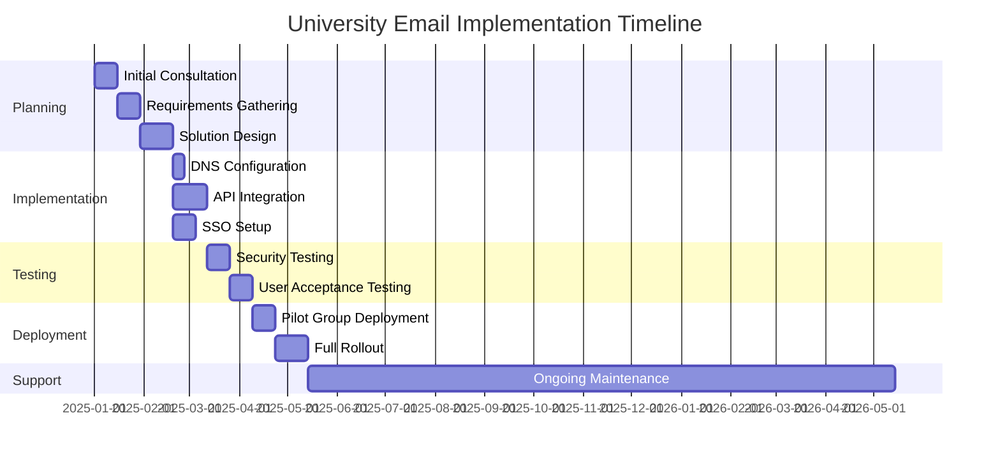
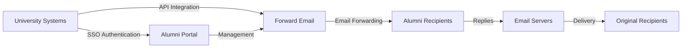

# กรณีศึกษา: วิธีที่ Forward Email สนับสนุนโซลูชันอีเมลศิษย์เก่าสำหรับมหาวิทยาลัยชั้นนำ {#case-study-how-forward-email-powers-alumni-email-solutions-for-top-universities}


## สารบัญ {#table-of-contents}

* [คำนำ](#foreword)
* [การประหยัดต้นทุนอย่างมากด้วยราคาที่มั่นคง](#dramatic-cost-savings-with-stable-pricing)
  * [การประหยัดจริงในมหาวิทยาลัย](#real-world-university-savings)
* [ความท้าทายของอีเมลศิษย์เก่ามหาวิทยาลัย](#the-university-alumni-email-challenge)
  * [คุณค่าของตัวตนอีเมลศิษย์เก่า](#the-value-of-alumni-email-identity)
  * [โซลูชันแบบดั้งเดิมที่ไม่เพียงพอ](#traditional-solutions-fall-short)
  * [โซลูชัน Forward Email](#the-forward-email-solution)
* [การดำเนินงานทางเทคนิค: วิธีการทำงาน](#technical-implementation-how-it-works)
  * [สถาปัตยกรรมหลัก](#core-architecture)
  * [การผสานรวมกับระบบของมหาวิทยาลัย](#integration-with-university-systems)
  * [การจัดการผ่าน API](#api-driven-management)
  * [การตั้งค่าและการยืนยัน DNS](#dns-configuration-and-verification)
  * [การทดสอบและการประกันคุณภาพ](#testing-and-quality-assurance)
* [ไทม์ไลน์การดำเนินงาน](#implementation-timeline)
* [กระบวนการดำเนินงาน: จากการย้ายข้อมูลถึงการบำรุงรักษา](#implementation-process-from-migration-to-maintenance)
  * [การประเมินและวางแผนเบื้องต้น](#initial-assessment-and-planning)
  * [กลยุทธ์การย้ายข้อมูล](#migration-strategy)
  * [การตั้งค่าและการกำหนดค่าทางเทคนิค](#technical-setup-and-configuration)
  * [การออกแบบประสบการณ์ผู้ใช้](#user-experience-design)
  * [การฝึกอบรมและเอกสารประกอบ](#training-and-documentation)
  * [การสนับสนุนและการปรับปรุงอย่างต่อเนื่อง](#ongoing-support-and-optimization)
* [กรณีศึกษา: มหาวิทยาลัยเคมบริดจ์](#case-study-university-of-cambridge)
  * [ความท้าทาย](#challenge)
  * [โซลูชัน](#solution)
  * [ผลลัพธ์](#results)
* [ประโยชน์สำหรับมหาวิทยาลัยและศิษย์เก่า](#benefits-for-universities-and-alumni)
  * [สำหรับมหาวิทยาลัย](#for-universities)
  * [สำหรับศิษย์เก่า](#for-alumni)
  * [อัตราการนำไปใช้ในหมู่ศิษย์เก่า](#adoption-rates-among-alumni)
  * [การประหยัดต้นทุนเมื่อเทียบกับโซลูชันก่อนหน้า](#cost-savings-compared-to-previous-solutions)
* [ข้อควรพิจารณาด้านความปลอดภัยและความเป็นส่วนตัว](#security-and-privacy-considerations)
  * [มาตรการปกป้องข้อมูล](#data-protection-measures)
  * [กรอบการปฏิบัติตามข้อกำหนด](#compliance-framework)
* [การพัฒนาในอนาคต](#future-developments)
* [บทสรุป](#conclusion)


## คำนำ {#foreword}

เราได้สร้างบริการส่งต่ออีเมลที่ปลอดภัย เป็นส่วนตัว และยืดหยุ่นที่สุดในโลกสำหรับมหาวิทยาลัยชั้นนำและศิษย์เก่าของพวกเขา

ในสภาพแวดล้อมการแข่งขันของการศึกษาระดับสูง การรักษาความสัมพันธ์ตลอดชีวิตกับศิษย์เก่าไม่ใช่แค่เรื่องของประเพณีเท่านั้น แต่เป็นสิ่งจำเป็นเชิงกลยุทธ์ หนึ่งในวิธีที่จับต้องได้มากที่สุดที่มหาวิทยาลัยสร้างความสัมพันธ์เหล่านี้คือผ่านที่อยู่อีเมลศิษย์เก่า ซึ่งมอบตัวตนดิจิทัลที่สะท้อนถึงมรดกทางการศึกษาของพวกเขา

ที่ Forward Email เราได้ร่วมมือกับสถาบันการศึกษาชั้นนำระดับโลกบางแห่งเพื่อปฏิวัติวิธีการจัดการบริการอีเมลศิษย์เก่า โซลูชันการส่งต่ออีเมลระดับองค์กรของเราขณะนี้สนับสนุนระบบอีเมลศิษย์เก่าสำหรับ [University of Cambridge](https://en.wikipedia.org/wiki/University_of_Cambridge), [University of Maryland](https://en.wikipedia.org/wiki/University_of_Maryland,_College_Park), [Tufts University](https://en.wikipedia.org/wiki/Tufts_University), และ [Swarthmore College](https://en.wikipedia.org/wiki/Swarthmore_College) ซึ่งให้บริการศิษย์เก่าหลายพันคนทั่วโลก

โพสต์บล็อกนี้จะสำรวจว่า บริการส่งต่ออีเมลแบบ [โอเพนซอร์ส](https://en.wikipedia.org/wiki/Open-source_software) ที่เน้นความเป็นส่วนตัวของเราได้กลายเป็นโซลูชันที่ได้รับความนิยมสำหรับสถาบันเหล่านี้อย่างไร การดำเนินงานทางเทคนิคที่ทำให้เป็นไปได้ และผลกระทบที่เปลี่ยนแปลงทั้งประสิทธิภาพการบริหารและความพึงพอใจของศิษย์เก่า


## การประหยัดต้นทุนอย่างมากด้วยราคาที่มั่นคง {#dramatic-cost-savings-with-stable-pricing}
ผลประโยชน์ทางการเงินของโซลูชันของเรามีมากมาย โดยเฉพาะเมื่อเทียบกับราคาที่เพิ่มขึ้นอย่างต่อเนื่องของผู้ให้บริการอีเมลแบบดั้งเดิม:

| โซลูชัน                       | ต้นทุนต่อศิษย์เก่า (รายปี)                                                                                 | ต้นทุนสำหรับศิษย์เก่า 100,000 คน | การปรับราคาล่าสุด                                                                                                                                                                   |
| ------------------------------ | --------------------------------------------------------------------------------------------------------- | ----------------------- | ---------------------------------------------------------------------------------------------------------------------------------------------------------------------------------------- |
| Google Workspace for Business  | $72                                                                                                       | $7,200,000              | • 2019: G Suite Basic จาก $5 เป็น $6/เดือน (+20%)<br>• 2023: แผน Flexible เพิ่มขึ้น 20%<br>• 2025: Business Plus จาก $18 เป็น $26.40/เดือน (+47%) พร้อมฟีเจอร์ AI                    |
| Google Workspace for Education | ฟรี (Education Fundamentals)<br>$3/นักเรียน/ปี (Education Standard)<br>$5/นักเรียน/ปี (Education Plus) | ฟรี - $500,000          | • ส่วนลดปริมาณ: 5% สำหรับใบอนุญาต 100-499 ใบ<br>• ส่วนลดปริมาณ: 10% สำหรับใบอนุญาต 500+ ใบ<br>• ระดับฟรีจำกัดเฉพาะบริการหลัก                                                         |
| Microsoft 365 Business         | $60                                                                                                       | $6,000,000              | • 2023: เริ่มปรับราคาสองครั้งต่อปี<br>• 2025 (ม.ค.): Personal จาก $6.99 เป็น $9.99/เดือน (+43%) พร้อม Copilot AI<br>• 2025 (เม.ย.): เพิ่ม 5% สำหรับการชำระรายปีแบบรายเดือน |
| Microsoft 365 Education        | ฟรี (A1)<br>$38-55/คณาจารย์/ปี (A3)<br>$65-96/คณาจารย์/ปี (A5)                                         | ฟรี - $96,000           | • ใบอนุญาตนักเรียนมักรวมกับการซื้อของคณาจารย์<br>• ราคาปรับตามปริมาณใบอนุญาต<br>• ระดับฟรีจำกัดเฉพาะเวอร์ชันเว็บ                                             |
| Self-Hosted Exchange           | $45                                                                                                       | $4,500,000              | ค่าใช้จ่ายบำรุงรักษาและความปลอดภัยที่เพิ่มขึ้นอย่างต่อเนื่อง                                                                                                                                  |
| **Forward Email Enterprise**   | **ค่าบริการคงที่ $250/เดือน**                                                                             | **$3,000/ปี**           | **ไม่มีการปรับราคาตั้งแต่เปิดตัว**                                                                                                                                                      |

### การประหยัดจริงของมหาวิทยาลัย {#real-world-university-savings}

นี่คือจำนวนเงินที่มหาวิทยาลัยพันธมิตรของเราประหยัดได้ต่อปีโดยเลือกใช้ Forward Email แทนผู้ให้บริการแบบดั้งเดิม:

| มหาวิทยาลัย              | จำนวนศิษย์เก่า | ต้นทุนรายปีกับ Google | ต้นทุนรายปีกับ Forward Email | การประหยัดรายปี |
| ----------------------- | -------------- | ----------------------- | ------------------------------ | -------------- |
| University of Cambridge | 30,000         | $90,000                 | $3,000                         | $87,000        |
| Swarthmore College      | 5,000          | $15,000                 | $3,000                         | $12,000        |
| Tufts University        | 12,000         | $36,000                 | $3,000                         | $33,000        |
| University of Maryland  | 25,000         | $75,000                 | $3,000                         | $72,000        |

> \[!NOTE]
> Forward Email Enterprise โดยทั่วไปมีค่าใช้จ่ายเพียง $250/เดือน ไม่มีค่าใช้จ่ายเพิ่มเติมต่อผู้ใช้, ไม่มีข้อจำกัดอัตรา API ที่ต้องอนุมัติ, และค่าใช้จ่ายเพิ่มเติมเพียงอย่างเดียวคือพื้นที่เก็บข้อมูลหากคุณต้องการ GB/TB เพิ่มเติมสำหรับนักเรียน (+$3 ต่อพื้นที่เก็บข้อมูลเพิ่มเติม 10 GB) เราใช้ไดรฟ์ NVMe SSD เพื่อรองรับ IMAP/POP3/SMTP/CalDAV/CardDAV อย่างรวดเร็วด้วยเช่นกัน.
> \[!IMPORTANT]
> แตกต่างจาก Google และ Microsoft ที่ได้เพิ่มราคาซ้ำแล้วซ้ำเล่าในขณะที่ผสานรวมฟีเจอร์ AI ที่วิเคราะห์ข้อมูลของคุณ Forward Email รักษาราคาคงที่โดยมุ่งเน้นความเป็นส่วนตัวอย่างเข้มงวด เราไม่ใช้ AI, ไม่ติดตามรูปแบบการใช้งาน และไม่เก็บบันทึกหรืออีเมลลงดิสก์ (การประมวลผลทั้งหมดทำในหน่วยความจำ) เพื่อรับประกันความเป็นส่วนตัวอย่างสมบูรณ์สำหรับการสื่อสารกับศิษย์เก่าของคุณ

นี่เป็นการลดต้นทุนอย่างมีนัยสำคัญเมื่อเทียบกับโซลูชันโฮสติ้งอีเมลแบบดั้งเดิม—เงินทุนที่มหาวิทยาลัยสามารถนำไปใช้กับทุนการศึกษา งานวิจัย หรือกิจกรรมสำคัญอื่น ๆ ตามการวิเคราะห์ในปี 2023 โดย Email Vendor Selection สถาบันการศึกษากำลังมองหาทางเลือกที่คุ้มค่ามากขึ้นแทนผู้ให้บริการอีเมลแบบดั้งเดิม เนื่องจากราคายังคงเพิ่มขึ้นพร้อมกับการผสานรวมฟีเจอร์ AI ([Email Vendor Selection, 2023](https://www.emailvendorselection.com/email-service-provider-list/)).


## ความท้าทายของอีเมลศิษย์เก่ามหาวิทยาลัย {#the-university-alumni-email-challenge}

สำหรับมหาวิทยาลัย การจัดหาที่อยู่อีเมลตลอดชีพให้กับศิษย์เก่าก่อให้เกิดความท้าทายเฉพาะที่โซลูชันอีเมลแบบดั้งเดิมมักไม่สามารถแก้ไขได้อย่างมีประสิทธิภาพ ดังที่ได้กล่าวไว้ในบทสนทนาเชิงลึกบน ServerFault มหาวิทยาลัยที่มีผู้ใช้จำนวนมากต้องการโซลูชันอีเมลเฉพาะที่สมดุลระหว่างประสิทธิภาพ ความปลอดภัย และความคุ้มค่า ([ServerFault, 2009](https://serverfault.com/questions/97364/what-is-the-best-mail-server-for-a-university-with-a-large-amount-of-users)).

### คุณค่าของอัตลักษณ์อีเมลศิษย์เก่า {#the-value-of-alumni-email-identity}

ที่อยู่อีเมลศิษย์เก่า (เช่น `firstname.lastname@cl.cam.ac.uk` หรือ `username@terpalum.umd.edu`) มีบทบาทสำคัญหลายประการ:

* รักษาการเชื่อมต่อกับสถาบันและอัตลักษณ์แบรนด์
* อำนวยความสะดวกในการสื่อสารอย่างต่อเนื่องกับมหาวิทยาลัย
* เพิ่มความน่าเชื่อถือในวิชาชีพสำหรับบัณฑิต
* สนับสนุนการสร้างเครือข่ายและชุมชนศิษย์เก่า
* ให้จุดติดต่อที่มั่นคงตลอดชีวิต

งานวิจัยโดย Tekade (2020) เน้นว่าอีเมลการศึกษามอบประโยชน์มากมายแก่ศิษย์เก่า รวมถึงการเข้าถึงทรัพยากรทางวิชาการ ความน่าเชื่อถือในวิชาชีพ และส่วนลดพิเศษในบริการต่าง ๆ ([Medium, 2020](https://medium.com/coders-capsule/top-20-benefits-of-having-an-educational-email-address-91a09795e05)).

> \[!TIP]
> เยี่ยมชมไดเรกทอรีใหม่ของเราที่ [AlumniEmail.com](https://alumniemail.com) สำหรับแหล่งข้อมูลครบวงจรเกี่ยวกับบริการอีเมลศิษย์เก่ามหาวิทยาลัย รวมถึงคู่มือการตั้งค่า แนวทางปฏิบัติที่ดีที่สุด และไดเรกทอรีที่ค้นหาได้ของโดเมนอีเมลศิษย์เก่า ซึ่งทำหน้าที่เป็นศูนย์กลางข้อมูลอีเมลศิษย์เก่าทั้งหมด

### โซลูชันแบบดั้งเดิมไม่เพียงพอ {#traditional-solutions-fall-short}

ระบบอีเมลแบบดั้งเดิมมีข้อจำกัดหลายประการเมื่อใช้กับความต้องการอีเมลศิษย์เก่า:

* **ต้นทุนสูงเกินไป**: โมเดลการอนุญาตใช้งานต่อผู้ใช้ไม่สามารถรับมือได้ทางการเงินสำหรับฐานศิษย์เก่าขนาดใหญ่
* **ภาระการบริหารจัดการ**: การจัดการบัญชีจำนวนหลายพันหรือหลายล้านบัญชีต้องใช้ทรัพยากร IT อย่างมาก
* **ความกังวลด้านความปลอดภัย**: การรักษาความปลอดภัยสำหรับบัญชีที่ไม่ได้ใช้งานเพิ่มความเสี่ยง
* **ความยืดหยุ่นจำกัด**: ระบบที่แข็งทื่อไม่สามารถปรับตัวเข้ากับความต้องการเฉพาะของการส่งต่ออีเมลศิษย์เก่าได้
* **ปัญหาความเป็นส่วนตัว**: ผู้ให้บริการหลายรายสแกนเนื้อหาอีเมลเพื่อวัตถุประสงค์โฆษณา

การสนทนาใน Quora เกี่ยวกับการบำรุงรักษาอีเมลมหาวิทยาลัยเผยว่าความกังวลด้านความปลอดภัยเป็นเหตุผลสำคัญที่มหาวิทยาลัยอาจจำกัดหรือยกเลิกที่อยู่อีเมลศิษย์เก่า เนื่องจากบัญชีที่ไม่ได้ใช้งานอาจถูกแฮ็กและขโมยตัวตนได้ ([Quora, 2011](https://www.quora.com/Is-there-any-cost-for-a-college-or-university-to-maintain-edu-e-mail-addresses)).

### โซลูชัน Forward Email {#the-forward-email-solution}

แนวทางของเราจัดการกับความท้าทายเหล่านี้ผ่านโมเดลที่แตกต่างอย่างพื้นฐาน:

* การส่งต่ออีเมลแทนการโฮสต์
* ราคาคงที่แทนต้นทุนต่อผู้ใช้
* สถาปัตยกรรมโอเพนซอร์สเพื่อความโปร่งใสและความปลอดภัย
* การออกแบบที่เน้นความเป็นส่วนตัวโดยไม่มีการสแกนเนื้อหา
* ฟีเจอร์เฉพาะสำหรับการจัดการอัตลักษณ์มหาวิทยาลัย


## การดำเนินการทางเทคนิค: วิธีการทำงาน {#technical-implementation-how-it-works}
โซลูชันของเรานำเสนอสถาปัตยกรรมทางเทคนิคที่ซับซ้อนแต่เรียบง่ายอย่างมีประสิทธิภาพ เพื่อมอบการส่งต่ออีเมลที่เชื่อถือได้และปลอดภัยในระดับขนาดใหญ่

### สถาปัตยกรรมหลัก {#core-architecture}

ระบบ Forward Email ประกอบด้วยส่วนประกอบสำคัญหลายอย่าง:

* เซิร์ฟเวอร์ MX แบบกระจายเพื่อความพร้อมใช้งานสูง
* การส่งต่อแบบเรียลไทม์โดยไม่มีการเก็บข้อความ
* การตรวจสอบสิทธิ์อีเมลอย่างครบถ้วน
* รองรับโดเมนและซับโดเมนแบบกำหนดเอง
* การจัดการบัญชีผ่าน API

ตามคำแนะนำของผู้เชี่ยวชาญด้านไอทีบน ServerFault สำหรับมหาวิทยาลัยที่ต้องการติดตั้งโซลูชันอีเมลของตนเอง Postfix ถูกแนะนำว่าเป็น Mail Transfer Agent (MTA) ที่ดีที่สุด ในขณะที่ Courier หรือ Dovecot เป็นที่นิยมสำหรับการเข้าถึง IMAP/POP3 ([ServerFault, 2009](https://serverfault.com/questions/97364/what-is-the-best-mail-server-for-a-university-with-a-large-amount-of-users)) อย่างไรก็ตาม โซลูชันของเราช่วยลดความจำเป็นที่มหาวิทยาลัยต้องจัดการระบบซับซ้อนเหล่านี้ด้วยตนเอง

### การผสานรวมกับระบบของมหาวิทยาลัย {#integration-with-university-systems}

เราได้พัฒนาช่องทางการผสานรวมที่ราบรื่นกับโครงสร้างพื้นฐานของมหาวิทยาลัยที่มีอยู่:

* การจัดเตรียมอัตโนมัติผ่านการผสานรวม [RESTful API](https://forwardemail.net/email-api)
* ตัวเลือกการสร้างแบรนด์แบบกำหนดเองสำหรับพอร์ทัลของมหาวิทยาลัย
* การจัดการนามแฝงที่ยืดหยุ่นสำหรับแผนกและองค์กร
* การดำเนินการแบบกลุ่มเพื่อการบริหารจัดการที่มีประสิทธิภาพ

### การจัดการผ่าน API {#api-driven-management}

[RESTful API](https://forwardemail.net/email-api) ของเราเปิดโอกาสให้มหาวิทยาลัยสามารถทำงานอัตโนมัติในการจัดการอีเมล:

```javascript
// ตัวอย่าง: การสร้างที่อยู่อีเมลศิษย์เก่าใหม่
const response = await fetch('https://forwardemail.net/api/v1/domains/example.edu/aliases', {
  method: 'POST',
  headers: {
    'Content-Type': 'application/json',
    'Authorization': `Basic ${Buffer.from(YOUR_API_TOKEN + ":").toString('base64')}`
  },
  body: JSON.stringify({
    name: 'alumni.john.smith',
    recipients: ['johnsmith@gmail.com'],
    has_recipient_verification: true
  })
});
```

### การกำหนดค่าและการตรวจสอบ DNS {#dns-configuration-and-verification}

การกำหนดค่า DNS ที่ถูกต้องเป็นสิ่งสำคัญสำหรับการส่งอีเมล ทีมงานของเราช่วยเหลือในเรื่อง:

* การกำหนดค่า [DNS](https://en.wikipedia.org/wiki/Domain_Name_System) รวมถึงระเบียน MX
* การใช้งานความปลอดภัยอีเมลอย่างครบถ้วนโดยใช้แพ็กเกจโอเพนซอร์สของเรา [mailauth](https://www.npmjs.com/package/mailauth) ซึ่งเป็นเครื่องมืออเนกประสงค์สำหรับการตรวจสอบสิทธิ์อีเมลที่จัดการ:
  * [SPF](https://en.wikipedia.org/wiki/Sender_Policy_Framework) (Sender Policy Framework) เพื่อป้องกันการปลอมแปลงอีเมล
  * [DKIM](https://en.wikipedia.org/wiki/DomainKeys_Identified_Mail) (DomainKeys Identified Mail) สำหรับการตรวจสอบสิทธิ์อีเมล
  * [DMARC](https://en.wikipedia.org/wiki/Email_authentication) (Domain-based Message Authentication, Reporting & Conformance) สำหรับการบังคับใช้นโยบาย
  * [MTA-STS](https://en.wikipedia.org/wiki/Opportunistic_TLS) (SMTP MTA Strict Transport Security) เพื่อบังคับใช้การเข้ารหัส TLS
  * [ARC](https://en.wikipedia.org/wiki/DomainKeys_Identified_Mail#Authenticated_Received_Chain) (Authenticated Received Chain) เพื่อรักษาการตรวจสอบสิทธิ์เมื่อมีการส่งต่อข้อความ
  * [SRS](https://en.wikipedia.org/wiki/Sender_Rewriting_Scheme) (Sender Rewriting Scheme) เพื่อรักษาการตรวจสอบ SPF ผ่านการส่งต่อ
  * [BIMI](https://en.wikipedia.org/wiki/Email_authentication) (Brand Indicators for Message Identification) สำหรับการแสดงโลโก้ในไคลเอนต์อีเมลที่รองรับ
* การตรวจสอบระเบียน DNS TXT สำหรับการเป็นเจ้าของโดเมน

แพ็กเกจ `mailauth` (<http://npmjs.com/package/mailauth>) เป็นโซลูชันโอเพนซอร์สเต็มรูปแบบที่จัดการทุกแง่มุมของการตรวจสอบสิทธิ์อีเมลในไลบรารีเดียว แตกต่างจากโซลูชันแบบปิดที่นี่ช่วยให้เกิดความโปร่งใส อัปเดตความปลอดภัยอย่างสม่ำเสมอ และควบคุมกระบวนการตรวจสอบสิทธิ์อีเมลได้อย่างสมบูรณ์

### การทดสอบและการประกันคุณภาพ {#testing-and-quality-assurance}

ก่อนการใช้งานเต็มรูปแบบ เราดำเนินการทดสอบอย่างเข้มงวด:

* การทดสอบการส่งอีเมลแบบครบวงจร
* การทดสอบโหลดสำหรับสถานการณ์ปริมาณสูง
* การทดสอบเจาะระบบความปลอดภัย
* การตรวจสอบการผสานรวม API
* การทดสอบการยอมรับของผู้ใช้ร่วมกับตัวแทนศิษย์เก่า
## Implementation Timeline {#implementation-timeline}


```mermaid
gantt
    title University Email Implementation Timeline
    dateFormat  YYYY-MM-DD
    section Planning
    Initial Consultation           :a1, 2025-01-01, 14d
    Requirements Gathering         :a2, after a1, 14d
    Solution Design                :a3, after a2, 21d
    section Implementation
    DNS Configuration              :b1, after a3, 7d
    API Integration                :b2, after a3, 21d
    SSO Setup                      :b3, after a3, 14d
    section Testing
    Security Testing               :c1, after b1 b2 b3, 14d
    User Acceptance Testing        :c2, after c1, 14d
    section Deployment
    Pilot Group Deployment         :d1, after c2, 14d
    Full Rollout                   :d2, after d1, 21d
    section Support
    Ongoing Maintenance            :e1, after d2, 365d
```


## Implementation Process: From Migration to Maintenance {#implementation-process-from-migration-to-maintenance}

กระบวนการดำเนินการที่มีโครงสร้างของเราช่วยให้การเปลี่ยนผ่านสำหรับมหาวิทยาลัยที่นำโซลูชันของเราไปใช้เป็นไปอย่างราบรื่น

### Initial Assessment and Planning {#initial-assessment-and-planning}

เราเริ่มต้นด้วยการประเมินอย่างครอบคลุมของระบบอีเมลปัจจุบันของมหาวิทยาลัย ฐานข้อมูลศิษย์เก่า และข้อกำหนดทางเทคนิค ระยะนี้รวมถึง:

* การสัมภาษณ์ผู้มีส่วนได้ส่วนเสียกับฝ่ายไอที ฝ่ายสัมพันธ์ศิษย์เก่า และฝ่ายบริหาร
* การตรวจสอบทางเทคนิคของโครงสร้างพื้นฐานอีเมลที่มีอยู่
* การทำแผนที่ข้อมูลสำหรับบันทึกศิษย์เก่า
* การตรวจสอบความปลอดภัยและการปฏิบัติตามข้อกำหนด
* การพัฒนาไทม์ไลน์โครงการและจุดสำคัญ

### Migration Strategy {#migration-strategy}

จากการประเมิน เราพัฒนากลยุทธ์การย้ายข้อมูลที่เหมาะสมซึ่งลดการรบกวนในขณะเดียวกันก็รับประกันความสมบูรณ์ของข้อมูลอย่างครบถ้วน:

* วิธีการย้ายข้อมูลเป็นขั้นตอนตามกลุ่มศิษย์เก่า
* การดำเนินงานระบบคู่ขนานในช่วงการเปลี่ยนผ่าน
* โปรโตคอลการตรวจสอบความถูกต้องของข้อมูลอย่างครอบคลุม
* ขั้นตอนการย้อนกลับสำหรับปัญหาใด ๆ ในการย้ายข้อมูล
* แผนการสื่อสารที่ชัดเจนสำหรับผู้มีส่วนได้ส่วนเสียทั้งหมด

### Technical Setup and Configuration {#technical-setup-and-configuration}

ทีมเทคนิคของเราดูแลทุกด้านของการตั้งค่าระบบ:

* การกำหนดค่าและการตรวจสอบ DNS
* การรวม API กับระบบของมหาวิทยาลัย
* การพัฒนาพอร์ทัลที่ปรับแต่งด้วยแบรนด์ของมหาวิทยาลัย
* การตั้งค่าการรับรองความถูกต้องของอีเมล (SPF, DKIM, DMARC)

### User Experience Design {#user-experience-design}

เราทำงานอย่างใกล้ชิดกับมหาวิทยาลัยเพื่อสร้างอินเทอร์เฟซที่ใช้งานง่ายสำหรับทั้งผู้ดูแลระบบและศิษย์เก่า:

* พอร์ทัลอีเมลศิษย์เก่าที่มีแบรนด์เฉพาะ
* การจัดการการส่งต่ออีเมลที่เรียบง่าย
* การออกแบบที่ตอบสนองต่ออุปกรณ์เคลื่อนที่
* การปฏิบัติตามมาตรฐานการเข้าถึง
* การสนับสนุนหลายภาษาเมื่อจำเป็น

### Training and Documentation {#training-and-documentation}

การฝึกอบรมอย่างครอบคลุมช่วยให้ผู้มีส่วนได้ส่วนเสียทุกคนสามารถใช้ระบบได้อย่างมีประสิทธิภาพ:

* การฝึกอบรมผู้ดูแลระบบ
* เอกสารทางเทคนิคสำหรับเจ้าหน้าที่ไอที
* คู่มือผู้ใช้สำหรับศิษย์เก่า
* วิดีโอสอนสำหรับงานทั่วไป
* การพัฒนาฐานความรู้

### Ongoing Support and Optimization {#ongoing-support-and-optimization}

ความร่วมมือของเรายังคงดำเนินต่อไปเกินกว่าการดำเนินการ:

* การสนับสนุนทางเทคนิคตลอด 24/7
* การอัปเดตระบบและแพตช์ความปลอดภัยอย่างสม่ำเสมอ
* การตรวจสอบและเพิ่มประสิทธิภาพการทำงาน
* การให้คำปรึกษาเกี่ยวกับแนวทางปฏิบัติที่ดีที่สุดของอีเมล
* การวิเคราะห์ข้อมูลและการรายงาน


## Case Study: University of Cambridge {#case-study-university-of-cambridge}

มหาวิทยาลัยเคมบริดจ์ต้องการโซลูชันเพื่อให้ที่อยู่อีเมล @cam.ac.uk แก่ศิษย์เก่าในขณะที่ลดภาระงานและค่าใช้จ่ายด้านไอที

### Challenge {#challenge}

เคมบริดจ์เผชิญกับความท้าทายหลายประการกับระบบอีเมลศิษย์เก่าก่อนหน้านี้:

* ค่าใช้จ่ายในการดำเนินงานสูงสำหรับการดูแลโครงสร้างพื้นฐานอีเมลแยกต่างหาก
* ภาระงานด้านการบริหารจัดการบัญชีนับพัน
* ความกังวลด้านความปลอดภัยกับบัญชีที่ไม่ได้ใช้งาน
* การบูรณาการที่จำกัดกับระบบฐานข้อมูลศิษย์เก่า
* ความต้องการพื้นที่จัดเก็บที่เพิ่มขึ้น

### Solution {#solution}

Forward Email ได้นำโซลูชันที่ครอบคลุมมาใช้:

* การส่งต่ออีเมลสำหรับที่อยู่อีเมลศิษย์เก่าทุกคน @cam.ac.uk
* พอร์ทัลที่มีแบรนด์เฉพาะสำหรับบริการตนเองของศิษย์เก่า
* การรวม API กับฐานข้อมูลศิษย์เก่าของเคมบริดจ์
* การดำเนินการความปลอดภัยอีเมลอย่างครบถ้วน

### Results {#results}

การดำเนินการส่งผลประโยชน์อย่างมีนัยสำคัญ:
* ลดต้นทุนอย่างมากเมื่อเทียบกับโซลูชันก่อนหน้า
* ความน่าเชื่อถือในการส่งอีเมล 99.9%
* การบริหารจัดการที่ง่ายขึ้นผ่านระบบอัตโนมัติ
* ความปลอดภัยที่เพิ่มขึ้นด้วยการยืนยันตัวตนอีเมลสมัยใหม่
* ข้อเสนอแนะเชิงบวกจากศิษย์เก่าเกี่ยวกับความง่ายในการใช้งานระบบ


## ประโยชน์สำหรับมหาวิทยาลัยและศิษย์เก่า {#benefits-for-universities-and-alumni}

โซลูชันของเรามอบประโยชน์ที่จับต้องได้ทั้งสำหรับสถาบันและบัณฑิตของพวกเขา

### สำหรับมหาวิทยาลัย {#for-universities}

* **ประสิทธิภาพด้านต้นทุน**: ราคาคงที่ไม่ขึ้นกับจำนวนศิษย์เก่า
* **ความเรียบง่ายในการบริหาร**: การจัดการอัตโนมัติผ่าน API
* **ความปลอดภัยที่เพิ่มขึ้น**: การยืนยันตัวตนอีเมลอย่างครบถ้วน
* **ความสอดคล้องของแบรนด์**: ที่อยู่อีเมลสถาบันตลอดชีพ
* **การมีส่วนร่วมของศิษย์เก่า**: เสริมสร้างความสัมพันธ์ผ่านบริการอย่างต่อเนื่อง

ตามข้อมูลจาก BulkSignature (2023) แพลตฟอร์มอีเมลสำหรับสถาบันการศึกษามอบประโยชน์สำคัญ เช่น ความคุ้มค่าด้านต้นทุนผ่านแผนบริการฟรีหรือราคาต่ำ, ประหยัดเวลาในการสื่อสารจำนวนมาก และฟีเจอร์ติดตามผลเพื่อเฝ้าดูการส่งและการมีส่วนร่วมของอีเมล ([BulkSignature, 2023](https://bulksignature.com/blog/5-best-email-platforms-for-educational-institutions/)).

### สำหรับศิษย์เก่า {#for-alumni}

* **อัตลักษณ์ทางวิชาชีพ**: ที่อยู่อีเมลมหาวิทยาลัยที่มีชื่อเสียง
* **ความต่อเนื่องของอีเมล**: ส่งต่อไปยังอีเมลส่วนตัวใดก็ได้
* **การปกป้องความเป็นส่วนตัว**: ไม่มีการสแกนเนื้อหาอีเมลหรือขุดข้อมูล
* **การจัดการที่ง่ายขึ้น**: อัปเดตผู้รับได้ง่าย
* **ความปลอดภัยที่เพิ่มขึ้น**: การยืนยันตัวตนอีเมลสมัยใหม่

งานวิจัยจาก International Journal of Education & Literacy Studies เน้นย้ำความสำคัญของการสื่อสารทางอีเมลที่เหมาะสมในสภาพแวดล้อมทางการศึกษา โดยระบุว่าความรู้ความสามารถในการใช้อีเมลเป็นทักษะสำคัญสำหรับนักเรียนและศิษย์เก่าในบริบททางวิชาชีพ ([IJELS, 2021](https://files.eric.ed.gov/fulltext/EJ1319324.pdf)).

### อัตราการนำไปใช้ในหมู่ศิษย์เก่า {#adoption-rates-among-alumni}

มหาวิทยาลัยรายงานอัตราการนำไปใช้และความพึงพอใจสูงในชุมชนศิษย์เก่าของตน

### การประหยัดต้นทุนเมื่อเทียบกับโซลูชันก่อนหน้า {#cost-savings-compared-to-previous-solutions}

ผลกระทบทางการเงินมีความสำคัญ โดยมหาวิทยาลัยรายงานการประหยัดต้นทุนอย่างมากเมื่อเทียบกับโซลูชันอีเมลก่อนหน้า


## ข้อควรพิจารณาด้านความปลอดภัยและความเป็นส่วนตัว {#security-and-privacy-considerations}

สำหรับสถาบันการศึกษา การปกป้องข้อมูลศิษย์เก่าไม่ใช่แค่การปฏิบัติที่ดีเท่านั้น—แต่ยังเป็นข้อกำหนดทางกฎหมายภายใต้ข้อบังคับเช่น GDPR ในยุโรป

### มาตรการปกป้องข้อมูล {#data-protection-measures}

โซลูชันของเรารวมหลายชั้นของความปลอดภัย:

* การเข้ารหัสแบบ end-to-end สำหรับการรับส่งอีเมลทั้งหมด
* ไม่มีการเก็บเนื้อหาอีเมลบนเซิร์ฟเวอร์ของเรา
* การตรวจสอบความปลอดภัยและทดสอบเจาะระบบอย่างสม่ำเสมอ
* การปฏิบัติตามมาตรฐานการปกป้องข้อมูลระหว่างประเทศ
* โค้ดเปิดเผยโปร่งใสสำหรับการตรวจสอบความปลอดภัย

> \[!WARNING]
> ผู้ให้บริการอีเมลหลายรายสแกนเนื้อหาอีเมลเพื่อวัตถุประสงค์โฆษณาหรือฝึกโมเดล AI การปฏิบัตินี้ก่อให้เกิดความกังวลด้านความเป็นส่วนตัวอย่างรุนแรง โดยเฉพาะสำหรับการสื่อสารทางวิชาชีพและทางวิชาการ Forward Email ไม่เคยสแกนเนื้อหาอีเมลและประมวลผลอีเมลทั้งหมดในหน่วยความจำเพื่อให้มั่นใจในความเป็นส่วนตัวอย่างสมบูรณ์

### กรอบการปฏิบัติตามข้อกำหนด {#compliance-framework}

เรารักษาการปฏิบัติตามข้อกำหนดอย่างเข้มงวด:

* การปฏิบัติตาม GDPR สำหรับสถาบันในยุโรป
* การรับรอง SOC 2 Type II
* การประเมินความปลอดภัยประจำปี
* ข้อตกลงการประมวลผลข้อมูล (DPA) มีให้ที่ [forwardemail.net/dpa](https://forwardemail.net/dpa)
* การอัปเดตการปฏิบัติตามข้อกำหนดอย่างสม่ำเสมอเมื่อข้อบังคับเปลี่ยนแปลง


## การพัฒนาในอนาคต {#future-developments}

เรายังคงพัฒนาโซลูชันอีเมลสำหรับศิษย์เก่าของเราด้วยฟีเจอร์และความสามารถใหม่ๆ:

* การวิเคราะห์ขั้นสูงสำหรับผู้ดูแลระบบมหาวิทยาลัย
* การป้องกันการฟิชชิ่งขั้นสูง
* ขยายความสามารถของ API สำหรับการผสานรวมที่ลึกขึ้น
* ตัวเลือกการยืนยันตัวตนเพิ่มเติม


## สรุป {#conclusion}

Forward Email ได้ปฏิวัติวิธีที่มหาวิทยาลัยให้บริการและจัดการอีเมลสำหรับศิษย์เก่า โดยแทนที่การโฮสต์อีเมลที่มีค่าใช้จ่ายสูงและซับซ้อนด้วยการส่งต่ออีเมลที่เรียบง่ายและปลอดภัย เราได้ช่วยให้สถาบันสามารถมอบที่อยู่อีเมลตลอดชีพแก่ศิษย์เก่าทุกคนในขณะที่ลดต้นทุนและภาระการบริหารอย่างมากลงได้อย่างมากมาย
ความร่วมมือของเรากับสถาบันที่มีชื่อเสียงอย่าง Cambridge, Maryland, Tufts และ Swarthmore แสดงให้เห็นถึงประสิทธิภาพของแนวทางของเราในสภาพแวดล้อมการศึกษาที่หลากหลาย ขณะที่มหาวิทยาลัยต้องเผชิญกับแรงกดดันที่เพิ่มขึ้นในการรักษาความสัมพันธ์กับศิษย์เก่าในขณะที่ควบคุมค่าใช้จ่าย โซลูชันของเรานำเสนอทางเลือกที่น่าสนใจแทนระบบอีเมลแบบดั้งเดิม


```mermaid
flowchart LR
    A[University Systems] -->|API Integration| B[Forward Email]
    B -->|Email Forwarding| C[Alumni Recipients]
    C -->|Replies| D[Email Servers]
    D -->|Delivery| E[Original Recipients]
    F[Alumni Portal] -->|Management| B
    A -->|SSO Authentication| F
```

สำหรับมหาวิทยาลัยที่สนใจสำรวจว่า Forward Email สามารถเปลี่ยนแปลงบริการอีเมลศิษย์เก่าของพวกเขาได้อย่างไร ติดต่อทีมงานของเราที่ <support@forwardemail.net> หรือเยี่ยมชม [forwardemail.net](https://forwardemail.net) เพื่อเรียนรู้เพิ่มเติมเกี่ยวกับโซลูชันองค์กรของเรา
