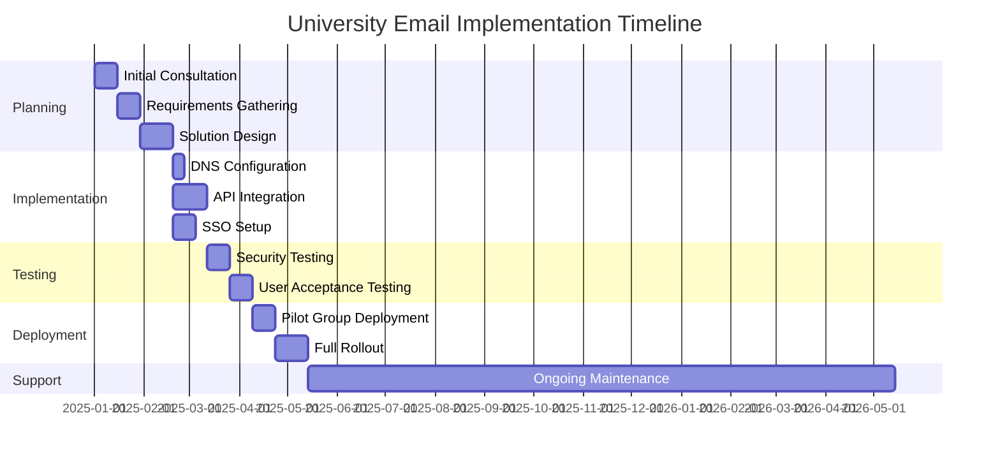
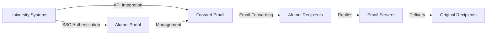

# Vaka Çalışması: Yönlendirme E-postası, En İyi Üniversiteler İçin Mezun E-posta Çözümlerini Nasıl Güçlendiriyor? {#case-study-how-forward-email-powers-alumni-email-solutions-for-top-universities}


## İçindekiler {#table-of-contents}

* [Önsöz](#foreword)
* [İstikrarlı Fiyatlandırma ile Dramatik Maliyet Tasarrufları](#dramatic-cost-savings-with-stable-pricing)
  * [Gerçek Dünya Üniversite Tasarrufları](#real-world-university-savings)
* [Üniversite Mezunları E-posta Yarışması](#the-university-alumni-email-challenge)
  * [Mezun E-posta Kimliğinin Değeri](#the-value-of-alumni-email-identity)
  * [Geleneksel Çözümler Yetersiz Kalıyor](#traditional-solutions-fall-short)
  * [Yönlendirilmiş E-posta Çözümü](#the-forward-email-solution)
* [Teknik Uygulama: Nasıl Çalışır?](#technical-implementation-how-it-works)
  * [Çekirdek Mimari](#core-architecture)
  * [Üniversite Sistemleriyle Entegrasyon](#integration-with-university-systems)
  * [API Odaklı Yönetim](#api-driven-management)
  * [DNS Yapılandırması ve Doğrulaması](#dns-configuration-and-verification)
  * [Test ve Kalite Güvencesi](#testing-and-quality-assurance)
* [Uygulama Zaman Çizelgesi](#implementation-timeline)
* [Uygulama Süreci: Göçten Bakıma](#implementation-process-from-migration-to-maintenance)
  * [İlk Değerlendirme ve Planlama](#initial-assessment-and-planning)
  * [Göç Stratejisi](#migration-strategy)
  * [Teknik Kurulum ve Yapılandırma](#technical-setup-and-configuration)
  * [Kullanıcı Deneyimi Tasarımı](#user-experience-design)
  * [Eğitim ve Dokümantasyon](#training-and-documentation)
  * [Sürekli Destek ve Optimizasyon](#ongoing-support-and-optimization)
* [Vaka Çalışması: Cambridge Üniversitesi](#case-study-university-of-cambridge)
  * [Meydan okumak](#challenge)
  * [Çözüm](#solution)
  * [Sonuçlar](#results)
* [Üniversiteler ve Mezunlar İçin Faydalar](#benefits-for-universities-and-alumni)
  * [Üniversiteler İçin](#for-universities)
  * [Mezunlar İçin](#for-alumni)
  * [Mezunlar Arasında Evlat Edinme Oranları](#adoption-rates-among-alumni)
  * [Önceki Çözümlere Göre Maliyet Tasarrufları](#cost-savings-compared-to-previous-solutions)
* [Güvenlik ve Gizlilik Hususları](#security-and-privacy-considerations)
  * [Veri Koruma Önlemleri](#data-protection-measures)
  * [Uyumluluk Çerçevesi](#compliance-framework)
* [Gelecekteki Gelişmeler](#future-developments)
* [Çözüm](#conclusion)

## Önsöz {#foreword}

Prestijli üniversiteler ve mezunları için dünyanın en güvenli, özel ve esnek e-posta yönlendirme hizmetini oluşturduk.

Yükseköğretimin rekabetçi ortamında, mezunlarla ömür boyu sürecek bağları sürdürmek sadece bir gelenek meselesi değil, stratejik bir zorunluluktur. Üniversitelerin bu bağları güçlendirmesinin en somut yollarından biri, mezunlara akademik miraslarını yansıtan dijital bir kimlik sağlayan mezun e-posta adresleridir.

Forward Email olarak, mezun e-posta hizmetlerini yönetme biçimlerini kökten değiştirmek için dünyanın en prestijli eğitim kurumlarından bazılarıyla ortaklık kurduk. Kurumsal düzeydeki e-posta yönlendirme çözümümüz artık [Cambridge Üniversitesi](https://en.wikipedia.org/wiki/University_of_Cambridge), [Maryland Üniversitesi](https://en.wikipedia.org/wiki/University_of_Maryland,\_College_Park), [Tufts Üniversitesi](https://en.wikipedia.org/wiki/Tufts_University) ve [Swarthmore Koleji](https://en.wikipedia.org/wiki/Swarthmore_College) mezun e-posta sistemlerini destekliyor ve toplamda dünya çapında binlerce mezuna hizmet veriyor.

Bu blog yazısı, gizlilik odaklı e-posta yönlendirme hizmetimiz [açık kaynaklı](https://en.wikipedia.org/wiki/Open-source_software)'ın bu kurumlar için nasıl tercih edilen çözüm haline geldiğini, bunu mümkün kılan teknik uygulamaları ve hem idari verimlilik hem de mezun memnuniyeti üzerindeki dönüştürücü etkisini inceliyor.

## İstikrarlı Fiyatlandırma ile Önemli Maliyet Tasarrufları {#dramatic-cost-savings-with-stable-pricing}

Çözümümüzün finansal faydaları, özellikle geleneksel e-posta sağlayıcılarının sürekli artan fiyatlarıyla karşılaştırıldığında oldukça önemlidir:

| Çözüm | Mezun Başına Maliyet (Yıllık) | 100.000 Mezun İçin Maliyet | Son Fiyat Artışları |
| ------------------------------ | --------------------------------------------------------------------------------------------------------- | ----------------------- | ---------------------------------------------------------------------------------------------------------------------------------------------------------------------------------------- |
| İşletmeler için Google Workspace | $72 | $7,200,000 | • 2019: G Suite Basic aylık 5 dolardan 6 dolara (+%20)<br>• 2023: Esnek planlar %20 arttı<br>• 2025: Yapay zeka özellikleriyle Business Plus aylık 18 dolardan 26,40 dolara (+%47) |
| Google Workspace for Education | Ücretsiz (Eğitim Temelleri)<br>Öğrenci başına 3 ABD doları/yıl (Eğitim Standardı)<br>Öğrenci başına 5 ABD doları/yıl (Eğitim Artı) | Ücretsiz - 500.000 $ | • Toplu indirimler: 100-499 lisans için %5<br>• Toplu indirimler: 500+ lisans için %10<br>• Ücretsiz katman, temel hizmetlerle sınırlıdır |
| Microsoft 365 İş | $60 | $6,000,000 | • 2023: Yılda iki kez fiyat güncellemeleri getirildi<br>• 2025 (Ocak): Copilot AI ile kişisel abonelik 6,99 ABD dolarından 9,99 ABD dolarına (+%43) yükseldi<br>• 2025 (Nisan): Aylık ödenen yıllık taahhütlerde %5 artış |
| Microsoft 365 Eğitim | Ücretsiz (A1)<br>38-55$/fakülte/yıl (A3)<br>65-96$/fakülte/yıl (A5) | Ücretsiz - 96.000 $ | • Öğrenci lisansları genellikle öğretim üyesi satın alımlarına dahildir<br>• Toplu lisanslama yoluyla özel fiyatlandırma<br>• Ücretsiz katman web sürümleriyle sınırlıdır |
| Kendinden Barındırılan Exchange | $45 | $4,500,000 | Devam eden bakım ve güvenlik maliyetleri artmaya devam ediyor |
| **E-postayı İlet Kurumsal** | **Sabit 250$/ay** | **3.000$/yıl** | **Piyasaya sürüldüğünden beri fiyat artışı yapılmadı** |

### Gerçek Dünya Üniversite Tasarrufları {#real-world-university-savings}

Geleneksel sağlayıcılar yerine Forward Email'i seçen üniversitelerimizin yıllık tasarrufları şöyle:

| Üniversite | Mezun Sayısı | Google ile Yıllık Maliyet | E-posta İletme ile Yıllık Maliyet | Yıllık Tasarruf |
| ----------------------- | ------------ | ----------------------- | ------------------------------ | -------------- |
| Cambridge Üniversitesi | 30,000 | $90,000 | $3,000 | $87,000 |
| Swarthmore Koleji | 5,000 | $15,000 | $3,000 | $12,000 |
| Tufts Üniversitesi | 12,000 | $36,000 | $3,000 | $33,000 |
| Maryland Üniversitesi | 25,000 | $75,000 | $3,000 | $72,000 |

> \[!NOTE]
> Kurumsal E-posta Yönlendirme hizmetinin maliyeti genellikle aylık 250 ABD dolarıdır. Kullanıcı başına ek bir maliyet yoktur, beyaz listeye alınmış API ücret sınırlamaları vardır ve öğrenciler için ek GB/TB depolama alanına ihtiyacınız olması durumunda ek maliyet sadece depolama alanıdır (10 GB ek depolama alanı için +3 ABD doları). Ayrıca IMAP/POP3/SMTP/CalDAV/CardDAV'ı hızlı bir şekilde desteklemek için NVMe SSD sürücüler kullanıyoruz.

> \[!IMPORTANT]
> Verilerinizi analiz eden yapay zeka özelliklerini entegre ederken fiyatlarını sürekli artıran Google ve Microsoft'un aksine, Forward Email, gizlilik odaklı istikrarlı fiyatlandırma politikasına sahiptir. Yapay zeka kullanmıyor, kullanım modellerini takip etmiyor ve günlükleri veya e-postaları diske kaydetmiyoruz (tüm işlemler bellek içinde yapılır), böylece mezunlarınızla olan iletişimleriniz için tam gizlilik sağlıyoruz.

Bu, geleneksel e-posta barındırma çözümlerine kıyasla önemli bir maliyet tasarrufu anlamına geliyor; üniversiteler bu fonları burslara, araştırmalara veya diğer kritik öneme sahip faaliyetlere yönlendirebiliyor. Email Vendor Selection tarafından 2023 yılında yapılan bir analize göre, eğitim kurumları yapay zeka özelliklerinin entegrasyonuyla fiyatlar artmaya devam ettikçe, geleneksel e-posta sağlayıcılarına uygun maliyetli alternatifler arıyor ([E-posta Satıcı Seçimi, 2023](https://www.emailvendorselection.com/email-service-provider-list/)).

## Üniversite Mezunları E-posta Yarışması {#the-university-alumni-email-challenge}

Üniversiteler için, mezunlara ömür boyu e-posta adresi sağlamak, geleneksel e-posta çözümlerinin etkili bir şekilde ele almakta zorlandığı benzersiz bir dizi zorluk ortaya çıkarır. ServerFault hakkındaki kapsamlı bir tartışmada belirtildiği gibi, geniş kullanıcı tabanlarına sahip üniversiteler, performans, güvenlik ve maliyet etkinliğini dengeleyen özel e-posta çözümlerine ihtiyaç duyar ([Sunucu Hatası, 2009](https://serverfault.com/questions/97364/what-is-the-best-mail-server-for-a-university-with-a-large-amount-of-users)).

### Mezun E-posta Kimliğinin Değeri {#the-value-of-alumni-email-identity}

Mezun e-posta adresleri (`firstname.lastname@cl.cam.ac.uk` veya `username@terpalum.umd.edu` gibi) birden fazla önemli işleve sahiptir:

* Kurumsal bağlantıyı ve marka kimliğini sürdürmek
* Üniversite ile sürekli iletişimi kolaylaştırmak
* Mezunlar için profesyonel güvenilirliği artırmak
* Mezunlar arasında ağ oluşturma ve topluluk oluşturmayı desteklemek
* İstikrarlı ve ömür boyu sürecek bir iletişim noktası sağlamak

Tekade (2020) tarafından yapılan araştırma, eğitim e-posta adreslerinin mezunlara akademik kaynaklara erişim, profesyonel güvenilirlik ve çeşitli hizmetlerde özel indirimler gibi çok sayıda fayda sağladığını vurgulamaktadır ([Orta, 2020](https://medium.com/coders-capsule/top-20-benefits-of-having-an-educational-email-address-91a09795e05)).

> \[!TIP]
> Kurulum kılavuzları, en iyi uygulamalar ve aranabilir bir mezun e-posta alan adı dizini de dahil olmak üzere üniversite mezunlarının e-posta hizmetleri hakkında kapsamlı bir kaynak için yeni [AlumniEmail.com](https://alumniemail.com) dizinimizi ziyaret edin. Tüm mezun e-posta bilgileri için merkezi bir merkez görevi görür.

### Geleneksel Çözümler Yetersiz Kalıyor {#traditional-solutions-fall-short}

Geleneksel e-posta sistemleri, mezunların e-posta ihtiyaçlarına uygulandığında çeşitli sınırlamalar ortaya çıkar:

* **Maliyet Engelleyici**: Kullanıcı başına lisanslama modelleri, geniş mezun tabanları için finansal olarak sürdürülemez hale gelir.
* **İdari Yük**: Binlerce veya milyonlarca hesabı yönetmek önemli BT kaynakları gerektirir.
* **Güvenlik Endişeleri**: Etkin olmayan hesaplar için güvenliği sağlamak, güvenlik açığını artırır.
* **Sınırlı Esneklik**: Katı sistemler, mezunların e-posta yönlendirmelerinin benzersiz ihtiyaçlarına uyum sağlayamaz.
* **Gizlilik Sorunları**: Birçok sağlayıcı, reklam amaçlı e-posta içeriğini tarar.

Quora'da üniversite e-posta bakımıyla ilgili yapılan bir tartışma, üniversitelerin mezunların e-posta adreslerini sınırlamasının veya iptal etmesinin başlıca nedenlerinden birinin güvenlik endişeleri olduğunu ortaya koyuyor; çünkü kullanılmayan hesaplar bilgisayar korsanlığına ve kimlik hırsızlığına karşı savunmasız olabiliyor ([Quora, 2011](https://www.quora.com/Is-there-any-cost-for-a-college-or-university-to-maintain-edu-e-mail-addresses)).

### Yönlendirme E-posta Çözümü {#the-forward-email-solution}

Bizim yaklaşımımız bu zorlukları temelde farklı bir modelle ele alıyor:

* Barındırma yerine e-posta yönlendirme
* Kullanıcı başına maliyet yerine sabit fiyatlandırma
* Şeffaflık ve güvenlik için açık kaynaklı mimari
* İçerik taraması gerektirmeyen, gizlilik odaklı tasarım
* Üniversite kimlik yönetimi için özel özellikler

## Teknik Uygulama: Nasıl Çalışır? {#technical-implementation-how-it-works}

Çözümümüz, büyük ölçekte güvenilir ve emniyetli e-posta yönlendirmesi sağlamak için gelişmiş ancak zarif bir şekilde basit bir teknik mimariden yararlanır.

### Çekirdek Mimarisi {#core-architecture}

E-posta İletme sistemi birkaç temel bileşenden oluşur:

* Yüksek erişilebilirlik için dağıtılmış MX sunucuları
* Mesaj depolaması olmadan gerçek zamanlı yönlendirme
* Kapsamlı e-posta kimlik doğrulaması
* Özel alan adı ve alt alan adı desteği
* API odaklı hesap yönetimi

ServerFault'taki BT uzmanlarına göre, kendi e-posta çözümlerini uygulamak isteyen üniversiteler için en iyi Posta Aktarım Aracısı (MTA) olarak Postfix önerilirken, IMAP/POP3 erişimi için Courier veya Dovecot tercih ediliyor ([Sunucu Hatası, 2009](https://serverfault.com/questions/97364/what-is-the-best-mail-server-for-a-university-with-a-large-amount-of-users)). Ancak çözümümüz, üniversitelerin bu karmaşık sistemleri kendilerinin yönetme ihtiyacını ortadan kaldırıyor.

### Üniversite Sistemleriyle Entegrasyon {#integration-with-university-systems}

Mevcut üniversite altyapısıyla kusursuz entegrasyon yolları geliştirdik:

* [RESTful API](https://forwardemail.net/email-api) entegrasyonu ile otomatik provizyonlama
* Üniversite portalları için özel markalama seçenekleri
* Departmanlar ve kuruluşlar için esnek takma ad yönetimi
* Verimli yönetim için toplu işlemler

### API Odaklı Yönetim {#api-driven-management}

[RESTful API](https://forwardemail.net/email-api) üniversitelerin e-posta yönetimini otomatikleştirmesini sağlar:

```javascript
// Example: Creating a new alumni email address
const response = await fetch('https://forwardemail.net/api/v1/domains/example.edu/aliases', {
  method: 'POST',
  headers: {
    'Content-Type': 'application/json',
    'Authorization': `Basic ${Buffer.from(YOUR_API_TOKEN + ":").toString('base64')}`
  },
  body: JSON.stringify({
    name: 'alumni.john.smith',
    recipients: ['johnsmith@gmail.com'],
    has_recipient_verification: true
  })
});
```

### DNS Yapılandırması ve Doğrulaması {#dns-configuration-and-verification}

E-posta teslimatı için doğru DNS yapılandırması kritik öneme sahiptir. Ekibimiz şu konularda yardımcı olur:

* MX kayıtları da dahil olmak üzere [DNS](https://en.wikipedia.org/wiki/Domain_Name_System) yapılandırması
* E-posta kimlik doğrulaması için bir İsviçre çakısı olan açık kaynaklı [posta yetkilendirmesi](https://www.npmjs.com/package/mailauth) paketimizi kullanan kapsamlı e-posta güvenliği uygulaması:
* E-posta sahteciliğini önlemek için [SPF](https://en.wikipedia.org/wiki/Sender_Policy_Framework) (Gönderen Politika Çerçevesi)
* E-posta kimlik doğrulaması için [DKIM](https://en.wikipedia.org/wiki/DomainKeys_Identified_Mail) (Etki Alanı Anahtarlarıyla Tanımlanmış Posta)
* Politika uygulaması için [DMARC](https://en.wikipedia.org/wiki/Email_authentication) (Etki Alanı Tabanlı Mesaj Kimlik Doğrulaması, Raporlama ve Uygunluk)
* TLS şifrelemesini uygulamak için [MTA-STS](https://en.wikipedia.org/wiki/Opportunistic_TLS) (SMTP MTA Sıkı Taşıma Güvenliği)
* Mesajlar iletildiğinde kimlik doğrulamasını sürdürmek için [ARC](https://en.wikipedia.org/wiki/DomainKeys_Identified_Mail#Authenticated_Received_Chain) (Kimliği Doğrulanmış Alınan Zincir)
* İletim yoluyla SPF doğrulamasını korumak için [SRS](https://en.wikipedia.org/wiki/Sender_Rewriting_Scheme) (Gönderen Yeniden Yazma Şeması)
* Logo gösterimi için [BIMI](https://en.wikipedia.org/wiki/Email_authentication) (Mesaj Tanımlaması için Marka Göstergeleri) Desteklenen e-posta istemcileri
* Alan adı sahipliği için DNS TXT kaydı doğrulaması

`mailauth` paketi (<http://npmjs.com/package/mailauth>), e-posta kimlik doğrulamasının tüm yönlerini tek bir entegre kitaplıkta ele alan tamamen açık kaynaklı bir çözümdür. Tescilli çözümlerin aksine, bu yaklaşım şeffaflık, düzenli güvenlik güncellemeleri ve e-posta kimlik doğrulama süreci üzerinde tam kontrol sağlar.

### Test ve Kalite Güvencesi {#testing-and-quality-assurance}

Tam dağıtıma geçmeden önce, sıkı testler gerçekleştiriyoruz:

* Uçtan uca e-posta teslim testi
* Yüksek hacimli senaryolar için yük testi
* Güvenlik sızma testi
* API entegrasyon doğrulaması
* Mezun temsilcileriyle kullanıcı kabul testi

## Uygulama Zaman Çizelgesi {#implementation-timeline}



## Uygulama Süreci: Göçten Bakıma {#implementation-process-from-migration-to-maintenance}

Yapılandırılmış uygulama sürecimiz, çözümümüzü benimseyen üniversiteler için sorunsuz bir geçiş sağlar.

### İlk Değerlendirme ve Planlama {#initial-assessment-and-planning}

Üniversitenin mevcut e-posta sistemi, mezun veritabanı ve teknik gereksinimlerinin kapsamlı bir değerlendirmesiyle başlıyoruz. Bu aşama şunları içerir:

* BT, mezun ilişkileri ve yönetimle paydaş görüşmeleri
* Mevcut e-posta altyapısının teknik denetimi
* Mezun kayıtları için veri eşleme
* Güvenlik ve uyumluluk incelemesi
* Proje zaman çizelgesi ve kilometre taşı geliştirme

### Göç Stratejisi {#migration-strategy}

Değerlendirmeye dayanarak, kesintileri en aza indirirken tam veri bütünlüğünü sağlayan özel bir geçiş stratejisi geliştiriyoruz:

* Mezun grupları tarafından aşamalı geçiş yaklaşımı
* Geçiş sırasında paralel sistem işletimi
* Kapsamlı veri doğrulama protokolleri
* Herhangi bir geçiş sorunu için geri dönüş prosedürleri
* Tüm paydaşlar için net bir iletişim planı

### Teknik Kurulum ve Yapılandırma {#technical-setup-and-configuration}

Teknik ekibimiz sistem kurulumunun tüm aşamalarıyla ilgilenir:

* DNS yapılandırması ve doğrulaması
* Üniversite sistemleriyle API entegrasyonu
* Üniversite markasını taşıyan özel portal geliştirme
* E-posta kimlik doğrulama kurulumu (SPF, DKIM, DMARC)

### Kullanıcı Deneyimi Tasarımı {#user-experience-design}

Hem yöneticiler hem de mezunlar için sezgisel arayüzler oluşturmak amacıyla üniversitelerle yakın bir şekilde çalışıyoruz:

* Özel markalı mezun e-posta portalları
* Basitleştirilmiş e-posta yönlendirme yönetimi
* Mobil uyumlu tasarımlar
* Erişilebilirlik uyumluluğu
* Gerektiğinde çoklu dil desteği

### Eğitim ve Dokümantasyon {#training-and-documentation}

Kapsamlı eğitim, tüm paydaşların sistemi etkili bir şekilde kullanabilmesini sağlar:

* Yönetici eğitim oturumları
* BT personeli için teknik dokümantasyon
* Mezunlar için kullanıcı kılavuzları
* Yaygın görevler için video eğitimleri
* Bilgi tabanı geliştirme

### Sürekli Destek ve Optimizasyon {#ongoing-support-and-optimization}

Ortaklığımız uygulama aşamasının çok ötesinde de devam ediyor:

* 7/24 teknik destek
* Düzenli sistem güncellemeleri ve güvenlik yamaları
* Performans izleme ve optimizasyonu
* E-posta en iyi uygulamaları hakkında danışmanlık
* Veri analizi ve raporlama

## Vaka Çalışması: Cambridge Üniversitesi {#case-study-university-of-cambridge}

Cambridge Üniversitesi, mezunlarına @cam.ac.uk e-posta adresi sağlamanın yanı sıra BT giderlerini ve maliyetlerini de azaltacak bir çözüm aradı.

### Meydan Okuması {#challenge}

Cambridge, önceki mezun e-posta sistemiyle ilgili çeşitli zorluklarla karşı karşıyaydı:

* Ayrı e-posta altyapısının sürdürülmesi için yüksek operasyonel maliyetler
* Binlerce hesabı yönetmenin getirdiği idari yük
* Hareketsiz hesaplarla ilgili güvenlik endişeleri
* Mezun veritabanı sistemleriyle sınırlı entegrasyon
* Artan depolama gereksinimleri

### Çözümü {#solution}

Forward Email kapsamlı bir çözüm uyguladı:

* Tüm @cam.ac.uk mezun adresleri için e-posta yönlendirme
* Mezunların kendi kendine hizmet alabilmesi için özel markalı portal
* Cambridge mezun veritabanıyla API entegrasyonu
* Kapsamlı e-posta güvenliği uygulaması

### Sonuçları {#results}

Uygulama önemli faydalar sağladı:

* Önceki çözüme kıyasla önemli maliyet tasarrufu
* %99,9 e-posta teslim güvenilirliği
* Otomasyon sayesinde basitleştirilmiş yönetim
* Modern e-posta kimlik doğrulamasıyla gelişmiş güvenlik
* Sistem kullanılabilirliği konusunda mezunlardan olumlu geri bildirimler

## Üniversiteler ve Mezunlar için Faydalar {#benefits-for-universities-and-alumni}

Çözümümüz hem kurumlar hem de mezunları için somut faydalar sağlıyor.

### Üniversiteler İçin {#for-universities}

* **Maliyet Verimliliği**: Mezun sayısına bakılmaksızın sabit fiyatlandırma
* **İdari Basitlik**: API aracılığıyla otomatik yönetim
* **Gelişmiş Güvenlik**: Kapsamlı e-posta kimlik doğrulaması
* **Marka Tutarlılığı**: Ömür boyu kurumsal e-posta adresleri
* **Mezun Katılımı**: Sürekli hizmet sayesinde güçlendirilmiş bağlantılar

BulkSignature'a (2023) göre, eğitim kurumları için e-posta platformları, ücretsiz veya düşük maliyetli planlar aracılığıyla maliyet etkinliği, kitle iletişim yetenekleri aracılığıyla zaman verimliliği ve e-posta teslimatını ve etkileşimi izlemek için izleme özellikleri dahil olmak üzere önemli avantajlar sunmaktadır ([Toplu İmza, 2023](https://bulksignature.com/blog/5-best-email-platforms-for-educational-institutions/)).

### Mezunlar İçin {#for-alumni}

* **Profesyonel Kimlik**: Prestijli üniversite e-posta adresi
* **E-posta Sürekliliği**: Herhangi bir kişisel e-postaya yönlendirin
* **Gizlilik Koruması**: İçerik taraması veya veri madenciliği yok
* **Basitleştirilmiş Yönetim**: Kolay alıcı güncellemeleri
* **Gelişmiş Güvenlik**: Modern e-posta kimlik doğrulaması

Uluslararası Eğitim ve Okuryazarlık Çalışmaları Dergisi'nden yapılan araştırma, akademik ortamlarda doğru e-posta iletişiminin önemini vurgulayarak, e-posta okuryazarlığının hem öğrenciler hem de mezunlar için profesyonel ortamlarda önemli bir beceri olduğunu belirtiyor ([IJELS, 2021](https://files.eric.ed.gov/fulltext/EJ1319324.pdf)).

### Mezunlar Arasında Benimseme Oranları {#adoption-rates-among-alumni}

Üniversiteler, mezun toplulukları arasında yüksek benimseme ve memnuniyet oranları bildiriyor.

### Önceki Çözümlere Göre Maliyet Tasarrufları {#cost-savings-compared-to-previous-solutions}

Finansal etkisi önemli oldu; üniversiteler önceki e-posta çözümlerine kıyasla önemli maliyet tasarrufları bildirdi.

## Güvenlik ve Gizlilik Hususları {#security-and-privacy-considerations}

Eğitim kurumları için mezun verilerinin korunması yalnızca iyi bir uygulama değil, aynı zamanda Avrupa'daki GDPR gibi düzenlemeler kapsamında yasal bir zorunluluktur.

### Veri Koruma Önlemleri {#data-protection-measures}

Çözümümüz birden fazla güvenlik katmanını bünyesinde barındırmaktadır:

* Tüm e-posta trafiği için uçtan uca şifreleme
* Sunucularımızda e-posta içeriği depolanmaz
* Düzenli güvenlik denetimleri ve sızma testleri
* Uluslararası veri koruma standartlarına uygunluk
* Güvenlik doğrulaması için şeffaf, açık kaynaklı kod

> \[!WARNING]
> Birçok e-posta sağlayıcısı, reklam amaçlı veya yapay zeka modellerini eğitmek için e-posta içeriğini tarar. Bu uygulama, özellikle profesyonel ve akademik iletişimlerde ciddi gizlilik endişeleri doğurur. Forward Email, e-posta içeriğini asla taramaz ve tam gizlilik sağlamak için tüm e-postaları bellekte işler.

### Uyumluluk Çerçevesi {#compliance-framework}

İlgili düzenlemelere sıkı sıkıya uyuyoruz:

* Avrupa kurumları için GDPR uyumluluğu
* SOC 2 Tip II sertifikası
* Yıllık güvenlik değerlendirmeleri
* Veri İşleme Sözleşmesi (DPA) [forwardemail.net/dpa](https://forwardemail.net/dpa) adresinde mevcuttur
* Düzenlemeler geliştikçe düzenli uyumluluk güncellemeleri

## Gelecekteki Gelişmeler {#future-developments}

Mezun e-posta çözümümüzü yeni özellikler ve yeteneklerle geliştirmeye devam ediyoruz:

* Üniversite yöneticileri için gelişmiş analizler
* Gelişmiş kimlik avı koruması
* Daha derin entegrasyon için genişletilmiş API özellikleri
* Ek kimlik doğrulama seçenekleri

## Sonuç {#conclusion}

Forward Email, üniversitelerin mezunlara e-posta hizmetleri sunma ve yönetme biçiminde devrim yarattı. Maliyetli ve karmaşık e-posta barındırma hizmetini, zarif ve güvenli e-posta yönlendirme hizmetiyle değiştirerek, kurumların tüm mezunlarına ömür boyu e-posta adresleri sunmasını sağlarken, maliyetleri ve idari giderleri önemli ölçüde azalttık.

Cambridge, Maryland, Tufts ve Swarthmore gibi prestijli kurumlarla kurduğumuz ortaklıklar, yaklaşımımızın farklı eğitim ortamlarındaki etkinliğini kanıtlıyor. Üniversiteler, maliyetleri kontrol altında tutarken mezunlarla bağlantılarını sürdürme konusunda artan baskıyla karşı karşıya kalırken, çözümümüz geleneksel e-posta sistemlerine güçlü bir alternatif sunuyor.



Forward Email'in mezun e-posta hizmetlerini nasıl dönüştürebileceğini keşfetmek isteyen üniversiteler, <support@forwardemail.net> adresinden ekibimizle iletişime geçebilir veya kurumsal çözümlerimiz hakkında daha fazla bilgi edinmek için [forwardemail.net](https://forwardemail.net) adresini ziyaret edebilir.