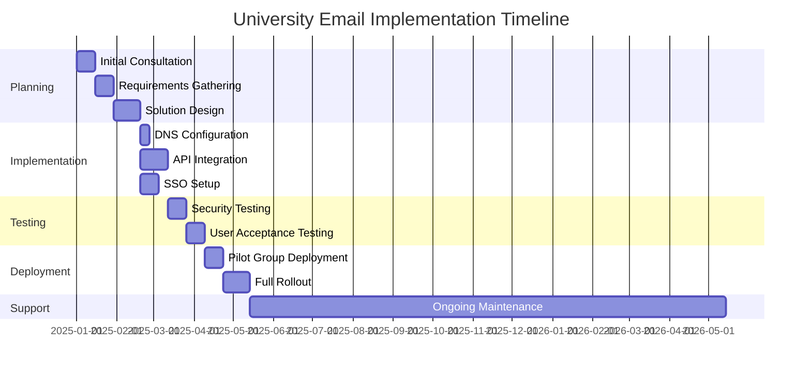
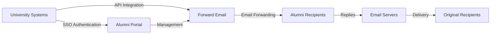

# Vaka Çalışması: Forward Email'in En İyi Üniversiteler İçin Mezun E-Posta Çözümlerini Nasıl Güçlendirdiği {#case-study-how-forward-email-powers-alumni-email-solutions-for-top-universities}


## İçindekiler {#table-of-contents}

* [Önsöz](#foreword)
* [Sabit Fiyatlandırma ile Dramatik Maliyet Tasarrufları](#dramatic-cost-savings-with-stable-pricing)
  * [Gerçek Dünya Üniversite Tasarrufları](#real-world-university-savings)
* [Üniversite Mezun E-Posta Zorluğu](#the-university-alumni-email-challenge)
  * [Mezun E-Posta Kimliğinin Değeri](#the-value-of-alumni-email-identity)
  * [Geleneksel Çözümler Yetersiz Kalıyor](#traditional-solutions-fall-short)
  * [Forward Email Çözümü](#the-forward-email-solution)
* [Teknik Uygulama: Nasıl Çalışır](#technical-implementation-how-it-works)
  * [Temel Mimari](#core-architecture)
  * [Üniversite Sistemleri ile Entegrasyon](#integration-with-university-systems)
  * [API Tabanlı Yönetim](#api-driven-management)
  * [DNS Yapılandırması ve Doğrulama](#dns-configuration-and-verification)
  * [Test ve Kalite Güvencesi](#testing-and-quality-assurance)
* [Uygulama Zaman Çizelgesi](#implementation-timeline)
* [Uygulama Süreci: Taşınmadan Bakıma](#implementation-process-from-migration-to-maintenance)
  * [İlk Değerlendirme ve Planlama](#initial-assessment-and-planning)
  * [Taşıma Stratejisi](#migration-strategy)
  * [Teknik Kurulum ve Yapılandırma](#technical-setup-and-configuration)
  * [Kullanıcı Deneyimi Tasarımı](#user-experience-design)
  * [Eğitim ve Dokümantasyon](#training-and-documentation)
  * [Sürekli Destek ve Optimizasyon](#ongoing-support-and-optimization)
* [Vaka Çalışması: Cambridge Üniversitesi](#case-study-university-of-cambridge)
  * [Zorluk](#challenge)
  * [Çözüm](#solution)
  * [Sonuçlar](#results)
* [Üniversiteler ve Mezunlar İçin Faydalar](#benefits-for-universities-and-alumni)
  * [Üniversiteler İçin](#for-universities)
  * [Mezunlar İçin](#for-alumni)
  * [Mezunlar Arasında Benimsenme Oranları](#adoption-rates-among-alumni)
  * [Önceki Çözümlere Kıyasla Maliyet Tasarrufları](#cost-savings-compared-to-previous-solutions)
* [Güvenlik ve Gizlilik Hususları](#security-and-privacy-considerations)
  * [Veri Koruma Önlemleri](#data-protection-measures)
  * [Uyumluluk Çerçevesi](#compliance-framework)
* [Gelecek Gelişmeler](#future-developments)
* [Sonuç](#conclusion)


## Önsöz {#foreword}

Dünyanın en prestijli üniversiteleri ve mezunları için dünyanın en güvenli, özel ve esnek e-posta yönlendirme hizmetini oluşturduk.

Yükseköğretim alanındaki rekabetçi ortamda, mezunlarla ömür boyu bağlantılar kurmak sadece bir gelenek meselesi değil—stratejik bir zorunluluktur. Üniversitelerin bu bağlantıları güçlendirmesinin en somut yollarından biri, mezunlara akademik miraslarını yansıtan dijital bir kimlik sağlayan mezun e-posta adresleri sunmaktır.

Forward Email olarak, dünyanın en prestijli eğitim kurumlarından bazılarıyla ortaklık kurarak mezun e-posta hizmetlerini yönetme biçimlerini devrim niteliğinde değiştirdik. Kurumsal düzeydeki e-posta yönlendirme çözümümüz, şimdi [University of Cambridge](https://en.wikipedia.org/wiki/University_of_Cambridge), [University of Maryland](https://en.wikipedia.org/wiki/University_of_Maryland,_College_Park), [Tufts University](https://en.wikipedia.org/wiki/Tufts_University) ve [Swarthmore College](https://en.wikipedia.org/wiki/Swarthmore_College) gibi kurumların mezun e-posta sistemlerini destekleyerek dünya çapında binlerce mezuna hizmet vermektedir.

Bu blog yazısı, [açık kaynaklı](https://en.wikipedia.org/wiki/Open-source_software), gizliliğe odaklı e-posta yönlendirme hizmetimizin bu kurumlar için neden tercih edilen çözüm haline geldiğini, mümkün kılan teknik uygulamaları ve hem idari verimlilik hem de mezun memnuniyeti üzerindeki dönüştürücü etkisini inceliyor.


## Sabit Fiyatlandırma ile Dramatik Maliyet Tasarrufları {#dramatic-cost-savings-with-stable-pricing}
Çözümümüzün finansal faydaları, özellikle geleneksel e-posta sağlayıcılarının sürekli artan fiyatlarıyla karşılaştırıldığında oldukça büyüktür:

| Çözüm                         | Mezun Başına Maliyet (Yıllık)                                                                             | 100.000 Mezun İçin Maliyet | Son Fiyat Artışları                                                                                                                                                                      |
| ------------------------------ | --------------------------------------------------------------------------------------------------------- | --------------------------- | ---------------------------------------------------------------------------------------------------------------------------------------------------------------------------------------- |
| Google Workspace for Business  | 72 $                                                                                                     | 7.200.000 $                 | • 2019: G Suite Basic 5 $'tan 6 $/aya (+%20)<br>• 2023: Esnek planlarda %20 artış<br>• 2025: Business Plus 18 $'tan 26,40 $/aya (+%47) yapay zeka özellikleri ile                        |
| Google Workspace for Education | Ücretsiz (Education Fundamentals)<br>Öğrenci başına 3 $/yıl (Education Standard)<br>Öğrenci başına 5 $/yıl (Education Plus) | Ücretsiz - 500.000 $        | • Hacim indirimleri: 100-499 lisans için %5<br>• Hacim indirimleri: 500+ lisans için %10<br>• Ücretsiz katman temel hizmetlerle sınırlı                                                     |
| Microsoft 365 Business         | 60 $                                                                                                     | 6.000.000 $                 | • 2023: Yılda iki kez fiyat güncellemeleri getirildi<br>• 2025 (Ocak): Personal 6,99 $'tan 9,99 $/aya (+%43) Copilot AI ile<br>• 2025 (Nisan): Aylık ödemeli yıllık taahhütlerde %5 artış |
| Microsoft 365 Education        | Ücretsiz (A1)<br>Fakülte başına 38-55 $/yıl (A3)<br>Fakülte başına 65-96 $/yıl (A5)                       | Ücretsiz - 96.000 $         | • Öğrenci lisansları genellikle fakülte alımlarıyla birlikte gelir<br>• Hacim lisanslaması ile özel fiyatlandırma<br>• Ücretsiz katman web sürümleri ile sınırlı                           |
| Self-Hosted Exchange           | 45 $                                                                                                     | 4.500.000 $                 | Sürekli bakım ve güvenlik maliyetleri artmaya devam ediyor                                                                                                                               |
| **Forward Email Enterprise**   | **Sabit 250 $/ay**                                                                                       | **3.000 $/yıl**             | **Lansmandan bu yana fiyat artışı yok**                                                                                                                                                   |

### Gerçek Dünya Üniversite Tasarrufları {#real-world-university-savings}

İşte partner üniversitelerimizin Forward Email'i geleneksel sağlayıcılar yerine seçerek yıllık ne kadar tasarruf ettikleri:

| Üniversite               | Mezun Sayısı | Google ile Yıllık Maliyet | Forward Email ile Yıllık Maliyet | Yıllık Tasarruf |
| ------------------------ | ------------ | ------------------------- | -------------------------------- | --------------- |
| Cambridge Üniversitesi   | 30.000       | 90.000 $                  | 3.000 $                          | 87.000 $        |
| Swarthmore Koleji        | 5.000        | 15.000 $                  | 3.000 $                          | 12.000 $        |
| Tufts Üniversitesi       | 12.000       | 36.000 $                  | 3.000 $                          | 33.000 $        |
| Maryland Üniversitesi    | 25.000       | 75.000 $                  | 3.000 $                          | 72.000 $        |

> \[!NOTE]
> Forward Email enterprise genellikle kullanıcı başına ekstra ücret olmadan ayda sadece 250 $ tutarındadır, beyaz listeye alınmış API hız sınırları vardır ve ek maliyet yalnızca öğrencilere ek GB/TB depolama gerekiyorsa (+10 GB ek depolama için 3 $). IMAP/POP3/SMTP/CalDAV/CardDAV için hızlı destek sağlamak amacıyla NVMe SSD sürücüler kullanıyoruz.
> \[!IMPORTANT]
> Google ve Microsoft'un aksine, verilerinizi analiz eden yapay zeka özelliklerini entegre ederken fiyatlarını defalarca artıran şirketlerin aksine, Forward Email sabit fiyatlandırmayı katı bir gizlilik odaklı yaklaşımla sürdürür. Yapay zeka kullanmıyoruz, kullanım kalıplarını takip etmiyoruz ve günlükleri veya e-postaları diske kaydetmiyoruz (tüm işlem bellekte yapılır), böylece mezun iletişimleriniz için tam gizlilik sağlıyoruz.

Bu, geleneksel e-posta barındırma çözümlerine kıyasla önemli bir maliyet azaltımı anlamına gelir—üniversitelerin bu fonları burslara, araştırmaya veya diğer misyon açısından kritik faaliyetlere yönlendirmesine olanak tanır. Email Vendor Selection tarafından 2023 yılında yapılan bir analiz, eğitim kurumlarının fiyatların yapay zeka özelliklerinin entegrasyonu ile artmaya devam etmesi nedeniyle geleneksel e-posta sağlayıcılarına kıyasla maliyet etkin alternatifler aradığını göstermektedir ([Email Vendor Selection, 2023](https://www.emailvendorselection.com/email-service-provider-list/)).


## Üniversite Mezunları E-posta Zorluğu {#the-university-alumni-email-challenge}

Üniversiteler için mezunlara ömür boyu e-posta adresleri sağlamak, geleneksel e-posta çözümlerinin etkili bir şekilde ele almakta zorlandığı benzersiz zorluklar sunar. ServerFault'ta kapsamlı bir tartışmada belirtildiği gibi, büyük kullanıcı tabanına sahip üniversiteler performans, güvenlik ve maliyet etkinliği arasında denge kuran özel e-posta çözümlerine ihtiyaç duyar ([ServerFault, 2009](https://serverfault.com/questions/97364/what-is-the-best-mail-server-for-a-university-with-a-large-amount-of-users)).

### Mezun E-posta Kimliğinin Değeri {#the-value-of-alumni-email-identity}

Mezun e-posta adresleri (örneğin `firstname.lastname@cl.cam.ac.uk` veya `username@terpalum.umd.edu`) birden çok önemli işlevi yerine getirir:

* Kurumsal bağlantı ve marka kimliğinin sürdürülmesi
* Üniversite ile sürekli iletişimin kolaylaştırılması
* Mezunlar için profesyonel güvenilirliğin artırılması
* Mezun ağları ve topluluk oluşturmanın desteklenmesi
* Stabil, ömür boyu iletişim noktası sağlanması

Tekade (2020) tarafından yapılan araştırma, eğitim e-posta adreslerinin mezunlara akademik kaynaklara erişim, profesyonel güvenilirlik ve çeşitli hizmetlerde özel indirimler gibi birçok fayda sağladığını vurgulamaktadır ([Medium, 2020](https://medium.com/coders-capsule/top-20-benefits-of-having-an-educational-email-address-91a09795e05)).

> \[!TIP]
> Üniversite mezunları e-posta hizmetleri hakkında kapsamlı kaynaklar, kurulum rehberleri, en iyi uygulamalar ve aranabilir mezun e-posta alanları dizini için yeni [AlumniEmail.com](https://alumniemail.com) dizinimizi ziyaret edin. Bu, tüm mezun e-posta bilgileri için merkezi bir merkez görevi görür.

### Geleneksel Çözümler Yetersiz Kalıyor {#traditional-solutions-fall-short}

Geleneksel e-posta sistemleri mezun e-posta ihtiyaçlarına uygulandığında birkaç sınırlama sunar:

* **Maliyet Engeli**: Kullanıcı başına lisanslama modelleri büyük mezun tabanları için finansal olarak sürdürülemez hale gelir
* **Yönetim Yükü**: Binlerce veya milyonlarca hesabın yönetimi önemli BT kaynakları gerektirir
* **Güvenlik Endişeleri**: Kullanılmayan hesapların güvenliğinin sağlanması savunmasızlığı artırır
* **Sınırlı Esneklik**: Katı sistemler mezun e-posta yönlendirmesinin benzersiz ihtiyaçlarına uyum sağlayamaz
* **Gizlilik Sorunları**: Birçok sağlayıcı reklam amaçlı e-posta içeriğini tarar

Quora'daki bir üniversite e-posta bakımı tartışması, güvenlik endişelerinin üniversitelerin mezun e-posta adreslerini sınırlamasının veya iptal etmesinin başlıca nedenlerinden biri olduğunu ortaya koymaktadır; kullanılmayan hesaplar hacklenme ve kimlik hırsızlığına karşı savunmasız olabilir ([Quora, 2011](https://www.quora.com/Is-there-any-cost-for-a-college-or-university-to-maintain-edu-e-mail-addresses)).

### Forward Email Çözümü {#the-forward-email-solution}

Yaklaşımımız bu zorlukları temelden farklı bir modelle ele alır:

* Barındırma yerine e-posta yönlendirme
* Kullanıcı başına maliyet yerine sabit ücretlendirme
* Şeffaflık ve güvenlik için açık kaynak mimarisi
* İçerik taraması olmayan gizlilik öncelikli tasarım
* Üniversite kimlik yönetimi için özel özellikler


## Teknik Uygulama: Nasıl Çalışır {#technical-implementation-how-it-works}
Çözümümüz, ölçeklenebilir, güvenilir ve güvenli e-posta yönlendirmesi sağlamak için sofistike ancak zarif ve basit bir teknik mimari kullanmaktadır.

### Temel Mimari {#core-architecture}

Forward Email sistemi birkaç temel bileşenden oluşur:

* Yüksek erişilebilirlik için dağıtılmış MX sunucuları
* Mesaj depolamadan gerçek zamanlı yönlendirme
* Kapsamlı e-posta kimlik doğrulama
* Özel alan adı ve alt alan adı desteği
* API tabanlı hesap yönetimi

ServerFault'taki BT profesyonellerine göre, kendi e-posta çözümlerini uygulamak isteyen üniversiteler için en iyi Mail Transfer Agent (MTA) olarak Postfix önerilirken, IMAP/POP3 erişimi için Courier veya Dovecot tercih edilmektedir ([ServerFault, 2009](https://serverfault.com/questions/97364/what-is-the-best-mail-server-for-a-university-with-a-large-amount-of-users)). Ancak, çözümümüz üniversitelerin bu karmaşık sistemleri kendilerinin yönetme ihtiyacını ortadan kaldırır.

### Üniversite Sistemleri ile Entegrasyon {#integration-with-university-systems}

Mevcut üniversite altyapısıyla sorunsuz entegrasyon yolları geliştirdik:

* [RESTful API](https://forwardemail.net/email-api) entegrasyonu ile otomatik sağlama
* Üniversite portalları için özel marka seçenekleri
* Bölümler ve organizasyonlar için esnek takma ad yönetimi
* Verimli yönetim için toplu işlemler

### API Tabanlı Yönetim {#api-driven-management}

[RESTful API](https://forwardemail.net/email-api) sayesinde üniversiteler e-posta yönetimini otomatikleştirebilir:

```javascript
// Örnek: Yeni bir mezun e-posta adresi oluşturma
const response = await fetch('https://forwardemail.net/api/v1/domains/example.edu/aliases', {
  method: 'POST',
  headers: {
    'Content-Type': 'application/json',
    'Authorization': `Basic ${Buffer.from(YOUR_API_TOKEN + ":").toString('base64')}`
  },
  body: JSON.stringify({
    name: 'alumni.john.smith',
    recipients: ['johnsmith@gmail.com'],
    has_recipient_verification: true
  })
});
```

### DNS Yapılandırması ve Doğrulama {#dns-configuration-and-verification}

Doğru DNS yapılandırması e-posta teslimatı için kritik öneme sahiptir. Ekibimiz şunlarda yardımcı olur:

* MX kayıtları dahil [DNS](https://en.wikipedia.org/wiki/Domain_Name_System) yapılandırması
* Açık kaynaklı [mailauth](https://www.npmjs.com/package/mailauth) paketimizi kullanarak kapsamlı e-posta güvenliği uygulaması; bu İsviçre çakısı niteliğindeki e-posta kimlik doğrulama aracı şunları yönetir:
  * E-posta sahtekarlığını önlemek için [SPF](https://en.wikipedia.org/wiki/Sender_Policy_Framework) (Gönderen Politikası Çerçevesi)
  * E-posta kimlik doğrulaması için [DKIM](https://en.wikipedia.org/wiki/DomainKeys_Identified_Mail) (DomainKeys Identified Mail)
  * Politika uygulaması için [DMARC](https://en.wikipedia.org/wiki/Email_authentication) (Domain-based Message Authentication, Reporting & Conformance)
  * TLS şifrelemesini zorunlu kılmak için [MTA-STS](https://en.wikipedia.org/wiki/Opportunistic_TLS) (SMTP MTA Strict Transport Security)
  * Mesajlar yönlendirildiğinde kimlik doğrulamanın korunması için [ARC](https://en.wikipedia.org/wiki/DomainKeys_Identified_Mail#Authenticated_Received_Chain) (Authenticated Received Chain)
  * Yönlendirme sırasında SPF doğrulamasını korumak için [SRS](https://en.wikipedia.org/wiki/Sender_Rewriting_Scheme) (Sender Rewriting Scheme)
  * Destekleyen e-posta istemcilerinde logo gösterimi için [BIMI](https://en.wikipedia.org/wiki/Email_authentication) (Brand Indicators for Message Identification)
* Alan adı sahipliği için DNS TXT kayıt doğrulaması

`mailauth` paketi (<http://npmjs.com/package/mailauth>), e-posta kimlik doğrulamanın tüm yönlerini tek entegre kütüphanede yöneten tamamen açık kaynaklı çözümdür. Tescilli çözümlerin aksine, bu yaklaşım şeffaflık, düzenli güvenlik güncellemeleri ve e-posta kimlik doğrulama süreci üzerinde tam kontrol sağlar.

### Test ve Kalite Güvencesi {#testing-and-quality-assurance}

Tam dağıtımdan önce kapsamlı testler yapıyoruz:

* Uçtan uca e-posta teslim testi
* Yüksek hacimli senaryolar için yük testi
* Güvenlik penetrasyon testi
* API entegrasyon doğrulaması
* Mezun temsilcileri ile kullanıcı kabul testi
## Uygulama Zaman Çizelgesi {#implementation-timeline}


```mermaid
gantt
    title University Email Implementation Timeline
    dateFormat  YYYY-MM-DD
    section Planning
    Initial Consultation           :a1, 2025-01-01, 14d
    Requirements Gathering         :a2, after a1, 14d
    Solution Design                :a3, after a2, 21d
    section Implementation
    DNS Configuration              :b1, after a3, 7d
    API Integration                :b2, after a3, 21d
    SSO Setup                      :b3, after a3, 14d
    section Testing
    Security Testing               :c1, after b1 b2 b3, 14d
    User Acceptance Testing        :c2, after c1, 14d
    section Deployment
    Pilot Group Deployment         :d1, after c2, 14d
    Full Rollout                   :d2, after d1, 21d
    section Support
    Ongoing Maintenance            :e1, after d2, 365d
```


## Uygulama Süreci: Taşınmadan Bakıma {#implementation-process-from-migration-to-maintenance}

Yapılandırılmış uygulama sürecimiz, üniversitelerin çözümümüzü benimserken sorunsuz bir geçiş yapmasını sağlar.

### İlk Değerlendirme ve Planlama {#initial-assessment-and-planning}

Üniversitenin mevcut e-posta sistemi, mezun veri tabanı ve teknik gereksinimleri kapsamlı bir şekilde değerlendirilir. Bu aşama şunları içerir:

* BT, mezun ilişkileri ve yönetim ile paydaş görüşmeleri
* Mevcut e-posta altyapısının teknik denetimi
* Mezun kayıtları için veri eşlemesi
* Güvenlik ve uyumluluk incelemesi
* Proje zaman çizelgesi ve kilometre taşı geliştirme

### Taşıma Stratejisi {#migration-strategy}

Değerlendirmeye dayanarak, kesintiyi en aza indirirken tam veri bütünlüğünü sağlayan özel bir taşıma stratejisi geliştirilir:

* Mezun gruplarına göre aşamalı taşıma yaklaşımı
* Geçiş sırasında paralel sistemlerin işletilmesi
* Kapsamlı veri doğrulama protokolleri
* Herhangi bir taşıma sorunu için geri dönüş prosedürleri
* Tüm paydaşlar için net iletişim planı

### Teknik Kurulum ve Yapılandırma {#technical-setup-and-configuration}

Teknik ekibimiz sistem kurulumunun tüm yönlerini yönetir:

* DNS yapılandırması ve doğrulaması
* Üniversite sistemleri ile API entegrasyonu
* Üniversite markasıyla özel portal geliştirme
* E-posta kimlik doğrulama kurulumu (SPF, DKIM, DMARC)

### Kullanıcı Deneyimi Tasarımı {#user-experience-design}

Üniversitelerle yakın çalışarak hem yöneticiler hem de mezunlar için sezgisel arayüzler oluşturuyoruz:

* Özel markalı mezun e-posta portalları
* Basitleştirilmiş e-posta yönlendirme yönetimi
* Mobil uyumlu tasarımlar
* Erişilebilirlik uyumluluğu
* Gerektiğinde çok dilli destek

### Eğitim ve Dokümantasyon {#training-and-documentation}

Kapsamlı eğitim, tüm paydaşların sistemi etkin şekilde kullanmasını sağlar:

* Yönetici eğitim oturumları
* BT personeli için teknik dokümantasyon
* Mezunlar için kullanıcı kılavuzları
* Yaygın görevler için video eğitimleri
* Bilgi tabanı geliştirme

### Sürekli Destek ve Optimizasyon {#ongoing-support-and-optimization}

Ortaklığımız uygulamanın çok ötesinde devam eder:

* 7/24 teknik destek
* Düzenli sistem güncellemeleri ve güvenlik yamaları
* Performans izleme ve optimizasyon
* E-posta en iyi uygulamaları danışmanlığı
* Veri analitiği ve raporlama


## Vaka Çalışması: Cambridge Üniversitesi {#case-study-university-of-cambridge}

Cambridge Üniversitesi, mezunlarına @cam.ac.uk e-posta adresleri sağlarken BT yükünü ve maliyetleri azaltacak bir çözüm arıyordu.

### Zorluk {#challenge}

Cambridge, önceki mezun e-posta sistemiyle ilgili birkaç zorlukla karşılaştı:

* Ayrı e-posta altyapısını sürdürmenin yüksek işletme maliyetleri
* Binlerce hesabın yönetiminde idari yük
* Kullanılmayan hesaplarla ilgili güvenlik endişeleri
* Mezun veri tabanı sistemleriyle sınırlı entegrasyon
* Artan depolama gereksinimleri

### Çözüm {#solution}

Forward Email kapsamlı bir çözüm uyguladı:

* Tüm @cam.ac.uk mezun adresleri için e-posta yönlendirme
* Mezunların kendi kendine hizmeti için özel markalı portal
* Cambridge mezun veri tabanıyla API entegrasyonu
* Kapsamlı e-posta güvenliği uygulaması

### Sonuçlar {#results}

Uygulama önemli faydalar sağladı:
* Önceki çözüme kıyasla önemli maliyet azaltımı
* %99,9 e-posta teslimat güvenilirliği
* Otomasyon ile basitleştirilmiş yönetim
* Modern e-posta kimlik doğrulama ile artırılmış güvenlik
* Sistem kullanılabilirliği hakkında olumlu mezun geri bildirimleri


## Üniversiteler ve Mezunlar için Faydalar {#benefits-for-universities-and-alumni}

Çözümümüz, hem kurumlar hem de mezunları için somut faydalar sunar.

### Üniversiteler için {#for-universities}

* **Maliyet Verimliliği**: Mezun sayısına bakılmaksızın sabit fiyatlandırma
* **Yönetim Kolaylığı**: API üzerinden otomatik yönetim
* **Gelişmiş Güvenlik**: Kapsamlı e-posta kimlik doğrulama
* **Marka Tutarlılığı**: Ömür boyu kurumsal e-posta adresleri
* **Mezun Katılımı**: Sürekli hizmetle güçlendirilmiş bağlantılar

BulkSignature (2023)'e göre, eğitim kurumları için e-posta platformları, ücretsiz veya düşük maliyetli planlar sayesinde maliyet etkinliği, toplu iletişim yetenekleriyle zaman tasarrufu ve e-posta teslimatı ile etkileşimini izleme özellikleri gibi önemli faydalar sunmaktadır ([BulkSignature, 2023](https://bulksignature.com/blog/5-best-email-platforms-for-educational-institutions/)).

### Mezunlar için {#for-alumni}

* **Profesyonel Kimlik**: Prestijli üniversite e-posta adresi
* **E-posta Sürekliliği**: Herhangi bir kişisel e-postaya yönlendirme
* **Gizlilik Koruması**: İçerik taraması veya veri madenciliği yok
* **Basitleştirilmiş Yönetim**: Kolay alıcı güncellemeleri
* **Gelişmiş Güvenlik**: Modern e-posta kimlik doğrulama

International Journal of Education & Literacy Studies tarafından yapılan araştırma, akademik ortamlarda doğru e-posta iletişiminin önemini vurgulamakta ve e-posta okuryazarlığının hem öğrenciler hem de mezunlar için profesyonel bağlamlarda kritik bir beceri olduğunu belirtmektedir ([IJELS, 2021](https://files.eric.ed.gov/fulltext/EJ1319324.pdf)).

### Mezunlar Arasında Benimsenme Oranları {#adoption-rates-among-alumni}

Üniversiteler, mezun toplulukları arasında yüksek benimsenme ve memnuniyet oranları bildirmektedir.

### Önceki Çözümlere Kıyasla Maliyet Tasarrufları {#cost-savings-compared-to-previous-solutions}

Mali etkisi önemli olmuş, üniversiteler önceki e-posta çözümlerine kıyasla kayda değer maliyet tasarrufları raporlamıştır.


## Güvenlik ve Gizlilik Hususları {#security-and-privacy-considerations}

Eğitim kurumları için mezun verilerinin korunması sadece iyi bir uygulama değil—Avrupa’daki GDPR gibi düzenlemeler kapsamında genellikle yasal bir zorunluluktur.

### Veri Koruma Önlemleri {#data-protection-measures}

Çözümümüz çok katmanlı güvenlik içerir:

* Tüm e-posta trafiği için uçtan uca şifreleme
* E-posta içeriğinin sunucularımızda depolanmaması
* Düzenli güvenlik denetimleri ve penetrasyon testleri
* Uluslararası veri koruma standartlarına uyum
* Güvenlik doğrulaması için şeffaf, açık kaynak kod

> \[!WARNING]
> Birçok e-posta sağlayıcısı, reklam amaçlı veya yapay zeka modellerini eğitmek için e-posta içeriğini tarar. Bu uygulama, özellikle profesyonel ve akademik iletişimlerde ciddi gizlilik endişeleri doğurur. Forward Email, e-posta içeriğini asla taramaz ve tüm e-postaları tamamen gizlilik sağlamak için bellekte işler.

### Uyumluluk Çerçevesi {#compliance-framework}

İlgili düzenlemelere sıkı uyum sağlıyoruz:

* Avrupa kurumları için GDPR uyumluluğu
* SOC 2 Tip II sertifikası
* Yıllık güvenlik değerlendirmeleri
* [forwardemail.net/dpa](https://forwardemail.net/dpa) adresinde bulunan Veri İşleme Sözleşmesi (DPA)
* Düzenlemeler geliştikçe düzenli uyumluluk güncellemeleri


## Gelecek Gelişmeler {#future-developments}

Mezun e-posta çözümümüzü yeni özellikler ve yeteneklerle geliştirmeye devam ediyoruz:

* Üniversite yöneticileri için geliştirilmiş analizler
* Gelişmiş oltalama korumaları
* Daha derin entegrasyon için genişletilmiş API yetenekleri
* Ek kimlik doğrulama seçenekleri


## Sonuç {#conclusion}

Forward Email, üniversitelerin mezun e-posta hizmetlerini sağlama ve yönetme şeklini devrim niteliğinde değiştirdi. Pahalı, karmaşık e-posta barındırmayı zarif, güvenli e-posta yönlendirme ile değiştirerek, kurumların tüm mezunlara ömür boyu e-posta adresleri sunmasını sağlarken maliyetleri ve yönetim yükünü dramatik şekilde azalttık.
Cambridge, Maryland, Tufts ve Swarthmore gibi prestijli kurumlarla yaptığımız ortaklıklar, yaklaşımımızın çeşitli eğitim ortamlarında ne kadar etkili olduğunu göstermektedir. Üniversiteler, mezun bağlantılarını sürdürürken maliyetleri kontrol altında tutma konusunda artan baskılarla karşı karşıya kalırken, çözümümüz geleneksel e-posta sistemlerine güçlü bir alternatif sunmaktadır.


```mermaid
flowchart LR
    A[University Systems] -->|API Integration| B[Forward Email]
    B -->|Email Forwarding| C[Alumni Recipients]
    C -->|Replies| D[Email Servers]
    D -->|Delivery| E[Original Recipients]
    F[Alumni Portal] -->|Management| B
    A -->|SSO Authentication| F
```

Mezun e-posta hizmetlerini Forward Email ile nasıl dönüştürebileceklerini keşfetmek isteyen üniversiteler, ekibimizle <support@forwardemail.net> adresinden iletişime geçebilir veya kurumsal çözümlerimiz hakkında daha fazla bilgi almak için [forwardemail.net](https://forwardemail.net) sitesini ziyaret edebilir.
