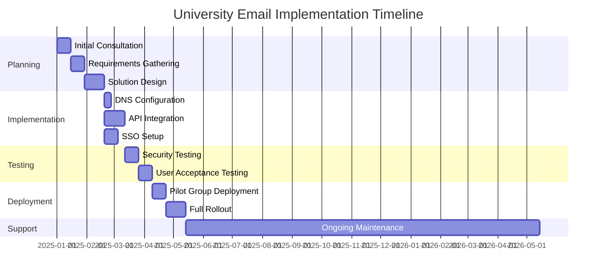
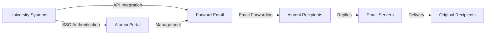

# Тематичне дослідження: Як пересилання електронної пошти допомагає випускникам провідних університетів використовувати рішення для електронної пошти {#case-study-how-forward-email-powers-alumni-email-solutions-for-top-universities}


## Зміст {#table-of-contents}

* [Передмова](#foreword)
* [Значна економія завдяки стабільній ціні](#dramatic-cost-savings-with-stable-pricing)
  * [Реальні університетські заощадження](#real-world-university-savings)
* [Виклик електронної пошти для випускників університету](#the-university-alumni-email-challenge)
  * [Цінність електронної пошти випускників](#the-value-of-alumni-email-identity)
  * [Традиційні рішення не підходять](#traditional-solutions-fall-short)
  * [Рішення для пересилання електронної пошти](#the-forward-email-solution)
* [Технічна реалізація: як це працює](#technical-implementation-how-it-works)
  * [Основна архітектура](#core-architecture)
  * [Інтеграція з університетськими системами](#integration-with-university-systems)
  * [Управління на основі API](#api-driven-management)
  * [Налаштування та перевірка DNS](#dns-configuration-and-verification)
  * [Тестування та гарантія якості](#testing-and-quality-assurance)
* [Графік впровадження](#implementation-timeline)
* [Процес впровадження: від міграції до обслуговування](#implementation-process-from-migration-to-maintenance)
  * [Початкова оцінка та планування](#initial-assessment-and-planning)
  * [Стратегія міграції](#migration-strategy)
  * [Технічне налаштування та конфігурація](#technical-setup-and-configuration)
  * [Дизайн взаємодії з користувачем](#user-experience-design)
  * [Навчання та документація](#training-and-documentation)
  * [Постійна підтримка та оптимізація](#ongoing-support-and-optimization)
* [Практичний приклад: Кембриджський університет](#case-study-university-of-cambridge)
  * [Виклик](#challenge)
  * [Рішення](#solution)
  * [Результати](#results)
* [Переваги для університетів і випускників](#benefits-for-universities-and-alumni)
  * [Для університетів](#for-universities)
  * [Для випускників](#for-alumni)
  * [Рівень усиновлення серед випускників](#adoption-rates-among-alumni)
  * [Економія коштів порівняно з попередніми рішеннями](#cost-savings-compared-to-previous-solutions)
* [Безпека та конфіденційність](#security-and-privacy-considerations)
  * [Заходи захисту даних](#data-protection-measures)
  * [Структура відповідності](#compliance-framework)
* [Майбутні розробки](#future-developments)
* [Висновок](#conclusion)

## Передмова {#foreword}

Ми створили найбезпечнішу, приватну та гнучку службу пересилання електронної пошти для престижних університетів та їхніх випускників.

У конкурентному середовищі вищої освіти підтримувати зв’язки з випускниками протягом усього життя – це не лише традиція, це стратегічний імператив. Один із найбільш відчутних способів розвитку цих зв’язків між університетами – це електронні адреси випускників, які надають випускникам цифрову ідентичність, яка відображає їхню академічну спадщину.

У Forward Email ми співпрацюємо з деякими з найпрестижніших навчальних закладів світу, щоб революціонізувати підхід до управління послугами електронної пошти випускників. Наше рішення для пересилання електронної пошти корпоративного рівня тепер працює на системах електронної пошти випускників [Кембриджський університет](https://en.wikipedia.org/wiki/University_of_Cambridge), [Університет штату Меріленд](https://en.wikipedia.org/wiki/University_of_Maryland,\_College_Park), [Університет Тафтса](https://en.wikipedia.org/wiki/Tufts_University) та [Коледж Свортмор](https://en.wikipedia.org/wiki/Swarthmore_College), разом обслуговуючи тисячі випускників по всьому світу.

У цій публікації блогу розповідається про те, як наш сервіс пересилання електронної пошти [з відкритим кодом](https://en.wikipedia.org/wiki/Open-source_software), орієнтований на конфіденційність, став бажаним рішенням для цих установ, про технічні впровадження, які це роблять можливим, та про трансформаційний вплив, який він мав як на адміністративну ефективність, так і на задоволеність випускників.

## Значна економія коштів завдяки стабільним цінам {#dramatic-cost-savings-with-stable-pricing}

Фінансові переваги нашого рішення значні, особливо в порівнянні з постійно зростаючими цінами традиційних постачальників електронної пошти:

| Рішення | Вартість випускника (річна) | Вартість для 100 000 випускників | Останні підвищення цін |
| ------------------------------ | --------------------------------------------------------------------------------------------------------- | ----------------------- | ---------------------------------------------------------------------------------------------------------------------------------------------------------------------------------------- |
| Google Workspace for Business | $72 | $7,200,000 | • 2019: G Suite Basic з 5 до 6 доларів США на місяць (+20%)<br>• 2023: Гнучкі плани зросли на 20%<br>• 2025: Business Plus з 18 до 26,40 доларів США на місяць (+47%) з функціями штучного інтелекту |
| Google Workspace for Education | Безкоштовно (Основи освіти)<br>$3/студент/рік (Стандарт освіти)<br>$5/студент/рік (Освіта Плюс) | Безкоштовно - 500 000 $ | • Знижки на опт: 5% для 100-499 ліцензій<br>• Знижки на опт: 10% для 500+ ліцензій<br>• Безкоштовний рівень обмежений основними послугами |
| Microsoft 365 Business | $60 | $6,000,000 | • 2023: Запроваджено оновлення цін двічі на рік<br>• 2025 (січень): Personal з $6.99 до $9.99/місяць (+43%) з Copilot AI<br>• 2025 (квітень): 5% збільшення річних зобов'язань, що сплачуються щомісяця |
| Microsoft 365 Education | Безкоштовно (A1)<br>$38-55/викладач/рік (A3)<br>$65-96/викладач/рік (A5) | Безкоштовно - 96 000 $ | • Студентські ліцензії часто включені до покупок для викладачів<br>• Індивідуальне ціноутворення через корпоративне ліцензування<br>• Безкоштовний рівень обмежений веб-версіями |
| Власна біржа | $45 | $4,500,000 | Витрати на поточне обслуговування та безпеку продовжують зростати |
| **Пересилання електронної пошти для підприємств** | **Фіксована оплата 250 доларів США/місяць** | **3000 доларів США/рік** | **З моменту запуску ціни не підвищувалися** |

### Знижки на навчання в реальному світі {#real-world-university-savings}

Ось скільки щорічно економлять наші університети-партнери, вибираючи Forward Email замість традиційних постачальників:

| університет | Граф випускників | Річна вартість з Google | Річна вартість із пересиланням електронної пошти | Річна економія |
| ----------------------- | ------------ | ----------------------- | ------------------------------ | -------------- |
| Кембриджський університет | 30,000 | $90,000 | $3,000 | $87,000 |
| Коледж Свортмор | 5,000 | $15,000 | $3,000 | $12,000 |
| Університет Тафтса | 12,000 | $36,000 | $3,000 | $33,000 |
| Університет штату Меріленд | 25,000 | $75,000 | $3,000 | $72,000 |

> \[!NOTE]
> Forward Email enterprise only costs $250/month typically, with no extra cost per user, whitelisted API rate limitations, and the only additional cost is storage if you need additional GB/TB for students (+$3 per 10 GB additional storage). We use NVMe SSD drives for fast support of IMAP/POP3/SMTP/CalDAV/CardDAV as well.

> \[!IMPORTANT]
> Unlike Google and Microsoft, who have repeatedly increased their prices while integrating AI features that analyze your data, Forward Email maintains stable pricing with a strict privacy focus. We don't use AI, don't track usage patterns, and don't store logs or emails to disk (all processing is done in-memory), ensuring complete privacy for your alumni communications.

Це являє собою значне зниження витрат порівняно з традиційними рішеннями для хостингу електронної пошти – кошти, які університети можуть перенаправляти на стипендії, дослідження чи інші критично важливі заходи. Згідно з аналізом, проведеним Email Vendor Selection за 2023 рік, навчальні заклади все частіше шукають економічно ефективні альтернативи традиційним постачальникам послуг електронної пошти, оскільки ціни продовжують зростати з інтеграцією функцій штучного інтелекту ([Вибір постачальника електронної пошти, 2023](https://www.emailvendorselection.com/email-service-provider-list/)).

## Електронний конкурс випускників університету {#the-university-alumni-email-challenge}

Для університетів надання випускникам довічних адрес електронної пошти створює унікальний набір проблем, з якими традиційні рішення електронної пошти не справляються ефективно. Як зазначалося у вичерпному обговоренні ServerFault, університети з великими базами користувачів потребують спеціалізованих рішень електронної пошти, які поєднують продуктивність, безпеку та економічну ефективність ([ServerFault, 2009](https://serverfault.com/questions/97364/what-is-the-best-mail-server-for-a-university-with-a-large-amount-of-users)).

### Цінність ідентифікації електронної пошти випускників {#the-value-of-alumni-email-identity}

Адреси електронної пошти випускників (наприклад, `firstname.lastname@cl.cam.ac.uk` або `username@terpalum.umd.edu`) виконують кілька важливих функцій:

* Підтримка зв'язків з установою та ідентичності бренду
* Сприяння постійному спілкуванню з університетом
* Підвищення професійної довіри до випускників
* Підтримка мереж випускників та розбудови спільноти
* Забезпечення стабільного контакту протягом усього життя

Дослідження Текаде (2020) підкреслює, що освітні електронні адреси надають випускникам численні переваги, включаючи доступ до академічних ресурсів, професійну авторитетність та ексклюзивні знижки на різні послуги ([Середній, 2020](https://medium.com/coders-capsule/top-20-benefits-of-having-an-educational-email-address-91a09795e05)).

> \[!TIP]
> Visit our new [AlumniEmail.com](https://alumniemail.com) directory for a comprehensive resource on university alumni email services, including setup guides, best practices, and a searchable directory of alumni email domains. It serves as a central hub for all alumni email information.

### Традиційні рішення не справляються {#traditional-solutions-fall-short}

Звичайні системи електронної пошти мають кілька обмежень щодо потреб випускників електронною поштою:

* **Непомірно висока вартість**: Моделі ліцензування на користувача стають фінансово невигідними для великих баз випускників
* **Адміністративне навантаження**: Управління тисячами або мільйонами облікових записів вимагає значних ІТ-ресурсів
* **Проблеми безпеки**: Підтримка безпеки неактивних облікових записів збільшує вразливість
* **Обмежена гнучкість**: Жорсткі системи не можуть адаптуватися до унікальних потреб пересилання електронної пошти випускників
* **Проблеми конфіденційності**: Багато постачальників сканують вміст електронної пошти для рекламних цілей

Обговорення на Quora щодо обслуговування університетської електронної пошти виявило, що проблеми безпеки є основною причиною, чому університети можуть обмежувати або скасовувати адреси електронної пошти випускників, оскільки невикористовувані облікові записи можуть бути вразливими до злому та крадіжки особистих даних ([Квора, 2011](https://www.quora.com/Is-there-any-cost-for-a-college-or-university-to-maintain-edu-e-mail-addresses)).

### Рішення для пересилання електронної пошти {#the-forward-email-solution}

Наш підхід вирішує ці проблеми за допомогою принципово іншої моделі:

* Пересилання електронної пошти замість хостингу
* Фіксована плата замість оплати за користувача
* Архітектура з відкритим кодом для прозорості та безпеки
* Дизайн, що орієнтований на конфіденційність, без сканування контенту
* Спеціалізовані функції для управління ідентифікацією університету

## Технічна реалізація: як це працює {#technical-implementation-how-it-works}

Наше рішення використовує складну, але елегантно просту технічну архітектуру для забезпечення надійної та безпечної пересилання електронної пошти в масштабі.

### Архітектура ядра {#core-architecture}

Система Forward Email складається з кількох ключових компонентів:

* Розподілені MX-сервери для високої доступності
* Переадресація в режимі реального часу без зберігання повідомлень
* Комплексна автентифікація електронної пошти
* Підтримка користувацьких доменів та піддоменів
* Керування обліковими записами на основі API

За словами ІТ-фахівців на ServerFault, для університетів, які прагнуть впровадити власні рішення для електронної пошти, Postfix рекомендується як найкращий агент передачі пошти (MTA), тоді як Courier або Dovecot є кращими для доступу IMAP/POP3 ([ServerFault, 2009](https://serverfault.com/questions/97364/what-is-the-best-mail-server-for-a-university-with-a-large-amount-of-users)). Однак наше рішення позбавляє університетів необхідності самостійно керувати цими складними системами.

### Інтеграція з університетськими системами {#integration-with-university-systems}

Ми розробили шляхи бездоганної інтеграції з існуючою інфраструктурою університету:

* Автоматизоване налаштування завдяки інтеграції [RESTful API](https://forwardemail.net/email-api)
* Варіанти брендування для університетських порталів
* Гнучке керування псевдонімами для кафедр та організацій
* Пакетні операції для ефективного адміністрування

### Керування на основі API {#api-driven-management}

Наше [RESTful API](https://forwardemail.net/email-api) дозволяє університетам автоматизувати управління електронною поштою:

```javascript
// Example: Creating a new alumni email address
const response = await fetch('https://forwardemail.net/api/v1/domains/example.edu/aliases', {
  method: 'POST',
  headers: {
    'Content-Type': 'application/json',
    'Authorization': `Basic ${Buffer.from(YOUR_API_TOKEN + ":").toString('base64')}`
  },
  body: JSON.stringify({
    name: 'alumni.john.smith',
    recipients: ['johnsmith@gmail.com'],
    has_recipient_verification: true
  })
});
```

### Налаштування та перевірка DNS {#dns-configuration-and-verification}

Правильна конфігурація DNS є критичною для доставки електронної пошти. Наша команда допомагає:

* [DNS](https://en.wikipedia.org/wiki/Domain_Name_System) конфігурація, включаючи записи MX
* Комплексна реалізація безпеки електронної пошти з використанням нашого пакета з відкритим кодом [mailauth](https://www.npmjs.com/package/mailauth), швейцарського ножа для автентифікації електронної пошти, який обробляє:
* [SPF](https://en.wikipedia.org/wiki/Sender_Policy_Framework) (Sender Policy Framework) для запобігання підробці електронної пошти
* [DKIM](https://en.wikipedia.org/wiki/DomainKeys_Identified_Mail) (DomainKeys Identified Mail) для автентифікації електронної пошти
* [DMARC](https://en.wikipedia.org/wiki/Email_authentication) (Domain-based Message Authentication, Reporting & Conformance) для забезпечення дотримання політик
* [MTA-STS](https://en.wikipedia.org/wiki/Opportunistic_TLS) (SMTP MTA Strict Transport Security) для забезпечення шифрування TLS
* [ARC](https://en.wikipedia.org/wiki/DomainKeys_Identified_Mail#Authenticated_Received_Chain) (Authenticated Received Chain) для підтримки автентифікації під час пересилання повідомлень
* [SRS](https://en.wikipedia.org/wiki/Sender_Rewriting_Scheme) (Sender Rewriting Scheme) для збереження перевірки SPF під час пересилання
* [BIMI](https://en.wikipedia.org/wiki/Email_authentication) (Brand Indicators for Message) Ідентифікація) для відображення логотипу в підтримуючих поштових клієнтах
* Перевірка запису DNS TXT для права власності на домен

Пакет `mailauth` (<http://npmjs.com/package/mailauth>) – це повністю відкрите рішення, яке обробляє всі аспекти автентифікації електронної пошти в одній інтегрованій бібліотеці. На відміну від власницьких рішень, цей підхід забезпечує прозорість, регулярні оновлення безпеки та повний контроль над процесом автентифікації електронної пошти.

### Тестування та забезпечення якості {#testing-and-quality-assurance}

Перед повним розгортанням ми проводимо ретельне тестування:

* Комплексне тестування доставки електронної пошти
* Тестування навантаження для сценаріїв з великим обсягом обробки
* Тестування на проникнення
* Перевірка інтеграції API
* Тестування прийняття користувачами за участю представників випускників

## Графік впровадження {#implementation-timeline}



## Процес впровадження: від міграції до обслуговування {#implementation-process-from-migration-to-maintenance}

Наш структурований процес впровадження забезпечує плавний перехід для університетів, які приймають наше рішення.

### Початкова оцінка та планування {#initial-assessment-and-planning}

Ми починаємо з комплексної оцінки поточної системи електронної пошти університету, бази даних випускників і технічних вимог. Цей етап включає:

* Інтерв'ю з зацікавленими сторонами, представниками ІТ-відділу, відділу зв'язків з випускниками та адміністрації
* Технічний аудит існуючої інфраструктури електронної пошти
* Відображення даних для записів випускників
* Перевірка безпеки та відповідності вимогам
* Розробка графіків проекту та етапів

### Стратегія міграції {#migration-strategy}

На основі оцінки ми розробляємо індивідуальну стратегію міграції, яка мінімізує збої, забезпечуючи повну цілісність даних:

* Поетапний підхід до міграції когортами випускників
* Паралельна робота систем під час переходу
* Комплексні протоколи перевірки даних
* Резервні процедури для будь-яких проблем з міграцією
* Чіткий план комунікації для всіх зацікавлених сторін

### Технічне налаштування та конфігурація {#technical-setup-and-configuration}

Наша технічна команда займається всіма аспектами налаштування системи:

* Налаштування та перевірка DNS
* Інтеграція API з університетськими системами
* Розробка користувацького порталу з брендуванням університету
* Налаштування автентифікації електронної пошти (SPF, DKIM, DMARC)

### Дизайн користувацького інтерфейсу {#user-experience-design}

Ми тісно співпрацюємо з університетами, щоб створити інтуїтивно зрозумілі інтерфейси як для адміністраторів, так і для випускників:

* Портали електронної пошти випускників з індивідуальним брендуванням
* Спрощене керування пересиланням електронної пошти
* Адаптивний дизайн для мобільних пристроїв
* Відповідність вимогам спеціальних можливостей
* Багатомовна підтримка за потреби

### Навчання та документація {#training-and-documentation}

Комплексне навчання гарантує, що всі зацікавлені сторони зможуть ефективно використовувати систему:

* Навчальні сесії для адміністраторів
* Технічна документація для ІТ-персоналу
* Посібники користувача для випускників
* Відеоуроки для виконання типових завдань
* Розробка бази знань

### Постійна підтримка та оптимізація {#ongoing-support-and-optimization}

Наше партнерство продовжується й після впровадження:

* Цілодобова технічна підтримка
* Регулярні оновлення системи та оновлення безпеки
* Моніторинг та оптимізація продуктивності
* Консультації щодо найкращих практик роботи з електронною поштою
* Аналіз даних та звітність

## Тематичне дослідження: Кембриджський університет {#case-study-university-of-cambridge}

Кембриджський університет шукав рішення, щоб надати випускникам електронні адреси @cam.ac.uk, одночасно зменшивши накладні витрати та витрати на ІТ.

### Виклик {#challenge}

Кембридж зіткнувся з кількома проблемами з попередньою системою електронної пошти для випускників:

* Високі операційні витрати на підтримку окремої інфраструктури електронної пошти
* Адміністративний тягар управління тисячами облікових записів
* Проблеми безпеки, пов'язані з неактивними обліковими записами
* Обмежена інтеграція з системами баз даних випускників
* Зростання вимог до зберігання даних

### Рішення {#solution}

Forward Email реалізував комплексне рішення:

* Переадресація електронної пошти для всіх адрес випускників @cam.ac.uk
* Портал самообслуговування випускників з індивідуальним брендом
* Інтеграція API з базою даних випускників Кембриджа
* Комплексне впровадження безпеки електронної пошти

Результати {###

Впровадження дало значні переваги:

* Істотне зниження витрат порівняно з попереднім рішенням
* Надійність доставки електронної пошти 99,9%
* Спрощене адміністрування завдяки автоматизації
* Покращена безпека завдяки сучасній автентифікації електронної пошти
* Позитивні відгуки випускників щодо зручності використання системи

## Переваги для університетів та випускників {#benefits-for-universities-and-alumni}

Наше рішення забезпечує відчутні переваги як для навчальних закладів, так і для їхніх випускників.

### Для університетів {#for-universities}

* **Економічна ефективність**: Фіксоване ціноутворення незалежно від кількості випускників
* **Адміністративна спрощеність**: Автоматизоване управління через API
* **Покращена безпека**: Комплексна автентифікація електронної пошти
* **Узгодженість бренду**: Довічні електронні адреси установи
* **Залучення випускників**: Зміцнення зв'язків завдяки постійному обслуговуванню

Згідно з BulkSignature (2023), платформи електронної пошти для освітніх закладів пропонують значні переваги, включаючи економічну ефективність завдяки безкоштовним або недорогим планам, ефективність використання часу завдяки можливостям масової комунікації та функції відстеження для моніторингу доставки електронної пошти та взаємодії ([BulkSignature, 2023](https://bulksignature.com/blog/5-best-email-platforms-for-educational-institutions/)).

### Для випускників {#for-alumni}

* **Професійна ідентичність**: престижна університетська електронна адреса
* **Безперервність електронної пошти**: пересилання на будь-який особистий лист
* **Захист конфіденційності**: відсутність сканування вмісту чи аналізу даних
* **Спрощене керування**: легке оновлення одержувачів
* **Покращена безпека**: сучасна автентифікація електронної пошти

Дослідження, опубліковане в Міжнародному журналі досліджень освіти та грамотності, підкреслює важливість належного спілкування електронною поштою в академічному середовищі, зазначаючи, що грамотність електронної пошти є ключовою навичкою як для студентів, так і для випускників у професійному контексті ([IJELS, 2021](https://files.eric.ed.gov/fulltext/EJ1319324.pdf)).

### Рівень усиновлення серед випускників {#adoption-rates-among-alumni}

Університети повідомляють про високий рівень прийняття та задоволеності серед своїх випускників.

### Економія коштів порівняно з попередніми рішеннями {#cost-savings-compared-to-previous-solutions}

Фінансовий вплив був значним, університети повідомили про значну економію коштів порівняно з попередніми рішеннями електронної пошти.

## Міркування щодо безпеки та конфіденційності {#security-and-privacy-considerations}

Для навчальних закладів захист даних випускників — це не просто хороша практика — це часто юридична вимога відповідно до нормативних актів, як-от GDPR у Європі.

### Заходи захисту даних {#data-protection-measures}

Наше рішення включає кілька рівнів безпеки:

* Наскрізне шифрування для всього електронного трафіку
* Відсутність зберігання вмісту електронної пошти на наших серверах
* Регулярні аудити безпеки та тестування на проникнення
* Відповідність міжнародним стандартам захисту даних
* Прозорий код з відкритим вихідним кодом для перевірки безпеки

> \[!WARNING]
> Many email providers scan email content for advertising purposes or to train AI models. This practice raises serious privacy concerns, especially for professional and academic communications. Forward Email never scans email content and processes all emails in-memory to ensure complete privacy.

### Структура відповідності {#compliance-framework}

Ми суворо дотримуємося відповідних норм:

* Відповідність GDPR для європейських установ
* Сертифікація SOC 2 Type II
* Щорічна оцінка безпеки
* Угода про обробку даних (DPA) доступна за адресою [forwardemail.net/dpa](https://forwardemail.net/dpa)
* Регулярні оновлення відповідності в міру розвитку нормативних актів

## Майбутні розробки {#future-developments}

Ми продовжуємо покращувати наше рішення електронної пошти для випускників новими функціями та можливостями:

* Покращена аналітика для адміністраторів університету
* Розширений захист від фішингу
* Розширені можливості API для глибшої інтеграції
* Додаткові опції автентифікації

## Висновок {#conclusion}

Forward Email революціонізував те, як університети надають та керують послугами електронної пошти для випускників. Замінивши дорогий і складний хостинг електронної пошти елегантним безпечним пересиланням електронної пошти, ми дозволили навчальним закладам пропонувати довічні адреси електронної пошти всім випускникам, значно скорочуючи витрати та адміністративні витрати.

Наше партнерство з такими престижними навчальними закладами, як Кембридж, Меріленд, Тафтс і Суортмор, демонструє ефективність нашого підходу до різних освітніх середовищ. Оскільки університети стикаються зі зростаючим тиском підтримувати зв’язки з випускниками, одночасно контролюючи витрати, наше рішення пропонує переконливу альтернативу традиційним системам електронної пошти.



Якщо університети зацікавлені в дослідженні того, як Forward Email може трансформувати їхні поштові служби випускників, зверніться до нашої команди за адресою <support@forwardemail.net> або відвідайте [forwardemail.net](https://forwardemail.net), щоб дізнатися більше про наші корпоративні рішення.