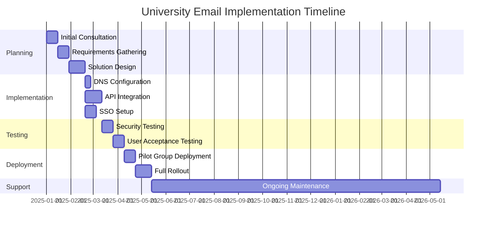
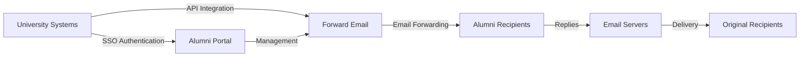

# Кейс: Як Forward Email забезпечує рішення для електронної пошти випускників провідних університетів {#case-study-how-forward-email-powers-alumni-email-solutions-for-top-universities}


## Зміст {#table-of-contents}

* [Передмова](#foreword)
* [Драматична економія коштів зі стабільними цінами](#dramatic-cost-savings-with-stable-pricing)
  * [Реальна економія університетів](#real-world-university-savings)
* [Виклик електронної пошти випускників університету](#the-university-alumni-email-challenge)
  * [Цінність ідентичності електронної пошти випускників](#the-value-of-alumni-email-identity)
  * [Традиційні рішення не справляються](#traditional-solutions-fall-short)
  * [Рішення Forward Email](#the-forward-email-solution)
* [Технічна реалізація: як це працює](#technical-implementation-how-it-works)
  * [Основна архітектура](#core-architecture)
  * [Інтеграція з університетськими системами](#integration-with-university-systems)
  * [Управління через API](#api-driven-management)
  * [Налаштування та перевірка DNS](#dns-configuration-and-verification)
  * [Тестування та забезпечення якості](#testing-and-quality-assurance)
* [Терміни впровадження](#implementation-timeline)
* [Процес впровадження: від міграції до підтримки](#implementation-process-from-migration-to-maintenance)
  * [Початкова оцінка та планування](#initial-assessment-and-planning)
  * [Стратегія міграції](#migration-strategy)
  * [Технічне налаштування та конфігурація](#technical-setup-and-configuration)
  * [Дизайн користувацького досвіду](#user-experience-design)
  * [Навчання та документація](#training-and-documentation)
  * [Постійна підтримка та оптимізація](#ongoing-support-and-optimization)
* [Кейс: Університет Кембриджу](#case-study-university-of-cambridge)
  * [Виклик](#challenge)
  * [Рішення](#solution)
  * [Результати](#results)
* [Переваги для університетів і випускників](#benefits-for-universities-and-alumni)
  * [Для університетів](#for-universities)
  * [Для випускників](#for-alumni)
  * [Рівень прийняття серед випускників](#adoption-rates-among-alumni)
  * [Економія коштів у порівнянні з попередніми рішеннями](#cost-savings-compared-to-previous-solutions)
* [Питання безпеки та конфіденційності](#security-and-privacy-considerations)
  * [Заходи захисту даних](#data-protection-measures)
  * [Рамки відповідності](#compliance-framework)
* [Майбутні розробки](#future-developments)
* [Висновок](#conclusion)


## Передмова {#foreword}

Ми створили найнадійніший, приватний та гнучкий сервіс переспрямування електронної пошти у світі для престижних університетів та їхніх випускників.

У конкурентному середовищі вищої освіти підтримка довічних зв’язків із випускниками — це не просто традиція, а стратегічна необхідність. Одним із найвідчутніших способів, якими університети підтримують ці зв’язки, є електронні адреси випускників, що надають випускникам цифрову ідентичність, яка відображає їхню академічну спадщину.

У Forward Email ми співпрацюємо з деякими з найпрестижніших освітніх закладів світу, щоб революціонізувати управління послугами електронної пошти для випускників. Наше корпоративне рішення для переспрямування електронної пошти тепер забезпечує роботу систем електронної пошти випускників для [Університету Кембриджу](https://en.wikipedia.org/wiki/University_of_Cambridge), [Університету Меріленду](https://en.wikipedia.org/wiki/University_of_Maryland,_College_Park), [Університету Тафтса](https://en.wikipedia.org/wiki/Tufts_University) та [Коледжу Свартмор](https://en.wikipedia.org/wiki/Swarthmore_College), обслуговуючи тисячі випускників по всьому світу.

У цьому дописі блогу ми розглянемо, як наш [відкритий код](https://en.wikipedia.org/wiki/Open-source_software), орієнтований на конфіденційність сервіс переспрямування електронної пошти став вибором цих установ, технічні реалізації, які це забезпечують, та трансформаційний вплив, який він має як на адміністративну ефективність, так і на задоволення випускників.


## Драматична економія коштів зі стабільними цінами {#dramatic-cost-savings-with-stable-pricing}
Фінансові переваги нашого рішення значні, особливо у порівнянні з постійно зростаючими цінами традиційних постачальників електронної пошти:

| Рішення                       | Вартість на одного випускника (річна)                                                                     | Вартість для 100 000 випускників | Останні підвищення цін                                                                                                                                                                  |
| ------------------------------ | --------------------------------------------------------------------------------------------------------- | ------------------------------- | ---------------------------------------------------------------------------------------------------------------------------------------------------------------------------------------- |
| Google Workspace for Business  | $72                                                                                                       | $7,200,000                      | • 2019: G Suite Basic з $5 до $6/місяць (+20%)<br>• 2023: Гнучкі плани зросли на 20%<br>• 2025: Business Plus з $18 до $26.40/місяць (+47%) з функціями ШІ                         |
| Google Workspace for Education | Безкоштовно (Education Fundamentals)<br>$3/студент/рік (Education Standard)<br>$5/студент/рік (Education Plus) | Безкоштовно - $500,000          | • Знижки за обсяг: 5% для 100-499 ліцензій<br>• Знижки за обсяг: 10% для 500+ ліцензій<br>• Безкоштовний рівень обмежений основними сервісами                                         |
| Microsoft 365 Business         | $60                                                                                                       | $6,000,000                      | • 2023: Введено оновлення цін двічі на рік<br>• 2025 (січень): Personal з $6.99 до $9.99/місяць (+43%) з Copilot AI<br>• 2025 (квітень): Збільшення на 5% для річних зобов’язань, сплачених щомісяця |
| Microsoft 365 Education        | Безкоштовно (A1)<br>$38-55/викладач/рік (A3)<br>$65-96/викладач/рік (A5)                                 | Безкоштовно - $96,000           | • Ліцензії для студентів часто включені у покупки для викладачів<br>• Індивідуальне ціноутворення через об’ємне ліцензування<br>• Безкоштовний рівень обмежений веб-версіями             |
| Self-Hosted Exchange           | $45                                                                                                       | $4,500,000                      | Постійні витрати на обслуговування та безпеку продовжують зростати                                                                                                                      |
| **Forward Email Enterprise**   | **Фіксована $250/місяць**                                                                                  | **$3,000/рік**                  | **З моменту запуску не було підвищень цін**                                                                                                                                              |

### Реальна економія університетів {#real-world-university-savings}

Ось скільки наші університети-партнери економлять щорічно, обираючи Forward Email замість традиційних постачальників:

| Університет              | Кількість випускників | Річна вартість з Google | Річна вартість з Forward Email | Річна економія |
| ----------------------- | --------------------- | ----------------------- | ------------------------------ | -------------- |
| University of Cambridge | 30,000                | $90,000                 | $3,000                         | $87,000        |
| Swarthmore College      | 5,000                 | $15,000                 | $3,000                         | $12,000        |
| Tufts University        | 12,000                | $36,000                 | $3,000                         | $33,000        |
| University of Maryland  | 25,000                | $75,000                 | $3,000                         | $72,000        |

> \[!NOTE]
> Forward Email enterprise зазвичай коштує лише $250/місяць, без додаткової плати за користувача, без обмежень на API з білого списку, і єдина додаткова вартість — це зберігання, якщо вам потрібні додаткові ГБ/ТБ для студентів (+$3 за кожні додаткові 10 ГБ). Ми використовуємо NVMe SSD-диски для швидкої підтримки IMAP/POP3/SMTP/CalDAV/CardDAV також.
> \[!IMPORTANT]
> На відміну від Google та Microsoft, які неодноразово підвищували свої ціни, інтегруючи функції ШІ, що аналізують ваші дані, Forward Email підтримує стабільні ціни з суворим акцентом на конфіденційність. Ми не використовуємо ШІ, не відстежуємо шаблони використання і не зберігаємо логи чи листи на диск (вся обробка відбувається в пам’яті), що гарантує повну конфіденційність ваших комунікацій з випускниками.

Це означає суттєве зниження витрат у порівнянні з традиційними рішеннями для хостингу електронної пошти — кошти, які університети можуть перенаправити на стипендії, дослідження або інші критично важливі для місії заходи. Згідно з аналізом Email Vendor Selection 2023 року, навчальні заклади все частіше шукають економічно вигідні альтернативи традиційним провайдерам електронної пошти, оскільки ціни продовжують зростати через інтеграцію функцій ШІ ([Email Vendor Selection, 2023](https://www.emailvendorselection.com/email-service-provider-list/)).


## Виклик електронної пошти для випускників університету {#the-university-alumni-email-challenge}

Для університетів надання довічних електронних адрес випускникам створює унікальний набір викликів, які традиційні рішення для електронної пошти не завжди можуть ефективно вирішити. Як зазначено в ґрунтовній дискусії на ServerFault, університети з великою кількістю користувачів потребують спеціалізованих рішень для електронної пошти, які збалансовують продуктивність, безпеку та економічність ([ServerFault, 2009](https://serverfault.com/questions/97364/what-is-the-best-mail-server-for-a-university-with-a-large-amount-of-users)).

### Цінність ідентичності електронної пошти випускника {#the-value-of-alumni-email-identity}

Електронні адреси випускників (наприклад, `firstname.lastname@cl.cam.ac.uk` або `username@terpalum.umd.edu`) виконують кілька важливих функцій:

* Підтримка зв’язку з установою та ідентичності бренду
* Сприяння постійній комунікації з університетом
* Підвищення професійної довіри випускників
* Підтримка мережі випускників та побудова спільноти
* Забезпечення стабільної, довічної контактної точки

Дослідження Текаде (2020) підкреслює, що освітні електронні адреси надають випускникам численні переваги, включно з доступом до академічних ресурсів, професійною довірою та ексклюзивними знижками на різні послуги ([Medium, 2020](https://medium.com/coders-capsule/top-20-benefits-of-having-an-educational-email-address-91a09795e05)).

> \[!TIP]
> Відвідайте наш новий каталог [AlumniEmail.com](https://alumniemail.com) для комплексного ресурсу про послуги електронної пошти для випускників університетів, включно з інструкціями з налаштування, найкращими практиками та пошуковим каталогом доменів електронної пошти випускників. Це слугує центральним хабом для всієї інформації про електронну пошту випускників.

### Традиційні рішення не справляються {#traditional-solutions-fall-short}

Звичайні системи електронної пошти мають кілька обмежень при застосуванні до потреб електронної пошти випускників:

* **Висока вартість**: моделі ліцензування за користувача стають фінансово невигідними для великої кількості випускників
* **Адміністративне навантаження**: управління тисячами або мільйонами акаунтів вимагає значних ІТ-ресурсів
* **Проблеми безпеки**: підтримка безпеки неактивних акаунтів підвищує вразливість
* **Обмежена гнучкість**: жорсткі системи не можуть адаптуватися до унікальних потреб переспрямування електронної пошти випускників
* **Проблеми конфіденційності**: багато провайдерів сканують вміст листів для рекламних цілей

Обговорення на Quora щодо підтримки університетської електронної пошти показує, що проблеми безпеки є основною причиною, через яку університети можуть обмежувати або скасовувати електронні адреси випускників, оскільки невикористані акаунти можуть бути вразливими до злому та крадіжки особистості ([Quora, 2011](https://www.quora.com/Is-there-any-cost-for-a-college-or-university-to-maintain-edu-e-mail-addresses)).

### Рішення Forward Email {#the-forward-email-solution}

Наш підхід вирішує ці виклики за допомогою принципово іншої моделі:

* Переспрямування електронної пошти замість хостингу
* Фіксована плата замість витрат за користувача
* Відкрита архітектура для прозорості та безпеки
* Конфіденційність на першому місці без сканування вмісту
* Спеціалізовані функції для управління ідентичністю університету


## Технічна реалізація: як це працює {#technical-implementation-how-it-works}
Наше рішення використовує складну, але елегантно просту технічну архітектуру для забезпечення надійного, безпечного пересилання електронної пошти у великому масштабі.

### Основна архітектура {#core-architecture}

Система Forward Email складається з кількох ключових компонентів:

* Розподілені MX сервери для високої доступності
* Пересилання в реальному часі без зберігання повідомлень
* Комплексна автентифікація електронної пошти
* Підтримка власних доменів і піддоменів
* Керування обліковими записами через API

За словами ІТ-фахівців на ServerFault, для університетів, які прагнуть впровадити власні поштові рішення, рекомендується Postfix як найкращий Mail Transfer Agent (MTA), а Courier або Dovecot — для доступу через IMAP/POP3 ([ServerFault, 2009](https://serverfault.com/questions/97364/what-is-the-best-mail-server-for-a-university-with-a-large-amount-of-users)). Однак наше рішення усуває необхідність для університетів самостійно керувати цими складними системами.

### Інтеграція з університетськими системами {#integration-with-university-systems}

Ми розробили безшовні шляхи інтеграції з існуючою інфраструктурою університету:

* Автоматизоване надання через інтеграцію з [RESTful API](https://forwardemail.net/email-api)
* Варіанти кастомізації бренду для університетських порталів
* Гнучке керування псевдонімами для факультетів та організацій
* Пакетні операції для ефективного адміністрування

### Керування через API {#api-driven-management}

Наш [RESTful API](https://forwardemail.net/email-api) дозволяє університетам автоматизувати керування електронною поштою:

```javascript
// Приклад: створення нової електронної адреси для випускників
const response = await fetch('https://forwardemail.net/api/v1/domains/example.edu/aliases', {
  method: 'POST',
  headers: {
    'Content-Type': 'application/json',
    'Authorization': `Basic ${Buffer.from(YOUR_API_TOKEN + ":").toString('base64')}`
  },
  body: JSON.stringify({
    name: 'alumni.john.smith',
    recipients: ['johnsmith@gmail.com'],
    has_recipient_verification: true
  })
});
```

### Налаштування DNS та перевірка {#dns-configuration-and-verification}

Правильне налаштування DNS є критично важливим для доставки електронної пошти. Наша команда допомагає з:

* Налаштуванням [DNS](https://en.wikipedia.org/wiki/Domain_Name_System), включно з MX записами
* Комплексною реалізацією безпеки електронної пошти за допомогою нашого відкритого пакету [mailauth](https://www.npmjs.com/package/mailauth), швейцарського ножа для автентифікації пошти, який підтримує:
  * [SPF](https://en.wikipedia.org/wiki/Sender_Policy_Framework) (Sender Policy Framework) для запобігання підробці пошти
  * [DKIM](https://en.wikipedia.org/wiki/DomainKeys_Identified_Mail) (DomainKeys Identified Mail) для автентифікації пошти
  * [DMARC](https://en.wikipedia.org/wiki/Email_authentication) (Domain-based Message Authentication, Reporting & Conformance) для застосування політик
  * [MTA-STS](https://en.wikipedia.org/wiki/Opportunistic_TLS) (SMTP MTA Strict Transport Security) для забезпечення шифрування TLS
  * [ARC](https://en.wikipedia.org/wiki/DomainKeys_Identified_Mail#Authenticated_Received_Chain) (Authenticated Received Chain) для збереження автентифікації при пересиланні повідомлень
  * [SRS](https://en.wikipedia.org/wiki/Sender_Rewriting_Scheme) (Sender Rewriting Scheme) для збереження валідації SPF при пересиланні
  * [BIMI](https://en.wikipedia.org/wiki/Email_authentication) (Brand Indicators for Message Identification) для відображення логотипу в підтримуваних поштових клієнтах
* Перевіркою DNS TXT записів для підтвердження власності домену

Пакет `mailauth` (<http://npmjs.com/package/mailauth>) є повністю відкритим рішенням, яке охоплює всі аспекти автентифікації електронної пошти в одній інтегрованій бібліотеці. На відміну від пропрієтарних рішень, цей підхід забезпечує прозорість, регулярні оновлення безпеки та повний контроль над процесом автентифікації пошти.

### Тестування та забезпечення якості {#testing-and-quality-assurance}

Перед повним розгортанням ми проводимо ретельне тестування:

* Тестування доставки електронної пошти від початку до кінця
* Навантажувальне тестування для сценаріїв з великим обсягом
* Тестування безпеки на проникнення
* Валідація інтеграції API
* Тестування прийнятності користувачами за участю представників випускників
## Графік впровадження {#implementation-timeline}


```mermaid
gantt
    title University Email Implementation Timeline
    dateFormat  YYYY-MM-DD
    section Planning
    Initial Consultation           :a1, 2025-01-01, 14d
    Requirements Gathering         :a2, after a1, 14d
    Solution Design                :a3, after a2, 21d
    section Implementation
    DNS Configuration              :b1, after a3, 7d
    API Integration                :b2, after a3, 21d
    SSO Setup                      :b3, after a3, 14d
    section Testing
    Security Testing               :c1, after b1 b2 b3, 14d
    User Acceptance Testing        :c2, after c1, 14d
    section Deployment
    Pilot Group Deployment         :d1, after c2, 14d
    Full Rollout                   :d2, after d1, 21d
    section Support
    Ongoing Maintenance            :e1, after d2, 365d
```


## Процес впровадження: від міграції до обслуговування {#implementation-process-from-migration-to-maintenance}

Наш структурований процес впровадження забезпечує плавний перехід для університетів, які приймають наше рішення.

### Початкова оцінка та планування {#initial-assessment-and-planning}

Ми починаємо з комплексної оцінки поточної системи електронної пошти університету, бази даних випускників та технічних вимог. Цей етап включає:

* Інтерв’ю з зацікавленими сторонами: ІТ, відділом зв’язків з випускниками та адміністрацією
* Технічний аудит існуючої інфраструктури електронної пошти
* Відображення даних для записів випускників
* Огляд безпеки та відповідності вимогам
* Розробка графіку проекту та ключових етапів

### Стратегія міграції {#migration-strategy}

На основі оцінки ми розробляємо індивідуальну стратегію міграції, яка мінімізує перебої та забезпечує повну цілісність даних:

* Поетапний підхід до міграції за когорти випускників
* Паралельна робота систем під час переходу
* Комплексні протоколи перевірки даних
* Процедури відкату у разі проблем з міграцією
* Чіткий план комунікації для всіх зацікавлених сторін

### Технічне налаштування та конфігурація {#technical-setup-and-configuration}

Наша технічна команда займається всіма аспектами налаштування системи:

* Конфігурація та перевірка DNS
* Інтеграція API з університетськими системами
* Розробка кастомізованого порталу з брендингом університету
* Налаштування автентифікації електронної пошти (SPF, DKIM, DMARC)

### Дизайн користувацького досвіду {#user-experience-design}

Ми тісно співпрацюємо з університетами для створення інтуїтивних інтерфейсів як для адміністраторів, так і для випускників:

* Портали електронної пошти випускників з індивідуальним брендингом
* Спрощене керування переадресацією електронної пошти
* Адаптивний дизайн для мобільних пристроїв
* Відповідність вимогам доступності
* Підтримка кількох мов за потреби

### Навчання та документація {#training-and-documentation}

Комплексне навчання забезпечує ефективне використання системи всіма зацікавленими сторонами:

* Сесії навчання для адміністраторів
* Технічна документація для ІТ-персоналу
* Керівництва для користувачів – випускників
* Відеоуроки для типових завдань
* Розробка бази знань

### Постійна підтримка та оптимізація {#ongoing-support-and-optimization}

Наше партнерство триває далеко за межами впровадження:

* Технічна підтримка 24/7
* Регулярні оновлення системи та патчі безпеки
* Моніторинг продуктивності та оптимізація
* Консультації щодо найкращих практик електронної пошти
* Аналітика даних та звітність


## Кейс: Університет Кембриджу {#case-study-university-of-cambridge}

Університет Кембриджу шукав рішення для надання адрес електронної пошти @cam.ac.uk випускникам, одночасно зменшуючи навантаження на ІТ та витрати.

### Виклик {#challenge}

Кембридж зіткнувся з кількома проблемами у своїй попередній системі електронної пошти для випускників:

* Високі операційні витрати на підтримку окремої інфраструктури електронної пошти
* Адміністративне навантаження з управління тисячами акаунтів
* Проблеми безпеки через неактивні акаунти
* Обмежена інтеграція з системами бази даних випускників
* Зростаючі вимоги до зберігання даних

### Рішення {#solution}

Forward Email впровадив комплексне рішення:

* Переадресація електронної пошти для всіх адрес випускників @cam.ac.uk
* Кастомізований портал для самообслуговування випускників
* Інтеграція API з базою даних випускників Кембриджу
* Комплексне впровадження безпеки електронної пошти

### Результати {#results}

Впровадження принесло значні переваги:
* Значне зниження витрат у порівнянні з попереднім рішенням
* 99,9% надійність доставки електронної пошти
* Спрощене адміністрування завдяки автоматизації
* Покращена безпека з сучасною автентифікацією електронної пошти
* Позитивні відгуки випускників щодо зручності системи


## Переваги для університетів та випускників {#benefits-for-universities-and-alumni}

Наше рішення приносить відчутні переваги як для установ, так і для їхніх випускників.

### Для університетів {#for-universities}

* **Ефективність витрат**: Фіксована ціна незалежно від кількості випускників
* **Адміністративна простота**: Автоматизоване управління через API
* **Покращена безпека**: Комплексна автентифікація електронної пошти
* **Послідовність бренду**: Поштова адреса установи на все життя
* **Залучення випускників**: Посилення зв’язків через постійне обслуговування

За даними BulkSignature (2023), платформи електронної пошти для освітніх установ пропонують значні переваги, включаючи економію коштів завдяки безкоштовним або недорогим тарифам, економію часу через можливості масових комунікацій та функції відстеження доставки та взаємодії з електронною поштою ([BulkSignature, 2023](https://bulksignature.com/blog/5-best-email-platforms-for-educational-institutions/)).

### Для випускників {#for-alumni}

* **Професійна ідентичність**: Престижна поштова адреса університету
* **Безперервність пошти**: Пересилання на будь-яку особисту електронну адресу
* **Захист приватності**: Відсутність сканування вмісту або добування даних
* **Спрощене управління**: Легке оновлення отримувачів
* **Покращена безпека**: Сучасна автентифікація електронної пошти

Дослідження Міжнародного журналу освіти та грамотності підкреслює важливість належної електронної комунікації в академічному середовищі, зазначаючи, що грамотність у користуванні електронною поштою є ключовою навичкою як для студентів, так і для випускників у професійному контексті ([IJELS, 2021](https://files.eric.ed.gov/fulltext/EJ1319324.pdf)).

### Рівень впровадження серед випускників {#adoption-rates-among-alumni}

Університети повідомляють про високі показники впровадження та задоволення серед своїх спільнот випускників.

### Економія коштів у порівнянні з попередніми рішеннями {#cost-savings-compared-to-previous-solutions}

Фінансовий вплив був значним, університети повідомляють про суттєву економію коштів у порівнянні з їхніми попередніми рішеннями для електронної пошти.


## Питання безпеки та конфіденційності {#security-and-privacy-considerations}

Для освітніх установ захист даних випускників — це не лише хороша практика, а часто й юридична вимога відповідно до регламентів, таких як GDPR у Європі.

### Заходи захисту даних {#data-protection-measures}

Наше рішення включає кілька рівнів безпеки:

* Кінцева шифрація для всього трафіку електронної пошти
* Відсутність зберігання вмісту електронної пошти на наших серверах
* Регулярні аудити безпеки та тестування на проникнення
* Відповідність міжнародним стандартам захисту даних
* Прозорий, відкритий код для перевірки безпеки

> \[!WARNING]
> Багато провайдерів електронної пошти сканують вміст листів для рекламних цілей або навчання моделей ШІ. Ця практика викликає серйозні занепокоєння щодо конфіденційності, особливо для професійних та академічних комунікацій. Forward Email ніколи не сканує вміст листів і обробляє всі листи в пам’яті, щоб забезпечити повну конфіденційність.

### Рамки відповідності {#compliance-framework}

Ми суворо дотримуємося відповідних нормативів:

* Відповідність GDPR для європейських установ
* Сертифікація SOC 2 Type II
* Щорічні оцінки безпеки
* Угода про обробку даних (DPA) доступна за адресою [forwardemail.net/dpa](https://forwardemail.net/dpa)
* Регулярні оновлення відповідності у міру розвитку нормативів


## Майбутні розробки {#future-developments}

Ми продовжуємо вдосконалювати наше рішення для електронної пошти випускників новими функціями та можливостями:

* Покращена аналітика для адміністраторів університетів
* Розширені засоби захисту від фішингу
* Розширені можливості API для глибшої інтеграції
* Додаткові варіанти автентифікації


## Висновок {#conclusion}

Forward Email революціонізував спосіб, яким університети надають та керують послугами електронної пошти для випускників. Замінюючи дорогий, складний хостинг електронної пошти на елегантне, безпечне пересилання, ми дозволили установам пропонувати поштова адреси на все життя всім випускникам, одночасно значно знижуючи витрати та адміністративне навантаження.
Наші партнерства з престижними установами, такими як Кембридж, Меріленд, Тафтс і Суортмор, демонструють ефективність нашого підходу в різноманітних освітніх середовищах. Оскільки університети стикаються з дедалі більшим тиском щодо підтримки зв’язків з випускниками при контролі витрат, наше рішення пропонує переконливу альтернативу традиційним системам електронної пошти.


```mermaid
flowchart LR
    A[University Systems] -->|API Integration| B[Forward Email]
    B -->|Email Forwarding| C[Alumni Recipients]
    C -->|Replies| D[Email Servers]
    D -->|Delivery| E[Original Recipients]
    F[Alumni Portal] -->|Management| B
    A -->|SSO Authentication| F
```

Для університетів, які зацікавлені у вивченні того, як Forward Email може трансформувати їхні послуги електронної пошти для випускників, зв’яжіться з нашою командою за адресою <support@forwardemail.net> або відвідайте [forwardemail.net](https://forwardemail.net), щоб дізнатися більше про наші корпоративні рішення.
