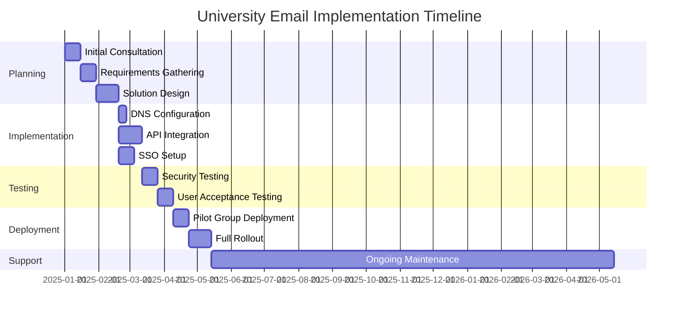
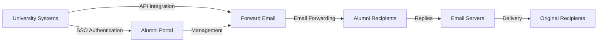

# Nghiên cứu điển hình: Cách Forward Email hỗ trợ giải pháp email cho cựu sinh viên tại các trường đại học hàng đầu {#case-study-how-forward-email-powers-alumni-email-solutions-for-top-universities}


## Mục lục {#table-of-contents}

* [Lời nói đầu](#foreword)
* [Tiết kiệm chi phí đáng kể với giá cả ổn định](#dramatic-cost-savings-with-stable-pricing)
  * [Tiết kiệm đại học thực tế](#real-world-university-savings)
* [Thử thách Email Cựu sinh viên Đại học](#the-university-alumni-email-challenge)
  * [Giá trị của danh tính email cựu sinh viên](#the-value-of-alumni-email-identity)
  * [Các giải pháp truyền thống không đạt yêu cầu](#traditional-solutions-fall-short)
  * [Giải pháp chuyển tiếp email](#the-forward-email-solution)
* [Triển khai kỹ thuật: Cách thức hoạt động](#technical-implementation-how-it-works)
  * [Kiến trúc cốt lõi](#core-architecture)
  * [Tích hợp với Hệ thống Đại học](#integration-with-university-systems)
  * [Quản lý theo API](#api-driven-management)
  * [Cấu hình và xác minh DNS](#dns-configuration-and-verification)
  * [Kiểm tra và đảm bảo chất lượng](#testing-and-quality-assurance)
* [Tiến độ thực hiện](#implementation-timeline)
* [Quy trình triển khai: Từ di chuyển đến bảo trì](#implementation-process-from-migration-to-maintenance)
  * [Đánh giá và lập kế hoạch ban đầu](#initial-assessment-and-planning)
  * [Chiến lược di cư](#migration-strategy)
  * [Thiết lập và cấu hình kỹ thuật](#technical-setup-and-configuration)
  * [Thiết kế trải nghiệm người dùng](#user-experience-design)
  * [Đào tạo và Tài liệu](#training-and-documentation)
  * [Hỗ trợ và tối ưu hóa liên tục](#ongoing-support-and-optimization)
* [Nghiên cứu điển hình: Đại học Cambridge](#case-study-university-of-cambridge)
  * [Thử thách](#challenge)
  * [Giải pháp](#solution)
  * [Kết quả](#results)
* [Lợi ích cho các trường đại học và cựu sinh viên](#benefits-for-universities-and-alumni)
  * [Dành cho các trường đại học](#for-universities)
  * [Dành cho cựu sinh viên](#for-alumni)
  * [Tỷ lệ chấp nhận trong số cựu sinh viên](#adoption-rates-among-alumni)
  * [Tiết kiệm chi phí so với các giải pháp trước đây](#cost-savings-compared-to-previous-solutions)
* [Cân nhắc về bảo mật và quyền riêng tư](#security-and-privacy-considerations)
  * [Các biện pháp bảo vệ dữ liệu](#data-protection-measures)
  * [Khung tuân thủ](#compliance-framework)
* [Những phát triển trong tương lai](#future-developments)
* [Phần kết luận](#conclusion)

## Lời nói đầu {#foreword}

Chúng tôi đã xây dựng dịch vụ chuyển tiếp email an toàn, riêng tư và linh hoạt nhất thế giới dành cho các trường đại học danh tiếng và cựu sinh viên của họ.

Trong bối cảnh cạnh tranh của giáo dục đại học, việc duy trì kết nối trọn đời với cựu sinh viên không chỉ là vấn đề truyền thống mà còn là một mệnh lệnh chiến lược. Một trong những cách hữu hình nhất mà các trường đại học thúc đẩy những kết nối này là thông qua địa chỉ email của cựu sinh viên, cung cấp cho sinh viên tốt nghiệp một danh tính kỹ thuật số phản ánh di sản học thuật của họ.

Tại Forward Email, chúng tôi đã hợp tác với một số tổ chức giáo dục uy tín nhất thế giới để cách mạng hóa cách họ quản lý dịch vụ email cựu sinh viên. Giải pháp chuyển tiếp email cấp doanh nghiệp của chúng tôi hiện đang hỗ trợ các hệ thống email cựu sinh viên cho [Đại học Cambridge](https://en.wikipedia.org/wiki/University_of_Cambridge), [Đại học Maryland](https://en.wikipedia.org/wiki/University_of_Maryland,\_College_Park), [Đại học Tufts](https://en.wikipedia.org/wiki/Tufts_University) và [Cao đẳng Swarthmore](https://en.wikipedia.org/wiki/Swarthmore_College), phục vụ hàng ngàn cựu sinh viên trên toàn thế giới.

Bài đăng trên blog này khám phá cách dịch vụ chuyển tiếp email [mã nguồn mở](https://en.wikipedia.org/wiki/Open-source_software) tập trung vào quyền riêng tư của chúng tôi đã trở thành giải pháp được các tổ chức này ưa chuộng, các triển khai kỹ thuật giúp dịch vụ này trở thành hiện thực và tác động mang tính chuyển đổi của dịch vụ này đối với hiệu quả hành chính và sự hài lòng của cựu sinh viên.

## Tiết kiệm chi phí đáng kể với mức giá ổn định {#dramatic-cost-savings-with-stable-pricing}

Lợi ích tài chính từ giải pháp của chúng tôi là rất đáng kể, đặc biệt khi so sánh với mức giá liên tục tăng của các nhà cung cấp email truyền thống:

| Giải pháp | Chi phí cho mỗi cựu sinh viên (Hàng năm) | Chi phí cho 100.000 cựu sinh viên | Giá tăng gần đây |
| ------------------------------ | --------------------------------------------------------------------------------------------------------- | ----------------------- | ---------------------------------------------------------------------------------------------------------------------------------------------------------------------------------------- |
| Google Workspace dành cho doanh nghiệp | $72 | $7,200,000 | • 2019: G Suite Basic từ 5 đô la lên 6 đô la/tháng (+20%)<br>• 2023: Các gói linh hoạt tăng 20%<br>• 2025: Business Plus từ 18 đô la lên 26,40 đô la/tháng (+47%) với các tính năng AI |
| Google Workspace dành cho Giáo dục | Miễn phí (Cơ bản về Giáo dục)<br>$3/học sinh/năm (Tiêu chuẩn Giáo dục)<br>$5/học sinh/năm (Giáo dục Nâng cao) | Miễn phí - 500.000 đô la | • Giảm giá theo số lượng: 5% cho 100-499 giấy phép<br>• Giảm giá theo số lượng: 10% cho 500+ giấy phép<br>• Gói miễn phí giới hạn cho các dịch vụ cốt lõi |
| Microsoft 365 Doanh nghiệp | $60 | $6,000,000 | • 2023: Giới thiệu bản cập nhật giá hai lần một năm<br>• 2025 (tháng 1): Cá nhân từ 6,99 đô la lên 9,99 đô la/tháng (+43%) với Copilot AI<br>• 2025 (tháng 4): Tăng 5% cho các cam kết hàng năm được thanh toán hàng tháng |
| Microsoft 365 Giáo dục | Miễn phí (A1)<br>$38-55/giảng viên/năm (A3)<br>$65-96/giảng viên/năm (A5) | Miễn phí - 96.000 đô la | • Giấy phép dành cho sinh viên thường được bao gồm trong giao dịch mua của giảng viên<br>• Giá tùy chỉnh thông qua cấp phép số lượng lớn<br>• Gói miễn phí giới hạn ở phiên bản web |
| Trao đổi tự lưu trữ | $45 | $4,500,000 | Chi phí bảo trì và an ninh liên tục tiếp tục tăng |
| **Chuyển tiếp Email Doanh nghiệp** | **Cố định 250 đô la/tháng** | **$3.000/năm** | **Không tăng giá kể từ khi ra mắt** |

### Tiết kiệm thực tế tại trường đại học {#real-world-university-savings}

Sau đây là số tiền các trường đại học đối tác của chúng tôi tiết kiệm được hàng năm khi chọn Forward Email thay vì các nhà cung cấp dịch vụ truyền thống:

| Trường đại học | Số lượng cựu sinh viên | Chi phí hàng năm với Google | Chi phí hàng năm với Email chuyển tiếp | Tiết kiệm hàng năm |
| ----------------------- | ------------ | ----------------------- | ------------------------------ | -------------- |
| Đại học Cambridge | 30,000 | $90,000 | $3,000 | $87,000 |
| Cao đẳng Swarthmore | 5,000 | $15,000 | $3,000 | $12,000 |
| Đại học Tufts | 12,000 | $36,000 | $3,000 | $33,000 |
| Đại học Maryland | 25,000 | $75,000 | $3,000 | $72,000 |

> \[!NOTE]
> Gói Chuyển tiếp Email Enterprise thường chỉ có giá 250 đô la/tháng, không tính thêm phí cho mỗi người dùng, không giới hạn tốc độ API trong danh sách trắng, và chi phí bổ sung duy nhất là dung lượng lưu trữ nếu bạn cần thêm GB/TB cho sinh viên (thêm 3 đô la cho mỗi 10 GB dung lượng lưu trữ bổ sung). Chúng tôi cũng sử dụng ổ SSD NVMe để hỗ trợ nhanh chóng IMAP/POP3/SMTP/CalDAV/CardDAV.

> \[!IMPORTANT]
> Không giống như Google và Microsoft, những công ty liên tục tăng giá trong khi tích hợp các tính năng AI phân tích dữ liệu của bạn, Forward Email duy trì mức giá ổn định với trọng tâm bảo mật nghiêm ngặt. Chúng tôi không sử dụng AI, không theo dõi thói quen sử dụng và không lưu trữ nhật ký hoặc email vào ổ đĩa (mọi quá trình xử lý đều được thực hiện trong bộ nhớ), đảm bảo quyền riêng tư hoàn toàn cho thông tin liên lạc của cựu sinh viên.

Điều này cho thấy mức giảm chi phí đáng kể so với các giải pháp lưu trữ email truyền thống - nguồn ngân sách mà các trường đại học có thể chuyển hướng sang học bổng, nghiên cứu hoặc các hoạt động quan trọng khác. Theo phân tích năm 2023 của Email Vendor Selection, các tổ chức giáo dục đang ngày càng tìm kiếm các giải pháp thay thế tiết kiệm chi phí hơn cho các nhà cung cấp email truyền thống khi giá cả tiếp tục tăng nhờ tích hợp các tính năng AI ([Lựa chọn nhà cung cấp qua email, 2023](https://www.emailvendorselection.com/email-service-provider-list/)).

## Thử thách Email Cựu sinh viên Đại học {#the-university-alumni-email-challenge}

Đối với các trường đại học, việc cung cấp địa chỉ email trọn đời cho cựu sinh viên đặt ra một loạt thách thức đặc thù mà các giải pháp email truyền thống khó có thể giải quyết hiệu quả. Như đã đề cập trong một cuộc thảo luận toàn diện trên ServerFault, các trường đại học có lượng người dùng lớn cần các giải pháp email chuyên biệt, cân bằng giữa hiệu suất, bảo mật và hiệu quả chi phí ([ServerFault, 2009](https://serverfault.com/questions/97364/what-is-the-best-mail-server-for-a-university-with-a-large-amount-of-users)).

### Giá trị của danh tính email cựu sinh viên {#the-value-of-alumni-email-identity}

Địa chỉ email của cựu sinh viên (như `firstname.lastname@cl.cam.ac.uk` hoặc `username@terpalum.umd.edu`) có nhiều chức năng quan trọng:

* Duy trì kết nối với tổ chức và nhận diện thương hiệu
* Tạo điều kiện thuận lợi cho việc giao tiếp liên tục với trường đại học
* Nâng cao uy tín nghề nghiệp cho sinh viên tốt nghiệp
* Hỗ trợ kết nối cựu sinh viên và xây dựng cộng đồng
* Cung cấp điểm liên lạc ổn định, trọn đời

Nghiên cứu của Tekade (2020) nhấn mạnh rằng địa chỉ email giáo dục mang lại nhiều lợi ích cho cựu sinh viên, bao gồm quyền truy cập vào các nguồn học thuật, uy tín chuyên môn và giảm giá độc quyền cho nhiều dịch vụ khác nhau ([Trung bình, 2020](https://medium.com/coders-capsule/top-20-benefits-of-having-an-educational-email-address-91a09795e05)).

> \[!TIP]
> Truy cập thư mục [AlumniEmail.com](https://alumniemail.com) mới của chúng tôi để có nguồn tài nguyên toàn diện về dịch vụ email cựu sinh viên đại học, bao gồm hướng dẫn thiết lập, các phương pháp hay nhất và danh mục tên miền email cựu sinh viên có thể tìm kiếm. Đây là trung tâm cho tất cả thông tin email cựu sinh viên.

### Các giải pháp truyền thống không hiệu quả {#traditional-solutions-fall-short}

Hệ thống email thông thường có một số hạn chế khi áp dụng cho nhu cầu email của cựu sinh viên:

* **Chi phí quá cao**: Mô hình cấp phép theo người dùng trở nên không bền vững về mặt tài chính đối với các cộng đồng cựu sinh viên lớn.
* **Gánh nặng hành chính**: Việc quản lý hàng nghìn hoặc hàng triệu tài khoản đòi hỏi nguồn lực CNTT đáng kể.
* **Mối quan ngại về bảo mật**: Việc duy trì bảo mật cho các tài khoản không hoạt động làm tăng nguy cơ bị tấn công.
* **Tính linh hoạt hạn chế**: Các hệ thống cứng nhắc không thể thích ứng với nhu cầu chuyển tiếp email đặc thù của cựu sinh viên.
* **Vấn đề về quyền riêng tư**: Nhiều nhà cung cấp quét nội dung email cho mục đích quảng cáo.

Một cuộc thảo luận trên Quora về việc bảo trì email của trường đại học cho thấy rằng lo ngại về bảo mật là lý do chính khiến các trường đại học có thể hạn chế hoặc hủy địa chỉ email của cựu sinh viên, vì các tài khoản không sử dụng có thể dễ bị tấn công và đánh cắp danh tính ([Quora, 2011](https://www.quora.com/Is-there-any-cost-for-a-college-or-university-to-maintain-edu-e-mail-addresses)).

### Giải pháp chuyển tiếp email {#the-forward-email-solution}

Cách tiếp cận của chúng tôi giải quyết những thách thức này thông qua một mô hình hoàn toàn khác:

* Chuyển tiếp email thay vì lưu trữ
* Giá cố định thay vì chi phí theo người dùng
* Kiến trúc nguồn mở đảm bảo tính minh bạch và bảo mật
* Thiết kế ưu tiên quyền riêng tư, không quét nội dung
* Các tính năng chuyên biệt cho quản lý danh tính đại học

## Triển khai kỹ thuật: Cách thức hoạt động {#technical-implementation-how-it-works}

Giải pháp của chúng tôi tận dụng kiến trúc kỹ thuật tinh vi nhưng đơn giản để cung cấp dịch vụ chuyển tiếp email đáng tin cậy và an toàn ở quy mô lớn.

### Kiến trúc lõi {#core-architecture}

Hệ thống Forward Email bao gồm một số thành phần chính:

* Máy chủ MX phân tán cho tính khả dụng cao
* Chuyển tiếp theo thời gian thực mà không cần lưu trữ tin nhắn
* Xác thực email toàn diện
* Hỗ trợ tên miền và tên miền phụ tùy chỉnh
* Quản lý tài khoản dựa trên API

Theo các chuyên gia CNTT trên ServerFault, đối với các trường đại học muốn triển khai giải pháp email riêng, Postfix được khuyến nghị là Mail Transfer Agent (MTA) tốt nhất, trong khi Courier hoặc Dovecot được ưu tiên cho truy cập IMAP/POP3 ([ServerFault, 2009](https://serverfault.com/questions/97364/what-is-the-best-mail-server-for-a-university-with-a-large-amount-of-users)). Tuy nhiên, giải pháp của chúng tôi giúp các trường đại học không cần phải tự quản lý các hệ thống phức tạp này.

### Tích hợp với Hệ thống Đại học {#integration-with-university-systems}

Chúng tôi đã phát triển các lộ trình tích hợp liền mạch với cơ sở hạ tầng hiện có của trường đại học:

* Tự động cung cấp thông qua tích hợp [API RESTful](https://forwardemail.net/email-api)
* Tùy chọn thương hiệu tùy chỉnh cho cổng thông tin đại học
* Quản lý bí danh linh hoạt cho các khoa và tổ chức
* Thao tác hàng loạt để quản trị hiệu quả

### Quản lý theo API {#api-driven-management}

[API RESTful](https://forwardemail.net/email-api) của chúng tôi cho phép các trường đại học tự động hóa việc quản lý email:

```javascript
// Example: Creating a new alumni email address
const response = await fetch('https://forwardemail.net/api/v1/domains/example.edu/aliases', {
  method: 'POST',
  headers: {
    'Content-Type': 'application/json',
    'Authorization': `Basic ${Buffer.from(YOUR_API_TOKEN + ":").toString('base64')}`
  },
  body: JSON.stringify({
    name: 'alumni.john.smith',
    recipients: ['johnsmith@gmail.com'],
    has_recipient_verification: true
  })
});
```

### Cấu hình và xác minh DNS {#dns-configuration-and-verification}

Cấu hình DNS phù hợp rất quan trọng cho việc gửi email. Đội ngũ của chúng tôi hỗ trợ:

* Cấu hình [DNS](https://en.wikipedia.org/wiki/Domain_Name_System) bao gồm bản ghi MX
* Triển khai bảo mật email toàn diện bằng gói [mailauth](https://www.npmjs.com/package/mailauth) mã nguồn mở của chúng tôi, một giải pháp toàn diện cho xác thực email, xử lý:
* [SPF](https://en.wikipedia.org/wiki/Sender_Policy_Framework) (Khung Chính sách Người gửi) để ngăn chặn giả mạo email
* [DKIM](https://en.wikipedia.org/wiki/DomainKeys_Identified_Mail) (Thư được Xác thực Khóa Miền) để xác thực email
* [DMARC](https://en.wikipedia.org/wiki/Email_authentication) (Xác thực, Báo cáo & Tuân thủ Thư dựa trên Tên miền) để thực thi chính sách
* [MTA-STS](https://en.wikipedia.org/wiki/Opportunistic_TLS) (Bảo mật Truyền tải Nghiêm ngặt SMTP MTA) để thực thi mã hóa TLS
* [ARC](https://en.wikipedia.org/wiki/DomainKeys_Identified_Mail#Authenticated_Received_Chain) (Chuỗi Đã Nhận Đã Xác thực) để duy trì xác thực khi thư được chuyển tiếp
* [SRS](https://en.wikipedia.org/wiki/Sender_Rewriting_Scheme) (Sơ đồ Viết lại Người gửi) để bảo toàn xác thực SPF trong quá trình chuyển tiếp
* [BIMI](https://en.wikipedia.org/wiki/Email_authentication) (Chỉ báo Thương hiệu để Nhận dạng Thư) để hiển thị logo trong các ứng dụng email được hỗ trợ
* Xác minh bản ghi DNS TXT để sở hữu tên miền

Gói `mailauth` (<http://npmjs.com/package/mailauth>) là giải pháp mã nguồn mở hoàn toàn, xử lý mọi khía cạnh của xác thực email trong một thư viện tích hợp. Không giống như các giải pháp độc quyền, phương pháp này đảm bảo tính minh bạch, cập nhật bảo mật thường xuyên và kiểm soát hoàn toàn quy trình xác thực email.

### Kiểm tra và Đảm bảo Chất lượng {#testing-and-quality-assurance}

Trước khi triển khai hoàn toàn, chúng tôi tiến hành thử nghiệm nghiêm ngặt:

* Kiểm tra khả năng gửi email từ đầu đến cuối
* Kiểm tra tải cho các tình huống khối lượng lớn
* Kiểm tra xâm nhập bảo mật
* Xác thực tích hợp API
* Kiểm tra mức độ chấp nhận của người dùng với đại diện cựu sinh viên

## Dòng thời gian triển khai {#implementation-timeline}



## Quy trình triển khai: Từ di chuyển đến bảo trì {#implementation-process-from-migration-to-maintenance}

Quy trình triển khai có cấu trúc của chúng tôi đảm bảo quá trình chuyển đổi suôn sẻ cho các trường đại học áp dụng giải pháp của chúng tôi.

### Đánh giá và lập kế hoạch ban đầu {#initial-assessment-and-planning}

Chúng tôi bắt đầu bằng việc đánh giá toàn diện hệ thống email hiện tại của trường, cơ sở dữ liệu cựu sinh viên và các yêu cầu kỹ thuật. Giai đoạn này bao gồm:

* Phỏng vấn các bên liên quan với bộ phận CNTT, quan hệ cựu sinh viên và hành chính
* Kiểm tra kỹ thuật cơ sở hạ tầng email hiện có
* Lập bản đồ dữ liệu cho hồ sơ cựu sinh viên
* Đánh giá bảo mật và tuân thủ
* Phát triển mốc thời gian và mốc quan trọng của dự án

### Chiến lược di chuyển {#migration-strategy}

Dựa trên đánh giá, chúng tôi xây dựng chiến lược di chuyển phù hợp giúp giảm thiểu gián đoạn đồng thời đảm bảo tính toàn vẹn của dữ liệu:

* Phương pháp di chuyển theo giai đoạn của nhóm cựu sinh viên
* Vận hành hệ thống song song trong quá trình chuyển đổi
* Giao thức xác thực dữ liệu toàn diện
* Quy trình dự phòng cho mọi vấn đề di chuyển
* Kế hoạch truyền thông rõ ràng cho tất cả các bên liên quan

### Thiết lập và cấu hình kỹ thuật {#technical-setup-and-configuration}

Đội ngũ kỹ thuật của chúng tôi xử lý mọi khía cạnh của việc thiết lập hệ thống:

* Cấu hình và xác minh DNS
* Tích hợp API với hệ thống trường đại học
* Phát triển cổng thông tin tùy chỉnh với thương hiệu trường đại học
* Thiết lập xác thực email (SPF, DKIM, DMARC)

### Thiết kế trải nghiệm người dùng {#user-experience-design}

Chúng tôi hợp tác chặt chẽ với các trường đại học để tạo ra giao diện trực quan cho cả người quản lý và cựu sinh viên:

* Cổng thông tin email cựu sinh viên được thiết kế riêng theo thương hiệu
* Quản lý chuyển tiếp email đơn giản
* Thiết kế tương thích với thiết bị di động
* Tuân thủ khả năng truy cập
* Hỗ trợ đa ngôn ngữ khi cần thiết

### Đào tạo và Tài liệu {#training-and-documentation}

Đào tạo toàn diện đảm bảo tất cả các bên liên quan có thể sử dụng hệ thống một cách hiệu quả:

* Các buổi đào tạo quản trị viên
* Tài liệu kỹ thuật cho nhân viên CNTT
* Hướng dẫn sử dụng cho cựu sinh viên
* Video hướng dẫn các tác vụ phổ biến
* Phát triển cơ sở kiến thức

### Hỗ trợ và tối ưu hóa đang diễn ra {#ongoing-support-and-optimization}

Quan hệ đối tác của chúng tôi tiếp tục phát triển vượt bậc sau khi triển khai:

* Hỗ trợ kỹ thuật 24/7
* Cập nhật hệ thống và bản vá bảo mật thường xuyên
* Giám sát và tối ưu hóa hiệu suất
* Tư vấn về các biện pháp tối ưu cho email
* Phân tích và báo cáo dữ liệu

## Nghiên cứu điển hình: Đại học Cambridge {#case-study-university-of-cambridge}

Đại học Cambridge đã tìm kiếm giải pháp cung cấp địa chỉ email @cam.ac.uk cho cựu sinh viên đồng thời giảm chi phí và gánh nặng CNTT.

### Thử thách {#challenge}

Cambridge đã phải đối mặt với một số thách thức với hệ thống email cựu sinh viên trước đây của họ:

* Chi phí vận hành cao khi duy trì cơ sở hạ tầng email riêng biệt
* Gánh nặng hành chính khi quản lý hàng nghìn tài khoản
* Mối lo ngại về bảo mật với các tài khoản không hoạt động
* Hạn chế tích hợp với hệ thống cơ sở dữ liệu cựu sinh viên
* Yêu cầu lưu trữ ngày càng tăng

### Giải pháp {#solution}

Forward Email đã triển khai một giải pháp toàn diện:

* Chuyển tiếp email cho tất cả địa chỉ cựu sinh viên @cam.ac.uk
* Cổng thông tin thương hiệu riêng dành cho cựu sinh viên tự phục vụ
* Tích hợp API với cơ sở dữ liệu cựu sinh viên của Cambridge
* Triển khai bảo mật email toàn diện

### Kết quả {#results}

Việc triển khai mang lại những lợi ích đáng kể:

* Giảm đáng kể chi phí so với giải pháp trước đây
* Độ tin cậy gửi email 99,9%
* Quản trị đơn giản hơn nhờ tự động hóa
* Bảo mật được tăng cường với xác thực email hiện đại
* Phản hồi tích cực của cựu sinh viên về khả năng sử dụng hệ thống

## Lợi ích dành cho các trường đại học và cựu sinh viên {#benefits-for-universities-and-alumni}

Giải pháp của chúng tôi mang lại lợi ích hữu hình cho cả tổ chức và sinh viên tốt nghiệp.

### Dành cho các trường đại học {#for-universities}

* **Hiệu quả chi phí**: Giá cố định bất kể số lượng cựu sinh viên
* **Đơn giản hóa quản trị**: Quản lý tự động thông qua API
* **Bảo mật nâng cao**: Xác thực email toàn diện
* **Nhất quán thương hiệu**: Địa chỉ email tổ chức trọn đời
* **Tương tác với cựu sinh viên**: Tăng cường kết nối thông qua dịch vụ hỗ trợ liên tục

Theo BulkSignature (2023), các nền tảng email dành cho các tổ chức giáo dục mang lại những lợi ích đáng kể, bao gồm hiệu quả về chi phí thông qua các gói miễn phí hoặc giá rẻ, hiệu quả về thời gian thông qua khả năng truyền thông đại chúng và các tính năng theo dõi để giám sát việc gửi và tương tác email ([BulkSignature, 2023](https://bulksignature.com/blog/5-best-email-platforms-for-educational-institutions/)).

### Dành cho cựu sinh viên {#for-alumni}

* **Nhận dạng Chuyên nghiệp**: Địa chỉ email đại học uy tín
* **Tiếp tục Email**: Chuyển tiếp đến bất kỳ email cá nhân nào
* **Bảo vệ Quyền riêng tư**: Không quét nội dung hoặc khai thác dữ liệu
* **Quản lý Đơn giản hóa**: Dễ dàng cập nhật người nhận
* **Bảo mật Nâng cao**: Xác thực email hiện đại

Nghiên cứu từ Tạp chí quốc tế về giáo dục và nghiên cứu văn học nhấn mạnh tầm quan trọng của việc giao tiếp qua email đúng cách trong môi trường học thuật, lưu ý rằng kỹ năng sử dụng email là một kỹ năng quan trọng đối với cả sinh viên và cựu sinh viên trong bối cảnh chuyên nghiệp ([IJELS, 2021](https://files.eric.ed.gov/fulltext/EJ1319324.pdf)).

### Tỷ lệ chấp nhận trong số cựu sinh viên {#adoption-rates-among-alumni}

Các trường đại học báo cáo tỷ lệ chấp nhận và hài lòng cao trong cộng đồng cựu sinh viên.

### Tiết kiệm chi phí so với các giải pháp trước đây {#cost-savings-compared-to-previous-solutions}

Tác động tài chính là rất đáng kể, khi các trường đại học báo cáo đã tiết kiệm được đáng kể chi phí so với các giải pháp email trước đây của họ.

## Cân nhắc về bảo mật và quyền riêng tư {#security-and-privacy-considerations}

Đối với các tổ chức giáo dục, việc bảo vệ dữ liệu cựu sinh viên không chỉ là một thông lệ tốt mà còn thường là yêu cầu pháp lý theo các quy định như GDPR ở Châu Âu.

### Biện pháp bảo vệ dữ liệu {#data-protection-measures}

Giải pháp của chúng tôi kết hợp nhiều lớp bảo mật:

* Mã hóa đầu cuối cho toàn bộ lưu lượng email
* Không lưu trữ nội dung email trên máy chủ của chúng tôi
* Kiểm tra bảo mật và kiểm tra xâm nhập thường xuyên
* Tuân thủ các tiêu chuẩn bảo vệ dữ liệu quốc tế
* Mã nguồn mở, minh bạch để xác minh bảo mật

> \[!WARNING]
> Nhiều nhà cung cấp dịch vụ email quét nội dung email cho mục đích quảng cáo hoặc để đào tạo các mô hình AI. Việc này gây ra những lo ngại nghiêm trọng về quyền riêng tư, đặc biệt là đối với các giao tiếp chuyên nghiệp và học thuật. Forward Email không bao giờ quét nội dung email và xử lý tất cả email trong bộ nhớ để đảm bảo quyền riêng tư hoàn toàn.

### Khung tuân thủ {#compliance-framework}

Chúng tôi duy trì việc tuân thủ nghiêm ngặt các quy định có liên quan:

* Tuân thủ GDPR cho các tổ chức châu Âu
* Chứng nhận SOC 2 Loại II
* Đánh giá bảo mật hàng năm
* Thỏa thuận Xử lý Dữ liệu (DPA) có sẵn tại [forwardemail.net/dpa](https://forwardemail.net/dpa)
* Cập nhật tuân thủ thường xuyên khi các quy định thay đổi

## Các phát triển trong tương lai {#future-developments}

Chúng tôi tiếp tục cải tiến giải pháp email dành cho cựu sinh viên với các tính năng và khả năng mới:

* Phân tích nâng cao dành cho quản trị viên trường đại học
* Bảo vệ chống lừa đảo nâng cao
* Mở rộng khả năng API để tích hợp sâu hơn
* Tùy chọn xác thực bổ sung

## Kết luận {#conclusion}

Forward Email đã cách mạng hóa cách các trường đại học cung cấp và quản lý dịch vụ email cựu sinh viên. Bằng cách thay thế dịch vụ lưu trữ email phức tạp, tốn kém bằng dịch vụ chuyển tiếp email an toàn, tinh tế, chúng tôi đã cho phép các tổ chức cung cấp địa chỉ email trọn đời cho tất cả cựu sinh viên, đồng thời giảm đáng kể chi phí và chi phí hành chính.

Quan hệ đối tác của chúng tôi với các tổ chức uy tín như Cambridge, Maryland, Tufts và Swarthmore chứng minh hiệu quả của phương pháp tiếp cận của chúng tôi trong nhiều môi trường giáo dục đa dạng. Khi các trường đại học phải đối mặt với áp lực ngày càng tăng trong việc duy trì kết nối cựu sinh viên mà vẫn kiểm soát chi phí, giải pháp của chúng tôi mang đến một giải pháp thay thế hấp dẫn cho các hệ thống email truyền thống.



Đối với các trường đại học muốn tìm hiểu cách Forward Email có thể chuyển đổi dịch vụ email dành cho cựu sinh viên, hãy liên hệ với nhóm của chúng tôi theo địa chỉ <support@forwardemail.net> hoặc truy cập [forwardemail.net](https://forwardemail.net) để tìm hiểu thêm về các giải pháp doanh nghiệp của chúng tôi.